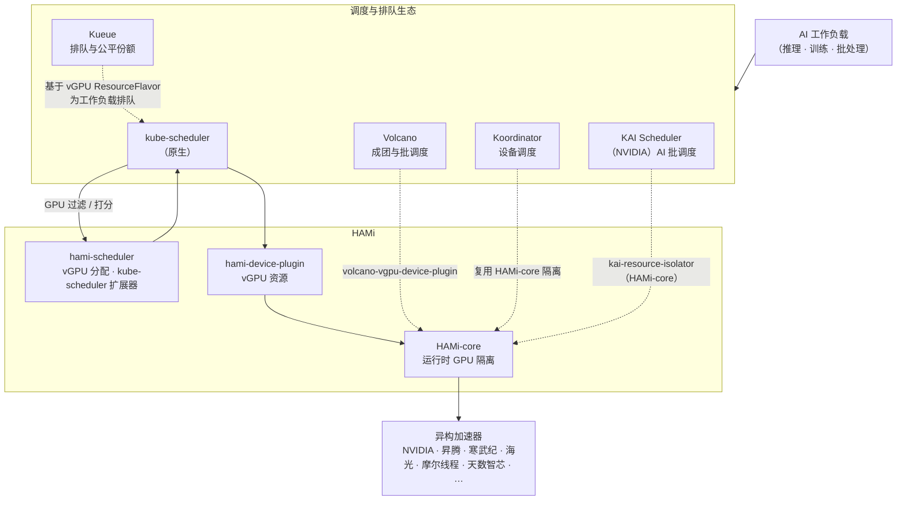

HAMi 并不会取代你现有的 Kubernetes 调度器，而是在它基础上做扩展。HAMi 负责的是 GPU 的虚拟化、共享和运行时隔离，并把自己接进更大的 Kubernetes 调度生态里，这样你就能把 **GPU 共享** 和 **批调度、作业排队、混部** 这些能力组合起来用。

这一页讲的是 HAMi 怎样和默认调度器，还有四个生态伙伴协同工作，分别是 **Volcano**、**Kueue**、**Koordinator**，以及 NVIDIA 的 **KAI Scheduler**。

## HAMi 的集成方式

HAMi 对外暴露三个角色，伙伴可以按需组合使用：

- **hami-scheduler** 作为 `kube-scheduler` 的扩展器（extender）注册进来，负责 vGPU 的分配决策，比如显存切分、算力限额、binpack 或 spread 策略。
- **hami-device-plugin** 负责向 `kubelet` 注册 vGPU 资源，并在 Pod 创建时完成设备挂载。
- **HAMi-core（`libvgpu.so`）** 在容器里拦截 CUDA、DCU 之类的调用，在运行时强制实现硬隔离和资源限额。

一个伙伴到底走哪条路，取决于它自己负责哪一层：要么走调度器扩展这条路，要么直接复用节点上的 HAMi-core 来做隔离。

## 集成伙伴

### 原生（默认）

开箱即用的时候，`kube-scheduler` 会把 GPU 的过滤和打分交给 `hami-scheduler`，共享和隔离则由 `hami-device-plugin` 和 HAMi-core 完成。这套组合覆盖的是单任务、彼此独立的调度场景，正好适合**在线推理**，不需要再装额外的调度器。

### Volcano：成团与批调度

[Volcano](https://github.com/volcano-sh/volcano) 带来了成团调度（一个作业里的所有 Pod 要么一起起来，要么都不起），还有多级队列优先级和公平份额，这些正是 **AI 训练** 需要的批处理能力。HAMi 通过 [`volcano-vgpu-device-plugin`](https://github.com/Project-HAMi/volcano-vgpu-device-plugin) 接入 Volcano，Volcano 负责调度 HAMi 管理的 vGPU，而 GPU 隔离仍然由 HAMi-core 来做。

- 安装：[使用 Volcano vGPU](../installation/how-to-use-volcano-vgpu.md)
- 指南与示例：[Volcano vGPU（NVIDIA GPU）](../userguide/volcano-vgpu/nvidia-gpu/how-to-use-volcano-vgpu.md)

### Kueue：作业排队与公平份额

[Kueue](https://kueue.sigs.k8s.io/) 架在默认调度器之上，通过 `ResourceFlavor` 和 `ClusterQueue` 来管理作业的准入、公平份额和配额。HAMi 暴露出来的 vGPU 资源会变成可以调度的 flavor，Kueue 可以排队后再放行。这样你不用换掉 `kube-scheduler`，就能在 GPU 共享之上叠一层**组间公平和配额约束**。

- 指南：[在 HAMi 上使用 Kueue](../userguide/kueue/how-to-use-kueue.md)
- 上游集成文档：[在 Kueue 中运行 HAMi 工作负载](https://kueue.sigs.k8s.io/docs/tasks/run/using_hami/)

### Koordinator：设备调度与混部

[Koordinator](https://koordinator.sh/) 擅长细粒度的设备调度和 CPU/GPU 混部。你只要在节点上部署好 HAMi-core，再按规范配好标签和资源请求，Koordinator 就会用 HAMi 的 GPU 隔离能力，让**多个 Pod 共享同一张 GPU**，而更上层的调度和混部决策还是交给 Koordinator。

- 上游集成文档：[在 Koordinator 中与 HAMi 共享 GPU](https://koordinator.sh/docs/user-manuals/device-scheduling-gpu-share-with-hami/)

### KAI Scheduler，NVIDIA 的 AI 批调度器

[KAI Scheduler](https://github.com/kai-scheduler/KAI-Scheduler) 是 NVIDIA 开源的、Kubernetes 原生的 AI 工作负载调度器。它脱胎于 Run:ai，以 Apache 2.0 协议开源，目前是 CNCF Sandbox 项目。它提供了 **PodGroup 成团调度**、**层级公平队列**、**GPU 分片共享（Fractional GPU）**、**拓扑感知放置**和**弹性工作负载**，这些都是 AI 训练需要、而默认调度器又没有的能力。

不过这里有个坑。KAI 的 GPU 分片共享是「协作式」的：调度器只保证所有请求加起来不超过单卡总量，并不会从物理上拦住某个 Pod 多吃显存。一个只请求 2 GiB 的容器，照样能通过 `nvidia-smi` 看到并使用整张 GPU 的显存。到了多租户的生产环境，这正是会咬你一口的地方。

HAMi-core 补上的就是这一块。**调度交给 KAI Scheduler，隔离交给 HAMi-core。** 这次集成用的是 HAMi-core 本身，不是整套 HAMi 平台，所以 KAI 仍然保留自己的调度器。你在 KAI Scheduler 里打开 `hamicore` 插件，它会注入 `CUDA_DEVICE_MEMORY_LIMIT`，然后再部署 [`kai-resource-isolator`](https://github.com/Project-HAMi/KAI-resource-isolator)。这个组件属于 HAMi 项目，它用 DaemonSet 把 HAMi-core 发到每个节点上，再通过 MutatingWebhook 注入库文件和 `ld.so.preload`。容器跑起来以后，`libvgpu.so` 会按这个上限强制执行，于是 `nvidia-smi` 里只会看到你分到的那一片。

- 上游指南：[KAI Scheduler 中的 HAMi 资源隔离](https://github.com/kai-scheduler/KAI-Scheduler/blob/main/docs/gpu-sharing/hami/README.md)
- 隔离组件：[kai-resource-isolator](https://github.com/Project-HAMi/KAI-resource-isolator)

## 怎么选

| 工作负载特征 | 推荐伙伴 | 在 HAMi 之上补充的能力 |
| --- | --- | --- |
| 在线推理、独立任务 | 原生（`kube-scheduler` + HAMi） | 不需要额外组件 |
| 分布式训练、要么全起要么不起 | Volcano | 成团调度、批处理队列、多级优先级 |
| 多团队共享集群、需要配额 | Kueue | 作业排队、公平份额、组配额 |
| CPU/GPU 混部、细粒度设备调度 | Koordinator | 混部、设备感知调度 |
| NVIDIA 技术栈、成团调度的训练或批处理、需要硬隔离 | KAI Scheduler | NVIDIA 原生的成团调度、公平队列、GPU 分片，外加 HAMi-core 硬隔离 |

> HAMi 自带的两级 `nvidia.com/priority` 是一种**运行时**抢占机制，作用范围是单张 GPU。如果你要对一整列作业做**调度级**的多级优先，那就把 HAMi 和上面任意一个伙伴组合起来用。细节可以看 [FAQ](../faq/faq.md)。
