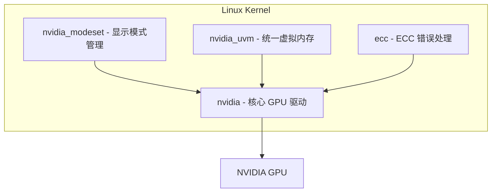
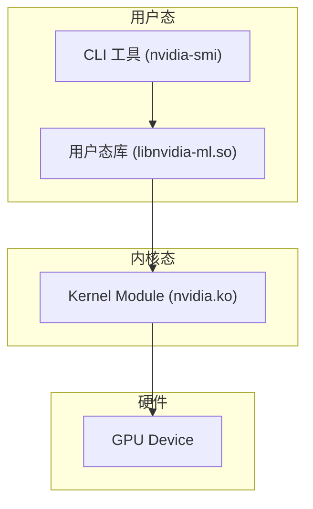

在使用 GPU 之前，首先需要确认 GPU 驱动是否正确加载到内核中。本文介绍如何检查 GPU 驱动状态以及理解 NVIDIA 内核模块的架构。

## 检查 GPU 驱动状态

使用以下命令检查 NVIDIA 内核模块是否已加载：

```bash
lsmod | grep nvidia
```

输出示例：

```plaintext
nvidia_uvm           1589299  0
nvidia_modeset       1240365  0
nvidia_drm             81923  0
nvidia              62372776  19 nvidia_uvm,nvidia_modeset
ecc                   45056  0
```

每一行代表一个已加载的内核模块，各列含义为：模块名称、内存大小（字节）、使用计数、依赖模块。

## NVIDIA 内核模块层级

NVIDIA 驱动由多个内核模块组成，它们之间存在依赖关系：



### 各模块的作用

| 模块 | 文件 | 说明 |
| --- | --- | --- |
| **nvidia** | `nvidia.ko` | 核心 GPU 驱动模块，负责 GPU 硬件初始化、显存管理、命令队列调度等基础功能。所有其他 NVIDIA 模块都依赖它。 |
| **nvidia_uvm** | `nvidia_uvm.ko` | Unified Virtual Memory（统一虚拟内存），使 CPU 和 GPU 共享同一地址空间。CUDA 程序使用 `cudaMallocManaged` 时依赖此模块，驱动自动在 CPU 和 GPU 之间迁移数据。 |
| **nvidia_modeset** | `nvidia_modeset.ko` | 显示模式设置模块，负责管理显示输出（分辨率、刷新率等）。依赖 `nvidia_drm`（DRM 子系统接口）工作。 |
| **ecc** | `ecc.ko` | ECC（Error-Correcting Code）错误处理模块，用于数据中心级 GPU（如 A100、H100）的内存错误检测与纠正。消费级 GPU 通常不加载此模块。 |

## Linux 驱动架构

GPU 驱动遵循标准的 Linux 分层架构：用户态（User Space）通过库调用内核态（Kernel Space）的模块，最终操作硬件。



调用链路：

1. 用户运行 `nvidia-smi` 等 CLI 工具
2. CLI 工具调用用户态库 `libnvidia-ml.so`（NVIDIA Management Library）
3. 用户态库通过 `ioctl` 系统调用进入内核态
4. 内核模块 `nvidia.ko` 直接操作 GPU 硬件

## 为什么 lsmod 比 nvidia-smi 更基础

`nvidia-smi` 是用户态工具，它依赖用户态库和内核模块都正常工作才能运行。而 `lsmod | grep nvidia` 直接检查内核模块是否已加载，是更底层的诊断方式：

- 如果 `lsmod` 看不到 nvidia 模块，说明驱动未安装或内核模块未加载，此时 `nvidia-smi` 必然失败
- 如果 `lsmod` 能看到 nvidia 模块但 `nvidia-smi` 报错，说明问题在用户态库或权限层面

因此在排查 GPU 问题时，建议先从 `lsmod | grep nvidia` 开始确认内核模块状态，再使用 `nvidia-smi` 检查用户态是否正常。
