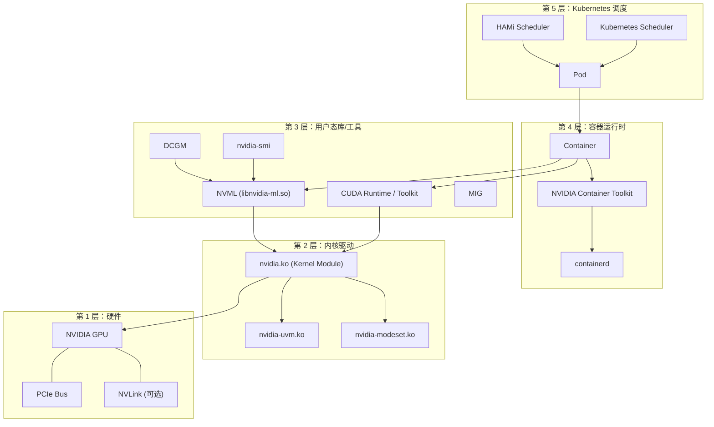
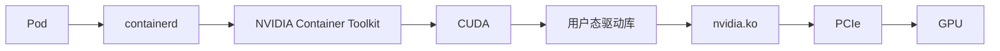
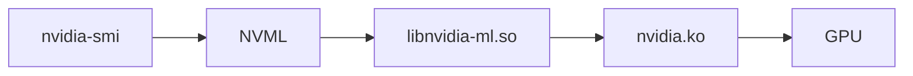
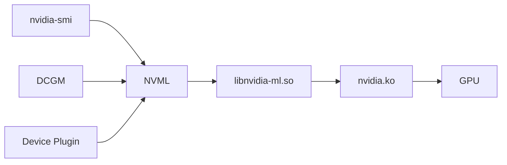
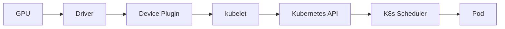
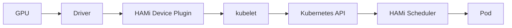

当你在一台服务器上使用 GPU 时，你面对的并不是单一的软件或硬件，而是围绕 NVIDIA GPU 构建的一整套**软件栈**。从最底层的物理硬件到最上层的 Kubernetes 调度，大致可以分为 5 层：

> **硬件层** → **Linux 内核驱动层** → **用户态库/工具层** → **容器运行时层** → **Kubernetes / HAMi 调度层**

理解这个分层结构，是排查 GPU 问题、理解 HAMi 工作原理的基础。

## 5 层架构总览

下图展示了 GPU 软件栈的完整分层结构：

## 各层详解

### 第 1 层：硬件层

物理硬件是一切的基础：

- **GPU**：NVIDIA GPU 芯片（如 A100、H100、L40 等），负责并行计算。
- **PCIe Bus**：GPU 通过 PCIe 插槽与 CPU 通信，是数据传输的主要通道。
- **NVLink**（可选）：多 GPU 之间的高速互联通道，带宽远高于 PCIe。

### 第 2 层：Linux 内核驱动层

内核驱动是用户态程序访问 GPU 的桥梁：

- **nvidia.ko**：NVIDIA 核心内核模块，管理 GPU 硬件资源、显存分配和命令提交。
- **nvidia-uvm.ko**：统一虚拟内存（Unified Virtual Memory）模块，支持 CPU 和 GPU 之间透明地共享内存地址空间。
- **nvidia-modeset.ko**：显示模式设置模块，用于 GPU 的图形输出管理。

内核驱动向上暴露 `/dev/nvidia*` 设备节点，用户态程序通过这些设备节点与 GPU 交互。

### 第 3 层：用户态库/工具层

这一层包含了开发者和管理员最常接触的工具和库：

- **CUDA**：NVIDIA 的并行计算平台和编程模型，包括编译器（nvcc）、运行时库和开发工具。几乎所有 GPU 应用都通过 CUDA 调用 GPU。
- **NVML（NVIDIA Management Library）**：GPU 管理库（`libnvidia-ml.so`），提供查询 GPU 状态（温度、显存、利用率等）的 API。`nvidia-smi`、DCGM 等工具都依赖它。
- **nvidia-smi**：命令行管理工具，用于查看 GPU 状态、进程、显存使用情况等。它是 NVML 的 CLI 前端。
- **DCGM（Data Center GPU Manager）**：数据中心 GPU 管理工具，提供健康状态监控、诊断、组管理等功能，适用于大规模 GPU 集群。
- **MIG（Multi-Instance GPU）**：多实例 GPU 技术，将一块 A100/H100 物理上划分为多个隔离的 GPU 实例，每个实例拥有独立的显存和计算核心。

### 第 4 层：容器运行时层

为了让 GPU 在容器中可用，需要额外的运行时组件：

- **containerd**：容器运行时，负责镜像管理和容器生命周期管理。Kubernetes 默认使用 containerd。
- **NVIDIA Container Toolkit**（原 nvidia-docker2）：在容器启动时，自动将 GPU 设备节点、CUDA 库和 NVIDIA 驱动库挂载到容器内。它是容器使用 GPU 的关键桥梁。
- **Container**：运行中的应用容器，通过 Toolkit 获得对 GPU 的访问能力。

### 第 5 层：Kubernetes / HAMi 调度层

在 Kubernetes 集群中管理 GPU 需要：

- **NVIDIA Device Plugin**：Kubernetes 设备插件，向 kubelet 上报节点上的 GPU 资源，使 Kubernetes 能够感知 GPU 并调度 GPU 任务。
- **GPU Operator**：NVIDIA 提供的 Kubernetes Operator，自动化部署和管理驱动、Container Toolkit、Device Plugin、DCGM 等组件。
- **HAMi Device Plugin**：HAMi 的设备插件，支持 GPU 显存和算力的细粒度切分与共享。
- **HAMi Scheduler**：HAMi 的调度器扩展，支持 Binpack/Spread、优先级、指定卡调度等高级调度策略。

## 关键调用链

理解 GPU 软件栈中几条关键的调用链，有助于排查问题和理解各组件的关系。

### 完整依赖链

一个使用 GPU 的 Pod 从创建到运行，经历了以下依赖链：

### nvidia-smi 调用链

`nvidia-smi` 查询 GPU 信息的完整路径：

### 管理工具调用链

多个管理工具都通过 NVML 访问 GPU：

可以看到，无论是命令行工具、监控组件还是 Kubernetes 设备插件，最终都通过 NVML → 内核驱动 → GPU 这条路径来访问硬件。

### Kubernetes GPU 调度链

在 Kubernetes 中，GPU 资源从硬件到 Pod 的调度流程：

### HAMi 增强调度链

HAMi 在原生调度链基础上，替换了 Device Plugin 和 Scheduler，实现 GPU 切分与共享：

## 组件速查表

| 组件                         | 一句话说明                                                 |
| ---------------------------- | ---------------------------------------------------------- |
| **GPU**                      | NVIDIA GPU 硬件，执行并行计算任务                          |
| **PCIe**                     | 连接 GPU 和 CPU 的总线，负责数据传输                       |
| **nvidia.ko**                | NVIDIA 内核模块，管理 GPU 硬件资源，向上暴露设备节点       |
| **nvidia-smi**               | 命令行工具，查看 GPU 状态、显存、进程等信息                |
| **NVML**                     | NVIDIA Management Library，GPU 管理的 C 语言 API           |
| **libnvidia-ml.so**          | NVML 的共享库实现，所有管理工具都通过它与驱动通信          |
| **CUDA**                     | NVIDIA 并行计算平台，GPU 应用的核心编程和运行时框架        |
| **MIG**                      | Multi-Instance GPU，将一块 GPU 物理划分为多个隔离实例      |
| **DCGM**                     | 数据中心 GPU 管理工具，提供监控、诊断和健康检查            |
| **containerd**               | 容器运行时，管理容器镜像和生命周期                         |
| **NVIDIA Container Toolkit** | 容器 GPU 支持，启动时自动挂载 GPU 设备和库到容器内         |
| **Device Plugin**            | K8s 设备插件，向集群上报节点 GPU 资源信息                  |
| **GPU Operator**             | NVIDIA Operator，自动化部署和管理 GPU 相关的全栈组件       |
| **HAMi**                     | GPU 虚拟化中间件，支持显存和算力的细粒度切分与共享         |
| **HAMi Device Plugin**       | HAMi 的设备插件，替代原生 Device Plugin，支持 GPU 切分上报 |
