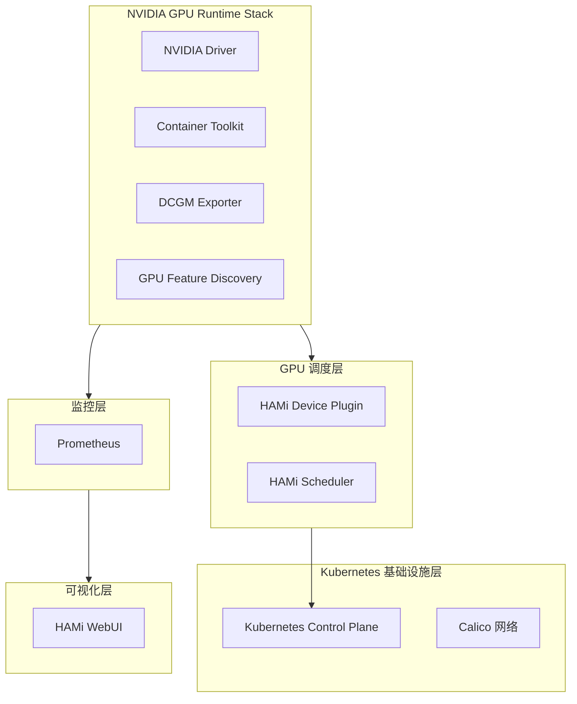
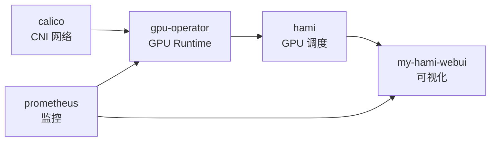
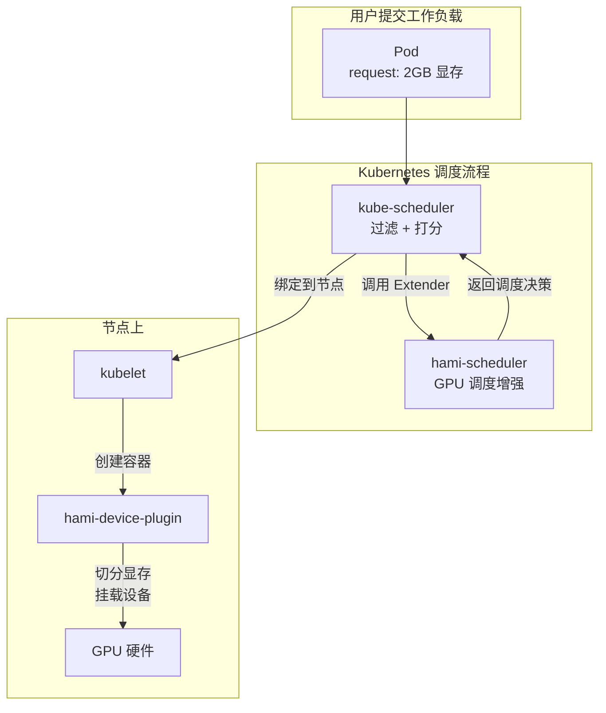
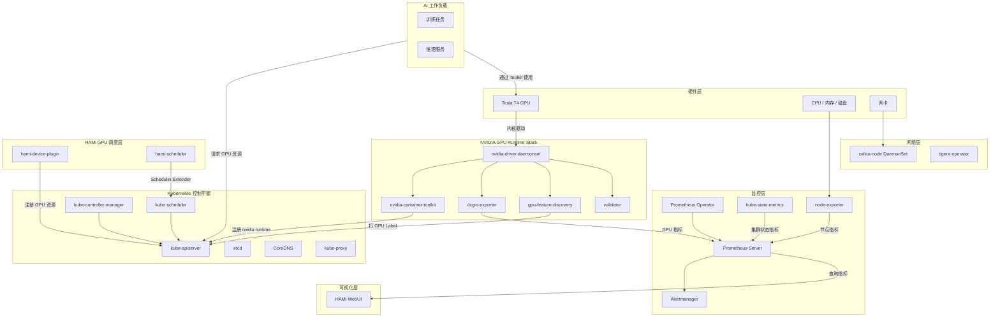
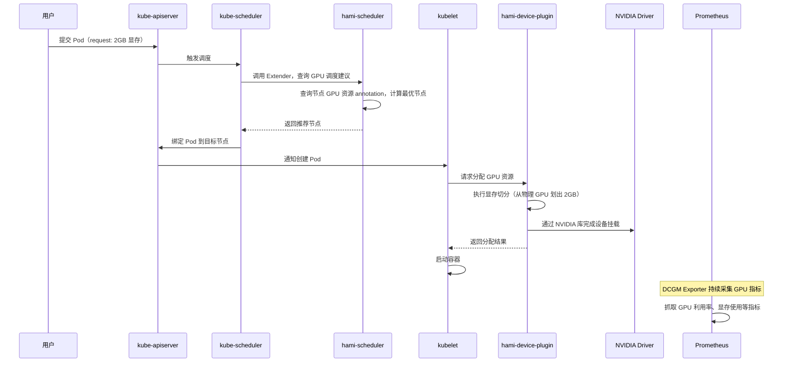

完成 HAMi 安装后，集群不再是一个普通的 Kubernetes 集群，它变成了一个具备 GPU 虚拟化能力的 AI 基础设施平台。本文将拆解安装完成后集群中每一层、每一个组件的职责和依赖关系。

## 5 层架构总览

安装完成后的集群由 5 层组成，每一层为上层提供服务：



从下往上看：

| 层级                     | 作用                         | 类比         |
| ------------------------ | ---------------------------- | ------------ |
| Kubernetes 基础设施层    | 容器编排、网络通信、资源管理 | 操作系统     |
| NVIDIA GPU Runtime Stack | 让容器能访问 GPU 硬件        | GPU 驱动程序 |
| GPU 调度层               | GPU 资源切分、共享、调度决策 | 资源管理器   |
| 监控层                   | 采集和存储所有组件的指标     | 监控系统     |
| 可视化层                 | GPU 资源的可视化管理界面     | 仪表盘       |

这 5 层之间的关系是严格的依赖关系：**上层依赖下层，下层不依赖上层**。例如 HAMi Scheduler 需要 Kubernetes 提供调度框架扩展点，但 Kubernetes 本身并不关心 HAMi 的存在。

---

## Helm Releases

安装过程中通过 Helm 部署了多个 Release。Helm Release 是什么？你可以把它理解为一个**应用包的运行实例**，类似于 `apt install` 安装了一个软件包，或者 `docker compose up` 启动了一组服务。每个 Release 包含一组 Kubernetes 资源（Pod、Service、ConfigMap 等），可以统一安装、升级和卸载。

执行 `helm list -A` 可以看到所有 Release：

```text
NAMESPACE      NAME                        CHART                              STATUS
gpu-operator   gpu-operator-xxxxxxxxxx     gpu-operator-v25.3.0               deployed
kube-system    hami                        hami-2.9.0                         deployed
monitoring     prometheus                  kube-prometheus-stack-75.15.1      deployed
kube-system    my-hami-webui               hami-webui-x.x.x                   deployed
```

### 各 Release 的职责

| Release | 命名空间 | 职责 | 安装时机 |
| --- | --- | --- | --- |
| **gpu-operator** | gpu-operator | NVIDIA GPU 软件栈的自动化管理，自动部署驱动、工具包、指标采集器 | 安装 Prometheus 后 |
| **hami** | kube-system | GPU 虚拟化与调度增强，支持显存切分和多 Pod 共享 GPU | 安装 GPU Operator 后 |
| **prometheus** | monitoring | 集群监控，采集和存储所有组件的指标数据 | 安装 K8s 后，最先安装的监控组件 |
| **my-hami-webui** | kube-system | GPU 资源可视化界面，展示 GPU 使用情况和调度状态 | 安装 HAMi 后（可选） |

> CNI 插件（Calico）不会出现在 `helm list` 中，因为它是通过 `kubectl create` 应用 tigera-operator manifests 安装的，不经过 Helm。

它们之间的安装顺序是有依赖关系的：



Prometheus 必须先于 GPU Operator 和 HAMi WebUI 安装，因为它们都依赖 Prometheus 来采集和提供指标数据。

---

## Pod 详解

安装完成后，集群中运行着大量 Pod。执行 `kubectl get pods -A` 你会看到类似以下输出。本节将按类别逐一解释每个 Pod 的作用。

### K8s 核心组件

这些是 Kubernetes 自身的控制平面组件，在初始化集群时由 kubeadm 创建。

| Pod | 作用 |
| --- | --- |
| **kube-apiserver** | Kubernetes 的 API 入口，所有组件（kubectl、scheduler、controller-manager）都通过它通信 |
| **kube-scheduler** | 决定 Pod 运行在哪个节点上，HAMi Scheduler 作为扩展参与其中 |
| **kube-controller-manager** | 运行各种控制器（Deployment、ReplicaSet、Node 等），维持集群期望状态 |
| **etcd** | 分布式键值存储，保存集群所有状态数据（Pod、Service、ConfigMap 等） |
| **kube-proxy** | 每个 Node 上运行，维护 Service 的网络转发规则（iptables/IPVS） |
| **coredns** | 集群内部 DNS 服务，为 Service 提供名称解析 |

**如果没有它们**：整个 Kubernetes 集群无法运行。kube-apiserver 是唯一可以直接操作 etcd 的组件，如果它挂了，整个控制平面瘫痪。

**对 AI 基础设施的意义**：Kubernetes 是 GPU 工作负载的编排基础。没有 K8s，GPU 任务只能手动分配到机器上运行，无法实现自动调度、弹性伸缩、故障恢复。

### 网络组件

由 Calico manifests（tigera-operator）创建。

| Pod | 作用 |
| --- | --- |
| **tigera-operator** | Deployment，管理 Calico 的生命周期，监听 `Installation` 资源并部署、调和所有 Calico 组件 |
| **calico-node** | DaemonSet，每个节点运行一个，负责 Pod 之间的网络连通性、IP 地址管理、路由和网络策略执行 |
| **calico-kube-controllers** | Deployment，运行 Calico 的控制面逻辑（策略、命名空间、端点同步，IPAM 垃圾回收） |
| **calico-typha** | Deployment，聚合 datastore watch 连接，避免大规模集群压垮 Kubernetes API |
| **csi-node-driver** | DaemonSet，Calico 的 CSI 驱动，为高级策略功能挂载 Pod 级别的卷 |

**如果没有它们**：Pod 之间无法通信。Kubernetes 的 Service 机制完全失效，DNS 解析不通，跨 Pod 的分布式训练无法进行。

**对 AI 基础设施的意义**：AI 训练经常涉及分布式工作负载（多 Pod 协同训练），网络性能直接影响训练效率。Calico 提供高性能路由（BGP/VXLAN）和 NetworkPolicy 隔离能力，让不同工作负载互不干扰。

### NVIDIA GPU Runtime Stack

由 gpu-operator Helm Release 创建。这一层解决的核心问题是：**让容器能访问 GPU 硬件**。

| Pod | 作用 |
| --- | --- |
| **nvidia-driver-daemonset** | DaemonSet，在每个 GPU 节点上安装 NVIDIA 内核驱动。它通过容器化方式管理驱动，避免了手动在宿主机上编译安装驱动的繁琐过程 |
| **nvidia-container-toolkit-daemonset** | DaemonSet，在每个节点上配置 containerd，让它知道如何把 GPU 设备和库挂进容器。修改 containerd 的配置，注册 `nvidia` runtime |
| **gpu-feature-discovery** | DaemonSet，检测本节点 GPU 的型号、显存、算力等信息，以 Label 和 Annotation 的形式写到 Node 对象上，供调度器决策 |
| **nvidia-dcgm-exporter** | DaemonSet，通过 DCGM（Data Center GPU Manager）采集 GPU 利用率、显存使用、温度、功耗等指标，以 Prometheus 格式暴露 |
| **nvidia-operator-validator** | DaemonSet，验证 GPU 软件栈是否正常（驱动是否加载、Toolkit 是否配置、节点是否就绪） |
| **nvidia-cuda-validator** | Job，运行一次后退出，验证 CUDA 运行时是否可用 |

**如果没有它们**：

- 没有 **nvidia-driver-daemonset**：GPU 硬件无法被操作系统识别，`nvidia-smi` 命令不存在
- 没有 **nvidia-container-toolkit-daemonset**：容器内无法使用 GPU，即使驱动已安装，Pod 里执行 `nvidia-smi` 也会报错
- 没有 **gpu-feature-discovery**：调度器不知道节点有什么 GPU，无法根据 GPU 型号、显存做调度决策
- 没有 **nvidia-dcgm-exporter**：Prometheus 没有 GPU 指标数据，无法监控 GPU 使用率
- 没有 **validator**：无法自动检测 GPU 软件栈的安装问题

**对 AI 基础设施的意义**：GPU Runtime Stack 是 AI 工作负载的基础设施层。它让 GPU 从"裸机设备"变成"Kubernetes 可管理的资源"。没有这一层，AI 训练和推理任务无法以容器化方式运行。

### HAMi 调度组件

由 hami Helm Release 创建。这一层解决的核心问题是：**让 GPU 从整卡分配变成可切分、可共享**。

| Pod | 作用 |
| --- | --- |
| **hami-scheduler** | Deployment，HAMi 调度器。它注册为 Kubernetes Scheduler Extender，参与 Pod 的 GPU 调度决策。支持 binpack/spread 策略、优先级调度、GPU 资源配额等高级功能 |
| **hami-device-plugin** | DaemonSet（每个 GPU 节点一个），替代 NVIDIA 原生 device-plugin。它向 kubelet 注册自定义 GPU 资源（显存、算力），并在 Pod 创建时执行显存切分和设备挂载 |



**如果没有它们**：

- 没有 **hami-scheduler**：GPU 调度退回到 Kubernetes 默认行为，只能整卡分配，无法实现显存切分和多 Pod 共享
- 没有 **hami-device-plugin**：kubelet 不认识 HAMi 注册的自定义资源（`nvidia.com/gpumem`、`nvidia.com/gpucores`），Pod 的 GPU 资源请求无法被满足

**对 AI 基础设施的意义**：HAMi 是 GPU 利用率的关键。在没有 HAMi 的情况下，一个只需要 2GB 显存的推理服务会独占一整张 16GB 的 GPU，浪费 87.5% 的资源。HAMi 让多工作负载共享同一张 GPU，将 GPU 利用率提升数倍。

### 监控组件

由 prometheus Helm Release 创建。

| Pod | 作用 |
| --- | --- |
| **prometheus-prometheus-kube-prometheus-prometheus-0** | Prometheus Server 主实例，负责采集和存储所有指标数据。通过 ServiceMonitor 自动发现采集目标 |
| **prometheus-kube-prometheus-operator** | Prometheus Operator，管理 Prometheus 和 Alertmanager 的生命周期，自动生成配置 |
| **prometheus-kube-state-metrics** | 监听 Kubernetes API，将集群状态（Deployment、Pod、Node 等）转换为 Prometheus 指标 |
| **prometheus-prometheus-node-exporter** | DaemonSet，每个节点运行一个，采集节点的 CPU、内存、磁盘、网络等硬件指标 |
| **alertmanager-prometheus-kube-prometheus-alertmanager-0** | Alertmanager，处理 Prometheus 发出的告警，去重、分组、路由和发送通知 |

**如果没有它们**：

- 没有 **Prometheus Server**：所有指标数据无处存储，HAMi WebUI 无法展示 GPU 使用率图表
- 没有 **Prometheus Operator**：每次新增采集目标都需要手动修改 Prometheus 配置并重启
- 没有 **kube-state-metrics**：无法通过指标了解集群状态（Pod 重启次数、Deployment 副本数偏差等）
- 没有 **node-exporter**：无法监控节点级别的硬件资源使用情况
- 没有 **Alertmanager**：GPU 过热、显存不足等异常情况无法自动通知

**对 AI 基础设施的意义**：AI 工作负载通常是长时间运行的训练任务或高吞吐的推理服务。监控不仅用于观察，更用于预警，GPU 温度过高可能导致训练中断，显存泄漏可能导致 OOM。没有监控，AI 基础设施的运维等同于盲人摸象。

---

## 完整系统架构

以下是安装完成后所有组件之间的完整连接关系：



---

## 各层协作流程

以一个典型场景，**提交一个需要 2GB 显存的推理 Pod**，为例，看看各层如何协作：



整个流程中，每一层各司其职：Kubernetes 提供调度框架和 Pod 生命周期管理，GPU Runtime Stack 提供硬件访问能力，HAMi 在中间做出 GPU 级别的调度决策和资源切分，Prometheus 在后台持续采集指标。

---

## 小结

| 层级                     | 核心组件                                      | 解决的核心问题     |
| ------------------------ | --------------------------------------------- | ------------------ |
| Kubernetes 基础设施层    | kube-apiserver, kube-scheduler, etcd, calico  | 容器编排和网络通信 |
| NVIDIA GPU Runtime Stack | driver, toolkit, dcgm-exporter, gfd           | 让容器能访问 GPU   |
| GPU 调度层               | hami-scheduler, hami-device-plugin            | GPU 资源切分和共享 |
| 监控层                   | prometheus, node-exporter, kube-state-metrics | 指标采集和告警     |
| 可视化层                 | HAMi WebUI                                    | GPU 资源可视化     |

理解了这些组件的职责和依赖关系，当集群出现问题时，你可以快速定位是哪一层出了问题：Pod 无法调度看调度层，GPU 不可用看 Runtime Stack，指标缺失看监控层。
