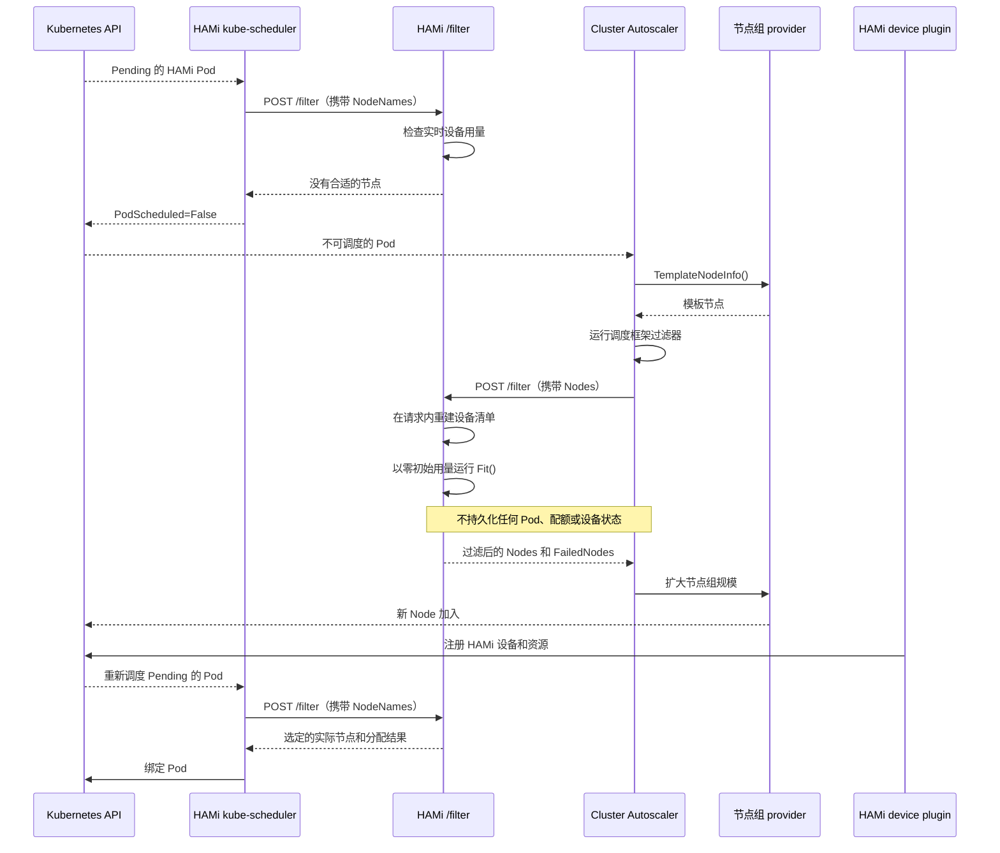

当一个申请 HAMi 托管设备的 Pod 在现有节点上都放不下时，kube-scheduler 会把它标记为不可调度。此时 Cluster Autoscaler（CA）要回答的是另一个问题：扩容哪个节点组，才能让这个 Pod 变得可调度？

对于 CPU 和内存，CA 通常可以根据 Node 的 `Capacity` 和 `Allocatable` 字段，加上 Kubernetes 标准的资源过滤器来回答这个问题。但 HAMi 管理的设备显存、算力份额、MIG 配置和设备拓扑，并不能完整地体现在这些字段里。如果不询问 HAMi，CA 看到的设备模型就是不完整的：它可能会放弃一次本来可行的扩容，也可能扩出一个依然跑不了该 Pod 的节点。

本文先介绍 CA 如何判断一个节点组是否值得扩容，再说明 HAMi 的设备模型在这个过程中有哪些不同，然后介绍模拟过滤器的设计、目前完成的验证以及剩余工作。这里的“模拟”指的是在 CA 内存快照中进行的假设性调度，并不是 Kubernetes API server 端的 dry-run，也永远不会绑定 Pod。

## 背景

### Kubernetes 为什么需要节点自动扩缩容

kube-scheduler 只能把 Pod 放到已经存在的节点上。如果剩余资源不足、污点不匹配，或者拓扑约束无法满足，Pod 就会一直处于 Pending 状态并被标记为不可调度。调度器本身不会创建节点。

CA 负责管理节点数量。它持续关注不可调度的 Pod，查询由云厂商或其他基础设施提供方管理的节点组，并决定是否增加节点。新节点加入集群后，kube-scheduler 会重新尝试调度 Pending 的 Pod。

CA 并不取代调度器。它不会为 Pod 选择具体的物理设备，也不执行最终的绑定。它只判断新增一个节点能否让 Pod 变得可调度，再根据这个结果选择节点组和要增加的节点数。

### CA 如何判断一个节点组是否值得扩容

CA 不会为了试一下调度而真的创建节点。它从 provider 获取 `TemplateNodeInfo()`，在内存中构造一个模板节点，并把它加入集群快照。

kube-scheduler 通过调度框架（scheduler framework）组织调度逻辑。一个调度周期分为多个阶段：PreFilter 插件为当前 Pod 准备状态，Filter 插件逐个检查候选节点。`NodeResourcesFit` 是内置的 Filter 插件，它检查 Node 的 `Allocatable` 在扣除已有 Pod 的请求之后，是否仍能满足当前 Pod 对 CPU、内存、临时存储和标量资源的请求。CA 在模拟时复用这些插件，让基础过滤逻辑尽量与 kube-scheduler 保持一致。

调度框架的 Filter 阶段是进程内的扩展点。而 HAMi 的 `/filter` 是 scheduler extender 暴露的 HTTP 接口，`/bind` 则是用于真实绑定的另一个 HTTP 接口。两者名字相近，但工作在不同的层次上。

如果模板节点通过了过滤，CA 就把它所在的节点组视为扩容候选。之后，CA 的装箱估算器（bin-packing estimator）会把多个 Pending Pod 依次放进快照，估算一个新节点能容纳多少 Pod，以及这个节点组需要扩多少个节点。

这个过程依赖两个前提：

- 模板节点能代表该节点组中新节点的资源和调度属性。
- CA 的过滤逻辑覆盖了 Pod 的全部调度要求。

HAMi 的扩容模拟必须同时满足这两个前提：CA 要能调用 HAMi 的设备过滤逻辑，模板节点也要携带 HAMi 能理解的设备信息。

### 节点组、模板节点、warm 节点组与 cold-zero 节点组

节点组是一组预期同构、由 provider 管理的节点，例如 Azure VMSS。CA 调整的是节点组的规模，而不是直接创建某个 Kubernetes Node。

模板节点是 CA 在内存中对节点组即将新增节点的描述。它通常包含实例类型、容量、标签、污点等调度属性，但不一定对应任何当前存在的 Node。

按当前规模，节点组可以分为两种情况：

- warm 节点组至少有一个节点。provider 可以基于现有节点构建模板，因此模板中可能保留了 HAMi 的设备注册注解。
- cold-zero 节点组当前规模为 0。provider 只能根据实例类型和节点组配置构建模板，无法复制现有节点上 HAMi device plugin 产生的注册结果。

warm 和 cold-zero 的区别决定了设备信息从哪里来。warm 模板可以复用现有节点的运行时设备清单；cold-zero 模板则需要由 provider 或单独的配置提供设备描述。仅仅让 CA 能够调用 HAMi，并不能解决设备描述的来源问题。

### HAMi 如何进行真实调度

HAMi 的准入 webhook 识别设备资源请求，并设置 `schedulerName`。HAMi 附带的 kube-scheduler 先运行调度框架插件，再通过 HTTP extender 调用 HAMi 调度器的 `/filter` 接口。

当前的 Helm 配置把 extender 的 `nodeCacheCapable` 设为 `true`，所以 kube-scheduler 只发送候选节点的名称：

```json
{
  "pod": { "metadata": { "name": "gpu-workload" } },
  "nodeNames": ["node-a", "node-b"]
}
```

随后，HAMi 的实时过滤器（live filter）会：

- 从 node manager 读取设备注册数据；
- 从 pod manager 和 quota manager 读取已有分配；
- 运行各设备后端实现的 `Fit()` 和打分逻辑；
- 选出一个节点和具体的设备；
- 在 pod manager 和 quota manager 中预留这次分配；
- 把目标节点和设备分配写入 Pod 注解；
- 返回一个节点名称，供后续的 `/bind` 请求使用。

实时过滤器会更新 Pod 注解、设备用量和配额用量，之后 `/bind` 再根据记录的分配结果绑定 Pod。

### 为什么 HAMi 的设备信息不能只看 `Allocatable`

以 NVIDIA 设备为例，一个经过准入处理的 Pod 可能会申请：

```yaml
resources:
  limits:
    nvidia.com/gpu: 1
    nvidia.com/gpumem: 11000
    nvidia.com/gpucores: 100
```

能否满足这个请求，不只取决于设备数量。HAMi 还要检查单卡显存、算力份额、健康状态、NUMA 位置、MIG 配置、设备拓扑，以及已经分配给其他 Pod 的用量。这些信息来自 `hami.io/node-*-register` 注解和 HAMi 维护的运行时状态。

`Allocatable` 描述的是 Node 暴露给调度器的资源总量。`NodeResourcesFit` 可以用它来检查 CPU、内存和扩展标量资源的总量，但看不到 HAMi 按设备组织的结构。资源总量够，并不代表某一块设备有足够的空闲显存。`NodeResourcesFit` 也无法复现 HAMi 在 MIG、NUMA 位置或设备对打分上的选择约束。

因此，只运行内置的 Filter 插件，CA 得到的只是 Kubernetes 资源层面的结果，替代不了 HAMi `/filter` 接口中各厂商的 `Fit()` 逻辑。

## CA 扩容评估为什么需要 HAMi

标准的 CA 模拟器目前不会调用 HTTP scheduler extender。HAMi 工作负载在扩容评估中可能以两种方式失败。

第一种失败发生在调用 HAMi 之前。如果模板节点没有上报由 extender 管理的资源，例如 `nvidia.com/gpucores`，`NodeResourcesFit` 会返回 `Insufficient`，CA 就会排除一个 HAMi 本来可能接受的节点组。

第二种失败源于缺失的设备模型。调度框架的过滤器可能根据资源总量接受了模板，而 HAMi 会因为单卡显存、算力或拓扑约束拒绝该 Pod。结果 CA 扩了错误的节点组，新节点加入后 Pod 依然无法调度。

让 HAMi 参与扩容模拟后，CA 就能使用与真实调度相同的厂商 `Fit()` 逻辑来判断新节点是否有用。对于设备注解可信的 warm 节点组，CA 可以在节点组选择和扩容决策中考虑 Pending 的 HAMi Pod，而且假设性调度过程中不会修改真实的 Pod、配额状态或设备缓存。

目前的验证覆盖的是 warm 节点组中单个 HAMi Pod 的扩容可行性。为 cold-zero 节点组提供设备描述、支持多 Pod 装箱，以及把 CA 侧改动合入上游，都是单独的工作。

## 设计需要解决的问题

**让请求能够到达 HAMi。** CA 必须加载 scheduler extender 配置，并把标记为 `ignoredByScheduler: true` 的资源加入 `NodeResourcesFitArgs.IgnoredResources`。否则调度框架的过滤器会在 HAMi 评估之前就拒绝模板节点。

**让 HAMi 能够检查模板节点。** 模板节点不在 HAMi 的 node manager 中，仅凭节点名称无法还原它的设备。CA 必须发送完整的 Node 对象，包括 HAMi 的注册注解。

**把模拟与真实调度隔离开。** CA 可能会反复测试多个节点组。模拟请求不能写 Pod 注解、不能预留配额用量，也不能把模板节点加入全局 node manager。

**明确模板代表什么。** 根据注解重建一个零用量的设备视图，代表的是一个已经完成设备注册、但还没有运行普通工作负载的新节点。多 Pod 模拟和 cold-zero 节点组需要额外的状态或设备描述，这些都无法仅从这一个请求中推断出来。

## 设计概览

CA 加载 `KubeSchedulerConfiguration`，识别由 extender 管理的资源，先运行调度框架的过滤器，再把通过过滤的完整 Node 对象列表传给 HAMi。

HAMi 复用现有的 `/filter` 接口。当请求中包含 `Nodes` 时，`Scheduler.Filter()` 走模拟路径；只包含 `NodeNames` 时，保持现有的实时过滤行为不变。模拟路径根据请求中 Node 上的注解重建设备清单，把每个设备的用量初始化为零，然后调用现有的厂商 `Fit()` 实现，不保留任何分配结果。



CA 发起的 `/filter` 调用只回答“这个 Pod 能否放进这个模板节点”。节点创建之后，device plugin 仍然需要注册设备，最终的分配和绑定依旧走 HAMi 的实时调度路径。

## Extender 调用约定

### `Nodes` 与 `NodeNames`

`nodeCacheCapable` 决定了使用 `ExtenderArgs.Nodes` 还是 `ExtenderArgs.NodeNames`：

| `nodeCacheCapable` | 请求字段 | 响应字段 | 含义 |
| --- | --- | --- | --- |
| `true` | `NodeNames` | `NodeNames` | extender 缓存了 Node，调用方只发送节点名称。 |
| `false` | `Nodes` | `Nodes` | extender 不缓存 Node，调用方发送完整的 Node 对象。 |

当 `nodeCacheCapable: false` 时，Kubernetes 的 HTTP extender 实现不会同时填充这两个字段。`Nodes` 并不是 CA 专属的标记：按同样方式配置的普通 kube-scheduler 也会发送完整的 Node 对象。

因此，当前设计依赖一个部署上的约定：

- HAMi 的 kube-scheduler 保持 `nodeCacheCapable: true`，真实调度发送 `NodeNames`。
- CA 使用 `nodeCacheCapable: false`，扩容模拟发送 `Nodes`。

共用 `/filter` 依赖于这个约定，也是当前实现中最主要的接口风险。参见[模拟路径需要独立的调用约定](#the-simulation-path-needs-a-separate-contract)。

### CA 侧配置

下面是当前实现所需的最小配置。URL、TLS 设置和 `managedResources` 必须与 HAMi 的部署保持一致。

```yaml
apiVersion: kubescheduler.config.k8s.io/v1
kind: KubeSchedulerConfiguration
profiles:
  - schedulerName: default-scheduler
extenders:
  - urlPrefix: https://hami-scheduler.kube-system.svc
    filterVerb: filter
    enableHTTPS: true
    tlsConfig:
      caFile: /etc/hami/tls/ca.crt
    nodeCacheCapable: false
    ignorable: false
    httpTimeout: 30s
    managedResources:
      - name: nvidia.com/gpu
        ignoredByScheduler: true
      - name: nvidia.com/gpumem
        ignoredByScheduler: true
      - name: nvidia.com/gpucores
        ignoredByScheduler: true
```

`caFile` 指向挂载在 Cluster Autoscaler Pod 中的 CA 证书包，用于校验 HAMi 的服务端证书。部署时也可以改用 `caData` 直接内嵌同一份证书包。只设置 `enableHTTPS: true` 是不够的：如果 `caFile` 和 `caData` 都没有设置，kube-scheduler 会跳过服务端证书校验。

`serverName` 默认取 `urlPrefix` 中的主机名，只有当服务端证书使用了不同的 DNS 名称时才需要设置。`certFile` 和 `keyFile` 只在 HAMi 服务端要求 mTLS 时才需要。

`ignoredByScheduler` 只决定某个资源由 extender 而不是 `NodeResourcesFit` 来评估。它既不会为模板节点生成设备清单，也不会给 cold-zero 节点组补上 `hami.io/node-*-register` 注解。

CA 侧的实现必须：

- 根据调度器配置创建 HTTP extender；
- 当 `managedResources` 省略或为空时，对每个 Pod 都调用 extender；否则只在 Pod 至少申请了其中一种资源时才调用；
- 在创建调度框架之前配置好 `NodeResourcesFitArgs.IgnoredResources`；
- 先收集所有通过调度框架过滤的候选节点，再调用 extender；
- 按配置顺序，把每个 extender 的结果集传给下一个 extender；
- 根据 `ignorable` 决定 extender 出错时是拒绝本次评估还是忽略错误；
- 只有在没有任何 filter extender 关心当前 Pod 时才走快速路径；`managedResources` 为空的 extender 关心所有 Pod。

## HAMi 侧设计

### 请求路由

解析完 Pod 的资源请求后，`Scheduler.Filter()` 根据候选节点字段选择路径：

```text
args.Nodes != nil      -> filterSimulation()
args.Nodes == nil      -> existing live filter
```

实时过滤器保留现有的缓存、配额、注解和绑定协议。模拟过滤器不读取 `args.NodeNames`，也不会把请求中的任何 Node 加入全局 node manager。

### 根据模板节点重建设备清单

`buildTransientNodeInfo()` 为请求中的每个 Node 创建一个临时的 `device.NodeInfo`：

- 深拷贝 Node；
- 遍历已注册的 HAMi 设备后端；
- 调用各后端的 `GetNodeDevices()`，解析其 `hami.io/node-*-register` 注解；
- 按厂商整理得到的 `DeviceInfo`；
- 如果没有任何后端能提供设备，返回 `node unregistered`。

这里复用了真实节点注册时使用的注解解析逻辑，所以 CA 不需要重新定义 MIG 模板、设备对打分、NUMA 位置、健康状态或厂商特有的 `CustomInfo`。

临时设备信息只在当前请求内存在，不会加入全局设备缓存。`DeviceInfo.DeepCopy()` 和 `NodeUsage.DeepCopy()` 还修复了嵌套 map 和 slice 的问题，避免在复制 manager 或缓存数据时残留共享引用。模拟之所以能保持隔离，是因为 `buildTransientNodeInfo()` 创建的都是请求内的局部对象。`buildNodeUsage()` 构造的 `MigTemplate` 字段仍然指向同一个请求内的对象图，不能在请求结束后继续持有。

### 构造新节点的用量

`buildNodeUsage()` 把临时设备清单转换成当前请求使用的 `NodeUsage`，设备用量从零开始：

```text
Used      = 0
Usedmem   = 0
Usedcores = 0
PodInfos  = []
```

设备数量、单卡显存、算力容量、MIG 配置、NUMA 位置和健康状态都来自注册注解。这描述的是一个已经完成 HAMi 设备注册、但还没有运行普通工作负载的节点。

同一个 Pod 中的所有容器都基于同一份临时 `NodeUsage` 进行评估。前面的容器选中的设备会影响后面的容器，因此单个 Pod 内部的设备放置仍然保持 HAMi 的正常语义。

### 复用设备过滤逻辑

模拟过滤器调用 `calcScoreWithOptions()`，行为如下：

- `recordEvents=false`，设备适配失败时不会写 Pod Event；
- `detailedFailureReason=true`，`FailedNodes` 会保留 `CardInsufficientMemory` 之类的原因；
- `NodeUsage.NodeInfo` 指向临时设备信息，计算时不会去 node manager 中查找模板节点；
- 模拟过滤器和实时过滤器共用同一套厂商 `Fit()` 实现，不单独维护一套设备匹配规则。

当前实现仍然沿用实时过滤器的打分和排序路径，只返回得分最高的那个节点。extender 协议允许 filter 响应包含输入的任意子集，所以这个响应本身是合法的，但它过早地去掉了其他可行节点。具体影响参见[模拟过滤必须保留所有可行节点和失败详情](#simulation-filtering-must-preserve-every-feasible-node-and-failure-detail)。

### 副作用边界

模拟路径不能：

- 调用 `podManager.AddPod()`、`TakeAndDeletePod()` 或 `DelPod()`；
- 调用 `quotaManager.AddUsage()` 或 `RmUsage()`；
- 调用 `PatchPodAnnotations()`；
- 修改全局 node manager；
- 生成真实的设备分配注解；
- 持有临时 Node、`DeviceInfo` 或 `DeviceUsage` 的可变引用。

现有测试已经验证 Pod 注解、pod manager 和 quota manager 不会被修改。共享入口上的行为，例如对不含设备资源的请求写 Event，还需要单独处理。

### 结果与错误

如果缺少设备注册数据，HAMi 会把该节点放入 `FailedNodes`：

```json
{
  "failedNodes": {
    "template-node-a": "node unregistered"
  },
  "error": ""
}
```

如果设备容量不足，HAMi 返回厂商的适配失败原因：

```json
{
  "failedNodes": {
    "template-node-a": "2/2 CardInsufficientMemory"
  },
  "error": ""
}
```

因为缺少所需资源或不满足设备约束而过滤掉节点，属于正常结果。如果请求无法解码或内部处理出错，HAMi 的路由会返回 HTTP 200，并带上非空的 `ExtenderFilterResult.Error`，Kubernetes 的 HTTP extender 会把这个字段转换成调用错误。

CA 是否忽略该错误取决于 `ignorable`。示例中显式设置了 `ignorable: false`，所以服务出错时会终止本次可行性评估。如果设为 `ignorable: true`，CA 可能会沿用调用前的候选集合继续执行。失败即拒绝（fail-closed）的行为来自配置，接口本身并不无条件保证这一点。

## 当前实现与验证

### 实现状态

HAMi 侧的模板节点模拟已在 [HAMi PR #2046](https://github.com/Project-HAMi/HAMi/pull/2046) 中合入。当前代码包含 `filterSimulation()`、临时设备清单、零用量的 `NodeUsage`、详细的失败原因以及相关的深拷贝修复。

CA 侧的 extender 支持还没有进入正式版本。[kubernetes/autoscaler#9786](https://github.com/kubernetes/autoscaler/pull/9786) 在旧仓库中仍处于打开状态，无法直接合入新的上游仓库。迁移后的实验分支是 [spencercjh/cluster-autoscaler:feat/extender-managed-resources](https://github.com/spencercjh/cluster-autoscaler/tree/feat/extender-managed-resources)，目前在 [kubernetes-sigs/cluster-autoscaler](https://github.com/kubernetes-sigs/cluster-autoscaler) 中还没有对应的上游 PR。

也就是说，HAMi 已经有了模拟入口，但标准的 CA 二进制并不会自动调用它。要跑通完整流程，仍然需要带 extender 补丁的 CA 构建、匹配的调度器配置，以及一个可以访问的 HAMi HTTPS 接口。

### 单元测试

现有测试覆盖了以下场景：

- 带注册注解的模板节点能通过模拟过滤器；
- 模拟过滤器不会修改 Pod 注解；
- 模拟过滤器不会修改 pod manager 或 quota manager；
- 设备显存不足时返回 `CardInsufficientMemory`；
- 缺少注册注解时返回 `node unregistered`；
- 复制出来的 `DeviceInfo` 中，`MIGTemplate`、`CustomInfo` 和 `DevicePairScore.Scores` 字段不会与原对象共享可变状态。

这些测试覆盖了单个请求的主要状态边界，但还没有覆盖多节点结果集、多个 Pod、并发以及 cold-zero 节点组。

### 手动验证 `/filter`

把 HAMi 的实现部署到 AKS 集群后，我们针对真实的 HTTPS `/filter` 接口测试了三类请求：

| 场景   | 请求                                             | 结果                                |
| ------ | ------------------------------------------------ | ----------------------------------- |
| 能放下 | `gpu=1`、`gpumem=300`、`gpucores=40`             | 返回了模板节点。                    |
| 放不下 | 每个设备 `devmem=11441`，Pod 申请 `gpumem=12000` | 返回 `2/2 CardInsufficientMemory`。 |
| 未注册 | 删除 `hami.io/node-nvidia-register`              | 返回 `node unregistered`。          |

测试用的注解注册了两个模拟的 K80 `DeviceInfo` 条目，每个都是 `count=10`。这里的 `count` 是 mock-device-plugin 提供的逻辑设备容量，并不能说明测试虚拟机有两块物理 GPU，也不能用来验证 GPU 性能。

### warm 节点组端到端验证

AKS 用户节点池一开始只有一个节点。两个 Pod 占满了该节点上模拟的 HAMi 设备显存，实时过滤器以 `CardInsufficientMemory` 拒绝了第三个相同的 Pod。随后，带 extender 支持的 CA：

- 识别出第三个 Pod 不可调度；
- 利用 warm 节点组模板和 HAMi 模拟过滤器，判断新节点能放下该 Pod；
- 把 VMSS 从 1 个节点扩到 2 个节点；
- 等待新 Node 加入集群。

新 Node 刚进入 `Ready` 状态时，Pod 仍然不可调度。直到 mock-device-plugin 注册了 `nvidia.com/gpu`、`nvidia.com/gpucores` 和 `nvidia.com/gpumem` 之后，HAMi 实时过滤器才完成真实的分配和绑定。

这次验证覆盖了 warm 节点组中单个 Pending Pod 的模板评估和扩容，没有覆盖 cold-zero 节点组、多 Pod 装箱、多个 extender、物理 GPU，以及包含故障设备的设备描述。

## 剩余工作

当前实现评估的是 warm 节点组中单个 Pod 在新节点上的可行性。其他扩容场景仍存在明确的缺口：

| 场景 | 设备信息来源 | 模拟所需状态 | 当前状态 |
| --- | --- | --- | --- |
| warm 节点组，单个 Pod | 现有 Node 的注册注解 | 空节点的设备用量 | 已在 AKS 上验证过一次。 |
| warm 节点组，多个 Pod | 现有 Node 的注册注解 | 前面 Pod 的假设性分配 | 不支持；每个请求仍从零用量开始。 |
| cold-zero 节点组，单个 Pod | provider 或独立的设备描述 | 空节点的设备用量 | 不支持；缺少注解时返回 `node unregistered`。 |
| cold-zero 节点组，多个 Pod | provider 或独立的设备描述 | 设备描述以及前面 Pod 的假设性分配 | 不支持。 |

在这项集成正式发布之前，需要解决以下问题。

### 模拟路径需要独立的调用约定 {#the-simulation-path-needs-a-separate-contract}

当前实现用 `args.Nodes != nil` 来区分模拟和实时调度，但在 Kubernetes 中，`Nodes` 只表示 extender 不缓存 Node 对象。配置了 `nodeCacheCapable: false` 的普通 kube-scheduler 同样会发送 `Nodes`。这时 HAMi 会把真实调度误当成模拟，跳过 Pod 注解、配额用量和分配预留。

共用路径还有其他问题。`PredicateRoute` 会拒绝不带 Pod 的请求，但没有强制 `Nodes` 和 `NodeNames` 互斥。模拟只依赖请求中的 Node，却仍然继承了 leader 以及实时缓存 `synced` 的要求。

HAMi 应该暴露一个独立的 `/filter-simulation` 接口，在进入调度逻辑之前校验请求，保证每条路径都没有副作用，并根据模拟实际使用的状态来定义就绪条件。独立的路径明确了调用语义，但并不提供认证或流量隔离。

### 模拟过滤必须保留所有可行节点和失败详情 {#simulation-filtering-must-preserve-every-feasible-node-and-failure-detail}

scheduler extender 的 filter 阶段只负责去掉不可行的节点。当前的模拟路径复用了实时调度的打分和排序逻辑，最后只返回得分最高的节点，这会改变 CA 的节点排序。存在多个 extender 时，被 HAMi 去掉的其他可行节点也无法参与后续过滤。模拟过滤器应当返回所有通过厂商 `Fit()` 检查的节点。

失败详情在两侧都会丢失。HAMi 忽略了 `GetNodeDevices()` 的解析错误，因此注解缺失、JSON 格式错误和解析失败都可能显示为 `node unregistered`。而 CA 实验分支又在最终的调度错误中丢掉了 `FailedNodes` 和 `FailedAndUnresolvableNodes`。HAMi 需要区分请求格式错误、缺少设备描述和厂商解析失败，CA 则需要保留节点级别的失败原因。

### 多 Pod 模拟需要跨请求的状态

CA 的估算器会把多个 Pod 依次加入集群快照，但标准的 `ExtenderArgs` 只包含当前 Pod 和候选 Node，不包含已经假设性地放到这些 Node 上的 Pod，也不包含它们在 HAMi 中的分配。

HAMi 在每个请求中都以 `Used=0` 重建设备状态。后面的 Pod 看不到前面 Pod 假设性占用的显存或算力份额，CA 因此可能低估需要增加的节点数。一个匿名的进程内缓存没有明确的生命周期，也无法与 CA 的重试和回滚保持一致。跨请求的调用约定必须覆盖模拟会话、模板节点、分配、重试和回滚，并且与实时调度完全隔离。

### 模板节点需要稳定的设备描述

cold-zero 节点组没有现成的 Node。provider 生成的模板通常没有 HAMi device plugin 产生的注册注解，所以当前实现只能返回 `node unregistered`。

warm 模板可以复制注册注解，但设备 ID、健康状态、NUMA 位置、MIG 配置和设备对打分描述的都是被采样节点的运行时状态。如果该节点上有故障设备，或者节点组内的设备型号、拓扑和 device plugin 配置存在差异，模板就可能错误地描述新节点的容量。

HAMi、CA 和 provider 需要共同定义一个从节点组到设备描述的稳定映射，并对同构性、样本选择和动态字段给出明确规则。新节点注册之后，还必须将实际设备清单与设备描述进行核对。

### 生产部署与上游发布仍有工作要做

只有预期的 CA 才应该能访问模拟接口。部署时需要明确 TLS、NetworkPolicy、超时、限流以及可观测性指标。该接口也不能依赖请求顺序或共享的模拟缓存。对于厂商解析器和 `Fit()` 实现所用的共享状态，需要补充并发测试和 `go test -race`。

CA 侧的 extender 支持还没有进入上游版本。只升级 HAMi 并不会触发模拟过滤器；如果缺少调度器配置、网络连通或 TLS 配置，同样不会发生调用。在对应的 CA 版本发布之前，HAMi 的文档和发布说明不应把它描述为开箱即用的自动扩缩容集成。

建议的优先级如下：

| 优先级 | 工作内容 | 完成标准 |
| --- | --- | --- |
| P0 | 把 scheduler extender 和 `ignoredByScheduler` 支持迁移到新的 Cluster Autoscaler 上游仓库。 | 上游测试覆盖 extender 顺序、错误处理、`managedResources` 为空时对每个 Pod 的调用、没有 extender 关心时的快速路径，以及节点级失败原因。 |
| P0 | 为 HAMi 增加独立的模拟接口，包括请求校验、副作用隔离和明确的就绪定义。 | 使用 `nodeCacheCapable: false` 的普通 kube-scheduler 不会被误认为模拟调用方；无效请求既不会写入状态，也不会引发空指针错误。 |
| P0 | 修正过滤结果和失败处理。 | HAMi 返回所有通过 `Fit()` 的节点；HAMi 和 CA 都保留可诊断的失败类型和节点级原因。 |
| P0 | 增加 warm 节点组的集成回归测试，并明确生产部署约束。 | 在有文档记录的 CA、Kubernetes、provider 和 HAMi 版本组合下能稳定复现扩容；接口可达性、并发行为和可观测性都有明确定义。 |
| P1 | 定义多 Pod 模拟状态的调用约定。 | 在同一个模板节点上连续模拟多个 Pod 时，HAMi 的用量与 CA 快照保持一致，并支持重试和回滚。 |
| P1 | 定义节点组设备描述以及新节点注册后的校验。 | cold-zero 节点组能构建可信的模板；warm 模板的动态字段有明确的处理规则；实际设备清单与设备描述不一致时有确定的处理结果。 |

完成 P0 之后，就能以可维护的方式支持 warm 节点组上的单个 Pod。多 Pod 估算和 cold-zero 节点组需要新的跨项目约定，仅靠扩展现有的 handler 无法完成。

## 术语

| 术语 | 含义 |
| --- | --- |
| Cluster Autoscaler（CA） | 根据不可调度的 Pod 决定是否调整节点组规模的组件。CA 不执行最终的 Pod 绑定。 |
| 节点组（node group） | 一组预期同构、由云厂商或其他基础设施提供方管理的节点。 |
| 模板节点（template node） | CA 在内存中对节点组即将新增节点的描述，不一定对应真实存在的 Node。 |
| warm 节点组 | 当前至少有一个节点的节点组，其模板可以基于现有节点生成。 |
| cold-zero 节点组 | 当前规模为 0 的节点组，其模板必须来自 provider 或外部设备描述。 |
| 新节点可行性（fresh-node feasibility） | 单个 Pod 能否放到一个还没有运行普通工作负载的新节点上。 |
| scheduler extender | kube-scheduler 通过 HTTP 调用的外部调度扩展。 |
| 调度框架（scheduler framework） | kube-scheduler 的进程内插件框架，把调度划分为 PreFilter、Filter、Score、Bind 等阶段。 |
| `NodeResourcesFit` | 调度框架内置的 Filter 插件，将 Pod 请求与节点可分配的标准资源和标量资源进行比较。它不是 HTTP 接口。 |
| 实时过滤器（live filter） | 正常调度时使用的 HAMi 过滤器，会读取并更新真实的分配状态。 |
| 模拟过滤器（simulation filter） | CA 扩容评估时使用的 HAMi 过滤器，只做假设性的设备适配检查。 |
| `nodeCacheCapable` | 为 `true` 时调用方发送 `NodeNames`；为 `false` 时发送完整的 `Nodes`。 |
| `ignoredByScheduler` | 标记某个资源由 extender 评估，而不是由 `NodeResourcesFit` 评估。 |

## 参考资料

- [HAMi PR #2046：支持模板节点模拟过滤](https://github.com/Project-HAMi/HAMi/pull/2046)
- [PR #2046 中手动验证 `/filter` 的记录](https://github.com/Project-HAMi/HAMi/pull/2046#issuecomment-4926630599)
- [PR #2046 中 warm 节点组端到端验证的记录](https://github.com/Project-HAMi/HAMi/pull/2046#issuecomment-4932660081)
- [PR #2046 中关于 Cluster Autoscaler 的背景说明](https://github.com/Project-HAMi/HAMi/pull/2046#issuecomment-4933928763)
- [PR #2046 中 cold-zero 验证结果](https://github.com/Project-HAMi/HAMi/pull/2046#issuecomment-4935604894)
- [kubernetes/autoscaler#9786：集成由 extender 管理的资源](https://github.com/kubernetes/autoscaler/pull/9786)
- [迁移后的 Cluster Autoscaler 实验分支](https://github.com/spencercjh/cluster-autoscaler/tree/feat/extender-managed-resources)
- [Kubernetes `ExtenderArgs` 与 `ExtenderFilterResult`](https://github.com/kubernetes/kubernetes/blob/v1.36.3/staging/src/k8s.io/kube-scheduler/extender/v1/types.go)
- [Kubernetes HTTP extender filter 实现](https://github.com/kubernetes/kubernetes/blob/v1.36.3/pkg/scheduler/extender.go)
- [Cluster Autoscaler 调度模拟器](https://github.com/kubernetes-sigs/cluster-autoscaler/tree/main/pkg/simulator)
- [HAMi 调度器 filter 实现](https://github.com/Project-HAMi/HAMi/blob/master/pkg/scheduler/scheduler.go)
- [HAMi 调度器路由实现](https://github.com/Project-HAMi/HAMi/blob/master/pkg/scheduler/routes/route.go)
- [HAMi 调度器 filter 测试](https://github.com/Project-HAMi/HAMi/blob/master/pkg/scheduler/scheduler_test.go)
- [HAMi 调度器路由测试](https://github.com/Project-HAMi/HAMi/blob/master/pkg/scheduler/routes/route_test.go)
- [HAMi 调度器服务入口](https://github.com/Project-HAMi/HAMi/blob/master/cmd/scheduler/main.go)
- [HAMi extender 的 Helm 配置](https://github.com/Project-HAMi/HAMi/blob/master/charts/hami/templates/scheduler/configmap.yaml)
- [HAMi 调度器 Service](https://github.com/Project-HAMi/HAMi/blob/master/charts/hami/templates/scheduler/service.yaml)
