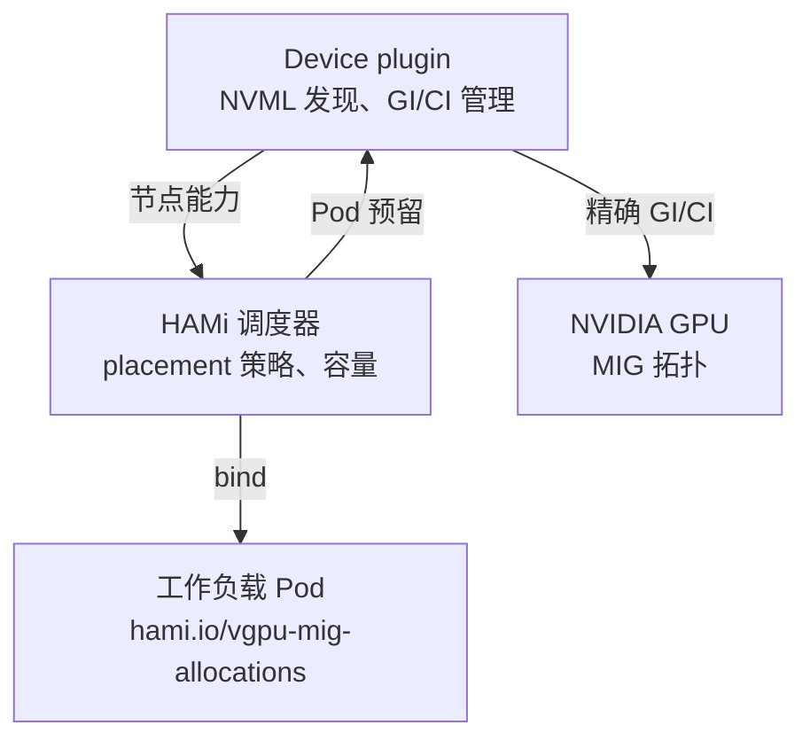
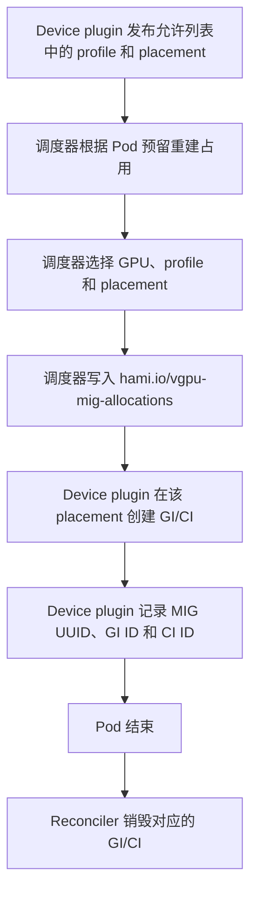

## 特别感谢

最初的 Dynamic MIG 功能在 @sailorvii 的帮助下实现。v2.10.0 的预留优先重构由 @FouoF 贡献。

## 介绍

NVIDIA GPU 内置的共享方法包括：时间片、MPS 和 MIG。时间片共享的上下文切换会浪费一些时间，所以我们选择了 MPS 和 MIG。GPU 会暴露多种 MIG profile，但固定的整卡几何布局必须在工作负载到达前选定。切换该布局通常意味着排空 GPU。我们希望开发一个自动切片插件，并在用户需要时创建切片。

从 v2.10.0 起，HAMi 使用预留优先模型：device plugin 通过 NVML 发现并发布允许列表中的 profile 及合法 placement，调度器为每个 Pod 预留具体的 profile 和 placement，device plugin 在 `Allocate` 时创建 GI/CI。Pod 结束后回收该实例。

对于调度方法，将支持节点级别的 binpack 和 spread。参考 binpack 插件，我们考虑了 CPU、内存、GPU 显存和其他用户定义的资源。HAMi 是通过使用 [hami-core](https://github.com/Project-HAMi/HAMi-core) 完成的，这是一个 cuda-hacking 库。但 MIG 在全球范围内也被广泛使用。需要一个用于动态-mig 和 hami-core 的统一 API。

## 目标

- CPU、内存和 GPU 组合调度
- GPU 动态切片：HAMi-core 和 MIG
- 支持通过 GPU 显存、CPU 和显存的节点级别 binpack 和 spread
- 不同虚拟化技术的统一 vGPU 池
- 任务可以选择使用 MIG、使用 HAMi-core 或同时使用两者。

### 配置映射

- hami-scheduler-device-configMap 此 configmap 定义了插件配置，包括 resourceName、MIG profile 允许列表和节点级别配置。

```yaml
apiVersion: v1
data:
  device-config.yaml: |
    nvidia:
      resourceCountName: nvidia.com/gpu
      resourceMemoryName: nvidia.com/gpumem
      resourceCoreName: nvidia.com/gpucores
      migProfileAllowlist:
      - models: [ "A30" ]
        profiles: [ "1g.6gb", "2g.12gb", "4g.24gb" ]
      - models: [ "A100-SXM4-40GB", "A100-40GB-PCIe", "A100-PCIE-40GB" ]
        profiles: [ "1g.5gb", "2g.10gb", "3g.20gb", "7g.40gb" ]
      - models: [ "A100-SXM4-80GB", "A100-80GB-PCIe", "A100-PCIE-80GB"]
        profiles: [ "1g.10gb", "2g.20gb", "3g.40gb", "7g.79gb" ]
      nodeconfig:
          - name: nodeA
            operatingmode: hami-core
          - name: nodeB
            operatingmode: mig
```

允许列表是集群策略。拥有该 GPU 的节点通过 NVML 提供显存、算力、切片数量和合法 placement。不要在 ConfigMap 中重复这些值。

## 结构




device plugin 是硬件权威。调度器是预留权威。Pod 注解是两者之间的持久交接。

## 示例

动态 MIG 与 HAMi 任务兼容，如下例所示：只需设置 `nvidia.com/gpu` 和 `nvidia.com/gpumem`。

```yaml
apiVersion: v1
kind: Pod
metadata:
  name: gpu-pod1
spec:
  containers:
    - name: ubuntu-container1
      image: ubuntu:22.04
      command: ["bash", "-c", "sleep 86400"]
      resources:
        limits:
          nvidia.com/gpu: 2 # 请求 2 个 vGPU
          nvidia.com/gpumem: 8000 # 每个 vGPU 包含 8000m 设备显存（可选，整数）
```

任务可以通过设置 `annotations.nvidia.com/vgpu-mode` 为相应的值来决定仅使用 `mig` 或 `hami-core`，如下例所示：

```yaml
apiVersion: v1
kind: Pod
metadata:
  name: gpu-pod1
  annotations:
    nvidia.com/vgpu-mode: "mig"
spec:
  containers:
    - name: ubuntu-container1
      image: ubuntu:22.04
      command: ["bash", "-c", "sleep 86400"]
      resources:
        limits:
          nvidia.com/gpu: 2 # 请求 2 个 vGPU
          nvidia.com/gpumem: 8000 # 每个 vGPU 包含 8000m 设备显存（可选，整数）
```

## 流程

使用动态-mig 的 vGPU 任务的流程如下所示：




请注意，提交任务后，调度器会将 `nvidia.com/gpumem` 匹配到允许列表中的 profile，并选择合法的空闲 placement。占用区间为 `[start, start + size)`。你可以更改 ConfigMap `hami-scheduler-device` 中的 `migProfileAllowlist`，并重启调度器和 device plugin。

如果你在空的 A100-PCIE-40GB 节点上提交示例，调度器会两次选择 `2g.10gb`（允许列表中显存不少于 8000 MiB 的最小 profile），使用互不重叠的 placement，然后由 device plugin 创建两个 `2g.10gb` 实例。

不要编辑 `hami.io/vgpu-mig-allocations`。不完整或旧版 `GPU-UUID[template-slot]` 身份无法被安全接管；升级到 v2.10.0 前请排空基于几何布局的 MIG Pod。参见 [Migrating to HAMi Dynamic MIG](https://github.com/Project-HAMi/HAMi/blob/v2.10.0/docs/develop/dynamic-mig-migration.md) 和 [Dynamic MIG Architecture](https://github.com/Project-HAMi/HAMi/blob/v2.10.0/docs/develop/mig-dynamic-deallocate.md)。
