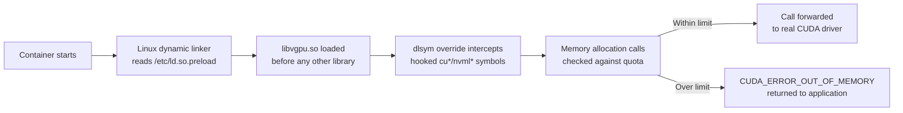

:::note

This page has not yet been translated into Chinese. The English content is shown below. Contributions are welcome — see [Contributing to HAMi](https://project-hami.io/docs/contributor/contributing).

本页面尚未翻译为中文，以下显示英文内容。欢迎贡献翻译。

:::

HAMi enforces GPU memory limits differently from kernel-level mechanisms such as Linux cgroups or NVIDIA MIG. Understanding the enforcement model is essential for diagnosing situations where a container appears to ignore its `nvidia.com/gpumem` quota.

## How HAMi Enforces Memory Limits

HAMi uses a user-space library called **`libvgpu.so`** (part of [HAMi-core](../developers/hami-core-design.md)) to intercept CUDA API calls inside each container. The enforcement chain works as follows:



When `hami-device-plugin` runs its `Allocate` handler for a new Pod, it performs four injections:

1. **Device files** — mounts `/dev/nvidia*` into the container.
2. **`libvgpu.so`** — hostPath-mounts `/usr/local/vgpu/libvgpu.so` into the container at the same path.
3. **`ld.so.preload`** — hostPath-mounts `/usr/local/vgpu/ld.so.preload` (which contains the single line `/usr/local/vgpu/libvgpu.so`) into the container as `/etc/ld.so.preload`. The Linux dynamic linker reads this file when any process starts and loads the listed libraries **first**, achieving transparent interception without modifying environment variables.
4. **Environment variables** — sets `CUDA_DEVICE_MEMORY_LIMIT_<index>=<N>m` (per-device VRAM quota in MiB) and `CUDA_DEVICE_SM_LIMIT=<percentage>` (compute quota).

Once loaded, `libvgpu.so` overrides `dlsym` and intercepts the specific CUDA and NVML symbols listed in its hook table — not every function whose name starts with `cu` or `nvml`. Calls to `cu*`/`nvml*` functions that aren't in the hook table resolve normally to the real driver. The key interceptions are:

| Intercepted function | What HAMi does |
| --- | --- |
| `cuMemAlloc_v2`, `cuMemAllocManaged`, `cuMemAllocHost_v2` | Checks `current usage + request ≤ CUDA_DEVICE_MEMORY_LIMIT`; returns `CUDA_ERROR_OUT_OF_MEMORY` if exceeded |
| `nvmlDeviceGetMemoryInfo`, `nvmlDeviceGetMemoryInfo_v2` | Reports the quota value instead of physical VRAM, so `nvidia-smi` inside the container shows only the allocated share |
| `cuLaunchKernel`, `cuLaunchKernelEx` | Feeds a token-bucket rate limiter (`g_cur_cuda_cores`) to throttle compute to `CUDA_DEVICE_SM_LIMIT` percent |

For the full interception architecture, see [GPU Virtualization Principles](../core-concepts/gpu-virtualization.md).

## Soft Enforcement vs Hard Enforcement

HAMi's memory limit is a **soft, user-space** enforcement. It is not equivalent to hardware partitioning or kernel-level isolation:

| Property | HAMi vGPU (`libvgpu.so`) | NVIDIA MIG | Linux cgroups (CPU/RAM) |
| --- | --- | --- | --- |
| Enforcement layer | User-space library preload | GPU hardware engine | Linux kernel |
| Bypassable? | Yes — if the interception chain is broken | No | No (without root/CAP_SYS_ADMIN) |
| Requires hardware support? | No — any NVIDIA GPU | Ampere+ only (A100, H100) | N/A |
| Granularity | 1 MiB memory, 1% compute | Fixed MIG profiles | N/A for GPU |
| Multi-tenant noise isolation | Best-effort | Strong (separate SM partitions) | N/A for GPU |

**Key takeaway**: any mechanism that prevents `libvgpu.so` from being loaded, or that calls the GPU driver without going through the intercepted symbol table, will bypass HAMi's memory limit. This is by design — HAMi trades absolute isolation for flexibility, zero hardware requirements, and fine-grained partitioning.

## Common Bypass Scenarios and How to Fix Them

### 1. `CUDA_DISABLE_CONTROL=true` is set {#cuda-disable-control}

**Symptoms**: Container uses the full physical GPU memory. `nvidia-smi` inside the container shows total physical VRAM.

**Root cause**: When the environment variable `CUDA_DISABLE_CONTROL` is set to `true`, `hami-device-plugin` skips the `ld.so.preload` mount entirely. The `libvgpu.so` library is never loaded, and no interception occurs.

**Diagnostic**:

```bash
# Check if the env var is set in a running Pod
kubectl exec -it <pod-name> -- env | grep CUDA_DISABLE_CONTROL
```

If the output shows `CUDA_DISABLE_CONTROL=true`, enforcement is disabled.

**Resolution**: Remove `CUDA_DISABLE_CONTROL` from the Pod spec (or set it to `false`). If a third-party Helm chart or operator is injecting it, trace the source with:

```bash
kubectl get pod <pod-name> -o jsonpath='{.spec.containers[*].env[*]}' | tr ',' '\n' | grep -i disable
```

### 2. `libvgpu.so` or `ld.so.preload` not mounted {#libvgpu-not-mounted}

**Symptoms**: Container uses full physical VRAM. No `[HAMi-core]` log lines appear in container stdout/stderr.

**Root cause**: The `nvidia-container-runtime` is not configured as the default containerd runtime, or the hostPath files are missing on the node. Without the `nvidia` runtime, containerd does not invoke the NVIDIA container hook that sets up GPU device access, and HAMi's hostPath mounts may not resolve correctly.

**Diagnostic**:

```bash
# Step 1: Verify the containerd default runtime on the GPU node
kubectl debug node/<node-name> -it --image=busybox -- \
  chroot /host containerd config dump | grep default_runtime_name
# Expected output: default_runtime_name = "nvidia"

# Step 2: Verify libvgpu.so exists on the host node
kubectl debug node/<node-name> -it --image=busybox -- \
  ls -la /host/usr/local/vgpu/libvgpu.so
# Expected: file exists with non-zero size

# Step 3: Verify ld.so.preload content on the host node
kubectl debug node/<node-name> -it --image=busybox -- \
  cat /host/usr/local/vgpu/ld.so.preload
# Expected output: /usr/local/vgpu/libvgpu.so

# Step 4: Verify the mounts are present inside the Pod
kubectl exec -it <pod-name> -- cat /etc/ld.so.preload
# Expected output: /usr/local/vgpu/libvgpu.so

kubectl exec -it <pod-name> -- ls -la /usr/local/vgpu/libvgpu.so
# Expected: file exists
```

**Resolution**:

- If the containerd default runtime is not `nvidia`, follow the [Prerequisites](../installation/prerequisites.md) guide to configure the NVIDIA Container Toolkit.
- If `libvgpu.so` is missing on the host, verify that `hami-device-plugin` is running and healthy on that node:

  ```bash
  kubectl get pods -n kube-system -l app.kubernetes.io/component=device-plugin -o wide
  ```

### 3. Docker-in-Docker (DinD) {#dind}

**Symptoms**: Inner containers launched by a DinD daemon inside a HAMi Pod use full GPU memory. The outer container respects the HAMi limit; inner containers do not.

**Root cause**: The `/etc/ld.so.preload` file is mounted into the **outer** container via hostPath. When the inner Docker daemon creates its own containers, those containers get a fresh filesystem and do not inherit the outer container's hostPath mounts. The inner containers never load `libvgpu.so`.

**Diagnostic**:

```bash
# From inside the outer (HAMi) container, run a command inside the inner container
docker exec <inner-container-id> cat /etc/ld.so.preload
# Expected: empty or "No such file or directory"
```

**Resolution**: HAMi enforcement does not extend to DinD inner containers. This is a fundamental limitation of the hostPath-based injection model. Options:

- Avoid DinD for GPU workloads; use Kubernetes-native pod scheduling instead.
- If DinD is required, manually copy `libvgpu.so` into the inner container image and configure its `/etc/ld.so.preload`. This is fragile and not officially supported.

### 4. Statically linked CUDA or direct Driver API usage {#static-cuda}

**Symptoms**: A specific application exceeds its memory limit while other applications on the same node respect it. No `[HAMi-core Warn]` log lines appear for the offending process, but they do appear for other processes.

**Root cause**: `libvgpu.so` intercepts calls by overriding dynamic symbol resolution (`dlsym`). Applications that statically link `libcuda.so` or `libcudart.so`, or that load the CUDA driver via `dlopen` with `RTLD_DEEPBIND`, bypass the `ld.so.preload` interception entirely. Similarly, applications that call the GPU kernel driver directly via `ioctl` on `/dev/nvidia*` bypass all user-space interception.

**Diagnostic**:

```bash
# Check if the application dynamically links to CUDA
kubectl exec -it <pod-name> -- ldd /path/to/application | grep -E "libcuda|libcudart"
# Expected: shows "libcuda.so => /usr/lib/..." (dynamic linking)
# If output shows "not a dynamic executable" or no CUDA entries, it may be statically linked

# Find the PID of the actual workload process inside the container
# (PID 1 may be a shell, init wrapper, or supervisor, not the CUDA application itself)
kubectl exec -it <pod-name> -- ps aux

# Check if libvgpu.so is loaded by that process (replace <workload-pid> with the PID found above)
kubectl exec -it <pod-name> -- cat /proc/<workload-pid>/maps | grep libvgpu
# Expected: at least one line showing libvgpu.so mapped into the process
```

**Note**: `ldd` only lists shared library dependencies declared at link time — it will not reveal CUDA libraries that an application loads later via `dlopen`, which is common in Python-based frameworks that resolve `libcuda.so` lazily at runtime. A binary can appear dynamically linked and still bypass interception if it (or a library it loads) calls `dlopen` with `RTLD_DEEPBIND`, which lets the newly loaded library resolve its own symbols first instead of deferring to the already-preloaded `libvgpu.so` interceptor. The `/proc/<pid>/maps` check only confirms `libvgpu.so` is preloaded into the process — it is not proof that interception is active for the symbols that process actually calls. To confirm enforcement, run a controlled test: attempt an allocation past the configured quota and confirm it fails with `CUDA_ERROR_OUT_OF_MEMORY`, or check that `nvidia-smi` inside the container reports the quota rather than physical VRAM.

**Resolution**: There is no general workaround for statically linked binaries or for code paths that use `RTLD_DEEPBIND`. Rebuild the application with standard dynamic CUDA linking if possible. Most common AI frameworks (PyTorch, TensorFlow, vLLM, SGLang) dynamically link CUDA and are typically unaffected, but this isn't a guarantee for every build or every custom extension they load — verify with the `/proc/<pid>/maps` check and a controlled enforcement test above rather than assuming based on framework alone.

### 5. `readOnlyRootFilesystem` or restrictive SecurityContext {#readonly-rootfs}

**Symptoms**: Pod fails to start, or `libvgpu.so` is not loaded despite the hostPath mounts being present. Container logs may show permission errors related to `/etc/ld.so.preload`.

**Root cause**: If the Pod's `securityContext` sets `readOnlyRootFilesystem: true`, the hostPath mount of `/etc/ld.so.preload` may fail or be ignored depending on the container runtime version. Some hardened container images also strip or ignore `LD_PRELOAD`-style mechanisms.

**Diagnostic**:

```bash
# Check the Pod's security context
kubectl get pod <pod-name> -o jsonpath='{.spec.containers[0].securityContext}'

# Check if ld.so.preload is readable inside the container
kubectl exec -it <pod-name> -- cat /etc/ld.so.preload
```

**Resolution**: Ensure that the `/etc/ld.so.preload` hostPath mount is present and readable inside the container — the dynamic linker only needs to read it at process startup, not write to it. In practice, hostPath mounts to specific files (like `/etc/ld.so.preload`) typically work even with `readOnlyRootFilesystem: true` because the mount overlays the path. If the mount is failing, check for Pod Security Standards or admission controllers that may be blocking hostPath mounts.

## Quick Diagnostic Checklist

Use this checklist when a container ignores its `nvidia.com/gpumem` limit:

| Step | Command | Expected result |
| --- | --- | --- |
| 1. Check `CUDA_DISABLE_CONTROL` | `kubectl exec <pod> -- env \| grep CUDA_DISABLE` | Unset or `false` |
| 2. Check HAMi env vars | `kubectl exec <pod> -- env \| grep CUDA_DEVICE_MEMORY` | `CUDA_DEVICE_MEMORY_LIMIT_<index>=<N>m` |
| 3. Check `ld.so.preload` | `kubectl exec <pod> -- cat /etc/ld.so.preload` | `/usr/local/vgpu/libvgpu.so` |
| 4. Check `libvgpu.so` exists | `kubectl exec <pod> -- ls -la /usr/local/vgpu/libvgpu.so` | File exists, non-zero size |
| 5. Check library is loaded | Find the workload PID (`kubectl exec <pod> -- ps aux`), then `kubectl exec <pod> -- cat /proc/<workload-pid>/maps \| grep libvgpu` | At least one mapped region |
| 6. Check containerd runtime | `containerd config dump \| grep default_runtime_name` (on node) | `nvidia` |
| 7. Check device-plugin health | `kubectl get pods -n kube-system -l app.kubernetes.io/component=device-plugin` | All pods `Running` |

If all seven checks pass and the limit is still not enforced, the workload may be using a [static CUDA binary or direct driver API](#static-cuda). Don't rely on the absence of `[HAMi-core]` log lines as proof of a bypass — the environment variable `LIBCUDA_LOG_LEVEL` can suppress HAMi-core's logging entirely, so a quiet log stream doesn't mean interception isn't happening. Instead, follow the checks from [scenario 4](#static-cuda): confirming `libvgpu.so` is mapped in `/proc/<pid>/maps` for the actual offending process only verifies the library is preloaded, not that interception is active — run a controlled enforcement test (attempt an over-quota allocation, or compare `nvidia-smi` output inside the container against physical VRAM) to confirm calls are actually being intercepted.

## Related Pages

- [Troubleshooting](./troubleshooting.md) — General troubleshooting checklist
- [GPU Virtualization Principles](../core-concepts/gpu-virtualization.md) — Full architecture of the interception chain
- [HAMi-core Design](../developers/hami-core-design.md) — Developer-level design of the hook library
- [FAQ: How does HAMi enforce GPU memory and compute limits?](../faq/faq.md#hami-如何强制执行-gpu-显存和算力限制)
- [FAQ: HAMi vGPU vs NVIDIA MIG](../faq/faq.md#hami-vgpu-与-nvidia-mig-有何区别各适用于什么场景)
