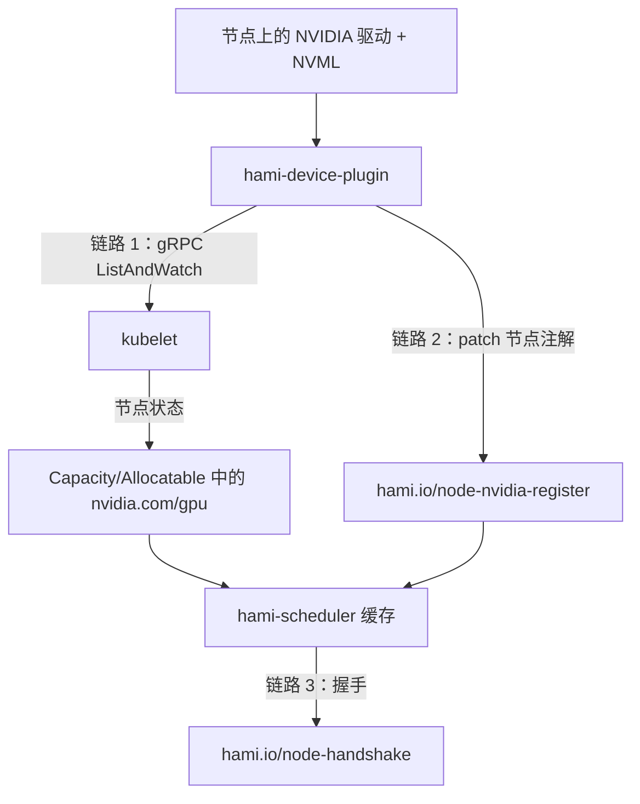

在 HAMi 调度任何任务之前，GPU 节点必须先完成注册。本页覆盖发生在调度**之前**的故障：节点没有上报任何 GPU、HAMi 调度器不知道该节点存在，或者一个原本正常的节点悄悄从集群的 GPU 容量中消失。

典型现象：

- `kubectl describe node` 的 `Capacity` 和 `Allocatable` 中没有 `nvidia.com/gpu`。
- 申请 `nvidia.com/gpu` 的 Pod 一直处于 `Pending`，提示 `0/N nodes are available`，并且**没有** `hami-scheduler` 发出的 `FilteringFailed` 事件。
- 主机上 `nvidia-smi` 正常，但该节点对集群没有任何贡献。
- 节点昨天还能用，今天就不再被选中。

如果你的 Pod **确实**收到了 `hami-scheduler` 的 `FilteringFailed` 事件，说明注册已经成功，问题出在调度阶段。请参阅[排障手册](./troubleshooting.md)。

## 注册是如何工作的

注册不是一个动作，而是三条彼此独立的链路，每一条都可能单独出问题：



| 链路 | 写入方 | 携带内容 | 观察位置 |
| --- | --- | --- | --- |
| 设备数量 | Device Plugin 到 kubelet | 仅一个整数 | 节点 `Allocatable` 中的 `nvidia.com/gpu` |
| 设备规格 | Device Plugin 到 API Server | UUID、显存、算力、型号、NUMA、健康状态 | `hami.io/node-nvidia-register` 节点注解 |
| 存活握手 | 调度器到 API Server | 一个时间戳 | `hami.io/node-handshake` 节点注解 |

数量和规格之所以走两条路，是因为 Device Plugin API 只能上报一个整数类型的资源。因此完全可能出现这种情况：节点上报了 `nvidia.com/gpu: 10`，但 HAMi 调度器仍然拒绝使用它，因为调度器真正读取的那个注解不存在。

kubelet 上报的数量是**放大后**的数量：物理 GPU 数乘以 `devicePlugin.deviceSplitCount`（默认 `10`）。默认安装下一块物理卡显示为 `nvidia.com/gpu: 10`，而不是 `1`。参阅 [GPU 虚拟化](../core-concepts/gpu-virtualization.md)。

## 第 1 步：定位出问题的链路

在做任何改动之前，先对故障节点执行以下三项检查：

```bash
NODE=<node-name>

# 链路 1：kubelet 是否上报了该资源？
kubectl get node $NODE -o jsonpath='{.status.allocatable.nvidia\.com/gpu}{"\n"}'

# 链路 2：Device Plugin 是否写入了设备规格？
kubectl get node $NODE -o jsonpath='{.metadata.annotations.hami\.io/node-nvidia-register}{"\n"}'

# 链路 3：该节点上是否真的运行着 Device Plugin Pod？
kubectl get pods -n kube-system \
  -l app.kubernetes.io/component=hami-device-plugin \
  -o wide --field-selector spec.nodeName=$NODE
```

根据结果决定接下来阅读的章节：

| 结果                                      | 出问题的链路       | 跳转              |
| ----------------------------------------- | ------------------ | ----------------- |
| 节点上没有 Device Plugin Pod              | 什么都没有在注册   | [情况 1](#case-1) |
| Pod 存在但不是 `Running`                  | 插件无法启动       | [情况 2](#case-2) |
| Pod 为 `Running` 但 `nvidia.com/gpu` 为空 | 插件到 kubelet     | [情况 3](#case-3) |
| `nvidia.com/gpu` 有值但注解为空           | 插件到 API Server  | [情况 4](#case-4) |
| 两者都有值但 Pod 仍 `Pending`             | 调度器看不到该节点 | [情况 5](#case-5) |

## 情况 1：节点上没有 Device Plugin Pod {#case-1}

HAMi NVIDIA Device Plugin DaemonSet 带有节点选择器，Chart 默认值为：

```yaml
devicePlugin:
  nvidiaNodeSelector:
    gpu: "on"
```

没有该标签的节点永远不会被调度 Device Plugin Pod，三条链路也就都不会启动。这是 GPU 节点毫无贡献的最常见单一原因。

### 检查

```bash
kubectl get node $NODE --show-labels | tr ',' '\n' | grep gpu
kubectl get daemonset -n kube-system hami-device-plugin \
  -o jsonpath='{.spec.template.spec.nodeSelector}{"\n"}'
```

### 修复

```bash
kubectl label node $NODE gpu=on --overwrite
```

然后等待 DaemonSet 下发 Pod：

```bash
kubectl rollout status daemonset/hami-device-plugin -n kube-system
```

如果标签本来就正确，请检查节点上是否存在 DaemonSet 无法容忍的污点：

```bash
kubectl describe node $NODE | grep -A 3 Taints
```

必要时在 `devicePlugin.tolerations` 中补充相应条目。节点打标签的说明另见[前置条件](../installation/prerequisites.md)。

## 情况 2：Device Plugin Pod 无法保持运行 {#case-2}

```bash
kubectl logs -n kube-system -l app.kubernetes.io/component=hami-device-plugin \
  -c device-plugin --tail=100
kubectl describe pod -n kube-system -l app.kubernetes.io/component=hami-device-plugin
```

### NVML 初始化失败

```plaintext
nvml Init err:  ERROR_LIBRARY_NOT_FOUND
```

Device Plugin 在扫描设备时将任何 NVML 失败视为致命错误并退出，因此容器会进入 `CrashLoopBackOff`，而不是降级运行。`nvml get memory error`、`nvml get name error` 和 `nvml new device by index error` 同样走这条致命路径。

这几乎总是意味着容器没有拿到驱动，而根因通常是节点上 `nvidia-container-runtime` 不是默认运行时：

```bash
containerd config dump | grep default_runtime_name
```

输出必须是 `nvidia`。如果不是，请按[前置条件](../installation/prerequisites.md)配置后重启容器运行时。在 GPU Operator 25.10 及以上版本中，默认运行时会刻意保持为 `runc`；这种情况需要改为设置 `devicePlugin.runtimeClassName=nvidia`，详见[排障手册](./troubleshooting.md#nvidia-toolkit-gpu-operator-25-10)。

### 卡在 `Init` 阶段

```plaintext
Waiting for /run/nvidia/validations/toolkit-ready...
```

`toolkit-validation` 初始化容器会一直阻塞，直到 NVIDIA Container Toolkit 在 `devicePlugin.gpuOperatorToolkitReady.hostPath`（默认 `/run/nvidia/validations`）下写入 `toolkit-ready` 文件。该开关默认关闭，仅面向使用 GPU Operator 的集群。如果在没有 GPU Operator 的集群上启用了它，这个文件永远不会出现，初始化容器就会一直等待：

```bash
helm upgrade hami hami-charts/hami -n kube-system --reuse-values \
  --set devicePlugin.gpuOperatorToolkitReady.enabled=false
```

### 节点名未解析

Device Plugin 会 patch 由其 `NODE_NAME` 环境变量指定的节点，该变量由 Chart 从 `spec.nodeName` 注入。在早于 v2.3.10 的 Chart 中该变量名为 `NodeName`，镜像与 Chart 版本不匹配会导致插件无法识别自己所在的节点。请升级而不是手工修改：

```bash
helm upgrade hami hami-charts/hami -n kube-system --reuse-values
```

## 情况 3：资源始终不出现在 Allocatable 中 {#case-3}

Pod 处于 `Running`，NVML 也正常，但 `nvidia.com/gpu` 不存在。说明 Device Plugin 向 API Server 完成了注册，却没有向 kubelet 注册。

### 检查

```bash
kubectl logs -n kube-system -l app.kubernetes.io/component=hami-device-plugin \
  -c device-plugin --tail=200 | grep -i -E "register|socket|kubelet"

ls -l /var/lib/kubelet/device-plugins/   # 在节点上执行
```

插件通过该目录下的 `kubelet.sock` 注册。Chart 从 `devicePlugin.pluginPath` 挂载该目录，默认值为 `/var/lib/kubelet/device-plugins`。如果你的发行版改变了 kubelet 根目录，插件会把 socket 写到 kubelet 根本不读取的位置，注册就会悄无声息地一直失败。

### 修复

先在节点上确认真实路径，再让 Chart 指向它：

```bash
# 在节点上执行
ps aux | grep kubelet | grep -o '\--root-dir=[^ ]*'

helm upgrade hami hami-charts/hami -n kube-system --reuse-values \
  --set devicePlugin.pluginPath=<kubelet-root>/device-plugins
```

重启 kubelet 也会强制所有 Device Plugin 重新注册，这是快速验证 socket 路径是否为根因的办法。

## 情况 4：注册注解缺失或过期 {#case-4}

这种情况最容易被误判为调度器的 Bug。kubelet 已经上报了 GPU，`kubectl describe node` 看起来一切正常，但 `hami-scheduler` 从不把 Pod 放到这个节点上。

### 读取注解

```bash
kubectl get node $NODE \
  -o jsonpath='{.metadata.annotations.hami\.io/node-nvidia-register}' | jq .
```

默认安装下一块 24 GiB 显卡的预期输出：

```json
[
  {
    "id": "GPU-fc28df76-54d2-c387-e52e-5f0a9495968c",
    "count": 10,
    "devmem": 24576,
    "devcore": 100,
    "type": "NVIDIA-NVIDIA L40S",
    "mode": "hami-core",
    "health": true
  }
]
```

| 字段      | 含义                    | 来源                               |
| --------- | ----------------------- | ---------------------------------- |
| `id`      | GPU UUID                | NVML                               |
| `count`   | 逻辑切分数量            | `devicePlugin.deviceSplitCount`    |
| `devmem`  | 可调度显存（MiB）       | 物理显存乘以 `deviceMemoryScaling` |
| `devcore` | 可调度算力百分比        | `deviceCoreScaling` 乘以 100       |
| `type`    | 型号，带 `NVIDIA-` 前缀 | NVML                               |
| `numa`    | NUMA 节点               | sysfs                              |
| `mode`    | `hami-core` 或 `mig`    | 插件运行模式                       |
| `health`  | 设备健康状态            | Device Plugin 健康检查             |

:::warning 零值字段会被省略

该注解使用 `omitempty` 序列化，因此任何取值为零或 `false` 的字段都会直接消失，而不是显示出来。**不健康的 GPU 根本不会有 `health` 字段**，而不是显示为 `"health": false`。`"numa": 0` 和 `"index": 0` 同理。请把缺失的 `health` 字段理解为不健康，而不是健康。

:::

### 注解只在内容变化时才会重写

Device Plugin 每 30 秒重新扫描一次设备，但会把新编码出的设备列表与上次写入的内容比较，完全相同时就跳过 patch：

```plaintext
Device info unchanged, skipping annotation update
```

这行日志在 `-v=3` 下才可见。在默认日志级别下，一次真正的更新会打印：

```plaintext
Updating node annotations with 1 device(s)
```

由此带来两个推论：注解上的时间戳很旧是正常现象，不能作为插件卡死的证据；反过来，手工删除该注解**不会**在 30 秒内被重新写回，因为插件内存中的缓存仍然与它认为已写入的内容一致。此时应重启 Pod，参见[强制重新注册](#force-a-re-registration)。

### patch 被拒绝

```plaintext
patch node error  nodes "gpu-node-1" is forbidden: User "system:serviceaccount:kube-system:hami-device-plugin" cannot patch resource "nodes"
```

说明该 ServiceAccount 失去了 patch 节点的权限，通常发生在升级不完整或手工改过 ClusterRole 之后：

```bash
kubectl auth can-i patch nodes \
  --as=system:serviceaccount:kube-system:hami-device-plugin
```

重新安装或升级 Chart 即可恢复相关 RBAC 对象。

## 情况 5：调度器看不到该节点 {#case-5}

资源和注解都正确，但 Pod 依然落不下去。此时节点不在调度器的内存缓存中。

### 检查调度器日志

```bash
kubectl logs -n kube-system deploy/hami-scheduler -c vgpu-scheduler-extender --tail=200
```

注册循环每 15 秒执行一次，节点事件和主节点切换时也会触发。把日志级别提高到 `-v=5` 才能看到逐节点的判定，否则这些信息是静默的：

```plaintext
Using label selector for list nodes
Listed nodes
Processing node
Failed to get node devices
```

你的节点出现 `Failed to get node devices`，说明调度器读到了注解但拒绝了它。有三种可能：注解不存在、JSON 无法解码、解码后的列表为空。后两种在默认日志级别下也会打印：

```plaintext
failed to decode node devices
no nvidia gpu device found
```

解码失败通常是手工编辑过注解导致的。

### 原因 A：节点标签选择器排除了该节点

可以通过 `scheduler.nodeLabelSelector` 把调度器限制在部分节点上。Chart 中该项默认被注释掉，因此未经修改的安装会列出所有节点。如果设置过，启动时会打印出该值：

```bash
kubectl logs -n kube-system deploy/hami-scheduler -c vgpu-scheduler-extender \
  | grep "label selector"
```

任何不满足这些标签的节点都不会被注册，无论它多健康。

### 原因 B：你查看的副本不是主节点

只有主节点（leader）会执行注册，其余副本都会打印：

```plaintext
Scheduler is not leader yet, skipping ...
```

当 `hami-scheduler` 有多个副本时，从副本日志安静是正常的，不能说明循环已经停止。下结论之前先确认谁是主节点：

```bash
kubectl get lease -n kube-system | grep hami
```

## 关于握手注解

`hami.io/node-handshake` 是由**调度器**维护的存活标记，而不是由 Device Plugin 维护。把它理解反了会浪费大量排查时间，因此这里明确说明其实际行为：

- 当该注解不存在，或其值不含 `Requesting` 时，调度器会写入 `Requesting_<时间戳>` 并将节点视为健康。
- 时间戳在 **60 秒**以内时，节点健康。
- 超过 60 秒后，调度器会检查节点的可分配 `nvidia.com/gpu`。只要它仍大于零，节点就保持健康，不会触发任何清理。
- 只有在握手过期**并且**可分配数量降为零时，调度器才会执行节点清理：把该节点的设备移出缓存，并删除握手注解。

```bash
kubectl get node $NODE -o jsonpath='{.metadata.annotations.hami\.io/node-handshake}{"\n"}'
# Requesting_2026-08-15 09:12:44
```

两个实践结论：

- **`Requesting_` 时间戳很旧不是故障**，这是正常稳态，它本身永远不会导致节点被移除，不要据此调参。
- **节点离开调度器缓存的真正触发条件是可分配数量降为零**，也就是 Device Plugin 停止向 kubelet 上报。应该排查这一点，而不是握手。调度器会记录这次移除：

  ```plaintext
  Device is unhealthy, cleaning up node
  ```

:::note NVIDIA 使用不带后缀的键

NVIDIA 的握手注解键是 `hami.io/node-handshake`。其他厂商使用带后缀的形式，例如 `hami.io/node-handshake-dcu` 或 `hami.io/node-handshake-xpu`。在 NVIDIA 节点上执行 `kubectl get node -o yaml | grep node-handshake-nvidia` 没有任何输出，这是预期行为。

:::

## 强制重新注册 {#force-a-re-registration}

重启 Device Plugin Pod 会清空其内存中的设备缓存，并在下一次扫描时强制重新 patch 注解。对于注解缺失、被截断或被手工改坏的情况，这是正确的恢复手段：

```bash
kubectl delete pod -n kube-system \
  -l app.kubernetes.io/component=hami-device-plugin \
  --field-selector spec.nodeName=$NODE
```

确认这一轮已经完成：

```bash
kubectl logs -n kube-system -l app.kubernetes.io/component=hami-device-plugin \
  -c device-plugin --tail=50 | grep "Updating node annotations"

kubectl get node $NODE \
  -o jsonpath='{.metadata.annotations.hami\.io/node-nvidia-register}' | jq length
```

调度器会在一个注册周期内重新纳管该节点，因此请等待约 15 秒后再用 Pod 验证。

如果节点仍未注册，请在提交 Issue 前收集以下信息：

```bash
kubectl get node $NODE -o yaml > node.yaml
kubectl logs -n kube-system -l app.kubernetes.io/component=hami-device-plugin \
  -c device-plugin --tail=500 > device-plugin.log
kubectl logs -n kube-system deploy/hami-scheduler \
  -c vgpu-scheduler-extender --tail=500 > scheduler.log
```

## 验证环境

本页描述的行为通过阅读 HAMi **v2.9.0** 与 `master` 分支的源码验证，具体为 `pkg/device-plugin/nvidiadevice/nvinternal/plugin/register.go`、`pkg/device/devices.go`、`pkg/device/nvidia/device.go`、`pkg/scheduler/scheduler.go` 和 `charts/hami/values.yaml`。文中引用的 Chart 默认值取自 `charts/hami` 中的 NVIDIA 配置。各类间隔、60 秒握手窗口以及日志文本都可能随版本变化，依赖具体数值前请先核对你所运行版本的源码。

## 相关页面

- [排障手册](./troubleshooting.md)：运行时与 GPU Operator 相关问题
- [验证 HAMi](../get-started/verify-hami.md)：安装后的端到端检查
- [协议设计](../developers/protocol.md)：注册协议本身
- [GPU 虚拟化](../core-concepts/gpu-virtualization.md)：该注解如何参与调度
