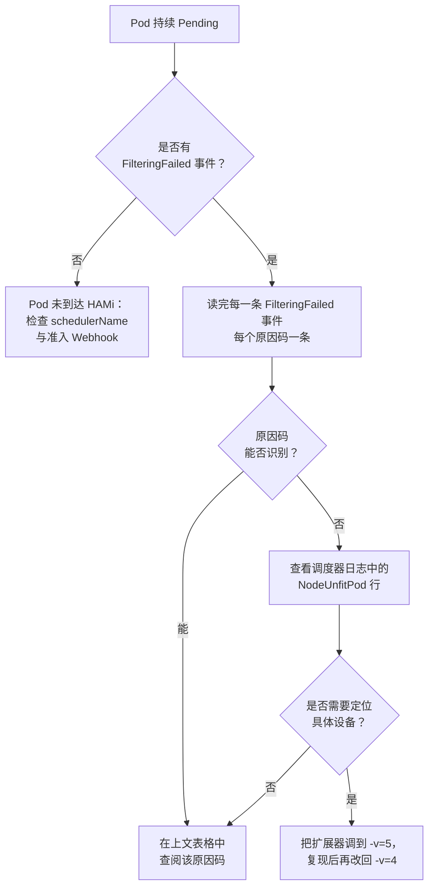

当一个申请了 HAMi 资源的 Pod 一直处于 `Pending` 状态时，HAMi 调度器扩展器其实已经做出了决策，并告诉了你原因。它会在 Pod 上记录 `FilteringFailed` 事件，并使用一组固定的原因码，例如 `CardInsufficientMemory` 或 `CardTimeSlicingExhausted`。

本页说明如何读懂这些消息，以及每个原因码的含义。

:::info

原因码定义在 [HAMi 仓库](https://github.com/Project-HAMi/HAMi) 的 `pkg/device/common/common.go` 中。下表基于 HAMi v2.9.0。更早的版本只会输出其中一部分原因码；由旧版调度器调度的 Pod 可能显示为自由格式的消息。

:::

## 第一步：查看 Pod 事件

```bash
kubectl describe pod <pod-name> -n <namespace>
```

`Events` 部分包含两类不同的消息，两者都很重要：

```plaintext
Events:
  Type     Reason            Age   From            Message
  ----     ------            ----  ----            -------
  Warning  FailedScheduling  15s   default-scheduler  0/3 nodes are available: 3 NodeUnfitPod.
  Warning  FilteringFailed   16s   hami-scheduler     2 nodes CardInsufficientMemory(node-a,node-b)
  Warning  FilteringFailed   16s   hami-scheduler     1 nodes CardTypeMismatch(node-c)
```

- `FailedScheduling` 来自 Kubernetes 调度器，只告诉你有多少节点被拒绝。
- `FilteringFailed` 来自 `hami-scheduler`，携带了真正的原因。**这才是需要处理的那一行。**

如果完全看不到 `FilteringFailed` 事件，说明 Pod 根本没有走到 HAMi。请确认 Pod 使用了 HAMi 的调度器，并且准入 Webhook 正在运行，参见[验证 HAMi](../get-started/verify-hami.md)。

## 第二步：解读消息

### 事件格式

```plaintext
<node-count> nodes <ReasonCode>(<node-a>,<node-b>,...)
```

这个格式有三个容易误读的地方：

- **每个原因码一条事件。** 如果集群中两个节点显存不足、一个节点卡型不匹配，会产生**两条** `FilteringFailed` 事件，而不是一条。下结论之前请读完所有事件。
- **只有在没有任何节点可用时才会出现这些事件。** 只要有一个节点可用，Pod 就会被调度，此时只会得到一条 `FilteringSucceed` 事件，即使其他节点确实被拒绝了。
- **括号中的节点列表是因该原因被拒绝的节点集合。** 同一个节点可能出现在多个原因码下，因为同一节点上不同的 GPU 可能因不同原因被拒绝。

### 调度器日志格式

事件是按节点聚合的。要查看具体是哪块**设备**、因何失败，需要读调度器扩展器的日志：

```bash
kubectl logs -n kube-system deploy/hami-scheduler -c vgpu-scheduler-extender --tail=200
```

在默认日志级别（`-v=4`）下，每个被拒绝的节点会产生一行 `NodeUnfitPod`：

```plaintext
NodeUnfitPod pod="default/gpu-pod" node="node-a" reason="3/8 CardInsufficientMemory, 5/8 CardInsufficientCore"
```

分数的含义是 `<因该原因被拒绝的设备数>/<节点上该类型设备总数>`。上面这行表示 node-a 有 8 块 GPU：3 块显存不足，5 块算力不足。每块被拒绝的设备只会被计入**第一个**未通过的检查，因此一块既缺显存又缺算力的卡只会出现在 `CardInsufficientMemory` 下。优先修复数量最多的那个原因，未必是让 Pod 最快调度成功的路径。

:::warning 唯一的例外

`AllocatedCardsInsufficientRequest` 的分子含义是相反的：它统计的是**通过**筛选的卡数，而不是被拒绝的卡数。`2/8 AllocatedCardsInsufficientRequest` 表示该节点只能提供 2 块可用的卡，而申请需要更多。

:::

通过筛选的节点会输出对应的 `NodeFitPod` 日志，并带上决定最终放置的分数。

## 第三步：查阅原因码

### 节点级拒绝

| 原因码 | 调度器发现了什么 | 如何处理 |
| --- | --- | --- |
| `NodeInsufficientDevice` | 节点上该类型设备的数量少于 Pod 的申请数量。该检查在任何单卡检查之前执行。 | 减少申请卡数，或增加卡数更多的节点。申请 4 卡永远无法落在 2 卡节点上，无论这些卡多空闲。 |
| `NodeUnfitPod` | 汇总行：该节点被拒绝。总是伴随每块卡的具体原因一起出现。 | 阅读同一行日志中的单卡原因。 |
| `NodeFitPod` | 不是失败。该节点通过了筛选并参与打分。 | 无需处理。 |

### 卡在容量检查之前就被排除

| 原因码 | 调度器发现了什么 | 如何处理 |
| --- | --- | --- |
| `CardNotHealth` | 设备插件上报该设备不健康，直接跳过。 | 检查设备插件日志以及该节点上的 `nvidia-smi`。这是节点问题，不是申请问题。 |
| `CardTypeMismatch` | 卡型不满足 Pod 的类型约束。 | 检查 `nvidia.com/use-gputype` / `nvidia.com/nouse-gputype` 注解。当卡不支持 `nvidia.com/vgpu-mode` 所要求的模式时也会触发。参见[指定使用的设备类型](../userguide/nvidia-device/specify-device-type-to-use.md)。 |
| `CardUuidMismatch` | 卡的 UUID 被 Pod 的 UUID 约束排除。 | 检查 `nvidia.com/use-gpuuuid` / `nvidia.com/nouse-gpuuuid`。写死在 Deployment 模板里的过期 UUID 会在节点更换后继续存在，并静默地阻止每一次重新调度。参见[指定使用的设备 UUID](../userguide/nvidia-device/specify-device-uuid-to-use.md)。 |
| `NumaNotFit` | Pod 要求所有卡位于同一 NUMA 节点，而候选卡跨越了 NUMA 边界。 | 仅在 Pod 设置了 `nvidia.com/numa-bind: "true"` 时出现。如果不需要 NUMA 亲和，去掉该注解；或者把卡数减少到单个 NUMA 节点能够满足的范围。 |
| `ModeNotFit` | 节点无法运行该厂商所要求的虚拟化模式。 | 与厂商相关。在 Ascend 上表示在不支持 HAMi-core 共享的节点上申请了该模式；在 Enflame 上表示没有匹配请求的 GCU 规格。 |
| `CardNotFoundCustomFilterRule` | 厂商自定义的过滤规则拒绝了该卡。 | 参见[用户指南](../userguide/device-supported.md)中对应厂商的文档。非 MIG 模式的 NVIDIA 卡不会产生该原因码。 |
| `CardMigTopologyInfeasible` | 卡处于 MIG 模式，但没有任何允许的 MIG 规格拥有与申请显存匹配的空闲位置。 | 卡的空闲显存总量可能是够的，却没有形状合适的连续切片。请将申请对齐到真实的 MIG 规格，或腾空该卡。参见[动态 MIG 支持](../userguide/nvidia-device/dynamic-mig-support.md)。 |

### 卡匹配但容量不足

| 原因码 | 调度器发现了什么 | 如何处理 |
| --- | --- | --- |
| `CardInsufficientMemory` | 设备空闲显存低于申请量：`总量 - 已用 < 申请量`。 | 最常见的原因码。降低 `nvidia.com/gpumem`、等待其他任务结束，或扩容。注意 HAMi 统计的是**已分配**显存而非当前实际占用，因此一块看似空闲的卡也可能已经满了。 |
| `CardInsufficientCore` | 空闲算力百分比低于 `nvidia.com/gpucores`。 | 降低 `gpucores`，或把 Pod 放到流式负载更少的卡上。 |
| `CardTimeSlicingExhausted` | 该卡承载的任务数已达上限。 | 每块卡最多接受 `deviceSplitCount` 个任务（默认 10），与剩余显存无关。显存充足的卡依然会拒绝第 11 个任务。如果负载足够小，可以调高该值。参见[全局配置](../userguide/configure.md)。 |
| `CardComputeUnitsExhausted` | Pod 完全没有申请算力，而该卡的算力已被占满。 | 省略 `gpucores` 的申请并不是"随便放"：它同样无法落在算力已 100% 分配的卡上。请显式指定 `gpucores`，或释放该卡的算力。 |
| `ExclusiveDeviceAllocateConflict` | 对已被共享的卡申请了独占，或共享申请落到了被独占的卡上。 | 两种触发方式：在已有任务的卡上申请 `nvidia.com/gpucores: 100`，或启用了 `mutex` GPU 调度策略。参见[调度策略](../userguide/nvidia-device/scheduling-policy.md)。 |
| `ResourceQuotaNotFit` | 该次分配会超出命名空间的 HAMi `ResourceQuota`。 | 这是伪装成容量问题的配额问题：卡是空闲的，命名空间预算不是。参见[使用 ResourceQuota](../userguide/nvidia-device/using-resourcequota.md)。 |
| `AllocatedCardsInsufficientRequest` | 节点上有部分卡可用，但少于申请的数量。 | 该节点部分可用。请减少申请卡数，或在单个节点上腾出足够的卡：HAMi 不会把同一个容器的多张卡拆到不同节点上。 |

## 第四步：当节点汇总不够时获取单卡细节

`NodeUnfitPod` 汇总只告诉你有**多少**块设备失败，不告诉你是**哪些**。设备标识需要 `-v=5` 才会记录：

```bash
helm upgrade hami hami-charts/hami \
  --namespace kube-system \
  --reuse-values \
  --set-json 'scheduler.extender.extraArgs=["--debug","-v=5"]'

kubectl rollout status deploy/hami-scheduler -n kube-system
```

重新创建 Pod，然后再次查看日志。此时每块被拒绝的设备都会自报家门：

```plaintext
CardInsufficientMemory pod="default/gpu-pod" node="node-a" device="GPU-62b7408e-edb2-41d1-bc91-f46165c61130" device total memory=40960 device used memory=39000 request memory=8000
```

`-v=5` 的日志量与集群规模成正比：一个 10 节点、每节点 8 卡的集群，单个失败的 Pod 最多会产生 80 行日志。拿到答案后请恢复默认级别：

```bash
helm upgrade hami hami-charts/hami \
  --namespace kube-system \
  --reuse-values \
  --set-json 'scheduler.extender.extraArgs=["--debug","-v=4"]'
```

## 不带原因码的消息

有些失败发生在单卡筛选之前，因此不会产生原因码。

| 消息 | 含义 |
| --- | --- |
| `no available node, N nodes do not meet` | 所有候选节点都被拒绝。具体原因在同一个 Pod 的其他 `FilteringFailed` 事件中，**不要**只看这一条就停下。 |
| `no available node, all node scores do not meet` | 同样的情况，由不带原因码拆分的旧版 HAMi 输出。请改看调度器日志。 |
| `node unregistered`（仅日志，`-v=5`） | 该节点没有 HAMi 设备注册信息。要么设备插件没有运行，要么它确实没有受支持的加速卡。可用 `kubectl get node <name> -o jsonpath='{.metadata.annotations}'` 检查是否存在 `hami.io/node-*-register`。 |
| `Device type not found` | Pod 申请的设备类型未被调度器构建或启用，例如在没有 `--enable-ascend=true` 的调度器上提交 Ascend 申请。 |

:::note 为什么有些原因不会出现在事件里

聚合事件是通过解析每个节点原因字符串中的 `<n>/<m> <Code>` 分数得到的。以裸形式上报、不带分数的原因码（`NodeInsufficientDevice` 是典型例子）会记录在节点上，但不会形成独立的 `FilteringFailed` 事件。如果事件看起来比实际失败情况"少"，请查看调度器日志。

:::

## 串起来看



## 相关页面

- [排障手册](./troubleshooting.md)：安装与运行时问题，而非调度决策
- [调度器事件日志](../developers/scheduler-event-log.md)：这些事件与日志背后的设计
- [调度策略](../userguide/nvidia-device/scheduling-policy.md)：影响哪些卡会被纳入考虑的节点与 GPU 选择策略
- [常见问题](../faq/faq.md)
