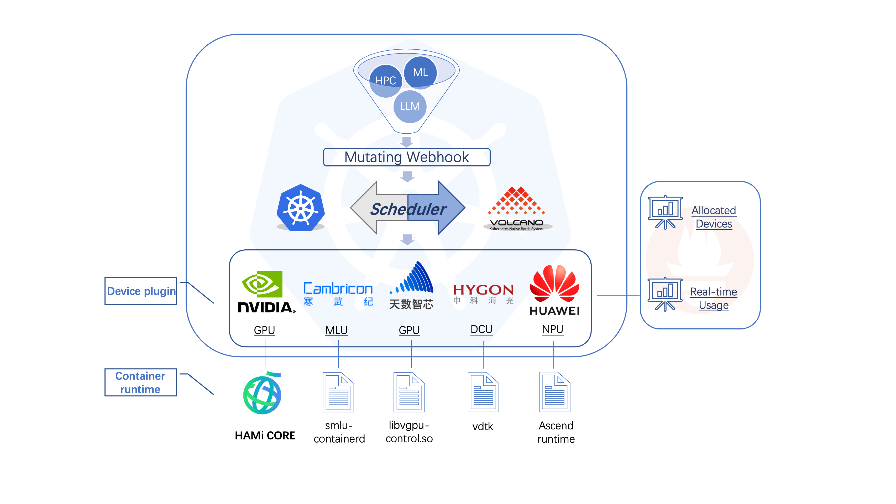
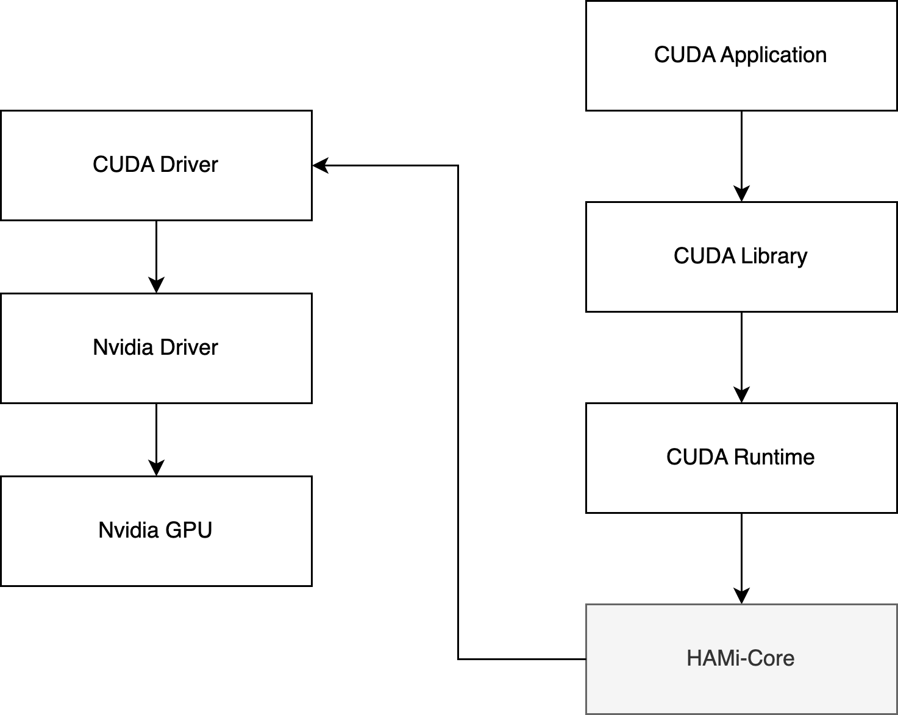

## Introduction

HAMi-core is a hook library for CUDA environment, it is the in-container gpu resource controller, it has been adopted by [HAMi](https://github.com/HAMi-project/HAMi), [volcano](https://github.com/volcano-sh/devices)

## Features

HAMi-core has the following features:

1. Virtualize device memory

    

1. Limit device utilization by self-implemented time shard

1. Real-time device utilization monitor

## Design

HAMi-core operates by Hijacking the API-call between CUDA-Runtime(libcudart.so) and CUDA-Driver(libcuda.so), as the figure below:

