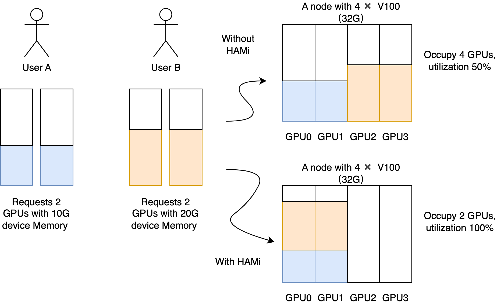

- Allows partial device allocation by specifying device memory.
- Imposes a hard limit on streaming multiprocessors.
- Permits partial device allocation by specifying device core usage.
- Requires zero changes to existing programs.

