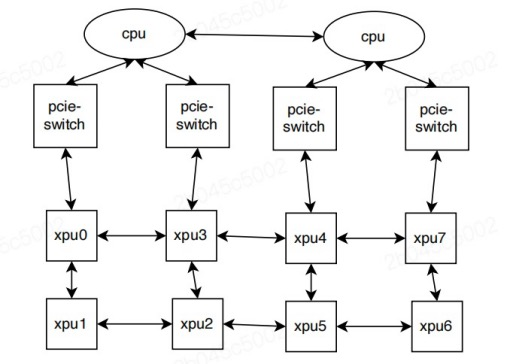

**昆仑芯 GPU 拓扑感知调度现在通过 `kunlunxin.com/xpu` 资源得到支持。**

当在单个P800服务器上配置多个XPU时，当XPU卡连接到同一NUMA节点或互相之间可以直接连接时，性能会显著提升。从而在服务器上的所有 XPU 之间形成拓扑，如下所示：



当用户作业请求一定数量的 `kunlunxin.com/xpu` 资源时，
Kubernetes 将 Pod 调度到适当的节点上，目标是减少碎片化
并最大化性能。然后 `xpu-device` 在选定的节点上执行细粒度分配
请求的资源，遵循以下规则：

1. 只允许 1、2、4 或 8 卡分配。  
2. 1、2 或 4 个 XPU 的分配不能跨越 NUMA 节点。  
3. 分配后应最小化碎片化。

## 重要说明

1. 这种模式**不支持**设备共享。  
2. 这些功能已在昆仑芯 P800 硬件上进行了测试。

## 前置条件

* Kunlunxin driver >= v5.0.21
* Kubernetes >= v1.23
* kunlunxin k8s-device-plugin

## 启用拓扑感知调度

- 在 P800 节点上部署昆仑芯设备插件。
  （请联系您的设备供应商获取相应的软件包和文档。）  
- 按照 `README.md` 中的说明部署 HAMi。

## 运行昆仑芯作业

昆仑芯 P800 GPU 可以通过容器使用 `kunlunxin.com/xpu` 资源类型来请求。
以下是 Pod 规范示例：

```yaml
apiVersion: v1
kind: Pod
metadata:
  name: gpu-pod1
spec:
  containers:
    - name: ubuntu-container
      image: docker.io/library/ubuntu:latest
      imagePullPolicy: IfNotPresent
      command: ["sleep", "infinity"]
      resources:
        limits:
          kunlunxin.com/xpu: 4 # 请求 4 个 XPU
```