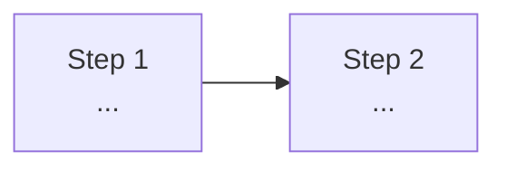

<!--
Lab contribution template. Files starting with an underscore are not
published; copy this file to labs/<your-lab>.md and fill it in.

Authoring rules:
- Every command must have been executed for real; every output block is a
  verbatim capture from that run. State the environment you verified on.
- Levels: Beginner needs no prior HAMi knowledge; Intermediate assumes a
  running HAMi cluster; Advanced may use experimental features or gates.
- Keep the table of contents useful: toc_max_heading_level: 2 means only
  "## " headings appear in the step rail, so name them "Step N: <action>".
- Chinese: add the same file under
  i18n/zh/docusaurus-plugin-content-docs-tutorials/current/labs/.
  If the translation is not ready, copy the English file there with a
  note admonition at the top; a missing file breaks link resolution.
- Add your lab to sidebars-tutorials.js and to the card grid in
  tutorials/overview.md (both locales).
-->

One paragraph: what the reader builds and verifies, and why it matters.

## What You'll Learn

- Three to five concrete outcomes

## Lab Overview



## Prerequisites

- What must exist before step 1 (cluster, quota, tools)
- Cost or hardware notes if relevant

## Step 1: First Action

Why this step exists, in one or two sentences.

```bash
command --exactly-as-verified
```

```plaintext
captured output from the verification run
```

> What the output proves, and what to do if it looks different.

## Step 2: Next Action

...

## Cleanup

```bash
commands that remove everything the lab created
```

## What This Lab Proved

| Claim | Evidence |
| --- | --- |
| ... | ... |

## Next Steps

- Concrete follow-up exercises or links to related labs and docs
