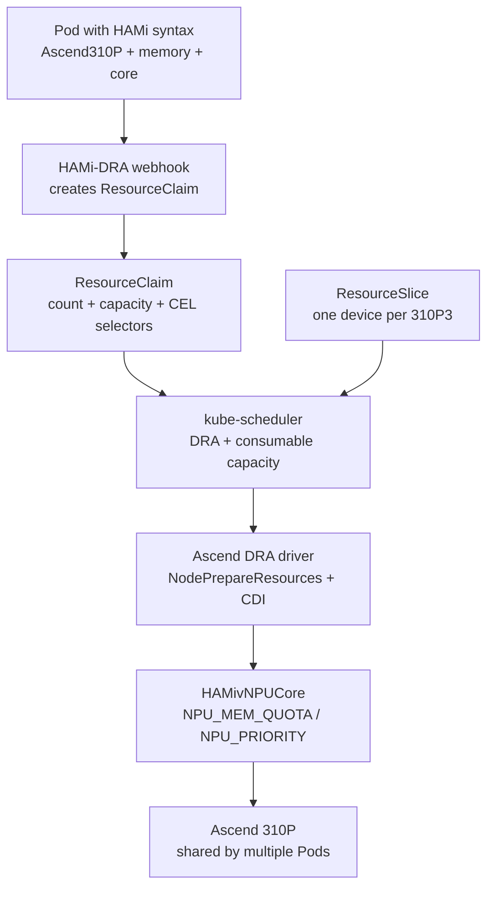

This lab walks the complete HAMi DRA path on Ascend hardware: you install HAMi DRA 0.2.3 and the Ascend DRA driver, submit a Pod written in ordinary HAMi syntax (`huawei.com/Ascend310P` plus `-memory` and `-core`), and watch the admission webhook convert that request into a Kubernetes-native ResourceClaim. The kube-scheduler then allocates a slice of one physical 310P3, two Pods share the same card with independent quotas, and over-capacity requests stay Pending until capacity is released. Every output block in this lab is a verbatim capture from a real run on the verification server.

## What You'll Learn

- How HAMi DRA converts HAMi-style extended resources into ResourceClaims with CEL selectors and capacity requests
- How to read a ResourceSlice: one device per NPU, with `uuid`, `productName`, memory and cores capacity, and `allowMultipleAllocations`
- How the kube-scheduler accounts consumed capacity per shareID and places multiple Pods on the same NPU
- How HAMivNPUCore enforces the memory quota inside the container and turns over-quota allocations into an in-container OOM
- How capacity is released and reclaimed when a Pod is deleted, and what breaks when the components coexist with an existing HAMi core installation

## Lab Overview



Three components, three responsibilities. Keep them apart throughout the lab:

- **HAMi-DRA** decides _how the request is declared_. It is a set of admission webhooks, does no NPU virtualization, and deploys no kubelet plugin.
- **Ascend DRA driver** (driver name `ascend.project-hami.io`, from [4pdOss/hami-dra-driver](https://github.com/4pdOss/hami-dra-driver)) decides _how a device is allocated_: discovery, ResourceSlice publication, kubelet Prepare/Unprepare, CDI injection.
- **HAMivNPUCore** decides _how a device is shared_: `libvnpu.so` interception plus the in-container limiter enforce the memory quota (`NPU_MEM_QUOTA`) and the compute time slice (`NPU_PRIORITY`).

## Prerequisites

- Kubernetes 1.34 or newer (DRA core APIs are GA since 1.34). This lab was verified on 1.35.7, single node, control-plane and worker on the same machine.
- The `DRAConsumableCapacity` feature gate enabled on kube-apiserver, kube-scheduler, and kubelet. Capacity requests and `allowMultipleAllocations` accounting depend on it.
- containerd with CDI enabled: `enable_cdi = true` and `cdi_spec_dirs = ["/etc/cdi", "/var/run/cdi"]`.
- Ascend driver 25.5 or newer on an ARM (aarch64) host, with device-share mode enabled on each NPU used for soft slicing.
- The `ascend` RuntimeClass present (Pods need `runtimeClassName: ascend`).
- cert-manager (HAMi-DRA uses it to issue webhook certificates).

### Verification environment

| Component | Version / Value |
| :-- | :-- |
| Hardware | 2 × Ascend 310P3 (NPU ID 4 / 5, PCIe 0000:81:00.0 / 0000:85:00.0, 21525 MB memory per card) |
| OS | Kylin Linux Advanced Server V10 (Lance), aarch64, kernel 4.19.90-52.48.v2207.ky10 |
| Kubernetes | v1.35.7, single node |
| Container runtime | containerd 1.7.29, CDI enabled |
| Feature gates | `DRAConsumableCapacity=true` on kube-apiserver, kube-scheduler, kubelet |
| Ascend driver / firmware | 25.5.1 / 7.8.0.6.201 |
| HAMi-DRA | 0.2.3 (chart and image tag) |
| Ascend DRA driver | chart `ascend-dra-driver-0.1.1` (app 0.1.0), image `projecthami/ascend-dra-driver:uuid-fix-20260909` (development build, see Step 2) |
| Coexisting | HAMi enterprise 2.10.0-r1 (hami-scheduler, hami-ascend-device-plugin, hami-resource-pool-manager), cert-manager v1.21.1 |

### Check the feature gate

```bash
ps -ef | grep -E "kube-apiserver|kube-scheduler|kubelet" | grep -o "feature-gates=.*"
```

```text
feature-gates=DRAConsumableCapacity=true
feature-gates=DRAConsumableCapacity=true
```

You should see the gate on every control-plane component listed. If any of them misses it, capacity requests are rejected or accounting silently does not happen.

### Check containerd CDI

```bash
grep -E "enable_cdi|cdi_spec_dirs" /etc/containerd/config.toml
```

```text
    cdi_spec_dirs = ["/etc/cdi", "/var/run/cdi"]
    enable_cdi = true
```

### Enable device-share on the NPUs

`-i` is the NPU ID from `npu-smi info -l` (4 and 5 on the verification server). The command applies to all chips on the given NPU:

```bash
npu-smi set -t device-share -i 4 -d 1
npu-smi set -t device-share -i 5 -d 1
npu-smi info -t device-share
```

```text
        NPU ID                         : 4
        Chip Count                     : 1

        Device-share Status            : True
        Chip ID                        : 0

        NPU ID                         : 5
        Chip Count                     : 1

        Device-share Status            : True
        Chip ID                        : 0
```

`Device-share Status: True` on every card you plan to share. Also confirm the RuntimeClass exists:

```bash
kubectl get runtimeclass ascend
```

```text
NAME      HANDLER   AGE
ascend    ascend    ...
```

### Coexistence with an existing HAMi core installation

If the cluster already runs HAMi core or HAMi enterprise (hami-scheduler, hami-webhook, hami-ascend-device-plugin), their mutating webhook also intercepts `huawei.com/Ascend310P*` resources and rewrites the same Pod a second time. DRA workloads must opt out on two levels:

```bash
kubectl create ns dra-ascend-e2e
kubectl label ns dra-ascend-e2e hami.io/webhook=ignore
```

The Pods in this lab additionally carry the label `hami.io/webhook: ignore`. On a clean cluster without HAMi core this step is harmless but unnecessary.

## Step 1: Install HAMi DRA 0.2.3

cert-manager is a dependency; the verification cluster already had v1.21.1. On a clean cluster install cert-manager first.

From the official Helm repository:

```bash
helm repo add hami-dra https://project-hami.github.io/HAMi-DRA
helm repo update
helm search repo hami-dra   # confirm 0.2.3
helm install hami-dra hami-dra/hami-dra -n hami-system \
  --version 0.2.3 -f ascend-values.yaml
```

`ascend-values.yaml` enables only the Ascend conversion:

```yaml
deviceVendors:
  - ascend # Ascend conversion only (910A/B2/B3/B4/B4-1/310P/910C)

drivers:
  nvidia:
    enabled: false # no NVIDIA kubelet driver
  fake:
    enabled: false

monitor:
  enabled: false # optional Prometheus metrics component, not used here

certs:
  certManager:
    enabled: true
```

Verify the webhook came up:

```bash
kubectl get pods -n hami-system
kubectl get mutatingwebhookconfigurations,validatingwebhookconfigurations | grep hami-dra
```

```text
NAME                                          READY   STATUS    RESTARTS   AGE
hami-ascend-device-plugin-vp6tm               1/1     Running   0          5h22m
hami-dra-webhook-5b85c54c78-hbtjc             1/1     Running   0          13s
hami-resource-pool-manager-7b6bd856fb-phd7r   1/1     Running   0          5h23m
hami-scheduler-7dccfd9b96-7spsm               2/2     Running   0          5h28m
```

```text
mutatingwebhookconfiguration.admissionregistration.k8s.io/hami-dra-mutatingwebhookconfiguration
validatingwebhookconfiguration.admissionregistration.k8s.io/hami-dra-validatingwebhookconfiguration
```

The hami-scheduler and hami-ascend-device-plugin Pods in this listing belong to the pre-existing HAMi enterprise installation, not to HAMi-DRA. HAMi-DRA itself runs exactly one deployment, the webhook. It deploys no kubelet plugin: the node-side driver for Ascend comes from the next step.

## Step 2: Install the Ascend DRA Driver

```bash
git clone --recurse-submodules https://github.com/4pdOss/hami-dra-driver.git
cd hami-dra-driver
helm upgrade --install ascend-dra-driver \
  deployments/helm/ascend-dra-driver \
  -n ascend-dra-driver --create-namespace
```

The chart defaults to HAMivNPUCore mode. Do not set `kubeletPlugin.fullCardAndTraditionalVNPU.enabled=true`: that switches to the full-card / template-based vNPU path, which is still under development and disables the HAMivNPUCore gate.

:::note About the image version used in this lab

The verification run used chart `ascend-dra-driver-0.1.1` with the image overridden to the development build `projecthami/ascend-dra-driver:uuid-fix-20260909`, which fixes a ResourceSlice uuid generation bug in earlier builds. Behavior may change before an official release; pin what you tested against.

:::

Check the driver DaemonSet and the DRA objects it publishes:

```bash
kubectl get pods -n ascend-dra-driver
kubectl get deviceclass
kubectl get resourceslice
```

Expected: all driver Pods Running, one DeviceClass named `hami-vnpu-core.project-hami.io`, and one ResourceSlice per node with driver `ascend.project-hami.io`.

## Step 3: Inspect the DeviceClass and the ResourceSlice

The DeviceClass filters devices by driver and type with a CEL expression:

```bash
kubectl get deviceclass hami-vnpu-core.project-hami.io -o yaml
```

```yaml
apiVersion: resource.k8s.io/v1
kind: DeviceClass
metadata:
  name: hami-vnpu-core.project-hami.io
spec:
  selectors:
    - cel:
        expression: |-
          device.driver == "ascend.project-hami.io" &&
          device.attributes["ascend.project-hami.io"].type == "HAMivNPUCore"
```

The ResourceSlice is where Kubernetes sees the NPUs for the first time:

```bash
kubectl get resourceslice
```

```text
NAME                                       DRIVER                    NODE            AGE
aio-node74-arm-ascend.project-hami.io-gktzs   ascend.project-hami.io   aio-node74-arm   3m
```

Expand it (abridged; `kubectl get resourceslice -o yaml` for the full object):

```yaml
apiVersion: resource.k8s.io/v1
kind: ResourceSlice
metadata:
  name: aio-node74-arm-ascend.project-hami.io-gktzs
  ownerReferences:
    - kind: Node
      name: aio-node74-arm
spec:
  driver: ascend.project-hami.io
  nodeName: aio-node74-arm
  pool:
    name: aio-node74-arm
    resourceSliceCount: 1
  devices:
    - allowMultipleAllocations: true # lets multiple claims consume the same device
      name: npu-0-0
      attributes:
        brand: { string: Huawei }
        index: { int: 0 }
        model: { string: 310P3 }
        physicalID: { int: 0 }
        productName: { string: 310P3 }
        type: { string: HAMivNPUCore }
        uuid: { string: 68496E64-20E05477-92C31323-6E78030A-BD003019 }
      capacity:
        cores:
          value: "100" # full card counted as 100
          requestPolicy: { default: "100", validRange: { min: "0", max: "100", step: "1" } }
        memory:
          value: 21525Mi # matches npu-smi
          requestPolicy: { default: 21525Mi, validRange: { min: 1Mi, max: 21525Mi, step: 1Mi } }
    - allowMultipleAllocations: true
      name: npu-1-0
      attributes:
        index: { int: 1 }
        physicalID: { int: 2 }
        productName: { string: 310P3 }
        type: { string: HAMivNPUCore }
        uuid: { string: D8496E64-20C101B1-C0D42F23-AED8030A-40003039 }
      capacity:
        cores: { value: "100", ... }
        memory: { value: 21525Mi, ... }
```

Four details matter for the rest of the lab:

- Each 310P3 is one device (`npu-0-0`, `npu-1-0`), not a card count on the node.
- The `uuid` attribute is the chip UUID, for example `68496E64-20E05477-92C31323-6E78030A-BD003019`. It is **not** a node-name-plus-index string. Card-selection annotations must copy the value from here, never from memory.
- Capacity is published along two dimensions, `memory` (MiB) and `cores` (percent of the full card), each with a `requestPolicy` declaring the valid request range and step.
- `allowMultipleAllocations: true` permits several ResourceClaims on the same device. Without it there is no NPU sharing.

The mapping between ResourceSlice devices and physical cards, cross-checked from the `npu-smi info` process list during the sharing experiments:

| ResourceSlice device | uuid (first 8) | npu-smi NPU ID | PCIe Bus     |
| :------------------- | :------------- | :------------- | :----------- |
| npu-0-0              | 68496E64       | 4              | 0000:81:00.0 |
| npu-1-0              | D8496E64       | 5              | 0000:85:00.0 |

## Step 4: Run the First Ascend Workload

The request syntax is unchanged HAMi syntax:

- Count: `huawei.com/Ascend310P` (integer, cards)
- Memory: `huawei.com/Ascend310P-memory` (MiB)
- Compute: `huawei.com/Ascend310P-core` (percent)
- Card selection: `hami.io/use-Ascend310P-uuid`, the value copied from the ResourceSlice `uuid`
- Model selection: `hami.io/use-nputype`, matched against `productName` (not used in this lab)

```yaml
apiVersion: v1
kind: Pod
metadata:
  name: ascend-share-a
  namespace: dra-ascend-e2e
  labels:
    hami.io/webhook: ignore
  annotations:
    hami.io/use-Ascend310P-uuid: "68496E64-20E05477-92C31323-6E78030A-BD003019" # pins to npu-0-0
spec:
  runtimeClassName: ascend
  containers:
    - name: app
      image: quay.io/ascend/vllm-ascend:v0.23.0-310p
      command: ["sh", "-c", "sleep 3600"]
      resources:
        limits:
          huawei.com/Ascend310P: 1
          huawei.com/Ascend310P-memory: "8192"
          huawei.com/Ascend310P-core: "50"
```

Three choices in this manifest: the `hami.io/webhook: ignore` label keeps the coexisting HAMi core webhook away; `runtimeClassName: ascend` routes containerd through the Ascend Docker Runtime; the `vllm-ascend` image ships CANN, torch_npu, and npu-smi so the container can be inspected from inside later.

```bash
kubectl apply -f pod.yaml
kubectl get pod ascend-share-a -n dra-ascend-e2e
```

```text
NAME            READY   STATUS    RESTARTS   AGE     IP            NODE
ascend-share-a  1/1     Running   0          3m45s   10.244.0.28   aio-node74-arm
```

Running only proves Kubernetes is satisfied. Before trusting it, look at what the webhook actually did.

## Step 5: Observe the Request-to-ResourceClaim Conversion

Save the mutated Pod and diff it against what you submitted:

```bash
kubectl get pod ascend-share-a -n dra-ascend-e2e -o yaml > mutated-pod.yaml
```

The three `huawei.com/*` entries in `resources.limits` are gone. In their place:

```yaml
apiVersion: v1
kind: Pod
metadata:
  name: ascend-share-a
  namespace: dra-ascend-e2e
  labels:
    hami.io/dra: "true" # added by the webhook
    hami.io/webhook: ignore
  annotations:
    hami.io/use-Ascend310P-uuid: 68496E64-20E05477-92C31323-6E78030A-BD003019
spec:
  runtimeClassName: ascend
  containers:
    - name: app
      image: quay.io/ascend/vllm-ascend:v0.23.0-310p
      resources:
        claims: # container-level reference
          - name: dra-ascend-e2e-ascend-share-a-app-ascend310p
  resourceClaims: # pod-level reference
    - name: dra-ascend-e2e-ascend-share-a-app-ascend310p
      resourceClaimName: dra-ascend-e2e-ascend-share-a-app-ascend310p
```

The generated ResourceClaim, after allocation:

```bash
kubectl get resourceclaim -n dra-ascend-e2e
kubectl get resourceclaim dra-ascend-e2e-ascend-share-a-app-ascend310p -n dra-ascend-e2e -o yaml
```

```text
NAME                                           STATE              AGE
dra-ascend-e2e-ascend-share-a-app-ascend310p   allocated,reserved 3m
```

```yaml
apiVersion: resource.k8s.io/v1
kind: ResourceClaim
metadata:
  name: dra-ascend-e2e-ascend-share-a-app-ascend310p
  namespace: dra-ascend-e2e
  finalizers:
    - resource.kubernetes.io/delete-protection
spec:
  devices:
    requests:
      - name: npu
        exactly:
          allocationMode: ExactCount
          count: 1
          deviceClassName: hami-vnpu-core.project-hami.io
          capacity:
            requests:
              cores: "50" # percent, passed through
              memory: "8589934592" # 8192 MiB x 1024 x 1024 = 8 GiB in bytes
          selectors:
            - cel:
                expression: device.driver == "ascend.project-hami.io" && device.attributes["ascend.project-hami.io"].type == "HAMivNPUCore"
            - cel:
                expression: device.attributes["ascend.project-hami.io"].uuid in ["68496E64-20E05477-92C31323-6E78030A-BD003019"]
status:
  allocation:
    devices:
      results:
        - consumedCapacity:
            cores: "50"
            memory: 8Gi
          device: npu-0-0 # the scheduler's pick
          driver: ascend.project-hami.io
          pool: aio-node74-arm
          request: npu
          shareID: be06132e-0aff-4efc-bd8e-42a4e06ed385
    nodeSelector:
      nodeSelectorTerms:
        - matchFields:
            - key: metadata.name
              operator: In
              values: [aio-node74-arm]
  reservedFor:
    - name: ascend-share-a
      resource: pods
```

Field-by-field, this is where HAMi semantics enter DRA semantics:

| ResourceClaim field | Comes from | Conversion |
| :-- | :-- | :-- |
| `count: 1` | `huawei.com/Ascend310P: 1` | integer passed through |
| `capacity.requests.memory: 8589934592` | `-memory: 8192` (MiB) | MiB to bytes, `value x 1024 x 1024` |
| `capacity.requests.cores: "50"` | `-core: 50` | percent passed through |
| selectors, entry 1 | fixed | matches driver plus `type == HAMivNPUCore`, same source as the DeviceClass |
| selectors, entry 2 | annotation `hami.io/use-Ascend310P-uuid` | `uuid in ["..."]`; `no-use-*` annotations invert the expression |
| (if used) selectors, entry 3 | annotation `hami.io/use-nputype` | matched against `productName` |
| claim name | namespace + pod + container | truncated to DNS-1123's 63 characters with a sha256 suffix when too long |

Two details worth pausing on. The unit conversion: HAMi's `-memory` is MiB, DRA capacity is a Quantity in bytes, so 8192 MiB becomes `8589934592`; you write HAMi syntax, the accounting is DRA's. And the `shareID`: every allocated claim gets one, and it is the accounting voucher of the `DRAConsumableCapacity` model (KEP-5075). Each consumption on the same device is accounted independently, which the sharing step will show as two distinct shareIDs.

## Step 6: Verify the NPU Allocation

Three layers, from the cluster down to the node.

**Kubernetes layer.** The claim is `allocated,reserved`, and `status.allocation.devices.results[0].device` is `npu-0-0`, as captured above.

**Container layer.** The quota and device environment:

```bash
kubectl exec -it ascend-share-a -n dra-ascend-e2e -- env | grep -E "NPU_|ASCEND_"
kubectl exec -it ascend-share-a -n dra-ascend-e2e -- ls /dev/davinci* /dev/davinci_manager /dev/devmm_svm
```

```text
NPU_PRIORITY=50
ASCEND_VISIBLE_DEVICES=0
NPU_GLOBAL_SHM_PATH=/hami-shared-region/0_global_registry
NPU_LOCAL_SHM_PATH=/hami-vnpu-shmem/vnpu_local_shmem
NPU_MEM_QUOTA=8192
```

```text
/dev/davinci0
/dev/davinci_manager
/dev/devmm_svm
```

`NPU_MEM_QUOTA=8192` and `NPU_PRIORITY=50` are the HAMivNPUCore memory quota (MiB) and compute time slice, matching the `-memory 8192` and `-core 50` requests. `ASCEND_VISIBLE_DEVICES=0` and `/dev/davinci0` come from CDI injection, as does the `libvnpu.so` referenced by `ld.so.preload` inside the container, the entry point of the interception.

**Node layer.** The driver writes one CDI spec per claim under `CDI_ROOT=/var/run/cdi` during Prepare:

```bash
ls /var/run/cdi/
```

```text
k8s.ascend.project-hami.io-npu_8ec6bbf9-8ce0-4aa1-bc57-7078653d090c.yaml   # this claim, named by uid
k8s.ascend.project-hami.io-npu_common.yaml
```

containerd, with `enable_cdi`, applies the spec at container creation. The DRA allocation lands in the container runtime through the standard CDI interface. The final device-level proof arrives in Step 8, when a real workload runs and the container's torch_npu reports an 8 GiB device instead of the 21 GiB card.

## Step 7: Share One NPU Between Two Pods

The core experiment: two Pods request parts of the same physical 310P3. The key is that both Pods carry the same uuid annotation. With two cards in the machine, leaving the scheduler free could spread the Pods across cards and prove nothing:

```text
Physical Ascend 310P (uuid 68496E64-..., device npu-0-0, capacity 21525 MiB / 100 cores)

+-- Pod A (ascend-share-a): memory 8192 MiB + core 50
+-- Pod B (ascend-share-b): memory 8192 MiB + core 50
```

Create the second Pod as a copy of the first:

```bash
sed 's/ascend-share-a/ascend-share-b/' pod.yaml | kubectl apply -f -
kubectl get resourceclaim -n dra-ascend-e2e
```

```text
NAME                                           STATE              AGE
dra-ascend-e2e-ascend-share-a-app-ascend310p   allocated,reserved 6m
dra-ascend-e2e-ascend-share-b-app-ascend310p   allocated,reserved 2m
```

Compare the allocation results of both claims:

```yaml
# claim-a
results:
  - device: npu-0-0 # the same device
    consumedCapacity: { cores: "50", memory: 8Gi }
    shareID: be06132e-0aff-4efc-bd8e-42a4e06ed385

# claim-b
results:
  - device: npu-0-0 # the same device
    consumedCapacity: { cores: "50", memory: 8Gi }
    shareID: 5554db84-1574-46bd-a3ea-0b7197fbbbda # an independent accounting voucher
```

Both claims landed on `npu-0-0`, each with its own shareID. Before allocating B, the scheduler had already debited A's 8 GiB and 50 cores against the device; that is exactly what `DRAConsumableCapacity` plus `allowMultipleAllocations: true` buys. On the Pod and device level:

```bash
kubectl get pods -n dra-ascend-e2e -o wide
```

```text
NAME             READY   STATUS    IP            NODE
ascend-share-a   1/1     Running   10.244.0.28   aio-node74-arm
ascend-share-b   1/1     Running   10.244.0.29   aio-node74-arm
```

Both containers see the same device node and their own quotas:

```text
pod a: /dev/davinci0  NPU_MEM_QUOTA=8192  NPU_PRIORITY=50  ASCEND_VISIBLE_DEVICES=0
pod b: /dev/davinci0  NPU_MEM_QUOTA=8192  NPU_PRIORITY=50  ASCEND_VISIBLE_DEVICES=0
```

In soft-slicing mode both containers see the same `/dev/davinci0`, not two vNPU device nodes; the isolation is done by libvnpu in user space. After a real workload runs in Step 8, the node's `npu-smi` process list shows both containers' processes on NPU 4.

## Step 8: Verify Isolation and Quota Enforcement

Run a PyTorch/torch_npu tensor allocation test inside Pod A (the image carries the full CANN runtime). Allocate toward the quota, then past it:

```text
# the limiter (HAMivNPUCore's in-container manager) registers the process
[2026-09-17T10:18:46Z INFO  limiter::worker] [Worker PID:381] Initialize SchedulerClient...
[2026-09-17T10:18:46Z INFO  limiter::worker] [Worker PID:381] Registered at proc slot 1

# at ~6150 MB used, a 2050 MB request is refused
[2026-09-17T10:22:22Z WARN  limiter::worker] [Worker PID:1139] Memory Quota Exceeded!
  Request: 2050 MB, Used: 6150 MB, Limit: 8192 MB

# the application sees an in-container OOM (note the 8.00 GiB total, not the card's 21 GiB)
torch.OutOfMemoryError: NPU out of memory. Tried to allocate 2.00 GiB
  (NPU 0; 8.00 GiB total capacity; 2.00 GiB already allocated; ...)
```

This one capture proves two things at once: the quota is enforced in user space by libvnpu and the limiter, with over-quota requests converted to a container OOM; and the device as seen from inside the container has been virtualized to 8 GiB, matching the `-memory 8192` request rather than the physical 21525 MB. On the node, both containers' processes sit on the same physical card:

```bash
npu-smi info   # process list, abridged
```

```text
| NPU   Chip   | Process id   | Process name   | Process memory(MB)   |
| 4     0      | 44533        | python3        | 2156                 |
| 4     0      | 49806        | python3        | 2156                 |
```

`NPU_PRIORITY=50` was injected the same way and constrains compute through time-slice scheduling. This lab verified the injection but did not run a long-running saturated comparison workload, so it draws no conclusion about the effective strength of time-slice isolation on the 310P; the scheduling-side accounting of the compute dimension is fully covered in the next step.

## Step 9: Exhaust Capacity, Release, and Reallocate

Pods A and B now hold 16384 MiB / 100 cores of `npu-0-0`; the device has 5141 MiB / 0 cores left. Submit Pod C requesting 8192 MiB / 50 cores with the same uuid annotation:

```bash
kubectl apply -f pod-c.yaml
kubectl get pod ascend-share-c -n dra-ascend-e2e
kubectl describe pod ascend-share-c -n dra-ascend-e2e | tail -4
kubectl get resourceclaim -n dra-ascend-e2e
```

```text
NAME            READY   STATUS    RESTARTS   AGE
ascend-share-c  0/1     Pending   0          133m
```

```text
  Warning  FailedScheduling  3m3s (x27 over 133m)  default-scheduler
  0/1 nodes are available: 1 cannot allocate all claims. still not schedulable,
  preemption: 0/1 nodes are available: 1 Preemption is not helpful for scheduling.
```

```text
NAME                                           STATE                AGE
dra-ascend-e2e-ascend-share-a-app-ascend310p   allocated,reserved   157m
dra-ascend-e2e-ascend-share-b-app-ascend310p   allocated,reserved   153m
dra-ascend-e2e-ascend-share-c-app-ascend310p   pending              133m
```

Pod C's claim stays `pending` with no allocation result. The second card `npu-1-0` is idle, but the uuid annotation pins Pod C to `npu-0-0`, and the scheduler refuses honestly. The refusal happens inside the scheduler; no node-side device plugin reporting is involved.

### Control experiment: the memory dimension alone

Pod C oversubscribes both dimensions at once (8192 > 5141 memory, 50 > 0 cores), so by itself it cannot tell which dimension rejected it. A control pair on the second card isolates the memory dimension:

| Pod | Request | npu-1-0 state | Result |
| :-- | :-- | :-- | :-- |
| ascend-ctrl-a | 8192 MiB / 50 cores (uuid D8496E64) | initial 21525 / 100 | Running, leaving 13333 MiB / 50 cores |
| ascend-ctrl-b | 14000 MiB / 40 cores (same uuid) | 13333 / 50 left | Pending |

ctrl-b's compute request fits (40 ≤ 50) but the memory request does not (14000 > 13333):

```text
  Warning  FailedScheduling  4m16s (x2 over 9m17s)  default-scheduler
  0/1 nodes are available: 1 cannot allocate all claims. still not schedulable, ...
```

Memory and cores are accounted as two independent dimensions: the scheduler reconciles every allocated claim's `consumedCapacity` against the ResourceSlice's `capacity.value`, dimension by dimension.

### Release and reallocation

Delete Pod A and watch all three layers recover:

```bash
kubectl delete pod ascend-share-a -n dra-ascend-e2e
kubectl get resourceclaim -n dra-ascend-e2e
```

```text
NAME                                           STATE                AGE
dra-ascend-e2e-ascend-ctrl-a-app-ascend310p    allocated,reserved   10m
dra-ascend-e2e-ascend-ctrl-b-app-ascend310p    pending              10m
dra-ascend-e2e-ascend-share-b-app-ascend310p   allocated,reserved   164m
dra-ascend-e2e-ascend-share-c-app-ascend310p   allocated,reserved   143m   # pending to allocated
```

share-a's claim disappeared: the HAMi-DRA validating webhook watches Pod deletions for the `hami.io/dra` label and deletes the corresponding ResourceClaim. On the node, the driver's Unprepare removed share-a's CDI spec and a new one appeared for share-c:

```text
# before
k8s.ascend.project-hami.io-npu_1b737f89-...yaml   (share-b)
k8s.ascend.project-hami.io-npu_8ec6bbf9-...yaml   (share-a, to be reclaimed)
# after
k8s.ascend.project-hami.io-npu_1b737f89-...yaml   (share-b)
k8s.ascend.project-hami.io-npu_8a2fd648-...yaml   (share-c, new allocation)
```

With the capacity restored (16384 - 8192 = 8192 MiB used, 13333 ≥ 8192 free, 50 ≤ 50 cores), Pod C was scheduled within 18 seconds and allocated the same device:

```text
  Warning  FailedScheduling  3m42s (x29 over 143m)  default-scheduler  (29 prior refusals)
  Normal   Scheduled         18s   default-scheduler
  Successfully assigned dra-ascend-e2e/ascend-share-c to aio-node74-arm
  Normal   Started           16s   kubelet  Container started

# share-c allocation: the same npu-0-0, inheriting the released capacity
{"consumedCapacity":{"cores":"50","memory":"8Gi"},"device":"npu-0-0",
 "driver":"ascend.project-hami.io","pool":"aio-node74-arm",
 "shareID":"70cbda02-b70e-47d3-b9c8-c5c5c608a1fb"}
```

The full lifecycle closes: allocate(A), share(A + B on npu-0-0), reject(C, insufficient capacity), release(A), reallocate(C onto the same device).

:::note Boundary of the claim cleanup

Claim deletion is the HAMi-DRA validating webhook's job. If the webhook is down when a Pod is deleted, the claim can linger (still holding capacity in the accounting) until it is cleaned up manually or the webhook recovers; see Troubleshooting.

:::

## Troubleshooting

### Conflicts with the HAMi core webhook

- **Symptom**: with HAMi core or enterprise already in the cluster, DRA Pods get rewritten twice, carry unexpected annotations, or schedule erratically.
- **Cause**: the HAMi core mutating webhook also intercepts `huawei.com/Ascend310P*` resources.
- **Check**: `kubectl get mutatingwebhookconfigurations | grep hami`; diff the Pod spec before and after submission.
- **Fix**: the `hami.io/webhook: ignore` label on both the namespace and the Pod, as in this lab.

### CEL selectors that do not match the ResourceSlice

- **Symptom**: the Pod stays Pending with `cannot allocate all claims`; the claim stays `pending`.
- **Cause**: the uuid annotation does not match the published uuid (for example a hand-written node-name-plus-index guess). Early driver builds also generated wrong uuids; this lab used the `uuid-fix-20260909` build for exactly this reason.
- **Check**: `kubectl get resourceslice -o yaml | grep -A2 uuid` against the Pod annotation.
- **Fix**: always copy the uuid from the ResourceSlice; match `hami.io/use-nputype` against `productName` (for example `310P3`).

### DRAConsumableCapacity not enabled

- **Symptom**: ResourceClaims with `capacity.requests` are rejected, or scheduling does not account capacity (oversubscription succeeds, sharing misbehaves).
- **Cause**: capacity requests and `allowMultipleAllocations` accounting depend on the gate.
- **Check**: `ps -ef | grep -E "kube-apiserver|kube-scheduler|kubelet" | grep -o "feature-gates=.*"`.
- **Fix**: add `DRAConsumableCapacity=true` to all three components and restart them.

### device-share not enabled

- **Symptom**: driver Prepare fails, or containers cannot use the soft-sliced device.
- **Cause**: HAMivNPUCore requires the chip's container-share mode, Ascend driver 25.5 or newer, and an ARM host.
- **Check**: `npu-smi info -t device-share`; `/usr/local/Ascend/driver/version.info`.
- **Fix**: `npu-smi set -t device-share -i <NPU id> -d 1` (applies to all chips on that NPU).

### Pod Running but no NPU in the container

- **Symptom**: the claim is allocated and the Pod Running, but the container has no `/dev/davinci*` and no quota environment variables.
- **Cause**: `runtimeClassName: ascend` missing, or the image lacks CANN and npu-smi (injection comes from CDI plus the RuntimeClass; the user-space tools come from the image).
- **Check**: `kubectl get pod <pod> -o jsonpath='{.spec.runtimeClassName}'`; `kubectl exec ... -- ls /dev/davinci*`.
- **Fix**: set the RuntimeClass; use an image with the CANN runtime (this lab used `quay.io/ascend/vllm-ascend:v0.23.0-310p`).

### ResourceClaim leaks

- **Symptom**: the Pod is gone but its ResourceClaim remains `allocated,reserved`, holding capacity and blocking later Pods.
- **Cause**: the validating webhook was down or missing RBAC when the Pod was deleted. The claim's `resource.kubernetes.io/delete-protection` finalizer prevents accidental deletion, which also means it never disappears on its own.
- **Check**: `kubectl get resourceclaim -A` against the live `hami.io/dra=true` Pods.
- **Fix**: delete orphaned claims manually; check the hami-dra-webhook Pod and its logs.

## Cleanup

```bash
kubectl delete pod ascend-share-a ascend-share-b ascend-share-c \
  ascend-ctrl-a ascend-ctrl-b -n dra-ascend-e2e --ignore-not-found
kubectl get resourceclaim -A | grep ascend310p | awk '{print $1, $2}' | \
  xargs -n2 kubectl delete resourceclaim -n 2>/dev/null || true
kubectl delete ns dra-ascend-e2e --ignore-not-found

helm uninstall ascend-dra-driver -n ascend-dra-driver
kubectl delete ns ascend-dra-driver --ignore-not-found

helm uninstall hami-dra -n hami-system
```

Leave the feature gates and the `ascend` RuntimeClass in place if other work uses them. On the shared lab machine, `device-share` can stay enabled; disabling it affects every workload on the card, HAMi core included.

## What This Lab Proved

| Claim | Evidence |
| :-- | :-- |
| Ascend 310P discovery and ResourceSlice publication | 2 devices with uuid, capacity, and requestPolicy |
| HAMi request to ResourceClaim conversion | mutated Pod, claim YAML, MiB-to-bytes `8589934592`, CEL selectors |
| Scheduler allocation via native DRA | `allocated,reserved` claim, allocation result with shareID |
| Device injection through CDI | in-container env and `/dev/davinci0`, CDI spec in `/var/run/cdi` |
| Two Pods share one physical NPU | both claims on `npu-0-0`, independent shareIDs |
| Memory isolation | limiter refusal at 8192 MB, container OOM, torch_npu reports 8.00 GiB total |
| Compute isolation | `NPU_PRIORITY=50` injected (injection verified; time-slice strength not quantified) |
| Independent two-dimension accounting | Pod C Pending; control pair isolates the memory dimension |
| Release and reallocation | claim deleted, CDI spec swapped, Pod C rescheduled in 18 seconds |

## Next Steps

- The concepts and design behind this path: [How to use HAMi DRA](/docs/installation/how-to-use-hami-dra)
- The same conversion flow on NVIDIA GPUs: [Lab 4: GPU Slicing with Dynamic Resource Allocation](/tutorials/labs/hami-dra) and [Lab 11: KServe Inference with HAMi DRA GPU Sharing](/tutorials/labs/kserve-hami-dra)
- The same hardware under the device-plugin path: [Lab 13: Soft-Slicing Ascend 310P3 vNPU with Volcano and HAMi-core](/tutorials/labs/volcano-ascend-vnpu)
- Components: [Project-HAMi/HAMi-DRA](https://github.com/Project-HAMi/HAMi-DRA) · [4pdOss/hami-dra-driver](https://github.com/4pdOss/hami-dra-driver) · [Project-HAMi/hami-vnpu-core](https://github.com/Project-HAMi/hami-vnpu-core)
