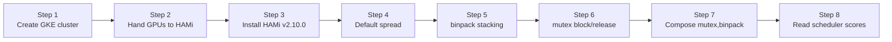

This lab deploys HAMi v2.10.0 on a single GKE node carrying four Tesla T4s, then exercises the composable `hami.io/gpu-scheduler-policy` feature end to end: the default `spread` behavior, `binpack` stacking, the `mutex` filter blocking and releasing, and the composed `mutex,binpack` chain in which a filter visibly overrides what `binpack` alone would choose. Every placement is verified through the allocation annotation the HAMi scheduler writes on each Pod, so the lab needs no CUDA execution inside the workload containers.

## What You'll Learn

- install HAMi v2.10.0 on GKE, pointing the device plugin at GKE's managed driver and writable paths;
- read the scheduler's placement decision from the `hami.io/vgpu-devices-allocated` annotation;
- observe `spread`, `binpack`, and `mutex` individually on one four-GPU node;
- prove that `mutex,binpack` filters candidates before sorting them; and
- follow the scheduler's per-card scoring in its logs.

## Lab Overview



## Prerequisites

- A GCP project with the GKE and Compute Engine APIs enabled and billing active.
- `gcloud`, a `kubectl` version within one minor release of the GKE API server, and Helm 3 or 4.
- The files under [`tutorials/labs/examples/14-composable-scheduler-policies-gke/`](https://github.com/Project-HAMi/website/tree/master/tutorials/labs/examples/14-composable-scheduler-policies-gke).

The node shape is one `n1-standard-8` with four attached T4s. Check your GPU quota first: the lab needs four `NVIDIA_T4_GPUS` in the zone. Because GKE patch releases age out, pick an available 1.35 version in your zone first, then create the cluster with it:

```bash
export GKE_VERSION=$(gcloud container get-server-config \
  --zone=asia-northeast1-a \
  --format='value(validMasterVersions)' | tr ';' '\n' | grep '^1\.35\.' | head -1)
test -n "$GKE_VERSION"

gcloud container clusters create hami-policy-lab --zone=asia-northeast1-a \
  --cluster-version="$GKE_VERSION" \
  --machine-type=n1-standard-8 --num-nodes=1 \
  --image-type=COS_CONTAINERD \
  --accelerator=type=nvidia-tesla-t4,count=4,gpu-driver-version=default
gcloud container clusters get-credentials hami-policy-lab \
  --zone=asia-northeast1-a
```

The run resolved `GKE_VERSION` to `1.35.7-gke.1150000` and created the cluster in about five minutes. GPU nodes are billable; run the cleanup section when you finish.

## Step 1: Verify the GKE GPU Stack

Confirm that the node reports four GPUs through GKE's default device plugin:

```bash
kubectl get nodes \
  -o custom-columns="NAME:.metadata.name,GPU:.status.capacity.nvidia\.com/gpu,ACCEL:.metadata.labels.cloud\.google\.com/gke-accelerator"
```

```plaintext
NAME                                             GPU   ACCEL
gke-hami-policy-lab-default-pool-0c191cbd-fnwq   4     nvidia-tesla-t4
```

GKE 1.35 runs its default device plugin as `nvidia-gpu-device-plugin-small-cos` in `kube-system`, and the driver itself is installed under `/home/kubernetes/bin/nvidia` on the node. Both facts matter in the next steps.

## Step 2: Hand the GPUs to HAMi

HAMi's device plugin registers `nvidia.com/gpu` itself, so GKE's default NVIDIA device plugin must not compete for the same resource on the same node. Keep it disabled with GKE's dedicated label, and add the `gpu=on` label HAMi's chart selects on:

```bash
kubectl get pods -n kube-system -o wide | grep -E 'nvidia.*device-plugin'
kubectl label node -l cloud.google.com/gke-accelerator=nvidia-tesla-t4 \
  gke-no-default-nvidia-gpu-device-plugin=true --overwrite
kubectl label node -l cloud.google.com/gke-accelerator=nvidia-tesla-t4 \
  gpu=on --overwrite
sleep 20
kubectl get pods -n kube-system -o wide | grep -E 'nvidia.*device-plugin' || \
  echo "No GKE device-plugin Pods left on the GPU node"
```

The first `grep` shows the GKE plugin still running; after labeling it is gone:

```plaintext
NAME                                      READY   STATUS    RESTARTS   AGE     IP           NODE
nvidia-gpu-device-plugin-small-cos-h6g47  3/3     Running   0          2m34s   10.146.0.18  gke-hami-policy-lab-default-pool-0c191cbd-fnwq
...
No GKE device-plugin Pods left on the GPU node
```

GKE's driver installer keeps the driver itself in place; only the device plugin steps aside. The node now advertises no `nvidia.com/gpu` capacity until HAMi registers its own:

```bash
kubectl get node -o custom-columns='NAME:.metadata.name,VGPU:.status.allocatable.nvidia\.com/gpu'
```

```plaintext
NAME                                             VGPU
gke-hami-policy-lab-default-pool-0c191cbd-fnwq   0
```

## Step 3: Install HAMi v2.10.0 with the GKE Paths

Three GKE specifics drive the Helm flags, all observed during the run:

- the managed driver lives under `/home/kubernetes/bin/nvidia` (`nvidiaDriverRoot`), and COS mounts the root filesystem read-only, so the vGPU hook directory must also live under GKE's writable NVIDIA tree (`gpuHookPath`, `libPath`), and the monitor's container-tracking path must move with it (`monitor.ctrPath`), otherwise container creation fails with `mkdir /usr/local/vgpu: read-only file system`;
- the plugin container needs `LD_LIBRARY_PATH=/driver-root/lib64` to load NVML from the GKE driver tree, otherwise it exits with `invalid device discovery strategy`;
- `devicePlugin.extraEnvs` must be a list of `{name, value}` objects passed with `--set-json`; a plain `--set devicePlugin.extraEnvs.X=Y` renders invalid YAML and the whole install fails.

Install the released chart:

```bash
helm repo add hami-charts https://project-hami.github.io/HAMi/
helm repo update
helm install hami hami-charts/hami -n kube-system --version 2.10.0 \
  --set devicePlugin.nvidiaDriverRoot=/home/kubernetes/bin/nvidia \
  --set global.gpuHookPath=/home/kubernetes/bin/nvidia \
  --set devicePlugin.libPath=/home/kubernetes/bin/nvidia/vgpu \
  --set devicePlugin.monitor.ctrPath=/home/kubernetes/bin/nvidia/vgpu/containers \
  --set-json 'devicePlugin.extraEnvs=[{"name":"LD_LIBRARY_PATH","value":"/driver-root/lib64"}]'

kubectl -n kube-system rollout status deploy/hami-scheduler --timeout=300s
kubectl -n kube-system get pods -l app.kubernetes.io/instance=hami
```

After install, the plugin Pod runs but its second container, `vgpu-monitor`, stays in `CrashLoopBackOff`:

```plaintext
NAME                             READY   STATUS             RESTARTS        AGE
hami-admission-patch-g9lws       0/1     Completed          0               28m
hami-device-plugin-h4z6l         1/2     CrashLoopBackOff   10 (4m5s ago)   30m
hami-scheduler-87f65f795-84l6d   2/2     Running            0               46m
```

Its log ends with `failed to initialize NVML`: the monitor container is non-privileged and has no `/dev/nvidia*` or `/proc/driver/nvidia` visibility on COS, so it cannot talk to the kernel driver even with the library path fixed. The monitor only exports Prometheus metrics; this lab verifies scheduling decisions, not metrics, so remove that one container and let the DaemonSet settle:

```bash
kubectl -n kube-system patch ds hami-device-plugin --type=json \
  -p '[{"op":"remove","path":"/spec/template/spec/containers/1"}]'
kubectl -n kube-system rollout status ds/hami-device-plugin --timeout=300s
kubectl -n kube-system get pods -l app.kubernetes.io/component=hami-device-plugin
```

```plaintext
NAME                       READY   STATUS    RESTARTS   AGE
hami-device-plugin-dccvh   1/1     Running   0          56s
```

Verify the registration in the plugin log and on the node. Four T4s at the default split count of 10 register as 40 schedulable vGPUs:

```bash
kubectl -n kube-system logs ds/hami-device-plugin -c device-plugin --tail=6 | grep Registered
kubectl get node -o custom-columns='NAME:.metadata.name,VGPU:.status.allocatable.nvidia\.com/gpu'
```

```plaintext
I0818 11:13:31.444220   12404 register.go:204] Registered device id=0, memory=15360MB, type=NVIDIA-Tesla T4, numa=0, health=true
I0818 11:13:31.444395   12404 register.go:204] Registered device id=1, memory=15360MB, type=NVIDIA-Tesla T4, numa=0, health=true
I0818 11:13:31.444568   12404 register.go:204] Registered device id=2, memory=15360MB, type=NVIDIA-Tesla T4, numa=0, health=true
I0818 11:13:31.444719   12404 register.go:204] Registered device id=3, memory=15360MB, type=NVIDIA-Tesla T4, numa=0, health=true
NAME                                             VGPU
gke-hami-policy-lab-default-pool-0c191cbd-fnwq   40
```

## Step 4: Baseline, the Default `spread` Policy

All lab Pods carry the label `hami.run/lab-14`, request one vGPU with a 1000 MiB memory slice, and mount the host driver's `lib64` read-only. That last part is a GKE necessity, not HAMi hygiene: HAMi injects its `libvgpu.so` through `/etc/ld.so.preload` into every vGPU Pod, `libvgpu.so` needs `libcuda.so.1`, and on GKE nothing else provides the driver libraries inside the container. Without the mount, every workload dies at startup with `bash: error while loading shared libraries: libcuda.so.1`.

Define one helper that prints each Pod's chosen card; you will reuse it in every step:

```bash
lab-card() {
  kubectl get pods -l hami.run/lab-14 --no-headers -o custom-columns=\
'POD:.metadata.name,CARD:.metadata.annotations.hami\.io/vgpu-devices-allocated'
}
```

Apply two Pods **without** a policy annotation. The chart default for card selection is `spread`:

```bash
kubectl apply \
  -f tutorials/labs/examples/14-composable-scheduler-policies-gke/01-spread-pods.yaml
kubectl wait --for=condition=Ready pod/policy-spread-a pod/policy-spread-b \
  --timeout=5m
lab-card
```

```plaintext
policy-spread-a   GPU-3c5f3637-e911-b226-7a4c-52da87c38aff,NVIDIA,1000,0:;
policy-spread-b   GPU-66116373-061e-a66b-28a3-c60c4877e16e,NVIDIA,1000,0:;
```

The annotation format is `{UUID},{vendor},{VRAM MiB},{compute %}`. The two UUIDs **differ**: with `spread`, the second Pod avoided the card that already had a tenant.

## Step 5: `binpack` Stacks onto the Busiest Card

Now apply two Pods annotated `hami.io/gpu-scheduler-policy: "binpack"`:

```bash
kubectl apply \
  -f tutorials/labs/examples/14-composable-scheduler-policies-gke/02-binpack-pods.yaml
kubectl wait --for=condition=Ready pod/policy-binpack-a pod/policy-binpack-b \
  --timeout=5m
lab-card
```

```plaintext
policy-binpack-a   GPU-3c5f3637-e911-b226-7a4c-52da87c38aff,NVIDIA,1000,0:;
policy-binpack-b   GPU-3c5f3637-e911-b226-7a4c-52da87c38aff,NVIDIA,1000,0:;
policy-spread-a    GPU-3c5f3637-e911-b226-7a4c-52da87c38aff,NVIDIA,1000,0:;
policy-spread-b    GPU-66116373-061e-a66b-28a3-c60c4877e16e,NVIDIA,1000,0:;
```

Both `binpack` Pods landed on the **same UUID as `policy-spread-a`**, the card that already had a user. `binpack` prefers the most heavily used eligible card, concentrating tenants and leaving other cards fully idle. At this point the node holds: `GPU-3c5f…` with three Pods, `GPU-6611…` with one Pod, and two idle cards.

## Step 6: `mutex` Exclusive Placement, Blocking, and Release

Apply two Pods annotated `mutex`. Only cards with **zero current users** are eligible, so they must land on the two idle cards:

```bash
kubectl apply \
  -f tutorials/labs/examples/14-composable-scheduler-policies-gke/03-mutex-pods.yaml
kubectl wait --for=condition=Ready pod/policy-mutex-a pod/policy-mutex-b \
  --timeout=5m
lab-card
```

```plaintext
policy-binpack-a   GPU-3c5f3637-e911-b226-7a4c-52da87c38aff,NVIDIA,1000,0:;
policy-binpack-b   GPU-3c5f3637-e911-b226-7a4c-52da87c38aff,NVIDIA,1000,0:;
policy-mutex-a     GPU-f147e096-f059-d618-77b4-890c70ef7468,NVIDIA,1000,0:;
policy-mutex-b     GPU-77b9c63c-e3cb-8207-c355-5f65d684d2d8,NVIDIA,1000,0:;
policy-spread-a    GPU-3c5f3637-e911-b226-7a4c-52da87c38aff,NVIDIA,1000,0:;
policy-spread-b    GPU-66116373-061e-a66b-28a3-c60c4877e16e,NVIDIA,1000,0:;
```

`policy-mutex-a` and `policy-mutex-b` took the two previously idle cards. Neither landed on `GPU-3c5f…` despite it having the most free capacity, because cards with any user are filtered out entirely.

All four cards now have users. Apply a third `mutex` Pod and watch it stay Pending:

```bash
kubectl apply \
  -f tutorials/labs/examples/14-composable-scheduler-policies-gke/04-mutex-blocked.yaml
sleep 20
kubectl get pod policy-mutex-c
kubectl describe pod policy-mutex-c | sed -n '/Events:/,$p' | head -8
```

```plaintext
NAME            READY   STATUS    RESTARTS   AGE
policy-mutex-c  0/1     Pending   0          26s

Events:
  Type     Reason             Age                From           Message
  ----     ------             ----               ----           -------
  Warning  FailedScheduling   32s                hami-scheduler  0/1 nodes are available: 1 4/4 ExclusiveDeviceAllocateConflict. no new claims to deallocate, preemption: 0/1 nodes are available: 1 No preemption victims found for incoming pod.
  Warning  FilteringFailed    31s (x3 over 32s)  hami-scheduler  1 nodes ExclusiveDeviceAllocateConflict(gke-hami-policy-lab-default-pool-0c191cbd-fnwq)
```

The message spells it out: **`4/4 ExclusiveDeviceAllocateConflict`**: the `mutex` filter rejected all four cards. Now free `GPU-6611…` by deleting `policy-spread-b`, and watch the blocked Pod take exactly that card:

```bash
kubectl delete pod policy-spread-b
kubectl wait --for=condition=Ready pod/policy-mutex-c --timeout=3m
lab-card
```

```plaintext
policy-binpack-a   GPU-3c5f3637-e911-b226-7a4c-52da87c38aff,NVIDIA,1000,0:;
policy-binpack-b   GPU-3c5f3637-e911-b226-7a4c-52da87c38aff,NVIDIA,1000,0:;
policy-mutex-a     GPU-f147e096-f059-d618-77b4-890c70ef7468,NVIDIA,1000,0:;
policy-mutex-b     GPU-77b9c63c-e3cb-8207-c355-5f65d684d2d8,NVIDIA,1000,0:;
policy-mutex-c     GPU-66116373-061e-a66b-28a3-c60c4877e16e,NVIDIA,1000,0:;
policy-spread-a    GPU-3c5f3637-e911-b226-7a4c-52da87c38aff,NVIDIA,1000,0:;
```

`policy-mutex-c` landed on the UUID previously held by `policy-spread-b`, the only card with zero users at bind time.

## Step 7: Compose `mutex,binpack`, Where the Filter Runs Before the Sort

Start clean so the scenario is deterministic:

```bash
kubectl delete pods -l hami.run/lab-14
kubectl wait --for=delete pod -l hami.run/lab-14 --timeout=2m
```

Build this state on the empty node:

1. One plain tenant Pod (default `spread`) lands on one card; call it card X.
2. Two Pods annotated `mutex,binpack`.
3. One more Pod annotated plain `binpack` as the contrast.

```bash
kubectl apply \
  -f tutorials/labs/examples/14-composable-scheduler-policies-gke/05-composed-tenant.yaml
kubectl wait --for=condition=Ready pod/policy-tenant --timeout=5m

kubectl apply \
  -f tutorials/labs/examples/14-composable-scheduler-policies-gke/06-composed-pods.yaml
kubectl wait --for=condition=Ready pod/policy-combined-a pod/policy-combined-b \
  --timeout=5m

kubectl apply \
  -f tutorials/labs/examples/14-composable-scheduler-policies-gke/07-binpack-contrast.yaml
kubectl wait --for=condition=Ready pod/policy-binpack-solo --timeout=5m
lab-card
```

```plaintext
policy-binpack-solo   GPU-3c5f3637-e911-b226-7a4c-52da87c38aff,NVIDIA,1000,0:;
policy-combined-a     GPU-66116373-061e-a66b-28a3-c60c4877e16e,NVIDIA,1000,0:;
policy-combined-b     GPU-f147e096-f059-d618-77b4-890c70ef7468,NVIDIA,1000,0:;
policy-tenant         GPU-3c5f3637-e911-b226-7a4c-52da87c38aff,NVIDIA,1000,0:;
```

Read the UUID relationships:

- `policy-tenant` and `policy-binpack-solo` share card X (`GPU-3c5f…`): plain `binpack` deliberately stacked onto the card that already had a user, exactly as in Step 5.
- `policy-combined-a` and `policy-combined-b` are on **two other, different cards**: the `mutex` filter removed card X from their candidate sets even though `binpack` alone would have preferred it, and `mutex` also kept the second composed Pod off the card the first one took.

That is the whole feature in one output: **`mutex,binpack` did not choose the card that plain `binpack` chose, because filters prune before sort keys rank.**

A side observation worth noting: the placements are reproducible. Across Steps 4, 6, and 7, the first Pod onto a fresh state always took `GPU-3c5f…`, the next distinct-card Pod took `GPU-6611…`. That is the deterministic device-index tiebreak at work.

## Step 8: Watch the Scores in the Scheduler Logs

The scheduler extender logs one score line per candidate card while filtering. While the composed Pods from Step 7 are running, replay the decisions:

```bash
kubectl -n kube-system logs deploy/hami-scheduler -c vgpu-scheduler-extender \
  --tail=-1 | grep 'computer score' | tail -n 4
```

```plaintext
I0818 11:39:13.896863       1 gpu_policy.go:221] device GPU-77b9c63c-e3cb-8207-c355-5f65d684d2d8 computer score is 0.000000
I0818 11:39:13.896878       1 gpu_policy.go:221] device GPU-f147e096-f059-d618-77b4-890c70ef7468 computer score is 1.651042
I0818 11:39:13.896891       1 gpu_policy.go:221] device GPU-66116373-061e-a66b-28a3-c60c4877e16e computer score is 1.651042
I0818 11:39:13.896904       1 gpu_policy.go:221] device GPU-3c5f3637-e911-b226-7a4c-52da87c38aff computer score is 1.651042
```

These lines are from the `policy-binpack-solo` scheduling pass: the three cards that already carry a 1000 MiB tenant score `1.651042`, the idle card scores `0.000000`, and `binpack` picks the highest-scoring eligible card. For chained policies the same scores feed the ordered keys of the chain; the chain order itself does not appear in the log, which is why the annotation comparison in Step 7 is the actual proof. Combine the score lines with the `ExclusiveDeviceAllocateConflict` events from Step 6 and you have observed filters, sort keys, and their ordering.

## Troubleshooting

| Symptom | Cause in this environment | Action |
| :-- | :-- | :-- |
| Pod create fails with `mkdir /usr/local/vgpu: read-only file system` | Monitor's `ctrPath` still defaults to `/usr/local/vgpu/containers` on COS | Set `devicePlugin.monitor.ctrPath=/home/kubernetes/bin/nvidia/vgpu/containers`, or apply the Step 3 monitor patch |
| Plugin exits with `Incompatible strategy detected auto` / `invalid device discovery strategy` | NVML is not loadable inside the plugin container | Add the `--set-json` `LD_LIBRARY_PATH=/driver-root/lib64` env from Step 3 |
| `helm upgrade` fails with `did not find expected '-' indicator` on `daemonsetnvidia.yaml` | `extraEnvs` was set as a map; the template requires a list | Use `--set-json 'devicePlugin.extraEnvs=[{"name":"…","value":"…"}]'` |
| `vgpu-monitor` crash-loops with `failed to initialize NVML: ERROR_LIBRARY_NOT_FOUND`, then `Driver Not Loaded` | The non-privileged monitor has no `/dev/nvidia*` or `/proc/driver/nvidia` visibility on COS | Remove the monitor container with the Step 3 patch if you don't need its metrics |
| Workload Pods crash with `bash: error while loading shared libraries: libcuda.so.1` | HAMi's `ld.so.preload` injection needs driver libraries that GKE does not mount into containers | The example manifests mount `/home/kubernetes/bin/nvidia/lib64` and set `LD_LIBRARY_PATH`; keep both |
| Node shows both GKE and HAMi GPU capacity, or counts jump between `4` and `40` | GKE's default device plugin competing with HAMi's | Keep `gke-no-default-nvidia-gpu-device-plugin=true` on the node, then restart `hami-device-plugin` |
| Pods stay Pending with `node(s) didn't match node selector` | GPU node lacks the `gpu=on` label | Apply the Step 2 label command |
| `mutex` Pod Pending although a card "looks" free | The card still has an allocated Pod; `mutex` requires zero users | Check with `lab-card`; delete a tenant from the target card |
| Intermittent `Unable to connect to the server` from `kubectl`/`gcloud`/`helm` | Transient TLS errors between the client and Google APIs, seen repeatedly during the run | Retry the command; the cluster itself is healthy |

## Cleanup

Remove the lab workloads and HAMi (uninstalling also removes the Step 3 DaemonSet patch):

```bash
kubectl delete pods -l hami.run/lab-14 --ignore-not-found
helm uninstall hami -n kube-system
```

If you keep the cluster, restore GKE's default device plugin by removing its disable label:

```bash
kubectl label node -l cloud.google.com/gke-accelerator=nvidia-tesla-t4 \
  gke-no-default-nvidia-gpu-device-plugin- --overwrite
```

Delete the cluster if you created it only for this exercise:

```bash
gcloud container clusters delete hami-policy-lab \
  --zone=asia-northeast1-a
```

## What This Lab Proved

| Claim | Evidence |
| :-- | :-- |
| The default card policy `spread` distributes tenants | Step 4: two Pods, two different device UUIDs |
| `binpack` concentrates tenants on the busiest card | Step 5: both Pods share the UUID of the already-used card |
| `mutex` places Pods only on cards with zero users | Step 6: `mutex` Pods took the two idle cards, never the partly used ones |
| `mutex` blocks when every card has a user, then releases | Step 6: Pending with `4/4 ExclusiveDeviceAllocateConflict`, then bound to the freed card |
| In a chain, filters run before sort keys | Step 7: `mutex,binpack` Pods avoided the card that plain `binpack` chose |
| Placement is deterministic | Identical states produced identical UUIDs across Steps 4, 6, and 7; per-card scores logged in Step 8 |

## Next Steps

- Read [Composable GPU Scheduling Policies](/blog/composable-scheduler-policies) for the filter-then-sort model and more policy recipes.
- See the [scheduler policy design](/docs/developers/scheduling) for the scoring math behind `binpack` and `spread`.
- Browse all per-Pod annotations in [Configure HAMi](/docs/userguide/configure).
- Continue with [Lab 3: GPU Partitioning](./gpu-partitioning.md) for runtime VRAM isolation, or [Lab 12: KAI + HAMi on GKE](./kai-scheduler-hami-gke.md) for the memory hard-isolation companion lab.
