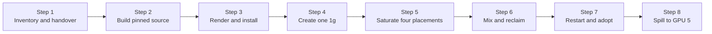

This lab builds HAMi from the source snapshot that first contained the merged per-Pod Dynamic MIG implementation, then follows one MIG allocation through creation, saturation, mixed-profile placement, selective reclamation, device-plugin adoption, and spillover to a second GPU. A Pod asks for memory through HAMi's usual resource API; HAMi chooses the smallest allowed NVIDIA MIG profile with enough memory and a legal free placement, then creates and later reclaims that Pod's GPU Instance (GI) and Compute Instance (CI).

The commands and outputs were captured on 2026-08-11 from the [original verified test](https://blog.kubesimplify.com/dynamic-mig-in-kubernetes-with-hami). This tutorial removes the surrounding narrative and retains the reproducible procedure and evidence.

:::caution[Experimental source snapshot]

[HAMi PR #2378](https://github.com/Project-HAMi/HAMi/pull/2378) was merged at the tested commit, but HAMi v2.9.0 predates this implementation. This lab therefore builds commit [`634bf2b32e68`](https://github.com/Project-HAMi/HAMi/commit/634bf2b32e68e07d3fbcbd6da1ee079392fc07c1). When an official HAMi release includes PR #2378, prefer that release's matching chart and images.

:::

## What You'll Learn

- Pin the HAMi chart and all three HAMi runtime containers to one source commit.
- Distinguish HAMi's per-node `operatingmode: "mig"` from NVIDIA's static `migStrategy`.
- Verify one 8,000 MiB request, four-placement saturation, and mixed `1g.24gb` plus `2g.48gb` placement.
- Prove that deleting one Pod reclaims only its GI/CI while a neighboring CUDA loop progresses.
- Prove that a complete live allocation survives a device-plugin restart with the same MIG UUID.
- Expose a second GPU and verify that a fifth small Pod spills over instead of overcommitting the first GPU.

## Lab Overview



## Prerequisites

The verified environment was:

| Component         | Tested value                                     |
| ----------------- | ------------------------------------------------ |
| GPUs              | 8 × NVIDIA RTX PRO 6000 Blackwell Server Edition |
| GPU memory        | 97,887 MiB per physical GPU                      |
| NVIDIA driver     | `610.43.02`                                      |
| Kubernetes        | `v1.35.6`                                        |
| Operating system  | Ubuntu 24.04.4 LTS, kernel `6.8.0-100-generic`   |
| Container runtime | containerd `2.2.1`                               |
| HAMi source       | `634bf2b32e68e07d3fbcbd6da1ee079392fc07c1`       |

You also need:

- root access to the GPU node, working `nvidia-smi`, MIG mode enabled, and no unmanaged CUDA processes;
- `git`, GNU Make, Docker, `ctr`, Helm, `kubectl`, and `jq`;
- cluster-admin access and permission to replace the existing HAMi installation;
- a local checkout of this website repository for the files under [`tutorials/labs/examples/17-dynamic-mig-rtx-pro/`](https://github.com/Project-HAMi/website/tree/master/tutorials/labs/examples/17-dynamic-mig-rtx-pro); and
- an explicit maintenance window for the **whole GPU node**, not only the GPUs that HAMi will register.

The supplied values target the verified eight-GPU node and initially register only GPU index 4. Adapt both `filterdevices.index` lists before starting if your topology differs. You need at least two compatible GPUs to reproduce Step 8.

:::danger[Assign one MIG hardware owner]

NVIDIA GPU Operator MIG Manager and HAMi Dynamic MIG both create and destroy GI/CI state. They **must not control the same physical GPU at the same time**. GPU Operator may continue providing the driver, Container Toolkit, and monitoring, but stop MIG Manager reconciliation on the target node before this handover. Deleting one MIG Manager Pod is insufficient if its controller recreates it. HAMi must also be the only device plugin registering the parent `nvidia.com/gpu` resource on the target node.

Existing MIG Manager or legacy `knownMigGeometries` users must follow the pinned [Dynamic MIG migration guide](https://github.com/Project-HAMi/HAMi/blob/634bf2b32e68e07d3fbcbd6da1ee079392fc07c1/docs/develop/dynamic-mig-migration.md): inventory, cordon, drain legacy GPU Pods, transfer mutation ownership, then validate one node at a time.

:::

Host-level `nvidia-smi`, Docker, and `ctr` commands run on the GPU node. `kubectl` and Helm may run anywhere with the intended kubeconfig; the verified single-node run executed everything on that node.

## Step 1: Back Up and Establish an Idle Handover

Select the single Kubernetes node and set a durable working directory. If your cluster has other nodes, set `NODE` explicitly to the eight-GPU node instead.

```bash
export NODE=$(kubectl get nodes -o jsonpath='{.items[0].metadata.name}')
export LAB=/root/hami-dynamic-mig-rerun-2026-08-11
export EXAMPLES=tutorials/labs/examples/17-dynamic-mig-rtx-pro

mkdir -p "$LAB"
```

If a release named `hami` already exists in `hami-system`, save both Helm's stored state and the live objects; they can differ.

```bash
if helm status hami -n hami-system >/dev/null 2>&1; then
  helm get values hami -n hami-system --all -o yaml \
    > "$LAB/helm-values-before.yaml"
  helm get manifest hami -n hami-system \
    > "$LAB/helm-manifest-before.yaml"
  kubectl get configmaps -n hami-system -o yaml \
    > "$LAB/live-configmaps-before.yaml"
fi
kubectl get node "$NODE" -o yaml > "$LAB/node-before.yaml"
kubectl get pods -A --field-selector spec.nodeName="$NODE" -o wide
nvidia-smi -L > "$LAB/nvidia-smi-L-before.txt"
```

Inventory MIG mode and active compute processes:

```bash
nvidia-smi \
  --query-gpu=index,name,uuid,driver_version,memory.total,mig.mode.current \
  --format=csv

nvidia-smi \
  --query-compute-apps=gpu_uuid,pid,process_name,used_gpu_memory \
  --format=csv
```

The eight cards reported MIG mode enabled. These are the two rows used later:

```plaintext
4, NVIDIA RTX PRO 6000 Blackwell Server Edition, GPU-4c395b7a-a7e6-d90f-1ced-d96e8dd68288, 610.43.02, 97887 MiB, Enabled
5, NVIDIA RTX PRO 6000 Blackwell Server Edition, GPU-04dc48d7-7048-aef5-ad36-f5db716e7668, 610.43.02, 97887 MiB, Enabled
```

The process query returned only its header:

```plaintext
gpu_uuid, pid, process_name, used_gpu_memory [MiB]
```

Stop or migrate every GPU workload that the handover must not disrupt, disable MIG Manager reconciliation, and repeat the process query. Do not continue until the node has an explicitly empty baseline. Enabling MIG mode, clearing old layouts, and the initial plugin startup can reset GPUs.

## Step 2: Build the Pinned HAMi Source

Clone the repository, detach at the full tested SHA, and build one immutable image for all HAMi components:

```bash
export HAMI_SHA=634bf2b32e68e07d3fbcbd6da1ee079392fc07c1
export HAMI_TAG=master-634bf2b32e68
export HAMI_IMAGE=localhost/hami-dynamic-mig:$HAMI_TAG

git clone --recurse-submodules \
  https://github.com/Project-HAMi/HAMi.git "$LAB/HAMi"
git -C "$LAB/HAMi" checkout --detach "$HAMI_SHA"
git -C "$LAB/HAMi" submodule update --init --recursive

make -C "$LAB/HAMi" docker \
  IMG_NAME=localhost/hami-dynamic-mig \
  IMG_TAG="$HAMI_TAG" \
  VERSION="$HAMI_TAG" \
  TARGET_PLATFORMS=linux/amd64

docker image inspect "$HAMI_IMAGE" \
  --format='ID={{.Id}} Architecture={{.Architecture}} SizeBytes={{.Size}}'
```

:::note

HAMi v2.10.0 (released 2026-08-21) includes commit `634bf2b`, so the released chart and images ship everything this lab builds from source. The lab keeps the pinned build it was verified with; a future revision will re-verify against the v2.10.0 release artifacts and drop the source build.

:::

The pinned build produced:

```plaintext
ID=sha256:0ddda56e333ff74e52d9908e00b85e7860cf4694fc09951aaa178e8c8e6dde76 Architecture=amd64 SizeBytes=411671341
```

The verified cluster was single-node, so it imported the local image into Kubernetes' containerd namespace:

```bash
docker save --output "$LAB/hami-$HAMI_TAG.tar" "$HAMI_IMAGE"
sudo ctr --namespace k8s.io images import "$LAB/hami-$HAMI_TAG.tar"
sudo ctr --namespace k8s.io images list | grep -F "$HAMI_IMAGE"
```

`localhost/...` works only when every HAMi component runs on a node containing that imported image. In a multi-node cluster, push the immutable tag to a registry reachable by every scheduler and GPU node, then update the registry and pull policy in the supplied values.

## Step 3: Render and Perform the Controlled Install

Create node-specific copies of the supplied values and workload manifest:

```bash
sed "s/__NODE_NAME__/${NODE}/g" "$EXAMPLES/hami-values.yaml" \
  > "$LAB/hami-values-one-gpu.yaml"
sed "s/__NODE_NAME__/${NODE}/g" "$EXAMPLES/mig-small-pack.yaml" \
  > "$LAB/mig-small-pack.yaml"
```

Two similarly named settings have separate responsibilities:

- `devicePlugin.nodeConfiguration.config` sets `operatingmode: "mig"`, activating HAMi Dynamic MIG for this node.
- Top-level `devicePlugin.migStrategy: none` prevents the NVIDIA device-plugin path from publishing pre-created MIG resources such as `nvidia.com/mig-1g.24gb`. Workloads still request `nvidia.com/gpu`; HAMi creates their MIG instances dynamically.

The `filterdevices.index` field is an **exclusion** list. `[0, 1, 2, 3, 5, 6, 7]` registers only GPU 4. It is not a startup safety boundary; Step 7 demonstrates that the plugin still reconciles filtered GPUs.

Render before changing the cluster:

```bash
helm lint "$LAB/HAMi/charts/hami" \
  -f "$LAB/hami-values-one-gpu.yaml"

helm template hami "$LAB/HAMi/charts/hami" \
  --namespace hami-system \
  --kube-version 1.35.6 \
  -f "$LAB/hami-values-one-gpu.yaml" \
  > "$LAB/rendered-current-hami.yaml"

grep -n -A 25 'migProfileAllowlist' \
  "$LAB/rendered-current-hami.yaml"
grep -n -E 'image:|imagePullPolicy:' \
  "$LAB/rendered-current-hami.yaml"
! grep -q 'projecthami/hami:v2.9.0' \
  "$LAB/rendered-current-hami.yaml"
```

Confirm the rendered allowlist includes `1g.24gb`, `2g.48gb`, and `4g.96gb` for `RTX PRO 6000 Blackwell Server Edition`, and that the scheduler extender, device plugin, and monitor all use `localhost/hami-dynamic-mig:master-634bf2b32e68`. The chart's `appVersion` still says `2.9.0` at this commit; live image references, not chart metadata, prove the runtime version.

:::warning[Destructive handover]

The verified run used a fresh reinstall only after all GPU Pods and processes were gone. This is not a general in-place upgrade procedure. Migrate an existing deployment with the pinned migration guide linked above.

:::

```bash
if helm status hami -n hami-system >/dev/null 2>&1; then
  helm uninstall hami -n hami-system --wait --timeout 5m
fi

helm upgrade --install hami "$LAB/HAMi/charts/hami" \
  -n hami-system \
  --create-namespace \
  --reset-values \
  -f "$LAB/hami-values-one-gpu.yaml" \
  --wait \
  --timeout 10m

kubectl get pods -n hami-system \
  -o custom-columns='POD:.metadata.name,CONTAINERS:.spec.containers[*].name,IMAGES:.spec.containers[*].image'
```

Verify that all three HAMi containers show:

```plaintext
localhost/hami-dynamic-mig:master-634bf2b32e68
```

A stale MIG UUID caused one transient monitor CDI `StartError` during the verified handover. Kubernetes retried it and both plugin containers became ready. If you see a restart, inspect the previous state instead of assuming it was harmless:

```bash
kubectl get pods -n hami-system
kubectl logs -n hami-system \
  -l app.kubernetes.io/component=hami-device-plugin \
  --all-containers=true --previous --tail=100
```

## Step 4: Discover Placements and Create One `1g.24gb`

Inspect what the plugin learned from NVML:

```bash
kubectl get node "$NODE" -o json |
jq '
  .metadata.annotations["hami.io/node-nvidia-register"]
  | fromjson
  | .[]
  | {id, index, type, mode, count, migProfiles}
'
```

GPU 4 registered these capabilities:

| Profile   | `memoryMB` | Core | `sliceCount` | Legal NVML placements (`start`, `size`) |
| --------- | ---------: | ---: | -----------: | --------------------------------------- |
| `1g.24gb` |     24,192 |   25 |            1 | `(0,3)`, `(3,3)`, `(6,3)`, `(9,3)`      |
| `2g.48gb` |     48,512 |   50 |            2 | `(0,6)`, `(6,6)`                        |
| `4g.96gb` |     97,408 |  100 |            4 | `(0,12)`                                |

`start` and `size` describe a half-open slice interval `[start, start + size)`; they are not GiB. The registered `count: 4` is only a coarse maximum. Actual capacity depends on non-overlapping legal placements.

Create the namespace and one repeatable CUDA workload. It runs NVIDIA's `vectorAdd` sample continuously and increments `/tmp/gpu-progress` after every successful iteration.

```bash
kubectl create namespace hami-mig-retest
kubectl apply -f "$LAB/mig-small-pack.yaml"
kubectl rollout status deployment/mig-small-pack \
  -n hami-mig-retest --timeout=180s

POD=$(kubectl get pods -n hami-mig-retest \
  -l app=mig-small-pack \
  -o jsonpath='{.items[0].metadata.name}')
```

Inspect HAMi's controller-owned allocation identity. Users may read this annotation but must never create or edit it.

```bash
kubectl get pod "$POD" -n hami-mig-retest -o json |
jq '.metadata.annotations["hami.io/vgpu-mig-allocations"] | fromjson'
```

The 8,000 MiB request selected the smallest fitting allowed profile:

```json
[
  {
    "containerIndex": 0,
    "deviceIndex": 0,
    "gpuUUID": "GPU-4c395b7a-a7e6-d90f-1ced-d96e8dd68288",
    "profile": "1g.24gb",
    "placement": { "start": 9, "size": 3 },
    "migUUID": "MIG-a5fa6120-f6fa-51b6-9820-a42112640629",
    "gpuInstanceID": 6,
    "computeInstanceID": 0
  }
]
```

On a Dynamic MIG node, `nvidia.com/gpumem: 8000` is a **minimum profile requirement**, not an 8,000 MiB software cap. This GPU has no 8 GiB profile, so the container receives the complete 24,192 MiB instance. `nvidia.com/gpucores` does not choose a MIG profile; the hardware profile fixes the compute fraction.

Confirm that the host and container expose the same MIG UUID, then prove the workload advances:

```bash
nvidia-smi -L
kubectl exec -n hami-mig-retest "$POD" -- nvidia-smi -L

before=$(kubectl exec -n hami-mig-retest "$POD" -- cat /tmp/gpu-progress)
sleep 3
after=$(kubectl exec -n hami-mig-retest "$POD" -- cat /tmp/gpu-progress)
printf 'before=%s after=%s\n' "$before" "$after"
test "$after" -gt "$before"
```

```plaintext
before=75 after=77
```

The first placement need not start at 0; the verified first allocation legally started at 9.

## Step 5: Fill All Four Legal Placements

Scale the same Deployment to four Pods:

```bash
kubectl scale deployment/mig-small-pack \
  -n hami-mig-retest --replicas=4
kubectl rollout status deployment/mig-small-pack \
  -n hami-mig-retest --timeout=180s
nvidia-smi -L

kubectl get pods -n hami-mig-retest -l app=mig-small-pack -o json |
jq -r '
  ["PARENT_GPU", "PROFILE", "START", "SIZE"],
  (
    .items[]
    | (.metadata.annotations["hami.io/vgpu-mig-allocations"] | fromjson | .[0]) as $a
    | [$a.gpuUUID, $a.profile, ($a.placement.start | tostring), ($a.placement.size | tostring)]
  )
  | @tsv
'
```

All four legal `1g.24gb` starts were occupied:

```plaintext
PARENT_GPU                                   PROFILE    START  SIZE
GPU-4c395b7a-a7e6-d90f-1ced-d96e8dd68288   1g.24gb   0      3
GPU-4c395b7a-a7e6-d90f-1ced-d96e8dd68288   1g.24gb   3      3
GPU-4c395b7a-a7e6-d90f-1ced-d96e8dd68288   1g.24gb   6      3
GPU-4c395b7a-a7e6-d90f-1ced-d96e8dd68288   1g.24gb   9      3
```

With only GPU 4 registered, a fifth replica remained unbound instead of overcommitting the card:

```bash
kubectl scale deployment/mig-small-pack \
  -n hami-mig-retest --replicas=5
sleep 15
kubectl get pods -n hami-mig-retest -o wide

PENDING_POD=$(kubectl get pods -n hami-mig-retest \
  -l app=mig-small-pack --field-selector=status.phase=Pending \
  -o jsonpath='{.items[0].metadata.name}')
kubectl describe pod "$PENDING_POD" -n hami-mig-retest | \
  grep 'CardTimeSlicingExhausted'
```

Its scheduling event included:

```plaintext
0/1 nodes are available: 1 1/1 CardTimeSlicingExhausted.
```

The inherited event name is misleading here: this test did not use time slicing. It means no legal Dynamic MIG placement remained on a registered GPU. Return to four replicas before continuing:

```bash
kubectl scale deployment/mig-small-pack \
  -n hami-mig-retest --replicas=4
```

## Step 6: Mix Profiles and Reclaim Only One Instance

Remove the packing Pods, derive GPU 4's UUID on this host, and run the supplied script. It creates an 8,000 MiB Pod and a 30,000 MiB Pod with the same CUDA progress loop and pins both to the same physical card.

```bash
kubectl scale deployment/mig-small-pack \
  -n hami-mig-retest --replicas=0
kubectl wait -n hami-mig-retest \
  --for=delete pod -l app=mig-small-pack --timeout=180s

export GPU_UUID=$(nvidia-smi -i 4 --query-gpu=uuid --format=csv,noheader)
"$EXAMPLES/create-mixed-pods.sh"
```

Inspect both allocation records:

```bash
kubectl get pods mixed-small mixed-large -n hami-mig-retest -o json |
jq -r '
  ["POD", "PROFILE", "START", "SIZE", "MIG_UUID", "GI", "CI"],
  (
    .items
    | sort_by(.metadata.name)[]
    | . as $pod
    | ($pod.metadata.annotations["hami.io/vgpu-mig-allocations"] | fromjson | .[0]) as $a
    | [
        $pod.metadata.name,
        $a.profile,
        ($a.placement.start | tostring),
        ($a.placement.size | tostring),
        $a.migUUID,
        ($a.gpuInstanceID | tostring),
        ($a.computeInstanceID | tostring)
      ]
  )
  | @tsv
'
```

The live allocation table was:

```plaintext
POD          PROFILE    START  SIZE  MIG_UUID                                      GI  CI
mixed-large  2g.48gb    0      6     MIG-b23491d8-d784-58d9-bcfa-3c171ead22da      1   0
mixed-small  1g.24gb    9      3     MIG-a5fa6120-f6fa-51b6-9820-a42112640629      6   0
```

Intervals `[0,6)` and `[9,12)` do not overlap, so both profiles fit. During the same three-second window both loops progressed:

```bash
small_before=$(kubectl exec -n hami-mig-retest mixed-small -- cat /tmp/gpu-progress)
large_before=$(kubectl exec -n hami-mig-retest mixed-large -- cat /tmp/gpu-progress)
sleep 3
small_after=$(kubectl exec -n hami-mig-retest mixed-small -- cat /tmp/gpu-progress)
large_after=$(kubectl exec -n hami-mig-retest mixed-large -- cat /tmp/gpu-progress)
printf 'small: %s -> %s\nlarge: %s -> %s\n' \
  "$small_before" "$small_after" "$large_before" "$large_after"
test "$small_after" -gt "$small_before"
test "$large_after" -gt "$large_before"
```

```plaintext
small: 64 -> 67
large: 37 -> 39
```

Now capture the small instance identity, delete only its Pod, and poll the host because reclamation is asynchronous:

```bash
small_mig_uuid=$(kubectl get pod mixed-small -n hami-mig-retest -o json |
  jq -r '.metadata.annotations["hami.io/vgpu-mig-allocations"] | fromjson | .[0].migUUID')
large_before=$(kubectl exec -n hami-mig-retest mixed-large -- \
  cat /tmp/gpu-progress)

kubectl delete pod mixed-small -n hami-mig-retest

until ! nvidia-smi -L | grep -Fq "$small_mig_uuid"; do
  sleep 1
done
nvidia-smi -L | grep '^  MIG '
```

Only the large instance remained:

```plaintext
MIG 2g.48gb Device 0: (UUID: MIG-b23491d8-d784-58d9-bcfa-3c171ead22da)
```

Verify the neighbor continued computing throughout the reclaim:

```bash
large_after=$(kubectl exec -n hami-mig-retest mixed-large -- \
  cat /tmp/gpu-progress)
printf 'large: %s -> %s\n' "$large_before" "$large_after"
test "$large_after" -gt "$large_before" \
  && echo 'PASS: 2g workload survived 1g reclamation'
```

```plaintext
large: 61 -> 94
PASS: 2g workload survived 1g reclamation
```

On this GPU and driver, recreating the freed placement later produced the same `MIG-a5fa...` UUID. A MIG UUID is not a generation counter: observed disappearance proves reclamation, while a different UUID is not required for recreation.

## Step 7: Restart the Device Plugin and Verify UUID Stability

This is a disruptive controller test. Keep only the valid, HAMi-managed `mixed-large` allocation active. Every other GPU on the node must remain free of unmanaged work, because plugin startup has node-wide hardware scope at this commit.

Record the allocation's UUID and progress, replace the device-plugin Pod, and wait for the DaemonSet:

```bash
LARGE_MIG_UUID=$(kubectl get pod mixed-large -n hami-mig-retest -o json |
  jq -r '.metadata.annotations["hami.io/vgpu-mig-allocations"] | fromjson | .[0].migUUID')
OLD_DP_POD=$(kubectl get pods -n hami-system \
  -l app.kubernetes.io/component=hami-device-plugin \
  -o jsonpath='{.items[0].metadata.name}')
progress_before=$(kubectl exec -n hami-mig-retest mixed-large -- \
  cat /tmp/gpu-progress)

kubectl delete pod "$OLD_DP_POD" -n hami-system
kubectl rollout status daemonset/hami-device-plugin \
  -n hami-system --timeout=180s

NEW_DP_POD=$(kubectl get pods -n hami-system \
  -l app.kubernetes.io/component=hami-device-plugin \
  -o jsonpath='{.items[0].metadata.name}')
kubectl logs "$NEW_DP_POD" -n hami-system --all-containers=true |
  grep 'mig init: resolved startup layout'
```

The replacement plugin classified GPU 4 as in use and all other GPUs as reset candidates:

```plaintext
mig init: resolved startup layout inUseGPUs=[4] resetGPUs=[0,1,2,3,5,6,7]
```

It verified the complete Pod annotation against NVML and adopted the live allocation. Confirm the exact UUID still exists and the CUDA loop advanced:

```bash
nvidia-smi -L | grep -F "$LARGE_MIG_UUID"

progress_after=$(kubectl exec -n hami-mig-retest mixed-large -- \
  cat /tmp/gpu-progress)
printf 'progress: %s -> %s\n' "$progress_before" "$progress_after"
test "$progress_after" -gt "$progress_before" \
  && echo 'PASS: MIG UUID and CUDA workload survived device-plugin restart'
```

```plaintext
progress: 115 -> 187
PASS: MIG UUID and CUDA workload survived device-plugin restart
```

:::danger[Filtering does not constrain startup mutation]

The log proves that `filterdevices` limits registration and scheduling but not Dynamic MIG startup cleanup at this commit. The plugin reconciled all eight physical GPUs, including filtered ones. Treat the first install and every plugin restart as whole-node maintenance. This happy-path recovery also assumes a complete, valid allocation annotation; it does not promise adoption of malformed state.

:::

## Step 8: Expose GPU 5 and Verify Fifth-Pod Spillover

Delete the mixed-profile workload and wait until no test MIG instance remains:

```bash
kubectl delete pod mixed-large -n hami-mig-retest

until ! nvidia-smi -L | grep -q '^  MIG '; do
  sleep 2
done
```

Create a second values file that removes GPU 5 from the exclusion list. This changes the list from `[0, 1, 2, 3, 5, 6, 7]` to `[0, 1, 2, 3, 6, 7]`, registering GPUs 4 and 5.

```bash
sed 's/"index": \[0, 1, 2, 3, 5, 6, 7\]/"index": [0, 1, 2, 3, 6, 7]/' \
  "$LAB/hami-values-one-gpu.yaml" > "$LAB/hami-values-two-gpus.yaml"

helm upgrade hami "$LAB/HAMi/charts/hami" \
  -n hami-system \
  --reset-values \
  -f "$LAB/hami-values-two-gpus.yaml" \
  --wait \
  --timeout 10m

# This ConfigMap change did not trigger a plugin rollout in the verified chart.
kubectl rollout restart daemonset/hami-device-plugin -n hami-system
kubectl rollout status daemonset/hami-device-plugin \
  -n hami-system --timeout=180s
```

Do not trust Helm success alone. Verify the live node registration:

```bash
kubectl get node "$NODE" -o json |
jq -r '
  .metadata.annotations["hami.io/node-nvidia-register"]
  | fromjson
  | map(.index)
  | sort
  | join(",")
'
```

```plaintext
4,5
```

Scale the existing Deployment from zero to five and inspect each parent GPU:

```bash
kubectl scale deployment/mig-small-pack \
  -n hami-mig-retest --replicas=5
kubectl rollout status deployment/mig-small-pack \
  -n hami-mig-retest --timeout=180s

kubectl get pods -n hami-mig-retest -l app=mig-small-pack -o json |
jq -r '
  ["POD", "PARENT_GPU", "PROFILE", "START"],
  (
    .items
    | sort_by(.metadata.name)[]
    | . as $pod
    | ($pod.metadata.annotations["hami.io/vgpu-mig-allocations"] | fromjson | .[0]) as $a
    | [
        $pod.metadata.name,
        $a.gpuUUID,
        $a.profile,
        ($a.placement.start | tostring)
      ]
  )
  | @tsv
'
```

The verified bin-packing result filled all four placements on GPU 4, then placed the fifth Pod on GPU 5:

```plaintext
POD                               PARENT_GPU                                   PROFILE    START
mig-small-pack-6f5b7bd7b-dwld2    GPU-4c395b7a-a7e6-d90f-1ced-d96e8dd68288   1g.24gb   3
mig-small-pack-6f5b7bd7b-g72fd    GPU-4c395b7a-a7e6-d90f-1ced-d96e8dd68288   1g.24gb   0
mig-small-pack-6f5b7bd7b-jgql2    GPU-04dc48d7-7048-aef5-ad36-f5db716e7668   1g.24gb   9
mig-small-pack-6f5b7bd7b-rlxbn    GPU-4c395b7a-a7e6-d90f-1ced-d96e8dd68288   1g.24gb   9
mig-small-pack-6f5b7bd7b-vjfv9    GPU-4c395b7a-a7e6-d90f-1ced-d96e8dd68288   1g.24gb   6
```

Placement starts are legal choices, not an allocation sequence; GPU 5's first allocation may start at 9.

## Cleanup

Delete the test namespace and verify that all per-Pod instances are gone before another plugin restart:

```bash
kubectl delete namespace hami-mig-retest \
  --wait=true --timeout=180s

if nvidia-smi -L | grep -q '^  MIG '; then
  echo 'FAIL: MIG instances remain'
  nvidia-smi -L
else
  echo 'PASS: no MIG instances remain'
fi
```

```plaintext
PASS: no MIG instances remain
```

Restore the original exclusion list, then deliberately restart the plugin while the whole node is idle:

```bash
helm upgrade hami "$LAB/HAMi/charts/hami" \
  -n hami-system \
  --reset-values \
  -f "$LAB/hami-values-one-gpu.yaml" \
  --wait \
  --timeout 10m
kubectl rollout restart daemonset/hami-device-plugin -n hami-system
kubectl rollout status daemonset/hami-device-plugin \
  -n hami-system --timeout=180s

printf 'Registered GPU indices: '
kubectl get node "$NODE" -o json |
jq -r '
  .metadata.annotations["hami.io/node-nvidia-register"]
  | fromjson
  | map(.index)
  | join(",")
'

if nvidia-smi -L | grep -q '^  MIG '; then
  echo 'MIG state: FAIL - instances remain'
else
  echo 'MIG state: PASS - no instances remain'
fi
kubectl get pods -n hami-system
```

The verified final state was:

```plaintext
Registered GPU indices: 4
MIG state: PASS - no instances remain
NAME                              READY   STATUS    RESTARTS
hami-device-plugin-6snlc          2/2     Running   0
hami-scheduler-74fbfcfbb5-qxftm   2/2     Running   0
```

This leaves the pinned HAMi installation running with only GPU 4 registered. Preserve the Step 1 backups until you have either accepted this installation or restored the previous deployment through its documented migration or rollback procedure. Do not directly roll binaries back to a legacy Dynamic MIG implementation while new-format allocations are active.

## Operational Traps

- **Chart metadata is not runtime identity.** At this commit the chart defaults to v2.9.0. Pin and inspect the extender, plugin, and monitor images; do not use `latest` or rely on `appVersion`.
- **`operatingmode` is not `migStrategy`.** The node JSON selects HAMi Dynamic MIG; the top-level Helm value controls NVIDIA's static resource exposure path.
- **MIG Manager and HAMi cannot share mutation ownership.** Stop reconciliation, not just one Pod, before HAMi starts managing GI/CI state.
- **`filterdevices` is not a hardware protection boundary.** It excludes registration, while startup reconciliation can still touch every GPU on the node.
- **A Helm upgrade may not restart the plugin.** The tested DaemonSet had no checksum for the node-configuration ConfigMap. Restart only in a safe window, then inspect the live registration annotation.
- **Scheduler reasons can use inherited language.** `CardTimeSlicingExhausted` represented exhausted MIG placements here, not a switch to time slicing.
- **Reclamation is eventual and UUIDs may be reused.** Poll host state after deletion. Disappearance and later reappearance is stronger evidence than expecting a new UUID.
- **Dynamic placement is still constrained.** Profiles coexist only when NVML reports non-overlapping legal intervals; HAMi does not move or destroy a live neighbor to satisfy a new request.
- **A homogeneous test is not a heterogeneous-node guarantee.** The verified node had eight identical supported GPUs. Validate mixed-model nodes separately.

## What This Lab Proved

| Claim | Evidence |
| --- | --- |
| 8,000 MiB selects real hardware isolation | The Pod received one `1g.24gb` GI/CI and the same MIG UUID appeared on host and in container |
| One RTX PRO 6000 has four small-profile placements | Starts 0, 3, 6, and 9 were occupied; a fifth Pod stayed `Pending` while only GPU 4 was registered |
| Different profiles can coexist | `2g.48gb` at `[0,6)` and `1g.24gb` at `[9,12)` ran CUDA together |
| Reclamation is selective | Deleting `mixed-small` removed only its GI/CI while `mixed-large` advanced from 61 to 94 |
| Valid allocation state is recoverable | Plugin restart retained the `2g.48gb` UUID and CUDA progress advanced from 115 to 187 |
| Capacity spills across GPUs | With GPUs 4 and 5 registered, four Pods packed onto GPU 4 and the fifth used GPU 5 |

## Next Steps

- Read the pinned [migration guide](https://github.com/Project-HAMi/HAMi/blob/634bf2b32e68e07d3fbcbd6da1ee079392fc07c1/docs/develop/dynamic-mig-migration.md) before moving a production node from fixed geometries or MIG Manager.
- Compare this hardware-isolated path with [Lab 7: GPU Isolation on k3s Without the GPU Operator](./hami-isolation-k3s.md), which verifies HAMi-core software isolation.
- Validate the [NVIDIA supported MIG profiles](https://docs.nvidia.com/datacenter/tesla/mig-user-guide/latest/supported-mig-profiles.html) for every GPU model and driver in your fleet.
