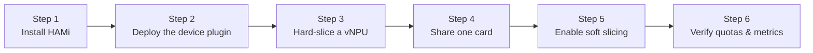

This lab installs HAMi 2.9.0 and the pinned `ascend-device-plugin` v1.4.0 on a single Ascend 910B4, then walks one NPU through both sharing paths that HAMi offers: **hard slicing**, where HAMi matches a memory request to a fixed AVI template such as `vir05_1c_8g`, and **hami-vnpu-core soft slicing**, where the runtime's `libvnpu.so` provides fine-grained memory and compute quotas.

## What You'll Learn

- which Ascend resource keys HAMi exposes for the 910B4 and how the node's reported allocatable count is derived from the smallest template;
- install HAMi with Ascend support and deploy the pinned v1.4.0 device plugin;
- run template-based hard-slice Pods and confirm the selected template in HAMi's allocation annotations and inside the container;
- share one physical NPU between two hard-slice Pods;
- switch the same node to `hami-vnpu-core` soft slicing and request explicit memory and compute quotas; and
- read per-device memory and utilization metrics from the device plugin.

## Lab Overview



## Prerequisites

- A working single-node Kubernetes cluster with an idle Ascend 910B4, visible in host `npu-smi info`, and a node that accepts ordinary Pods. Soft slicing (`hami-vnpu-core`) is ARM-only and requires driver ≥ 25.5; the verified run used an ARM node with driver 25.5.1.
- [Ascend Docker Runtime](https://gitcode.com/Ascend/mind-cluster/tree/master/component/ascend-docker-runtime) configured as the `ascend` containerd runtime handler. The workloads use `runtimeClassName: ascend`.
- `kubectl`, Helm 3, cluster-admin access, and permission to create a `RuntimeClass`, ConfigMaps, a DaemonSet, and workload Pods.
- A CANN/torch-npu image compatible with the host driver and node architecture, for example `quay.io/ascend/torch-npu:2.10.0-910b-ubuntu22.04-py3.11`.
- A checkout of this website repository; the commands refer to files under [`tutorials/labs/examples/18-hami-ascend-vnpu-slicing/`](https://github.com/Project-HAMi/website/tree/master/tutorials/labs/examples/18-hami-ascend-vnpu-slicing).

## Step 1: Install HAMi with Ascend Support

Install HAMi with Ascend support enabled:

```bash
helm repo add hami-charts https://project-hami.github.io/HAMi/
helm repo update

helm install hami hami-charts/hami \
  --version 2.9.0 \
  --namespace kube-system --create-namespace \
  --set devices.ascend.enabled=true

kubectl -n kube-system rollout status deploy/hami-scheduler --timeout=5m
```

`devices.ascend.enabled=true` turns on Ascend resource support. The chart's `devices.ascend.hamiVnpuCore` defaults to `false`, so the cluster starts in template hard-slicing mode; Step 5 flips it for soft slicing.

Check the templates HAMi loaded for this chip model, and compare them against what the hardware itself reports:

```bash
kubectl -n kube-system get cm hami-scheduler-device \
  -o jsonpath='{.data.device-config\.yaml}' \
  | grep -A16 'chipName: 910B4'
```

```text
      - chipName: 910B4
        commonWord: Ascend910B4
        resourceName: huawei.com/Ascend910B4
        resourceMemoryName: huawei.com/Ascend910B4-memory
        memoryAllocatable: 32768
        memoryCapacity: 32768
        aiCore: 20
        aiCPU: 7
        templates:
          - name: vir05_1c_8g
            memory: 8192
            aiCore: 5
            aiCPU: 1
          - name: vir10_3c_16g
            memory: 16384
            aiCore: 10
            aiCPU: 3
```

On the host, list the NPU and its supported templates — different Ascend models ship different template sets:

```bash
npu-smi info -l
npu-smi info -t template-info
```

## Step 2: Deploy the Ascend Device Plugin

### Label the Node

The device plugin selects nodes through the `ascend=on` label. Replace `YOUR_ASCEND_NODE` with the Ascend node name:

```bash
kubectl get nodes -o wide
export NODE=YOUR_ASCEND_NODE
kubectl label node "$NODE" ascend=on --overwrite
```

### Deploy the RuntimeClass

> Make sure Ascend Docker Runtime is installed and registered as the `ascend` handler on the node.

Create the `RuntimeClass` object:

```bash
kubectl apply -f https://raw.githubusercontent.com/Project-HAMi/ascend-device-plugin/refs/tags/v1.4.0/ascend-runtimeclass.yaml
```

### Deploy ascend-device-plugin

Deploy the pinned device-plugin manifest:

```bash
kubectl apply -f https://raw.githubusercontent.com/Project-HAMi/ascend-device-plugin/refs/tags/v1.4.0/ascend-device-plugin.yaml
kubectl -n kube-system rollout status daemonset/hami-ascend-device-plugin --timeout=5m
```

Check that the plugin registered the Ascend resource on the labeled node:

```bash
kubectl get node "$NODE" \
  -o custom-columns='NAME:.metadata.name,ASCEND:.status.allocatable.huawei\.com/Ascend910B4'
kubectl -n kube-system get pods -l app.kubernetes.io/component=hami-ascend-device-plugin -o wide
```

For one 910B4 with the default configuration, `huawei.com/Ascend910B4` reports `4`: the plugin divides the allocatable memory of 32768 MiB by the smallest template's 8192 MiB and reports `floor(32768 / 8192) = 4`. This is an advertised sharing count at the granularity of the smallest template, not four physical cards or four equal fractions of every resource — HAMi still checks the selected template and remaining memory when placing each Pod.

## Step 3: Hard-Slice One Template-Based vNPU

Apply the single hard-slice workload:

```bash
kubectl apply -f tutorials/labs/examples/18-hami-ascend-vnpu-slicing/01-hard-slice-pod.yaml
kubectl wait --for=condition=Ready pod/hami-ascend910b4-hard-slice --timeout=5m
kubectl get pod hami-ascend910b4-hard-slice -o wide
```

```text
pod/hami-ascend910b4-hard-slice created
pod/hami-ascend910b4-hard-slice condition met
NAME                          READY   STATUS    RESTARTS   AGE   NODE
hami-ascend910b4-hard-slice   1/1     Running   0          8s    ascend-240
```

The important fields are:

```yaml
spec:
  schedulerName: hami-scheduler
  runtimeClassName: ascend
  containers:
    - resources:
        limits:
          huawei.com/Ascend910B4: "1"
          huawei.com/Ascend910B4-memory: "8192"
```

The resource key is `huawei.com/Ascend910B4`, taken from `resourceName`; `resourceMemoryName` defines the `-memory` key, and `commonWord: Ascend910B4` names the allocation annotation. Omitting `-memory` requests a whole card; specifying it makes HAMi pick a template.

Inspect the two annotations that record the allocation:

```bash
kubectl get pod hami-ascend910b4-hard-slice \
  -o jsonpath='{.metadata.annotations.hami\.io/Ascend910B4-devices-allocated}{"\n"}{.metadata.annotations.huawei\.com/Ascend910B4}{"\n"}'
```

```text
C43DA66C-012042DB-63088372-CC500485-104301E3,Ascend910B4,8192,0:;
[{"UUID":"C43DA66C-012042DB-63088372-CC500485-104301E3","temp":"vir05_1c_8g"}]
```

The `temp: vir05_1c_8g` entry proves this is template-based hard slicing rather than a whole-card request: HAMi selected the smallest configured template that satisfies the 8192 MiB request. In this configuration that template reserves exactly 8192 MiB, 5 AI Cores, and 1 AI CPU:

| Pod request | Selected template | Template resources | Meaning |
| :-- | :-- | :-- | :-- |
| `huawei.com/Ascend910B4: 1` + `huawei.com/Ascend910B4-memory: 8192` | `vir05_1c_8g` | 8192 MiB, 5 AI Core, 1 AI CPU | The smallest matching template for this 910B4 |

The device plugin turns the allocation into `ASCEND_VISIBLE_DEVICES` and `ASCEND_VNPU_SPECS`, and the Ascend runtime makes the vNPU visible:

```bash
kubectl exec hami-ascend910b4-hard-slice -- bash -c '
  printf "ASCEND_VISIBLE_DEVICES=%s\n" "$ASCEND_VISIBLE_DEVICES"
  printf "ASCEND_VNPU_SPECS=%s\n" "$ASCEND_VNPU_SPECS"
  npu-smi info
'
```

```text
ASCEND_VISIBLE_DEVICES=0
ASCEND_VNPU_SPECS=vir05_1c_8g
NPU 2  910B4vir05_1c_8g
```

## Step 4: Share One Physical NPU Between Two Pods

Apply the two-Pod example. Both Pods request the same 8192 MiB:

```bash
kubectl apply -f tutorials/labs/examples/18-hami-ascend-vnpu-slicing/02-hard-slice-two-pods.yaml
kubectl wait --for=condition=Ready pod/hami-ascend910b4-hard-slice-a pod/hami-ascend910b4-hard-slice-b --timeout=5m
for pod in hami-ascend910b4-hard-slice-a hami-ascend910b4-hard-slice-b; do
  echo "--- $pod ---"
  kubectl get pod "$pod" \
    -o jsonpath='{.metadata.annotations.huawei\.com/Ascend910B4}{"\n"}'
done
```

Both Pods land on the same node with the same template:

```text
--- hami-ascend910b4-hard-slice-a ---
[{"UUID":"C43DA66C-012042DB-63088372-CC500485-104301E3","temp":"vir05_1c_8g"}]
--- hami-ascend910b4-hard-slice-b ---
[{"UUID":"C43DA66C-012042DB-63088372-CC500485-104301E3","temp":"vir05_1c_8g"}]
```

The identical device UUID shows that both Pods run as vNPU slices on one physical card — each with its own `vir05_1c_8g` template.

**Respect the mode boundary.** A physical NPU cannot serve as a whole-card resource and as slices at the same time: once a card is occupied by slicing Pods, a whole-card request can only land on another free NPU (and stays Pending if none exists). Likewise, avoid using the same card as a hard-slice pool and a soft-slice pool. On a single-node cluster like this one, run the modes sequentially and clean up in between; on a mixed cluster, separate hard-slice nodes from soft-slice nodes through the global or node-level configuration.

## Step 5: Switch the Node to hami-vnpu-core Soft Slicing

Template hard slicing allocates fixed AVI templates; its granularity is bounded by the chip's template set. Starting with HAMi 2.9.0, the `hami-vnpu-core` mode adds runtime soft slicing: `libvnpu.so` interception and `limiter` token scheduling enforce per-Pod memory and compute quotas at a finer granularity than any template.

Additional requirements for soft slicing (hami-vnpu-core):

- **Huawei Ascend driver version**: ≥ 25.5
- **Chip mode**: enable the `device-share` mode on the Huawei Ascend chip to support virtualization

### Free the NPU and Enable device-share

`device-share` mode is an additional requirement for soft slicing. The NPU must be free of running containers, so delete the Step 3 and 4 Pods first:

```bash
kubectl delete -f tutorials/labs/examples/18-hami-ascend-vnpu-slicing/02-hard-slice-two-pods.yaml --ignore-not-found
kubectl delete -f tutorials/labs/examples/18-hami-ascend-vnpu-slicing/01-hard-slice-pod.yaml --ignore-not-found
```

Find the NPU ID and enable `device-share` on it (requires driver ≥ 25.5):

```bash
npu-smi info -l
# ...
# NPU ID : 2

echo Y | npu-smi set -t device-share -i 2 -d 1
```

```text
Status : OK
Device-share Status : True
```

### Enable hamiVnpuCore

The global switch lives in the `hami-scheduler-device` ConfigMap. Set `vnpus.hamiVnpuCore: true`:

```bash
kubectl -n kube-system edit cm hami-scheduler-device
# set vnpus.hamiVnpuCore: true
kubectl -n kube-system get cm hami-scheduler-device \
  -o yaml | grep hamiVnpuCore
```

```text
hamiVnpuCore: true
```

This enables `hami-vnpu-core` on every node. To keep some nodes on template hard slicing and enable soft slicing only on selected ones, set `hami-vnpu-core: true` for each target node in `hami-device-node-config` (see the official [ascend-device-node-configmap.yaml](https://github.com/Project-HAMi/ascend-device-plugin/blob/v1.4.0/ascend-device-node-configmap.yaml) for the format); node-level settings take priority over the global switch:

```yaml
nodes:
  - name: "ascend-240"
    hami-vnpu-core: true
```

HAMi picks up the ConfigMap change automatically. If the Pod in the next step stays Pending, confirm the change landed and restart the `hami-scheduler` deployment and the device-plugin DaemonSet.

## Step 6: Run a Soft-Slice Pod with Explicit Quotas

A soft-slice Pod differs from a hard-slice Pod in two ways:

- the annotation `huawei.com/vnpu-mode: hami-core` selects the soft-slicing path;
- the resource limits carry explicit `-memory` and `-core` quotas instead of relying on a template match.

The full workload is [`03-soft-slice-pod.yaml`](https://github.com/Project-HAMi/website/blob/master/tutorials/labs/examples/18-hami-ascend-vnpu-slicing/03-soft-slice-pod.yaml):

```yaml
apiVersion: v1
kind: Pod
metadata:
  name: hami-ascend910b4-soft-slice
  labels:
    hami.run/lab-18: "true"
  annotations:
    huawei.com/vnpu-mode: "hami-core"
spec:
  schedulerName: hami-scheduler
  runtimeClassName: ascend
  restartPolicy: Never
  containers:
    - name: npu
      image: quay.io/ascend/torch-npu:2.10.0-910b-ubuntu22.04-py3.11
      command: ["bash", "-c", "sleep 86400"]
      resources:
        limits:
          huawei.com/Ascend910B4: "1"
          huawei.com/Ascend910B4-memory: "8192"  # memory quota in MiB
          huawei.com/Ascend910B4-core: "40"      # optional: 40% of the AI Cores
```

Apply it and read the mode and allocation annotations:

```bash
kubectl apply -f tutorials/labs/examples/18-hami-ascend-vnpu-slicing/03-soft-slice-pod.yaml
kubectl wait --for=condition=Ready pod/hami-ascend910b4-soft-slice --timeout=5m
kubectl get pod hami-ascend910b4-soft-slice -o wide
kubectl get pod hami-ascend910b4-soft-slice \
  -o jsonpath='{.metadata.annotations.huawei\.com/vnpu-mode}{"\n"}{.metadata.annotations.hami\.io/Ascend910B4-devices-allocated}{"\n"}'
```

```text
NAME                        READY   STATUS    RESTARTS   AGE   NODE
hami-ascend910b4-soft-slice 1/1     Running   0          5s    ascend-240
hami-core
C43DA66C-012042DB-63088372-CC500485-104301E3,Ascend910B4,8192,0:;
```

The Pod is Running, the mode annotation reads `hami-core`, and the allocation record lists the device and the 8192 MiB quota — the same bookkeeping format as the hard-slice Pods, but backed by a runtime quota instead of an AVI template.

## Step 7: Verify Quotas Through Metrics

The device plugin exports per-device metrics on port 9395:

```bash
POD_IP=$(kubectl -n kube-system get pod -l app.kubernetes.io/component=hami-ascend-device-plugin \
  -o jsonpath='{.items[0].status.podIP}')
curl -sS "http://${POD_IP}:9395/metrics" | grep hami_
```

```text
hami_host_gpu_memory_used_bytes{device_index="0",device_type="Ascend-",device_uuid="C43DA66C-012042DB-63088372-CC500485-104301E3"} 0
hami_host_gpu_utilization_ratio{device_index="0",device_type="Ascend-",device_uuid="C43DA66C-012042DB-63088372-CC500485-104301E3"} 0
```

Both metrics carry the same device UUID as the allocation annotation, so memory usage and utilization are attributable to the shared NPU. The values are `0` here because the test Pod only sleeps; run a real workload to see them move.

## Troubleshooting

### The node has no `huawei.com/Ascend910B4` allocatable resource

Check the `ascend=on` label, the DaemonSet status, and its logs:

```bash
kubectl get node "$NODE" --show-labels | grep 'ascend=on'
kubectl -n kube-system get pods -l app.kubernetes.io/component=hami-ascend-device-plugin -o wide
kubectl -n kube-system logs ds/hami-ascend-device-plugin --tail=100
```

Also confirm the `hami-scheduler-device` ConfigMap exists; the HAMi chart creates it during installation.

### The device-plugin Pod is stuck in CreateContainerConfigError

The v1.4.0 manifest mounts a `hami-device-node-config` ConfigMap at `/node-config.yaml`, which may not exist on a fresh cluster. Deploy the official node-config ConfigMap (adjust the `nodes` entries for your environment) and the plugin starts:

```bash
kubectl apply -f https://raw.githubusercontent.com/Project-HAMi/ascend-device-plugin/refs/tags/v1.4.0/ascend-device-node-configmap.yaml
```

### The Pod stays Pending

Confirm the resource key is `huawei.com/Ascend910B4` (not `huawei.com/Ascend910B4-1`, which is a different chip entry in the ConfigMap) and that a whole-card request is not competing with slices on the same card. Then inspect the scheduler events:

```bash
kubectl describe pod hami-ascend910b4-soft-slice
kubectl -n kube-system logs deploy/hami-scheduler --tail=100
```

If this happens right after enabling `hamiVnpuCore`, restart the `hami-scheduler` deployment and the device-plugin DaemonSet so both sides reload the configuration.

### `npu-smi set -t device-share` fails

The target NPU is still in use. Delete every Pod that holds a slice or whole card on that device, wait for the containers to exit, and run the command again.

### The soft-slice Pod received a template instead of hami-core quotas

The allocation annotation contains a `temp` template and the mode annotation is missing. Verify that the Pod carries `huawei.com/vnpu-mode: "hami-core"` and that `vnpus.hamiVnpuCore` is enabled in the `hami-scheduler-device` ConfigMap before resubmitting.

## Cleanup

Run this if you are responsible for the HAMi and Ascend plugin installation. On a shared cluster, remove only the resources created by this guide and keep the existing HAMi release and device configuration.

```bash
kubectl delete pod -l hami.run/lab-18=true --ignore-not-found
kubectl delete -f https://raw.githubusercontent.com/Project-HAMi/ascend-device-plugin/refs/tags/v1.4.0/ascend-device-plugin.yaml --ignore-not-found
kubectl delete runtimeclass ascend --ignore-not-found
helm uninstall hami --namespace kube-system
kubectl label node "$NODE" ascend-

# Optional, on the host: turn device-share back off
# echo Y | npu-smi set -t device-share -i 2 -d 0
```

## Success Criteria

| Check | Expected result |
| :-- | :-- |
| Hard-slice Pod status | The Pod is Running with no restarts. |
| Template allocation | The allocation annotation contains `temp: vir05_1c_8g` and the 8192 MiB quota. |
| Shared card | Two hard-slice Pods reference the same device UUID in their annotations. |
| Container device | `ASCEND_VNPU_SPECS=vir05_1c_8g` and `npu-smi` reports `910B4vir05_1c_8g`. |
| Soft-slice Pod status | The Pod is Running and the mode annotation reads `hami-core`. |
| Observability | Port 9395 exports `hami_host_gpu_memory_used_bytes` and `hami_host_gpu_utilization_ratio` for the allocated device UUID. |

## Next Steps

- Compare [Lab 13: Soft-Slicing Ascend 310P3 vNPU with Volcano and HAMi-core](./volcano-ascend-vnpu.md) for the same soft-slicing mode driven through Volcano, including binpack card sharing and per-container limits.
- Read the [official Huawei Ascend sharing guide](/docs/userguide/ascend-device/enable-ascend-sharing) and the [device-template reference](/docs/userguide/ascend-device/device-template) for the complete hard- and soft-slicing configuration.
- Replace the `sleep` workload with a real torch-npu job and watch `hami_host_gpu_memory_used_bytes` rise toward the 8192 MiB quota.
