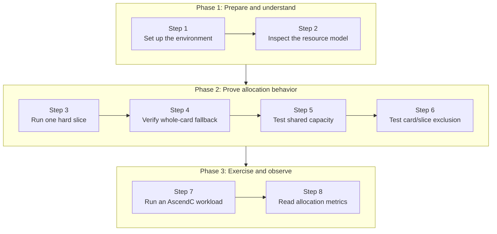

This lab installs HAMi 2.10.0 and the pinned `ascend-device-plugin` v1.4.1 on a single Ascend 310P3. You will request fixed vNPU templates through Kubernetes resources, confirm the selected template inside a Pod, share one physical NPU between multiple Pods, and observe the scheduler's capacity and allocation accounting.

For Volcano and `hami-vnpu-core` soft slicing on Ascend 310P3, see [Lab 13: Soft-Slicing Ascend 310P3 vNPU with Volcano and HAMi-core](./volcano-ascend-vnpu.md). This lab covers HAMi-native template-based hard slicing.

:::note

The output blocks were captured from the verified run on 2026-09-19. Node names, Pod names, IP addresses, and device UUIDs are environment-specific; compare the resource names, template names, readiness, placement, and scheduling reasons.

:::

## What You'll Learn

- install HAMi with Ascend support and deploy the pinned Ascend device plugin;
- understand the `huawei.com/Ascend310P` and `-memory` resource keys;
- understand how HAMi matches vNPU templates based on a Pod's memory request;
- confirm the selected vNPU through HAMi annotations, environment variables, and `npu-smi`;
- share one physical NPU between multiple hard-slice Pods;
- observe the seven-slice capacity limit and whole-card/slice mutual exclusion; and
- read HAMi's device-sharing and allocation metrics without confusing allocation with live workload usage.

## Lab Overview



## Prerequisites

- A single-node Kubernetes cluster with an idle Ascend 310P3. The verified run used Ubuntu 20.04.6 LTS, Kubernetes v1.37.0, and Ascend driver 22.0.4.
- The Ascend driver/toolkit and [Ascend Docker Runtime](https://gitcode.com/Ascend/mind-cluster/tree/master/component/ascend-docker-runtime), with an `ascend` containerd runtime handler configured on the node.
- A checkout of this website repository. Run the commands below from its root; the example files are under [`tutorials/labs/examples/18-hami-ascend-vnpu-slicing/`](https://github.com/Project-HAMi/website/tree/master/tutorials/labs/examples/18-hami-ascend-vnpu-slicing).

> Running `hami-vnpu-core` soft slicing requires Ascend Driver later than 25.5.

The verified component versions were:

| Component            | Version or configuration   |
| :------------------- | :------------------------- |
| OS                   | Ubuntu 20.04.6 LTS, x86_64 |
| Node                 | `lixd-npu-test2`           |
| Kubernetes           | v1.37.0                    |
| Ascend driver        | 22.0.4                     |
| HAMi                 | v2.10.0                    |
| Ascend device plugin | v1.4.1                     |
| NPU                  | 1 x Ascend 310P3           |

First check that the host sees a healthy device:

```bash
npu-smi info
```

```text
+--------------------------------------------------------------------------------------------------------+
| npu-smi 22.0.4                                   Version: 22.0.4                                       |
+-------------------------------+-----------------+------------------------------------------------------+
| NPU     Name                  | Health          | Power(W)     Temp(C)     Hugepages-Usage(page)     |
| Chip    Device                | Bus-Id          | AICore(%)    Memory-Usage(MB)                        |
+===============================+=================+======================================================+
| 7       310P3                 | OK              | NA           28                0    / 0              |
| 0       0                     | 0000:00:07.0    | 0            1805 / 21527                            |
+-------------------------------+-----------------+------------------------------------------------------+
```

## Step 1: Environment Setup

### Deploy HAMi

Add the HAMi chart repository and install the verified chart version with Ascend support enabled:

```bash
helm repo add hami-charts https://project-hami.github.io/HAMi/
helm repo update
helm search repo hami-charts/hami --versions | head

helm install hami hami-charts/hami \
  --version 2.10.0 \
  -n kube-system \
  --set devices.ascend.enabled=true
```

> `devices.ascend.enabled=true` enables Ascend resource support.

Confirm that the scheduler started successfully:

```bash
kubectl -n kube-system get pods -l app.kubernetes.io/component=hami-scheduler
```

```text
NAME                              READY   STATUS    RESTARTS   AGE
hami-scheduler-7f554bd479-rsrb9   2/2     Running   0          3m33s
```

### Label the Node

The Ascend device plugin selects nodes through the `ascend=on` label:

```bash
kubectl get nodes -o wide

# Replace this value with the Ascend node shown above.
export NODE_NAME="your-ascend-node-name"
kubectl label node "$NODE_NAME" ascend=on --overwrite
```

### Deploy RuntimeClass

The workload manifests use `runtimeClassName: ascend`. The Ascend node must already have Ascend Docker Runtime installed and the `ascend` handler registered.

Create the `RuntimeClass` object from the pinned device-plugin release:

```bash
kubectl apply -f https://raw.githubusercontent.com/Project-HAMi/ascend-device-plugin/refs/tags/v1.4.1/ascend-runtimeclass.yaml
```

### Deploy ConfigMap

After HAMi is installed, the global `hami-scheduler-device` ConfigMap is created automatically. It contains the Ascend resource names, slicing mode, and vNPU templates; do not deploy it again.

The device plugin mounts `hami-device-node-config`, so create the node-level ConfigMap first:

> The v1.4.1 node-config example targets `cnst-dev-w2` and enables `hami-vnpu-core`. This lab uses template-based hard slicing; do not apply it unchanged. Set it to `false` in the node-specific configuration.

```bash
curl -fsSL \
  https://raw.githubusercontent.com/Project-HAMi/ascend-device-plugin/refs/tags/v1.4.1/ascend-device-node-configmap.yaml \
  | sed \
    -e "s/cnst-dev-w2/${NODE_NAME}/" \
    -e 's/hami-vnpu-core: true/hami-vnpu-core: false/' \
  | kubectl apply -f -
```

> Node-level settings take precedence over the global configuration.

### Deploy ascend-device-plugin

Deploy the v1.4.1 device-plugin manifest. The YAML in the v1.4.1 tag still uses the v1.4.0 image, so update the DaemonSet image explicitly:

```bash
kubectl apply -f https://raw.githubusercontent.com/Project-HAMi/ascend-device-plugin/refs/tags/v1.4.1/ascend-device-plugin.yaml
kubectl -n kube-system set image \
  daemonset/hami-ascend-device-plugin \
  device-plugin=projecthami/ascend-device-plugin:v1.4.1
```

Confirm that the device plugin started successfully:

```bash
kubectl -n kube-system get pod -l app.kubernetes.io/component=hami-ascend-device-plugin
```

```text
NAME                              READY   STATUS    RESTARTS   AGE
hami-ascend-device-plugin-2z52v   1/1     Running   0          8m26s
```

After the device plugin starts, verify the node resources:

```bash
kubectl describe node "$NODE_NAME" | grep "Capacity:" -A 7
```

```text
Capacity:
  cpu:                    16
  ephemeral-storage:      100676120576
  huawei.com/Ascend310P:  7
  hugepages-1Gi:          0
  hugepages-2Mi:          0
  memory:                 65866796Ki
  pods:                   110
```

Why does one physical card report `huawei.com/Ascend310P: 7`?

> The `huawei.com/Ascend310P: 7` value is the schedulable share calculated by HAMi/device-plugin from the smallest vNPU template; it does not mean that the node has seven physical NPUs. The smallest template in the 310P3 configuration is `vir01=3072 MiB`, so the calculation is `floor(21527 / 3072) = 7`. The calculation uses `memoryAllocatable`. The device plugin therefore reports seven virtual device shares to Kubernetes. HAMi still checks device memory and other resources when deciding whether a Pod can use the physical card.

## Step 2: Inspect the 310P3 Resource Model

### HAMi Resources

310P3 template hard slicing uses two resource keys: device count and memory:

```yaml
resources:
  limits:
    huawei.com/Ascend310P: "1"
    huawei.com/Ascend310P-memory: "1024"
```

- `huawei.com/Ascend310P`: the Ascend device-count resource. Set it to `1` for template hard slicing, then use `-memory` to select a vNPU template.
- `huawei.com/Ascend310P-memory`: the memory request. HAMi selects the smallest template that satisfies the request.
- Omitting `-memory` requests the whole card.

### Inspect Supported 310P3 Templates

Inspect the vNPU templates supported by the NPU hardware:

```bash
root@lixd-npu-test2:~# npu-smi info -t template-info -i 7
+------------------------------------------------------------------------------------------+
|NPU instance template info is:                                                            |
|Name                AICORE    Memory    AICPU     VPC            VENC           JPEGD     |
|                               GB                 PNGD           VDEC           JPEGE     |
+==========================================================================================+
|vir01               1         3         1         1              0              2         |
|                                                  0              1              1         |
+------------------------------------------------------------------------------------------+
|vir02               2         6         2         3              1              4         |
|                                                  0              3              2         |
+------------------------------------------------------------------------------------------+
|vir02_1c            2         6         1         3              0              4         |
|                                                  0              3              2         |
+------------------------------------------------------------------------------------------+
|vir04               4         12        4         6              2              8         |
|                                                  0              6              4         |
+------------------------------------------------------------------------------------------+
|vir04_3c            4         12        3         6              1              8         |
|                                                  0              6              4         |
+------------------------------------------------------------------------------------------+
|vir04_3c_ndvpp      4         12        3         0              0              0         |
|                                                  0              0              0         |
+------------------------------------------------------------------------------------------+
|vir04_4c_dvpp       4         12        4         12             3              16        |
|                                                  0              12             8         |
+------------------------------------------------------------------------------------------+
```

Then inspect the ConfigMap actually loaded by HAMi:

```bash
kubectl -n kube-system get cm hami-scheduler-device \
  -o jsonpath='{.data.device-config\.yaml}' \
  | grep -A24 'chipName: 310P3'
```

The default HAMi configuration for 310P3 enables only three templates:

| Template | Configured memory | AI Core | AI CPU |
| :------- | :---------------- | :------ | :----- |
| `vir01`  | 3072 MiB          | 1       | 1      |
| `vir02`  | 6144 MiB          | 2       | 2      |
| `vir04`  | 12288 MiB         | 4       | 4      |

The corresponding configuration is:

```yaml
- chipName: 310P3
  commonWord: Ascend310P
  resourceName: huawei.com/Ascend310P
  resourceMemoryName: huawei.com/Ascend310P-memory
  resourceCoreName: huawei.com/Ascend310P-core
  memoryAllocatable: 21527
  memoryCapacity: 24576
  aiCore: 8
  aiCPU: 7
  runtimeClassName: ascend
  templates:
    - name: vir01
      memory: 3072
      aiCore: 1
      aiCPU: 1
    - name: vir02
      memory: 6144
      aiCore: 2
      aiCPU: 2
    - name: vir04
      memory: 12288
      aiCore: 4
      aiCPU: 4
```

## Step 3: Run a Single Hard-Slice Pod

The first example requests 1024 MiB. That is deliberately below the smallest configured template, so HAMi should select `vir01`:

```yaml
apiVersion: v1
kind: Pod
metadata:
  name: auto-1024
spec:
  schedulerName: hami-scheduler
  runtimeClassName: ascend
  restartPolicy: Never
  containers:
    - name: npu-test
      image: docker.io/ascendai/cann:7.0.1-310p-openeuler20.03-py3.8
      imagePullPolicy: IfNotPresent
      securityContext:
        allowPrivilegeEscalation: false
      command: ["bash", "-lc"]
      args:
        - |
          echo "ASCEND_VISIBLE_DEVICES=$ASCEND_VISIBLE_DEVICES"
          echo "ASCEND_VNPU_SPECS=$ASCEND_VNPU_SPECS"
          npu-smi info
          sleep 3600
      resources:
        limits:
          huawei.com/Ascend310P: "1"
          huawei.com/Ascend310P-memory: "1024"
```

The same manifest is also available as [`01-single-hard-slice-pod.yaml`](https://github.com/Project-HAMi/website/blob/master/tutorials/labs/examples/18-hami-ascend-vnpu-slicing/01-single-hard-slice-pod.yaml) for reuse; the inline manifest above remains the primary example in this walkthrough.

The pinned CANN image runs as root, and Step 7 installs build tools inside the retained container. Keep `allowPrivilegeEscalation: false`, but do not set an arbitrary non-root UID that the image does not support. If your cluster requires non-root workloads, build and validate a derivative image that already contains the tools and a user with access to the Ascend devices.

Confirm that the Pod is Running:

```bash
kubectl get pod auto-1024 -o wide
```

```text
NAME        READY   STATUS    RESTARTS   AGE   NODE
auto-1024   1/1     Running   0          21s   lixd-npu-test2
```

Inspect the allocation annotations:

```bash
kubectl get pod auto-1024 \
  -o jsonpath='{.metadata.annotations.hami\.io/Ascend310P-devices-allocated}{"\n"}{.metadata.annotations.huawei\.com/Ascend310P}{"\n"}'
```

```text
E0766E64-20C0E5F1-27941064-AED8030A-F6003019,Ascend310P,3072,0:;
[{"UUID":"E0766E64-20C0E5F1-27941064-AED8030A-F6003019","temp":"vir01","memory":3072}]
```

The UUID is environment-specific. The important evidence is `temp: vir01` and the 3072 MiB template memory. Confirm that the container receives the selected vNPU:

```bash
kubectl exec auto-1024 -- bash -lc '
  echo "ASCEND_VISIBLE_DEVICES=$ASCEND_VISIBLE_DEVICES"
  echo "ASCEND_VNPU_SPECS=$ASCEND_VNPU_SPECS"
  npu-smi info
'
```

```text
ASCEND_VISIBLE_DEVICES=0
ASCEND_VNPU_SPECS=vir01
+--------------------------------------------------------------------------------------------------------+
| npu-smi 22.0.4                                   Version: 22.0.4                                       |
+-------------------------------+-----------------+------------------------------------------------------+
| NPU     Name                  | Health          | Power(W)     Temp(C)           Hugepages-Usage(page) |
| Chip    Device                | Bus-Id          | AICore(%)    Memory-Usage(MB)                        |
+===============================+=================+======================================================+
| 7       310Pvir01             | OK              | NA           28                0    / 0              |
| 0       0                     | 0000:00:07.0    | 0            249  / 2690                             |
+-------------------------------+-----------------+------------------------------------------------------+
```

The allocation annotation, `ASCEND_VNPU_SPECS=vir01`, and `npu-smi`'s `310Pvir01` identify the same hard-slice path from three different layers.

The same workload shape can request different memory values. With the 1024 MiB example still running, apply the complete manifest for two additional Pods:

```bash
kubectl apply -f tutorials/labs/examples/18-hami-ascend-vnpu-slicing/02-template-matching-pods.yaml
kubectl wait --for=condition=Ready pod/auto-4096 pod/auto-7000 --timeout=5m
kubectl get pods auto-1024 auto-4096 auto-7000 \
  -o custom-columns='NAME:.metadata.name,READY:.status.containerStatuses[0].ready,STATUS:.status.phase,NODE:.spec.nodeName'
```

All three Pods were Running:

```text
NAME        READY   STATUS    NODE
auto-1024   1/1     Running   lixd-npu-test2
auto-4096   1/1     Running   lixd-npu-test2
auto-7000   1/1     Running   lixd-npu-test2
```

The captured matching results were:

| Original request | Webhook-adjusted request | Selected template | Container-visible memory |
| :--------------- | :----------------------- | :---------------- | :----------------------- |
| 1024 MiB         | 3072 MiB                 | `vir01`           | 2690 MiB                 |
| 4096 MiB         | 6144 MiB                 | `vir02`           | 5381 MiB                 |
| 7000 MiB         | 12288 MiB                | `vir04`           | 10763 MiB                |

The 4096 MiB request appeared as `vir02` inside the Pod:

```text
ASCEND_VISIBLE_DEVICES=0
ASCEND_VNPU_SPECS=vir02
+===============================+=================+======================================================+
| 7       310Pvir02             | OK              | NA           28                0    / 0              |
| 0       0                     | 0000:00:07.0    | 0            497  / 5381                             |
+===============================+=================+======================================================+
```

The 7000 MiB request appeared as `vir04` inside the Pod:

```text
ASCEND_VISIBLE_DEVICES=0
ASCEND_VNPU_SPECS=vir04
+===============================+=================+======================================================+
| 7       310Pvir04             | OK              | NA           29                0    / 0              |
| 0       0                     | 0000:00:07.0    | 0            995  / 10763                            |
+===============================+=================+======================================================+
```

For example, the 4096 MiB Pod reports `ASCEND_VNPU_SPECS=vir02`, while the 7000 MiB Pod reports `ASCEND_VNPU_SPECS=vir04`. The webhook rounds each request up to the smallest matching configured template; it does not create an arbitrary 4096 or 7000 MiB hardware profile.

On the host, the same run showed three vNPUs on one physical device:

```text
| Total number of vnpu: 3                                                       |
+-------------------------------------------------------------------------------+
|  Vnpu ID  |  Vgroup ID     |  Container ID  |  Status  |  Template Name       |
+-------------------------------------------------------------------------------+
|  100      |  0             |  ffffffffffff  |  1       |  vir01               |
|  101      |  1             |  ffffffffffff  |  1       |  vir02               |
|  102      |  2             |  ffffffffffff  |  1       |  vir04               |
+-------------------------------------------------------------------------------+
```

## Step 4: Verify Whole-Card Fallback

The largest configured template is `vir04=12288 MiB`. Delete the three template Pods and request `13000 MiB`, which is above the largest template but below the physical card's schedulable memory:

The complete manifest is in `tutorials/labs/examples/18-hami-ascend-vnpu-slicing/03-over-max-memory-idle-card.yaml`:

```bash
kubectl delete pod auto-1024 auto-4096 auto-7000 --ignore-not-found
kubectl apply -f tutorials/labs/examples/18-hami-ascend-vnpu-slicing/03-over-max-memory-idle-card.yaml
kubectl wait --for=condition=Ready pod/over-max-memory-idle-card --timeout=5m
```

The Pod was scheduled and became ready:

```text
pod/over-max-memory-idle-card created
pod/over-max-memory-idle-card condition met

NAME                        READY   STATUS    RESTARTS   AGE     IP             NODE
over-max-memory-idle-card   1/1     Running   0          3m15s   172.25.49.59   lixd-npu-test2
```

The Pod runs as a whole-card request. HAMi changes the requested memory to the full-card schedulable value, and the Pod has no `ASCEND_VNPU_SPECS`. The API Server and HAMi allocation data showed:

```json
{
  "allocated": "E0766E64-20C0E5F1-27941064-AED8030A-F6003019,Ascend310P,21527,0:;",
  "device": "[{\"UUID\":\"E0766E64-20C0E5F1-27941064-AED8030A-F6003019\",\"memory\":21527}]",
  "resources": {
    "limits": {
      "huawei.com/Ascend310P": "1",
      "huawei.com/Ascend310P-memory": "21527"
    },
    "requests": {
      "huawei.com/Ascend310P": "1",
      "huawei.com/Ascend310P-memory": "21527"
    }
  }
}
```

Inside the Pod, `npu-smi info` showed the complete physical `310P3`:

```text
ASCEND_AICPU_PATH=/usr/local/Ascend/ascend-toolkit/latest
ASCEND_DOCKER_RUNTIME=True
ASCEND_HOME_PATH=/usr/local/Ascend/ascend-toolkit/latest
ASCEND_OPP_PATH=/usr/local/Ascend/ascend-toolkit/latest/opp
ASCEND_TOOLKIT_HOME=/usr/local/Ascend/ascend-toolkit/latest
ASCEND_VISIBLE_DEVICES=0
+--------------------------------------------------------------------------------------------------------+
| npu-smi 22.0.4                                   Version: 22.0.4                                       |
+-------------------------------+-----------------+------------------------------------------------------+
| NPU     Name                  | Health          | Power(W)     Temp(C)     Hugepages-Usage(page)     |
| Chip    Device                | Bus-Id          | AICore(%)    Memory-Usage(MB)                        |
+===============================+=================+======================================================+
| 7       310P3                 | OK              | NA           28                0    / 0              |
| 0       0                     | 0000:00:07.0    | 0            1805 / 21527                            |
+-------------------------------+-----------------+------------------------------------------------------+
```

The host also reported `Total number of vnpu: 0`. This is whole-card fallback, not selection of a larger vNPU template.

This is whole-card fallback, not selection of a larger vNPU template. On an idle card it runs; when slices already consume the card, the same request remains Pending with `CardInsufficientMemory`.

## Step 5: Verify Multi-Pod Sharing and Capacity

A single Pod only proves that the basic path works. To test the physical-card capacity, start eight identical `vir01` Pods directly. The complete eight-Pod manifest is in `tutorials/labs/examples/18-hami-ascend-vnpu-slicing/04-hard-slice-capacity.yaml`:

```bash
kubectl delete -f tutorials/labs/examples/18-hami-ascend-vnpu-slicing/03-over-max-memory-idle-card.yaml --ignore-not-found
kubectl apply -f tutorials/labs/examples/18-hami-ascend-vnpu-slicing/04-hard-slice-capacity.yaml
kubectl get pods -l app=hami-310p-oversubscribe \
  -o custom-columns='NAME:.metadata.name,READY:.status.containerStatuses[0].ready,STATUS:.status.phase,NODE:.spec.nodeName'
```

A single 310P3 physical card can hold seven `vir01` templates, so the expected result is seven Running Pods and one Pending Pod:

```text
NAME                         READY   STATUS    NODE
hami-310p-oversubscribe-0    1/1     Running   lixd-npu-test2
hami-310p-oversubscribe-1    1/1     Running   lixd-npu-test2
hami-310p-oversubscribe-2    1/1     Running   lixd-npu-test2
hami-310p-oversubscribe-3    1/1     Running   lixd-npu-test2
hami-310p-oversubscribe-4    1/1     Running   lixd-npu-test2
hami-310p-oversubscribe-5    1/1     Running   lixd-npu-test2
hami-310p-oversubscribe-6    1/1     Running   lixd-npu-test2
hami-310p-oversubscribe-7    0/1     Pending   <none>
```

Inspect the Pending Pod's event:

```bash
kubectl describe pod \
  -l app=hami-310p-oversubscribe \
  | grep -A2 -E 'FailedScheduling|CardTimeSlicingExhausted'
```

The host should also show seven `vir01` vNPUs:

```text
| Total number of vnpu: 7                                                       |
+-------------------------------------------------------------------------------+
|  100      |  0             |  ffffffffffff  |  1       |  vir01               |
|  101      |  0             |  ffffffffffff  |  1       |  vir01               |
|  102      |  1             |  ffffffffffff  |  1       |  vir01               |
|  103      |  1             |  ffffffffffff  |  1       |  vir01               |
|  104      |  2             |  ffffffffffff  |  1       |  vir01               |
|  105      |  2             |  ffffffffffff  |  1       |  vir01               |
|  106      |  3             |  ffffffffffff  |  1       |  vir01               |
+-------------------------------------------------------------------------------+
```

This verifies both that the advertised `Ascend310P: 7` capacity maps to seven smallest templates and that HAMi reports `CardTimeSlicingExhausted` instead of placing an eighth Pod on the card.

Inspect the allocation annotations for two Running Pods to confirm that they share one physical-device UUID while using independent `vir01` vNPUs:

```bash
kubectl get pod hami-310p-oversubscribe-0 \
  -o jsonpath='{.metadata.name}{"\t"}{.metadata.annotations.hami\.io/Ascend310P-devices-allocated}{"\n"}'
kubectl get pod hami-310p-oversubscribe-1 \
  -o jsonpath='{.metadata.name}{"\t"}{.metadata.annotations.hami\.io/Ascend310P-devices-allocated}{"\n"}'
```

```text
hami-310p-oversubscribe-0  E0766E64-20C0E5F1-27941064-AED8030A-F6003019,Ascend310P,3072,0:;
hami-310p-oversubscribe-1  E0766E64-20C0E5F1-27941064-AED8030A-F6003019,Ascend310P,3072,0:;
```

The UUID is environment-specific. The important evidence is that both Pods carry the same UUID and each receives the 3072 MiB `vir01` template.

## Step 6: Verify Whole-Card and Slice Exclusion

Omitting `huawei.com/Ascend310P-memory` requests the whole card:

```yaml
resources:
  limits:
    huawei.com/Ascend310P: "1"
```

The webhook adds the full-card schedulable memory automatically:

```yaml
huawei.com/Ascend310P-memory: "21527"
```

The whole-card manifest is `tutorials/labs/examples/18-hami-ascend-vnpu-slicing/05-whole-card-pod.yaml`. Start from the capacity test, remove its eight Pods, and let the whole-card Pod run first:

```bash
kubectl delete -f tutorials/labs/examples/18-hami-ascend-vnpu-slicing/04-hard-slice-capacity.yaml --ignore-not-found
kubectl apply -f tutorials/labs/examples/18-hami-ascend-vnpu-slicing/05-whole-card-pod.yaml
kubectl wait --for=condition=Ready pod/whole-after-slices --timeout=5m
```

Then apply the two complete hard-slice manifests. They remain Pending while the whole-card Pod is running:

```bash
kubectl apply -f tutorials/labs/examples/18-hami-ascend-vnpu-slicing/02-template-matching-pods.yaml
kubectl get pods auto-4096 auto-7000 \
  -o custom-columns='NAME:.metadata.name,READY:.status.containerStatuses[0].ready,STATUS:.status.phase,NODE:.spec.nodeName'
kubectl describe pod auto-4096 \
  | grep -A2 -E 'FailedScheduling|CardInsufficientMemory'
```

```text
NAME        READY   STATUS    NODE
auto-4096   0/1     Pending   <none>
auto-7000   0/1     Pending   <none>

Warning  FailedScheduling  hami-scheduler
0/1 nodes are available: 1 1/1 CardInsufficientMemory.
```

Delete the whole-card Pod. The two slices then become Running; request the whole card again and observe the reverse direction:

```bash
kubectl delete -f tutorials/labs/examples/18-hami-ascend-vnpu-slicing/05-whole-card-pod.yaml --ignore-not-found
kubectl wait --for=condition=Ready pod/auto-4096 pod/auto-7000 --timeout=5m
kubectl apply -f tutorials/labs/examples/18-hami-ascend-vnpu-slicing/05-whole-card-pod.yaml
kubectl get pods auto-4096 auto-7000 whole-after-slices \
  -o custom-columns='NAME:.metadata.name,READY:.status.containerStatuses[0].ready,STATUS:.status.phase,NODE:.spec.nodeName'
kubectl describe pod whole-after-slices \
  | grep -A2 -E 'FailedScheduling|CardInsufficientMemory'
```

```text
NAME                 READY   STATUS    NODE
auto-4096            1/1     Running   lixd-npu-test2
auto-7000            1/1     Running   lixd-npu-test2
whole-after-slices   0/1     Pending   <none>

Warning  FailedScheduling  hami-scheduler
0/1 nodes are available: 1 1/1 CardInsufficientMemory.
```

Remove the Pending whole-card Pod and keep the two template Pods for the next demo:

```bash
kubectl delete -f tutorials/labs/examples/18-hami-ascend-vnpu-slicing/05-whole-card-pod.yaml --ignore-not-found
```

## Step 7: Run a Real AscendC Workload in a Pod

### Observe Device Memory Allocation and Release

The previous Pods only ran `npu-smi` and `sleep`. The following observations use the Running `auto-7000` Pod, which is the `vir04` template:

```bash
kubectl exec auto-7000 -- bash -lc 'echo "ASCEND_VNPU_SPECS=$ASCEND_VNPU_SPECS"; npu-smi info'
```

When idle, the Pod reports:

```text
| 7       310Pvir04             | OK              | NA           33                0    / 0              |
| 0       0                     | 0000:00:07.0    | 0            995  / 10763                            |
```

In the first terminal, run this ACL program. It allocates twelve 512 MiB chunks, keeps them allocated for 60 seconds, and then releases them:

```bash
kubectl exec -i auto-7000 -- bash -lc 'python3 -' <<'PY'
import acl
import time

chunk = 512 * 1024 * 1024
chunks = []
print("acl.init", acl.init(), flush=True)
print("acl.rt.set_device", acl.rt.set_device(0), flush=True)
context, ret = acl.rt.create_context(0)
print("acl.rt.create_context", context, ret, flush=True)
for index in range(12):
    pointer, ret = acl.rt.malloc(chunk, 0)
    print("malloc", index + 1, "size", chunk, "ptr", pointer, "ret", ret, flush=True)
    if ret != 0:
        break
    chunks.append(pointer)
print("allocated_bytes", len(chunks) * chunk, flush=True)
time.sleep(60)
for pointer in chunks:
    print("free", pointer, acl.rt.free(pointer), flush=True)
print("destroy_context", acl.rt.destroy_context(context), flush=True)
print("reset_device", acl.rt.reset_device(0), flush=True)
print("acl.finalize", acl.finalize(), flush=True)
PY
```

While the program is sleeping, observe the allocation from a second terminal:

```bash
kubectl exec auto-7000 -- npu-smi info
```

During an ACL allocation of about 6 GiB, it reports:

```text
+===============================+=================+======================================================+
| 7       310Pvir04             | OK              | NA           33                3092 / 3092           |
| 0       0                     | 0000:00:07.0    | 0            10763/ 10763                            |
+===============================+=================+======================================================+
```

After release, it returns to:

```text
| 7       310Pvir04             | OK              | NA           33                0    / 0              |
| 0       0                     | 0000:00:07.0    | 0            995  / 10763                            |
```

This confirms that an ACL workload can allocate and release device memory inside `vir04`. Host physical-card memory is not a direct measurement of a single hard-slice Pod's live allocation because the vNPU, HugePages, and physical-card counters use different accounting scopes on this driver.

### Compile and Run a CANN AscendC Operator

The pinned CANN image contains an AscendC kernel sample. Install its build dependencies, copy the sample to a writable directory, and compile it for `vir04`:

```bash
kubectl exec auto-7000 -- bash -lc '
dnf install -y cmake make gcc gcc-c++
rm -rf /tmp/ascendc-vir04
cp -a /usr/local/Ascend/ascend-toolkit/7.0.1/tools/ascendc_kernel_sample \
  /tmp/ascendc-vir04
cd /tmp/ascendc-vir04
cmake -S . -B build \
  -DSOC_VERSION=ascend310p3vir04 \
  -DCMAKE_BUILD_TYPE=Release
cmake --build build -j"$(nproc)"
./build/main
'
```

The build produces AI Core object files and completes the link:

```text
[100%] Building CXX object ... auto_gen_add_custom.cpp.o
[100%] Building CXX object ... auto_gen_matmul_custom.cpp.o
/usr/local/Ascend/ascend-toolkit/latest/compiler/ccec_compiler/bin/ld.lld -m aicorelinux ...
[100%] Built target main
```

The add operator output was:

```text
output of add_custom:
8.000000 8.000000 8.000000 8.000000 ...
```

The matrix-multiply operator output was:

```text
output of matmul:
8192.000000 8192.000000 8192.000000 8192.000000 ...
```

During repeated execution, a host sample reached 20% AICore utilization:

```text
20:51:39.865
| 7       310P3                 | OK              | NA           34                20   / 20             |

20:51:41.424
| 7       310P3                 | OK              | NA           34                0    / 0              |
```

These short operator pulses prove that the task entered AI Core execution; they do not mean that `vir04` continuously occupies a fixed percentage of the physical card.

## Step 8: Read HAMi Allocation Metrics

The HAMi scheduler exposes Prometheus metrics on port 9395. On a cluster where the scheduler Service publishes that port, use a local port-forward:

```bash
kubectl -n kube-system port-forward svc/hami-scheduler 9395:monitor
```

In a second terminal, query the metrics while the template Pods are running:

```bash
curl -s http://127.0.0.1:9395/metrics \
  | grep -E 'hami_(gpu_shared_count|vgpu_memory_allocated_bytes|resource_quota_used)'
```

The following metrics are abbreviated examples; labels unrelated to this lab's verification are omitted. Refer to the actual `/metrics` output for the complete label set.

The captured run included:

```text
hami_gpu_shared_count{
  device_type="Ascend310P",
  node="lixd-npu-test2"
} 2

hami_resource_quota_used{
  namespace="default",
  quota_name="huawei.com/Ascend310P-memory"
} 18432

hami_vgpu_memory_allocated_bytes{pod="auto-4096",namespace="default"} 6.442450944e+09
hami_vgpu_memory_allocated_bytes{pod="auto-7000",namespace="default"} 1.2884901888e+10
```

The two byte values correspond to 6144 and 12288 MiB. They are scheduler allocation values, not the amount of memory currently touched by a workload.

The same scheduler allocation metrics can be visualized in Grafana:


The Grafana dashboard used in this lab is available in [hami-lab-dashboard.json](https://raw.githubusercontent.com/Project-HAMi/website/refs/heads/master/tutorials/labs/examples/18-hami-ascend-vnpu-slicing/hami-lab-dashboard.json).

## Troubleshooting

### The node has no `huawei.com/Ascend310P` allocatable resource

Check the node label, DevicePlugin, logs, and the two ConfigMaps:

```bash
kubectl get node "$NODE_NAME" --show-labels | grep 'ascend=on'
kubectl -n kube-system get pods \
  -l app.kubernetes.io/component=hami-ascend-device-plugin -o wide
kubectl -n kube-system logs ds/hami-ascend-device-plugin --tail=100
kubectl -n kube-system get cm hami-scheduler-device hami-device-node-config
```

### A hard-slice Pod stays Pending

Check that the resource key is exactly `huawei.com/Ascend310P`, that the request does not exceed the configured templates or remaining card memory, and that no whole-card Pod is using the NPU:

```bash
kubectl describe pod POD_NAME
kubectl -n kube-system logs deploy/hami-scheduler --tail=100
kubectl get node "$NODE_NAME" \
  -o jsonpath='{.status.allocatable.huawei\.com/Ascend310P}{"\n"}'
```

`CardTimeSlicingExhausted` means the available template slots are full. `CardInsufficientMemory` commonly means a whole-card request is competing with existing slices, or the requested template cannot fit in the remaining device memory.

## Cleanup

> The HAMi, Ascend device-plugin, and RuntimeClass commands below remove cluster-scoped resources installed for this lab. Run them only when this lab owns the installation; on a shared cluster, delete only the Pods created by this lab and remove the node label only if this lab created it.

### Delete Pods

Delete the Pods created by this lab:

```bash
kubectl delete pod -l hami.run/lab-18=true --ignore-not-found
kubectl delete pod \
  auto-1024 auto-4096 auto-7000 over-max-memory-idle-card whole-after-slices \
  --ignore-not-found
```

### Uninstall HAMi

```bash
helm uninstall hami --namespace kube-system
```

### Uninstall DevicePlugin

Delete the Ascend device-plugin and its node-level ConfigMap:

```bash
kubectl delete -f https://raw.githubusercontent.com/Project-HAMi/ascend-device-plugin/refs/tags/v1.4.1/ascend-device-plugin.yaml --ignore-not-found
kubectl -n kube-system delete cm hami-device-node-config --ignore-not-found
```

### Remove Node Configuration

Remove the RuntimeClass and node label created by this lab:

```bash
kubectl delete -f https://raw.githubusercontent.com/Project-HAMi/ascend-device-plugin/refs/tags/v1.4.1/ascend-runtimeclass.yaml --ignore-not-found
kubectl label node "$NODE_NAME" ascend-
```

## What This Lab Proved

| Check | Expected result |
| :-- | :-- |
| Plugin registration | The node advertises `huawei.com/Ascend310P: 7`. |
| Template matching | 1024, 4096, and 7000 MiB requests select `vir01`, `vir02`, and `vir04`. |
| Container device view | `ASCEND_VNPU_SPECS` and `npu-smi` report the selected template. |
| Multi-Pod sharing | Two Pods carry the same physical-device UUID and run as separate `vir01` slices. |
| Capacity exhaustion | Seven `vir01` Pods run and the eighth is Pending with `CardTimeSlicingExhausted`. |
| Whole-card exclusion | A whole-card request and template slices cannot consume the same physical NPU simultaneously. |
| Metrics | HAMi reports device-sharing and scheduler allocation values for the Ascend resource. |
