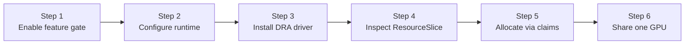

:::warning[Experimental]

The HAMi DRA driver is young and moving fast. This lab installs the exact DaemonSet manifests that were verified live on a Tesla T4 cluster (driver `projecthami/k8s-dra-driver:v0.1.0`). The driver repository has since added a Helm chart for the same v0.1.0 driver (in-repo at `chart/hami-dra-driver`, with a `nvidiaDriverRoot` value covering GPU Operator clusters); this lab will switch to the chart once that path has been verified. The consumable capacity feature also remains behind a Kubernetes feature gate.


:::

In [Lab 3](./gpu-partitioning.md) you sliced a GPU using HAMi's extended resources (`nvidia.com/gpumem`, `nvidia.com/gpucores`). This lab achieves the same outcome through **Dynamic Resource Allocation (DRA)**, the Kubernetes-native device API that went GA in v1.34. Instead of opaque resource names, Pods request devices through `ResourceClaims` with structured, schema-validated capacity requests.

## Why DRA Matters

| | Extended resources (Lab 3) | DRA (this lab) |
| --- | --- | --- |
| API | `nvidia.com/gpumem: 4000` in resource limits | `ResourceClaim` with `capacity.requests: {memory: 4Gi, cores: 30}` |
| Scheduling | HAMi scheduler extender + webhook | Native kube-scheduler DRA plugin |
| Device inventory | Node annotation written by the device plugin | `ResourceSlice` API objects with typed attributes |
| Device selection | Annotations such as `nvidia.com/use-gputype` | CEL expressions over device attributes |
| Validation | None (any number accepted at admission) | `requestPolicy` with min/max/step enforced by the API server |

The HAMi DRA driver implements the [DRA Consumable Capacity](https://github.com/kubernetes/enhancements/tree/master/keps/sig-scheduling/5075-dra-consumable-capacity) feature: multiple Pods draw capacity from one device, with the scheduler doing the accounting.

## Prerequisites

- A cluster from [Lab 1](./online-install.md) on Kubernetes **v1.34 or newer**, with HAMi and GPU Operator installed
- The manifests from [`examples/04-hami-dra/`](https://github.com/Project-HAMi/hami-workshop/tree/main/examples/04-hami-dra)

## Lab Overview



## Step 1: Enable the DRAConsumableCapacity Feature Gate

DRA itself is GA in v1.34, but *consumable capacity* (multiple Pods drawing from one device's capacity pool) requires the `DRAConsumableCapacity` feature gate on the control plane components and the kubelet. Run [`enable-dra-feature-gates.sh`](https://github.com/Project-HAMi/hami-workshop/blob/main/examples/04-hami-dra/enable-dra-feature-gates.sh) as root:

```bash
for f in kube-apiserver kube-scheduler kube-controller-manager; do
  sed -i "/    - $f/a\\    - --feature-gates=DRAConsumableCapacity=true" /etc/kubernetes/manifests/$f.yaml
done

cat >> /var/lib/kubelet/config.yaml <<EOF
featureGates:
  DRAConsumableCapacity: true
EOF
systemctl restart kubelet
```

> Editing a static Pod manifest under `/etc/kubernetes/manifests/` makes kubelet restart that component automatically. The API server drops for around 20 seconds; wait until `kubectl get nodes` responds again.

Verify the DRA API group is served:

```bash
kubectl api-resources --api-group=resource.k8s.io
```

```plaintext
NAME                     SHORTNAMES   APIVERSION           NAMESPACED   KIND
deviceclasses                         resource.k8s.io/v1   false        DeviceClass
resourceclaims                        resource.k8s.io/v1   true         ResourceClaim
resourceclaimtemplates                resource.k8s.io/v1   true         ResourceClaimTemplate
resourceslices                        resource.k8s.io/v1   false        ResourceSlice
```

## Step 2: Configure the Container Runtime

The DRA driver selects devices via volume mounts rather than the `NVIDIA_VISIBLE_DEVICES` env var, which requires one extra NVIDIA Container Runtime option. With the GPU Operator managing the toolkit, set it through Helm (the operator rewrites the runtime config and restarts containerd for you):

```bash
RELEASE=$(helm list -n gpu-operator -o json | python3 -c "import json,sys; print(json.load(sys.stdin)[0]['name'])")

helm upgrade ${RELEASE} nvidia/gpu-operator -n gpu-operator --reuse-values \
  --set-json 'toolkit.env=[{"name":"ACCEPT_NVIDIA_VISIBLE_DEVICES_AS_VOLUME_MOUNTS","value":"true"},{"name":"CONTAINERD_SET_AS_DEFAULT","value":"true"}]' \
  --version=v25.3.0
```

Verify after the toolkit Pod restarts:

```bash
grep default_runtime_name /etc/containerd/config.toml
grep accept-nvidia-visible-devices-as-volume-mounts /usr/local/nvidia/toolkit/.config/nvidia-container-runtime/config.toml
```

```plaintext
      default_runtime_name = "nvidia"
accept-nvidia-visible-devices-as-volume-mounts = true
```

## Step 3: Install the HAMi DRA Driver

The driver runs as a kubelet plugin DaemonSet. Two manifests: RBAC, then the DaemonSet.

```bash
kubectl apply -f rbac.yaml
kubectl apply -f ds-gpu-operator.yaml

kubectl get pods -n hami-dra-driver
```

```plaintext
NAME                                   READY   STATUS    RESTARTS   AGE
hami-dra-driver-kubelet-plugin-r4jtt   1/1     Running   0          31s
```

> `ds-gpu-operator.yaml` is the upstream DaemonSet with one adjustment: `NVIDIA_DRIVER_ROOT` and the `driver-root` hostPath point at `/run/nvidia/driver`, because the GPU Operator keeps the driver inside a container rather than on the host. If your driver is installed directly on the host, use the [upstream `ds.yaml`](https://github.com/Project-HAMi/k8s-dra-driver/blob/main/demo/yaml/ds.yaml) unchanged.

## Step 4: Inspect the ResourceSlice

In the DRA world, drivers advertise devices as `ResourceSlice` objects instead of node annotations. Look at what the driver published:

```bash
kubectl get resourceslices -o jsonpath='{.items[0].spec.devices[0].capacity}' | python3 -m json.tool
```

```json
{
    "cores": {
        "requestPolicy": {
            "default": "100",
            "validRange": { "max": "100", "min": "0", "step": "1" }
        },
        "value": "100"
    },
    "memory": {
        "requestPolicy": {
            "default": "15Gi",
            "validRange": { "max": "15Gi", "min": "1Mi", "step": "1Mi" }
        },
        "value": "15Gi"
    }
}
```

> The T4 is advertised as a device with two consumable capacities: `cores` (0-100, step 1) and `memory` (up to 15Gi, step 1Mi). The `requestPolicy` is enforced by the scheduler, something extended resources never had. The device also carries typed attributes (`productName: Tesla T4`, `architecture: Turing`, `cudaComputeCapability: 7.5.0`, the UUID, and more) that claims can select on with CEL, plus `allowMultipleAllocations: true`, which is the consumable capacity switch.

## Step 5: Allocate a GPU Slice via ResourceClaim

`setup.yaml` creates a `DeviceClass` (selecting HAMi GPUs via CEL), a `test-dra` namespace, and claims. The interesting part:

```yaml
apiVersion: resource.k8s.io/v1
kind: ResourceClaim
metadata:
  namespace: test-dra
  name: single-gpu-0
spec:
  devices:
    requests:
    - name: single-gpu
      exactly:
        deviceClassName: hami-core-gpu.project-hami.io
        capacity:
          requests:
            cores: 30
            memory: "4Gi"
```

`pod-0.yaml` references the claim instead of requesting `nvidia.com/*` resources:

```yaml
    resources:
      claims:
      - name: single-gpu
  resourceClaims:
  - name: single-gpu
    resourceClaimName: single-gpu-0
```

Apply and verify:

```bash
kubectl apply -f setup.yaml
kubectl create -f pod-0.yaml
kubectl get pod pod-0 -n test-dra
kubectl get resourceclaim single-gpu-0 -n test-dra -o jsonpath='{.status.allocation.devices.results[0]}' | python3 -m json.tool
```

```json
{
    "consumedCapacity": {
        "cores": "30",
        "memory": "4Gi"
    },
    "device": "hami-gpu-0",
    "driver": "hami-core-gpu.project-hami.io",
    "pool": "hami-workshop",
    "request": "single-gpu",
    "shareID": "225b5df7-3753-45b1-9043-81c00616b384"
}
```

> The claim is allocated against device `hami-gpu-0` and records exactly how much capacity it consumes. The `shareID` exists because the device allows multiple allocations.

And inside the container, the same HAMi-core ceiling you saw in Lab 3, now driven by a claim:

```bash
kubectl exec -n test-dra pod-0 -- nvidia-smi | head -11
```

```plaintext
|   0  Tesla T4                       On  |   00000000:00:04.0 Off |                    0 |
| N/A   59C    P8             16W /   70W |       0MiB /   4096MiB |      0%      Default |
```

> `4096MiB` total: the 4Gi capacity request, enforced in-container by HAMi-core.

## Step 6: Two Pods Drawing from One Device

`pod-tpl-0.yaml` uses a `ResourceClaimTemplate`, so each Pod gets its own auto-generated claim:

```bash
kubectl create -f pod-tpl-0.yaml
kubectl get pods -n test-dra
kubectl get resourceclaims -n test-dra
```

```plaintext
NAME        READY   STATUS    RESTARTS   AGE
pod-0       1/1     Running   0          2m6s
pod-tpl-1   1/1     Running   0          25s

NAME                  STATE                AGE
double-gpu-0          pending              2m6s
pod-tpl-1-gpu-j6lrf   allocated,reserved   25s
single-gpu-0          allocated,reserved   2m6s
```

> Two claims `allocated,reserved`, each consuming 30 cores and 4Gi from the same device with its own `shareID`. (`double-gpu-0` stays `pending` simply because no Pod references it; DRA allocates claims when a consumer arrives.)

Confirm both Pods landed on the same physical card:

```bash
kubectl exec -n test-dra pod-0 -- nvidia-smi --query-gpu=uuid --format=csv,noheader
kubectl exec -n test-dra pod-tpl-1 -- nvidia-smi --query-gpu=uuid --format=csv,noheader
```

```plaintext
GPU-859b872c-0ba2-97b0-10b4-8b7185c55039
GPU-859b872c-0ba2-97b0-10b4-8b7185c55039
```

> Same UUID. Two Pods sharing one T4, scheduled and accounted entirely through Kubernetes-native DRA APIs. No scheduler extender, no webhook, no extended resources.

## Cleanup

```bash
kubectl delete namespace test-dra
kubectl delete -f ds-gpu-operator.yaml -f rbac.yaml
kubectl delete deviceclass hami-core-gpu.project-hami.io
```

## What This Lab Proved

| Claim | Evidence |
| --- | --- |
| DRA can drive HAMi-core GPU slicing | Pod with a 4Gi/30-core claim sees a 4096 MiB GPU |
| Consumable capacity accounting works | Claim status records `consumedCapacity` per allocation with `shareID` |
| Multiple Pods share one device natively | Two claims `allocated,reserved` on `hami-gpu-0`, same UUID in both Pods |
| Capacity requests are schema-validated | `requestPolicy` with min/max/step in the ResourceSlice |

## Next Steps

- Run [Lab 3](./gpu-partitioning.md) on the same cluster and compare the two allocation paths side by side: extended resources work on any Kubernetes version today, while DRA gives you typed device selection, schema-validated capacity, and native scheduler accounting.
- Experiment with the claims: change `cores` and `memory` in `setup.yaml`, request more than the remaining device capacity, and watch the claim stay `pending` instead of overcommitting the card.
- On a multi-GPU node, try the `double-gpu-0` claim: it requests two devices with different capacities in a single claim, something extended resources cannot express.
- The driver repository now ships a Helm chart (`chart/hami-dra-driver`); follow the [HAMi DRA driver releases](https://github.com/Project-HAMi/k8s-dra-driver/releases) for when this lab can switch to it, and the [HAMi v2.10 roadmap](https://github.com/Project-HAMi/HAMi/issues/1889) for where DRA support is heading next.
