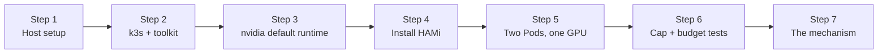

This lab builds a single-node k3s cluster on a rented GPU VM, installs HAMi **without** the NVIDIA GPU Operator, and proves that HAMi's memory isolation is real: two Pods share one physical card, `nvidia-smi` inside each Pod reports only its slice, a CUDA allocation past the slice is refused by HAMi-core while the card still has tens of GB free, and a third Pod that would oversubscribe the card stays `Pending`.

Every command and output in this lab was captured from a live run on a GCP `g4-standard-48` Spot VM with one 96 GB NVIDIA RTX PRO 6000 Blackwell (single-node k3s v1.36.2+k3s1, HAMi v2.9.0, NVIDIA driver 610.43.02, Ubuntu 22.04). Any non-MIG card works the same; only the slice sizes change (they scale with VRAM). The RTX PRO 6000 Blackwell does support MIG, but it ships with MIG disabled - HAMi's software sharing is what this lab exercises.

## How This Differs from Lab 3

[Lab 3](./gpu-partitioning.md) proves the same isolation property on a cluster where the **GPU Operator** provides the driver and container toolkit, and HAMi's device plugin is layered on top. This lab takes the other supported path: **no GPU Operator at all**. HAMi brings its own device plugin, the NVIDIA Container Toolkit is installed directly on the host, and `nvidia` is made the **default** containerd runtime so HAMi-core is injected into every GPU Pod. This is the leaner setup you would use on edge nodes, bare-metal boxes, or cheap rented GPU VMs - and it surfaces the mechanism (Step 7) that the Operator path hides.

## What You'll Learn

- Bringing up single-node k3s with the NVIDIA Container Toolkit and `nvidia` as the default runtime
- Installing HAMi without the GPU Operator, with the scheduler image tag matched to the server version
- Where HAMi records shareable GPU memory (the `hami.io/node-nvidia-register` annotation, not node allocatable)
- Proving the memory cap holds: virtualized `nvidia-smi` and a CUDA allocation refused at the slice
- Proving per-device accounting: an oversubscribing Pod stays `Pending` with `CardInsufficientMemory`
- How the cap is enforced: HAMi-core (`libvgpu.so`) registered in the Pod's `/etc/ld.so.preload` (software isolation, not MIG)

## Lab Overview



## Prerequisites

- A fresh cloud VM (Ubuntu 22.04 or later) with **one NVIDIA GPU** and root access. Any card without MIG enabled is the intended target: RTX PRO 6000, RTX A6000, L4, L40/L40S, RTX 4090/3090. Fractioning cards that MIG cannot (or does not) partition is exactly HAMi's use case.
- The NVIDIA driver working on the host (`nvidia-smi` succeeds). Most GPU VM images ship it.
- You control the container runtime: a locked-down marketplace container you cannot reconfigure will not work, because HAMi-core is injected through the NVIDIA container runtime.
- Run everything **on the VM over SSH** - helm and kubectl talk to k3s over localhost, so no flaky remote link.
- Manifests from [`tutorials/labs/examples/07-hami-isolation-k3s/`](https://github.com/Project-HAMi/website/tree/master/tutorials/labs/examples/07-hami-isolation-k3s)

:::note[Cost]

A working session is well under an hour of GPU time. Non-MIG cards commonly rent for under $1/hour on-demand. GPUs are scarce - the exact card you want is often out of stock; take whichever non-MIG card is available and adjust the slice sizes (a one-line change in the manifests).

:::

:::warning[Do not install the GPU Operator]

HAMi ships its own device plugin and [must not coexist with NVIDIA's official device plugin](https://project-hami.io/docs/installation/prerequisites). GPU Operator + HAMi integration is not officially documented ([HAMi #1708](https://github.com/Project-HAMi/HAMi/issues/1708)). If your cluster already runs the Operator, use Lab 3's path instead - or a fresh VM for this one.

:::

## Step 1: Verify the Host Driver

Nothing below works without a healthy host driver. SSH into the VM as root (or use `sudo` throughout) and check:

```bash
nvidia-smi -L
```

```plaintext
GPU 0: NVIDIA RTX PRO 6000 Blackwell Server Edition (UUID: GPU-3c4a3856-fbb4-1425-9679-aed25f4d2977)
```

> One card, visible to the host. If `nvidia-smi` fails, install the driver per the [NVIDIA driver installation guide](https://docs.nvidia.com/datacenter/tesla/driver-installation-guide/) and re-run. On a fresh Ubuntu VM that means the NVIDIA CUDA apt repo and `apt-get install nvidia-open` - Blackwell-generation cards require the **open** kernel modules (driver ≥ 570); with the proprietary module `nvidia-smi` reports `No devices found`.

## Step 2: Install the Container Toolkit, Then k3s

Order matters: install the [NVIDIA Container Toolkit](https://docs.nvidia.com/datacenter/cloud-native/container-toolkit/latest/install-guide.html) **before** k3s, so k3s auto-detects the `nvidia` container runtime at install time.

```bash
install -m 0755 -d /usr/share/keyrings
curl -fsSL https://nvidia.github.io/libnvidia-container/gpgkey \
  | gpg --dearmor -o /usr/share/keyrings/nvidia-container-toolkit-keyring.gpg
curl -fsSL https://nvidia.github.io/libnvidia-container/stable/deb/nvidia-container-toolkit.list \
  | sed 's#deb https://#deb [signed-by=/usr/share/keyrings/nvidia-container-toolkit-keyring.gpg] https://#g' \
  > /etc/apt/sources.list.d/nvidia-container-toolkit.list
apt-get update -y
apt-get install -y nvidia-container-toolkit
```

Now install k3s:

```bash
curl -sfL https://get.k3s.io | INSTALL_K3S_EXEC="--write-kubeconfig-mode 644" sh -
export KUBECONFIG=/etc/rancher/k3s/k3s.yaml
kubectl get nodes -o wide
```

```plaintext
NAME               STATUS   ROLES           AGE   VERSION        INTERNAL-IP   EXTERNAL-IP   OS-IMAGE             KERNEL-VERSION           CONTAINER-RUNTIME
hami-lab-rtx6000   Ready    control-plane   65s   v1.36.2+k3s1   10.128.0.2    <none>        Ubuntu 22.04.5 LTS   6.8.0-1063-gcp (amd64)   containerd://2.3.2-k3s2
```

Confirm k3s picked up the nvidia runtime, and label the node for HAMi:

```bash
kubectl get runtimeclass nvidia
kubectl label node hami-lab-rtx6000 gpu=on
```

```plaintext
NAME     HANDLER   AGE
nvidia   nvidia    55s
node/hami-lab-rtx6000 labeled
```

> k3s writes an `nvidia` RuntimeClass into its containerd config when the toolkit is present at install time. If it is missing, restart k3s (`systemctl restart k3s`) - see [k3s NVIDIA runtime support](https://docs.k3s.io/advanced#nvidia-container-runtime-support). HAMi's device plugin schedules onto nodes labelled `gpu=on`.

## Step 3: Make nvidia the Default Containerd Runtime

HAMi Pods do not set `runtimeClassName`, so HAMi-core is only injected if the **default** runtime is `nvidia`. Use k3s's own `default-runtime` option - the clean way that works regardless of the containerd config schema. Do **not** hand-edit `config.toml`: the v2 and v3 schemas differ and redeclaring an existing table breaks k3s.

```bash
echo 'default-runtime: nvidia' >> /etc/rancher/k3s/config.yaml
systemctl restart k3s
```

Verify it took (k3s regenerates this file; you never edit it directly):

```bash
grep default_runtime_name /var/lib/rancher/k3s/agent/etc/containerd/config.toml
```

```plaintext
default_runtime_name = "nvidia"
```

> This single line is the difference between HAMi enforcing limits and silently not enforcing them. If Step 7 later shows no `libvgpu.so` inside a GPU Pod, come back here first.

## Step 4: Install HAMi

The HAMi scheduler runs a kube-scheduler sidecar whose image tag must match the cluster's Kubernetes **server** version - a mismatch is the most common HAMi install failure. Detect it first:

```bash
kubectl version | grep Server
```

```plaintext
Server Version: v1.36.2+k3s1
```

Strip the `+k3s1` suffix and pass it as the scheduler image tag:

```bash
helm repo add hami-charts https://project-hami.github.io/HAMi
helm repo update hami-charts
helm upgrade --install hami hami-charts/hami \
  --version 2.9.0 \
  -n kube-system \
  --set scheduler.kubeScheduler.imageTag=v1.36.2 \
  --wait --timeout 5m
kubectl -n kube-system get pods | grep hami
```

```plaintext
hami-device-plugin-62ck6                  2/2     Running   0          38s
hami-scheduler-5f5b5589c9-zhgsc           2/2     Running   0          38s
```

> Unlike Lab 2 (which disables it), the HAMi **device plugin runs here** - it is the only device plugin on the cluster and it owns the GPU.

Verify HAMi registered the card:

```bash
kubectl get node hami-lab-rtx6000 -o jsonpath='{.status.allocatable.nvidia\.com/gpu}'; echo
kubectl get node hami-lab-rtx6000 -o jsonpath='{.metadata.annotations.hami\.io/node-nvidia-register}'; echo
```

```plaintext
10
[{"id":"GPU-3c4a3856-fbb4-1425-9679-aed25f4d2977","count":10,"devmem":97887,"devcore":100,"type":"NVIDIA RTX PRO 6000 Blackwell Server Edition","mode":"hami-core","health":true,"devicepairscore":{}}]
```

> Two things worth internalizing:
>
> - `nvidia.com/gpu` allocatable is `10` - one physical GPU × `deviceSplitCount` (default 10), the number of Pods that may share the card.
> - The shareable memory (`devmem: 97887` MiB) lives in the `hami.io/node-nvidia-register` annotation, **not** in node allocatable. There is no `nvidia.com/gpumem` in `kubectl describe node`; the HAMi scheduler and webhook account `gpumem`/`gpucores` from this annotation, and HAMi-core enforces them per Pod.

## Step 5: Two Pods Share One Physical GPU

`share-two-pods.yaml` runs two Pods, each requesting one GPU and an 8000 MiB slice - something stock Kubernetes cannot do (it hands a Pod the whole card):

```yaml
apiVersion: v1
kind: Pod
metadata:
  name: hami-share-a
spec:
  restartPolicy: Never
  containers:
    - name: cuda
      image: nvidia/cuda:12.4.1-devel-ubuntu22.04
      command: ["bash", "-c", "nvidia-smi; sleep infinity"]
      resources:
        limits:
          nvidia.com/gpu: 1
          nvidia.com/gpumem: 8000
```

> `hami-share-b` is identical except for the name. The `devel` image is used because Step 6 compiles a small CUDA allocator with `nvcc` inside the Pod; it is large to pull, which is expected. On a 24 GB card use ~4000 MiB slices instead.

```bash
kubectl apply -f share-two-pods.yaml
kubectl wait --for=condition=Ready pod/hami-share-a pod/hami-share-b --timeout=300s
kubectl get pods -o wide
```

```plaintext
NAME           READY   STATUS    RESTARTS   AGE   IP           NODE               NOMINATED NODE   READINESS GATES
hami-share-a   1/1     Running   0          37s   10.42.0.13   hami-lab-rtx6000   <none>           <none>
hami-share-b   1/1     Running   0          37s   10.42.0.14   hami-lab-rtx6000   <none>           <none>
```

> Both Pods `Running` on the same single-GPU node: co-residency. The hami-scheduler placed them; its per-Pod decision is visible in the events:

```bash
kubectl describe pod hami-share-a | grep -A5 Events:
```

```plaintext
Events:
  Type    Reason            Age   From            Message
  ----    ------            ----  ----            -------
  Normal  Scheduled         52s   hami-scheduler  Successfully assigned default/hami-share-a to hami-lab-rtx6000
  Normal  FilteringSucceed  53s   hami-scheduler  find fit node(hami-lab-rtx6000), 0 nodes not fit, 1 nodes fit(hami-lab-rtx6000:0.00)
  Normal  BindingSucceed    52s   hami-scheduler  Successfully binding node [hami-lab-rtx6000] to default/hami-share-a
```

## Step 6: Prove the Cap Holds

Two checks inside `hami-share-a`, back to back. First, what does the container _think_ the GPU is?

```bash
kubectl exec hami-share-a -- nvidia-smi
```

```plaintext
Tue Jul  7 10:25:15 2026
+-----------------------------------------------------------------------------------------+
| NVIDIA-SMI 610.43.02              KMD Version: 610.43.02     CUDA UMD Version: 13.3     |
+-----------------------------------------+------------------------+----------------------+
| GPU  Name                 Persistence-M | Bus-Id          Disp.A | Volatile Uncorr. ECC |
| Fan  Temp   Perf          Pwr:Usage/Cap |           Memory-Usage | GPU-Util  Compute M. |
|                                         |                        |               MIG M. |
|=========================================+========================+======================|
|   0  NVIDIA RTX PRO 6000 Blac...    Off |   00000000:05:00.0 Off |                    0 |
| N/A   34C    P0             48W /  600W |       0MiB /   8000MiB |      0%      Default |
|                                         |                        |             Disabled |
+-----------------------------------------+------------------------+----------------------+
```

> The Memory column reads **8000MiB**, not the card's real 97887MiB. HAMi-core rewrites the card size the container sees. Note `MIG M.: Disabled` - the sharing here is HAMi's software slice, not a hardware partition.

Second, does the cap actually hold? Compile and run a tiny allocator that `cudaMalloc`s 256 MiB at a time until refused:

```bash
kubectl exec hami-share-a -- bash -c '
cat > /tmp/probe.cu <<EOF
#include <cuda_runtime.h>
#include <cstdio>
int main() {
  const size_t chunk = (size_t)256 * 1024 * 1024; // 256 MiB
  size_t total = 0;
  void *p = nullptr;
  for (;;) {
    cudaError_t e = cudaMalloc(&p, chunk);
    if (e != cudaSuccess) {
      printf("cudaMalloc refused after %zu MiB allocated: %s\n",
             total / (1024 * 1024), cudaGetErrorString(e));
      return 0;
    }
    total += chunk;
  }
}
EOF
nvcc -o /tmp/probe /tmp/probe.cu && /tmp/probe'
```

```plaintext
cudaMalloc refused after 7424 MiB allocated: out of memory
[HAMI-core ERROR (pid:54 thread=133390658244608 allocator.c:52)]: Device 0 OOM 8629780480 / 8388608000
```

> This is the proof, and it is a contradiction: the Pod hit "out of memory" at ~7.4 GB while the physical card still had ~82 GB free. The refusal came from **HAMI-core** (see the error line: it tried to use 8629780480 bytes against the 8388608000-byte limit - 8388608000 B is exactly 8000 MiB), not from the hardware. Only a software cap intercepting CUDA calls can do that. State it as "allocations beyond the slice are refused" - the exact boundary depends on allocator and CUDA context overhead, so do not assert an exact byte count. Repeat for `hami-share-b` if you like; it behaves identically.

Now prove the card's memory is one shared, finite budget. `oversubscribe-pending.yaml` requests a 90000 MiB slice - it would fit an empty 96 GB card, but not beside the two 8000 MiB slices already held (97887 − 16000 ≈ 82000 MiB free):

```bash
kubectl apply -f oversubscribe-pending.yaml
sleep 15
kubectl get pod hami-oversubscribe
kubectl describe pod hami-oversubscribe | grep -A5 Events:
```

```plaintext
NAME                 READY   STATUS    RESTARTS   AGE
hami-oversubscribe   0/1     Pending   0          15s
Events:
  Type     Reason            Age                From            Message
  ----     ------            ----               ----            -------
  Warning  FailedScheduling  15s                hami-scheduler  0/1 nodes are available: 1 NodeUnfitPod. no new claims to deallocate, preemption: 0/1 nodes are available: 1 No preemption victims found for incoming pod.
  Warning  FilteringFailed   16s (x2 over 16s)  hami-scheduler  1 nodes CardInsufficientMemory(hami-lab-rtx6000)
```

> `Pending` with `CardInsufficientMemory` - contrast Step 5, where the same scheduler logged `FilteringSucceed`. Two things must be right or this "fails" by scheduling instead of staying Pending: the request must be sized for **your** card (above the free space beside the slices, below the whole card - see the manifest comment), and the two share Pods must still be `Running` (they hold the slices; the manifests use `sleep infinity` so they do not quietly complete mid-lab).

## Step 7: Surface the Mechanism

How is the cap enforced? Look inside a capped Pod for what the runtime injected:

```bash
kubectl exec hami-share-a -- bash -c 'env | grep -iE "CUDA_DEVICE|NVIDIA_VISIBLE|LD_PRELOAD" | sort; cat /etc/ld.so.preload; ls -l /usr/local/vgpu/ 2>/dev/null'
```

```plaintext
CUDA_DEVICE_MEMORY_LIMIT_0=8000m
CUDA_DEVICE_MEMORY_SHARED_CACHE=/usr/local/vgpu/5af6befa-5ff5-4bd5-9086-c79554723b6f.cache
CUDA_DEVICE_SM_LIMIT=0
NVIDIA_VISIBLE_DEVICES=GPU-3c4a3856-fbb4-1425-9679-aed25f4d2977
/usr/local/vgpu/libvgpu.so
total 684
-rw-rw-rw- 1 root root 2008953 Jul  7 10:25 5af6befa-5ff5-4bd5-9086-c79554723b6f.cache
-rwxr-xr-x 1 root root  684264 Jul  7 10:23 libvgpu.so
```

> The whole mechanism in a few lines: `libvgpu.so` (HAMi-core) is mounted into the Pod and registered in `/etc/ld.so.preload`, so it is loaded into **every** process in the container, and HAMi-core reads its cap from `CUDA_DEVICE_MEMORY_LIMIT_0`. Every CUDA driver call the application makes passes through this library, which is where the Step 6 refusal came from. (`CUDA_DEVICE_SM_LIMIT=0` means no compute throttle was requested - the Pods set no `gpucores`; the shared-cache file is how HAMi-core instances account usage across processes.) This is the same `CUDA_DEVICE_MEMORY_LIMIT` mechanism NVIDIA's KAI Scheduler [adopted in June 2026](https://github.com/NVIDIA/KAI-Scheduler/pull/60) for its fractional-GPU memory isolation. The exact variable names and paths are HAMi-version dependent - record what you actually see.

:::note[What this is, and is not]

This is **software isolation**: user-space CUDA interception. It is not the hardware fault isolation of MIG - a misbehaving kernel is constrained by interception, not by a hardware partition. Treat it as a scheduling-and-accounting guarantee with runtime enforcement, not a security boundary. This lab also does not measure compute-throttling accuracy or noisy-neighbour interference under sustained load; see Lab 3's Step 5 for `gpucores` behavior.

:::

## Cleanup

```bash
kubectl delete pod hami-share-a hami-share-b hami-oversubscribe
helm -n kube-system uninstall hami
```

If you rented the VM for this lab, capture your outputs and tear the instance down - the meter is running.

```bash
/usr/local/bin/k3s-uninstall.sh   # optional: remove k3s entirely
```

## What This Lab Proved

| Claim | Evidence |
| --- | --- |
| HAMi runs without the GPU Operator | Its own device plugin was the only one on the cluster; `nvidia.com/gpu` allocatable appeared |
| Two Pods share one physical GPU | Both `hami-share-a` and `hami-share-b` `Running` on the single-GPU node |
| The container sees only its slice | In-Pod `nvidia-smi` reported 8000 MiB total, not 97887 MiB |
| The memory cap is enforced, not cosmetic | `cudaMalloc` refused at ~7424 MiB by HAMI-core while the card had ~82 GB free |
| The card's memory is one accounted budget | 90000 MiB Pod stayed `Pending` with `CardInsufficientMemory` |
| The mechanism is user-space interception | `libvgpu.so` in `/etc/ld.so.preload` + `CUDA_DEVICE_MEMORY_LIMIT_0=8000m` injected into the Pod |

## Next Steps

- Run [Lab 2: Local Fake GPU](./local-fake-gpu.md) to study the scheduling half of this story for free, with no GPU - the sim proves the placement decision, this lab proves enforcement.
- Compare with [Lab 3: GPU Partitioning](./gpu-partitioning.md), which reaches the same isolation proof via the GPU Operator path and adds `gpucores` compute throttling.
- Read [HAMi Cluster Architecture](/docs/core-concepts/hami-architecture) to map the webhook → scheduler → device plugin → HAMi-core chain you just exercised end to end.

:::info[Credits]

This lab is adapted, with his kind permission, from the HAMi lesson in [Lovedeep Singh](https://github.com/ld-singh)'s [AI Factory Operations Lab](https://ld-singh.github.io/ai-factory-ops-lab/), which pairs the no-GPU scheduling sim (covered here by [Lab 2](./local-fake-gpu.md)) with the real-GPU isolation proof. He first validated the exercise sequence on a 48 GB RTX A6000 ([validation report](https://github.com/ld-singh/ai-factory-ops-lab/blob/main/portfolio-lab/06-validation-reports/hami-isolation-validation.md)).

:::
