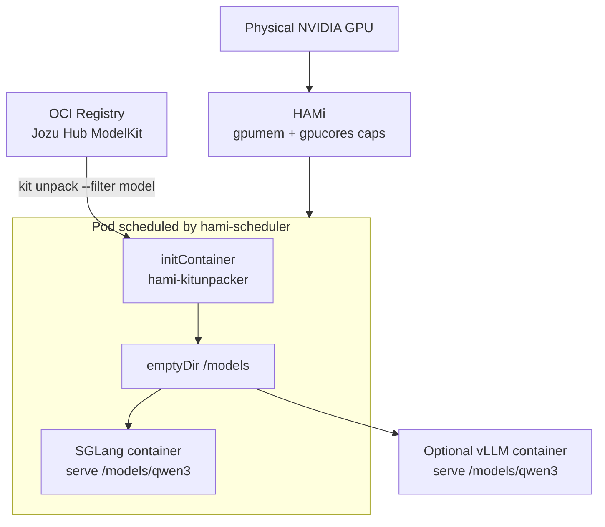

This lab demonstrates how to replace a runtime **Hugging Face** model download with a **[KitOps](https://kitops.org/) ModelKit** pulled from an OCI registry ([Jozu Hub](https://jozu.ml) in the examples). The model is delivered into the Pod by a KitOps `initContainer`, then served from a **local directory** by [SGLang](https://github.com/sgl-project/sglang) (primary) or vLLM (optional co-resident example) on HAMi-virtualized GPU shares.

Compared with [Lab 6 (vLLM)](./hami-vllm) and Lab 11 (SGLang), the inference engines still run on HAMi resources — but the **model supply chain** changes from `engine serve <hf-repo>` to **unpack ModelKit → serve local path**.

## Learning Objectives

- Inspect a public KitOps ModelKit on an OCI registry
- Build a small `kitunpacker` init image and a custom SGLang serve image
- Deploy a Pod that pulls/unpacks a ModelKit via `initContainer` (no HF download in the main container)
- Schedule the workload with HAMi `nvidia.com/gpu` / `gpumem` / `gpucores`
- Prove inference works against the OpenAI-compatible SGLang API
- Optionally co-locate a vLLM Pod serving the same ModelKit on the same physical GPU

## Lab Overview

```mermaid
%% title: HAMi + KitOps ModelKit Lab Flowchart
flowchart LR
    Step1["Step 1<br/>Prereqs + HAMi"] --> Step2["Step 2<br/>Inspect ModelKit"]
    Step2 --> Step3["Step 3<br/>Build Images"]
    Step3 --> Step4["Step 4<br/>Deploy SGLang+ModelKit"]
    Step4 --> Step5["Step 5<br/>Watch Unpack"]
    Step5 --> Step6["Step 6<br/>Test Inference"]
    Step6 --> Step7["Step 7<br/>Verify HAMi Caps"]
    Step7 --> Step8["Step 8<br/>Optional vLLM"]
    Step8 --> Step9["Step 9<br/>Cleanup"]
```



## Deployment Architecture



## Prerequisites

- Everything from Lab 11 (or Lab 6): a Kubernetes cluster with NVIDIA GPUs, HAMi installed and healthy, `kubectl`, `helm`
- Docker (or an equivalent builder) to build and load images into the cluster
- [`kit`](https://github.com/jozu-ai/kitops) CLI on your workstation (optional but recommended for `kit inspect`)
- Ability to pull from the public registry `jozu.ml` (no login required for the sample ModelKit)

This lab assumes HAMi is already installed as in Lab 11. If not, complete Lab 11 Steps 1–3 first.

## Example Cluster State

Verification used the same kind + H100 cluster as Lab 11, with HAMi advertising 10 vGPUs and both `hami-scheduler` / `hami-device-plugin` Running.

Public ModelKit used throughout:

```plaintext
jozu.ml/jonathangamer202002/qwen3-4b-instruct:latest
```

## Step 1: Confirm HAMi Is Ready

```bash
kubectl get pods -n kube-system -l app.kubernetes.io/instance=hami -o wide
kubectl get nodes -o 'custom-columns=NAME:.metadata.name,GPU:.status.allocatable.nvidia\.com/gpu'
```

Expected: device plugin and scheduler Running; GPU nodes show allocatable `nvidia.com/gpu` (for example `10`).

Scale down any large competing GPU workloads so the ModelKit + 4B model can fit:

```bash
kubectl -n sglang scale deploy/sglang-qwen3-17b --replicas=0 2>/dev/null || true
```

## Step 2: Inspect the ModelKit

On a machine with the `kit` CLI:

```bash
kit inspect --remote jozu.ml/jonathangamer202002/qwen3-4b-instruct:latest
```

Example (truncated) output from the verification environment:

```json
{
  "digest": "sha256:df4629f6a10bba7bec45e12bd15f910ed1024699bfbb44b63240899f71bb1c19",
  "kitfile": {
    "package": { "name": "Qwen3-4B-Instruct-2507", "version": "1.0" },
    "model": {
      "name": "qwen3-4b-instruct",
      "path": "qwen3-4b-instruct/model",
      "license": "Apache 2.0"
    }
  },
  "manifest": {
    "artifactType": "application/vnd.kitops.modelkit.manifest.v1+json"
  }
}
```

The ModelKit carries safetensors weights plus tokenizer/config as OCI layers. The initContainer will unpack and flatten them into a Hugging Face-style directory that SGLang/vLLM can load locally.

## Step 3: Build the Pipeline Images

Create a working directory and the files below.

### 3.1 `kitunpacker` init image

`kitunpacker/Dockerfile`:

```dockerfile
FROM alpine:3.20

RUN apk add --no-cache bash coreutils findutils ca-certificates curl tar \
    && curl -fsSL "https://github.com/jozu-ai/kitops/releases/latest/download/kitops-linux-x86_64.tar.gz" -o /tmp/kit.tgz \
    && tar -xzf /tmp/kit.tgz -C /usr/local/bin kit \
    && rm -f /tmp/kit.tgz \
    && kit version

ENV MODELKIT_REF="jozu.ml/jonathangamer202002/qwen3-4b-instruct:latest" \
    UNPACK_PATH="/models" \
    MODEL_SUBDIR="qwen3"

COPY unpack.sh /usr/local/bin/unpack.sh
RUN chmod +x /usr/local/bin/unpack.sh

ENTRYPOINT ["/usr/local/bin/unpack.sh"]
```

`kitunpacker/unpack.sh`:

```sh
#!/usr/bin/env sh
# kitunpacker: pull a ModelKit from an OCI registry (Jozu Hub by default) and
# unpack the model into a Hugging Face-style directory that vLLM / SGLang can
# load directly -- no Hugging Face download at runtime.
#
# Env (all overridable from the Pod spec):
#   MODELKIT_REF   full ModelKit reference, e.g. jozu.ml/<org>/<repo>:<tag>
#   UNPACK_PATH    root volume to unpack into                 (default /models)
#   MODEL_SUBDIR   final model dir under UNPACK_PATH          (default qwen3)
#   REGISTRY_URL/USERNAME/PASSWORD  optional creds for PRIVATE registries
set -eu

MODELKIT_REF="${MODELKIT_REF:?MODELKIT_REF is required}"
UNPACK_PATH="${UNPACK_PATH:-/models}"
MODEL_SUBDIR="${MODEL_SUBDIR:-qwen3}"
DEST="${UNPACK_PATH}/${MODEL_SUBDIR}"
RAW="${UNPACK_PATH}/.raw-${MODEL_SUBDIR}"
LOCK="${UNPACK_PATH}/.lock-${MODEL_SUBDIR}"

# keep the kit pull cache on the (large) mounted volume, not the tiny rootfs
export KITOPS_HOME="${UNPACK_PATH}/.kitcache"

ready() { [ -f "${DEST}/config.json" ] && ls "${DEST}"/*.safetensors >/dev/null 2>&1; }

echo "[kitunpacker] ref=${MODELKIT_REF} -> ${DEST}"

if ready; then
  echo "[kitunpacker] model already present, skipping unpack"
  exit 0
fi

# simple cross-pod lock (mkdir is atomic) so two engines sharing one cache
# don't race to write the same files.
if ! mkdir "${LOCK}" 2>/dev/null; then
  echo "[kitunpacker] another unpack in progress, waiting for it to finish..."
  i=0
  while [ "${i}" -lt 360 ]; do
    ready && { echo "[kitunpacker] model became ready"; exit 0; }
    i=$((i + 1)); sleep 5
  done
  echo "[kitunpacker] timed out waiting for peer unpack" >&2
  exit 1
fi
# shellcheck disable=SC2064
trap "rmdir '${LOCK}' 2>/dev/null || true" EXIT INT TERM

# optional login for private registries (public Jozu Hub needs none)
if [ -n "${REGISTRY_URL:-}" ] && [ -n "${USERNAME:-}" ] && [ -n "${PASSWORD:-}" ]; then
  echo "[kitunpacker] logging in to ${REGISTRY_URL} as ${USERNAME}"
  echo "${PASSWORD}" | kit login "${REGISTRY_URL}" -u "${USERNAME}" --password-stdin
fi

rm -rf "${RAW}"; mkdir -p "${RAW}"
echo "[kitunpacker] pulling + unpacking model layers from registry..."
kit unpack --filter model "${MODELKIT_REF}" -d "${RAW}"

# Flatten: ModelKits may store the .safetensors shards in a model/ subdir while
# config.json / *.index.json / tokenizer sit one level up. vLLM/transformers
# need them all in one directory, so collect everything into DEST.
SRC_CFG="$(find "${RAW}" -name config.json | head -1)"
[ -n "${SRC_CFG}" ] || { echo "[kitunpacker] config.json not found after unpack" >&2; exit 1; }
SRC="$(dirname "${SRC_CFG}")"

mkdir -p "${DEST}"
# all weight shards, wherever they live under the unpacked tree
find "${SRC}" -name '*.safetensors' -exec mv -f {} "${DEST}/" \;
# all top-level metadata files (config, index, tokenizer, vocab, generation cfg)
find "${SRC}" -maxdepth 1 -type f -exec mv -f {} "${DEST}/" \;

rm -rf "${RAW}" "${KITOPS_HOME}"

echo "[kitunpacker] final model directory:"
ls -la "${DEST}"
ready || { echo "[kitunpacker] validation failed: missing config or shards" >&2; exit 1; }
echo "[kitunpacker] done."

```

Build:

```bash
docker build -t hami-kitunpacker:latest ./kitunpacker
```

### 3.2 Custom SGLang image (local model path, no HF repo)

`sglang/Dockerfile`:

```dockerfile
FROM lmsysorg/sglang:latest

ENV MODEL_DIR="/models/qwen3" \
    SERVED_NAME="qwen3-4b-instruct" \
    CONTEXT_LEN="8192" \
    MEM_FRACTION="0.8" \
    PORT="30000" \
    ATTENTION_BACKEND="triton"

COPY serve.sh /usr/local/bin/serve.sh
RUN chmod +x /usr/local/bin/serve.sh

ENTRYPOINT ["/usr/local/bin/serve.sh"]
```

`sglang/serve.sh`:

```bash
#!/usr/bin/env bash
# Custom SGLang entrypoint: serve a model unpacked from a KitOps ModelKit that
# the kitunpacker initContainer placed on a shared volume. Serves from a LOCAL
# directory (--model-path) so there is no Hugging Face download at runtime.
set -euo pipefail

MODEL_DIR="${MODEL_DIR:-/models/qwen3}"
SERVED_NAME="${SERVED_NAME:-qwen3-4b-instruct}"
CONTEXT_LEN="${CONTEXT_LEN:-8192}"
MEM_FRACTION="${MEM_FRACTION:-0.8}"
PORT="${PORT:-30000}"
ATTENTION_BACKEND="${ATTENTION_BACKEND:-triton}"

echo "[sglang-jozu] serving KitOps model from ${MODEL_DIR} (source: Jozu Hub, no HF download)"
if [ ! -f "${MODEL_DIR}/config.json" ]; then
  echo "[sglang-jozu] ERROR: ${MODEL_DIR}/config.json not found -- did the kitunpacker init run?" >&2
  exit 1
fi

exec python3 -m sglang.launch_server \
  --model-path "${MODEL_DIR}" \
  --served-model-name "${SERVED_NAME}" \
  --host 0.0.0.0 \
  --port "${PORT}" \
  --mem-fraction-static "${MEM_FRACTION}" \
  --context-length "${CONTEXT_LEN}" \
  --attention-backend "${ATTENTION_BACKEND}"

```

Build:

```bash
docker build -t hami-sglang-jozu:latest ./sglang
```

### 3.3 Load images into the cluster

For kind:

```bash
kind load docker-image hami-kitunpacker:latest --name <your-cluster>
kind load docker-image hami-sglang-jozu:latest --name <your-cluster>
```

For other clusters, push the images to a registry your nodes can pull and update the Deployment image fields accordingly.

### 3.4 Optional: custom vLLM image (for Step 8)

`vllm/Dockerfile`:

```dockerfile
FROM vllm/vllm-openai:latest

ENV MODEL_DIR="/models/qwen3" \
    SERVED_NAME="qwen3-4b-instruct" \
    MAX_MODEL_LEN="8192" \
    GPU_MEM_UTIL="0.85" \
    PORT="8000"

COPY serve.sh /usr/local/bin/serve.sh
RUN chmod +x /usr/local/bin/serve.sh

ENTRYPOINT ["/usr/local/bin/serve.sh"]
```

`vllm/serve.sh`:

```bash
#!/usr/bin/env bash
# Custom vLLM entrypoint: serve a model unpacked from a KitOps ModelKit that the
# kitunpacker initContainer placed on a shared volume. This deliberately serves
# from a LOCAL directory instead of the default `vllm serve <hf-repo>` so there
# is no Hugging Face download at runtime.
set -euo pipefail

MODEL_DIR="${MODEL_DIR:-/models/qwen3}"
SERVED_NAME="${SERVED_NAME:-qwen3-4b-instruct}"
MAX_MODEL_LEN="${MAX_MODEL_LEN:-8192}"
GPU_MEM_UTIL="${GPU_MEM_UTIL:-0.85}"
PORT="${PORT:-8000}"

echo "[vllm-jozu] serving KitOps model from ${MODEL_DIR} (source: Jozu Hub, no HF download)"
if [ ! -f "${MODEL_DIR}/config.json" ]; then
  echo "[vllm-jozu] ERROR: ${MODEL_DIR}/config.json not found -- did the kitunpacker init run?" >&2
  exit 1
fi

exec vllm serve "${MODEL_DIR}" \
  --served-model-name "${SERVED_NAME}" \
  --max-model-len "${MAX_MODEL_LEN}" \
  --gpu-memory-utilization "${GPU_MEM_UTIL}" \
  --host 0.0.0.0 \
  --port "${PORT}"

```

```bash
docker build -t hami-vllm-jozu:latest ./vllm
# kind load docker-image hami-vllm-jozu:latest --name <your-cluster>
```

## Step 4: Deploy SGLang Serving the ModelKit

The Deployment uses:

1. `initContainer: kitops-init` — pulls and flattens the ModelKit into `/models/qwen3`
2. main container `hami-sglang-jozu` — serves that local directory
3. HAMi scheduler + `gpumem` / `gpucores` caps
4. `emptyDir` for the model volume (portable; use a PVC in production)

```bash
kubectl apply -f - <<'EOF'
apiVersion: v1
kind: Namespace
metadata:
  name: kitops
---
apiVersion: apps/v1
kind: Deployment
metadata:
  name: sglang-modelkit
  namespace: kitops
  labels:
    app.kubernetes.io/name: sglang-modelkit
spec:
  replicas: 1
  selector:
    matchLabels:
      app.kubernetes.io/name: sglang-modelkit
  template:
    metadata:
      labels:
        app.kubernetes.io/name: sglang-modelkit
      annotations:
        hami.io/node-scheduler-policy: binpack
        hami.io/gpu-scheduler-policy: binpack
    spec:
      schedulerName: hami-scheduler
      initContainers:
        - name: kitops-init
          image: hami-kitunpacker:latest
          imagePullPolicy: IfNotPresent
          env:
            - name: MODELKIT_REF
              value: "jozu.ml/jonathangamer202002/qwen3-4b-instruct:latest"
            - name: UNPACK_PATH
              value: "/models"
            - name: MODEL_SUBDIR
              value: "qwen3"
          volumeMounts:
            - name: modelkit
              mountPath: /models
      containers:
        - name: sglang
          image: hami-sglang-jozu:latest
          imagePullPolicy: IfNotPresent
          env:
            - name: MODEL_DIR
              value: "/models/qwen3"
            - name: SERVED_NAME
              value: "qwen3-4b-instruct"
            - name: CONTEXT_LEN
              value: "8192"
            - name: MEM_FRACTION
              value: "0.8"
          ports:
            - name: http
              containerPort: 30000
          resources:
            requests:
              cpu: "2"
              memory: 8Gi
              nvidia.com/gpu: "1"
              nvidia.com/gpumem: "30000"
              nvidia.com/gpucores: "30"
            limits:
              cpu: "8"
              memory: 32Gi
              nvidia.com/gpu: "1"
              nvidia.com/gpumem: "30000"
              nvidia.com/gpucores: "30"
          readinessProbe:
            httpGet:
              path: /health
              port: 30000
            initialDelaySeconds: 40
            periodSeconds: 10
            timeoutSeconds: 5
            failureThreshold: 90
          volumeMounts:
            - name: modelkit
              mountPath: /models
            - name: dshm
              mountPath: /dev/shm
      volumes:
        - name: modelkit
          emptyDir:
            sizeLimit: 20Gi
        - name: dshm
          emptyDir:
            medium: Memory
            sizeLimit: 8Gi
---
apiVersion: v1
kind: Service
metadata:
  name: sglang-modelkit
  namespace: kitops
spec:
  type: ClusterIP
  selector:
    app.kubernetes.io/name: sglang-modelkit
  ports:
    - name: http
      port: 8001
      targetPort: http
EOF
```

For a **private** registry, add `REGISTRY_URL`, `USERNAME`, and `PASSWORD` env vars to `kitops-init` (from a Secret). `unpack.sh` will run `kit login` before pulling.

## Step 5: Watch the ModelKit Unpack

```bash
kubectl -n kitops get pods -w
kubectl -n kitops logs -l app.kubernetes.io/name=sglang-modelkit -c kitops-init -f
```

Successful unpack looks like:

```plaintext
[kitunpacker] ref=jozu.ml/jonathangamer202002/qwen3-4b-instruct:latest -> /models/qwen3
[kitunpacker] pulling + unpacking model layers from registry...
Unpacking to /models/.raw-qwen3
...
[kitunpacker] final model directory:
... config.json ... model-00001-of-00003.safetensors ... tokenizer.json ...
[kitunpacker] done.
```

Then wait for the SGLang container:

```bash
kubectl -n kitops rollout status deploy/sglang-modelkit --timeout=30m
kubectl -n kitops logs -l app.kubernetes.io/name=sglang-modelkit -c sglang --tail=50
```

You should see the custom entrypoint message proving a **local** ModelKit path (not an HF repo id):

```plaintext
[sglang-jozu] serving KitOps model from /models/qwen3 (source: Jozu Hub, no HF download)
... model_path='/models/qwen3' ... served_model_name='qwen3-4b-instruct' ...
```

## Step 6: Test Inference

```bash
kubectl -n kitops port-forward svc/sglang-modelkit 8001:8001
```

In another terminal:

```bash
curl -s http://127.0.0.1:8001/v1/models | python3 -m json.tool
```

Example:

```json
{
  "object": "list",
  "data": [
    {
      "id": "qwen3-4b-instruct",
      "object": "model",
      "owned_by": "sglang",
      "max_model_len": 8192
    }
  ]
}
```

Chat completion:

```bash
curl -s http://127.0.0.1:8001/v1/chat/completions \
  -H "Content-Type: application/json" \
  -d '{
    "model": "qwen3-4b-instruct",
    "messages": [
      {"role": "user", "content": "In one sentence, what is a KitOps ModelKit?"}
    ],
    "max_tokens": 96,
    "temperature": 0.2
  }' | python3 -m json.tool
```

If `choices[0].message.content` is present, ModelKit → local SGLang inference is working.

## Step 7: Verify HAMi Caps

```bash
POD=$(kubectl get pod -n kitops -l app.kubernetes.io/name=sglang-modelkit -o jsonpath='{.items[0].metadata.name}')
kubectl get pod -n kitops ${POD} \
  -o jsonpath='{.spec.schedulerName}{"\n"}{.spec.containers[0].resources.limits}{"\n"}'
kubectl exec -n kitops ${POD} -c sglang -- env | grep -E 'CUDA_DEVICE|NVIDIA_VISIBLE'
kubectl exec -n kitops ${POD} -c sglang -- nvidia-smi
```

Verification cluster evidence:

```plaintext
hami-scheduler
... nvidia.com/gpumem:30000 nvidia.com/gpucores:30 ...

NVIDIA_VISIBLE_DEVICES=GPU-...
CUDA_DEVICE_MEMORY_LIMIT_0=30000m
CUDA_DEVICE_SM_LIMIT=30

| NVIDIA H100 80GB HBM3 ... | 24745MiB / 30000MiB |
```

The main container loaded weights from `/models/qwen3` (OCI ModelKit), while HAMi still enforced a **30000 MiB** in-pod memory ceiling on the shared H100.

## Step 8 (Optional): Co-locate vLLM on the Same ModelKit Pattern

After building/loading `hami-vllm-jozu:latest`, deploy a second engine with its own HAMi slice. Use a **PVC** (or node-local cache) if you want both Pods to reuse one unpacked ModelKit; with `emptyDir` each Pod unpacks independently.

```bash
kubectl apply -f - <<'EOF'
apiVersion: apps/v1
kind: Deployment
metadata:
  name: vllm-modelkit
  namespace: kitops
  labels:
    app.kubernetes.io/name: vllm-modelkit
spec:
  replicas: 1
  selector:
    matchLabels:
      app.kubernetes.io/name: vllm-modelkit
  template:
    metadata:
      labels:
        app.kubernetes.io/name: vllm-modelkit
      annotations:
        hami.io/node-scheduler-policy: binpack
        hami.io/gpu-scheduler-policy: binpack
    spec:
      schedulerName: hami-scheduler
      initContainers:
        - name: kitops-init
          image: hami-kitunpacker:latest
          imagePullPolicy: IfNotPresent
          env:
            - name: MODELKIT_REF
              value: "jozu.ml/jonathangamer202002/qwen3-4b-instruct:latest"
            - name: UNPACK_PATH
              value: "/models"
            - name: MODEL_SUBDIR
              value: "qwen3"
          volumeMounts:
            - name: modelkit
              mountPath: /models
      containers:
        - name: vllm
          image: hami-vllm-jozu:latest
          imagePullPolicy: IfNotPresent
          env:
            - name: MODEL_DIR
              value: "/models/qwen3"
            - name: SERVED_NAME
              value: "qwen3-4b-instruct"
          ports:
            - name: http
              containerPort: 8000
          resources:
            limits:
              cpu: "8"
              memory: 32Gi
              nvidia.com/gpu: "1"
              nvidia.com/gpumem: "30000"
              nvidia.com/gpucores: "30"
          readinessProbe:
            httpGet:
              path: /health
              port: 8000
            initialDelaySeconds: 40
            periodSeconds: 10
            failureThreshold: 90
          volumeMounts:
            - name: modelkit
              mountPath: /models
            - name: dshm
              mountPath: /dev/shm
      volumes:
        - name: modelkit
          emptyDir:
            sizeLimit: 20Gi
        - name: dshm
          emptyDir:
            medium: Memory
            sizeLimit: 8Gi
---
apiVersion: v1
kind: Service
metadata:
  name: vllm-modelkit
  namespace: kitops
spec:
  selector:
    app.kubernetes.io/name: vllm-modelkit
  ports:
    - name: http
      port: 8000
      targetPort: http
EOF
```

Test with:

```bash
kubectl -n kitops port-forward svc/vllm-modelkit 8000:8000
curl -s http://127.0.0.1:8000/v1/models
```

Ensure combined `gpumem` requests fit on the physical GPU (for example two × 30000 MiB needs ≥ 60 GiB free on that card).

## Reference: Kitfile (repack your own ModelKit)

```yaml
# Reference Kitfile for the Qwen3-4B-Instruct ModelKit used in this demo.
#
# The demo PULLS a pre-built public ModelKit from Jozu Hub:
#     jozu.ml/jonathangamer202002/qwen3-4b-instruct:latest
#
# This Kitfile is provided so you can (re)pack and push your OWN ModelKit to a
# registry (Jozu Hub, ACR, GHCR, ...) from a local HF-format model directory:
#
#     # 1) get a model directory (e.g. via `kit unpack` or `kit import`)
#     # 2) place this Kitfile next to a ./qwen3 directory of safetensors + config
#     kit pack . -t jozu.ml/<your-org>/qwen3-4b-instruct:latest
#     kit login jozu.ml -u <user> --password-stdin   # needed only for push
#     kit push jozu.ml/<your-org>/qwen3-4b-instruct:latest
manifestVersion: "1.0"
package:
  name: qwen3-4b-instruct
  version: "1.0"
  authors:
    - HAMi KubeCon Demo
  description: >
    Qwen3-4B-Instruct-2507 packaged as a KitOps ModelKit (HF safetensors layout),
    served on HAMi-virtualized GPUs by vLLM and SGLang.
model:
  name: qwen3-4b-instruct
  path: ./qwen3
  license: Apache-2.0
  description: Qwen3 4B instruct, safetensors (Qwen3ForCausalLM)
docs:
  - path: ./README.md
    description: Pipeline documentation

```

```bash
# After placing a HF-layout model directory at ./qwen3 next to the Kitfile:
kit pack . -t jozu.ml/<your-org>/qwen3-4b-instruct:latest
kit push jozu.ml/<your-org>/qwen3-4b-instruct:latest
```

Then point `MODELKIT_REF` in the Deployment at your tag.

## Troubleshooting

| Symptom | What to Check |
| --- | --- |
| initContainer stuck pulling | Registry reachability from the node; disk pressure on `emptyDir`; increase `sizeLimit`. |
| `config.json not found after unpack` | ModelKit layout differs; inspect with `kit inspect --remote` and adjust flatten logic / `MODEL_SUBDIR`. |
| SGLang exits: model dir missing | initContainer failed; `kubectl logs ... -c kitops-init`. |
| ImagePullBackOff for custom images | `kind load` / push to your registry; set `imagePullPolicy: IfNotPresent` for local tags. |
| Pod Pending on GPU | Free HAMi shares; lower `gpumem`; confirm `hami-scheduler` events. |
| Private registry 401 | Set `REGISTRY_URL` / `USERNAME` / `PASSWORD` on `kitops-init`. |
| In-pod memory still full GPU size | Same as Lab 11 — verify HAMi env vars and `schedulerName`. |

## Cleanup

```bash
kubectl delete namespace kitops --ignore-not-found
# optional: remove local images
# docker rmi hami-kitunpacker:latest hami-sglang-jozu:latest hami-vllm-jozu:latest
```

## Verification Results

| Claim | Evidence |
| --- | --- |
| Model is an OCI ModelKit | `kit inspect --remote` returns KitOps manifest / model layers. |
| Model delivered without HF in the main container | initContainer logs show `kit unpack`; SGLang logs show `serving KitOps model from /models/qwen3` and `model_path='/models/qwen3'`. |
| HAMi schedules the workload | `schedulerName: hami-scheduler` + Filtering/Binding events. |
| GPU memory/compute caps apply | `CUDA_DEVICE_MEMORY_LIMIT_0=30000m`, `CUDA_DEVICE_SM_LIMIT=30`; in-pod `nvidia-smi` shows `... / 30000MiB`. |
| Inference works | `/v1/models` lists `qwen3-4b-instruct`; chat completions return content. |

## Next Steps

- Swap the public Jozu ModelKit for your internal registry ModelKit and wire imagePullSecrets / `kit login` Secrets.
- Share one PVC across SGLang and vLLM so the ModelKit is unpacked once.
- Combine with [Lab 3: GPU Partitioning](./gpu-partitioning) to pack more tenants per GPU.
- Return to Lab 11: SGLang if you need the simpler Hugging Face runtime path for debugging engines independently of the supply chain.
