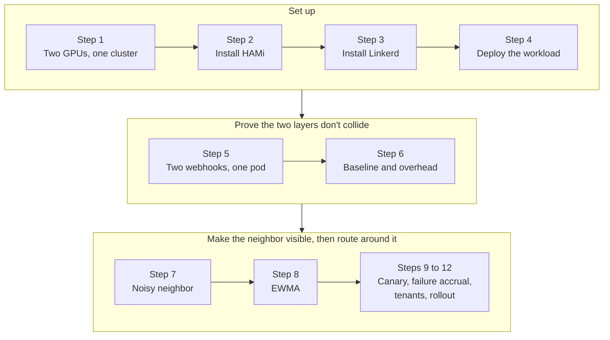
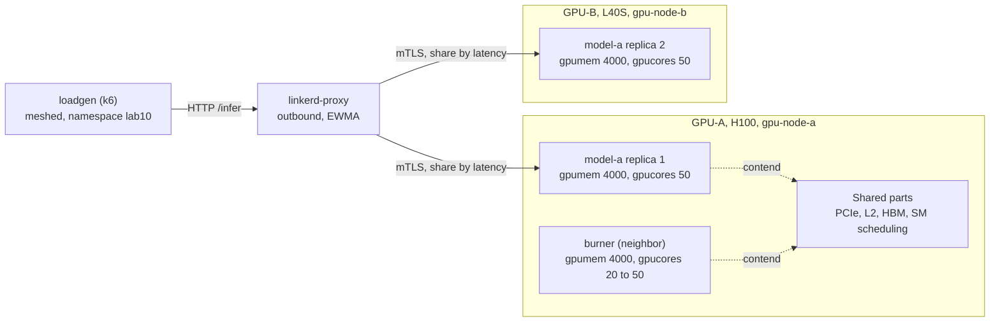
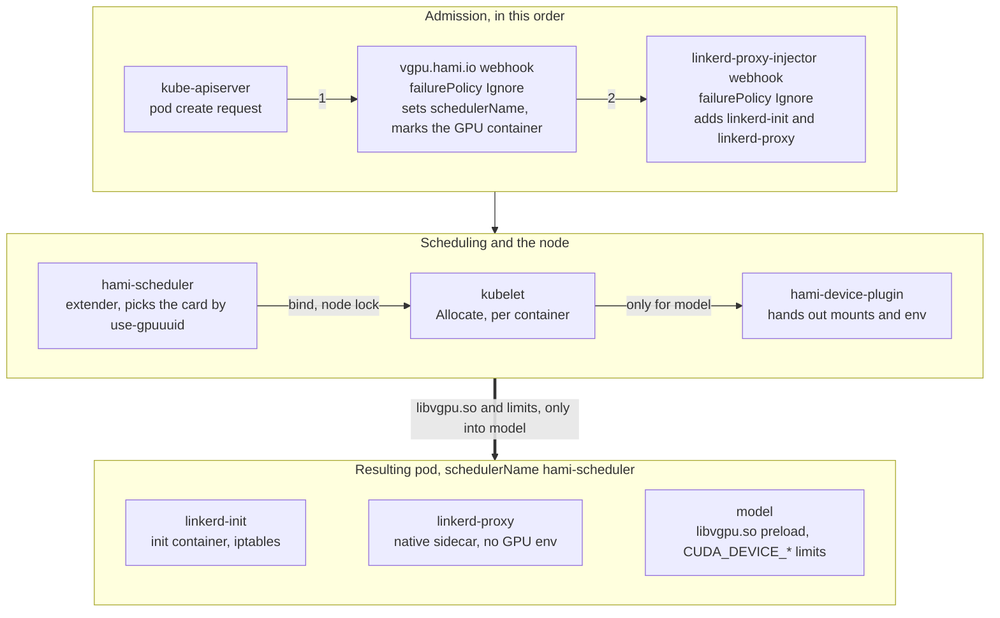

The first people who see the title of this lab will probably smile first. Maybe for a fair reason. HAMi and Linkerd are two different systems working on different layers. HAMi slices the GPU, whereas Linkerd routes HTTP requests. And what could certificates possibly have to do with this? There isn't a single line of shared code between them. To understand how this idea actually works in practice, I built a cluster with two GPUs on Nebius Cloud and spent a day measuring. This lab is a step-by-step replay of that Sunday.

Let me say at the start what I'd say at the end. Yes, they work on different layers, and that's exactly the point anyway. HAMi splits the silicon, yes it does, but it can't hide the latency a neighbor causes inside a slice. Hiding it isn't its job either. Linkerd, on the other hand, never sees the GPU, but it sees the latency of every request and spreads traffic accordingly. The answer to the certificate question I mentioned a moment ago comes out of the same place. What stops two tenants sharing the same card from reaching each other's endpoints is the mTLS identity Linkerd gives every pod. How? You'll certainly find the answer below.

Every command and output in this lab was captured from a live run on 2026-09-26/27, two Nebius VMs in one K3s cluster, an H100 80GB on the server node and an L40S 48GB on an agent node, HAMi 2.10.0 from the official chart, Linkerd edge-26.9.3, Gateway API CRDs v1.5.1.

## What You'll Learn

- What HAMi's memory and core limits fence, and what stays shared on the card (PCIe, L2, HBM, SM scheduling)
- How HAMi's and Linkerd's mutating webhooks change the same pod, and proving that HAMi-core lands only in the GPU container
- Measuring a noisy neighbor's effect on a co-located replica with a control group, and reading why `gpucores` doesn't make it go away
- Watching Linkerd's EWMA balancer keep the client's p99 flat while unmeshed callers pay 2 to 3 times more
- Canary on a small slice with HTTPRoute weights, failure accrual on a slice that fails per request, and tenant isolation with `Server` and `AuthorizationPolicy`
- Two things `CardInsufficientCore` blocks that nothing warns you about, a 100-core neighbor and a Deployment's surge pod

## Lab Overview



## Prerequisites

- Two nodes with one NVIDIA GPU each in one K3s cluster. The one decision you can't skip is having **at least 2 physical GPUs**. With a single card there's no quiet replica for the load balancer to move traffic to, and Step 8 has nothing to show.
- NVIDIA driver and container toolkit on both nodes, `nvidia-smi` working on each host, and the `gpu=on` node label in place.
- `kubectl`, `helm`, and `jq` on the machine you run the commands from. `linkerd` gets installed in Step 3.
- Manifests from [`tutorials/labs/examples/18-hami-linkerd-noisy-neighbor/`](https://github.com/Project-HAMi/website/tree/master/tutorials/labs/examples/18-hami-linkerd-noisy-neighbor). Every one of them is also inlined below, so nothing has to be cloned.

| Component        | Version                                          |
| ---------------- | ------------------------------------------------ |
| Kubernetes       | v1.36.3+k3s1                                     |
| HAMi chart       | 2.10.0, image `projecthami/hami:v2.10.0`         |
| Linkerd          | edge-26.9.3, CLI, control plane, and Viz         |
| Gateway API CRDs | v1.5.1                                           |
| Workload image   | `pytorch/pytorch:2.14.0-cuda12.6-cudnn9-runtime` |
| Load generator   | `grafana/k6:2.3.0`                               |
| Tenant client    | `curlimages/curl:8.22.0`                         |

Read this table once before you change anything in your own environment. What breaks a lab a few months later is almost always version drift.

:::note[What HAMi isolates and what it doesn't]

An H100 costs the same whether one service uses 4 GB of its 80 GB or ten services use 4 GB each. [HAMi](https://github.com/Project-HAMi/HAMi) lets you run the ten. A pod asks for `nvidia.com/gpu: 1`, `nvidia.com/gpumem: 4000`, and `nvidia.com/gpucores: 50`. HAMi's scheduler extender picks a card with that much room. On the node, the device plugin injects [libvgpu.so](https://github.com/Project-HAMi/HAMi-core) into the container through `/etc/ld.so.preload`. That library enforces the memory limit and throttles kernel launches to the core share.

Some parts stay shared, the PCIe link, the L2 cache, HBM bandwidth, and the scheduling of kernels on the SMs inside the throttle window. A compute-bound neighbor in another slice pushes the latency of the affected workload's kernels up without touching your limits. That's the lab's question. If sharing hurts one service's latency, how do you see it, and how do you manage it?

:::

When you're done you'll have these 12 proofs in hand.

| # | Claim | What came out on this cluster |
| --- | --- | --- |
| 1 | Both webhooks applied to the same pod | `schedulerName: hami-scheduler`, native sidecar `linkerd-proxy`, both annotation sets on one pod |
| 2 | HAMi-core only in the GPU container | `libvgpu.so` preload and `CUDA_DEVICE_*` limits in `model`, none in `linkerd-proxy` |
| 3 | Isolation holds with the sidecar present | 2000 MiB allocates, 6000 MiB fails with `OutOfMemoryError`, total capacity reads 3.91 GiB |
| 4 | Traffic is proxied and mTLS'd | `linkerd viz edges` SECURED, `tap` shows `tls=true` |
| 5 | Replicas on different physical cards | H100 and L40S UUIDs match `nvidia-smi -L` |
| 6 | The neighbor effect is causal | replica 1 p50 1 ms to 5 ms, p99 8 to 20 ms, back at baseline when the neighbor is on the other card |
| 7 | EWMA shifts traffic | with the neighbor on, meshed client p99 16 ms, unmeshed 25 to 48 ms |
| 8 | Mesh overhead is negligible | single replica, p50 9.43 vs 9.37 ms, p99 11.84 vs 11.85 ms |
| 9 | Canary weights apply | 90/10 requested, 90.1/9.9 measured, 50/50 requested, 49.7/50.3 measured |
| 10 | Failure accrual ejects the broken slice | requests reaching the bad pod 1,251 to 10, success 97.09% to 99.98% |
| 11 | Tenant isolation holds on the network | tenant-a 403, tenant-b 200, both edges SECURED |
| 12 | Lifecycle is clean, with one trap | rollout in 26 s, slice released and reissued identically, surge pod pends with `CardInsufficientCore` when a neighbor is on the card |

## Step 1. Design the Environment



In the picture the two layers never touch. HAMi draws its own memory limit and core share around each slice, and the lower half of the card isn't sliced. Linkerd's proxy, on the other hand, never sees the card. The only thing it sees is the request latency of the two replicas. Every measurement in this lab is read on top of this picture.

| Role | Node | GPU | UUID |
| --- | --- | --- | --- |
| GPU-A, model-a replica 1 and the noisy neighbor | `gpu-node-a` | NVIDIA H100 80GB HBM3 | `GPU-7023a4c2-4128-840d-2b86-ab87d8bf7f47` |
| GPU-B, model-a replica 2, quiet | `gpu-node-b` | NVIDIA L40S 48GB | `GPU-4dc50575-f241-9f14-1e6e-ecb4a93c3299` |

In my environment the two cards aren't the same model. If you have two identical cards you'll get cleaner numbers. If not, the control group in Step 7 makes the asymmetry harmless.

I also need to add a note on naming at this point. I call the nodes `gpu-node-a` and `gpu-node-b` in this lab. In my real cluster they had the long instance IDs the provider hands out, which made the text unreadable. You'll need to put your own node names everywhere they appear in a command or manifest: the `nodeName` override in the Step 1 network test, the `kubectl get node` check in Step 2, the `scheduler.nodeName` value in Step 2, the `nodeSelector` in the Linkerd and Viz install commands and in the `metrics-api` and `prometheus` patch in Step 3, and the `nodeSelector` in the loadgen manifests in Step 4. Read `gpu-node-a` and `gpu-node-b` in the outputs as your own names too.

Get your own UUIDs on each host.

```bash
nvidia-smi -L
```

```plaintext
GPU 0: NVIDIA H100 80GB HBM3 (UUID: GPU-7023a4c2-4128-840d-2b86-ab87d8bf7f47)
GPU 0: NVIDIA L40S (UUID: GPU-4dc50575-f241-9f14-1e6e-ecb4a93c3299)
```

Write those two values into every `nvidia.com/use-gpuuuid` annotation in the manifests below. The annotation name is defined as `GPUUseUUID` in `pkg/device/nvidia/device.go` of HAMi v2.10.0. Its sibling `nvidia.com/nouse-gpuuuid` excludes cards.

You'll see the pin working in the events. A pod's scheduling events show `CardUuidMismatch` for the other node, which means the extender dropped that card because of the UUID.

```plaintext
FilteringFailed   1 nodes CardUuidMismatch(gpu-node-b)
```

Don't skip the pin. The chart's default node policy is `binpack` and its GPU policy is `spread`. You can see this under `scheduler.defaultSchedulerPolicy` in the output of `helm show values hami-charts/hami --version 2.10.0`. Binpack tries to fill the node that's already full. If you leave the two replicas to the policy, it's possible for them to land on the same card, and then there's no quiet replica for Step 8 to shift to. That's why in this lab we don't trust the policy and pin each replica by name.

My second node, as in an earlier experiment, was a K3s agent running in a privileged container with `--network host`. That's a lab shortcut. A privileged container on the host network isn't an acceptable shape for a production node, install the agent directly on the host there. Two things bit me when the machine restarted. Its own K3s server had come back and taken `127.0.0.1:6444`, and the inotify limit had reset. Both fixed on the host.

```bash
sudo systemctl stop k3s
echo "fs.inotify.max_user_instances=8192" | sudo tee /etc/sysctl.d/99-k3s-agent.conf
sudo sysctl -p /etc/sysctl.d/99-k3s-agent.conf
sudo docker restart k3s-agent
```

Verify cross-node pod networking before you touch anything else. Can a pod on the second GPU node reach a pod on the control-plane node?

```bash
kubectl run nettest --image=busybox:1.36 --overrides='{"spec":{"nodeName":"gpu-node-b"}}' \
  -- wget -qO- http://<coredns-pod-ip>:8181/ready
```

```plaintext
OK
```

My cluster had a leftover GPU-less node from an earlier experiment sitting on a docker bridge. The first Linkerd install put `linkerd-identity` there and the proxy on the second GPU node couldn't get a certificate. I cordoned the node instead of deleting it. If you have one like it, cordon it before you get to Step 3.

## Step 2. Install HAMi

Environment ready, on to HAMi. But first a bit of housekeeping I had to do. If you use the GPU Operator, its own device plugin must be off. I'd skipped this at first and two plugins were registering the same card twice, and in that state you can't trust any of the numbers below. The label below on both GPU nodes is enough.

```bash
kubectl label node <gpu-node> nvidia.com/gpu.deploy.device-plugin=false --overwrite
```

Now the real install. If I'd installed the chart as is, this section would be two lines. On K3s it doesn't go that way, three values have to differ from the defaults (see also the [K3s installation guide](https://project-hami.io/docs/installation/k3s-installation)). I found all three by trial, which is to say by error, and they're here so you don't have to.

```bash
helm repo add hami-charts https://project-hami.github.io/HAMi/ && helm repo update
helm upgrade --install hami hami-charts/hami --version 2.10.0 -n kube-system \
  --set scheduler.nodeName=gpu-node-a \
  --set scheduler.kubeScheduler.image.registry=registry.k8s.io \
  --set scheduler.kubeScheduler.image.repository=kube-scheduler \
  --set scheduler.kubeScheduler.image.tag=v1.36.3 \
  --set devicePlugin.runtimeClassName=nvidia
```

This part is covered in its own tutorials and the site has an installation roadmap, but let me go through it in order anyway. `scheduler.nodeName` pins the extender to the control-plane node, because the API server can't reach a webhook on the agent node. We ran into that in Step 1. The kube-scheduler tag has to match your cluster version. The chart's default is an Aliyun mirror with an empty tag, and in that shape it doesn't know what version your cluster runs. The third is `devicePlugin.runtimeClassName=nvidia`, and that's the one that cost me an hour. K3s's containerd uses `runc` by default, and without a RuntimeClass the plugin can't find NVML and loops on this.

```plaintext
E0925 19:53:51.423171 factory.go:135] Incompatible strategy detected auto
E0925 19:53:51.428513 main.go:201] error starting plugins: ... invalid device discovery strategy
E0925 19:53:51.599960 main.go:128] Received error: failed to initialize NVML: ERROR_LIBRARY_NOT_FOUND
```

When I saw this I blamed the driver for a while, then looked at the kubelet, then considered reinstalling the toolkit. It turned out to be one line in the chart. The same value has a nice side effect. HAMi's webhook now adds `runtimeClassName: nvidia` to every GPU pod, which is exactly what workloads on K3s need anyway. Once the install finished I wanted to see with my own eyes that both cards registered in `hami-core` mode.

```bash
kubectl get node gpu-node-b -o jsonpath='{.metadata.annotations.hami\.io/node-nvidia-register}'
```

```plaintext
[{"id":"GPU-4dc50575-f241-9f14-1e6e-ecb4a93c3299","count":10,"devmem":46068,"devcore":100,"type":"NVIDIA L40S","mode":"hami-core","health":true}]
```

```bash
kubectl get nodes -o custom-columns='NODE:.metadata.name,GPU:.status.allocatable.nvidia\.com/gpu'
```

You should see 10 on both GPU nodes. There's something confusing here at first glance. That 10 isn't cards, or more precisely, it's 10 slots. The `deviceSplitCount: 10` default means each physical card can be shared by up to 10 pods. A pod asking for `nvidia.com/gpu: 1` takes one slot, and `gpumem` and `gpucores` decide how much of the card it gets. You'll see in Step 7 that a card can fill up before the slots do. I experienced it again there myself.

## Step 3. Install Gateway API and Linkerd

HAMi is up, now the mesh. Linkerd has a prerequisite before you install it. The Gateway API CRDs must already be there, and it's fairly strict about the version. I checked the [compatibility table](https://linkerd.io/2-edge/features/gateway-api/). It tops out at 1.5.1 for Linkerd 2.20. The edge release I used is newer than 2.20 but the table hasn't moved yet, so I stayed on the safe side and picked 1.5.1.

```bash
kubectl apply -f https://github.com/kubernetes-sigs/gateway-api/releases/download/v1.5.1/standard-install.yaml
```

With the CRDs in place, Linkerd itself. I pin the control plane to the control-plane node for the same reason as in Step 1. I hadn't done that on the first attempt. The identity service landed on that old unreachable node, the proxies couldn't get certificates, and the injector never came up. That took half an hour.

Downloading and reading an install script before piping it into `sh` is a good habit, and I did. The line below is exactly what Linkerd's own docs show, I'm leaving it as is.

```bash
curl --proto '=https' --tlsv1.2 -sSfL https://run.linkerd.io/install-edge | sh
export PATH=$HOME/.linkerd2/bin:$PATH
linkerd check --pre
linkerd install --crds | kubectl apply -f -
linkerd install --set "nodeSelector.kubernetes\.io/hostname=gpu-node-a" | kubectl apply -f -
linkerd check
linkerd viz install --set "nodeSelector.kubernetes\.io/hostname=gpu-node-a" | kubectl apply -f -
```

Something I didn't expect came up here. The Viz chart applies that `nodeSelector` value to `web`, `tap`, and `tap-injector`, but not to `metrics-api` and `prometheus`. I didn't have time to find out why. I patched those two by hand and moved on. You'll see the same thing.

```bash
for d in metrics-api prometheus; do
  kubectl patch deploy -n linkerd-viz $d -p '{"spec":{"template":{"spec":{"nodeSelector":{"kubernetes.io/hostname":"gpu-node-a"}}}}}'
done
```

Before going on I want to see that both sides are really up, because everything from here builds on these two.

```bash
linkerd check
```

```plaintext
Status check results are √
```

```bash
kubectl get pods -n kube-system -l app.kubernetes.io/name=hami -o wide
```

```plaintext
hami-device-plugin-cm87j          2/2   Running   gpu-node-b
hami-device-plugin-t4kjv          2/2   Running   gpu-node-a
hami-scheduler-7dcb498cc8-cqg9v   2/2   Running   gpu-node-a
```

:::warning[Keep HAMi's namespace out of the mesh]

Let me note a warning at this point, it can hurt you later. If HAMi runs in `kube-system` you're fine. Linkerd's injector already excludes that namespace with its own selector. But if you installed HAMi in another namespace, give that namespace the `config.linkerd.io/admission-webhooks=disabled` label. The reason is this. HAMi's webhook server is called by the API server, and the API server isn't inside the mesh. If a proxy gets in between, webhook calls can break.

:::

## Step 4. Deploy the Workload

Infrastructure done, now something to run on it. I picked a deliberately boring workload, because what I want to measure isn't the model, it's the system around the model. A fixed-size PyTorch matmul behind FastAPI. On every request a 512-row fp16 batch goes through an 8192 by 8192 weight matrix 8 times, then `torch.cuda.synchronize()` and a response. 20 warm-up iterations at startup. No model download, no tokenizer, no streaming. Let me explain why. With an LLM service, the latency Linkerd measures wouldn't be time-to-first-token, it would be time to the end of the stream, and that would tell me nothing. A non-streaming endpoint was a must for deterministic measurement. The app also keeps a per-pod request counter under `/stats`. I added that later, because container logs rotate at 1000 rps and `kubectl logs | grep -c` undercounts. On my first attempt I could count only 18,747 of the 65,563 requests I'd sent, and spent a while looking for where they went.

I think I should add two more small notes about the image here. Both stopped me on the first try. `pip install` needs `--break-system-packages`, because the image's Python is PEP 668 managed and won't let you touch system packages. And `nvidia-smi` isn't on the L40S container's PATH, so from here on every check uses a real CUDA allocation instead of `nvidia-smi`. I later decided that's the better proof anyway.

On placement. There are two Deployments behind one Service, each pinned to its own card. One Deployment with two replicas would look more natural, I know, but then I couldn't give the two replicas two different UUIDs. So two Deployments.

<details>
<summary>00-namespaces.yaml</summary>

```yaml
apiVersion: v1
kind: Namespace
metadata:
  name: lab10
  annotations:
    linkerd.io/inject: enabled
---
apiVersion: v1
kind: Namespace
metadata:
  name: lab10-unmeshed
```

</details>

<details>
<summary>10-model-a.yaml</summary>

```yaml
# model-a, two Deployments behind one Service, each pinned to its card
apiVersion: v1
kind: ConfigMap
metadata:
  name: model-a-app
  namespace: lab10
data:
  app.py: |
    import os, time, torch
    from fastapi import FastAPI
    N = int(os.environ.get("N", "8192"))
    BATCH = int(os.environ.get("BATCH", "512"))
    ITERS = int(os.environ.get("ITERS", "8"))
    EXTRA_MIB = int(os.environ.get("EXTRA_MIB", "0"))  # scenario 5
    app = FastAPI()
    SERVED = {"infer": 0}  # per-pod request counter
    W = torch.randn(N, N, device="cuda", dtype=torch.float16)
    X = torch.randn(BATCH, N, device="cuda", dtype=torch.float16)
    def step():
        y = X
        for _ in range(ITERS):
            y = (y @ W) * 1e-3
        torch.cuda.synchronize()
        return float(y[0, 0])
    for _ in range(20):
        step()  # warm-up
    @app.get("/healthz")
    def healthz():
        return {"ok": True, "gpu": torch.cuda.get_device_name(0)}
    @app.get("/stats")
    def stats():
        return {"pod": os.environ.get("HOSTNAME"), "served": SERVED["infer"]}
    @app.get("/infer")
    def infer():
        SERVED["infer"] += 1
        t0 = time.perf_counter()
        scratch = torch.empty(EXTRA_MIB * 1024 * 1024 // 2, dtype=torch.float16, device="cuda") if EXTRA_MIB else None
        v = step()
        del scratch
        return {"gpu_ms": round((time.perf_counter() - t0) * 1000, 3), "v": v, "pod": os.environ.get("HOSTNAME")}
---
apiVersion: v1
kind: Service
metadata:
  name: model-a
  namespace: lab10
spec:
  selector:
    app: model-a
  ports:
    - name: http
      port: 8000
      targetPort: 8000
---
apiVersion: apps/v1
kind: Deployment
metadata:
  name: model-a-gpu-a
  namespace: lab10
spec:
  replicas: 1
  selector:
    matchLabels: { app: model-a, gpu: a }
  template:
    metadata:
      labels: { app: model-a, gpu: a }
      annotations:
        nvidia.com/use-gpuuuid: "GPU-7023a4c2-4128-840d-2b86-ab87d8bf7f47"
    spec:
      containers:
        - name: model
          image: pytorch/pytorch:2.14.0-cuda12.6-cudnn9-runtime
          command:
            [
              "sh",
              "-c",
              "pip install -q --break-system-packages fastapi uvicorn && cd /app && exec uvicorn app:app --host 0.0.0.0 --port 8000",
            ]
          ports: [{ containerPort: 8000, name: http }]
          volumeMounts: [{ name: app, mountPath: /app }]
          resources:
            limits:
              nvidia.com/gpu: 1
              nvidia.com/gpumem: 4000
              nvidia.com/gpucores: 50
          startupProbe:
            httpGet: { path: /healthz, port: 8000 }
            periodSeconds: 5
            failureThreshold: 120
          readinessProbe:
            httpGet: { path: /healthz, port: 8000 }
            periodSeconds: 5
      volumes:
        - name: app
          configMap: { name: model-a-app }
---
apiVersion: apps/v1
kind: Deployment
metadata:
  name: model-a-gpu-b
  namespace: lab10
spec:
  replicas: 1
  selector:
    matchLabels: { app: model-a, gpu: b }
  template:
    metadata:
      labels: { app: model-a, gpu: b }
      annotations:
        nvidia.com/use-gpuuuid: "GPU-4dc50575-f241-9f14-1e6e-ecb4a93c3299"
    spec:
      containers:
        - name: model
          image: pytorch/pytorch:2.14.0-cuda12.6-cudnn9-runtime
          command:
            [
              "sh",
              "-c",
              "pip install -q --break-system-packages fastapi uvicorn && cd /app && exec uvicorn app:app --host 0.0.0.0 --port 8000",
            ]
          ports: [{ containerPort: 8000, name: http }]
          volumeMounts: [{ name: app, mountPath: /app }]
          resources:
            limits:
              nvidia.com/gpu: 1
              nvidia.com/gpumem: 4000
              nvidia.com/gpucores: 50
          startupProbe:
            httpGet: { path: /healthz, port: 8000 }
            periodSeconds: 5
            failureThreshold: 120
          readinessProbe:
            httpGet: { path: /healthz, port: 8000 }
            periodSeconds: 5
      volumes:
        - name: app
          configMap: { name: model-a-app }
```

</details>

The "bad" character of the story, the noisy neighbor, is in the manifest below. It runs `a = a @ a` in an endless loop on an 8192 by 8192 fp16 matrix, in its own slice on GPU-A. `burner-b` is the same thing pinned to GPU-B. I keep it for the control group. Both start at 0 replicas, we'll switch them on when it's time.

<details>
<summary>20-burner.yaml</summary>

```yaml
# noisy neighbor, burner on GPU-A, burner-b on GPU-B as the control group
apiVersion: v1
kind: ConfigMap
metadata:
  name: burner-app
  namespace: lab10
data:
  burn.py: |
    import torch
    a = torch.randn(8192, 8192, device="cuda", dtype=torch.float16)
    while True:
        a = (a @ a) * 1e-4
---
apiVersion: apps/v1
kind: Deployment
metadata:
  name: burner
  namespace: lab10
spec:
  replicas: 0
  selector:
    matchLabels: { app: burner }
  template:
    metadata:
      labels: { app: burner }
      annotations:
        linkerd.io/inject: disabled
        nvidia.com/use-gpuuuid: "GPU-7023a4c2-4128-840d-2b86-ab87d8bf7f47"
    spec:
      containers:
        - name: burner
          image: pytorch/pytorch:2.14.0-cuda12.6-cudnn9-runtime
          command: ["python", "/app/burn.py"]
          volumeMounts: [{ name: app, mountPath: /app }]
          resources:
            limits:
              nvidia.com/gpu: 1
              nvidia.com/gpumem: 4000
              nvidia.com/gpucores: 50
      volumes:
        - name: app
          configMap: { name: burner-app }
---
apiVersion: apps/v1
kind: Deployment
metadata:
  name: burner-b
  namespace: lab10
spec:
  replicas: 0
  selector:
    matchLabels: { app: burner-b }
  template:
    metadata:
      labels: { app: burner-b }
      annotations:
        linkerd.io/inject: disabled
        nvidia.com/use-gpuuuid: "GPU-4dc50575-f241-9f14-1e6e-ecb4a93c3299"
    spec:
      containers:
        - name: burner-b
          image: pytorch/pytorch:2.14.0-cuda12.6-cudnn9-runtime
          command: ["python", "/app/burn.py"]
          volumeMounts: [{ name: app, mountPath: /app }]
          resources:
            limits:
              nvidia.com/gpu: 1
              nvidia.com/gpumem: 4000
              nvidia.com/gpucores: 50
      volumes:
        - name: app
          configMap: { name: burner-app }
```

</details>

Then there's our load generator, k6, in two copies. Why there are two is the single most critical point of this lab and it becomes clear in Step 8. For now, one is in the `lab10` namespace and meshed, the other is in `lab10-unmeshed` and isn't. Both call the same address, `model-a.lab10.svc.cluster.local:8000/infer`. `REUSE=false` in the script opens a new connection per request, which is the trick that makes kube-proxy's per-connection distribution look like round-robin.

<details>
<summary>30-loadgen.yaml</summary>

```yaml
# k6 load generators, one meshed and one not
apiVersion: v1
kind: ConfigMap
metadata:
  name: loadgen-script
  namespace: lab10
data:
  load.js: |
    import http from 'k6/http';
    import { check } from 'k6';
    export const options = {
      vus: Number(__ENV.VUS || 8),
      duration: __ENV.DURATION || '60s',
      noConnectionReuse: (__ENV.REUSE || 'true') !== 'true',
      summaryTrendStats: ['avg', 'p(50)', 'p(90)', 'p(99)', 'max'],
    };
    export default function () {
      const r = http.get('http://model-a.lab10.svc.cluster.local:8000/infer');
      check(r, { 'status 200': (res) => res.status === 200 });
    }
---
apiVersion: v1
kind: ConfigMap
metadata:
  name: loadgen-script
  namespace: lab10-unmeshed
data:
  load.js: |
    import http from 'k6/http';
    import { check } from 'k6';
    export const options = {
      vus: Number(__ENV.VUS || 8),
      duration: __ENV.DURATION || '60s',
      noConnectionReuse: (__ENV.REUSE || 'true') !== 'true',
      summaryTrendStats: ['avg', 'p(50)', 'p(90)', 'p(99)', 'max'],
    };
    export default function () {
      const r = http.get('http://model-a.lab10.svc.cluster.local:8000/infer');
      check(r, { 'status 200': (res) => res.status === 200 });
    }
---
apiVersion: apps/v1
kind: Deployment
metadata:
  name: loadgen
  namespace: lab10
spec:
  replicas: 1
  selector:
    matchLabels: { app: loadgen }
  template:
    metadata:
      labels: { app: loadgen }
    spec:
      nodeSelector: { kubernetes.io/hostname: gpu-node-a }
      containers:
        - name: k6
          image: grafana/k6:2.3.0
          command: ["sleep", "infinity"]
          volumeMounts: [{ name: scripts, mountPath: /scripts }]
      volumes:
        - name: scripts
          configMap: { name: loadgen-script }
---
apiVersion: apps/v1
kind: Deployment
metadata:
  name: loadgen
  namespace: lab10-unmeshed
spec:
  replicas: 1
  selector:
    matchLabels: { app: loadgen }
  template:
    metadata:
      labels: { app: loadgen }
    spec:
      nodeSelector: { kubernetes.io/hostname: gpu-node-a }
      containers:
        - name: k6
          image: grafana/k6:2.3.0
          command: ["sleep", "infinity"]
          volumeMounts: [{ name: scripts, mountPath: /scripts }]
      volumes:
        - name: scripts
          configMap: { name: loadgen-script }
```

</details>

Save the four manifests above under those names in one directory and run the commands from there. If you cloned the website repo, the examples directory from the prerequisites already has them.

```bash
kubectl apply -f 00-namespaces.yaml -f 10-model-a.yaml -f 20-burner.yaml -f 30-loadgen.yaml
kubectl get pods -n lab10 -o wide
```

```plaintext
loadgen-79fd95d599-ldp96         2/2   Running   10.42.0.119   gpu-node-a
model-a-gpu-a-7877c85fb-wglk8    2/2   Running   10.42.0.122   gpu-node-a
model-a-gpu-b-5d845c65fd-kcmpv   2/2   Running   10.42.12.44   gpu-node-b
```

All three are up. A Service sends each request to just one backend, so we address each replica by its pod IP to get one response per card and see how fast the cards are on their own.

```bash
for g in a b; do
  IP=$(kubectl get pod -n lab10 -l app=model-a,gpu=$g -o jsonpath='{.items[0].status.podIP}')
  kubectl exec -n lab10 deploy/loadgen -c k6 -- wget -qO- "http://$IP:8000/infer"
done
```

```plaintext
{"gpu_ms":1.68,"v":-0.0,"pod":"model-a-gpu-a-7877c85fb-wglk8"}
{"gpu_ms":3.418,"v":0.0,"pod":"model-a-gpu-b-5d845c65fd-kcmpv"}
```

The H100 finishes the step in 1.7 ms, the L40S in 3.4 ms, both at 50 cores. Keep those two numbers in a corner of your mind, we'll read every table against them.

Let me add one more small practical note. The commands below assume `kubectl` and `linkerd` on the PATH. If you're on K3s, use `sudo k3s kubectl` for `kubectl`. If the CLI is under your home directory, use `$HOME/.linkerd2/bin/linkerd` for `linkerd`. That's what I did.

## Step 5. Prove That Two Webhooks Touch the Same Pod

Now we get to the heart of the lab. This is the part nobody has written up. When you create a pod that requests a GPU in a namespace labelled `linkerd.io/inject: enabled`, that pod is mutated by two separate [mutating admission webhooks](https://kubernetes.io/docs/reference/access-authn-authz/extensible-admission-controllers/). I wondered whether they'd break each other.



Order matters here. HAMi's webhook goes first, changes `schedulerName` and marks the container that asked for a GPU, and Linkerd's comes after and adds its own two containers. Card selection happens in the scheduler. Mounts and environment are handed out on the node, per container. That last step is why the proxy never gets a share of the GPU, I'll prove it shortly. Put the picture aside and let's first look at what's really on the cluster.

```bash
kubectl get mutatingwebhookconfigurations -o json | jq -r '.items[].webhooks[] | "\(.name) failurePolicy=\(.failurePolicy) reinvocation=\(.reinvocationPolicy // "Never")"'
```

```plaintext
vgpu.hami.io                          failurePolicy=Ignore  reinvocation=Never
linkerd-proxy-injector.linkerd.io     failurePolicy=Ignore  reinvocation=Never
tap-injector.linkerd.io               failurePolicy=Ignore  reinvocation=IfNeeded
```

Both are `Ignore`, and I stopped when I saw that. Now I'd like us to do a little brainstorming here. If HAMi's webhook is unreachable at admission, the pod is created with the default scheduler. kube-scheduler reads `nvidia.com/gpu: 1` as a whole device, and the pod either stays Pending or takes the entire card. Nothing tells you. If Linkerd's is unreachable, the pod comes up unmeshed and there's a hole in your mesh metrics. `reinvocationPolicy` is `Never` on both and it isn't actually needed, because HAMi only edits the containers that requested a GPU plus the scheduler name, and Linkerd adds its own containers. They don't step on each other's fields. Still, make failurePolicy a deliberate decision, don't leave it by default.

**Proof 1.** Now the real question. Do both webhooks actually touch the same pod?

```bash
for p in $(kubectl get pods -n lab10 -l app=model-a -o name); do
  echo "== $p"
  kubectl get -n lab10 $p -o json | jq -r '"  schedulerName: \(.spec.schedulerName) | runtimeClassName: \(.spec.runtimeClassName)\n  initContainers: \([.spec.initContainers[]?.name]) | containers: \([.spec.containers[].name])\n  hami.io/vgpu-devices-allocated: \(.metadata.annotations["hami.io/vgpu-devices-allocated"])\n  linkerd.io/proxy-version: \(.metadata.annotations["linkerd.io/proxy-version"]) | created-by: \(.metadata.annotations["linkerd.io/created-by"])"'
done
```

```plaintext
== pod/model-a-gpu-a-7877c85fb-wglk8
  schedulerName: hami-scheduler | runtimeClassName: nvidia
  initContainers: ["linkerd-init","linkerd-proxy"] | containers: ["model"]
  hami.io/vgpu-devices-allocated: GPU-7023a4c2-4128-840d-2b86-ab87d8bf7f47,NVIDIA,4000,50:;
  linkerd.io/proxy-version: edge-26.9.3 | created-by: linkerd/proxy-injector edge-26.9.3
== pod/model-a-gpu-b-5d845c65fd-kcmpv
  schedulerName: hami-scheduler | runtimeClassName: nvidia
  initContainers: ["linkerd-init","linkerd-proxy"] | containers: ["model"]
  hami.io/vgpu-devices-allocated: GPU-4dc50575-f241-9f14-1e6e-ecb4a93c3299,NVIDIA,4000,50:;
  linkerd.io/proxy-version: edge-26.9.3 | created-by: linkerd/proxy-injector edge-26.9.3
```

The answer is yes. But there's a detail in the output that surprised me. Look where `linkerd-proxy` is, right under `initContainers`. When I first saw it I thought something was wrong, but it wasn't. edge-26.9.3 installs with `proxy.nativeSidecar: true`. You can read it back from the `linkerd-config` ConfigMap. The proxy is now a Kubernetes [native sidecar](https://kubernetes.io/docs/concepts/workloads/pods/sidecar-containers/), an init container with `restartPolicy: Always` ([Linkerd's own page](https://linkerd.io/2-edge/features/native-sidecars/)). `linkerd-init`, which sets up iptables, is a plain init container in both modes.

**Proof 2.** The second question is even sneakier. Does HAMi's preload leak into the wrong container? My expectation was that HAMi-core would only be where the GPU is, but an expectation isn't a proof.

```bash
kubectl exec -n lab10 deploy/model-a-gpu-a -c model -- sh -c 'env | grep -E "^(CUDA_DEVICE_SM_LIMIT|CUDA_DEVICE_MEMORY_LIMIT_0|NVIDIA_VISIBLE_DEVICES)"; echo "ld.so.preload: $(cat /etc/ld.so.preload)"'
kubectl get pods -n lab10 -l app=model-a -o json | jq -r '.items[] | .spec.initContainers[]?, .spec.containers[] | select(.name=="linkerd-proxy") | "linkerd-proxy gpu env: \([.env[]?.name | select(startswith("CUDA_") or startswith("NVIDIA_"))]) | gpu limits: \(.resources.limits // {} | with_entries(select(.key | contains("nvidia"))))"'
```

```plaintext
CUDA_DEVICE_SM_LIMIT=50
CUDA_DEVICE_MEMORY_LIMIT_0=4000m
NVIDIA_VISIBLE_DEVICES=GPU-7023a4c2-4128-840d-2b86-ab87d8bf7f47
ld.so.preload: /usr/local/vgpu/libvgpu.so
linkerd-proxy gpu env: [] | gpu limits: {}
linkerd-proxy gpu env: [] | gpu limits: {}
```

The model side is exactly as expected. The proxy side is harder to see, because the image is distroless and you can't exec into it. After some fiddling I decided to ask containerd directly on the node.

```bash
crictl inspect $(crictl ps -a --name linkerd-proxy -q | head -1) | jq '.info.runtimeSpec | {env: [.process.env[] | select(startswith("CUDA_") or startswith("NVIDIA_") or startswith("LD_PRELOAD"))], mounts: [.mounts[].destination | select(contains("vgpu") or contains("ld.so.preload"))]}'
```

```plaintext
{
  "env": [],
  "mounts": []
}
```

No limits, good. No preload and no device either. I was relieved. The reason is actually simple. HAMi's device plugin answers the kubelet's `Allocate` call per container, and only the container that asked for `nvidia.com/gpu` gets the mounts. The proxy didn't ask for a GPU, so it gets nothing.

**Proof 3.** And the most important question. With the sidecar next to it, does the memory limit still hold? I think this is the most important proof in the lab, because if it doesn't hold, everything else is wasted. `nvidia-smi` won't tell you, a real allocation will. I tried 2000 MiB and 6000 MiB, the slice is 4000.

```bash
for p in $(kubectl get pods -n lab10 -l app=model-a -o name); do
  echo "== $p"
  kubectl exec -n lab10 $p -c model -- python -c '
import torch
def alloc(mib):
    try:
        x=torch.empty(mib*1024*1024//2, dtype=torch.float16, device="cuda"); torch.cuda.synchronize(); print(f"  alloc {mib} MiB: ok"); del x
    except Exception as e: print(f"  alloc {mib} MiB: FAILED {type(e).__name__}: {str(e)[:100]}")
alloc(2000); alloc(6000)' 2>&1 | grep -vE "HAMI-core|CUDACachingAllocator"
done
```

```plaintext
== pod/model-a-gpu-a-7877c85fb-wglk8
  alloc 2000 MiB: ok
  alloc 6000 MiB: FAILED OutOfMemoryError: CUDA out of memory. Tried to allocate 5.86 GiB. GPU 0 has a total capacity of 3.91 GiB
== pod/model-a-gpu-b-5d845c65fd-kcmpv
  alloc 2000 MiB: ok
  alloc 6000 MiB: FAILED OutOfMemoryError: CUDA out of memory. Tried to allocate 5.86 GiB. GPU 0 has a total capacity of 3.91 GiB
```

It holds! PyTorch sees 3.91 GiB on both the 80 GB card and the 48 GB card. That's `libvgpu.so` answering `cuMemGetInfo`, and the proxy in the pod doesn't change it in any way. After seeing this I continued with the rest far more relaxed.

**Native sidecar off.** Right here something nagged me. Native sidecars are relatively new and not everyone uses them. Is it the same in the old mode? Easy to try. Create the same pod with the `config.linkerd.io/proxy-enable-native-sidecar` annotation set to `"false"`.

```plaintext
initContainers: ['linkerd-init'] containers: ['linkerd-proxy', 'model'] schedulerName: hami-scheduler
allocated: GPU-7023a4c2-4128-840d-2b86-ab87d8bf7f47,NVIDIA,4000,20:; proxy: edge-26.9.3
CUDA_DEVICE_SM_LIMIT=20
CUDA_DEVICE_MEMORY_LIMIT_0=4000m
/usr/local/vgpu/libvgpu.so
alloc 2000 MiB ok, total 4000 MiB
```

The proxy moves to the `containers` list. HAMi's allocation and limits are exactly the same. So no difference for HAMi. There is one for Linkerd. With the legacy sidecar the model container can start before the proxy is ready and its first requests can bypass the mesh. The native sidecar fixes that ordering, which is why it's the default now.

**Proof 5.** Before closing this section I want to put one more thing on record. Are the replicas really on different cards? The whole lab rests on that assumption, so I didn't want to leave it as an assumption.

```bash
kubectl get pods -n lab10 -l app=model-a -o custom-columns='POD:.metadata.name,NODE:.spec.nodeName,ALLOCATED:.metadata.annotations.hami\.io/vgpu-devices-allocated'
```

```plaintext
POD                              NODE         ALLOCATED
model-a-gpu-a-7877c85fb-wglk8    gpu-node-a   GPU-7023a4c2-4128-840d-2b86-ab87d8bf7f47,NVIDIA,4000,50:;
model-a-gpu-b-5d845c65fd-kcmpv   gpu-node-b   GPU-4dc50575-f241-9f14-1e6e-ecb4a93c3299,NVIDIA,4000,50:;
```

These UUIDs match the values we got from `nvidia-smi -L` in Step 1. All good.

There's one last detail. It didn't happen to me but it can happen to you. The sidecar has its own resource request, and the proxy asks for `100m` CPU and `20Mi` memory by default. HAMi's extender only looks at the GPU request, while kube-scheduler computes CPU and memory itself for the whole pod, proxy included. On a 16 vCPU node you'll never notice. But on a node packed to the CPU limit, what leaves the pod Pending is the proxy's request, not the GPU, and the event comes from kube-scheduler, not from HAMi. If you don't know that, you'll look in the wrong place.

## Step 6. Measure the Baseline and the Overhead

Proofs done so far. Now we can start measuring. First we need a reference where everything is calm, otherwise what do we read the later tables against? I opened 8 virtual users with the meshed load generator and sent load over keep-alive connections for 60 seconds, neighbor off. k6 gives me what the client sees, `linkerd viz stat` gives me what each replica sees at its own door. I'll put the two views side by side in every measurement, because they sometimes tell different stories.

```bash
kubectl exec -n lab10 deploy/loadgen -c k6 -- k6 run -e VUS=8 -e DURATION=60s /scripts/load.js
```

```plaintext
checks_succeeded...: 100.00% 64583 out of 64583
http_req_duration..: avg=7.37ms p(50)=6.11ms p(90)=11.51ms p(99)=15.22ms max=23.85ms
http_reqs..........: 64583  1076.2/s
```

```bash
linkerd viz stat -n lab10 pod -t 60s
```

```plaintext
NAME                             MESHED  SUCCESS      RPS  LATENCY_P50  LATENCY_P95  LATENCY_P99
model-a-gpu-a-7985f45795-nfhnw      1/1  100.00%  780.5rps          5ms          9ms         10ms
model-a-gpu-b-55558c94f5-8wcgw      1/1  100.00%  273.6rps          8ms         13ms         19ms
```

According to the `/stats` counter gpu-a took 48,196 requests and gpu-b 16,387. When I first looked at this I was suspicious for a moment. Why is the distribution so uneven, is something broken, I wondered? Then of course I understood. Even with nothing wrong at all, EWMA sends three quarters of the traffic to the faster card. Because after all, that's its job. Keep this in mind when you read Step 8. The shift there comes on top of this distribution.

**Proof 4.** Since traffic is flowing, I thought I'd check whether it really goes through the proxy and over mTLS.

```bash
kubectl exec -n lab10 deploy/loadgen -c k6 -- k6 run --quiet -e VUS=4 -e DURATION=10s /scripts/load.js >/dev/null
linkerd viz edges -n lab10 po
timeout 6 linkerd viz tap -n lab10 deploy/model-a-gpu-a | head -3 &
kubectl exec -n lab10 deploy/loadgen -c k6 -- k6 run --quiet -e VUS=4 -e DURATION=8s /scripts/load.js >/dev/null; wait
```

```plaintext
SRC                        DST                              SRC_NS  DST_NS  SECURED
loadgen-79fd95d599-ldp96   model-a-gpu-a-7877c85fb-wglk8    lab10   lab10   √
loadgen-79fd95d599-ldp96   model-a-gpu-b-5d845c65fd-kcmpv   lab10   lab10   √
req id=0:0 proxy=in  src=10.42.0.119:50584 dst=10.42.0.122:8000 tls=true :method=GET :authority=model-a.lab10.svc.cluster.local:8000 :path=/infer
```

**Proof 8.** At this point comes the question everyone asks! What does the proxy cost? Nobody reads further without an answer. I wouldn't. For this I left a single replica and kept the neighbor off. Then I sent load with the same parameters, first from the meshed generator, then from the unmeshed one.

```bash
kubectl scale deploy -n lab10 model-a-gpu-b burner burner-b --replicas=0
kubectl wait --for=delete pod -n lab10 -l app=model-a,gpu=b --timeout=120s
kubectl exec -n lab10 deploy/loadgen -c k6 -- k6 run -e VUS=8 -e DURATION=60s /scripts/load.js
kubectl exec -n lab10-unmeshed deploy/loadgen -c k6 -- k6 run -e VUS=8 -e DURATION=60s /scripts/load.js
kubectl exec -n lab10 deploy/loadgen -c k6 -- k6 run -e VUS=1 -e DURATION=30s /scripts/load.js
kubectl exec -n lab10-unmeshed deploy/loadgen -c k6 -- k6 run -e VUS=1 -e DURATION=30s /scripts/load.js
kubectl scale deploy -n lab10 model-a-gpu-b --replicas=1 && kubectl rollout status -n lab10 deploy/model-a-gpu-b
```

| Caller            | Requests | RPS | p50     | p90      | p99      |
| ----------------- | -------- | --- | ------- | -------- | -------- |
| meshed, 8 users   | 50,241   | 837 | 9.43 ms | 10.62 ms | 11.84 ms |
| unmeshed, 8 users | 50,600   | 843 | 9.37 ms | 10.57 ms | 11.85 ms |
| meshed, 1 user    | 18,773   | 626 | 1.51 ms |          | 1.99 ms  |
| unmeshed, 1 user  | 21,255   | 708 | 1.34 ms |          | 1.75 ms  |

With 8 concurrent clients the proxy adds 0.06 ms at p50. Nothing at p99. I put the two lines on top of each other and looked several times. The difference really is inside the measurement noise. With a single client, where the request takes 1.4 ms end to end, the proxy's share is 0.17 ms, or 11% of throughput. That number can look big, but next to a real model spending tens of milliseconds per token it's noise.

## Step 7. Make the Neighbor Visible

Now that we have a reference, we let the neighbor in. The neighbor goes onto GPU-A, right next to replica 1. To read the replica's latency on its own, in this section I use the unmeshed generator with `REUSE=false`. kube-proxy spreads new connections evenly, both replicas get the same request rate, and each one's inbound proxy reports its own p50 and p99. I've deliberately taken the mesh out of the loop in this section. We'll look at what it does in Step 8.

My plan was to try the neighbor at 100, 50, and 20 cores. The plan broke at the very first level. 100 never ran at all, and that taught me something about HAMi I didn't know. HAMi's core budget is a scheduling constraint, not only a runtime throttle.

```bash
kubectl set resources deploy/burner -n lab10 -c burner --limits=nvidia.com/gpucores=100
kubectl scale deploy -n lab10 burner --replicas=1
kubectl describe pod -n lab10 -l app=burner | grep -A3 Events
```

```plaintext
Warning  FilteringFailed  1 nodes CardInsufficientCore(gpu-node-a)
```

The reason turned out to be simple. Replica 1 holds 50 cores of the card, and the extender accepts nothing that would push the card past 100. The levels that fit are 50, 40, and 20. That's why the burner manifest ships with 50. This one sentence belongs in a corner of every HAMi design. The `gpucores` of the pods on a card sum to at most 100, and when you exceed it the only signal is a pod stuck Pending with `CardInsufficientCore`.

```bash
# neighbor off, then on GPU-A at 20, 40 and 50 cores, then on GPU-B as the control, the same two commands in each state
kubectl scale deploy -n lab10 burner --replicas=0   # clears the 100-core attempt
kubectl exec -n lab10-unmeshed deploy/loadgen -c k6 -- k6 run -e VUS=8 -e DURATION=60s -e REUSE=false /scripts/load.js
linkerd viz stat -n lab10 pod -t 60s
kubectl set resources deploy/burner -n lab10 -c burner --limits=nvidia.com/gpucores=20 && kubectl scale deploy -n lab10 burner --replicas=1 && kubectl rollout status -n lab10 deploy/burner   # neighbor on GPU-A, then 40 and 50 the same way
kubectl scale deploy -n lab10 burner --replicas=0 && kubectl scale deploy -n lab10 burner-b --replicas=1 && kubectl rollout status -n lab10 deploy/burner-b   # control group
```

I ran the remaining three levels in turn. The table below shows the request latency each replica's inbound proxy observed. The caller is the unmeshed generator, opening a new connection for every request, 8 users for 60 seconds.

| Neighbor on GPU-A | Replica 1 (H100) rps, p50, p99 | Replica 2 (L40S) rps, p50, p99 |
| ----------------- | ------------------------------ | ------------------------------ |
| off               | 279, 1 ms, 8 ms                | 279, 24 ms, 35 ms              |
| gpucores 20       | 274, 5 ms, 20 ms               | 275, 21 ms, 35 ms              |
| gpucores 40       | 273, 3 ms, 20 ms               | 269, 22 ms, 35 ms              |
| gpucores 50       | 276, 5 ms, 20 ms               | 274, 22 ms, 30 ms              |

There, we're seeing the neighbor now. Replica 1's p50 went up 3 to 5 times and its p99 2.5 times, and while that happened its 4000 MiB and 50 core limits were untouched. Replica 2 on the other card didn't even flinch.

Looking at the table a bit longer, a second message comes out. And I think it's more interesting than the first. A 20-core neighbor hurts almost as much as a 50-core one. I didn't expect that. Then it clicked. `gpucores` throttles the neighbor's kernel launches over a time window. Inside that window the neighbor's kernels still contend with yours for the SMs, the L2, and HBM. The limit caps the neighbor's average share. It doesn't make its kernels smaller.

**Control group.** Looking at the table so far I want to say "fine, it's caused by the sharing". But I haven't earned that yet. The two cards are different. Maybe that's just how the H100 behaves, maybe something happened that day. The only way to separate that is to move the neighbor to the other card. `burner-b` on GPU-B at 50 cores, GPU-A completely empty. That's the third run of the commands above.

| Neighbor on GPU-B | Replica 1 (H100) rps, p50, p99 | Replica 2 (L40S) rps, p50, p99 |
| ----------------- | ------------------------------ | ------------------------------ |
| gpucores 50       | 146, 1 ms, 5 ms                | 145, 63 ms, 99 ms              |

Replica 1 went back to baseline. The one sharing a card is now replica 2, and its p50 went from 24 ms to 63 ms. Because the round-robin caller waits on it, both replicas' request rate halved too. The effect follows the neighbor to whichever card you take it. That's exactly what "caused by sharing" means.

I made a mistake while writing this section, and correcting it became, I think, the most instructive part of the lab. So I didn't delete it. I first attributed replica 2's 24 ms p50 to connection cost. A new TCP connection per request, another node over VXLAN, the inbound proxy's protocol detection on top. It sounded very right. I'd even written it down. Then I measured. I went straight to the pod IP with a single client, first with keep-alive, then opening a new connection per request. The measurement is below.

| Target                | Keep-alive p50, p99 | New connection per request p50, p99 |
| --------------------- | ------------------- | ----------------------------------- |
| replica 1, same node  | 1.32 ms, 1.71 ms    | 1.47 ms, 1.90 ms                    |
| replica 2, other node | 3.63 ms, 3.80 ms    | 3.65 ms, 3.86 ms                    |

The explanation that sounded right didn't survive the numbers. Connection setup costs 0.15 ms on the same node and adds nothing measurable across nodes. The L40S finishes a request in 3.6 ms. So where does 24 ms come from? Queueing, of course. The round-robin caller sends half of 550 rps to a replica that can do 280 pieces of 3.6 ms work per second. That's the replica's entire second, with nothing to spare. The meshed caller sends the same replica a similar rate and its inbound p50 reads 8 ms. How the proxy multiplexes requests over a few warm connections, versus 4 clients each opening a fresh connection into a Python server that's busy on the GPU, is something I didn't separate in this lab, let me be honest about that. What I did separate is this. At equal request rates, replica 1's latency moved only when the neighbor was on its own card.

One more thing. `gpucores` throttles over a window, so single 60-second runs only show the general trend of the effect, not its exact number. Before you quote a number, run the neighbor measurement a few times. I ran it three times and the trend was consistent.

## Step 8. Show EWMA Routing Around It

The neighbor's damage is clear, I think. Now we come to the lab's real question. Does the mesh see it and do anything about it? Linkerd's outbound proxy balances every request with [EWMA](https://linkerd.io/2-edge/features/load-balancing/). That is, by an exponentially weighted moving average of each endpoint's latency. In theory the slowed replica should get fewer requests. How it goes in practice, let's take a look.

```bash
kubectl get pods -n lab10 -l app=loadgen -o custom-columns='POD:.metadata.name,PROXY:.metadata.annotations.linkerd\.io/proxy-version'
kubectl scale deploy -n lab10 burner-b --replicas=0   # the control group from Step 7 stays off here
for CORES in off 20 40 50; do
  echo "=== neighbor on GPU-A: $CORES ==="
  kubectl scale deploy -n lab10 burner --replicas=0   # always start from an empty card, so a new level never competes with the old pod
  if [ "$CORES" != off ]; then
    kubectl set resources deploy/burner -n lab10 -c burner --limits=nvidia.com/gpucores=$CORES
    kubectl scale deploy -n lab10 burner --replicas=1
    kubectl rollout status -n lab10 deploy/burner
  fi
  kubectl exec -n lab10-unmeshed deploy/loadgen -c k6 -- k6 run -e VUS=16 -e DURATION=60s /scripts/load.js
  kubectl exec -n lab10-unmeshed deploy/loadgen -c k6 -- k6 run -e VUS=8 -e DURATION=60s -e REUSE=false /scripts/load.js
  kubectl exec -n lab10 deploy/loadgen -c k6 -- k6 run -e VUS=8 -e DURATION=60s /scripts/load.js
  linkerd viz stat -n lab10 pod -t 60s
done
```

The loop walks the four neighbor states in the table, off, 20, 40, and 50 cores, and runs all three callers in each one. This time I go at the same neighbor with three different callers, because "unmeshed" isn't one thing. The first, RR, is the unmeshed generator with a new connection per request. The second, 16 connections, is the unmeshed generator again but with 16 keep-alive connections, which is what an ordinary application with a connection pool sees through kube-proxy. The third, meshed, is the generator behind a Linkerd proxy with 8 users.

| Neighbor on GPU-A | Caller | Served gpu-a, gpu-b | gpu-a share | RPS | Client p50 | Client p99 |
| --- | --- | --- | --- | --- | --- | --- |
| off | meshed | 48,418, 16,083 | 75% | 1,075 | 6.14 ms | 15.29 ms |
| off | unmeshed, 16 conns | 50,393, 16,674 | 75% | 1,118 | 12.22 ms | 23.42 ms |
| off | unmeshed, RR | 16,663, 16,723 | 50% | 556 | 8.87 ms | 31.65 ms |
| 20 | meshed | 27,167, 15,922 | 63% | 718 | 10.45 ms | 15.91 ms |
| 20 | unmeshed, 16 conns | 28,383, 16,424 | 63% | 747 | 21.31 ms | 24.97 ms |
| 20 | unmeshed, RR | 16,472, 16,425 | 50% | 548 | 12.67 ms | 31.16 ms |
| 40 | meshed | 28,612, 16,036 | 64% | 744 | 9.81 ms | 15.85 ms |
| 40 | unmeshed, 16 conns | 26,676, 16,117 | 62% | 713 | 10.38 ms | 47.53 ms |
| 40 | unmeshed, RR | 16,257, 16,442 | 50% | 545 | 12.82 ms | 30.96 ms |
| 50 | meshed | 27,948, 15,956 | 64% | 732 | 10.24 ms | 16.52 ms |
| 50 | unmeshed, 16 conns | 25,007, 16,015 | 61% | 683 | 15.00 ms | 39.99 ms |
| 50 | unmeshed, RR | 16,487, 16,455 | 50% | 549 | 12.81 ms | 30.80 ms |

The table looks crowded, doesn't it? Look at the last column first. With the neighbor on, the meshed client's p99 stayed between 15.9 and 16.5 ms at 20, 40, and 50 cores. That's within 1 ms of its own baseline. Every unmeshed variant sits between 25 and 48 ms. The round-robin caller keeps sending half of everything to the slowed replica, because it doesn't know anything else. The pooled caller pins each connection to a replica for the whole run and lives with whatever it got.

The share column needs a careful eye. It fooled me on the first read. The meshed caller moved replica 1's share from 75% to 63%, nice. But the 16-connection unmeshed caller shows a similar share, and there's no EWMA there at all. So how? k6 runs a closed loop. Each virtual user sends its next request when the previous one returns. So a connection pinned to the faster replica produces more requests per second all by itself. Share alone can't separate "the balancer chose" from "the fast one answered first". What separates them is the per-replica inbound view. With the 50-core neighbor, under the meshed caller replica 1 served 470 rps at p50 8 ms and p99 19 ms. Under the 16-connection caller it served 417 rps at p50 15 ms, and replica 2, with too many connections dropped onto it, sat at 35 ms p50. Linkerd's outbound proxy multiplexes all 8 users over its own connections and picks a replica per request on the observed latency, so no replica gets a queue it didn't earn. Together with the flat p99, that's the EWMA result.

I moved the neighbor to GPU-B again, at 50 cores. Served 49,063 to 8,984, replica 1's share 85%, client p99 20.9 ms. This time the balancer moved the other way, away from the card that got slow. So the direction doesn't matter. It sees the slow one and moves away from it.

The single point where this scenario can fail silently in your own environment is this. EWMA runs in the caller's outbound proxy. If the load generator isn't meshed, traffic goes through kube-proxy and EWMA never runs. The scenario says "it didn't work" and doesn't say why. That's why the first of the commands above prints the generator's proxy version. That's how I caught it.

```plaintext
POD                        PROXY
loadgen-79fd95d599-ldp96   edge-26.9.3
```

## Step 9. Canary on a Small Slice

So far we've talked about the mesh seeing something and routing around it. With the same mechanism in hand, two more things come for free, and the first is a canary. `model-a-v2` sits on GPU-B in a small 1500 MiB, 20-core slice, right next to replica 2's 4000 MiB, 50-core slice. An HTTPRoute whose parent is the `model-a` Service splits the traffic.

<details>
<summary>40-canary.yaml</summary>

```yaml
# canary, model-a-v2 on a small slice with HTTPRoute weights
apiVersion: v1
kind: Service
metadata:
  name: model-a-v2
  namespace: lab10
spec:
  selector: { app: model-a-v2 }
  ports: [{ name: http, port: 8000, targetPort: 8000 }]
---
apiVersion: apps/v1
kind: Deployment
metadata:
  name: model-a-v2
  namespace: lab10
spec:
  replicas: 1
  selector:
    matchLabels: { app: model-a-v2 }
  template:
    metadata:
      labels: { app: model-a-v2 }
      annotations:
        nvidia.com/use-gpuuuid: "GPU-4dc50575-f241-9f14-1e6e-ecb4a93c3299"
    spec:
      containers:
        - name: model
          image: pytorch/pytorch:2.14.0-cuda12.6-cudnn9-runtime
          command:
            [
              "sh",
              "-c",
              "pip install -q --break-system-packages fastapi uvicorn && cd /app && exec uvicorn app:app --host 0.0.0.0 --port 8000",
            ]
          ports: [{ containerPort: 8000, name: http }]
          volumeMounts: [{ name: app, mountPath: /app }]
          resources:
            limits:
              nvidia.com/gpu: 1
              nvidia.com/gpumem: 1500
              nvidia.com/gpucores: 20
          startupProbe:
            httpGet: { path: /healthz, port: 8000 }
            periodSeconds: 5
            failureThreshold: 120
          readinessProbe:
            httpGet: { path: /healthz, port: 8000 }
            periodSeconds: 5
      volumes:
        - name: app
          configMap: { name: model-a-app }
---
apiVersion: gateway.networking.k8s.io/v1
kind: HTTPRoute
metadata:
  name: model-a-canary
  namespace: lab10
spec:
  parentRefs:
    - name: model-a
      kind: Service
      group: core
      port: 8000
  rules:
    - backendRefs:
        - name: model-a
          port: 8000
          weight: 90
        - name: model-a-v2
          port: 8000
          weight: 10
```

</details>

```bash
kubectl scale deploy -n lab10 burner burner-b --replicas=0   # both neighbors off before the canary
kubectl apply -f 40-canary.yaml
kubectl rollout status -n lab10 deploy/model-a-v2
kubectl exec -n lab10 deploy/loadgen -c k6 -- k6 run -e VUS=8 -e DURATION=60s /scripts/load.js
kubectl patch httproute -n lab10 model-a-canary --type=json -p '[{"op":"replace","path":"/spec/rules/0/backendRefs/0/weight","value":50},{"op":"replace","path":"/spec/rules/0/backendRefs/1/weight","value":50}]'
kubectl exec -n lab10 deploy/loadgen -c k6 -- k6 run -e VUS=8 -e DURATION=60s /scripts/load.js
kubectl delete httproute -n lab10 model-a-canary   # the later scenarios need the plain Service
```

```plaintext
POD                             NODE         ALLOC
model-a-v2-7485bdc9bf-7rxnz     gpu-node-b   GPU-4dc50575-f241-9f14-1e6e-ecb4a93c3299,NVIDIA,1500,20:;
```

**Proof 9.** Are the weights really applied, or do they stay on paper? To see, I opened 8 users on the meshed generator and sent load for 60 seconds per weight.

| Weights model-a, v2 | Served model-a, v2 | Measured split | v2 inbound p50, p99 |
| ------------------- | ------------------ | -------------- | ------------------- |
| 90, 10              | 57,733, 6,342      | 90.1%, 9.9%    | 17 ms, 39 ms        |
| 50, 50              | 15,031, 15,235     | 49.7%, 50.3%   | 26 ms, 39 ms        |

Applied, down to the decimal. You can also see the 20-core slice is visibly slow, p99 39 ms against 10 ms on the full-speed H100 replica. That's exactly what a canary is for, telling you before you hand it a whole card. At 50/50 total throughput dropped from 1,070 to 500 rps, because half of the requests are now routed to the small slice and served by the slower backend. That's the cost of the experiment, not a fault.

Out of curiosity I tried the same HTTPRoute with the unmeshed caller.

```plaintext
=== same weights, UNMESHED caller (HTTPRoute not applied)
--- served by v2: 0
```

Zero. Traffic splitting is an outbound proxy feature, and kube-proxy has no idea what an HTTPRoute is. That's the other face of the trap from Step 8.

## Step 10. Take a Broken Slice Out of Rotation

The second thing that comes for free is taking a broken slice out of rotation. An observation here made me think. A slice that's too small for its workload doesn't crash, it fails per request. So it's healthy in Kubernetes's eyes and broken in the user's. To show that, I built a deliberately broken replica. `model-a-bad`, manifest below, joins the `model-a` Service with a 1500 MiB slice and `EXTRA_MIB=1200`, and tries to allocate 1200 MiB of scratch on every `/infer`. Startup and `/healthz` are fine, so Kubernetes readiness keeps it in the endpoints.

<details>
<summary>50-failure.yaml</summary>

```yaml
# deliberately broken replica, slice smaller than its per-request allocation
apiVersion: apps/v1
kind: Deployment
metadata:
  name: model-a-bad
  namespace: lab10
spec:
  replicas: 1
  selector:
    matchLabels: { app: model-a, gpu: b-bad }
  template:
    metadata:
      labels: { app: model-a, gpu: b-bad }
      annotations:
        nvidia.com/use-gpuuuid: "GPU-4dc50575-f241-9f14-1e6e-ecb4a93c3299"
    spec:
      containers:
        - name: model
          image: pytorch/pytorch:2.14.0-cuda12.6-cudnn9-runtime
          command:
            [
              "sh",
              "-c",
              "pip install -q --break-system-packages fastapi uvicorn && cd /app && exec uvicorn app:app --host 0.0.0.0 --port 8000",
            ]
          env: [{ name: EXTRA_MIB, value: "1200" }]
          ports: [{ containerPort: 8000, name: http }]
          volumeMounts: [{ name: app, mountPath: /app }]
          resources:
            limits:
              nvidia.com/gpu: 1
              nvidia.com/gpumem: 1500
              nvidia.com/gpucores: 20
          startupProbe:
            httpGet: { path: /healthz, port: 8000 }
            periodSeconds: 5
            failureThreshold: 120
          readinessProbe:
            httpGet: { path: /healthz, port: 8000 }
            periodSeconds: 5
      volumes:
        - name: app
          configMap: { name: model-a-app }
```

</details>

```bash
kubectl apply -f 50-failure.yaml
kubectl rollout status -n lab10 deploy/model-a-bad
kubectl exec -n lab10 deploy/loadgen -c k6 -- k6 run -e VUS=8 -e DURATION=60s /scripts/load.js
kubectl apply -f 55-failure-accrual.yaml
kubectl exec -n lab10 deploy/loadgen -c k6 -- k6 run -e VUS=8 -e DURATION=60s /scripts/load.js
linkerd viz stat -n lab10 pod -t 60s
```

```plaintext
POD                           READY   ALLOC
model-a-bad-79c588b54-xkgn5   true    GPU-4dc50575-f241-9f14-1e6e-ecb4a93c3299,NVIDIA,1500,20:;
--- one direct request to the bad pod:
  HTTP/1.1 500 Internal Server Error
```

**Proof 10.** Kubernetes thinks this pod is healthy. What does the mesh do? I sent the same load twice, meshed generator, 8 users, 60 seconds. There was no failure accrual on the first run. On the second I added the annotations to the Service. I took the annotation names from [Linkerd's circuit breaker page](https://linkerd.io/2-edge/tasks/circuit-breakers/). The annotated Service is below.

<details>
<summary>55-failure-accrual.yaml</summary>

```yaml
# failure accrual on the Service
apiVersion: v1
kind: Service
metadata:
  name: model-a
  namespace: lab10
  annotations:
    balancer.linkerd.io/failure-accrual: consecutive
    balancer.linkerd.io/failure-accrual-consecutive-max-failures: "7"
    balancer.linkerd.io/failure-accrual-consecutive-min-penalty: 5s
    balancer.linkerd.io/failure-accrual-consecutive-max-penalty: 60s
spec:
  selector:
    app: model-a
  ports:
    - name: http
      port: 8000
      targetPort: 8000
```

</details>

| State             | Success | Failed requests | Reached the bad pod | Client p99, max     |
| ----------------- | ------- | --------------- | ------------------- | ------------------- |
| no accrual        | 97.09%  | 1,937 of 66,714 | 1,251               | 15.67 ms, 166.67 ms |
| accrual, minute 1 | 99.98%  | 12 of 64,731    | 10                  | 15.24 ms, 19.37 ms  |
| accrual, minute 2 | 99.99%  | 1 of 64,739     | 1                   | 14.78 ms, 21.83 ms  |

The difference is clear. Without accrual the bad pod keeps taking its share of traffic, its inbound side reads `success=1.70% rps=29.4rps`, and 3% of the client's requests fail. With accrual on, after 7 consecutive failures the endpoint is temporarily taken out of normal traffic distribution and only receives occasional probe requests. 10 requests reached it in the first minute, 1 in the second. The mesh saw what Kubernetes didn't.

At this point retries may have crossed your mind. They crossed mine. I left retries and timeouts off on purpose. The names are `retry.linkerd.io/http`, `retry.linkerd.io/limit`, `timeout.linkerd.io/request`, and `timeout.linkerd.io/response`, all on [Linkerd's page](https://linkerd.io/2-edge/features/retries-and-timeouts/). For this workload retrying a 500 would have worked. But on an LLM endpoint that streams tokens it won't, and it can do harm. A retry replays the prompt from scratch against a new backend after the client has already seen part of the answer, and a request timeout sized for a 6 ms matmul kills a 40-second generation halfway through. Set them per route and set them long.

## Step 11. Two Tenants on One Card

Back to the beginning. The second half of the objection is still standing. What do certificates have to do with this? For the answer I put two tenants on the same card. `tenant-b` runs a small model on GPU-A, the same card as replica 1, in a 2000 MiB, 10-core slice. `tenant-a` has just a client pod. Both namespaces are meshed. The policy is 3 objects. Let me also note the CRD versions edge-26.9.3 serves. `Server` is v1beta3, `AuthorizationPolicy` and `MeshTLSAuthentication` are v1alpha1.

<details>
<summary>60-tenants.yaml</summary>

```yaml
# two tenants on one card, tenant-b accepts only its own identities
apiVersion: v1
kind: Namespace
metadata:
  name: tenant-a
  annotations: { linkerd.io/inject: enabled }
---
apiVersion: v1
kind: Namespace
metadata:
  name: tenant-b
  annotations: { linkerd.io/inject: enabled }
---
apiVersion: v1
kind: ConfigMap
metadata:
  name: model-a-app
  namespace: tenant-b
data:
  app.py: |
    import os, torch
    from fastapi import FastAPI
    app = FastAPI()
    W = torch.randn(4096, 4096, device="cuda", dtype=torch.float16)
    @app.get("/healthz")
    def healthz(): return {"ok": True}
    @app.get("/infer")
    def infer():
        y = (W @ W); torch.cuda.synchronize()
        return {"tenant": "b", "pod": os.environ.get("HOSTNAME"), "v": float(y[0, 0])}
---
apiVersion: v1
kind: Service
metadata:
  name: model
  namespace: tenant-b
spec:
  selector: { app: tenant-b-model }
  ports: [{ name: http, port: 8000, targetPort: 8000 }]
---
apiVersion: apps/v1
kind: Deployment
metadata:
  name: model
  namespace: tenant-b
spec:
  replicas: 1
  selector:
    matchLabels: { app: tenant-b-model }
  template:
    metadata:
      labels: { app: tenant-b-model }
      annotations:
        nvidia.com/use-gpuuuid: "GPU-7023a4c2-4128-840d-2b86-ab87d8bf7f47"
    spec:
      containers:
        - name: model
          image: pytorch/pytorch:2.14.0-cuda12.6-cudnn9-runtime
          command:
            [
              "sh",
              "-c",
              "pip install -q --break-system-packages fastapi uvicorn && cd /app && exec uvicorn app:app --host 0.0.0.0 --port 8000",
            ]
          ports: [{ containerPort: 8000, name: http }]
          volumeMounts: [{ name: app, mountPath: /app }]
          resources:
            limits:
              nvidia.com/gpu: 1
              nvidia.com/gpumem: 2000
              nvidia.com/gpucores: 10
          startupProbe:
            httpGet: { path: /healthz, port: 8000 }
            periodSeconds: 5
            failureThreshold: 120
          readinessProbe:
            httpGet: { path: /healthz, port: 8000 }
            periodSeconds: 5
      volumes:
        - name: app
          configMap: { name: model-a-app }
---
apiVersion: apps/v1
kind: Deployment
metadata:
  name: client
  namespace: tenant-a
spec:
  replicas: 1
  selector:
    matchLabels: { app: client }
  template:
    metadata:
      labels: { app: client }
    spec:
      containers:
        - name: curl
          image: curlimages/curl:8.22.0
          command: ["sleep", "infinity"]
---
apiVersion: apps/v1
kind: Deployment
metadata:
  name: client
  namespace: tenant-b
spec:
  replicas: 1
  selector:
    matchLabels: { app: client }
  template:
    metadata:
      labels: { app: client }
    spec:
      containers:
        - name: curl
          image: curlimages/curl:8.22.0
          command: ["sleep", "infinity"]
---
apiVersion: policy.linkerd.io/v1beta3
kind: Server
metadata:
  name: model
  namespace: tenant-b
spec:
  podSelector:
    matchLabels: { app: tenant-b-model }
  port: 8000
  proxyProtocol: HTTP/1
---
apiVersion: policy.linkerd.io/v1alpha1
kind: MeshTLSAuthentication
metadata:
  name: tenant-b-only
  namespace: tenant-b
spec:
  identities:
    - "*.tenant-b.serviceaccount.identity.linkerd.cluster.local"
---
apiVersion: policy.linkerd.io/v1alpha1
kind: AuthorizationPolicy
metadata:
  name: model-tenant-b-only
  namespace: tenant-b
spec:
  targetRef:
    group: policy.linkerd.io
    kind: Server
    name: model
  requiredAuthenticationRefs:
    - group: policy.linkerd.io
      kind: MeshTLSAuthentication
      name: tenant-b-only
```

</details>

```bash
kubectl apply -f 60-tenants.yaml
kubectl rollout status -n tenant-b deploy/model
for t in tenant-a tenant-b; do
  echo "== from $t: $(kubectl exec -n $t deploy/client -c curl -- curl -s -o /dev/null -w '%{http_code}' --max-time 5 http://model.tenant-b.svc.cluster.local:8000/infer)"
done
linkerd viz edges -n tenant-b po
```

**Proof 11.** I sent a request to the same endpoint from both clients.

```plaintext
== from tenant-a: 403
== from tenant-b: 200
--- body from tenant-b:
{"tenant":"b","pod":"model-85856b88c7-g8pmz","v":-71.625}

SRC                        DST                      SRC_NS    DST_NS    SECURED
client-745fc5c7c6-6bmxg    model-85856b88c7-g8pmz   tenant-a  tenant-b  √
client-745fc5c7c6-wqtgd    model-85856b88c7-g8pmz   tenant-b  tenant-b  √
```

Notice that both edges are SECURED. Just because tenant-a's request was refused doesn't mean it went unencrypted. tenant-a's request arrived over [mTLS](https://linkerd.io/2-edge/features/automatic-mtls/) with a valid certificate, and it was refused because the certificate's identity is `default.tenant-a.serviceaccount.identity.linkerd.cluster.local` and the [policy](https://linkerd.io/2-edge/features/server-policy/) doesn't recognize that identity. Now I can answer the objection. HAMi decides which pods share the card. Linkerd's identity decides which pods may talk to each other. Sharing a GPU gives a tenant no network path it didn't already have. That's what certificates have to do with it. The kubelet's probes keep working, because the policy controller authorizes them separately. You'll see them as `default/probe` in `linkerd viz authz`.

:::warning[The default policy accepts everyone]

The `default:all-unauthenticated` line in that same output is a warning. That's the cluster's default policy. For every port where you haven't written a `Server` and an `AuthorizationPolicy`, the mesh accepts every caller, identity or not. Tenant isolation doesn't come by itself, it's written.

:::

## Step 12. Lifecycle, and the Last Surprise

Before wrapping up I wanted to check one more thing. When pods are deleted and come back, does HAMi really release the slice? The cleanest place to see that is HAMi's scheduler metrics. On `:31993` they report what a card has committed.

:::warning[The metrics port is a NodePort]

And a small security note. That's a NodePort and the chart's default, so if the node has an address reachable from outside, the metrics are reachable too. My nodes had public IPs and I kept that port closed in the security group. Do the same, or change `scheduler.service.monitorPort` and put something in front of it.

:::

```bash
curl -s http://<control-plane-node>:31993/metrics | grep -E '^hami_(gpu_core_allocated_ratio|gpu_shared_count)\{' | grep 7023a4c2
```

```plaintext
hami_gpu_core_allocated_ratio{device_uuid="GPU-7023a4c2-…"}  60      # replica 1 (50) + tenant-b (10)
hami_gpu_shared_count{device_uuid="GPU-7023a4c2-…"}          2
```

In that state I did a rollout of replica 1 and got the day's last surprise. The rollout didn't finish and just kept waiting.

```plaintext
FilteringFailed  1 nodes CardInsufficientCore(gpu-node-a)
```

After waiting five minutes I understood the reason, and it was the morning's budget rule. Just in a different disguise. A Deployment's default rolling update opens one extra pod before it removes the old one. The surge pod wants 50 cores. GPU-A has 40 free. HAMi says no, and the rollout waits forever while the old pod keeps serving. The clean repeat is below.

```plaintext
##### PROOF 12a: rollout with headroom (GPU-A: model-a 50 cores, 50 free)
deployment "model-a-gpu-a" successfully rolled out
--- after rollout (26s): allocatable=10 gpu-slots-requested=1 GPU-A cores=50 mem=4000 MiB

##### PROOF 12b: the same rollout with a 10-core neighbour on GPU-A (surge pod needs 50, only 40 free)
--- 45s in: model-a-gpu-a-6588dff694-xlfvq Running; model-a-gpu-a-84fbd4d9ff-vtfdq Pending
0/4 nodes are available: 1 1/1 CardInsufficientCore, ...
--- fix: strategy maxSurge=0 maxUnavailable=1
deployment "model-a-gpu-a" successfully rolled out
--- after fix (72s total)
```

**Proof 12.** Put the two cases side by side and the picture completes. With headroom the rollout takes 26 seconds. The old slice is released. Cores go back to 50 and memory to 4000 MiB. The new pod gets exactly the same allocation. With a neighbor on the card it never starts, and the only trace is the `FailedScheduling` event on the surge pod. The fix is `maxSurge` 0 and `maxUnavailable` 1. Then the slice is recreated in place. The cost is a short gap on that replica. And the mesh covers it with the other replica. The proxy held nothing up, and every old pod went to `Completed` on its own.

```bash
kubectl patch deploy -n lab10 model-a-gpu-a -p '{"spec":{"strategy":{"rollingUpdate":{"maxSurge":0,"maxUnavailable":1}}}}'
kubectl rollout restart -n lab10 deploy/model-a-gpu-a
kubectl rollout status -n lab10 deploy/model-a-gpu-a
```

## Step 13. How Long Between Bind and Allocate

The main line of the lab ends here, but I have two more things I think a reader will find useful. The first is this question. After the scheduler binds a pod to a node, when does the device plugin's `Allocate` call arrive, and what happens in between? HAMi uses a lock on the node for this. During bind it writes a `hami.io/mutex.lock` annotation on the node, its value a timestamp and the pod name. Inside `Allocate` the device plugin reads that lock to learn which pod it's serving, and releases it when done. A second bind that arrives while the lock is held is refused with `node lock contention`, and kube-scheduler retries it a little later.

Curious, I measured it on the same H100 with 50 pods. 20 in sequence and 30 in one burst. What I measured was the time between the scheduler's `Successfully bound pod to node` line and the plugin's `Allocate pod name is` line. Both are on the same host clock, so they're comparable.

| Measurement                                           | Value                           |
| ----------------------------------------------------- | ------------------------------- |
| bind to Allocate, 50 pods                             | min 4 ms, median 5 ms, max 6 ms |
| binds retried for lock contention in the 30-pod burst | 16                              |
| pods that never completed                             | 0                               |

The window is on the millisecond scale. The lock's default 5-minute timeout is 5 orders of magnitude above it. So under normal conditions nobody needs to think about the lock timeout. In the burst 16 binds were refused and retried, and all of them completed. The practical conclusion is obvious. If you send many GPU pods to the same node at once you'll see `BindingFailed` events. Don't worry, they aren't errors, it's the lock working in sequence.

## Error Signatures

I got stuck on a lot of things building this lab, and every time I searched the log line first. Below are all of those lines. With cause and fix. So you don't have to search when you see the same in your environment.

| What you see | Cause | Fix |
| --- | --- | --- |
| Device plugin `ERROR_LIBRARY_NOT_FOUND`, `invalid device discovery strategy` | containerd's default runtime is `runc`, the plugin can't find NVML | `devicePlugin.runtimeClassName=nvidia` |
| `linkerd-proxy-injector` looping at `Init:1/2`, proxy log says `Failed to obtain identity` | control plane pods on a node the proxy can't reach | pin the control plane with `nodeSelector` to a reachable node, cordon the unreachable one |
| Pod Pending, event says `CardInsufficientCore` | the `gpucores` sum on the card would exceed 100 | lower the neighbor's cores, `maxSurge` 0 for rollouts |
| Pod Pending, event says `CardUuidMismatch` | `use-gpuuuid` doesn't match the card on that node | expected, a mismatch here is normal when the UUID matches on the other node |
| Container dies in `pip` with `externally-managed-environment` | the image's Python is PEP 668 managed | `pip install --break-system-packages` |
| Container exits 127 with `error while loading shared libraries: libdl.so.2` | HAMi's `libvgpu.so` preload needs glibc, the image is musl based | a glibc image instead of busybox or alpine, for example `nvcr.io/nvidia/cuda` |
| K3s agent container loops on `listen tcp 127.0.0.1:6444: bind: address already in use` | the host's K3s server holds the port | `sudo systemctl stop k3s`, then restart the container |
| Pods won't start in the containerised agent, kubelet complains it can't create inotify instances | the host's inotify limit is 128 and resets on reboot | `fs.inotify.max_user_instances=8192`, persisted under `/etc/sysctl.d` |
| Other images get deleted while a big image pulls | the kubelet's image garbage collector starts past 85% disk | free disk, `docker volume prune` freed 19.79 GB for me |
| Requests counted with `kubectl logs` are fewer than sent | the container log rotates and `--since` reads only the current file, at 1000 rps 18,747 of 65,563 were counted in a minute | count requests in the app |
| Viz's `metrics-api` and `prometheus` pods on the wrong node | the Viz chart doesn't apply the global `nodeSelector` to those two | patch the Deployments |

## What This Lab Doesn't Show

To be honest, what this lab doesn't claim matters as much as what it does. In order.

- HAMi doesn't isolate memory bandwidth or cache. A 20-core neighbor took replica 1 from 1 ms to 5 ms at p50 with every limit in place, and 50 cores did no worse. Linkerd doesn't fix that. It measures it and sends less there.
- Linkerd isn't GPU-aware. EWMA saw a slow endpoint and nothing else. Had the neighbor slowed both replicas equally, the mesh would have had nowhere to go.
- `gpucores` is a budget as much as a throttle. It blocked the 100-core neighbor and a rolling update. In both cases the only trace was `CardInsufficientCore`.
- Single 60-second windows. `gpucores` throttles over time. These only reflect the general trend of the effect. Run the measurements a few times before quoting a number.
- This was built on a Linkerd edge release. Edge moves weekly, the stable line is Buoyant Enterprise for Linkerd. Pin the tag you tested.

As a next step I want to put DCGM's per-card and HAMi's per-slice metrics next to Linkerd's golden metrics on one time axis, so a p99 spike can be read side by side with `hami_gpu_core_allocated_ratio`.

## Cleanup

```bash
kubectl delete ns lab10 lab10-unmeshed tenant-a tenant-b
```

Four namespaces are gone. After I ran this I saw both cards report 10 free slots and `hami_gpu_shared_count` back at 0. You should see the same. HAMi, Linkerd, and Viz stay installed.

## What This Lab Proved

| Claim | Evidence |
| --- | --- |
| Both webhooks touch the same pod | `schedulerName: hami-scheduler`, native sidecar `linkerd-proxy`, HAMi and Linkerd annotations on one pod spec |
| HAMi-core lands only in the GPU container | `libvgpu.so` preload and `CUDA_DEVICE_*` in `model`, containerd shows no GPU env or mounts on `linkerd-proxy` |
| The memory cap holds with the sidecar present | 2000 MiB allocates, 6000 MiB refused, PyTorch sees 3.91 GiB on an 80 GB and a 48 GB card |
| The neighbor effect is real and caused by sharing | replica 1 p50 1 to 5 ms and p99 8 to 20 ms with the burner on its card, unchanged with the burner on the other card |
| `gpucores` caps the average, not the interference | 20, 40, and 50 cores hurt about the same |
| EWMA keeps the client's tail flat | meshed p99 15.9 to 16.5 ms with the neighbor on, unmeshed 25 to 48 ms |
| The mesh costs nothing measurable at 8 users | p50 9.43 vs 9.37 ms, p99 11.84 vs 11.85 ms |
| Canary weights and failure accrual work on slices | 90/10 measured 90.1/9.9, requests to the broken slice 1,251 to 10 |
| Sharing a card grants no network path | tenant-a 403 over a valid mTLS identity, tenant-b 200 |
| The core budget also blocks rollouts | surge pod pends with `CardInsufficientCore`, `maxSurge: 0` fixes it |

Going back to the beginning, the two tools really do work on different layers. After a day of measuring, here's what I can say. The mesh doesn't manage the GPU. It listens, in the requests, for what the card isn't telling you.
