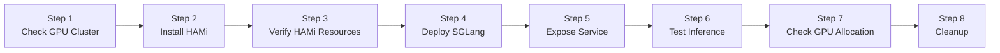
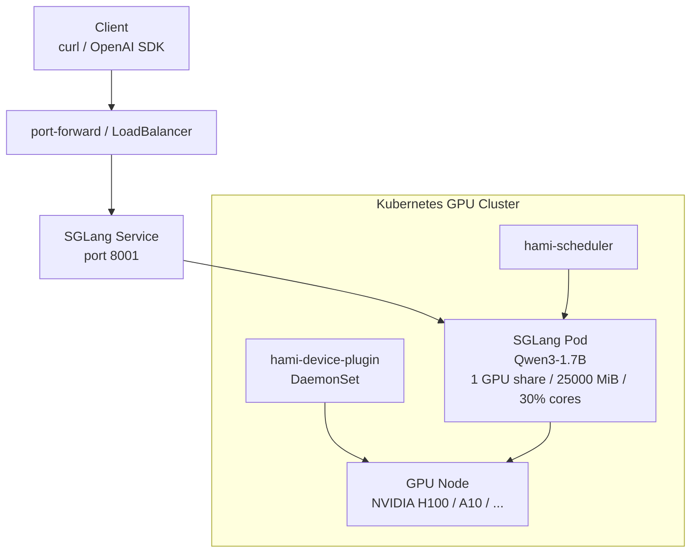

This lab demonstrates how to install HAMi on a Kubernetes cluster that already has NVIDIA GPUs, and use HAMi to schedule an [SGLang](https://github.com/sgl-project/sglang) inference service. Upon completion, you will have an OpenAI-compatible model service that can be verified through `/v1/models` and `/v1/chat/completions`, with HAMi enforcing GPU memory and compute caps inside the Pod.

This guide is modeled after [Lab 6: Run vLLM on HAMi GPU Shares](./hami-vllm). The steps are not tied to a specific cloud vendor. As long as your Kubernetes cluster has available NVIDIA GPUs, NVIDIA drivers, and container runtime support, you can reproduce the same setup.

## Learning Objectives

- Verify that an existing GPU Kubernetes cluster meets the prerequisites for HAMi and SGLang
- Install HAMi scheduler and device plugin
- Add labels required by the HAMi DaemonSet to GPU nodes
- Run SGLang using HAMi's `nvidia.com/gpu`, `nvidia.com/gpumem`, and `nvidia.com/gpucores` resources
- Test the SGLang OpenAI-compatible API via port forwarding
- Confirm that `nvidia.com/gpumem` is enforced inside the SGLang Pod

## Lab Overview



## Deployment Architecture



## Prerequisites

You need to prepare in advance:

- A working Kubernetes cluster
- At least 1 NVIDIA GPU node with enough free memory for the model (this guide uses a single NVIDIA H100 80GB; an A10/L40S-class GPU also works if you keep the small model and `gpumem` values)
- `kubectl` connected to the cluster
- `helm` 3.x
- GPU nodes with NVIDIA drivers and NVIDIA Container Toolkit / runtime support installed
- The cluster can pull the SGLang image (`lmsysorg/sglang`) and download model weights (Hugging Face Hub or a mirror)

> **Kind note:** If you use [kind](https://kind.sigs.k8s.io/) with GPU passthrough, install and configure `nvidia-container-toolkit` **inside** the kind node and set `default_runtime_name = "nvidia"` for containerd before installing HAMi. On managed GPU clusters this is usually already handled by the vendor GPU operator / device plugin stack.

## Example Cluster State

Below is the verification cluster used for this guide: one kind control-plane node backed by a host NVIDIA H100 80GB HBM3.

```bash
kubectl get nodes -o wide
```

```plaintext
NAME                      STATUS   ROLES           AGE   VERSION   INTERNAL-IP   OS-IMAGE                       CONTAINER-RUNTIME
hami-demo-control-plane   Ready    control-plane   2m    v1.36.1   172.19.0.2    Debian GNU/Linux 13 (trixie)   containerd://2.3.1
```

Host GPU:

```bash
nvidia-smi --query-gpu=index,name,memory.total --format=csv
```

```plaintext
index, name, memory.total [MiB]
0, NVIDIA H100 80GB HBM3, 81559 MiB
```

After HAMi is installed (see steps below), each physical GPU is registered as 10 schedulable shares:

```bash
kubectl get nodes -o 'custom-columns=NAME:.metadata.name,GPU:.status.allocatable.nvidia\.com/gpu'
```

```plaintext
NAME                      GPU
hami-demo-control-plane   10
```

HAMi component status:

```bash
kubectl get pods -n kube-system -l app.kubernetes.io/instance=hami -o wide
```

```plaintext
NAME                              READY   STATUS    NODE
hami-device-plugin-...            2/2     Running   hami-demo-control-plane
hami-scheduler-...                2/2     Running   hami-demo-control-plane
```

## Step 1: Check the GPU Cluster

Confirm that Kubernetes can see the GPU nodes:

```bash
kubectl get nodes -o wide
kubectl describe node | grep -A8 -E "Capacity:|Allocatable:" | grep -E "nvidia.com/gpu|cpu:|memory:"
```

If the cluster already has a vendor NVIDIA device plugin installed, you may already see `nvidia.com/gpu`. After installing HAMi, `nvidia.com/gpu` becomes the number of vGPUs exposed by HAMi.

HAMi's device plugin matches `gpu=on` when managed node selectors are enabled. Label your GPU nodes:

```bash
kubectl label node <gpu-node-name> gpu=on --overwrite
```

On Alibaba Cloud ACK, you can also select by vendor labels, for example:

```bash
kubectl label nodes \
  -l aliyun.accelerator/xpu_type=nvidia \
  gpu=on \
  --overwrite
```

## Step 2: Install HAMi

Add the HAMi Helm repo:

```bash
helm repo add hami-charts https://project-hami.github.io/HAMi
helm repo update hami-charts
```

Create a values file (save as `hami-values.yaml`):

```yaml
device:
  nvidia:
    driver:
      enabled: false

global:
  managedNodeSelectorEnable: true
  managedNodeSelector:
    gpu: "on"

devicePlugin:
  deviceSplitCount: 10

scheduler:
  # Match your cluster Kubernetes minor version (example: kind v1.36.1).
  kubeScheduler:
    imageTag: "v1.36.1"
  leaderElect: false
```

Key configuration details:

| Configuration | Description |
| --- | --- |
| `device.nvidia.driver.enabled: false` | Nodes already have NVIDIA drivers. |
| `global.managedNodeSelector.gpu: "on"` | Only schedule the HAMi device plugin to GPU nodes labeled `gpu=on`. |
| `devicePlugin.deviceSplitCount: 10` | Register each physical GPU as 10 vGPUs. |
| `scheduler.kubeScheduler.imageTag` | Must match the cluster Kubernetes version. |
| `scheduler.leaderElect: false` | Single-replica lab scheduler; avoids extender leader-election waits. |

Install HAMi:

```bash
helm upgrade --install hami hami-charts/hami \
  -n kube-system \
  -f hami-values.yaml \
  --version 2.9.0
```

> On some ACK Kubernetes 1.36 clusters, the built-in kube-scheduler in HAMi also needs DRA-related RBAC. If the scheduler logs show `resource.k8s.io` permission errors, apply the same DRA RBAC helper used in [Lab 6](./hami-vllm).

Wait for components to be running:

```bash
kubectl rollout status deployment/hami-scheduler -n kube-system
kubectl rollout status daemonset/hami-device-plugin -n kube-system
```

Expected result:

```plaintext
deployment "hami-scheduler" successfully rolled out
daemon set "hami-device-plugin" successfully rolled out
```

## Step 3: Verify HAMi Resources

```bash
kubectl get pods -n kube-system -l app.kubernetes.io/instance=hami -o wide
kubectl get nodes -o 'custom-columns=NAME:.metadata.name,GPU:.status.allocatable.nvidia\.com/gpu'
```

You should see `hami-scheduler` and `hami-device-plugin` Running, and each GPU node advertising `nvidia.com/gpu` equal to `deviceSplitCount` (10 in this lab).

If the device plugin is not Ready, check labels and DaemonSet node selector:

```bash
kubectl get nodes -L gpu
kubectl get ds hami-device-plugin -n kube-system -o wide
kubectl logs -n kube-system -l app.kubernetes.io/instance=hami -c device-plugin --tail=50
```

## Step 4: Deploy SGLang with HAMi Resources

This lab deploys **Qwen3-1.7B** with SGLang. The Pod requests one HAMi GPU share, **25000 MiB** GPU memory, and **30%** GPU cores so multiple inference workloads can still share a large GPU.

Apply the manifests (self-contained):

```bash
kubectl apply -f - <<'EOF'
apiVersion: v1
kind: Namespace
metadata:
  name: sglang
---
apiVersion: apps/v1
kind: Deployment
metadata:
  name: sglang-qwen3-17b
  namespace: sglang
  labels:
    app.kubernetes.io/name: sglang-qwen3-17b
spec:
  replicas: 1
  selector:
    matchLabels:
      app.kubernetes.io/name: sglang-qwen3-17b
  template:
    metadata:
      labels:
        app.kubernetes.io/name: sglang-qwen3-17b
      annotations:
        hami.io/node-scheduler-policy: binpack
        hami.io/gpu-scheduler-policy: binpack
    spec:
      schedulerName: hami-scheduler
      containers:
        - name: sglang
          image: lmsysorg/sglang:latest
          imagePullPolicy: IfNotPresent
          command:
            - python3
            - -m
            - sglang.launch_server
            - --model-path=Qwen/Qwen3-1.7B
            - --host=0.0.0.0
            - --port=30000
            - --mem-fraction-static=0.7
            - --context-length=8192
            - --attention-backend=triton
          ports:
            - name: http
              containerPort: 30000
          resources:
            requests:
              cpu: "2"
              memory: 8Gi
              nvidia.com/gpu: "1"
              nvidia.com/gpumem: "25000"
              nvidia.com/gpucores: "30"
            limits:
              cpu: "8"
              memory: 32Gi
              nvidia.com/gpu: "1"
              nvidia.com/gpumem: "25000"
              nvidia.com/gpucores: "30"
          readinessProbe:
            httpGet:
              path: /health
              port: 30000
            initialDelaySeconds: 30
            periodSeconds: 10
            timeoutSeconds: 5
            failureThreshold: 90
          volumeMounts:
            - name: dshm
              mountPath: /dev/shm
      volumes:
        - name: dshm
          emptyDir:
            medium: Memory
            sizeLimit: 8Gi
---
apiVersion: v1
kind: Service
metadata:
  name: sglang-qwen3-17b
  namespace: sglang
spec:
  type: ClusterIP
  selector:
    app.kubernetes.io/name: sglang-qwen3-17b
  ports:
    - name: http
      port: 8001
      targetPort: http
EOF
```

Key points:

| Configuration | Description |
| --- | --- |
| `schedulerName: hami-scheduler` | Explicitly delegate scheduling to HAMi. |
| `nvidia.com/gpu: "1"` | Request 1 HAMi GPU device share. |
| `nvidia.com/gpumem: "25000"` | Hard GPU memory cap in MiB visible inside the container. |
| `nvidia.com/gpucores: "30"` | Cap SM/compute usage to 30%. |
| `hami.io/*-scheduler-policy: binpack` | Prefer packing workloads onto the same physical GPU. |
| `/dev/shm` Memory emptyDir | SGLang benefits from a larger shared-memory mount. |

Wait for SGLang to become Ready (first start downloads the model and captures CUDA graphs):

```bash
kubectl rollout status deployment/sglang-qwen3-17b -n sglang --timeout=30m
kubectl get pods -n sglang -o wide
```

Example output:

```plaintext
NAME                               READY   STATUS    NODE
sglang-qwen3-17b-6d894b9655-ppxrw  1/1     Running   hami-demo-control-plane
```

Check HAMi scheduling events:

```bash
kubectl describe pod -n sglang -l app.kubernetes.io/name=sglang-qwen3-17b \
  | grep -E "hami-scheduler|Filtering|Binding" -A2
```

You should see events such as:

```plaintext
Successfully assigned sglang/... to hami-demo-control-plane
FilteringSucceed ... find fit node(hami-demo-control-plane)...
BindingSucceed ... Successfully binding node [hami-demo-control-plane] ...
```

## Step 5: Expose the SGLang Service

For local verification, use port forwarding:

```bash
kubectl -n sglang port-forward svc/sglang-qwen3-17b 8001:8001
```

In another terminal:

```bash
curl http://127.0.0.1:8001/v1/models
```

On cloud clusters you can also create a `LoadBalancer` Service or Ingress in front of `sglang-qwen3-17b`. Verify with port-forward first, then wire public exposure.

## Step 6: Test Inference

List models:

```bash
curl -s http://127.0.0.1:8001/v1/models | python3 -m json.tool
```

Example output from the verification cluster:

```json
{
  "object": "list",
  "data": [
    {
      "id": "Qwen/Qwen3-1.7B",
      "object": "model",
      "owned_by": "sglang",
      "max_model_len": 8192
    }
  ]
}
```

Send a chat completion request:

```bash
curl -s http://127.0.0.1:8001/v1/chat/completions \
  -H "Content-Type: application/json" \
  -d '{
    "model": "Qwen/Qwen3-1.7B",
    "messages": [
      {"role": "user", "content": "Explain in one sentence how HAMi and SGLang work together."}
    ],
    "max_tokens": 128,
    "temperature": 0.2,
    "chat_template_kwargs": {"enable_thinking": false}
  }' | python3 -m json.tool
```

If the response contains `choices[0].message.content`, the SGLang inference service is working.

> Qwen3 models may emit a thinking/reasoning channel depending on the chat template. Passing `"chat_template_kwargs": {"enable_thinking": false}` keeps the demo answer concise.

## Step 7: Check GPU Allocation

Confirm the Pod used HAMi scheduling and the expected resource limits:

```bash
POD=$(kubectl get pod -n sglang -l app.kubernetes.io/name=sglang-qwen3-17b -o jsonpath='{.items[0].metadata.name}')
kubectl get pod -n sglang ${POD} \
  -o jsonpath='{.spec.schedulerName}{"\n"}{.spec.containers[0].resources.limits}{"\n"}'
```

Expected:

```plaintext
hami-scheduler
... nvidia.com/gpu:1 nvidia.com/gpumem:25000 nvidia.com/gpucores:30 ...
```

Check environment variables injected by HAMi:

```bash
kubectl exec -n sglang ${POD} -- env | grep -E 'CUDA_DEVICE|NVIDIA_VISIBLE'
```

Example from the verification cluster:

```plaintext
NVIDIA_VISIBLE_DEVICES=GPU-04b76a6c-da10-342f-e9f5-5f5684eacb86
CUDA_DEVICE_MEMORY_LIMIT_0=25000m
CUDA_DEVICE_SM_LIMIT=30
```

Finally, check `nvidia-smi` **inside** the container:

```bash
kubectl exec -n sglang ${POD} -- nvidia-smi
```

When `gpumem` is in effect, the total GPU memory visible inside the container is close to **25000 MiB**, not the full physical card (81559 MiB on the H100 verification host):

```plaintext
| GPU  Name                 ... | Memory-Usage          |
| NVIDIA H100 80GB HBM3     ... | 18213MiB / 25000MiB   |
```

On the host, the same card still reports the full capacity:

```bash
nvidia-smi --query-gpu=memory.total,memory.used --format=csv
```

```plaintext
memory.total [MiB], memory.used [MiB]
81559 MiB, 18560 MiB
```

That contrast — full card on the host, capped slice in the Pod — is the key evidence that HAMi memory virtualization is working for SGLang.

## Troubleshooting

| Symptom | What to Check |
| --- | --- |
| `hami-device-plugin` CrashLoop / FailedPostStartHook | NVIDIA Container Toolkit must inject driver libs into Pods. On kind, configure the nvidia runtime inside the node. |
| `hami-device-plugin` not Ready | Node missing `gpu=on`, or node selector mismatch. |
| SGLang Pod Pending | `kubectl describe pod` for HAMi filter/bind events; confirm `gpumem` does not exceed physical GPU memory. |
| Image pull fails / disk full | `lmsysorg/sglang` images are large. Prune unused images or `kind load docker-image` from a pre-pulled host image. |
| SGLang starts slowly | First-time Hugging Face download + CUDA graph capture can take several minutes. Watch Pod logs. |
| `/v1/models` empty / connection refused | Wait until readiness probe passes; use `kubectl logs` and `kubectl port-forward` to the Pod port `30000` if the Service is wrong. |
| In-pod `nvidia-smi` still shows full GPU memory | Pod is not on the HAMi memory-limit path. Recheck `schedulerName`, resource limits, and HAMi webhook/scheduler events. |

Common troubleshooting commands:

```bash
kubectl get pods -A -o wide
kubectl describe pod -n sglang -l app.kubernetes.io/name=sglang-qwen3-17b
kubectl logs -n sglang -l app.kubernetes.io/name=sglang-qwen3-17b --tail=100
kubectl logs -n kube-system deploy/hami-scheduler --tail=100
kubectl get ds hami-device-plugin -n kube-system -o wide
```

## Cleanup

```bash
kubectl delete namespace sglang --ignore-not-found
```

If this cluster is only used for this lab, you can also uninstall HAMi:

```bash
helm uninstall hami -n kube-system
```

Optional label cleanup:

```bash
kubectl label node <gpu-node-name> gpu-
```

## Verification Results

| Claim | Evidence |
| --- | --- |
| HAMi has taken over GPU scheduling | SGLang Pod uses `schedulerName: hami-scheduler` and requests `nvidia.com/gpu`, `nvidia.com/gpumem`, `nvidia.com/gpucores`. |
| GPU node runs HAMi device plugin | `hami-device-plugin` is Ready and advertises `nvidia.com/gpu=10`. |
| SGLang runs on HAMi resources | Pod Ready; HAMi injects `CUDA_DEVICE_MEMORY_LIMIT_0=25000m` and `CUDA_DEVICE_SM_LIMIT=30`. |
| Memory cap is visible in-container | In-pod `nvidia-smi` shows `... / 25000MiB` while host still shows `81559 MiB`. |
| Inference service is accessible | `/v1/models` returns `Qwen/Qwen3-1.7B`; chat endpoint returns content. |

## Next Steps

- Increase `replicas` and observe how HAMi packs multiple SGLang Pods with `binpack`.
- Lower `nvidia.com/gpumem` / `nvidia.com/gpucores` further and co-locate another small workload on the same GPU.
- Deliver the model from an OCI registry instead of Hugging Face: a companion **KitOps ModelKit** lab replaces the runtime download with a `kitops-init` initContainer ([website#561](https://github.com/Project-HAMi/website/issues/561)).
- For memory isolation and small-slice sharing patterns, see [Lab 3: GPU Partitioning](./gpu-partitioning).
