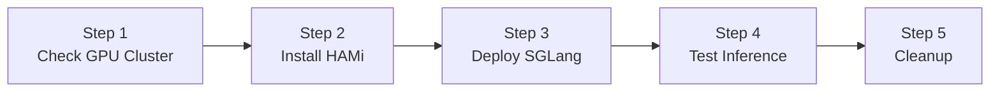
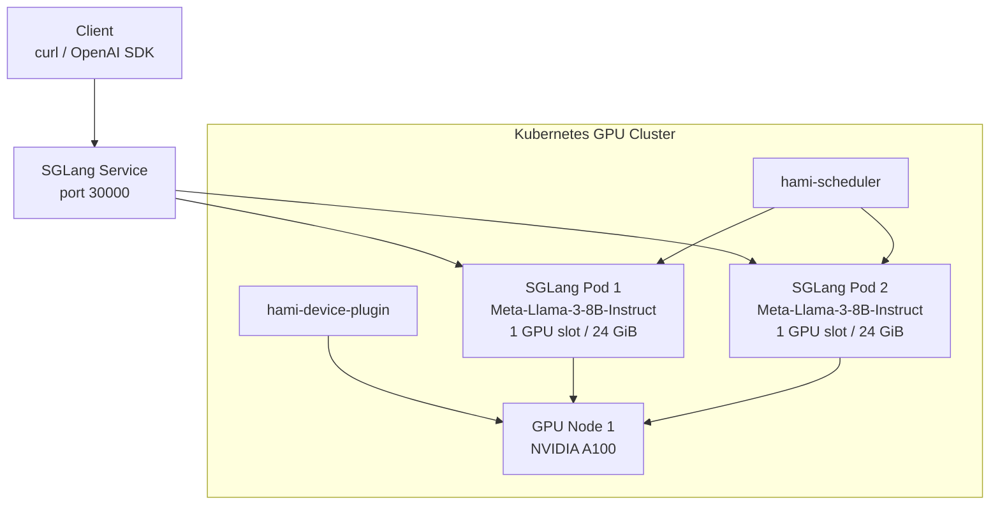

This lab demonstrates how to deploy [SGLang](https://sgl-project.github.io/), a high-performance LLM serving framework optimized for RadixAttention, on a Kubernetes cluster using HAMi for GPU memory and compute isolation. Upon completion, you will have an OpenAI-compatible model service running SGLang on a partitioned GPU.

## Learning Objectives

- Understand the benefits of SGLang for high-throughput inference
- Run SGLang using HAMi's `nvidia.com/gpu`, `nvidia.com/gpumem`, and `nvidia.com/gpucores` resources
- Test the SGLang OpenAI-compatible API via port forwarding

## Lab Overview


```mermaid
%% title: HAMi + SGLang Lab Flowchart
flowchart LR
    Step1["Step 1<br/>Check GPU Cluster"] --> Step2["Step 2<br/>Install HAMi"]
    Step2 --> Step3["Step 3<br/>Deploy SGLang"]
    Step3 --> Step4["Step 4<br/>Test Inference"]
    Step4 --> Step5["Step 5<br/>Cleanup"]
```

## Deployment Architecture


```mermaid
%% title: HAMi + SGLang Deployment Architecture
flowchart TB
    Client["Client<br/>curl / OpenAI SDK"] --> SVC["SGLang Service<br/>port 30000"]
    SVC --> P1["SGLang Pod 1<br/>Meta-Llama-3-8B-Instruct<br/>1 GPU slot / 24 GiB"]
    SVC --> P2["SGLang Pod 2<br/>Meta-Llama-3-8B-Instruct<br/>1 GPU slot / 24 GiB"]

    subgraph K8S["Kubernetes GPU Cluster"]
      HAMI_S["hami-scheduler"]
      HAMI_D["hami-device-plugin"]
      P1
      P2
      N1["GPU Node 1<br/>NVIDIA A100"]
    end

    HAMI_S --> P1
    HAMI_S --> P2
    HAMI_D --> N1
    P1 --> N1
    P2 --> N1
```

## Prerequisites

- A working Kubernetes cluster with HAMi installed
- At least 1 NVIDIA GPU node with sufficient memory for the target model
- `kubectl` connected to the cluster
- The cluster can pull SGLang images (`lmsysorg/sglang:latest`) and access Hugging Face models

## Step 1: Create the SGLang Deployment

We will create a Kubernetes Deployment for SGLang, requesting a specific partition of the GPU using HAMi's extended resources.

Save the following YAML as `sglang-deployment.yaml`:

```yaml
apiVersion: apps/v1
kind: Deployment
metadata:
  name: sglang-llama3
  labels:
    app: sglang
spec:
  replicas: 1
  selector:
    matchLabels:
      app: sglang
  template:
    metadata:
      labels:
        app: sglang
    spec:
      containers:
        - name: sglang
          image: lmsysorg/sglang:latest
          command:
            - python3
            - "-m"
            - "sglang.launch_server"
            - "--model-path"
            - "meta-llama/Meta-Llama-3-8B-Instruct"
            - "--host"
            - "0.0.0.0"
            - "--port"
            - "30000"
          ports:
            - containerPort: 30000
          resources:
            limits:
              nvidia.com/gpu: 1
              nvidia.com/gpumem: 24000
              nvidia.com/gpucores: 50
          env:
            - name: HUGGING_FACE_HUB_TOKEN
              value: "YOUR_HF_TOKEN" # Replace with your Hugging Face token
```

**Key Resource Constraints:**

- `nvidia.com/gpu: 1`: Requests 1 virtual GPU slot.
- `nvidia.com/gpumem: 24000`: Allocates exactly 24GB of GPU memory to the SGLang worker.
- `nvidia.com/gpucores: 50`: Allocates 50% of the physical GPU's compute capacity.

Apply the deployment:

```bash
kubectl apply -f sglang-deployment.yaml
```

## Step 2: Create the Service

Expose the SGLang deployment internally using a ClusterIP service.

Save as `sglang-service.yaml`:

```yaml
apiVersion: v1
kind: Service
metadata:
  name: sglang-service
spec:
  selector:
    app: sglang
  ports:
    - protocol: TCP
      port: 30000
      targetPort: 30000
```

Apply the service:

```bash
kubectl apply -f sglang-service.yaml
```

## Step 3: Verify Inference

Wait for the SGLang pod to become `Running`. Since it needs to download the Llama 3 weights, this might take several minutes depending on your network speed.

```bash
kubectl get pods -l app=sglang -w
```

Once running, port-forward the service to your local machine:

```bash
kubectl port-forward svc/sglang-service 30000:30000
```

Open a new terminal and test the OpenAI-compatible endpoint:

```bash
curl http://localhost:30000/v1/chat/completions \
  -H "Content-Type: application/json" \
  -d '{
    "model": "meta-llama/Meta-Llama-3-8B-Instruct",
    "messages": [{"role": "user", "content": "Explain GPU virtualization in one sentence."}],
    "temperature": 0.7
  }'
```

If successful, SGLang will return a generated response powered by your HAMi-partitioned GPU!

## Step 4: Cleanup

To remove the lab resources from your cluster, run:

```bash
kubectl delete -f sglang-service.yaml
kubectl delete -f sglang-deployment.yaml
```
