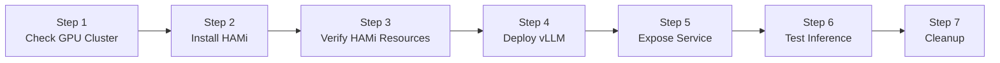
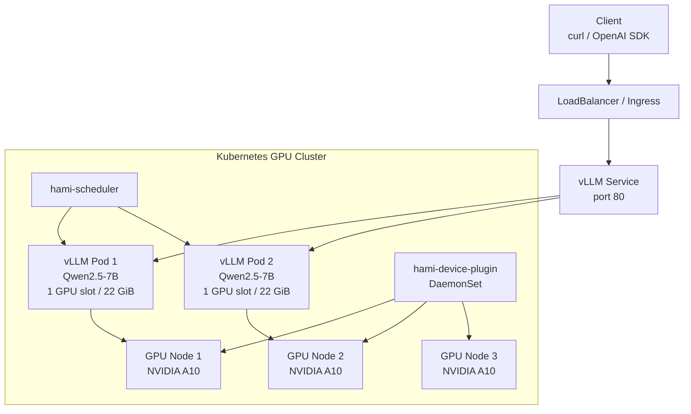

This lab demonstrates how to install HAMi on a Kubernetes cluster that already has NVIDIA GPUs, and use HAMi to schedule vLLM inference services. Upon completion, you will have an OpenAI-compatible model service that can be verified through `/v1/models` and `/v1/chat/completions`.

This guide uses an Alibaba Cloud ACK GPU cluster as the reference environment, but the steps are not tied to ACK. As long as your Kubernetes cluster has available NVIDIA GPUs, NVIDIA drivers, and container runtime support, you can reproduce the same setup. Cloud vendor-specific LoadBalancer and ALB Ingress configurations can be replaced with your own exposure method.

## Learning Objectives

- Verify that an existing GPU Kubernetes cluster meets the prerequisites for HAMi and vLLM
- Install HAMi scheduler and device plugin
- Add labels required by the HAMi DaemonSet to GPU nodes
- Run vLLM using HAMi's `nvidia.com/gpu`, `nvidia.com/gpumem`, and `nvidia.com/gpucores` resources
- Test the vLLM OpenAI-compatible API via public LoadBalancer or port forwarding

## Lab Overview



## Deployment Architecture



## Prerequisites

You need to prepare in advance:

- A working Kubernetes cluster
- At least 1 NVIDIA GPU node; this guide uses 3 NVIDIA A10 nodes
- `kubectl` connected to the cluster
- `helm` 3.x
- GPU nodes with NVIDIA drivers and container runtime support installed
- The cluster can pull vLLM images and model files

The configuration files for this guide are:

| File | Purpose |
| --- | --- |
| [`hami-values-ack.yaml`](./hami-vllm/hami-values-ack.yaml) | ACK example HAMi values, using DaoCloud image proxy and matching ACK GPU node labels. |
| [`vllm-qwen25-7b.yaml`](./hami-vllm/vllm-qwen25-7b.yaml) | vLLM Deployment and `vllm-qwen25-7b-engine-service` ClusterIP Service. |
| [`vllm-public-service-aliyun.yaml`](./hami-vllm/vllm-public-service-aliyun.yaml) | Alibaba Cloud public LoadBalancer Service example. |
| [`vllm-ingress-aliyun.yaml`](./hami-vllm/vllm-ingress-aliyun.yaml) | Alibaba Cloud ALB Ingress example. |

> If you are not running on ACK, you can still use `vllm-qwen25-7b.yaml`. Just change the image, node labels, and service exposure method to match your environment.

## Example Cluster State

Below is the ACK cluster state used to verify this guide. This cluster is in `cn-hangzhou` with 3 GPU nodes, each being an `ecs.gn7i-c8g1.2xlarge` with 1 NVIDIA A10.

```bash
kubectl get nodes -o wide
```

```plaintext
NAME                     STATUS   ROLES    AGE   VERSION            INTERNAL-IP   OS-IMAGE                                                CONTAINER-RUNTIME
cn-hangzhou.10.10.1.73   Ready    <none>   17h   v1.36.1-aliyun.1   10.10.1.73    Alibaba Cloud Linux 3.2104 U13.1 (OpenAnolis Edition)   containerd://1.6.28
cn-hangzhou.10.10.1.74   Ready    <none>   17h   v1.36.1-aliyun.1   10.10.1.74    Alibaba Cloud Linux 3.2104 U13.1 (OpenAnolis Edition)   containerd://1.6.28
cn-hangzhou.10.10.1.75   Ready    <none>   17h   v1.36.1-aliyun.1   10.10.1.75    Alibaba Cloud Linux 3.2104 U13.1 (OpenAnolis Edition)   containerd://1.6.28
```

Check GPU node labels and HAMi-exposed GPU resources:

```bash
kubectl get nodes -L gpu,aliyun.accelerator/xpu_type \
  -o 'custom-columns=NAME:.metadata.name,GPU_LABEL:.metadata.labels.gpu,XPU:.metadata.labels.aliyun\.accelerator/xpu_type,ALLOC_GPU:.status.allocatable.nvidia\.com/gpu'
```

```plaintext
NAME                     GPU_LABEL   XPU      ALLOC_GPU
cn-hangzhou.10.10.1.73   on          nvidia   10
cn-hangzhou.10.10.1.74   on          nvidia   10
cn-hangzhou.10.10.1.75   on          nvidia   10
```

Each physical A10 is registered by HAMi as 10 schedulable GPU shares. The `nvidia.com/gpu: 10` here means this node can allocate up to 10 HAMi GPU device shares. The actual memory and compute each workload can use depends on the `nvidia.com/gpumem` and `nvidia.com/gpucores` it requests simultaneously. You can also see cloud vendor-provided GPU labels on the node:

```plaintext
aliyun.accelerator/nvidia_count=1
aliyun.accelerator/nvidia_mem=23028MiB
aliyun.accelerator/nvidia_name=NVIDIA-A10
aliyun.accelerator/xpu_type=nvidia
node.kubernetes.io/instance-type=ecs.gn7i-c8g1.2xlarge
```

The NVIDIA A10 is a 24 GB-class GPU. In this ACK cluster, the node labels report available memory as `23028MiB` or `24564MiB`. Check the node labels and `nvidia-smi` inside the container for the exact values.

Current Helm releases in the cluster:

```bash
helm list -A
```

```plaintext
NAME                     NAMESPACE     STATUS     CHART
ack-nvidia-device-plugin kube-system   deployed   ack-nvidia-device-plugin-0.7.0
hami                     kube-system   deployed   hami-2.9.0
vllm                     vllm          deployed   vllm-stack-0.1.11
```

HAMi component status:

```bash
kubectl get pods -n kube-system -l app.kubernetes.io/instance=hami -o wide
kubectl get ds hami-device-plugin -n kube-system -o wide
```

```plaintext
NAME                       READY   STATUS    NODE
hami-device-plugin-8jz8x   2/2     Running   cn-hangzhou.10.10.1.73
hami-device-plugin-whtkm   2/2     Running   cn-hangzhou.10.10.1.74
hami-device-plugin-9db54   2/2     Running   cn-hangzhou.10.10.1.75
hami-scheduler-...         2/2     Running   cn-hangzhou.10.10.1.75

NAME                 DESIRED   CURRENT   READY   NODE SELECTOR
hami-device-plugin   3         3         3       aliyun.accelerator/xpu_type=nvidia,gpu=on
```

vLLM runtime status:

```bash
kubectl get pods,svc,ingress -n vllm -o wide
```

```plaintext
NAME                                      READY   STATUS    NODE
pod/vllm-qwen25-7b-deployment-...-g8gct   1/1     Running   cn-hangzhou.10.10.1.73
pod/vllm-qwen25-7b-deployment-...-znpb5   1/1     Running   cn-hangzhou.10.10.1.74

NAME                                      TYPE           EXTERNAL-IP      PORT(S)
service/vllm-qwen25-7b-public             LoadBalancer   120.27.251.192   80:30835/TCP
service/vllm-qwen25-7b-engine-service     ClusterIP      <none>           80/TCP

NAME                                       CLASS   HOSTS            ADDRESS
ingress.networking.k8s.io/vllm-qwen25-7b   alb     llm.kubecon.ai   alb-aqaj06ms8ogcxwg16o.cn-hangzhou.alb.aliyuncsslb.com
```

The vLLM service already running in this reference cluster was deployed using the vLLM Production Stack Helm chart, with explicit use of `hami-scheduler`, `nvidia.com/gpumem: "22000"`, and `nvidia.com/gpucores: "100"`. The lab below uses standalone manifests to deploy a similar service, preserving these key configurations so you can directly observe whether HAMi resource constraints are in effect.

## Step 1: Check the GPU Cluster

First, confirm that Kubernetes can see the GPU nodes:

```bash
kubectl get nodes -o wide
kubectl describe node | grep -A8 -E "Capacity:|Allocatable:" | grep -E "nvidia.com/gpu|cpu:|memory:"
```

If the cluster already has a cloud vendor's NVIDIA device plugin installed, you may already see `nvidia.com/gpu`. After installing HAMi, `nvidia.com/gpu` will become the number of vGPUs exposed by HAMi.

On ACK, GPU nodes typically have the following labels:

```bash
kubectl get nodes -L aliyun.accelerator/xpu_type,aliyun.accelerator/nvidia_name
```

```plaintext
NAME                     XPU      NVIDIA_NAME
cn-hangzhou.10.10.1.73   nvidia   NVIDIA-A10
```

HAMi's device plugin also matches `gpu=on` by default, so first add this label to GPU nodes:

```bash
kubectl label nodes \
  -l aliyun.accelerator/xpu_type=nvidia \
  gpu=on \
  --overwrite
```

For non-ACK environments, replace the label selector with your GPU node label, for example:

```bash
kubectl label node <gpu-node-name> gpu=on --overwrite
```

## Step 2: Install HAMi

Add the HAMi Helm repo:

```bash
helm repo add hami https://Project-HAMi.github.io/HAMi
helm repo update hami
```

The ACK example uses [`hami-values-ack.yaml`](./hami-vllm/hami-values-ack.yaml):

```yaml
device:
  nvidia:
    driver:
      enabled: false

global:
  managedNodeSelectorEnable: true
  managedNodeSelector:
    gpu: "on"

devicePlugin:
  deviceSplitCount: 10
  image:
    registry: docker.m.daocloud.io
    repository: projecthami/hami
```

Key configuration details:

| Configuration | Description |
| --- | --- |
| `device.nvidia.driver.enabled: false` | ACK GPU nodes already have NVIDIA drivers. No need for HAMi to install drivers again. |
| `global.managedNodeSelectorEnable: true` | Add a node selector to the HAMi device plugin DaemonSet. |
| `global.managedNodeSelector.gpu: "on"` | Only schedule HAMi device plugin to GPU nodes labeled `gpu=on`. |
| `devicePlugin.deviceSplitCount: 10` | Register each physical GPU as 10 vGPUs. |
| `scheduler.leaderElect: false` | This lab uses a single-replica HAMi scheduler. Disabling leader election prevents the extender from waiting to become leader in ACK environments. |
| `docker.m.daocloud.io/projecthami/hami` | Example image proxy to avoid Docker Hub pull timeouts on nodes in mainland China. |

Install HAMi:

```bash
helm upgrade --install hami hami/hami \
  -n kube-system \
  -f tutorials/labs/hami-vllm/hami-values-ack.yaml
```

On ACK's Kubernetes 1.36 cluster, the built-in kube-scheduler in HAMi also needs to read DRA-related resources. Apply the following RBAC, otherwise the scheduler container may fail to complete scheduling due to missing `resource.k8s.io` permissions:

```bash
kubectl apply -f tutorials/labs/hami-vllm/hami-scheduler-dra-rbac.yaml
```

Wait for components to be running:

```bash
kubectl rollout status deployment/hami-scheduler -n kube-system
kubectl rollout status daemonset/hami-device-plugin -n kube-system
```

Expected result:

```plaintext
deployment "hami-scheduler" successfully rolled out
daemon set "hami-device-plugin" successfully rolled out
```

## Step 3: Verify HAMi Resources

Check HAMi Pods:

```bash
kubectl get pods -n kube-system -l app.kubernetes.io/instance=hami -o wide
```

You should see:

```plaintext
hami-scheduler-...       2/2   Running
hami-device-plugin-...   2/2   Running
```

Check vGPUs exposed by each GPU node:

```bash
kubectl get nodes -o 'custom-columns=NAME:.metadata.name,GPU:.status.allocatable.nvidia\.com/gpu'
```

Example output:

```plaintext
NAME                     GPU
cn-hangzhou.10.10.1.73   10
cn-hangzhou.10.10.1.74   10
cn-hangzhou.10.10.1.75   10
```

If some nodes don't have `hami-device-plugin` running, check the labels first:

```bash
kubectl get nodes -L gpu,aliyun.accelerator/xpu_type
kubectl get ds hami-device-plugin -n kube-system -o wide
```

## Step 4: Deploy vLLM with HAMi Resources

This guide uses [`vllm-qwen25-7b.yaml`](./hami-vllm/vllm-qwen25-7b.yaml) to deploy Qwen2.5-7B-Instruct:

```yaml
resources:
  requests:
    cpu: "2"
    memory: 8Gi
  limits:
    cpu: "4"
    memory: 16Gi
    nvidia.com/gpu: "1"
    nvidia.com/gpumem: "22000"
    nvidia.com/gpucores: "100"
```

Key points:

| Configuration | Description |
| --- | --- |
| `schedulerName: hami-scheduler` | Explicitly delegate scheduling to HAMi scheduler. |
| `nvidia.com/gpu: "1"` | Each vLLM Pod requests 1 HAMi GPU device share. It is not a fixed-size slice; the actual memory size is determined by `nvidia.com/gpumem`. |
| `nvidia.com/gpumem: "22000"` | Each vLLM Pod requests 22000 MiB of GPU memory, nearly the entire A10. In the current reference cluster, vLLM Pods without `gpumem` configured measured about 20.8 GiB GPU memory usage with `max_model_len=4096`, so 22 GiB is used as a limit close to the actual requirement. |
| `nvidia.com/gpucores: "100"` | Each Pod uses 100% GPU compute. This configuration is suitable for inference service stability verification, not for co-deploying another large model on the same A10. |
| `VLLM_USE_MODELSCOPE=True` | Prioritize using ModelScope to download models in mainland China network environments. |

> The actual GPU memory required by a vLLM instance depends on the model size, weight precision, `max_model_len`, concurrency, KV cache strategy, and vLLM version. A 7B BF16/FP16 model's weights are typically about 14-16 GiB. With CUDA/vLLM runtime, KV cache, and fragmentation overhead, running Qwen2.5-7B-Instruct on an A10 usually requires more than 20 GiB of GPU memory. Quantized models, shorter contexts, or lower concurrency can reduce requirements; longer contexts and higher concurrency will increase them.

Apply the configuration:

```bash
kubectl apply -f tutorials/labs/hami-vllm/vllm-qwen25-7b.yaml
```

Wait for vLLM to start:

```bash
kubectl rollout status deployment/vllm-qwen25-7b -n vllm --timeout=30m
kubectl get pods -n vllm -o wide
```

The first model download and loading takes a few minutes. Example output:

```plaintext
NAME                              READY   STATUS    NODE
vllm-qwen25-7b-7dff7f7d8c-4q2x9   1/1     Running   cn-hangzhou.10.10.1.73
vllm-qwen25-7b-7dff7f7d8c-9h6xw   1/1     Running   cn-hangzhou.10.10.1.74
```

Check HAMi scheduling events:

```bash
kubectl describe pod -n vllm -l app.kubernetes.io/name=qwen25-7b | grep -E "hami-scheduler|Filtering|Binding" -A2
```

You should be able to see HAMi scheduler scheduling or binding events.

## Step 5: Expose the vLLM Service

If you only want to verify locally, use port forwarding:

```bash
kubectl -n vllm port-forward svc/vllm-qwen25-7b-engine-service 8000:80
```

Open another terminal and access:

```bash
curl http://127.0.0.1:8000/v1/models
```

On ACK, you can create a public LoadBalancer:

```bash
kubectl apply -f tutorials/labs/hami-vllm/vllm-public-service-aliyun.yaml
kubectl get svc -n vllm vllm-qwen25-7b-public
```

Example output:

```plaintext
NAME                    TYPE           EXTERNAL-IP      PORT(S)
vllm-qwen25-7b-public   LoadBalancer   120.27.251.192   80:30835/TCP
```

If you already have an ALB IngressClass, you can refer to [`vllm-ingress-aliyun.yaml`](./hami-vllm/vllm-ingress-aliyun.yaml). Change the host to your domain before using it:

```yaml
rules:
  - host: llm.example.com
```

Then apply:

```bash
kubectl apply -f tutorials/labs/hami-vllm/vllm-ingress-aliyun.yaml
kubectl get ingress -n vllm
```

> When troubleshooting, use LoadBalancer or port-forward first to verify the vLLM service itself, then check DNS, ALB listeners, and health checks.

## Step 6: Test Inference

First, check the model list:

```bash
VLLM_HOST=$(kubectl get svc -n vllm vllm-qwen25-7b-public -o jsonpath='{.status.loadBalancer.ingress[0].ip}')
curl "http://${VLLM_HOST}/v1/models"
```

Example output:

```json
{
  "object": "list",
  "data": [
    {
      "id": "Qwen/Qwen2.5-7B-Instruct",
      "object": "model",
      "owned_by": "vllm",
      "max_model_len": 4096
    }
  ]
}
```

Send a chat completion request:

```bash
curl "http://${VLLM_HOST}/v1/chat/completions" \
  -H "Content-Type: application/json" \
  -d '{
    "model": "Qwen/Qwen2.5-7B-Instruct",
    "messages": [
      {"role": "user", "content": "Explain in one sentence how HAMi and vLLM work together."}
    ],
    "max_tokens": 128,
    "temperature": 0.2
  }'
```

If the response contains `choices[0].message.content`, the vLLM inference service is working.

## Step 7: Check GPU Allocation

View the HAMi resources requested by the Pods:

```bash
kubectl get pod -n vllm -l app.kubernetes.io/name=qwen25-7b \
  -o jsonpath='{range .items[*]}{.metadata.name}{"\t"}{.spec.nodeName}{"\t"}{.spec.containers[0].resources.limits}{"\n"}{end}'
```

Example output:

```plaintext
vllm-qwen25-7b-...   cn-hangzhou.10.10.1.73   {"cpu":"4","memory":"16Gi","nvidia.com/gpu":"1","nvidia.com/gpumem":"22000","nvidia.com/gpucores":"100"}
vllm-qwen25-7b-...   cn-hangzhou.10.10.1.74   {"cpu":"4","memory":"16Gi","nvidia.com/gpu":"1","nvidia.com/gpumem":"22000","nvidia.com/gpucores":"100"}
```

First confirm that this Pod actually went through HAMi scheduling and the resource limits include `gpumem`:

```bash
POD=$(kubectl get pod -n vllm -l app.kubernetes.io/name=qwen25-7b -o jsonpath='{.items[0].metadata.name}')
kubectl get pod -n vllm ${POD} \
  -o jsonpath='{.spec.schedulerName}{"\n"}{.spec.containers[0].resources.limits}{"\n"}'
```

The expected output should include:

```plaintext
hami-scheduler
map[cpu:4 memory:16Gi nvidia.com/gpu:1 nvidia.com/gpumem:22000 nvidia.com/gpucores:100]
```

Then check the environment variables injected by HAMi:

```bash
kubectl exec -n vllm ${POD} -- env | grep -E 'CUDA_DEVICE|NVIDIA_VISIBLE'
```

You should see something like:

```plaintext
NVIDIA_VISIBLE_DEVICES=GPU-...
CUDA_DEVICE_MEMORY_LIMIT_0=22000m
CUDA_DEVICE_SM_LIMIT=100
```

If you only see `NVIDIA_VISIBLE_DEVICES=0` but not `CUDA_DEVICE_MEMORY_LIMIT_0`, it usually means this Pod is not using HAMi's memory limit path. You should go back and check the Pod's `schedulerName`, resource limits, and HAMi webhook/scheduler events.

Finally, check `nvidia-smi` from inside the container:

```bash
kubectl exec -n vllm ${POD} -- nvidia-smi
```

When `gpumem` is in effect, the total GPU memory visible inside the container should be close to `22000MiB`, not the full physical card's `23028MiB` / `24564MiB`. This is the key evidence for determining whether `nvidia.com/gpumem` is working.

In the ACK reference cluster for this guide, the measured results for two vLLM replicas are as follows:

```plaintext
CUDA_DEVICE_MEMORY_LIMIT_0=22000m
CUDA_DEVICE_SM_LIMIT=100
NVIDIA_VISIBLE_DEVICES=GPU-...
NVIDIA A10, 22000, 20126
```

This indicates that HAMi has limited the A10 memory visible inside the container to 22000 MiB, and vLLM is currently using about 20126 MiB. If `nvidia-smi` still shows the full physical memory, then `nvidia.com/gpumem` is not in effect.

## Troubleshooting

| Symptom | What to Check |
| --- | --- |
| `hami-device-plugin` not 3/3 Ready | Check if GPU nodes have `gpu=on` and cloud vendor GPU labels. |
| HAMi image pull failure | Change the image in `hami-values-ack.yaml` to your own ACR image registry. |
| `hami-scheduler` logs show DRA resource permission errors | Apply `hami-scheduler-dra-rbac.yaml` on ACK Kubernetes 1.36. |
| `vgpu-scheduler-extender` keeps reporting it hasn't become leader | Confirm `scheduler.leaderElect: false` is in effect in `hami-values-ack.yaml`, and restart `hami-scheduler`. |
| vLLM Pod stuck in Pending | Check HAMi scheduler events in `kubectl describe pod`, confirm `gpumem` doesn't exceed single card memory. |
| vLLM Pod starts slowly | First-time download of Qwen2.5-7B model takes time. Check Pod logs. |
| `/v1/models` not reachable | Use `kubectl port-forward` to verify ClusterIP Service first, then check LoadBalancer or Ingress. |
| ALB Ingress returns 502 | Check if ALB health check path is `/v1/models`, and confirm backend Service is accessible via port-forward. |

Common troubleshooting commands:

```bash
kubectl get pods -A -o wide
kubectl describe pod -n vllm -l app.kubernetes.io/name=qwen25-7b
kubectl logs -n vllm -l app.kubernetes.io/name=qwen25-7b --tail=100
kubectl logs -n kube-system deploy/hami-scheduler --tail=100
kubectl get ds hami-device-plugin -n kube-system -o wide
```

## Cleanup

Delete vLLM:

```bash
kubectl delete -f tutorials/labs/hami-vllm/vllm-ingress-aliyun.yaml --ignore-not-found
kubectl delete -f tutorials/labs/hami-vllm/vllm-public-service-aliyun.yaml --ignore-not-found
kubectl delete -f tutorials/labs/hami-vllm/vllm-qwen25-7b.yaml --ignore-not-found
```

If this cluster is only used for this lab, you can also uninstall HAMi:

```bash
helm uninstall hami -n kube-system
```

Keeping GPU node labels usually has no side effects. To clean them up:

```bash
kubectl label nodes -l aliyun.accelerator/xpu_type=nvidia gpu-
```

## Verification Results

| Claim | Evidence |
| --- | --- |
| HAMi has taken over GPU scheduling | vLLM Pod uses `schedulerName: hami-scheduler` and requests `nvidia.com/gpu`, `nvidia.com/gpumem`, `nvidia.com/gpucores`. |
| GPU nodes can run HAMi device plugin | `hami-device-plugin` DaemonSet is Ready on all 3 ACK GPU nodes. |
| vLLM can run on HAMi resources | 2 Qwen2.5-7B vLLM Pods are Running on GPU nodes. |
| Inference service is accessible | `/v1/models` returns `Qwen/Qwen2.5-7B-Instruct`, chat endpoint returns content. |

## Next Steps

Try increasing `replicas` to 3 and observe how HAMi schedules vLLM Pods across multi-node GPU clusters. Don't significantly reduce `nvidia.com/gpumem` in this 7B example. To demonstrate fine-grained memory partitioning, use a smaller or quantized model instead. For memory isolation and small-slice sharing, continue with [Lab 3: GPU Partitioning](./gpu-partitioning).
