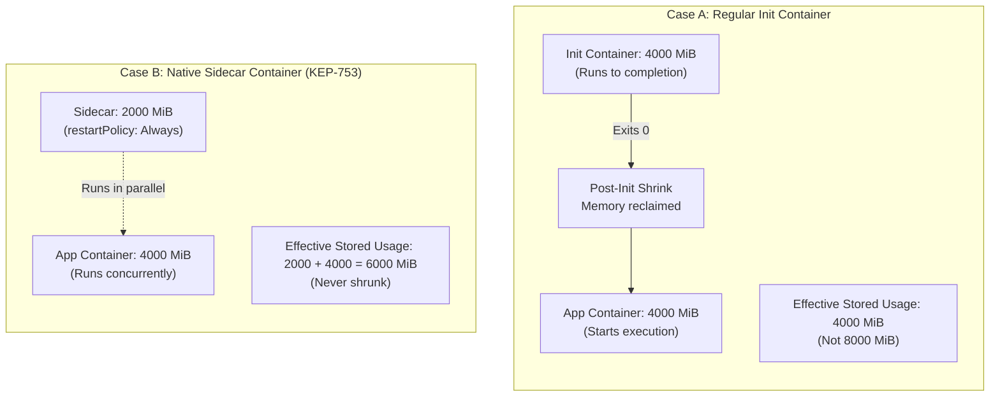
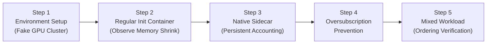

import Tabs from '@theme/Tabs'; import TabItem from '@theme/TabItem';

In Kubernetes 1.28+, Kubernetes introduced [Native Sidecar Containers (KEP-753)](https://kubernetes.io/docs/concepts/workloads/pods/sidecar-containers/) by allowing `restartPolicy: Always` inside `spec.initContainers`. While regular init containers run sequentially to completion before application containers start, native sidecars remain running for the entire lifecycle of the Pod.

When workloads request GPU resources (such as vGPU memory via `nvidia.com/gpumem`), how does HAMi prevent GPU oversubscription while still reclaiming memory when regular init containers finish?

This lab walks you through verifying **HAMi's GPU resource accounting engine** ([HAMi PR #2723](https://github.com/Project-HAMi/HAMi/pull/2723)). You will learn:

1. How HAMi performs **post-init memory shrinking** when regular init containers complete.
2. How HAMi enforces **cumulative accounting** for native sidecar containers so they never oversubscribe the GPU.
3. How declaration ordering impacts the peak allocation formula.

Best of all: **no physical NVIDIA GPU is required**. You can run this entire lab on your laptop using either [Lab 2: Local Fake GPU Setup](./local-fake-gpu.md) or [Lab 5: Fake-GPU Scheduling with nvml-mock](./nvml-mock.md).

---

## The Core Problem

Consider an 8000 MiB GPU slice shared across containers in a Pod:



### The Upstream Accounting Formula

Before PR #2723, HAMi classified containers solely by their position in `spec.initContainers`. Because sidecars are declared in `initContainers`, a naive `max(init, app)` calculation would treat a 2000 MiB sidecar and a 4000 MiB app container as requiring only `max(2000, 4000) = 4000 MiB`, under-accounting the real demand (6000 MiB) and allowing another pod to schedule and crash the card with CUDA out-of-memory errors.

HAMi addresses this by implementing an ordering-aware formula matching the Kubernetes API server specification per GPU device UUID:

$$\text{effective}[uuid] = \max\left( \max_{i \in \text{regular inits}} \left( \text{init}_i[uuid] + \sum_{j < i, j \in \text{sidecars}} \text{sidecar}_j[uuid] \right), \sum \text{apps}[uuid] + \sum \text{sidecars}[uuid] \right)$$

- **Regular init containers** contribute to the initial peak, but once they exit 0, HAMi shrinks stored usage to steady-state demand ($\sum \text{apps} + \sum \text{sidecars}$).
- **Native sidecars** (`restartPolicy: Always`) are summed cumulatively with app containers and are **never** dropped by the shrink gate.

---

## Lab Flow Overview



| Step | Focus | Verification Method |
| :-- | :-- | :-- |
| **Step 1** | Cluster Readiness | Confirm HAMi scheduler & fake GPU device registration |
| **Step 2** | Regular Init Container | Check `hami.io/vgpu-devices-allocated` before & after init exit 0 |
| **Step 3** | Native Sidecar Container | Verify cumulative addition of sidecar + app GPU memory |
| **Step 4** | Oversubscription Guard | Verify that competing pods exceeding card capacity stay `Pending` |
| **Step 5** | Mixed Workloads | Trace peak-to-steady-state transition with both sidecars and inits |

---

## Step 1: Environment Setup

Ensure you have a running Kubernetes cluster with HAMi installed. You can use an existing cluster or spin up a simulated GPU environment in minutes:

<Tabs groupId="env">
<TabItem value="lab2" label="Option A: OrbStack / fake-gpu-operator (Lab 2)" default>

Follow [Lab 2: Local Fake GPU Setup](./local-fake-gpu.md) to start a local cluster with simulated GPUs. Verify your node reports virtual GPU resources:

```bash
kubectl get nodes -o custom-columns=NAME:.metadata.name,GPU:.status.allocatable."nvidia\.com/gpu"
```

Expected output:

```text
NAME              GPU
orbstack-control  10
```

</TabItem>
<TabItem value="lab5" label="Option B: kind + nvml-mock (Lab 5)">

Follow [Lab 5: Fake-GPU Scheduling with nvml-mock](./nvml-mock.md) to bootstrap a kind cluster with simulated A100 GPUs:

```bash
kubectl get nodes -o custom-columns=NAME:.metadata.name,GPU:.status.allocatable."nvidia\.com/gpu"
```

Expected output:

```text
NAME                 GPU
nvml-mock-worker     80
```

</TabItem>
<TabItem value="real" label="Option C: Real NVIDIA GPU Cluster">

If you have a physical GPU cluster with HAMi installed, ensure node allocations are healthy:

```bash
kubectl get nodes -o custom-columns=NAME:.metadata.name,GPU:.status.allocatable."nvidia\.com/gpu"
```

</TabItem>
</Tabs>

Verify the HAMi scheduler and admission webhook are running:

```bash
kubectl get pods -n kube-system -l app.kubernetes.io/name=hami
```

---

## Step 2: Regular Init Container Memory Shrinking

In this step, we deploy a Pod with a regular init container (representing a model-weight downloader or converter) that requests 4000 MiB of GPU memory, followed by an application container that also requests 4000 MiB.

### 1. Inspect the Manifest

Review [`examples/20-init-sidecar-accounting/01-regular-init-container.yaml`](https://github.com/Project-HAMi/website/blob/master/tutorials/labs/examples/20-init-sidecar-accounting/01-regular-init-container.yaml):

```yaml
apiVersion: v1
kind: Pod
metadata:
  name: regular-init-pod
spec:
  restartPolicy: Never
  initContainers:
    - name: model-prep
      image: busybox:1.36
      command: ["sh", "-c", "echo 'Preparing model weights on GPU...' && sleep 15 && echo 'Done'"]
      env:
        - name: CUDA_DISABLE_CONTROL
          value: "true"
      resources:
        limits:
          nvidia.com/gpu: 1
          nvidia.com/gpumem: 4000 # 4000 MiB during init
  containers:
    - name: inference-app
      image: busybox:1.36
      command: ["sh", "-c", "echo 'Inference app running...' && sleep infinity"]
      env:
        - name: CUDA_DISABLE_CONTROL
          value: "true"
      resources:
        limits:
          nvidia.com/gpu: 1
          nvidia.com/gpumem: 4000 # 4000 MiB during execution
```

### 2. Deploy and Observe the Init Phase

Apply the manifest:

```bash
kubectl apply -f https://raw.githubusercontent.com/Project-HAMi/website/master/tutorials/labs/examples/20-init-sidecar-accounting/01-regular-init-container.yaml
```

Immediately check the Pod status:

```bash
kubectl get pod regular-init-pod
```

Expected output:

```text
NAME               READY   STATUS     RESTARTS   AGE
regular-init-pod   0/1     Init:0/1   0          3s
```

Now, check the HAMi allocation annotation while the init container is running:

```bash
kubectl get pod regular-init-pod -o jsonpath='{.metadata.annotations.hami\.io/vgpu-devices-allocated}' | jq .
```

Expected output shows entries for both the init container and the app container bound to the same GPU:

```json
[
  [
    {
      "id": "GPU-xxxx-xxxx",
      "devmem": 4000,
      "devcore": 0
    }
  ],
  [
    {
      "id": "GPU-xxxx-xxxx",
      "devmem": 4000,
      "devcore": 0
    }
  ]
]
```

### 3. Observe Post-Init Memory Shrinking

Wait 15 seconds for the init container to finish and the application container to start:

```bash
kubectl get pod regular-init-pod
```

Expected output:

```text
NAME               READY   STATUS    RESTARTS   AGE
regular-init-pod   1/1     Running   0          22s
```

Check the init container's termination status:

```bash
kubectl get pod regular-init-pod -o jsonpath='{.status.initContainerStatuses[0].state.terminated.exitCode}'
```

Expected output:

```text
0
```

Because `exitCode == 0`, HAMi's scheduler detects that the regular init container has completed. In `pkg/device/initContainer.go`, the **post-init shrink** fires:

- HAMi releases the 4000 MiB reserved for `model-prep`.
- The stored GPU usage on the node shrinks to **4000 MiB** (the application container's demand only), instead of accumulating to 8000 MiB!

Clean up the pod:

```bash
kubectl delete pod regular-init-pod
```

---

## Step 3: Native Sidecar Container GPU Accounting

Now let's examine a native sidecar container. A sidecar container is declared in `initContainers` but includes `restartPolicy: Always`. It starts before the application container and runs alongside it for the entire life of the Pod (e.g. an inference metrics proxy or token caching daemon).

### 1. Inspect the Manifest

Review [`examples/20-init-sidecar-accounting/02-native-sidecar-container.yaml`](https://github.com/Project-HAMi/website/blob/master/tutorials/labs/examples/20-init-sidecar-accounting/02-native-sidecar-container.yaml):

```yaml
apiVersion: v1
kind: Pod
metadata:
  name: native-sidecar-pod
spec:
  restartPolicy: Never
  initContainers:
    - name: proxy-sidecar
      image: busybox:1.36
      restartPolicy: Always # <-- KEP-753 Native Sidecar
      command: ["sh", "-c", "echo 'Inference proxy sidecar running...' && sleep infinity"]
      env:
        - name: CUDA_DISABLE_CONTROL
          value: "true"
      resources:
        limits:
          nvidia.com/gpu: 1
          nvidia.com/gpumem: 2000 # 2000 MiB
  containers:
    - name: inference-app
      image: busybox:1.36
      command: ["sh", "-c", "echo 'Main inference app running...' && sleep infinity"]
      env:
        - name: CUDA_DISABLE_CONTROL
          value: "true"
      resources:
        limits:
          nvidia.com/gpu: 1
          nvidia.com/gpumem: 4000 # 4000 MiB
```

### 2. Deploy and Inspect

Deploy the sidecar pod:

```bash
kubectl apply -f https://raw.githubusercontent.com/Project-HAMi/website/master/tutorials/labs/examples/20-init-sidecar-accounting/02-native-sidecar-container.yaml
```

Wait a few seconds for both containers to reach `Running`:

```bash
kubectl get pod native-sidecar-pod
```

Expected output:

```text
NAME                 READY   STATUS    RESTARTS   AGE
native-sidecar-pod   2/2     Running   0          10s
```

Notice `READY: 2/2`! Both the sidecar init container and the application container are running concurrently.

Inspect the allocation annotation:

```bash
kubectl get pod native-sidecar-pod -o jsonpath='{.metadata.annotations.hami\.io/vgpu-devices-allocated}' | jq .
```

Expected output:

```json
[
  [
    {
      "id": "GPU-xxxx-xxxx",
      "devmem": 2000,
      "devcore": 0
    }
  ],
  [
    {
      "id": "GPU-xxxx-xxxx",
      "devmem": 4000,
      "devcore": 0
    }
  ]
]
```

### 3. Verify Steady-State Preservation

Unlike regular init containers:

- `proxy-sidecar` does not terminate (`exitCode 0` never occurs).
- HAMi's shrink gate explicitly checks whether `restartPolicy` is set to `Always`: `isSidecar(c) := c.RestartPolicy != nil && *c.RestartPolicy == corev1.ContainerRestartPolicyAlways`.
- Because this container is a sidecar, HAMi's `SteadyStateDeviceUsage` retains its 2000 MiB quota. The effective usage remains:

  $$\text{effectiveUsage} = 2000\text{ MiB (sidecar)} + 4000\text{ MiB (app)} = 6000\text{ MiB}$$

---

## Step 4: Proving GPU Oversubscription Prevention

Why is this accounting critical? Let's demonstrate what happens when a competing pod attempts to schedule on the remaining GPU memory.

Assume our GPU has a total capacity of **8000 MiB**.

- `native-sidecar-pod` is currently consuming **6000 MiB** ($2000 + 4000$).
- Remaining capacity on the GPU is **2000 MiB**.

### 1. Attempt to Schedule a 4000 MiB Competing Pod

Review [`examples/20-init-sidecar-accounting/04-oversubscription-prevention.yaml`](https://github.com/Project-HAMi/website/blob/master/tutorials/labs/examples/20-init-sidecar-accounting/04-oversubscription-prevention.yaml):

```yaml
apiVersion: v1
kind: Pod
metadata:
  name: competing-workload-pod
spec:
  restartPolicy: Never
  containers:
    - name: worker
      image: busybox:1.36
      command: ["sh", "-c", "sleep infinity"]
      env:
        - name: CUDA_DISABLE_CONTROL
          value: "true"
      resources:
        limits:
          nvidia.com/gpu: 1
          nvidia.com/gpumem: 4000 # Requests 4000 MiB
```

Deploy the competing pod:

```bash
kubectl apply -f https://raw.githubusercontent.com/Project-HAMi/website/master/tutorials/labs/examples/20-init-sidecar-accounting/04-oversubscription-prevention.yaml
```

Check the pod status:

```bash
kubectl get pod competing-workload-pod
```

Expected output:

```text
NAME                     READY   STATUS    RESTARTS   AGE
competing-workload-pod   0/1     Pending   0          6s
```

Check the scheduling failure event:

```bash
kubectl describe pod competing-workload-pod | grep -A 3 Events:
```

Expected output:

```text
Events:
  Type     Reason            Age   From            Message
  ----     ------            ----  ----            -------
  Warning  FailedScheduling  10s   hami-scheduler  0/1 nodes are available: 1 Insufficient Memory (need 4000, free 2000).
```

:::tip[Before vs. After HAMi PR #2723]

- **Before PR #2723:** The sidecar was grouped under regular inits using $\max(2000, 4000) = 4000\text{ MiB}$. The scheduler would have believed $8000 - 4000 = 4000\text{ MiB}$ was free, incorrectly scheduling `competing-workload-pod` and causing physical CUDA OOM errors at runtime.
- **After PR #2723:** HAMi accounts the real $6000\text{ MiB}$ demand, recognizes that only $2000\text{ MiB}$ is free, and keeps the competing workload safely in `Pending` state.

:::

Clean up the competing pod:

```bash
kubectl delete pod competing-workload-pod
kubectl delete pod native-sidecar-pod
```

---

## Step 5: Mixed Workloads & Declaration Ordering

What happens when a Pod uses **both** a native sidecar and a regular init container?

According to Kubernetes upstream specifications, init containers execute in declaration order:

- Any native sidecar declared _before_ a regular init container is already active when that init container executes.
- Therefore, the init container's peak demand must include the preceding sidecars!

### 1. Inspect the Mixed Manifest

Review [`examples/20-init-sidecar-accounting/03-mixed-workload-ordering.yaml`](https://github.com/Project-HAMi/website/blob/master/tutorials/labs/examples/20-init-sidecar-accounting/03-mixed-workload-ordering.yaml):

```yaml
apiVersion: v1
kind: Pod
metadata:
  name: mixed-workload-pod
spec:
  restartPolicy: Never
  initContainers:
    # 1. Preceding Sidecar: 2000 MiB (starts and runs indefinitely)
    - name: cache-sidecar
      image: busybox:1.36
      restartPolicy: Always
      command: ["sh", "-c", "sleep infinity"]
      env:
        - name: CUDA_DISABLE_CONTROL
          value: "true"
      resources:
        limits:
          nvidia.com/gpu: 1
          nvidia.com/gpumem: 2000

    # 2. Regular Init: 5000 MiB (runs 15 seconds, then exits 0)
    - name: weights-loader
      image: busybox:1.36
      command: ["sh", "-c", "sleep 15"]
      env:
        - name: CUDA_DISABLE_CONTROL
          value: "true"
      resources:
        limits:
          nvidia.com/gpu: 1
          nvidia.com/gpumem: 5000

  # 3. Main Application: 4000 MiB
  containers:
    - name: serving-engine
      image: busybox:1.36
      command: ["sh", "-c", "sleep infinity"]
      env:
        - name: CUDA_DISABLE_CONTROL
          value: "true"
      resources:
        limits:
          nvidia.com/gpu: 1
          nvidia.com/gpumem: 4000
```

### 2. Calculate the Transition

Applying the ordering-aware formula:

$$\text{Peak Phase} = \max(\text{weights-loader} + \text{cache-sidecar},\; \text{serving-engine} + \text{cache-sidecar}) = \max(5000 + 2000, 4000 + 2000) = 7000\text{ MiB}$$

$$\text{Steady-State Phase} = \text{serving-engine} + \text{cache-sidecar} = 4000 + 2000 = 6000\text{ MiB}$$

### 3. Deploy and Verify

Deploy the mixed workload:

```bash
kubectl apply -f https://raw.githubusercontent.com/Project-HAMi/website/master/tutorials/labs/examples/20-init-sidecar-accounting/03-mixed-workload-ordering.yaml
```

During the first 15 seconds:

- `cache-sidecar` is running.
- `weights-loader` is running.
- HAMi accounts **7000 MiB** peak demand.

After 15 seconds:

- `weights-loader` exits with code 0.
- `serving-engine` starts.
- HAMi fires the post-init shrink, releasing the 5000 MiB from `weights-loader` while preserving `cache-sidecar` (2000 MiB) + `serving-engine` (4000 MiB) = **6000 MiB** steady-state demand!

Verify both running containers:

```bash
kubectl get pod mixed-workload-pod
```

Expected output:

```text
NAME                 READY   STATUS    RESTARTS   AGE
mixed-workload-pod   2/2     Running   0          25s
```

Clean up:

```bash
kubectl delete pod mixed-workload-pod
```

---

## Key Takeaways

| Feature | Regular Init Container | Native Sidecar Container (`restartPolicy: Always`) |
| :-- | :-- | :-- |
| **Declaration** | `spec.initContainers` | `spec.initContainers` with `restartPolicy: Always` |
| **Lifecycle** | Runs sequentially to completion | Starts before apps, runs for Pod lifetime |
| **Accounting Rule** | Evaluated in `init_peak` | Added cumulatively to app containers ($\sum \text{sidecar} + \sum \text{app}$) |
| **Memory Shrink** | Reclaimed when `exitCode == 0` | **Never** reclaimed; held for Pod lifetime |
| **Upstream Alignment** | Matches Kubernetes Pod init semantics | Full conformance with KEP-753 resource model |

---

## References

- [HAMi PR #2723: Account Native Sidecar Container GPU Resources](https://github.com/Project-HAMi/HAMi/pull/2723)
- [HAMi PR #1773: Correct Init Container Resource Calculation](https://github.com/Project-HAMi/HAMi/pull/1773)
- [Sidecar Container GPU Resource Accounting Design Doc](../../docs/developers/sidecar-container-design.md)
- [Kubernetes KEP-753: Native Sidecar Containers](https://github.com/kubernetes/enhancements/tree/master/keps/sig-node/753-sidecar-containers)
