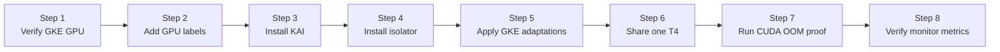

This lab deploys KAI Scheduler v0.17.0 and `kai-resource-isolator` 1.1.0-chart on GKE, then proves that two Pods sharing one Tesla T4 cannot allocate beyond their individual memory quotas. It also documents the GKE 1.35/COS/CDI compatibility workarounds observed in the verified environment.

:::warning Environment-specific workarounds

The RuntimeClass, Kyverno, host path, PriorityClass, and privileged-container changes in this lab are specific to the verified GKE 1.35/COS/CDI path. They are not the standard KAI + HAMi-core installation. Apply each workaround only after confirming the matching symptom.

:::

## What You'll Learn

- enable KAI GPU sharing and its `hamicore` binder plugin;
- adapt `kai-resource-isolator` to GKE's read-only root filesystem and CDI device injection;
- prove that two Pods use the same physical GPU and see separate 4147 MiB ceilings; and
- use `cudaMalloc` to prove in-quota success, over-quota failure, and cross-Pod independence.

## Lab Overview



## Prerequisites

- A GCP project with the GKE and Compute Engine APIs enabled.
- A GKE 1.35 cluster with COS nodes and at least one NVIDIA T4. The verified cluster had three `n1-standard-2` nodes, each with one T4.
- The GKE-managed NVIDIA driver, device plugin, and container toolkit. Do not install GPU Operator on top of the GKE-managed driver.
- `gcloud`, a `kubectl` version within one minor release of the GKE API server, and Helm 3 or 4 with cluster-admin permissions.
- The files under [`tutorials/labs/examples/12-kai-scheduler-hami-gke/`](https://github.com/Project-HAMi/website/tree/master/tutorials/labs/examples/12-kai-scheduler-hami-gke).

The verified cluster ran GKE `1.35.6-gke.1250000` on both the control plane and nodes. Because GKE patch releases age out, first choose an available 1.35 version in your zone, then create the cluster with it:

```bash
export GKE_VERSION=$(gcloud container get-server-config \
  --zone=asia-northeast1-a \
  --format='value(validMasterVersions)' | tr ';' '\n' | grep '^1\.35\.' | head -1)
test -n "$GKE_VERSION"

gcloud container clusters create kai-hami-test --zone=asia-northeast1-a \
  --cluster-version="$GKE_VERSION" \
  --machine-type=n1-standard-2 --num-nodes=3 \
  --image-type=COS_CONTAINERD \
  --accelerator=type=nvidia-tesla-t4,count=1,gpu-driver-version=default
gcloud container clusters get-credentials kai-hami-test \
  --zone=asia-northeast1-a
```

GPU nodes are billable. Run the cleanup section when you finish.

:::note About the output blocks

The output blocks below were captured from the verified run on 2026-08-12. Pod suffixes, ages, IP addresses, and node names are environment-specific; compare the component names, readiness, placement, and measured values.

:::

## Step 1: Verify the GKE GPU Stack

Confirm that each GPU node reports one extended resource:

```bash
kubectl get nodes \
  -o custom-columns="NAME:.metadata.name,GPU:.status.capacity.nvidia\.com/gpu,ACCEL:.metadata.labels.cloud\.google\.com/gke-accelerator"
```

The verified cluster reported three T4 nodes:

```plaintext
NAME                                           GPU   ACCEL
gke-kai-hami-test-default-pool-370c394b-fxh2   1     nvidia-tesla-t4
gke-kai-hami-test-default-pool-370c394b-pm4j   1     nvidia-tesla-t4
gke-kai-hami-test-default-pool-370c394b-r8n5   1     nvidia-tesla-t4
```

If `GPU` is empty and the node has `gke-no-default-nvidia-gpu-device-plugin=true`, enable the GKE device plugin:

```bash
kubectl label node -l cloud.google.com/gke-accelerator=nvidia-tesla-t4 \
  gke-no-default-nvidia-gpu-device-plugin-
```

Run an ordinary whole-GPU Pod before adding KAI:

```bash
kubectl apply -f - <<'EOF'
apiVersion: v1
kind: Pod
metadata:
  name: gpu-smi-test
spec:
  restartPolicy: Never
  containers:
    - name: cuda
      image: nvidia/cuda:12.4.1-base-ubuntu22.04
      command: ["nvidia-smi"]
      resources:
        limits:
          nvidia.com/gpu: 1
EOF
kubectl wait --for=jsonpath='{.status.phase}'=Succeeded \
  pod/gpu-smi-test --timeout=180s
kubectl logs gpu-smi-test
kubectl delete pod gpu-smi-test
```

The relevant lines in the verified `nvidia-smi` output were:

```plaintext
GPU  Name        Persistence-M | Bus-Id        Disp.A | Volatile Uncorr. ECC
  0  Tesla T4               Off | 00000000:00:04.0 Off |                    0
...                         0MiB / 15360MiB
```

The driver patch may differ, but the workload image must be compatible with it. Record the reported memory value for Step 2.

## Step 2: Add the GPU Labels KAI Reads

GKE's default device plugin does not provide all GPU Feature Discovery labels. KAI reads `nvidia.com/gpu.memory` when it registers the node, so add the labels before installing KAI:

```bash
kubectl label node -l cloud.google.com/gke-accelerator=nvidia-tesla-t4 \
  nvidia.com/gpu.memory=15360 \
  nvidia.com/gpu.product=NVIDIA-Tesla-T4 \
  nvidia.com/gpu.count=1 \
  nvidia.com/gpu.present=true --overwrite

kubectl get nodes -o custom-columns=\
'NAME:.metadata.name,GPU.MEMORY:.metadata.labels.nvidia\.com/gpu\.memory,GPU.PRODUCT:.metadata.labels.nvidia\.com/gpu\.product'
```

The verified nodes then exposed the values KAI reads:

```plaintext
NAME                                           GPU.MEMORY   GPU.PRODUCT
gke-kai-hami-test-default-pool-370c394b-fxh2   15360        NVIDIA-Tesla-T4
gke-kai-hami-test-default-pool-370c394b-pm4j   15360        NVIDIA-Tesla-T4
gke-kai-hami-test-default-pool-370c394b-r8n5   15360        NVIDIA-Tesla-T4
```

Use the value reported by `nvidia-smi`, not the T4's marketed 16 GiB. If you add the labels after KAI starts, restart `kai-scheduler` so it refreshes its node cache.

## Step 3: Install KAI Scheduler and Its Default Queues

Install KAI v0.17.0 with GPU sharing, HAMi-core integration, and CDI enabled:

```bash
helm install kai-scheduler \
  oci://ghcr.io/kai-scheduler/kai-scheduler/kai-scheduler \
  --namespace kai-scheduler --create-namespace \
  --version v0.17.0 \
  --set global.gpuSharing=true \
  --set binder.plugins.hamicore.enabled=true \
  --set-string binder.plugins.gpusharing.arguments.cdiEnabled=true

kubectl -n kai-scheduler wait --for=condition=available \
  --timeout=180s deploy --all
kubectl -n kai-scheduler wait --for=condition=Ready \
  --timeout=300s config/kai-config
kubectl get pods -n kai-scheduler
kubectl get queues
```

All seven KAI control-plane components were running in the verified installation. Generated Pod suffixes will differ:

```plaintext
NAME                                      READY   STATUS    RESTARTS   AGE
admission-759b9bb99c-...                   1/1     Running   0          4m
binder-54665cc5d9-...                      1/1     Running   0          4m
kai-operator-997c6886c-...                 1/1     Running   0          4m
kai-scheduler-default-d85d7dbdf-...        1/1     Running   0          4m
pod-grouper-68f4fb47-...                   1/1     Running   0          4m
podgroup-controller-5947b5b4dd-...         1/1     Running   0          4m
queue-controller-6cc8c844c8-...            1/1     Running   0          4m
```

KAI v0.17.0 also created its default parent and child queues automatically:

```plaintext
NAME                   PARENT
default-parent-queue
default-queue          default-parent-queue
```

:::important `cdiEnabled` must be a string

Use `--set-string`, not `--set`. KAI v0.17.0's Helm values accept either representation, but the generated `Config` CRD field is a string. Plain `--set ...=true` renders a boolean and makes the `kai-config-deployer` hook fail with `cdiEnabled ... must be of type string: "boolean"`. The command above was rendered and accepted by the current GKE API server with server-side dry-run.

:::

## Step 4: Install kai-resource-isolator

COS mounts the root filesystem read-only, so write HAMi-core under GKE's writable NVIDIA directory:

```bash
helm install kai-resource-isolator \
  oci://docker.io/projecthami/kai-resource-isolator \
  --namespace kai-resource-isolator --create-namespace \
  --version 1.1.0-chart \
  --set paths.containerVgpuMount=/home/kubernetes/bin/nvidia/vgpu \
  --set-string librarySync.priorityClassName= \
  --set-string monitor.priorityClassName= \
  --set monitor.enabled=true
```

`containerVgpuMount` is the effective Chart value for the libsync destination, preload file, webhook injection path, and monitor cache. Do not use `paths.hostInstallBase`: it is declared in 1.1.0-chart's values but is not referenced by that Chart's templates. The two empty PriorityClass values prevent GKE from rejecting `system-node-critical` Pods outside a system namespace.

Verify the rendered paths and wait for the components:

```bash
kubectl get cm kai-resource-isolator-ldpreload \
  -n kai-resource-isolator -o jsonpath='{.data.ld\.so\.preload}'
kubectl rollout status ds/kai-resource-isolator-libsync \
  -n kai-resource-isolator --timeout=300s
kubectl rollout status ds/kai-resource-isolator-monitor \
  -n kai-resource-isolator --timeout=300s
kubectl rollout status deploy/kai-resource-isolator-webhook \
  -n kai-resource-isolator --timeout=300s
kubectl get pods -n kai-resource-isolator
```

The path and component status in the verified run were:

```plaintext
/home/kubernetes/bin/nvidia/vgpu/libvgpu.so

NAME                                        READY   STATUS    RESTARTS   AGE
kai-resource-isolator-libsync-...           1/1     Running   0          2m
kai-resource-isolator-libsync-...           1/1     Running   0          2m
kai-resource-isolator-libsync-...           1/1     Running   0          2m
kai-resource-isolator-monitor-26bj8         1/1     Running   0          2m
kai-resource-isolator-monitor-hf67f         1/1     Running   0          2m
kai-resource-isolator-monitor-tnj9l         1/1     Running   0          2m
kai-resource-isolator-webhook-...           1/1     Running   0          2m
```

There must be one libsync and one monitor Pod per GPU node, plus a ready webhook Pod.

## Step 5: Adapt the GKE CDI Device Path

The verified GKE 1.35 nodes used CDI and did not register an `nvidia` runtime handler, while KAI reservation Pods referenced `runtimeClassName: nvidia`. Create the compatibility RuntimeClass only if it is absent:

```bash
kubectl get runtimeclass nvidia || kubectl apply \
  -f tutorials/labs/examples/12-kai-scheduler-hami-gke/02-runtimeclass.yaml
```

GKE's device plugin injects devices only into Pods requesting `nvidia.com/gpu`. KAI shared Pods request `gpu-memory` instead, so the verified environment needed explicit device and library mounts. Install Kyverno and apply the two policies:

```bash
helm repo add kyverno https://kyverno.github.io/kyverno/
helm repo update
helm install kyverno kyverno/kyverno \
  --namespace kyverno --create-namespace
kubectl wait -n kyverno --for=condition=Ready pod \
  -l app.kubernetes.io/component=admission-controller --timeout=300s
kubectl apply \
  -f tutorials/labs/examples/12-kai-scheduler-hami-gke/03-gke-policies.yaml
kubectl wait --for=condition=Ready --timeout=180s \
  clusterpolicy/inject-nvidia-library-path \
  clusterpolicy/inject-gpu-devices
kubectl get runtimeclass nvidia
kubectl get pods -n kyverno
kubectl get clusterpolicy \
  inject-nvidia-library-path inject-gpu-devices
```

The compatibility objects and Kyverno controllers were ready in the verified run:

```plaintext
NAME     HANDLER   AGE
nvidia   runc      3m

NAME                                             READY   STATUS    RESTARTS   AGE
kyverno-admission-controller-7cdf5b9c-...         1/1     Running   0          2m
kyverno-background-controller-7b54965bf9-...      1/1     Running   0          2m
kyverno-cleanup-controller-59c8fdfb66-...         1/1     Running   0          2m
kyverno-reports-controller-5c96886c9-...          1/1     Running   0          2m

NAME                          ADMISSION   BACKGROUND   READY
inject-nvidia-library-path    true        true         true
inject-gpu-devices            true        true         true
```

The first policy adds the NVML library path to reservation Pods. The second mounts `/dev/nvidia*`, `nvidia-smi`, and NVIDIA libraries into shared Pods. In this workaround path, shared Pods also require `privileged: true`.

:::caution Security boundary

This lab proves CUDA API-level memory enforcement. It is not a MIG-like hardware security boundary, and the GKE workaround uses privileged workload containers. Do not treat it as an untrusted multi-tenant security design.

:::

## Step 6: Place Two Pods on One T4

Choose an otherwise idle T4 node with exactly one GPU. Do not select a node that already runs a `gpu-memory` workload: two 4 GiB Lab Pods need at least 8 GiB of unallocated KAI memory on that card. List the candidates and current Pod placement first:

```bash
kubectl get nodes -l cloud.google.com/gke-accelerator=nvidia-tesla-t4
kubectl get pods -A -o wide

# Replace this value with one idle, single-T4 node from the output above.
export TEST_NODE=<your-idle-t4-node>
test "$(kubectl get node "$TEST_NODE" \
  -o jsonpath='{.status.capacity.nvidia\.com/gpu}')" = "1"
kubectl label node "$TEST_NODE" hami.run/lab-12=true --overwrite

kubectl create configmap kai-hami-lab12-source \
  --from-file=memory-limit.cu=tutorials/labs/examples/12-kai-scheduler-hami-gke/memory-limit.cu \
  --dry-run=client -o yaml | kubectl apply -f -
kubectl apply \
  -f tutorials/labs/examples/12-kai-scheduler-hami-gke/04-shared-pods.yaml
kubectl wait --for=condition=Ready \
  pod/kai-hami-lab12-a pod/kai-hami-lab12-b \
  --timeout=10m
```

Verify the node placement, then read the injected quota, physical UUID, and visible memory from each Pod's startup log:

```bash
kubectl get pod kai-hami-lab12-a kai-hami-lab12-b -o wide
for pod in kai-hami-lab12-a kai-hami-lab12-b; do
  echo "=== $pod ==="
  kubectl logs "$pod"
done
```

Both Pods were ready on the same node in the verified run:

```plaintext
NAME                READY   STATUS    RESTARTS   IP           NODE
kai-hami-lab12-a    1/1     Running   0          10.84.2.66   gke-kai-hami-test-default-pool-370c394b-pm4j
kai-hami-lab12-b    1/1     Running   0          10.84.2.67   gke-kai-hami-test-default-pool-370c394b-pm4j
```

Their startup logs both reported:

```plaintext
limit=4147m
GPU-9acc8878-3967-5fb4-c534-43d6fd820fa6, 4147 MiB
```

The matching UUID proves both Pods use the same T4; the 4147 MiB value is KAI's two-decimal fraction rounding of a 4096 MiB request on a 15360 MiB card.

## Step 7: Prove the CUDA Memory Ceiling

The source ConfigMap created in Step 6 is mounted at `/lab-source`. On startup, each Pod compiles the program, holds a successful 3 GiB allocation for 30 seconds, and attempts to allocate another 2 GiB. After that proof passes, it starts the same program again and keeps 3 GiB allocated so Step 8 can verify the live monitor gauges. The readiness probe succeeds only after both phases start successfully.

Inspect the test interval and result recorded in each Pod log:

```bash
for pod in kai-hami-lab12-a kai-hami-lab12-b; do
  kubectl logs "$pod" | grep -E \
    'test_(start|end)=|allocate |PASS:'
done
```

The captured intervals overlapped, and each Pod returned `PASS`:

```plaintext
=== kai-hami-lab12-a ===
test_start=2026-08-12T05:11:13Z
allocate 3 GiB: no error
allocate another 2 GiB: out of memory
PASS: in-quota allocation succeeded and over-quota allocation failed
test_end=2026-08-12T05:11:44Z

=== kai-hami-lab12-b ===
test_start=2026-08-12T05:11:11Z
allocate 3 GiB: no error
allocate another 2 GiB: out of memory
PASS: in-quota allocation succeeded and over-quota allocation failed
test_end=2026-08-12T05:11:43Z
```

Compare `test_start` and `test_end`: the two 30-second intervals must overlap. In the verified run, both Pods returned `PASS` while holding 3 GiB concurrently. HAMi-core logged `Device 0 OOM 5475663872 / 4348444672` for each Pod's 5 GiB cumulative request. Running the proof as the container startup command also avoids making the result depend on a long-lived `kubectl exec` WebSocket.

## Step 8: Verify the Monitor Metrics

The monitor is a DaemonSet: each instance reads the HAMi shared-memory cache on its own node. A Service can forward to a monitor on a different node and return no series for these Pods, so query the monitor instance on the workload node directly. Derive that node again from the running Pod instead of relying on the shell variable exported in Step 6.

Create a short-lived curl Pod that reads that monitor's `:9394/metrics` endpoint:

```bash
export TEST_NODE=$(kubectl get pod kai-hami-lab12-a \
  -o jsonpath='{.spec.nodeName}')
test -n "$TEST_NODE"

export MONITOR_IP=$(kubectl get pods -n kai-resource-isolator \
  -l app.kubernetes.io/component=kai-vgpu-monitor \
  --field-selector="spec.nodeName=$TEST_NODE" \
  -o jsonpath='{range .items[*]}{.status.podIP}{"\n"}{end}' | head -n 1)

if test -z "$MONITOR_IP"; then
  echo "No monitor Pod is running on $TEST_NODE" >&2
  kubectl get pods -n kai-resource-isolator \
    -l app.kubernetes.io/component=kai-vgpu-monitor -o wide
  exit 1
fi

kubectl delete pod lab12-monitor-check --ignore-not-found
kubectl run lab12-monitor-check \
  --image=curlimages/curl:8.15.0 --restart=Never \
  --command -- sh -lc \
  "curl -fsS http://$MONITOR_IP:9394/metrics"
kubectl wait --for=jsonpath='{.status.phase}'=Succeeded \
  pod/lab12-monitor-check --timeout=180s
kubectl logs lab12-monitor-check | grep -E \
  '^hami_vgpu_memory_(used|limit)_bytes.*pod="kai-hami-lab12-[ab]"'
```

The verified endpoint returned one `used` and one `limit` series for each Pod:

```plaintext
hami_vgpu_memory_limit_bytes{...,pod="kai-hami-lab12-a",...} 4.348444672e+09
hami_vgpu_memory_limit_bytes{...,pod="kai-hami-lab12-b",...} 4.348444672e+09
hami_vgpu_memory_used_bytes{...,pod="kai-hami-lab12-a",...} 3.328180224e+09
hami_vgpu_memory_used_bytes{...,pod="kai-hami-lab12-b",...} 3.328180224e+09
```

The limit equals 4147 MiB in bytes. The used value is slightly above 3 GiB because it includes CUDA context and allocator overhead. This proves the monitor found both per-container caches and exported live usage rather than only serving an empty Prometheus endpoint.

## Troubleshooting

| Symptom | Cause in the verified environment | Action |
| :-- | :-- | :-- |
| Shared Pod stays Pending with `didn't have enough resources: GPU memory` | `nvidia.com/gpu.memory` was missing when KAI cached the node | Add the label and restart `kai-scheduler` |
| Queue object is rejected | KAI admission webhook is not ready | Wait for KAI Deployments, then apply the queues |
| `RuntimeClass "nvidia" not found` | GKE CDI uses `runc` and has no NVIDIA handler | Apply `02-runtimeclass.yaml` |
| Reservation Pod reports `ERROR_LIBRARY_NOT_FOUND` | NVML exists under `/usr/local/nvidia/lib64` but is not in the search path | Apply the Kyverno library-path policy |
| Shared Pod cannot see `/dev/nvidia*` | It requests `gpu-memory`, so the GKE device plugin does not run Allocate | Apply the Kyverno device-mount policy |
| libsync reports `Read-only file system` | COS root filesystem is read-only | Set `paths.containerVgpuMount=/home/kubernetes/bin/nvidia/vgpu` |
| `libvgpu.so` cannot be preloaded | The effective mount path still points to `/usr/local/vgpu` | Reinstall with the verified `containerVgpuMount` value |
| DaemonSet rejected for `system-node-critical` | GKE PriorityClass quota blocks user namespaces | Set both Chart PriorityClass values to an empty string |
| `CUDA driver version is insufficient` | CUDA image is newer than the node driver supports | Use the verified CUDA 12.4.1 image or another compatible version |
| `kubectl exec` ends with WebSocket EOF | Control-plane exec stream reset or unsupported client/server skew | Use a compatible `kubectl`; the Lab proof runs at container startup and is read with `kubectl logs` |
| Monitor lookup returns no Pod or no series | `$TEST_NODE` was stale, or the monitor is absent from the workload node | Derive the node from `kai-hami-lab12-a`, then inspect the monitor DaemonSet with `kubectl get pods -n kai-resource-isolator -l app.kubernetes.io/component=kai-vgpu-monitor -o wide` |

## Cleanup

Remove the workload and test label:

```bash
kubectl delete \
  -f tutorials/labs/examples/12-kai-scheduler-hami-gke/04-shared-pods.yaml
kubectl delete pod lab12-monitor-check --ignore-not-found
kubectl delete configmap kai-hami-lab12-source --ignore-not-found
kubectl label node "$TEST_NODE" hami.run/lab-12- --overwrite
```

If this cluster is dedicated to the lab, remove the remaining components:

```bash
kubectl delete \
  -f tutorials/labs/examples/12-kai-scheduler-hami-gke/03-gke-policies.yaml
helm uninstall kyverno -n kyverno
helm uninstall kai-resource-isolator -n kai-resource-isolator
kubectl delete queues default-queue default-parent-queue --ignore-not-found
helm uninstall kai-scheduler -n kai-scheduler
```

The explicit Queue deletion is intentional: KAI annotates its default queues with `helm.sh/resource-policy: keep`, so Helm preserves them during uninstall.

Delete `02-runtimeclass.yaml` only if Step 5 created it; preserve a RuntimeClass that already belonged to the cluster:

```bash
kubectl delete \
  -f tutorials/labs/examples/12-kai-scheduler-hami-gke/02-runtimeclass.yaml
```

Delete the GKE cluster if you created it only for this exercise:

```bash
gcloud container clusters delete kai-hami-test \
  --zone=asia-northeast1-a
```

## What This Lab Proved

| Claim | Evidence |
| :-- | :-- |
| KAI schedules two fractional workloads onto one T4 | Same node and same GPU UUID in both Pods |
| HAMi-core changes the visible per-Pod memory ceiling | Both Pods report 4147 MiB instead of 15360 MiB |
| The ceiling is enforced, not only displayed | 3 GiB succeeds; the cumulative 5 GiB request returns CUDA OOM |
| One Pod cannot consume the other's quota | Pod B succeeds while Pod A holds 3 GiB |
| The optional monitor reads per-container caches | `:9394/metrics` reports both Pods' 4147 MiB limits and live 3 GiB usage |

## Next Steps

- Read [GPU Memory Hard Isolation with KAI Scheduler and HAMi](/blog/kai-scheduler-hami-gpu-memory-hard-isolation) for the architecture and integration background.
- Compare this path with [Lab 3: GPU Partitioning](./gpu-partitioning.md) and [Lab 7: k3s Isolation](./hami-isolation-k3s.md).
- Track upstream KAI and `kai-resource-isolator` releases; once GKE CDI support is native, remove the matching workaround from this lab.
