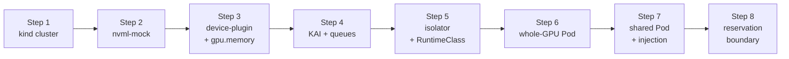

This lab installs **NVIDIA KAI Scheduler** with the `hamicore` plugin and the [kai-resource-isolator](https://github.com/Project-HAMi/KAI-resource-isolator) on top of the **nvml-mock** environment from [Lab 5](./nvml-mock.md) — 8 fake A100 GPUs in a local **kind** cluster — then walks the full control plane: whole-GPU scheduling, fractional GPU-memory accounting, and HAMi-core (`libvgpu.so`) injection. KAI owns scheduling and GPU sharing; HAMi-core is brought in only for GPU-memory isolation, exactly as the two projects divide the work in production. Because a fake GPU has no CUDA/NVML runtime inside pods, the lab verifies the scheduling and injection control plane and stops, on purpose, at KAI's reservation-Pod boundary (Step 8).

:::note

nvml-mock provides GPU discovery and node-level NVML, so KAI scheduling, memory accounting, and the isolator's injection all work. It does **not** inject `libnvidia-ml.so` into arbitrary pods, so a _running_ shared Pod, `nvidia-smi` memory slicing, and `cudaMalloc` enforcement still require a real GPU (or the full NVIDIA container toolkit / CDI). Step 8 shows exactly where that line is.

:::

## What You'll Learn

- How the NVIDIA device-plugin advertises whole GPUs (`nvidia.com/gpu: 8`) against nvml-mock
- Why KAI needs the `nvidia.com/gpu.memory` label — and why it must exist before KAI reads the node
- How KAI queues, the `hamicore` plugin, and the isolator webhook fit together
- The exact point where GPU _sharing_ needs real (or toolkit-injected) NVML, and why

## Lab Overview



## Prerequisites

- A Linux or macOS laptop with **Docker** running and at least 4 CPU / 8 GB RAM free
- `kind` v0.20+, `kubectl` v1.31+, `helm` 3.x, `git`, `go` (install commands in [Lab 5](./nvml-mock.md))
- **KAI Scheduler ≥ v0.17.0** (required by the `hamicore` plugin and the `1.1.0-chart` isolator)
- Access to GitHub, GHCR, Docker Hub, and NVCR/NGC (`nvcr.io` — the device-plugin image)

## Step 1: Create the kind Cluster

Bootstrap a single-node cluster and store its node name in a variable that later steps reuse.

```bash
kind create cluster --name kai-hami-test
NODE_NAME=$(kubectl get nodes -o jsonpath='{.items[0].metadata.name}')
echo "NODE_NAME=${NODE_NAME}"
```

```plaintext
NODE_NAME=kai-hami-test-control-plane
```

## Step 2: Deploy nvml-mock

nvml-mock provides a fake `libnvidia-ml.so`, virtual devices, and PCI topology so the node reports 8 A100 GPUs. This is the same simulator as Lab 5.

```bash
git clone https://github.com/NVIDIA/k8s-test-infra.git
cd k8s-test-infra
docker build -t nvml-mock:local -f deployments/nvml-mock/Dockerfile .
kind load docker-image nvml-mock:local --name kai-hami-test

helm install nvml-mock oci://ghcr.io/nvidia/k8s-test-infra/chart/nvml-mock \
  --set image.repository=nvml-mock --set image.tag=local \
  --wait --timeout 120s

kubectl get node ${NODE_NAME} \
  -o custom-columns=NAME:.metadata.name,GPU_PRESENT:.metadata.labels.nvidia\\.com/gpu\\.present
```

```plaintext
NAME                          GPU_PRESENT
kai-hami-test-control-plane   true
```

> `GPU_PRESENT=true` means the node is now a GPU node. If it is empty, the nvml-mock pods have not finished starting — wait and re-run the last command.

## Step 3: Install the Device-Plugin and Publish GPU Memory

KAI schedules against `nvidia.com/gpu`, so install the NVIDIA device-plugin. Use nvml-mock's own manifest — it hostPath-mounts `/var/lib/nvml-mock` and passes the right driver-root and NVML discovery flags, which the plain Helm chart does not (that fails with `ERROR_LIBRARY_NOT_FOUND`). Then publish per-GPU memory, which KAI needs to turn a `gpu-memory` request into a fraction.

```bash
kubectl apply -f https://raw.githubusercontent.com/NVIDIA/k8s-test-infra/main/tests/e2e/device-plugin-mock.yaml
kubectl -n kube-system wait --for=condition=ready \
  pod -l name=nvidia-device-plugin-mock --timeout=120s

kubectl get node ${NODE_NAME} -o jsonpath='{.status.allocatable.nvidia\.com/gpu}{"\n"}'

kubectl label node ${NODE_NAME} \
  nvidia.com/gpu.memory=40960 \
  nvidia.com/gpu.product=NVIDIA-A100-SXM4-40GB \
  nvidia.com/gpu.count=8 --overwrite
```

```plaintext
8
node/kai-hami-test-control-plane labeled
```

> `8` (not `80`) confirms KAI gets 8 whole GPUs to share itself. Apply the `nvidia.com/gpu.memory` label **before** installing KAI: KAI caches per-GPU memory when it first registers the node, so a label added later leaves memory at 0 and every shared Pod stays `Pending` with `didn't have enough resources: GPU memory` until the scheduler is restarted.

## Step 4: Install KAI Scheduler and Create Queues

`global.gpuSharing=true` enables GPU sharing; `binder.plugins.hamicore.enabled=true` makes KAI inject `CUDA_DEVICE_MEMORY_LIMIT` into shared containers. KAI will not schedule a Pod until the queue named in its `kai.scheduler/queue` label exists.

```bash
helm install kai-scheduler oci://ghcr.io/kai-scheduler/kai-scheduler/kai-scheduler \
  --namespace kai-scheduler --create-namespace \
  --set global.gpuSharing=true \
  --set binder.plugins.hamicore.enabled=true \
  --version v0.17.0

# Wait for KAI (esp. the admission webhook) to be ready before creating Queues,
# or the Queue apply can be rejected while certs are still settling.
kubectl -n kai-scheduler wait --for=condition=available --timeout=180s deploy --all

kubectl apply -f - <<'EOF'
apiVersion: scheduling.run.ai/v2
kind: Queue
metadata:
  name: default
spec:
  resources:
    cpu:    { quota: -1, limit: -1, overQuotaWeight: 1 }
    memory: { quota: -1, limit: -1, overQuotaWeight: 1 }
    gpu:    { quota: -1, limit: -1, overQuotaWeight: 1 }
---
apiVersion: scheduling.run.ai/v2
kind: Queue
metadata:
  name: default-queue
spec:
  parentQueue: default
  resources:
    cpu:    { quota: -1, limit: -1, overQuotaWeight: 1 }
    memory: { quota: -1, limit: -1, overQuotaWeight: 1 }
    gpu:    { quota: -1, limit: -1, overQuotaWeight: 1 }
EOF

kubectl get pods -n kai-scheduler
kubectl get queues
```

```plaintext
NAME                                     READY   STATUS    RESTARTS   AGE
admission-759b9bb99c-4wx9q               1/1     Running   0          2m
binder-69bf5f648-k572n                   1/1     Running   0          2m
kai-operator-997c6886c-dthws             1/1     Running   0          2m
kai-scheduler-default-5dfbc85f96-6kp9v   1/1     Running   0          2m
pod-grouper-68f4fb47-5q99f               1/1     Running   0          2m
podgroup-controller-5947b5b4dd-f66pj     1/1     Running   0          2m
queue-controller-6cc8c844c8-sdl67        1/1     Running   0          2m

NAME                   PRIORITY   PARENT    CHILDREN            DISPLAYNAME
default                                     ["default-queue"]
default-parent-queue
default-queue                     default
```

> All KAI pods reach `Running` in about two minutes (the admission/webhook certs settle last). `default-parent-queue` is auto-created by the operator; your Pods target `default-queue`.

## Step 5: Deploy the Isolator and a RuntimeClass Shim

The isolator ships HAMi-core to the node and runs a webhook that injects `libvgpu.so` and `ld.so.preload` into shared Pods. That webhook also adds `runtimeClassName: nvidia`; a kind cluster has no such runtime, so map `nvidia` to `runc` or Pod creation is rejected with `RuntimeClass "nvidia" not found`.

```bash
helm install kai-resource-isolator oci://docker.io/projecthami/kai-resource-isolator \
  --namespace kai-resource-isolator --create-namespace \
  --set monitor.enabled=true --version 1.1.0-chart

kubectl apply -f - <<'EOF'
apiVersion: node.k8s.io/v1
kind: RuntimeClass
metadata:
  name: nvidia
handler: runc
EOF

kubectl get pods -n kai-resource-isolator
kubectl logs -n kai-resource-isolator deploy/kai-resource-isolator-webhook | tail -1
```

```plaintext
NAME                                             READY   STATUS    RESTARTS   AGE
kai-resource-isolator-libsync-w7vms              1/1     Running   0          40s
kai-resource-isolator-monitor-wmh4f              1/1     Running   0          40s
kai-resource-isolator-webhook-776dd4c45c-nk6sn   1/1     Running   0          40s

2026/08/05 02:27:08 webhook starting listen=:8443 containerVgpuMount=/usr/local/vgpu annotationKeys=gpu-fraction|gpu-memory
```

> `annotationKeys=gpu-fraction|gpu-memory` confirms the webhook will mutate any Pod carrying either annotation. The `monitor` pod may briefly show `0/1` while it probes NVML on the mock; it does not affect the rest of the lab.

## Step 6: Verify Base Scheduling with a Whole-GPU Pod

A whole-GPU request (`nvidia.com/gpu: 1`, no sharing annotation) does not trigger a reservation Pod, so it runs cleanly and proves KAI scheduling, binding, and the RuntimeClass all work on the mock.

```bash
kubectl apply -f - <<'EOF'
apiVersion: v1
kind: Pod
metadata:
  name: kai-whole-gpu
  labels:
    kai.scheduler/queue: default-queue
spec:
  schedulerName: kai-scheduler
  runtimeClassName: nvidia
  containers:
    - name: app
      image: busybox
      command: ["sleep","3600"]
      resources:
        limits:
          nvidia.com/gpu: 1
EOF

kubectl get pod kai-whole-gpu -o wide -w
```

```plaintext
NAME            READY   STATUS    RESTARTS   AGE   IP            NODE
kai-whole-gpu   1/1     Running   0          10s   10.244.0.22   kai-hami-test-control-plane
```

> `Running` confirms the base GPU path end to end. Leave this Pod running — Step 7 uses it to show KAI's queue accounting.

## Step 7: Schedule a Shared-GPU Pod and Inspect the Injection

A `gpu-memory` annotation makes this a shared Pod, with no `nvidia.com/gpu` request — KAI reserves the fraction. `20480` MiB is half an A100. `CUDA_DISABLE_CONTROL=true` keeps HAMi-core from aborting on the missing CUDA driver.

```bash
kubectl apply -f - <<'EOF'
apiVersion: v1
kind: Pod
metadata:
  name: gpu-sharing-with-isolation
  labels:
    kai.scheduler/queue: default-queue
  annotations:
    gpu-memory: "20480"
spec:
  schedulerName: kai-scheduler
  containers:
    - name: gpu-workload
      image: busybox
      command: ["sleep", "3600"]
      env:
        - name: CUDA_DISABLE_CONTROL
          value: "true"
EOF

kubectl logs -n kai-scheduler deploy/kai-scheduler-default --tail=40 \
  | grep -iE 'resource division result for queue <default-queue>'

kubectl get pod gpu-sharing-with-isolation -o yaml \
  | grep -iE 'runtimeClassName|ld.so.preload|vgpu'
```

```plaintext
Resource division result for queue <default-queue>: ... GPU: requested: <1.51>, allocated: <1.51>, fairShare: <1.51> ...

    - name: CONTAINER_VGPU_MOUNT
      value: /usr/local/vgpu
    - mountPath: /usr/local/vgpu
      name: kai-resource-isolator-vgpu
    - mountPath: /etc/ld.so.preload
      name: kai-resource-isolator-vgpu
      subPath: ld.so.preload
    - mountPath: /usr/local/vgpu/containers
    - mountPath: /tmp/vgpulock
      name: kai-resource-isolator-vgpulock
  runtimeClassName: nvidia
      path: /usr/local/vgpu
    name: kai-resource-isolator-vgpu
      path: /usr/local/vgpu/containers
      path: /tmp/vgpulock
    name: kai-resource-isolator-vgpulock
```

> KAI read the GPU memory and allocated the fraction: `1.51` is the queue total — the whole-GPU Pod from Step 6 (`1.0`) plus this shared Pod's slice. The slice is `20480` MiB of the card's `40960` MiB — about half; KAI converts it to a GPU fraction at two-decimal precision (rounding up, so `0.51` rather than a bare `0.50`). The second block is the isolator's injection: `/etc/ld.so.preload` and `/usr/local/vgpu` (HAMi-core) plus the `runtimeClassName: nvidia` that Step 5 accounts for. Both are fully verified on the mock.

## Step 8: Observe the Reservation-Pod Boundary

The shared Pod stays `Pending` — the honest limit of a fake GPU. To share a card, KAI launches a reservation Pod that calls NVML **inside its container** to claim the device, and that call fails.

```bash
kubectl describe pod gpu-sharing-with-isolation | sed -n '/Events/,$p' | tail -3

# KAI recreates the reservation Pod on each bind attempt, so its name changes.
# Grab whichever one currently exists and read its log.
RPOD=$(kubectl get pods -n kai-resource-reservation \
  -o jsonpath='{.items[0].metadata.name}')
kubectl logs -n kai-resource-reservation "$RPOD" --all-containers
```

```plaintext
  Warning  BindingError  ...  binder  Failed to bind pod default/gpu-sharing-with-isolation ...:
    failed to reserve GPUs ...: failed waiting for GPU reservation pod to allocate:
    kai-resource-reservation/gpu-reservation-fc9757493a36c25e

INFO  Looking for GPU device id for pod  {"name": "gpu-reservation-5df74f36086ed6c5"}
Error while running the app: unable to initialize NVML: ERROR_LIBRARY_NOT_FOUND
```

> KAI recreates the reservation Pod on every bind attempt, so the name in the `BindingError` above and the one you read here will differ — that's expected, and each attempt fails the same way. The reservation Pod gets the GPU device nodes but not the driver _libraries_ — injecting nvml-mock's `libnvidia-ml.so` into a pod is the job of the NVIDIA container toolkit / CDI, which a plain kind cluster does not wire up. So NVML init fails and the bind never completes. Crossing this boundary needs a real GPU, or the full toolkit/CDI stack against the mock driver root — both out of scope for a laptop lab.

## Cleanup

```bash
kubectl delete pod gpu-sharing-with-isolation kai-whole-gpu --ignore-not-found
kubectl delete queue default-queue default --ignore-not-found
kubectl delete runtimeclass nvidia --ignore-not-found

helm uninstall kai-resource-isolator -n kai-resource-isolator
helm uninstall kai-scheduler -n kai-scheduler
kubectl delete -f https://raw.githubusercontent.com/NVIDIA/k8s-test-infra/main/tests/e2e/device-plugin-mock.yaml --ignore-not-found
helm uninstall nvml-mock

kind delete cluster --name kai-hami-test
```

## What This Lab Proved

| Claim                           | Evidence                                                 |
| ------------------------------- | -------------------------------------------------------- |
| Mock advertises whole GPUs      | `nvidia.com/gpu: 8` allocatable (Step 3)                 |
| KAI installs and runs           | all `kai-scheduler` pods `Running` (Step 4)              |
| Queues gate scheduling          | `default` / `default-queue` created (Step 4)             |
| Isolator webhook is active      | `annotationKeys=gpu-fraction\|gpu-memory` (Step 5)       |
| KAI base scheduling works       | `kai-whole-gpu` reaches `Running` (Step 6)               |
| KAI reads per-GPU memory        | fractional `allocated: <1.51>` (Step 7)                  |
| Isolator injects HAMi-core      | `ld.so.preload` + `/usr/local/vgpu` on the Pod (Step 7)  |
| Boundary: shared Pod cannot run | reservation Pod `NVML: ERROR_LIBRARY_NOT_FOUND` (Step 8) |

## Next Steps

- Run the Step 7 manifest on a real GPU node to see the reservation Pod succeed and the shared Pod enforce its cap — see [How to use KAI Scheduler with HAMi](https://project-hami.io/docs/next/userguide/kai-scheduler/how-to-use-kai-scheduler).
- Compare with [Lab 5: nvml-mock](./nvml-mock.md), where HAMi's own scheduler and device-plugin slice each GPU into 10 — a path that needs no reservation Pod and runs fully on the mock.
- Read the isolator internals in the [kai-resource-isolator repository](https://github.com/Project-HAMi/KAI-resource-isolator).
