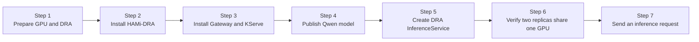

This lab deploys a complete KServe Standard inference service and connects it to HAMi's native Dynamic Resource Allocation (DRA) driver. You will install the network and model-serving components, create a native `ResourceClaimTemplate`, and run two Qwen vLLM Predictor Pods. Each Pod receives `3 GiB` and `20` compute units from the same physical Tesla T4.

The captured run used Kubernetes 1.36.1, KServe 0.18.0, HAMi-DRA 0.2.1, Envoy Gateway 1.8.2, containerd 2.2.4, NVIDIA driver 580.173.02, and one Tesla T4 with 15 GiB of memory.

:::warning Version-specific APIs

This lab uses KServe 0.18's native DRA fields and the HAMi-DRA 0.2.1 chart. KServe and HAMi-DRA APIs are evolving; check the release notes before applying these manifests to another version.

:::

## What You'll Learn

- prepare a Kubernetes GPU node for DRA Consumable Capacity;
- install KServe Standard mode with Gateway API and Envoy Gateway;
- publish a local Qwen model through a hostPath PersistentVolume;
- express GPU memory and compute requests with a native HAMi `ResourceClaimTemplate`; and
- prove that two KServe Predictor replicas share one physical GPU and both expose a 3 GiB memory ceiling.

## Lab Overview



## Prerequisites

- A Kubernetes 1.34 or newer cluster with one NVIDIA GPU node. The verified node has a 15 GiB Tesla T4.
- Helm 3, `kubectl`, `curl`, and `python3`.
- NVIDIA driver 440 or newer. GPU Operator is recommended for installing the driver and container toolkit.
- Cluster-admin access. This lab creates CRDs, a GatewayClass, cluster-scoped DRA resources, and a static PersistentVolume.
- DRA Consumable Capacity enabled on the control plane and kubelet. Follow [Lab 4](./hami-dra.md#step-1-enable-the-draconsumablecapacity-feature-gate) if it is not enabled.
- CDI and NVIDIA volume-mount support enabled in the container runtime. GPU Operator users can follow [Lab 4](./hami-dra.md#step-2-configure-the-container-runtime).
- The manifests in [`tutorials/labs/examples/11-kserve-hami-dra/`](https://github.com/Project-HAMi/website/tree/master/tutorials/labs/examples/11-kserve-hami-dra).

Check the node before starting:

```bash
kubectl get nodes -o custom-columns=NAME:.metadata.name,GPU:.status.allocatable.nvidia\.com/gpu
kubectl get nodes -l nvidia.com/gpu.product
```

## Step 1: Prepare the GPU Node

If GPU Operator manages the node, install it with the NVIDIA Device Plugin disabled. HAMi-DRA must be the component that publishes the device:

```bash
helm repo add nvidia https://helm.ngc.nvidia.com/nvidia
helm repo update

helm upgrade --install gpu-operator nvidia/gpu-operator \
  --namespace gpu-operator --create-namespace \
  --version=v26.3.1 \
  --set driver.enabled=true \
  --set devicePlugin.enabled=false \
  --wait --timeout=10m
```

If the NVIDIA driver is already installed on the host, set `driver.enabled=false`. Keep `devicePlugin.enabled=false` in both cases. Do not let the NVIDIA Device Plugin and HAMi-DRA own the same GPU.

On a kubeadm cluster, enable consumable capacity on the control plane and kubelet before continuing:

```bash
for component in kube-apiserver kube-scheduler kube-controller-manager; do
  sed -i "/    - $component/a\\    - --feature-gates=DRAConsumableCapacity=true" \
    "/etc/kubernetes/manifests/${component}.yaml"
done

cat >> /var/lib/kubelet/config.yaml <<'EOF'
featureGates:
  DRAConsumableCapacity: true
EOF
systemctl restart kubelet
```

Verify that the DRA API is served:

```bash
kubectl api-resources --api-group=resource.k8s.io
```

The output must include `DeviceClass`, `ResourceClaim`, `ResourceClaimTemplate`, and `ResourceSlice` at `resource.k8s.io/v1`.

## Step 2: Install cert-manager and HAMi-DRA

Both the HAMi-DRA and KServe webhooks use cert-manager. Install it once:

```bash
helm repo add cert-manager https://charts.jetstack.io
helm repo update

helm upgrade --install cert-manager cert-manager/cert-manager \
  --namespace cert-manager --create-namespace \
  --version v1.21.0 \
  --set crds.enabled=true \
  --wait --timeout=10m
```

Install the verified HAMi-DRA chart and label the GPU node. Use the actual node name in `GPU_NODE`:

```bash
helm repo add hami-dra https://project-hami.github.io/HAMi-DRA/
helm repo update

export GPU_NODE=$(kubectl get nodes -l nvidia.com/gpu.product=Tesla-T4 \
  -o jsonpath='{.items[0].metadata.name}')
test -n "${GPU_NODE}" && echo "GPU_NODE=${GPU_NODE}"
kubectl label node "${GPU_NODE}" gpu=on --overwrite

helm upgrade --install hami-dra hami-dra/hami-dra \
  --namespace hami-system --create-namespace \
  --version 0.2.1 \
  --wait --timeout=10m
```

When the NVIDIA driver is installed directly on the host, add `--set drivers.nvidia.containerDriver=false`. Verify the driver and published capacity:

```bash
kubectl get pods -n hami-system
kubectl get deviceclass,resourceslice
kubectl get resourceslice -o jsonpath='{.items[0].spec.devices[0]}' | python3 -m json.tool
```

The device must report `allowMultipleAllocations: true`, `memory: 15Gi`, and `cores: 100`. This is the capacity pool from which both Predictor claims will draw.

## Step 3: Install Envoy Gateway and KServe

Install Envoy Gateway. The lab uses a NodePort because the verified cluster has no cloud LoadBalancer:

```bash
helm upgrade --install eg \
  oci://docker.io/envoyproxy/gateway-helm \
  --version v1.8.2 \
  --namespace envoy-gateway-system --create-namespace \
  --wait --timeout=10m

kubectl apply -f tutorials/labs/examples/11-kserve-hami-dra/01-gateway.yaml
kubectl wait --for=condition=Programmed \
  gateway/kserve-ingress-gateway -n kserve --timeout=5m
```

Install the KServe CRDs, controller, and default runtimes in Standard mode:

```bash
helm upgrade --install kserve-crd \
  oci://ghcr.io/kserve/charts/kserve-crd \
  --version v0.18.0 --namespace kserve --create-namespace \
  --wait --timeout=10m

helm upgrade --install kserve \
  oci://ghcr.io/kserve/charts/kserve-resources \
  --version v0.18.0 --namespace kserve \
  --set kserve.controller.deploymentMode=Standard \
  --set kserve.controller.gateway.disableIstioVirtualHost=true \
  --set kserve.controller.gateway.ingressGateway.enableGatewayApi=true \
  --set kserve.controller.gateway.ingressGateway.kserveGateway=kserve/kserve-ingress-gateway \
  --wait --timeout=10m

helm upgrade --install kserve-runtime-configs \
  oci://ghcr.io/kserve/charts/kserve-runtime-configs \
  --version v0.18.0 --namespace kserve \
  --set kserve.servingruntime.enabled=true \
  --set kserve.llmisvcConfigs.enabled=false \
  --wait --timeout=10m
```

Confirm that the HuggingFace runtime exists:

```bash
kubectl get clusterservingruntime kserve-huggingfaceserver
```

## Step 4: Publish the Qwen Model

Download the small Qwen model on the GPU node. ModelScope is used because the verified environment could not reliably reach Hugging Face:

```bash
pip install modelscope
modelscope download \
  --model Qwen/Qwen2.5-0.5B-Instruct \
  --local-dir /opt/models/Qwen2.5-0.5B-Instruct
```

The `hostPath` in the lab manifest must exist on the node that will run the Predictor. Apply the static PV and PVC:

```bash
kubectl apply -f tutorials/labs/examples/11-kserve-hami-dra/02-model-storage.yaml
kubectl get pv,pvc -n kserve-test
```

For a multi-node cluster, replace this hostPath with shared storage such as NFS, CephFS, or an object-store-backed KServe storage initializer.

## Step 5: Create the KServe Service with a Native HAMi Claim

Apply the ResourceClaimTemplate and InferenceService:

```bash
kubectl apply -f tutorials/labs/examples/11-kserve-hami-dra/03-inference-service.yaml
kubectl wait --for=condition=Ready \
  inferenceservice/qwen-llm -n kserve-test --timeout=30m
```

The important part is the relationship between the Predictor and the claim template:

```yaml
predictor:
  minReplicas: 2
  resourceClaims:
    - name: gpu
      resourceClaimTemplateName: qwen-hami-gpu
  model:
    resources:
      claims:
        - name: gpu
```

The template requests one HAMi device with `3Gi` memory and `20` cores. KServe copies the claim reference into the generated Deployment, and Kubernetes creates one ResourceClaim per Pod. Do not replace this with one fixed `resourceClaimName`: two replicas need two independently allocated claims.

Check the resources KServe generated:

```bash
kubectl get inferenceservice,deploy,pod,resourceclaim,httproute -n kserve-test
kubectl get resourceclaim -n kserve-test -o jsonpath='{range .items[*]}{.metadata.name}{" device="}{.status.allocation.devices.results[0].device}{" memory="}{.status.allocation.devices.results[0].consumedCapacity.memory}{" cores="}{.status.allocation.devices.results[0].consumedCapacity.cores}{"\n"}{end}'
```

Both claims should point to `hami-gpu-0` and report `3Gi` and `20`.

## Step 6: Verify the Shared GPU Ceiling

List the two Predictor Pods and confirm that they landed on the same node:

```bash
kubectl get pod -n kserve-test \
  -l serving.kserve.io/inferenceservice=qwen-llm -o wide
```

Run `nvidia-smi` in each container:

```bash
for pod in $(kubectl get pod -n kserve-test \
  -l serving.kserve.io/inferenceservice=qwen-llm -o name); do
  kubectl exec -n kserve-test "${pod}" -- \
    nvidia-smi --query-gpu=name,memory.total --format=csv,noheader
done
```

Expected output:

```text
Tesla T4, 3072 MiB
Tesla T4, 3072 MiB
```

The two containers see separate 3 GiB ceilings while the claim status shows that both allocations use the same physical `hami-gpu-0`. HAMi-core applies the in-container memory view after the DRA driver prepares the device.

## Step 7: Send an Inference Request

Read the Envoy NodePort and node address:

```bash
ENVOY_SERVICE=$(kubectl get service -n envoy-gateway-system \
  -l gateway.envoyproxy.io/owning-gateway-name=kserve-ingress-gateway \
  -o jsonpath='{.items[0].metadata.name}')
NODE_PORT=$(kubectl get service -n envoy-gateway-system "${ENVOY_SERVICE}" \
  -o jsonpath='{.spec.ports[?(@.port==80)].nodePort}')
NODE_IP=$(kubectl get node -o jsonpath='{.items[0].status.addresses[?(@.type=="InternalIP")].address}')
export GATEWAY_ADDR="${NODE_IP}:${NODE_PORT}"
```

Call the OpenAI-compatible endpoint through the KServe HTTPRoute:

```bash
curl -H 'Host: qwen-llm-kserve-test.example.com' \
  -H 'Content-Type: application/json' \
  "http://${GATEWAY_ADDR}/openai/v1/chat/completions" \
  -d '{
    "model": "qwen",
    "messages": [{"role": "user", "content": "Answer only with the number: 2+3"}],
    "max_tokens": 8,
    "temperature": 0
  }'
```

A successful `chat.completion` response proves that the complete path is working:

```text
Client -> Envoy Proxy -> HTTPRoute -> Predictor Service -> HuggingFaceServer -> vLLM -> HAMi GPU slice
```

## Cleanup

Delete the inference service and model resources first, then remove the Gateway and controllers if this cluster is dedicated to the lab:

```bash
kubectl delete -f tutorials/labs/examples/11-kserve-hami-dra/03-inference-service.yaml
kubectl delete -f tutorials/labs/examples/11-kserve-hami-dra/02-model-storage.yaml
kubectl delete -f tutorials/labs/examples/11-kserve-hami-dra/01-gateway.yaml
helm uninstall kserve-runtime-configs kserve kserve-crd -n kserve
helm uninstall eg -n envoy-gateway-system
helm uninstall hami-dra -n hami-system
```

## What This Lab Proved

| Claim | Evidence |
| --- | --- |
| KServe can use native DRA claims | The generated Deployment contains both `resourceClaims` and container-level `resources.claims` |
| HAMi can share one physical GPU between KServe replicas | Two independently generated claims resolve to `hami-gpu-0` |
| Capacity is enforced in the container | Both Predictor containers report `3072 MiB` in `nvidia-smi` |
| The inference path remains functional | The OpenAI-compatible chat completion returns successfully through Envoy Gateway |

## Next Steps

- Replace the hostPath with shared storage before using more than one GPU node.
- Change the claim to `6Gi` and `40` cores, then observe the remaining capacity in `ResourceSlice` and claim status.
- Compare this KServe workflow with [Lab 4](./hami-dra.md), which uses a Pod-level claim without a model-serving controller.
