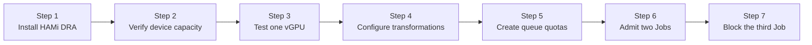

This lab combines HAMi GPU slicing with Kueue admission control. HAMi gives each Pod a slice of GPU memory and compute capacity; Kueue accounts for those slices before admitting the Job. You will admit two identical Jobs and verify that a third remains suspended when the queue reaches its vGPU, memory, and compute quotas.

The captured output comes from Kubernetes 1.36.1, containerd 2.2.4, Kueue 0.18.1, and HAMi 2.9.0 on a node with one 15 GiB Tesla T4.

:::warning Version-specific APIs

This lab uses Kueue `v1beta2` APIs and the `ResourceTransformation` configuration available in Kueue 0.18.1. Check the Kueue release notes before applying the configuration to a different version.

:::

## What You'll Learn

- install HAMi 2.9.0 in DRA compatibility mode;
- verify that a `4 GiB / 50%` extended-resource request becomes a DRA `ResourceClaim`;
- transform per-vGPU HAMi memory and compute requests into total Kueue quota usage; and
- keep excess Jobs suspended at admission time instead of letting their Pods become scheduler-level Pending.

## Lab Overview



## Prerequisites

- A Kubernetes 1.36 cluster with Kueue 0.18.1 installed and the `batch/job` integration enabled.
- One NVIDIA GPU node. The verified environment uses a 15 GiB Tesla T4.
- GPU Operator or an equivalent installation that provides the NVIDIA driver and GPU Feature Discovery labels.
- NVIDIA Device Plugin disabled because HAMi owns the GPU device path in this lab.
- `kubectl` and Helm access with permission to install cluster-scoped resources and edit the Kueue manager configuration.
- cert-manager installed; the HAMi DRA webhook uses it to provision TLS certificates.
- The manifests from [`tutorials/labs/examples/09-kueue-hami-vgpu/`](https://github.com/Project-HAMi/website/tree/master/tutorials/labs/examples/09-kueue-hami-vgpu).

If GPU Operator manages the node, install or upgrade it with its device plugin disabled:

```text
--set devicePlugin.enabled=false
```

## Step 1: Install HAMi in DRA Compatibility Mode

Create the namespace used throughout the lab. Select the T4 node from its GPU Feature Discovery label instead of copying the verified environment's node name, then label it for HAMi:

```bash
kubectl create namespace hami-kueue-demo
export GPU_NODE=$(kubectl get nodes -l nvidia.com/gpu.product=Tesla-T4 \
  -o jsonpath='{.items[0].metadata.name}')
test -n "${GPU_NODE}" && echo "GPU_NODE=${GPU_NODE}"
kubectl label node "${GPU_NODE}" gpu=on --overwrite
```

Install HAMi 2.9.0 with DRA enabled and the traditional device plugin disabled:

```bash
helm repo add hami-charts https://project-hami.github.io/HAMi/
helm repo update

helm install hami hami-charts/hami \
  --namespace hami-system \
  --create-namespace \
  --version 2.9.0 \
  --set dra.enabled=true \
  --set devicePlugin.enabled=false
```

:::important

Do not enable HAMi's DRA and traditional device-plugin modes at the same time. If the NVIDIA driver is installed directly on the host rather than by GPU Operator, also set `hami-dra.drivers.nvidia.containerDriver=false`.

:::

Wait for the three DRA components:

```bash
kubectl get pods -n hami-system
```

```plaintext
NAME                                     READY   STATUS
hami-dra-driver-kubelet-plugin-fb4zm     1/1     Running
hami-hami-dra-monitor-7b8df84bd-jsjrd    1/1     Running
hami-hami-dra-webhook-7bb65cbcc5-g5742   1/1     Running
```

## Step 2: Inspect the Published GPU Capacity

HAMi publishes a `DeviceClass` and a node-local `ResourceSlice`:

```bash
kubectl get deviceclass,resourceslice
```

```plaintext
NAME                                                        AGE
deviceclass.resource.k8s.io/hami-core-gpu.project-hami.io   32m

NAME                                                                              NODE            DRIVER
resourceslice.resource.k8s.io/lixd-test-gpu-hami-core-gpu.project-hami.io-2drs2   lixd-test-gpu   hami-core-gpu.project-hami.io
```

Inspect the device capacity:

```bash
kubectl get resourceslice \
  -o jsonpath='{.items[0].spec.devices[0]}' | python3 -m json.tool
```

The verified T4 reported these relevant fields:

```json
{
  "allowMultipleAllocations": true,
  "capacity": {
    "cores": { "value": "100" },
    "memory": { "value": "15Gi" }
  },
  "name": "hami-gpu-0"
}
```

`allowMultipleAllocations: true` lets multiple claims consume capacity from the same physical GPU until memory or compute capacity is exhausted.

## Step 3: Verify One HAMi vGPU Slice

Compatibility mode lets an existing workload keep using HAMi extended resources. The request below means one vGPU with 4096 MiB of memory and 50% compute capacity:

```bash
kubectl apply -f tutorials/labs/examples/09-kueue-hami-vgpu/01-smoke-pod.yaml
kubectl wait -n hami-kueue-demo \
  --for=condition=Ready pod/hami-compatible-smoke --timeout=5m
```

HAMi's webhook converts that request into a DRA claim. Inspect the generated claim:

```bash
kubectl get resourceclaim -n hami-kueue-demo \
  hami-kueue-demo-hami-compatible-smoke-cuda \
  -o jsonpath='{.status.allocation.devices.results[0]}' | python3 -m json.tool
```

```json
{
  "consumedCapacity": {
    "cores": "50",
    "memory": "4Gi"
  },
  "device": "hami-gpu-0",
  "driver": "hami-core-gpu.project-hami.io"
}
```

The container sees the sliced memory ceiling:

```bash
kubectl exec -n hami-kueue-demo hami-compatible-smoke -- nvidia-smi
```

```plaintext
|   0  Tesla T4  ...  |       0MiB /   4096MiB |      0%      Default |
```

Remove the smoke Pod so it does not consume GPU capacity during the queue test:

```bash
kubectl delete pod -n hami-kueue-demo hami-compatible-smoke
```

## Step 4: Configure Kueue Resource Transformations

HAMi expresses `gpumem` and `gpucores` per vGPU. Kueue needs total usage. For example, two Jobs that each request one vGPU, 4096 MiB, and 50% compute consume:

```text
vGPU instances: 2
total memory:   2 x 4096 MiB = 8192 MiB
total compute:  2 x 50 = 100
```

Edit the Kueue manager configuration:

```bash
kubectl edit configmap kueue-manager-config -n kueue-system
```

Add `resources.transformations` to the existing `Configuration` document in `controller_manager_config.yaml`:

```yaml
apiVersion: config.kueue.x-k8s.io/v1beta2
kind: Configuration
integrations:
  frameworks:
    - batch/job
resources:
  transformations:
    - input: nvidia.com/gpumem
      strategy: Replace
      outputs:
        nvidia.com/total-gpumem: 1
      multiplyBy: nvidia.com/gpu
    - input: nvidia.com/gpucores
      strategy: Replace
      outputs:
        nvidia.com/total-gpucores: 1
      multiplyBy: nvidia.com/gpu
```

Preserve the rest of the existing configuration. Restart Kueue and wait for it to become available:

```bash
kubectl rollout restart deployment/kueue-controller-manager -n kueue-system
kubectl rollout status deployment/kueue-controller-manager -n kueue-system
```

```plaintext
deployment "kueue-controller-manager" successfully rolled out
```

The `Replace` strategy removes the per-device input from Kueue accounting. `multiplyBy: nvidia.com/gpu` creates total memory and compute requests based on the number of requested vGPU instances.

## Step 5: Create the Kueue Quotas

The queue allows two vGPU instances, 8192 MiB of total GPU memory, and 100 total compute points:

```bash
kubectl apply -f tutorials/labs/examples/09-kueue-hami-vgpu/02-queues.yaml
kubectl get resourceflavor,clusterqueue
kubectl get localqueue -n hami-kueue-demo
```

```plaintext
NAME                                          AGE
resourceflavor.kueue.x-k8s.io/hami-t4         8s

NAME                                      COHORT   PENDING WORKLOADS   ADMITTED WORKLOADS
clusterqueue.kueue.x-k8s.io/hami-cq                 0                   0

NAME                                    CLUSTERQUEUE   PENDING WORKLOADS   ADMITTED WORKLOADS
localqueue.kueue.x-k8s.io/hami-queue    hami-cq       0                   0
```

The memory quota uses MiB, matching `nvidia.com/gpumem: 4096` in the workload. The `ResourceFlavor` node label must match the label on your GPU node; adjust `Tesla-T4` if you use another model.

## Step 6: Admit Two vGPU Jobs

Create three identical Jobs. Applying one file keeps their specifications exactly the same apart from the names:

```bash
kubectl apply -f tutorials/labs/examples/09-kueue-hami-vgpu/03-jobs.yaml
kubectl get job,workload -n hami-kueue-demo
```

```plaintext
NAME                             STATUS
job.batch/hami-kueue-running-a   Running
job.batch/hami-kueue-running-b   Running
job.batch/hami-kueue-pending-c   Suspended

NAME                                                     QUEUE        RESERVED IN   ADMITTED
workload.kueue.x-k8s.io/job-hami-kueue-running-a-59997   hami-queue   hami-cq       True
workload.kueue.x-k8s.io/job-hami-kueue-running-b-9d737   hami-queue   hami-cq       True
workload.kueue.x-k8s.io/job-hami-kueue-pending-c-d854d   hami-queue
```

Inspect either admitted Workload:

```bash
kubectl get workload -n hami-kueue-demo \
  -l kueue.x-k8s.io/job-name=hami-kueue-running-a \
  -o jsonpath='{.items[0].status.admission.podSetAssignments[0].resourceUsage}' \
  | python3 -m json.tool
```

```json
{
  "nvidia.com/gpu": "1",
  "nvidia.com/total-gpucores": "50",
  "nvidia.com/total-gpumem": "4096"
}
```

Kueue has charged all three quota dimensions before HAMi allocates the DRA claim and before the Pod reaches normal scheduling.

## Step 7: Verify the Third Job Stays Queued

Inspect the ClusterQueue usage:

```bash
kubectl get clusterqueue hami-cq -o yaml
```

```yaml
status:
  admittedWorkloads: 2
  flavorsUsage:
    - name: hami-t4
      resources:
        - name: nvidia.com/gpu
          total: "2"
        - name: nvidia.com/total-gpucores
          total: "100"
        - name: nvidia.com/total-gpumem
          total: "8192"
  pendingWorkloads: 1
```

The pending Workload records both its transformed request and why it was not admitted:

```bash
kubectl get workload -n hami-kueue-demo \
  -l kueue.x-k8s.io/job-name=hami-kueue-pending-c -o yaml
```

```yaml
status:
  conditions:
    - reason: Pending
      message: >-
        couldn't assign flavors to pod set main: insufficient unused quota for nvidia.com/gpu in flavor hami-t4, 1 more needed, insufficient unused quota for nvidia.com/total-gpucores in flavor hami-t4, 50 more needed

  resourceRequests:
    - resources:
        nvidia.com/gpu: "1"
        nvidia.com/total-gpucores: "50"
        nvidia.com/total-gpumem: "4096"
```

The third Job remains `Suspended`; it does not create a Pod that competes for already exhausted GPU capacity.

## Cleanup

Delete the workloads and queue resources:

```bash
kubectl delete -f tutorials/labs/examples/09-kueue-hami-vgpu/03-jobs.yaml
kubectl delete -f tutorials/labs/examples/09-kueue-hami-vgpu/02-queues.yaml
kubectl delete namespace hami-kueue-demo
```

Remove the two `resources.transformations` entries from `kueue-manager-config`, then restart Kueue:

```bash
kubectl edit configmap kueue-manager-config -n kueue-system
kubectl rollout restart deployment/kueue-controller-manager -n kueue-system
kubectl rollout status deployment/kueue-controller-manager -n kueue-system
```

If this cluster is only for the lab, uninstall HAMi:

```bash
helm uninstall hami -n hami-system
kubectl delete namespace hami-system
```

## What This Lab Proved

| Claim | Evidence |
| --- | --- |
| HAMi converted an extended-resource request into a DRA allocation | The generated `ResourceClaim` consumed `4Gi` memory and `50` cores from `hami-gpu-0` |
| The vGPU memory limit reached the container | `nvidia-smi` reported a 4096 MiB ceiling |
| Kueue accounted for per-vGPU resources as totals | Each admitted Workload used one vGPU, 4096 total MiB, and 50 total compute points |
| Queue admission prevented oversubscription | Two Jobs ran while the third remained suspended with an insufficient-quota condition |

## Next Steps

- Change only the memory quota to observe which quota dimension blocks admission first.
- Add separate `ClusterQueue` objects for teams that need different GPU budgets.
- Compare this compatibility path with the native `ResourceClaim` workflow in [Lab 4](./hami-dra.md).
