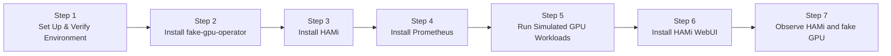

import Tabs from '@theme/Tabs'; import TabItem from '@theme/TabItem';

This lab walks you through setting up a fully local Kubernetes cluster — using either **OrbStack** (macOS) or **kind** (Linux/Ubuntu) — together with [run-ai/fake-gpu-operator](https://github.com/run-ai/fake-gpu-operator), then installing HAMi online.

This lab does not require a real NVIDIA GPU. It is designed for classroom preparation, understanding HAMi component architecture, verifying GPU Pod scheduling workflows, and quickly getting familiar with basic HAMi usage on a personal computer.

## What You'll Get

After completing this lab, you will have a local Kubernetes cluster with:

- fake-gpu-operator simulating `nvidia.com/gpu` resources on CPU nodes
- HAMi scheduler, admission webhook, and other control plane components running normally
- Regular Pods can request simulated GPUs via `nvidia.com/gpu`
- You can observe the complete chain from fake GPU resource discovery, Pod request, scheduling, to running

:::note

fake GPU does not represent real GPU memory isolation, compute isolation, CUDA runtime, or driver capabilities. This lab is for understanding HAMi components and basic scheduling workflows. Real memory slicing (`nvidia.com/gpumem`), compute limits (`nvidia.com/gpucores`), CUDA program execution, and performance isolation still require a real NVIDIA GPU environment.

:::

## Installation Overview

The entire local installation process consists of 7 steps:



| Step | Purpose | What It Solves |
| --- | --- | --- |
| Set Up & Verify Environment | Create/verify cluster, check kubectl and Helm | Ensure Kubernetes cluster is available |
| Install fake-gpu-operator | Simulate NVIDIA GPU resources | Allow nodes without GPUs to report `nvidia.com/gpu` |
| Install HAMi | Deploy HAMi control plane | Observe HAMi scheduler, webhook, and other components |
| Install Prometheus | Deploy monitoring stack | Collect GPU metrics and provide data source for HAMi WebUI |
| Run Simulated GPU Workloads | Verify scheduling workflow | Experience Pod GPU request and scheduling |
| Install HAMi WebUI | Deploy visual management interface | Graphically view GPU nodes, resource allocation, and usage trends |
| Observe HAMi and fake GPU | Understand component responsibility boundaries | Clarify which capabilities require real GPUs |

## Prerequisites

<Tabs groupId="os">
<TabItem value="macos" label="macOS (OrbStack)" default>

- macOS, Intel or Apple Silicon
- [OrbStack](https://orbstack.dev/) installed with built-in Kubernetes enabled
- Access to GitHub, GHCR, and the HAMi Helm repository
- At least 4 CPU and 8 GB of memory available

:::tip[Why OrbStack?]

OrbStack comes with built-in Kubernetes (based on k3s), so there's no need to install kind or Docker Desktop separately. It uses fewer resources, starts faster, and is the preferred choice for local labs on macOS.

:::

Check Helm (needed later for installing fake-gpu-operator and HAMi):

```bash
helm version
```

If Helm is not installed:

```bash
brew install helm
```

</TabItem>
<TabItem value="linux" label="Linux (Ubuntu + kind)">

- Ubuntu 20.04 LTS or later, x86_64 or ARM64
- [Docker Engine](https://docs.docker.com/engine/install/ubuntu/) installed and running
- [`kind`](https://kind.sigs.k8s.io/docs/user/quick-start/#installation) v0.20.0 or later
- [`kubectl`](https://kubernetes.io/docs/tasks/tools/install-kubectl-linux/) installed
- [Helm](https://helm.sh/docs/intro/install/) 3.x or later
- Access to GitHub, GHCR, and the HAMi Helm repository
- At least 4 CPU and 8 GB of memory available

:::tip[Why kind?]

kind (Kubernetes IN Docker) runs a full Kubernetes cluster inside Docker containers. It works on any Linux distribution that has Docker, requires no special OS integration, and is the standard tool for local Kubernetes development on Linux.

:::

If you need to install any prerequisites, run the following block:

```bash
# Docker Engine
curl -fsSL https://get.docker.com | sudo sh
sudo usermod -aG docker $USER
newgrp docker

# kind
KIND_VERSION=v0.23.0
curl -Lo ./kind "https://kind.sigs.k8s.io/dl/${KIND_VERSION}/kind-linux-amd64"
chmod +x ./kind && sudo mv ./kind /usr/local/bin/kind

# kubectl
curl -LO "https://dl.k8s.io/release/$(curl -L -s https://dl.k8s.io/release/stable.txt)/bin/linux/amd64/kubectl"
sudo install -o root -g root -m 0755 kubectl /usr/local/bin/kubectl && rm kubectl

# Helm
curl https://raw.githubusercontent.com/helm/helm/main/scripts/get-helm-3 | bash
```

</TabItem>
</Tabs>

## Step 1: Set Up and Verify Local Environment

<Tabs groupId="os">
<TabItem value="macos" label="macOS " default>

OrbStack's Kubernetes starts automatically once you enable it in the OrbStack UI. Verify the cluster is ready:

```bash
kubectl version
```

Example output:

```plaintext
Client Version: v1.33.9
Kustomize Version: v5.6.0
Server Version: v1.33.9+orb1
```

:::note

The `+orb1` suffix in `Server Version` identifies OrbStack's built-in Kubernetes distribution.

:::

View cluster nodes:

```bash
kubectl get nodes -o wide
```

Example output:

```plaintext
NAME       STATUS   ROLES                  AGE    VERSION        INTERNAL-IP     EXTERNAL-IP   OS-IMAGE   KERNEL-VERSION                            CONTAINER-RUNTIME
orbstack   Ready    control-plane,master   148d   v1.33.9+orb1   192.168.139.2   <none>        OrbStack   7.0.5-orbstack-00330-ge3df4e19b0a0-dirty  docker://29.4.0
```

</TabItem>
<TabItem value="linux" label="Linux">

Create a local Kubernetes cluster:

```bash
kind create cluster --name hami-lab
```

Example output:

```plaintext
Creating cluster "hami-lab" ...
 ✓ Ensuring node image (kindest/node:v1.32.2) 🖼
 ✓ Preparing nodes 📦
 ✓ Writing configuration 📜
 ✓ Starting control-plane 🕹️
 ✓ Installing CNI 🔌
 ✓ Installing StorageClass 💾
Set kubectl context to "kind-hami-lab"
```

:::note

The `--name hami-lab` flag names the cluster. The resulting node will be called `hami-lab-control-plane`. kind automatically sets your kubectl context to the new cluster.

:::

Verify the cluster is ready:

```bash
kubectl version
```

Example output:

```plaintext
Client Version: v1.32.2
Kustomize Version: v5.5.0
Server Version: v1.32.2
```

View cluster nodes:

```bash
kubectl get nodes -o wide
```

Example output:

```plaintext
NAME                     STATUS   ROLES           AGE   VERSION   INTERNAL-IP   EXTERNAL-IP   OS-IMAGE                        KERNEL-VERSION      CONTAINER-RUNTIME
hami-lab-control-plane   Ready    control-plane   2m    v1.32.2   172.18.0.2    <none>        Debian GNU/Linux 12 (bookworm)  6.5.0-41-generic    containerd://1.7.18
```

</TabItem>
</Tabs>

### Set the NODE_NAME Variable

The rest of this lab uses a `NODE_NAME` shell variable to avoid hard-coding the node name. Set it once here; all subsequent commands consume it automatically:

```bash
NODE_NAME=$(kubectl get nodes -o jsonpath='{.items[0].metadata.name}')
echo "NODE_NAME=${NODE_NAME}"
```

| Platform | Example value            |
| -------- | ------------------------ |
| macOS    | `orbstack`               |
| Linux    | `hami-lab-control-plane` |

---

:::info[Steps 2–7 are identical on both platforms]

From here on, all commands work the same on macOS and Linux. The only difference you will notice is your node name in example outputs.

:::

## Step 2: Install fake-gpu-operator

fake-gpu-operator simulates GPU resources on nodes without NVIDIA GPUs and sets the node capacity to `nvidia.com/gpu`. This step replaces the NVIDIA GPU Operator, drivers, device-plugin, and DCGM metrics collection pipeline that would be present in a real GPU environment.

### 2.1 Create Namespace and Set Security Policy

```bash
kubectl create namespace gpu-operator
kubectl label namespace gpu-operator pod-security.kubernetes.io/enforce=privileged
```

```plaintext
namespace/gpu-operator created
namespace/gpu-operator labeled
```

> The `gpu-operator` namespace is dedicated to fake-gpu-operator components. The `privileged` label allows Pods to run in privileged mode; the fake-gpu-operator's device-plugin needs access to host device files.

### 2.2 Label the Node

fake-gpu-operator uses node labels to determine which nodes should simulate GPUs:

```bash
kubectl label node ${NODE_NAME} run.ai/simulated-gpu-node-pool=default
```

```plaintext
node/<NODE_NAME> labeled
```

> The label `run.ai/simulated-gpu-node-pool=default` tells fake-gpu-operator: "Simulate GPUs on this node."

### 2.3 Install fake-gpu-operator

```bash
export FAKE_GPU_OPERATOR_VERSION=0.0.80

helm upgrade -i gpu-operator \
    oci://ghcr.io/run-ai/fake-gpu-operator/fake-gpu-operator \
    --namespace gpu-operator \
    --create-namespace \
    --version ${FAKE_GPU_OPERATOR_VERSION}
```

```plaintext
Release "gpu-operator" does not exist. Installing it now.
Pulled: ghcr.io/run-ai/fake-gpu-operator/fake-gpu-operator:0.0.80
Digest: sha256:...
NAME: gpu-operator
LAST DEPLOYED: ...
NAMESPACE: gpu-operator
STATUS: deployed
REVISION: 1
TEST SUITE: None
```

> `helm upgrade -i` installs if the release doesn't exist, upgrades if it does. The `oci://` prefix pulls the Helm Chart from GitHub Container Registry. `0.0.80` is a stable version released in 2026-04.

### 2.4 Wait for Components to Run

```bash
kubectl get pods -n gpu-operator
```

Example output:

```plaintext
NAME                                       READY   STATUS    RESTARTS   AGE
device-plugin-l8m6j                        1/1     Running   0          31m
kwok-gpu-device-plugin-5996cdf4f9-mfvpm    1/1     Running   0          31m
nvidia-dcgm-exporter-knfsn                 1/1     Running   0          31m
nvidia-dcgm-exporter-kwok-b8fd4976-blb8c   1/1     Running   0          31m
status-updater-59965d7bc6-fbkmk            1/1     Running   0          31m
topology-server-9d57b6c79-7dv6h            1/1     Running   0          31m
```

> Component descriptions:
>
> - `device-plugin`: DaemonSet running on each GPU node, reporting GPU resources to Kubernetes
> - `kwok-gpu-device-plugin`: Uses KWOK (Kubernetes WithOut Kubelet) to simulate GPU devices
> - `nvidia-dcgm-exporter`: Simulates DCGM metrics export (GPU temperature, utilization, etc.)
> - `status-updater`: Updates node GPU status
> - `topology-server`: Manages GPU topology information

If all Pods are `Running` with `READY` at `1/1`, the installation is successful.

### 2.5 Verify Simulated GPU Resources

Check whether the node reports GPU capacity:

```bash
kubectl get node ${NODE_NAME} \
    -o custom-columns=NAME:.metadata.name,GPU:.status.capacity.nvidia\\.com/gpu
```

```plaintext
NAME       GPU
<NODE_NAME>   2
```

> The `GPU` column shows `2`, meaning fake-gpu-operator has simulated 2 GPUs on the node.

View the node's detailed GPU labels:

```bash
kubectl get node ${NODE_NAME} --show-labels | tr ',' '\n' | grep -E 'nvidia.com/gpu|run.ai'
```

```plaintext
nvidia.com/gpu.count=2
nvidia.com/gpu.deploy.dcgm-exporter=true
nvidia.com/gpu.deploy.device-plugin=true
nvidia.com/gpu.memory=11441
nvidia.com/gpu.present=true
nvidia.com/gpu.product=Tesla-K80
run.ai/fake.gpu=true
run.ai/simulated-gpu-node-pool=default
```

> These labels simulate a real GPU node:
>
> - `nvidia.com/gpu.count=2`: 2 GPUs simulated
> - `nvidia.com/gpu.product=Tesla-K80`: Simulated GPU model
> - `nvidia.com/gpu.memory=11441`: 11441 MiB VRAM per GPU
> - `run.ai/fake.gpu=true`: Marks this as a simulated GPU

If the `GPU` column is empty, confirm the node label was applied:

```bash
kubectl get node ${NODE_NAME} --show-labels | grep run.ai/simulated-gpu-node-pool
```

## Step 3: Install HAMi

This step installs HAMi's control plane components:

- `hami-scheduler`: Scheduling enhancement component that participates in GPU Pod scheduling decisions
- Admission webhook: Automatically rewrites GPU Pod scheduler configuration
- Helm release: Manages all HAMi-related Kubernetes resources

In the fake GPU environment, GPU resources are provided by fake-gpu-operator. To avoid two device-plugins simultaneously registering `nvidia.com/gpu`, this lab does not let the HAMi device-plugin take over the fake nodes.

### 3.1 Add the HAMi Helm Repository

```bash
helm repo add hami-charts https://project-hami.github.io/HAMi/
helm repo update
```

```plaintext
"hami-charts" has been added to your repositories
...Successfully got an update from the "hami-charts" chart repository
Update Complete. ⎈Happy Helming!⎈
```

### 3.2 Install HAMi

```bash
helm install hami hami-charts/hami \
    -n kube-system \
    --set devicePlugin.enabled=false
```

```plaintext
NAME: hami
LAST DEPLOYED: ...
NAMESPACE: kube-system
STATUS: deployed
REVISION: 1
TEST SUITE: None
```

> `--set devicePlugin.enabled=false` is the key parameter. Because fake-gpu-operator is already managing GPU devices, starting HAMi's device-plugin as well would cause a conflict. Only HAMi's scheduling enhancement components are installed here.

### 3.3 Verify HAMi Components

```bash
kubectl get pods -n kube-system | grep hami
```

```plaintext
hami-scheduler-5d9678f989-dnf65          2/2     Running   0             28m
```

> `2/2` indicates this Pod has 2 containers (scheduler + webhook), both running normally.

View HAMi's control plane resources:

```bash
kubectl get deploy,svc,cm,sa -n kube-system | grep hami
```

```plaintext
deployment.apps/hami-scheduler           1/1     1            1           28m
service/hami-scheduler   NodePort    192.168.194.156   <none>        443:31998/TCP,31993:31993/TCP   28m
configmap/hami-scheduler                                         1      28m
configmap/hami-scheduler-device                                  1      28m
serviceaccount/hami-scheduler                                0         28m
```

### 3.4 Confirm All Helm Releases

```bash
helm list -A
```

```plaintext
NAME         NAMESPACE    REVISION  STATUS   CHART                    APP VERSION
gpu-operator gpu-operator 1         deployed fake-gpu-operator-0.0.80 0.0.80
hami         kube-system  1         deployed hami-2.9.0               2.9.0
```

> Both Helm Releases show `deployed` status.

## Step 4: Install Prometheus

HAMi WebUI needs to read GPU metrics from Prometheus. This step deploys a complete monitoring stack using [kube-prometheus-stack](https://github.com/prometheus-community/helm-charts/tree/main/charts/kube-prometheus-stack).

:::tip[Why install Prometheus?]

HAMi WebUI's cluster overview, GPU utilization, memory usage, and other chart data all come from Prometheus. Without Prometheus, the WebUI can only display blank pages.

:::

### 4.1 Add the Helm Repository

```bash
helm repo add prometheus-community https://prometheus-community.github.io/helm-charts
helm repo update
```

### 4.2 Install kube-prometheus-stack

```bash
helm install prometheus prometheus-community/kube-prometheus-stack \
    -n monitoring --create-namespace \
    --set grafana.enabled=false \
    --version=75.15.1
```

```plaintext
NAME: prometheus
LAST DEPLOYED: ...
NAMESPACE: monitoring
STATUS: deployed
REVISION: 1
```

> `--set grafana.enabled=false` skips Grafana installation. This lab only uses Prometheus as the data source for HAMi WebUI. Remove this parameter if you want Grafana for richer visualizations.

### 4.3 Wait for Prometheus to Be Ready

```bash
kubectl get pods -n monitoring
```

Example output:

```plaintext
NAME                                                     READY   STATUS    RESTARTS   AGE
alertmanager-prometheus-kube-prometheus-alertmanager-0   2/2     Running   0          2m
prometheus-kube-prometheus-operator-d89fb8945-htjjd      1/1     Running   0          2m
prometheus-kube-state-metrics-7f5f75c85d-mbsbh           1/1     Running   0          2m
prometheus-prometheus-kube-prometheus-prometheus-0       2/2     Running   0          2m
prometheus-prometheus-node-exporter-77pxd                1/1     Running   0          2m
```

### 4.4 Create ServiceMonitor to Collect GPU Metrics

The ServiceMonitors included with kube-prometheus-stack do not cover fake-gpu-operator's GPU metrics. Create one manually:

```bash
kubectl apply -f - <<'EOF'
apiVersion: monitoring.coreos.com/v1
kind: ServiceMonitor
metadata:
  name: nvidia-dcgm-exporter
  namespace: gpu-operator
  labels:
    release: prometheus
spec:
  selector:
    matchLabels:
      app: nvidia-dcgm-exporter
  namespaceSelector:
    matchNames:
      - gpu-operator
  endpoints:
    - port: gpu-metrics
      path: /metrics
      interval: 15s
EOF
```

```plaintext
servicemonitor.monitoring.coreos.com/nvidia-dcgm-exporter created
```

> The ServiceMonitor tells Prometheus: "Go to the `gpu-operator` namespace, find the Service with label `app: nvidia-dcgm-exporter`, and scrape `/metrics` from its `gpu-metrics` port every 15 seconds." The `release: prometheus` label is required by kube-prometheus-stack's ServiceMonitor selector.

Wait about 30 seconds, then verify GPU metrics are being collected:

```bash
kubectl exec -n monitoring prometheus-prometheus-kube-prometheus-prometheus-0 -- \
    promtool query instant http://localhost:9090 'DCGM_FI_DEV_GPU_UTIL'
```

```plaintext
DCGM_FI_DEV_GPU_UTIL{..., device="nvidia1", ..., modelName="Tesla-K80", ...} => 0
DCGM_FI_DEV_GPU_UTIL{..., device="nvidia0", ..., modelName="Tesla-K80", ...} => 0
```

> Seeing `DCGM_FI_DEV_GPU_UTIL` data means Prometheus is collecting fake GPU metrics. A utilization of 0 is normal — there are no real GPU compute tasks running.

## Step 5: Run Simulated GPU Workloads

Verify that Kubernetes can schedule Pods requesting `nvidia.com/gpu` to the fake GPU node. fake-gpu-operator injects a simulated `nvidia-smi` tool into GPU Pods for observing GPU visibility.

Since this lab does not enable the HAMi device-plugin, the test Pod explicitly bypasses the HAMi webhook and uses the default Kubernetes scheduler with the simulated GPU resources provided by fake-gpu-operator.

### 5.1 Create a Test Pod

Review the Pod YAML before applying:

```yaml
apiVersion: v1
kind: Pod
metadata:
  name: fake-gpu-pod
  labels:
    hami.io/webhook: ignore
  annotations:
    run.ai/simulated-gpu-utilization: "10-30"
spec:
  restartPolicy: Never
  containers:
    - name: app
      image: ubuntu:22.04
      command: ["bash", "-lc", "sleep 3600"]
      resources:
        requests:
          cpu: "100m"
          memory: "128Mi"
        limits:
          cpu: "500m"
          memory: "512Mi"
          nvidia.com/gpu: 1
      env:
        - name: NODE_NAME
          valueFrom:
            fieldRef:
              fieldPath: spec.nodeName
```

> YAML key points:
>
> - `hami.io/webhook: ignore`: Tells the HAMi webhook not to intercept this Pod, using the default scheduler instead
> - `run.ai/simulated-gpu-utilization: "10-30"`: fake-gpu-operator will make `nvidia-smi` report 10%–30% GPU utilization
> - `resources.limits.nvidia.com/gpu: 1`: Requests 1 GPU
> - `sleep 3600`: Keeps the container running for 1 hour for observation

Apply the Pod:

```bash
kubectl apply -f fake-gpu-pod.yaml
```

```plaintext
pod/fake-gpu-pod created
```

### 5.2 Wait for the Pod to Run

```bash
kubectl get pod fake-gpu-pod -o wide
```

```plaintext
NAME           READY   STATUS    RESTARTS   AGE   IP           NODE         NOMINATED NODE   READINESS GATES
fake-gpu-pod   1/1     Running   0          7m    <pod-ip>     <NODE_NAME>  <none>           <none>
```

> `STATUS: Running` and your node name in the `NODE` column confirm the Pod was successfully scheduled. If pulling `ubuntu:22.04` for the first time, it may take a few dozen seconds.

### 5.3 View the Pod's GPU Resource Request

```bash
kubectl describe pod fake-gpu-pod | grep -A6 "Limits"
```

```plaintext
    Limits:
      nvidia.com/gpu:  1
    Requests:
      nvidia.com/gpu:  1
```

### 5.4 View Node GPU Resource Allocation

```bash
kubectl describe node ${NODE_NAME} | grep -A10 "Allocated resources"
```

```plaintext
Allocated resources:
  Resource           Requests     Limits
  --------           --------     ------
  cpu                750m (7%)    1700m (17%)
  memory             870Mi (10%)  1996Mi (24%)
  nvidia.com/gpu     1            1
```

> The `nvidia.com/gpu` row shows both Requests and Limits as `1`, meaning 1 GPU is occupied. The node has 2 GPUs total, so 1 more can be allocated.

### 5.5 Execute Simulated nvidia-smi

Run `nvidia-smi` inside the Pod to confirm fake-gpu-operator successfully injected the simulated GPU tool:

```bash
kubectl exec fake-gpu-pod -- nvidia-smi
```

```plaintext
Thu May 21 08:44:31 2026
+------------------------------------------------------------------------------+
| NVIDIA-SMI 470.129.06   Driver Version: 470.129.06   CUDA Version: 11.4      |
+--------------------------------+----------------------+----------------------+
| GPU  Name        Persistence-M | Bus-Id        Disp.A | Volatile Uncorr. ECC |
| Fan  Temp  Perf  Pwr:Usage/Cap |         Memory-Usage | GPU-Util  Compute M. |
|                                |                      |               MIG M. |
+--------------------------------+----------------------+----------------------+
|   0  Tesla-K80             Off | 00000001:00:00.0 Off |                  Off |
| N/A   33C    P8    11W /  70W  |  11441MiB / 11441MiB |      18%     Default |
|                                |                      |                  N/A |
+--------------------------------+----------------------+----------------------+

+------------------------------------------------------------------------------+
| Processes:                                                                   |
|  GPU   GI   CI        PID   Type   Process name                  GPU Memory  |
|        ID   ID                                                   Usage       |
+------------------------------------------------------------------------------+
|    0   N/A  N/A       23       G   sleep 3600                       11441MiB |
+------------------------------------------------------------------------------+
```

> Output interpretation:
>
> - **GPU 0: Tesla-K80**: Simulated GPU model, consistent with node label `nvidia.com/gpu.product=Tesla-K80`
> - **11441MiB / 11441MiB**: Memory used/total, consistent with `nvidia.com/gpu.memory=11441`
> - **GPU-Util: 18%**: Within the range specified by `run.ai/simulated-gpu-utilization: "10-30"`
> - **Processes: sleep 3600**: The running process visible on the simulated GPU
>
> This output is identical on macOS and Linux — fake-gpu-operator produces the same simulation on both platforms.

## Step 6: Install HAMi WebUI

HAMi WebUI provides a graphical GPU resource management interface.

### 6.1 Add the HAMi WebUI Helm Repository

```bash
helm repo add hami-webui https://Project-HAMi.github.io/HAMi-WebUI/
helm repo update
```

### 6.2 Add GPU Label to the Node

HAMi WebUI discovers GPU nodes via the `gpu=on` node label:

```bash
kubectl label node ${NODE_NAME} gpu=on
```

### 6.3 Add Simulated GPU Registration Information

In a real environment, the HAMi device-plugin automatically writes the `hami.io/node-nvidia-register` annotation. Because this lab disables the device-plugin, add it manually:

```bash
kubectl annotate node ${NODE_NAME} \
  hami.io/node-nvidia-register='[{"id":"GPU-3cef3724-8228-5a66-b391-b0901788f5d0","count":10,"devmem":11441,"devcore":100,"type":"NVIDIA-Tesla-K80","mode":"hami-core","health":true},{"id":"GPU-5127182e-f297-5a25-bb44-0444c3be540c","index":1,"count":10,"devmem":11441,"devcore":100,"type":"NVIDIA-Tesla-K80","mode":"hami-core","health":true}]' \
  hami.io/node-handshake="Requesting_$(date '+%Y.%m.%d %H:%M:%S')"
```

> One JSON object per GPU. `id` is the device UUID, `count` is vGPU partitions per card (default 10), `devmem` is VRAM in MiB, `devcore` is compute capacity in %, `mode` is `hami-core` for software-level partitioning.

### 6.4 Install HAMi WebUI

```bash
helm install my-hami-webui hami-webui/hami-webui \
    --set externalPrometheus.enabled=true \
    --set externalPrometheus.address="http://prometheus-kube-prometheus-prometheus.monitoring.svc.cluster.local:9090" \
    --set dcgm-exporter.enabled=false \
    -n kube-system
```

### 6.5 Wait for WebUI to Be Ready

```bash
kubectl get pods -n kube-system | grep webui
```

```plaintext
my-hami-webui-85686fd65-77crx            2/2     Running   0          2m
```

> `2/2` indicates both the frontend and backend containers are running normally.

### 6.6 Access the WebUI

```bash
kubectl -n kube-system port-forward svc/my-hami-webui 8080:3000
```

Open `http://localhost:8080/admin/vgpu/monitor/overview` in your browser.


Click **Node Management** in the left sidebar to view GPU node details:


## Step 7: Observe the Boundaries of HAMi and fake GPU

### What HAMi Is Responsible for in This Lab

```bash
kubectl get deploy,svc,cm,sa -n kube-system | grep hami
```

> HAMi only deployed the scheduler in this lab. Since `devicePlugin.enabled=false` was set, HAMi's core GPU slicing capability is not enabled.

### What fake-gpu-operator Is Responsible for in This Lab

```bash
kubectl get daemonset,deploy,pod -n gpu-operator
```

> fake-gpu-operator handles the full lifecycle of simulated devices: device discovery, resource reporting, and metrics export.

View node capacity to confirm registration:

```bash
kubectl describe node ${NODE_NAME} | grep -A10 "Capacity:"
```

```plaintext
Capacity:
  cpu:                10
  ephemeral-storage:  148577276Ki
  memory:             8185404Ki
  nvidia.com/gpu:     2
  pods:               110
```

### What This Lab Cannot Verify

:::warning[Real GPU required for the following]

- HAMi device-plugin actually registering GPUs and writing `hami.io/node-nvidia-register`
- `nvidia.com/gpumem` memory slicing
- `nvidia.com/gpucores` compute ratio limits
- CUDA programs actually running
- Memory overcommit, memory analysis, memory override
- Real DCGM GPU metrics

:::

To continue with these capabilities, use a real GPU environment as described in [Lab 1: Online HAMi Installation](./online-install.md).

## Cleanup

Delete the test Pod:

```bash
kubectl delete pod fake-gpu-pod
```

Uninstall HAMi WebUI, HAMi, and Prometheus:

```bash
helm uninstall my-hami-webui -n kube-system
helm uninstall hami -n kube-system
helm uninstall prometheus -n monitoring
kubectl delete namespace monitoring
```

Uninstall fake-gpu-operator:

```bash
helm uninstall gpu-operator -n gpu-operator
kubectl delete namespace gpu-operator
```

Clean up node labels and annotations:

```bash
kubectl label node ${NODE_NAME} gpu- run.ai/simulated-gpu-node-pool-
kubectl annotate node ${NODE_NAME} hami.io/node-nvidia-register- hami.io/node-handshake-
```

<Tabs groupId="os">
<TabItem value="macos" label="macOS" default>

To stop the Kubernetes cluster, disable it from the OrbStack UI, or quit OrbStack entirely.

</TabItem>
<TabItem value="linux" label="Linux">

Delete the kind cluster:

```bash
kind delete cluster --name hami-lab
```

```plaintext
Deleting cluster "hami-lab" ...
Deleted nodes: ["hami-lab-control-plane"]
```

</TabItem>
</Tabs>

:::tip

If you want to keep the environment for further experimentation, skip the cleanup steps.

:::

## Next Steps

After completing this lab, we recommend continuing with [HAMi Cluster Architecture](/docs/core-concepts/hami-architecture), focusing on understanding the responsibility boundaries of the scheduler, device-plugin, webhook, and GPU Operator.
