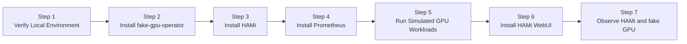

This lab walks you through setting up a fully local Kubernetes cluster on macOS using OrbStack's built-in Kubernetes and [run-ai/fake-gpu-operator](https://github.com/run-ai/fake-gpu-operator), then installing HAMi online.

This lab does not require a real NVIDIA GPU. It is designed for classroom preparation, understanding HAMi component architecture, verifying GPU Pod scheduling workflows, and quickly getting familiar with basic HAMi usage on a personal computer.

## What You'll Get

After completing this lab, you will have a local Kubernetes cluster with:

- fake-gpu-operator simulating `nvidia.com/gpu` resources on CPU nodes
- HAMi scheduler, admission webhook, and other control plane components running normally
- Regular Pods can request simulated GPUs via `nvidia.com/gpu`
- You can observe the complete chain from fake GPU resource discovery, Pod request, scheduling, to running

> Note: fake GPU does not represent real GPU memory isolation, compute isolation, CUDA runtime, or driver capabilities. This lab is for understanding HAMi components and basic scheduling workflows. Real memory slicing (`nvidia.com/gpumem`), compute limits (`nvidia.com/gpucores`), CUDA program execution, and performance isolation still require a real NVIDIA GPU environment.

## Installation Overview

The entire local installation process consists of 7 steps:



| Step | Purpose | What It Solves |
| ------ | ------ | ------------- |
| Verify Local Environment | Check OrbStack, kubectl, Helm | Ensure Kubernetes cluster is available |
| Install fake-gpu-operator | Simulate NVIDIA GPU resources | Allow nodes without GPUs to report `nvidia.com/gpu` |
| Install HAMi | Deploy HAMi control plane | Observe HAMi scheduler, webhook, and other components |
| Install Prometheus | Deploy monitoring stack | Collect GPU metrics and provide data source for HAMi WebUI |
| Run Simulated GPU Workloads | Verify scheduling workflow | Experience Pod GPU request and scheduling |
| Install HAMi WebUI | Deploy visual management interface | Graphically view GPU nodes, resource allocation, and usage trends |
| Observe HAMi and fake GPU | Understand component responsibility boundaries | Clarify which capabilities require real GPUs |

## Prerequisites

- macOS, Intel or Apple Silicon
- [OrbStack](https://orbstack.dev/) installed with built-in Kubernetes enabled
- Access to GitHub, GHCR, and the HAMi Helm repository
- At least 4 CPU and 8 GB of memory available for the lab

> **Why OrbStack?** OrbStack comes with built-in Kubernetes (based on k3s), so there's no need to install kind or Docker Desktop separately. It uses fewer resources, starts faster, and is the preferred choice for local labs on macOS.

## Step 1: Verify Local Environment

First, check that the Kubernetes cluster is running normally.

Check the cluster version:

```bash
kubectl version
```

Example output:

```plaintext
Client Version: v1.33.9
Kustomize Version: v5.6.0
Server Version: v1.33.9+orb1
```

> The `orb1` suffix in `Server Version` indicates this is OrbStack's built-in Kubernetes. Client and Server versions should match.

View cluster nodes:

```bash
kubectl get nodes -o wide
```

Example output:

```plaintext
NAME       STATUS   ROLES                  AGE    VERSION        INTERNAL-IP     EXTERNAL-IP   OS-IMAGE   KERNEL-VERSION                             CONTAINER-RUNTIME
orbstack   Ready    control-plane,master   148d   v1.33.9+orb1   192.168.139.2   <none>        OrbStack   7.0.5-orbstack-00330-ge3df4e19b0a0-dirty   docker://29.4.0
```

> The node name is `orbstack`, role is `control-plane,master`, this is a single-node cluster acting as both control plane and worker node. `STATUS` of `Ready` means the cluster is healthy.

Check Helm (needed later for installing fake-gpu-operator and HAMi):

```bash
helm version
```

Example output:

```plaintext
version.BuildInfo{Version:"v4.2.0", ...}
```

> Helm 3.x or later is required. If Helm is not installed, run `brew install helm`.

## Step 2: Install fake-gpu-operator

fake-gpu-operator simulates GPU resources on nodes without NVIDIA GPUs and sets the node capacity to `nvidia.com/gpu`. This step replaces the NVIDIA GPU Operator, drivers, device-plugin, and DCGM metrics collection pipeline that would be present in a real GPU environment.

### 2.1 Create Namespace and Set Security Policy

```bash
kubectl create namespace gpu-operator
kubectl label namespace gpu-operator pod-security.kubernetes.io/enforce=privileged
```

```plaintext
namespace/gpu-operator created
namespace/gpu-operator labeled
```

> The `gpu-operator` namespace is dedicated to fake-gpu-operator components. The `privileged` label allows Pods to run in privileged mode, the fake-gpu-operator's device-plugin needs access to host device files.

### 2.2 Label the Node

fake-gpu-operator uses node labels to determine which nodes should simulate GPUs:

```bash
NODE_NAME=$(kubectl get nodes -o jsonpath='{.items[0].metadata.name}')
kubectl label node ${NODE_NAME} run.ai/simulated-gpu-node-pool=default
```

```plaintext
node/orbstack labeled
```

> The label `run.ai/simulated-gpu-node-pool=default` tells fake-gpu-operator: "Simulate GPUs on this node." This is fake-gpu-operator's node selector mechanism.

### 2.3 Install fake-gpu-operator

```bash
export FAKE_GPU_OPERATOR_VERSION=0.0.80

helm upgrade -i gpu-operator \
    oci://ghcr.io/run-ai/fake-gpu-operator/fake-gpu-operator \
    --namespace gpu-operator \
    --create-namespace \
    --version ${FAKE_GPU_OPERATOR_VERSION}
```

```plaintext
Release "gpu-operator" does not exist. Installing it now.
Pulled: ghcr.io/run-ai/fake-gpu-operator/fake-gpu-operator:0.0.80
Digest: sha256:...
NAME: gpu-operator
LAST DEPLOYED: ...
NAMESPACE: gpu-operator
STATUS: deployed
REVISION: 1
TEST SUITE: None
```

> `helm upgrade -i` = install if the release doesn't exist, upgrade if it does. The `oci://` prefix means pulling the Helm Chart from GitHub Container Registry. `0.0.80` is a stable version released in 2026-04.

### 2.4 Wait for Components to Run

```bash
kubectl get pods -n gpu-operator
```

Example output:

```plaintext
NAME                                       READY   STATUS    RESTARTS   AGE
device-plugin-l8m6j                        1/1     Running   0          31m
kwok-gpu-device-plugin-5996cdf4f9-mfvpm    1/1     Running   0          31m
nvidia-dcgm-exporter-knfsn                 1/1     Running   0          31m
nvidia-dcgm-exporter-kwok-b8fd4976-blb8c   1/1     Running   0          31m
status-updater-59965d7bc6-fbkmk            1/1     Running   0          31m
topology-server-9d57b6c79-7dv6h            1/1     Running   0          31m
```

> Component descriptions:
>
> - `device-plugin`: DaemonSet running on each GPU node, reporting GPU resources to Kubernetes
> - `kwok-gpu-device-plugin`: Uses KWOK (Kubernetes WithOut Kubelet) to simulate GPU devices
> - `nvidia-dcgm-exporter`: Simulates DCGM metrics export (GPU temperature, utilization, etc.)
> - `status-updater`: Updates node GPU status
> - `topology-server`: Manages GPU topology information

If all Pods are `Running` with `READY` at `1/1`, the installation is successful.

### 2.5 Verify Simulated GPU Resources

Check whether the node reports GPU capacity:

```bash
kubectl get node ${NODE_NAME} \
    -o custom-columns=NAME:.metadata.name,GPU:.status.capacity.nvidia\\.com/gpu
```

```plaintext
NAME       GPU
orbstack   2
```

> The `GPU` column shows `2`, meaning fake-gpu-operator has simulated 2 GPUs on the node. This number can be adjusted in the fake-gpu-operator configuration.

View the node's detailed GPU labels:

```bash
kubectl get node ${NODE_NAME} --show-labels | tr ',' '\n' | grep -E 'nvidia.com/gpu|run.ai'
```

```plaintext
nvidia.com/gpu.count=2
nvidia.com/gpu.deploy.dcgm-exporter=true
nvidia.com/gpu.deploy.device-plugin=true
nvidia.com/gpu.memory=11441
nvidia.com/gpu.present=true
nvidia.com/gpu.product=Tesla-K80
run.ai/fake.gpu=true
run.ai/simulated-gpu-node-pool=default
```

> These labels simulate information from a real GPU node:
>
> - `nvidia.com/gpu.count=2`: Simulates 2 GPUs
> - `nvidia.com/gpu.product=Tesla-K80`: Simulates GPU model as Tesla K80
> - `nvidia.com/gpu.memory=11441`: Simulates 11441 MiB of memory per GPU
> - `run.ai/fake.gpu=true`: Marks this as a simulated GPU

If the `GPU` column is empty, check the node labels:

```bash
kubectl get node ${NODE_NAME} --show-labels | grep run.ai/simulated-gpu-node-pool
```

## Step 3: Install HAMi

This step installs HAMi's control plane components:

- `hami-scheduler`: Scheduling enhancement component that participates in GPU Pod scheduling decisions
- Admission webhook: Automatically rewrites GPU Pod scheduler configuration
- Helm release: Manages all HAMi-related Kubernetes resources

In the fake GPU environment, GPU resources are provided by fake-gpu-operator. To avoid two device-plugins simultaneously registering `nvidia.com/gpu`, this lab does not let the HAMi device-plugin take over the fake nodes.

### 3.1 Add the HAMi Helm Repository

```bash
helm repo add hami-charts https://project-hami.github.io/HAMi/
helm repo update
```

```plaintext
"hami-charts" has been added to your repositories
Hang tight while we grab the latest from your chart repositories...
...Successfully got an update from the "hami-charts" chart repository
Update Complete. ⎈Happy Helming!⎈
```

### 3.2 Install HAMi

```bash
helm install hami hami-charts/hami \
    -n kube-system \
    --set devicePlugin.enabled=false
```

```plaintext
NAME: hami
LAST DEPLOYED: ...
NAMESPACE: kube-system
STATUS: deployed
REVISION: 1
TEST SUITE: None
```

> `--set devicePlugin.enabled=false` is the key parameter. Because fake-gpu-operator is already managing GPU devices, starting HAMi's device-plugin as well would cause a conflict. Therefore, only HAMi's scheduling enhancement components are installed here.

### 3.3 Verify HAMi Components

```bash
kubectl get pods -n kube-system | grep hami
```

```plaintext
hami-scheduler-5d9678f989-dnf65          2/2     Running   0             28m
```

> `2/2` indicates this Pod has 2 containers (scheduler container + webhook container), both running normally.

View HAMi's control plane resources:

```bash
kubectl get deploy,svc,cm,sa -n kube-system | grep hami
```

```plaintext
deployment.apps/hami-scheduler           1/1     1            1           28m
service/hami-scheduler   NodePort    192.168.194.156   <none>        443:31998/TCP,31993:31993/TCP   28m
configmap/hami-scheduler                                         1      28m
configmap/hami-scheduler-device                                  1      28m
serviceaccount/hami-scheduler                                0         28m
```

> Resource descriptions:
>
> - `deployment.apps/hami-scheduler`: HAMi scheduler Deployment
> - `service/hami-scheduler`: Scheduler Service, type `NodePort`, ports `31998` (webhook) and `31993` (scheduling)
> - `configmap/hami-scheduler`: Scheduler configuration
> - `configmap/hami-scheduler-device`: Device configuration
> - `serviceaccount/hami-scheduler`: Service account used by the scheduler

### 3.4 Confirm All Helm Releases

```bash
helm list -A
```

```plaintext
NAME         NAMESPACE    REVISION UPDATED                              STATUS   CHART                    APP VERSION
gpu-operator gpu-operator 1        2026-05-21 16:12:01.872099 +0800 CST deployed fake-gpu-operator-0.0.80 0.0.80     
hami         kube-system  1        2026-05-21 16:15:24.295479 +0800 CST deployed hami-2.9.0               2.9.0
```

> Both Helm Releases show `deployed` status. `gpu-operator` is in the `gpu-operator` namespace, `hami` is in the `kube-system` namespace.

## Step 4: Install Prometheus

HAMi WebUI needs to read GPU metrics from Prometheus. This step deploys a complete monitoring stack using [kube-prometheus-stack](https://github.com/prometheus-community/helm-charts/tree/main/charts/kube-prometheus-stack).

> **Why install Prometheus?** HAMi WebUI's cluster overview, GPU utilization, memory usage, and other chart data all come from Prometheus. Without Prometheus, the WebUI can only display blank pages.

### 4.1 Add the Helm Repository

```bash
helm repo add prometheus-community https://prometheus-community.github.io/helm-charts
helm repo update
```

### 4.2 Install kube-prometheus-stack

```bash
helm install prometheus prometheus-community/kube-prometheus-stack \
    -n monitoring --create-namespace \
    --set grafana.enabled=false \
    --version=75.15.1
```

```plaintext
NAME: prometheus
LAST DEPLOYED: ...
NAMESPACE: monitoring
STATUS: deployed
REVISION: 1
```

> `--set grafana.enabled=false`: Skip Grafana installation. This lab only uses Prometheus as the data source for HAMi WebUI. If you want Grafana for richer visualizations, remove this parameter.

### 4.3 Wait for Prometheus to Be Ready

```bash
kubectl get pods -n monitoring
```

Example output:

```plaintext
NAME                                                     READY   STATUS    RESTARTS   AGE
alertmanager-prometheus-kube-prometheus-alertmanager-0   2/2     Running   0          2m
prometheus-kube-prometheus-operator-d89fb8945-htjjd      1/1     Running   0          2m
prometheus-kube-state-metrics-7f5f75c85d-mbsbh           1/1     Running   0          2m
prometheus-prometheus-kube-prometheus-prometheus-0       2/2     Running   0          2m
prometheus-prometheus-node-exporter-77pxd                1/1     Running   0          2m
```

> All Pods should be `Running`. The `prometheus-prometheus-kube-prometheus-prometheus-0` Pod is the core Prometheus instance.

### 4.4 Create ServiceMonitor to Collect GPU Metrics

The ServiceMonitors included with kube-prometheus-stack do not cover fake-gpu-operator's GPU metrics. You need to create one manually:

```bash
kubectl apply -f - <<'EOF'
apiVersion: monitoring.coreos.com/v1
kind: ServiceMonitor
metadata:
  name: nvidia-dcgm-exporter
  namespace: gpu-operator
  labels:
    release: prometheus
spec:
  selector:
    matchLabels:
      app: nvidia-dcgm-exporter
  namespaceSelector:
    matchNames:
      - gpu-operator
  endpoints:
    - port: gpu-metrics
      path: /metrics
      interval: 15s
EOF
```

```plaintext
servicemonitor.monitoring.coreos.com/nvidia-dcgm-exporter created
```

> The ServiceMonitor tells Prometheus: "Go to the `gpu-operator` namespace, find the Service with label `app: nvidia-dcgm-exporter`, and scrape `/metrics` from its `gpu-metrics` port every 15 seconds." The `release: prometheus` label is required by kube-prometheus-stack's ServiceMonitor selector.

Wait about 30 seconds, then verify that GPU metrics are being collected:

```bash
kubectl exec -n monitoring prometheus-prometheus-kube-prometheus-prometheus-0 -- \
    promtool query instant http://localhost:9090 'DCGM_FI_DEV_GPU_UTIL'
```

```plaintext
DCGM_FI_DEV_GPU_UTIL{..., device="nvidia1", ..., modelName="Tesla-K80", ...} => 0
DCGM_FI_DEV_GPU_UTIL{..., device="nvidia0", ..., modelName="Tesla-K80", ...} => 0
```

> Seeing `DCGM_FI_DEV_GPU_UTIL` data means Prometheus is now collecting fake GPU metrics. A utilization of 0 is normal, there are no real GPU compute tasks running.

## Step 5: Run Simulated GPU Workloads

Verify that Kubernetes can schedule Pods requesting `nvidia.com/gpu` to the fake GPU node. fake-gpu-operator injects a simulated `nvidia-smi` tool into GPU Pods for observing GPU visibility.

Since this lab does not enable the HAMi device-plugin, HAMi will not write the `hami.io/node-nvidia-register` node registration information that would be present in a real environment. Therefore, the test Pod explicitly bypasses the HAMi webhook and uses the default Kubernetes scheduler with the simulated GPU resources provided by fake-gpu-operator.

### 5.1 Create a Test Pod

First, review the Pod YAML:

```yaml
apiVersion: v1
kind: Pod
metadata:
  name: fake-gpu-pod
  labels:
    hami.io/webhook: ignore
  annotations:
    run.ai/simulated-gpu-utilization: "10-30"
spec:
  restartPolicy: Never
  containers:
  - name: app
    image: ubuntu:22.04
    command: [ "bash", "-lc", "sleep 3600" ]
    resources:
      requests:
        cpu: "100m"
        memory: "128Mi"
      limits:
        cpu: "500m"
        memory: "512Mi"
        nvidia.com/gpu: 1
    env:
    - name: NODE_NAME
      valueFrom:
        fieldRef:
          fieldPath: spec.nodeName
```

> YAML key points:
>
> - `hami.io/webhook: ignore` label: Tells the HAMi webhook not to intercept this Pod, using the default scheduler instead
> - `run.ai/simulated-gpu-utilization: "10-30"` annotation: fake-gpu-operator will make `nvidia-smi` report 10%-30% GPU utilization
> - `resources.limits.nvidia.com/gpu: 1`: Requests 1 GPU
> - `sleep 3600`: Keeps the container running for 1 hour, allowing us to enter the container and observe

Create the Pod:

```bash
kubectl apply -f fake-gpu-pod.yaml
```

```plaintext
pod/fake-gpu-pod created
```

### 5.2 Wait for the Pod to Run

```bash
kubectl get pod fake-gpu-pod -o wide
```

```plaintext
NAME           READY   STATUS    RESTARTS   AGE   IP               NODE       NOMINATED NODE   READINESS GATES
fake-gpu-pod   1/1     Running   0          7m    192.168.194.22   orbstack   <none>           <none>
```

> `STATUS` is `Running` and `NODE` is `orbstack`, indicating the Pod was successfully scheduled to the local node. If pulling the `ubuntu:22.04` image for the first time, it may take a few dozen seconds.

### 5.3 View the Pod's GPU Resource Request

```bash
kubectl describe pod fake-gpu-pod | grep -A6 "Limits"
```

```plaintext
    Limits:
      nvidia.com/gpu:  1
    Requests:
      nvidia.com/gpu:  1
    Environment:
      NODE_NAME:   (v1:spec.nodeName)
```

> Both `Limits` and `Requests` show `nvidia.com/gpu: 1`, meaning this Pod requests 1 GPU. Kubernetes only schedules a Pod to a GPU node when both requests and limits have `nvidia.com/gpu` set.

### 5.4 View Node GPU Resource Allocation

```bash
kubectl describe node ${NODE_NAME} | grep -A10 "Allocated resources"
```

```plaintext
Allocated resources:
  (Total limits may be over 100 percent, i.e., overcommitted.)
  Resource           Requests     Limits
  --------           --------     ------
  cpu                750m (7%)    1700m (17%)
  memory             870Mi (10%)  1996Mi (24%)
  ephemeral-storage  0 (0%)       0 (0%)
  nvidia.com/gpu     1            1
```

> The `nvidia.com/gpu` row shows both Requests and Limits as `1`, meaning 1 GPU is already occupied by this Pod. The node has a total of 2 GPUs, so 1 more can be allocated to another Pod.

### 5.5 Execute Simulated nvidia-smi

This is the most critical verification step, execute `nvidia-smi` inside the Pod to see if fake-gpu-operator successfully injected the simulated GPU tool:

```bash
kubectl exec fake-gpu-pod -- nvidia-smi
```

```plaintext
Thu May 21 08:44:31 2026
+------------------------------------------------------------------------------+
| NVIDIA-SMI 470.129.06   Driver Version: 470.129.06   CUDA Version: 11.4      |
+--------------------------------+----------------------+----------------------+
| GPU  Name        Persistence-M | Bus-Id        Disp.A | Volatile Uncorr. ECC |
| Fan  Temp  Perf  Pwr:Usage/Cap |         Memory-Usage | GPU-Util  Compute M. |
|                                |                      |               MIG M. |
+--------------------------------+----------------------+----------------------+
|   0  Tesla-K80             Off | 00000001:00:00.0 Off |                  Off |
| N/A   33C    P8    11W /  70W  |  11441MiB / 11441MiB |      18%     Default |
|                                |                      |                  N/A |
+--------------------------------+----------------------+----------------------+

+------------------------------------------------------------------------------+
| Processes:                                                                   |
|  GPU   GI   CI        PID   Type   Process name                  GPU Memory  |
|        ID   ID                                                   Usage       |
+------------------------------------------------------------------------------+
|    0   N/A  N/A       23       G   sleep 3600                       11441MiB |
+------------------------------------------------------------------------------+
```

> Output interpretation:
>
> - **Driver Version: 470.129.06**: Simulated NVIDIA driver version
> - **CUDA Version: 11.4**: Simulated supported CUDA version
> - **GPU 0: Tesla-K80**: Simulated GPU model, consistent with the node label `nvidia.com/gpu.product=Tesla-K80`
> - **11441MiB / 11441MiB**: Memory used/total, consistent with the node label `nvidia.com/gpu.memory=11441`
> - **GPU-Util: 18%**: GPU utilization, within the range specified by the annotation `run.ai/simulated-gpu-utilization: "10-30"`
> - **Processes: sleep 3600, 11441MiB**: Shows the GPU memory occupied by the current process

> This is the core capability of fake-gpu-operator: on a machine without a physical GPU, it makes the container see an environment that "looks like it has a GPU." All data in the `nvidia-smi` output is simulated.

## Step 6: Install HAMi WebUI

HAMi WebUI provides a graphical GPU resource management interface where you can view node GPU information, resource allocation rates, usage trends, and more.

### 6.1 Add the HAMi WebUI Helm Repository

```bash
helm repo add hami-webui https://Project-HAMi.github.io/HAMi-WebUI/
helm repo update
```

### 6.2 Add GPU Label to the Node

HAMi WebUI discovers GPU nodes via the `gpu=on` node label:

```bash
kubectl label node ${NODE_NAME} gpu=on
```

```plaintext
node/orbstack labeled
```

### 6.3 Add Simulated GPU Registration Information

In a real environment, the HAMi device-plugin automatically writes the `hami.io/node-nvidia-register` annotation on nodes, containing GPU UUID, model, memory, and other information. Since this lab disables the device-plugin (to avoid conflicts with fake-gpu-operator), you need to add it manually:

```bash
kubectl annotate node ${NODE_NAME} \
  hami.io/node-nvidia-register='[{"id":"GPU-3cef3724-8228-5a66-b391-b0901788f5d0","count":10,"devmem":11441,"devcore":100,"type":"NVIDIA-Tesla-K80","mode":"hami-core","health":true},{"id":"GPU-5127182e-f297-5a25-bb44-0444c3be540c","index":1,"count":10,"devmem":11441,"devcore":100,"type":"NVIDIA-Tesla-K80","mode":"hami-core","health":true}]' \
  hami.io/node-handshake="Requesting_$(date '+%Y.%m.%d %H:%M:%S')"
```

> Annotation format explanation: one JSON object per GPU, matching what the HAMi v2.9.0 device plugin writes on real GPU nodes. `id` is the device UUID, `count` is the number of vGPU partitions per card (HAMi defaults to 10), `devmem` is VRAM in MiB, `devcore` is compute capacity in %, and `mode` is `hami-core` for software-level partitioning. The UUID and memory values here come from the fake-gpu-operator's dcgm-exporter metrics.

### 6.4 Install HAMi WebUI

```bash
helm install my-hami-webui hami-webui/hami-webui \
    --set externalPrometheus.enabled=true \
    --set externalPrometheus.address="http://prometheus-kube-prometheus-prometheus.monitoring.svc.cluster.local:9090" \
    --set dcgm-exporter.enabled=false \
    -n kube-system
```

```plaintext
NAME: my-hami-webui
LAST DEPLOYED: ...
NAMESPACE: kube-system
STATUS: deployed
REVISION: 1
```

> Parameter descriptions:
>
> - `externalPrometheus.enabled=true`: Use an external Prometheus (the kube-prometheus-stack installed in Step 4)
> - `externalPrometheus.address`: In-cluster Service address for Prometheus
> - `dcgm-exporter.enabled=false`: Do not install an additional dcgm-exporter; fake-gpu-operator already includes one

### 6.5 Wait for WebUI to Be Ready

```bash
kubectl get pods -n kube-system | grep webui
```

```plaintext
my-hami-webui-85686fd65-77crx            2/2     Running   0          2m
```

> `2/2` indicates both the frontend (FE) and backend (BE) containers are running normally. If you encounter `ErrImagePull`, it may be a Docker Hub network issue, wait a few minutes and it will automatically retry.

### 6.6 Access the WebUI

Access it locally via port forwarding:

```bash
kubectl -n kube-system port-forward svc/my-hami-webui 8080:3000
```

Open `http://localhost:8080/admin/vgpu/monitor/overview` in your browser to see the cluster overview page:


> The cluster overview page shows:
>
> - **Total Nodes**: 1, **GPU Cards**: 2
> - **Resource Overview**: Total CPU cores, total memory, total GPU memory
> - **GPU Type Distribution**: Shows the simulated Tesla-K80
> - **GPU Compute/Memory Trend Charts**: From Prometheus DCGM metrics

Click "Node Management" in the left sidebar to view GPU node details:


> The Node Management page shows each node's GPU device list, memory allocation, and running workloads.

## Step 7: Observe the Boundaries of HAMi and fake GPU

### What HAMi Is Responsible for in This Lab

```bash
kubectl get deploy,svc,cm,sa -n kube-system | grep hami
```

```plaintext
deployment.apps/hami-scheduler           1/1     1            1           28m
service/hami-scheduler   NodePort    192.168.194.156   <none>        443:31998/TCP,31993:31993/TCP   28m
configmap/hami-scheduler                                         1      28m
configmap/hami-scheduler-device                                  1      28m
serviceaccount/hami-scheduler                                0         28m
```

> HAMi only deployed the scheduler in this lab. Since `devicePlugin.enabled=false` was set, HAMi's device-plugin is not running. This means HAMi's core GPU slicing capability is not enabled.

### What fake-gpu-operator Is Responsible for in This Lab

```bash
kubectl get daemonset,deploy,pod -n gpu-operator
```

```plaintext
NAME                                  DESIRED   CURRENT   READY   UP-TO-DATE   AVAILABLE   NODE SELECTOR                                    AGE
daemonset.apps/device-plugin          1         1         1       1            1           nvidia.com/gpu.deploy.device-plugin=true         31m
daemonset.apps/mig-faker              0         0         0       0            0           node-role.kubernetes.io/runai-dynamic-mig=true   31m
daemonset.apps/nvidia-dcgm-exporter   1         1         1       1            1           nvidia.com/gpu.deploy.dcgm-exporter=true         31m
...
```

> fake-gpu-operator is responsible for the entire lifecycle of simulated devices: device discovery, resource reporting, and metrics export. It simulates the behavior of a real GPU Operator.

View node capacity:

```bash
kubectl describe node ${NODE_NAME} | grep -A10 "Capacity:"
```

```plaintext
Capacity:
  cpu:                10
  ephemeral-storage:  148577276Ki
  memory:             8185404Ki
  nvidia.com/gpu:     2
  pods:               110
```

> `nvidia.com/gpu: 2` appears in the node capacity, confirming that fake-gpu-operator successfully registered simulated GPU resources. The Kubernetes scheduler treats this node as having 2 GPUs.

### What This Lab Cannot Verify

The following capabilities require a real NVIDIA GPU environment:

- HAMi device-plugin actually registering GPUs and writing `hami.io/node-nvidia-register`
- `nvidia.com/gpumem` memory slicing
- `nvidia.com/gpucores` compute ratio limits
- CUDA programs actually running
- Memory overcommit, memory analysis, memory override
- Real DCGM GPU metrics

To continue learning these capabilities in full, use a real GPU environment as described in [Lab 1: Online HAMi Installation](./online-install.md).

## Cleanup

Delete the test Pod:

```bash
kubectl delete pod fake-gpu-pod
```

```plaintext
pod "fake-gpu-pod" deleted
```

Uninstall HAMi WebUI:

```bash
helm uninstall my-hami-webui -n kube-system
```

Uninstall HAMi:

```bash
helm uninstall hami -n kube-system
```

Uninstall Prometheus:

```bash
helm uninstall prometheus -n monitoring
kubectl delete namespace monitoring
```

Uninstall fake-gpu-operator:

```bash
helm uninstall gpu-operator -n gpu-operator
kubectl delete namespace gpu-operator
```

Clean up node labels and annotations:

```bash
kubectl label node ${NODE_NAME} gpu- run.ai/simulated-gpu-node-pool-
kubectl annotate node ${NODE_NAME} hami.io/node-nvidia-register- hami.io/node-handshake-
```

> If you want to keep the environment for further experimentation, you can skip the cleanup.

## Next Steps

After completing this lab, we recommend continuing with [HAMi Cluster Architecture](/docs/core-concepts/hami-architecture), focusing on understanding the responsibility boundaries of the scheduler, device-plugin, webhook, and GPU Operator.
