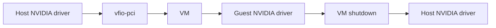
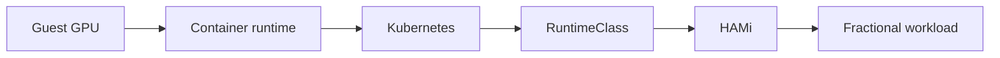
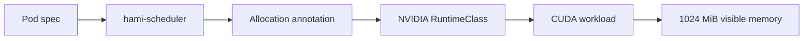

This lab builds and validates the tested local HAMi GPU lab used for a real passthrough run. The host is a Linux workstation running QEMU/KVM and system libvirt. A real NVIDIA GPU is temporarily moved from the host driver to an Ubuntu VM, and the guest owns the NVIDIA driver, container runtime, Kubernetes, CNI, and HAMi stack.

The lab is phase-gated. Each layer is checked before the next one is added: host virtualization and IOMMU, CPU-only VM, disposable rollback, VFIO detach/recovery, managed libvirt passthrough, guest NVIDIA driver, NVIDIA/containerd runtime, Kubernetes and CNI, pre-HAMi GPU runtime, HAMi v2.10.0, and finally a fractional CUDA workload. A clean VM shutdown returns the GPU to the host driver.

:::note

This is the tested architecture from one local lab. It is not a complete VFIO/libvirt troubleshooting guide for every laptop or workstation topology.

:::

## What You'll Learn

- How to check host virtualization, KVM, IOMMU, GPU topology, and device ownership
- How to identify the NVIDIA GPU, companion audio function, and IOMMU group
- How to build and validate a CPU-only Ubuntu VM before adding passthrough
- How to use a disposable qcow2 overlay as the rollback boundary
- How to validate VFIO detach and host driver recovery before starting the VM
- How to attach the NVIDIA GPU and HDA function through libvirt managed host devices
- How to validate guest NVIDIA driver and NVIDIA/containerd runtime layers
- How to bootstrap Kubernetes and Calico CNI inside the Ubuntu guest
- How to validate the pre-HAMi GPU runtime path before installing HAMi
- How to install and verify HAMi v2.10.0 with `RuntimeClass` `nvidia`
- How to run a fractional CUDA workload and inspect HAMi allocation metadata
- How to clean up and recover the GPU on the host after VM shutdown

## Lab Overview

The tested architecture follows this path:

```plaintext
Linux host
-> virtualization and IOMMU checks
-> CPU-only Ubuntu VM
-> disposable qcow2 rollback layer
-> VFIO detach and recovery gate
-> libvirt managed GPU passthrough
-> guest NVIDIA driver
-> NVIDIA/containerd runtime
-> Kubernetes and Calico CNI
-> pre-HAMi GPU runtime validation
-> HAMi v2.10.0
-> fractional CUDA workload
-> cleanup and host GPU recovery
```

The VM boundary keeps the host cleaner. Kubernetes, CNI, HAMi, containerd changes, and NVIDIA runtime configuration live inside the guest. The host display stays on the integrated GPU or another non-passed-through GPU. In this run, the passed-through RTX 3050 was compute-only inside the guest, while the guest console stayed on a virtual display.

## Environment Used for This Run

Every captured output below comes from one local passthrough lab.

| Component           | Value                               |
| ------------------- | ----------------------------------- |
| Host type           | Arch/Archcraft Linux workstation    |
| VM stack            | QEMU/KVM, system libvirt, OVMF/UEFI |
| Guest OS            | Ubuntu Server 24.04.5               |
| VM name             | `hami-lab`                          |
| Kubernetes node     | `hami-lab`                          |
| Kubernetes version  | `v1.36.4`                           |
| Container runtime   | `containerd://2.2.1`                |
| CNI                 | Calico v3.32.2, VXLAN, no BGP       |
| GPU                 | NVIDIA GeForce RTX 3050 Laptop GPU  |
| Physical GPU memory | 4096 MiB                            |
| Guest NVIDIA driver | 595.84                              |
| HAMi version        | v2.10.0                             |

:::tip

Your GPU, driver, package manager, and PCI addresses can differ. Keep the same verification pattern: validate one layer, stop at the failed gate, and continue only after that layer is understood.

:::

## Prerequisites

Before starting, you need:

- A Linux host with QEMU/KVM, system libvirt, OVMF, and `qemu-img`
- A CPU, firmware, and kernel configuration that expose virtualization and IOMMU support
- A host display path that does not depend on the NVIDIA GPU being passed through
- An NVIDIA GPU whose complete IOMMU group can move to the VM
- Permission to manage system libvirt, host services, and guest packages
- Network access from the guest for Ubuntu, Kubernetes, Calico, NVIDIA, CUDA sample, and HAMi artifacts
- Enough disk space for the VM, container images, Kubernetes images, and rollback overlays

This run started from an Arch/Archcraft host where QEMU, libvirt, OVMF, and the default libvirt NAT network were already present. No host package-install command was preserved for those tools, so this lab begins by verifying them rather than publishing a generic host package recipe.

## Phase 1: Verify Host Virtualization and IOMMU

This phase confirms the host can run a KVM guest and exposes IOMMU groups before any VM or GPU mutation.

Run on the host:

```bash
lscpu | grep -E 'Virtualization|Model name'
test -e /dev/kvm && echo "/dev/kvm is present"
ls /sys/kernel/iommu_groups/ >/dev/null && echo "IOMMU groups are visible"
find /sys/kernel/iommu_groups -maxdepth 3 -type l | sort
```

Captured output:

```plaintext
CPU: AMD Ryzen 5 5600H with Radeon Graphics
Virtualization: AMD-V
/dev/kvm: present
kvm_amd: loaded
kvm: loaded
AMD-Vi: active
IOMMU default domain: Translated
IOMMU groups: populated
Root filesystem: 276G total, 121G used, 141G available (47%)
```

Run on the host to identify the NVIDIA functions:

```bash
lspci -nn | grep -Ei 'nvidia|vga|3d|audio'
lspci -nnk -d 10de:
```

Captured output:

```plaintext
01:00.0 NVIDIA GA107M GeForce RTX 3050 Mobile [10de:25a2]
  current driver: nvidia
01:00.1 NVIDIA GA107 High Definition Audio [10de:2291]
  current driver: snd_hda_intel

IOMMU group 11 contains exactly:
  0000:01:00.0 NVIDIA RTX 3050
  0000:01:00.1 NVIDIA HDA audio

AMD Cezanne/Vega iGPU:
  06:00.0
  current driver: amdgpu
  separate PCI/root-port branch from the RTX
```

Gate before continuing: the NVIDIA GPU and its companion audio function must be in a group that can move together, without essential host devices in the same group.

## Phase 2: Build and Validate the CPU-only Ubuntu VM

Create the VM before assigning the GPU. The tested VM was created through libvirt as a CPU-only Ubuntu Server 24.04.5 guest with:

- VM name: `hami-lab`
- Machine type: Q35
- Firmware: OVMF/UEFI
- vCPU: 4
- RAM: 8 GiB
- Disk: 50 GiB qcow2
- Disk and NIC: VirtIO
- Network: libvirt default NAT
- Display: virtual display
- SSH server: installed during Ubuntu setup
- Physical GPU: not assigned yet

No exact original VM creation command was captured, so this lab documents the tested libvirt settings rather than publishing a reconstructed `virt-install` command. Create the VM with equivalent libvirt settings, complete the Ubuntu install, then validate the resulting CPU-only guest.

Run on the host:

```bash
virsh -c qemu:///system domstate hami-lab
ssh <guest-user>@<guest-ip> \
  'hostname; uptime; lsb_release -ds; systemctl is-active ssh'
```

Captured output:

```plaintext
hami-lab booted successfully from installed qcow2
Guest address: 192.168.122.250/24
SSH login from Arch host succeeded as utkarsh
Guest banner: Ubuntu 24.04.5 LTS
Kernel: 6.8.0-139-generic x86_64
```

Gate before continuing: the CPU-only VM must boot, accept SSH, reboot, and shut down cleanly before any GPU passthrough work begins.

## Phase 3: Add the Disposable Rollback Layer

The tested rollback model used a base qcow2 and a disposable active overlay:

```plaintext
hami-lab-ubuntu-base.qcow2
        |
        v
hami-lab.qcow2
```

Create the active overlay while the VM is shut off. Adapt only the paths to your libvirt storage location:

```bash
qemu-img create -f qcow2 \
  -F qcow2 \
  -b <base-image>.qcow2 \
  <active-overlay>.qcow2

qemu-img info <active-overlay>.qcow2
```

Run a write/discard test before using the VM for GPU work:

```bash
ssh <guest-user>@<guest-ip> \
  'sudo touch /root/phase2-rollback-test.txt; touch ~/phase2-marker.txt'

virsh -c qemu:///system shutdown hami-lab
```

Then delete only the active overlay, recreate it from the same base image, boot the VM again, and check that the marker files are gone.

Captured output:

```plaintext
marker files created inside guest:
  /root/phase2-rollback-test.txt
  /home/utkarsh/phase2-marker.txt
guest shut down cleanly
active overlay deleted
fresh overlay recreated from hami-lab-ubuntu-base.qcow2
VM booted normally
SSH worked normally
root marker: absent
user marker: absent
hostname: hami-lab
root filesystem healthy
ssh service: active
```

Gate before continuing: you must be able to discard the active overlay and return to the known-good guest.

## Phase 4: Validate VFIO Detach and Host Recovery

PCI passthrough changes which driver owns the GPU. In normal host mode, the host NVIDIA and audio drivers own the two NVIDIA functions. For VM mode, libvirt moves both functions to `vfio-pci`, and QEMU assigns them to the guest through the IOMMU.



On this host, the AMD display path had to be active, and the host services that actually held or probed the NVIDIA devices had to be stopped before detach. Device users vary by host; inspect yours instead of stopping random services.

Run on the host:

```bash
sudo fuser -v /dev/nvidia* 2>/dev/null || true
sudo fuser -v /dev/snd/* 2>/dev/null || true
```

In this run, the lifecycle stopped these observed holders before passthrough:

```bash
systemctl --user stop pipewire-pulse.socket pipewire-pulse.service 2>/dev/null || true
systemctl --user stop wireplumber.service 2>/dev/null || true
systemctl --user stop pipewire.socket pipewire.service 2>/dev/null || true

sudo systemctl stop nbfc_service.service 2>/dev/null || true
sudo systemctl stop nvidia-persistenced.service 2>/dev/null || true
```

Run on the host:

```bash
sudo modprobe vfio-pci
sudo virsh -c qemu:///system nodedev-detach pci_0000_01_00_1
sudo virsh -c qemu:///system nodedev-detach pci_0000_01_00_0
lspci -nnk -s 01:00.0
lspci -nnk -s 01:00.1
```

Captured output:

```plaintext
01:00.0 RTX 3050:
  Kernel driver in use: vfio-pci

01:00.1 NVIDIA HDA:
  Kernel driver in use: vfio-pci
```

Reattach both functions before configuring persistent VM passthrough:

```bash
sudo virsh -c qemu:///system nodedev-reattach pci_0000_01_00_0
sudo virsh -c qemu:///system nodedev-reattach pci_0000_01_00_1
lspci -nnk -s 01:00.0
lspci -nnk -s 01:00.1
nvidia-smi
```

Captured output:

```plaintext
01:00.0 RTX 3050 -> nvidia
01:00.1 NVIDIA HDA -> snd_hda_intel

nvidia-smi:
  RTX visible
  Disp.A Off
  1 MiB used
  0% GPU util
  no running GPU processes
```

Gate before continuing: `nvidia/snd_hda_intel -> vfio-pci -> nvidia/snd_hda_intel` must be repeatable.

## Phase 5: Attach the NVIDIA GPU Through libvirt

Back up the VM XML and mutable OVMF NVRAM while the VM is shut off. The public host-device files are [rtx-gpu.xml](./examples/18-local-gpu-passthrough/libvirt/rtx-gpu.xml) and [rtx-audio.xml](./examples/18-local-gpu-passthrough/libvirt/rtx-audio.xml). They contain the tested managed host-device definitions for host `0000:01:00.0` and `0000:01:00.1`. Change the source addresses if your host differs.

The files omit the guest PCI addresses so libvirt can assign them for your VM's controller layout. The tested domain assigned guest addresses `07:00.0` and `08:00.0`, as shown here:

```xml
<hostdev mode='subsystem' type='pci' managed='yes'>
  <source>
    <address domain='0x0000' bus='0x01' slot='0x00' function='0x0'/>
  </source>
  <address type='pci' domain='0x0000' bus='0x07' slot='0x00' function='0x0'/>
</hostdev>
<hostdev mode='subsystem' type='pci' managed='yes'>
  <source>
    <address domain='0x0000' bus='0x01' slot='0x00' function='0x1'/>
  </source>
  <address type='pci' domain='0x0000' bus='0x08' slot='0x00' function='0x0'/>
</hostdev>
```

The virtual display remained primary:

```xml
<video>
  <model type='virtio' heads='1' primary='yes' device='virtio-vga'/>
</video>
```

On the host, attach each XML file to the shut-off `hami-lab` domain through the `qemu:///system` connection, using libvirt's `attach-device` operation with `--config`. Use the two files under `tutorials/labs/examples/18-local-gpu-passthrough/libvirt/` in your website checkout. The run record preserves this operation, connection, and resulting XML, but not the full original invocation, so no reconstructed terminal command is presented here.

With `managed='yes'`, VM start detaches the devices from the host and assigns them to QEMU. VM shutdown returns them to the host. Keep the virtual display primary; your guest PCI addresses may differ from the captured output below.

Gate before continuing: inspect the VM XML and confirm exactly two managed NVIDIA host devices are present, and the guest still has a virtual primary display.

## Phase 6: Validate the GPU Inside the Guest

Start the VM after host device users are clear.

Run on the host:

```bash
sudo virsh -c qemu:///system start hami-lab
ssh <guest-user>@<guest-ip> \
  "lspci -nn | grep -Ei 'nvidia|virtio.*gpu|vga|audio'"
```

Captured output:

```plaintext
07:00.0 VGA compatible controller:
  NVIDIA GA107M GeForce RTX 3050 Mobile [10de:25a2]

08:00.0 Audio device:
  NVIDIA [10de:2291]

00:01.0 Red Hat Virtio 1.0 GPU [1af4:1050]
```

Install the guest NVIDIA driver only after PCI visibility works.

Run inside the Ubuntu guest:

```bash
ubuntu-drivers devices
sudo apt-get update
sudo apt-get install -y nvidia-driver-595-open
sudo reboot
```

After reboot, run inside the guest:

```bash
nvidia-smi --query-gpu=name,driver_version,memory.total --format=csv,noheader
```

Captured output:

```plaintext
NVIDIA GeForce RTX 3050 Laptop GPU, 595.84, 4096 MiB
```

Gate before continuing: the guest driver must see the passed-through GPU before container or Kubernetes work begins.

## Phase 7: Configure NVIDIA Container Runtime

This phase verifies the NVIDIA runtime path without Kubernetes. In this run, the guest used containerd 2.2.1, runc 1.3.4, and NVIDIA Container Toolkit 1.20.0.

The package-install commands for containerd, runc, and the NVIDIA Container Toolkit were not preserved. Neither were the commands that generated `/etc/containerd/config.toml` and enabled systemd cgroups. Use the [containerd installation guide](https://github.com/containerd/containerd/blob/main/docs/getting-started.md) and [NVIDIA Container Toolkit installation guide](https://docs.nvidia.com/datacenter/cloud-native/container-toolkit/latest/install-guide.html) for those prerequisites. The tested NVIDIA packages were `nvidia-container-toolkit`, `nvidia-container-toolkit-base`, `libnvidia-container1`, and `libnvidia-container-tools`, all at `1.20.0-1`; current documentation may default to a newer version.

Before the runtime configuration step below, the guest had an explicit containerd v3 configuration with `SystemdCgroup = true`. The Kubernetes playbook checks this state and leaves the runtime configuration intact.

Run inside the guest:

```bash
containerd --version
runc --version
nvidia-ctk --version
sudo nvidia-ctk runtime configure --runtime=containerd
sudo systemctl restart containerd
systemctl is-active containerd
```

Captured output:

```plaintext
NVIDIA Container Toolkit 1.20.0 installed successfully.
nvidia-ctk runtime configure --runtime=containerd created /etc/containerd/conf.d/99-nvidia.toml
containerd restarted successfully and remains active.
```

The tested plain container used `docker.io/nvidia/cuda:12.8.1-base-ubuntu24.04`, the `io.containerd.runc.v2` runtime, `/usr/bin/nvidia-container-runtime`, and:

```plaintext
NVIDIA_VISIBLE_DEVICES=all
NVIDIA_DRIVER_CAPABILITIES=compute,utility
```

The exact `ctr run` invocation was not preserved. The image, runtime, environment, and result below are a validation checkpoint, not a captured command recipe. Confirm equivalent GPU visibility in your guest before proceeding.

Captured output from inside the container:

```plaintext
Driver Version: 595.84
CUDA Version reported by driver: 13.2
GPU: NVIDIA GeForce RTX 3050
Bus-Id: 00000000:07:00.0
VRAM: 4096 MiB
GPU-Util: 0%
```

Gate before continuing: the GPU must be visible through the guest container runtime before Kubernetes is added.

## Phase 8: Bootstrap Kubernetes and CNI

The tested Kubernetes bootstrap used a small Ansible workflow against the Ubuntu guest. The public bundle under `tutorials/labs/examples/18-local-gpu-passthrough/ansible/` contains [site.yml](./examples/18-local-gpu-passthrough/ansible/site.yml), [inventory.example.ini](./examples/18-local-gpu-passthrough/ansible/inventory.example.ini), [ansible.cfg](./examples/18-local-gpu-passthrough/ansible/ansible.cfg), [group_vars/all.yml](./examples/18-local-gpu-passthrough/ansible/group_vars/all.yml), and the four roles used for prerequisites, packages, kubeadm, and Calico. Use the whole directory from the website checkout; downloading `site.yml` alone is not enough.

The automation checks the NVIDIA/containerd baseline, applies Kubernetes prerequisites, installs pinned packages, runs kubeadm, removes the single-node control-plane taint, and installs Calico. The public bundle combines the successful Calico CRD installation with the final runtime-only VXLAN configuration. It does not install the Tigera operator. This sanitized bundle has been checked for syntax and task resolution; it has not been applied again to a fresh VM.

On the controller, install Ansible with the `community.general` and `ansible.posix` collections listed in [requirements.yml](./examples/18-local-gpu-passthrough/ansible/requirements.yml). From the website checkout root:

```bash
cd tutorials/labs/examples/18-local-gpu-passthrough/ansible
cp inventory.example.ini inventory.ini
ansible-galaxy collection install -r requirements.yml
```

Edit `inventory.ini`: replace `GUEST_IP` with the guest's reachable IP address and `GUEST_SSH_USER` with its SSH user. Verify SSH access and the host key first. The guest hostname must be `hami-lab`; the SSH user needs sudo access. The playbook derives the API advertise address from `ansible_host` and the user's home directory from the guest account database. Review the runtime and GPU expectations in `group_vars/all.yml` if your hardware differs.

Run from that directory on the controller:

```bash
ansible-playbook --syntax-check site.yml
ansible-playbook --list-tasks site.yml
ansible-playbook -K site.yml
```

The tested values were:

```plaintext
kubeadm/kubelet/kubectl: 1.36.4-1.1
Kubernetes version: v1.36.4
CRI socket: unix:///run/containerd/containerd.sock
containerd: 2.2.1
cgroup driver: systemd
Calico: v3.32.2
Calico backend: VXLAN
Calico IPIP: Never
Calico VXLAN: Always
Calico CIDR: 10.244.0.0/16
```

The Ansible workflow applied these guest-side prerequisites:

```plaintext
swapoff -a
swap entry persisted disabled in /etc/fstab
/etc/modules-load.d/k8s.conf
  overlay
  br_netfilter
/etc/sysctl.d/99-kubernetes-cri.conf
  net.bridge.bridge-nf-call-iptables = 1
  net.bridge.bridge-nf-call-ip6tables = 1
  net.ipv4.ip_forward = 1
```

It rendered and ran kubeadm with:

```plaintext
node name: hami-lab
cluster name: hami-lab
advertise address: guest IP from inventory.ini
Kubernetes version: v1.36.4
service subnet: 10.96.0.0/12
DNS domain: cluster.local
cgroupDriver: systemd
```

Validate inside the guest:

```bash
kubectl get nodes -o wide
kubectl get pods -n kube-system
systemctl is-active containerd
nvidia-smi --query-gpu=name,driver_version,memory.total --format=csv,noheader
```

Captured output:

```plaintext
node hami-lab: Ready
Kubernetes: v1.36.4
calico-node: 1/1 Running
calico-kube-controllers: 1/1 Running
CoreDNS x2: 1/1 Running
containerd: active
RTX 3050: visible at 07:00.0
NVIDIA driver: 595.84
```

Captured CNI validation:

```plaintext
IPPool CIDR: 10.244.0.0/16
IPIP: Never
VXLAN: Always
natOutgoing: true
10-calico.conflist: present
calico-kubeconfig: present
vxlan.calico: UP; VNI 4096; UDP/4789; local 192.168.122.250
NetworkUnavailable=False (CalicoIsUp)
Ready=True (KubeletReady)
```

Captured functional network gate:

```plaintext
Pod-to-Pod ping: 3/3, 0% loss
Pod-to-Pod HTTP: phase7-network-ok
ClusterIP HTTP: phase7-network-ok
service DNS-name HTTP: phase7-network-ok
kubernetes.default.svc.cluster.local -> 10.96.0.1
```

Gate before continuing: the node, CoreDNS, Calico, pod networking, service networking, DNS, containerd, and guest GPU must all be healthy.

## Phase 9: Validate the Pre-HAMi GPU Path

Before installing HAMi, validate the Kubernetes-to-containerd-to-NVIDIA runtime path with a `RuntimeClass`.

Run inside Kubernetes:

```bash
kubectl apply -f - <<'EOF'
apiVersion: node.k8s.io/v1
kind: RuntimeClass
metadata:
  name: nvidia
handler: nvidia
EOF

kubectl get runtimeclass nvidia \
  -o custom-columns='NAME:.metadata.name,HANDLER:.handler'
```

Captured output:

```plaintext
NAME     HANDLER
nvidia   nvidia
```

The tested RuntimeClass smoke Pod completed with:

```plaintext
phase8-runtime-smoke -> Completed
restarts=0
RuntimeClass=nvidia
NVIDIA GeForce RTX 3050 Laptop GPU
driver 595.84
4096 MiB
```

This phase validates:



The stock NVIDIA device-plugin was used temporarily during setup to check Kubernetes GPU advertisement, but the exact installation command was not captured. It is not part of this public lab flow. The required public gate here is the retained `RuntimeClass` path and successful GPU execution before HAMi.

Gate before continuing: a Kubernetes Pod using `RuntimeClass` `nvidia` must reach the GPU before HAMi is installed.

## Phase 10: Install and Verify HAMi

Install HAMi only after the lower layers pass. In this run, HAMi v2.10.0 was installed from a clean official v2.10.0 chart, with the existing `RuntimeClass` preserved and the scheduler image tag matched to Kubernetes v1.36.4.

The tested render/install settings were:

```plaintext
hami-2.10.0.tgz checksum -> PASS
chart/app version -> 2.10.0
RuntimeClass override -> nvidia
RuntimeClass object rendered -> none
NVIDIA nodeSelector -> gpu=on
kube-scheduler image tag -> v1.36.4
HAMi image tag -> v2.10.0
devicePlugin.nvidiaDriverRoot=/
```

Label the node:

```bash
kubectl label node hami-lab gpu=on
kubectl get node hami-lab \
  -o jsonpath='gpu-label={.metadata.labels.gpu}{"\n"}'
```

Captured output:

```plaintext
gpu-label=on
```

Use Helm v3.22.0, the version used in this run. Place the website example directory on the guest, then run the following from that checkout root inside the guest, where `kubectl` already accesses the lab cluster. The [values file](./examples/18-local-gpu-passthrough/hami-values.yaml) uses the chart's actual `devicePlugin.runtimeClassName`, `devicePlugin.nvidiaNodeSelector`, `devicePlugin.nvidiaDriverRoot`, and `scheduler.kubeScheduler.image.tag` keys.

```bash
helm pull hami --repo https://project-hami.github.io/HAMi --version 2.10.0
helm template hami ./hami-2.10.0.tgz \
  --namespace kube-system --kube-version 1.36.4 \
  -f tutorials/labs/examples/18-local-gpu-passthrough/hami-values.yaml
```

This public chart-acquisition and render path was checked against the accepted stable configuration: the three HAMi containers use `docker.io/projecthami/hami:v2.10.0`, kube-scheduler uses `v1.36.4`, the device plugin uses `runtimeClassName: nvidia` and `gpu=on`, and the driver-root hostPath is `/` with type `Directory`. No new RuntimeClass is rendered.

For a fresh cluster with no existing `hami` release, install it:

```bash
helm install hami ./hami-2.10.0.tgz \
  --namespace kube-system \
  -f tutorials/labs/examples/18-local-gpu-passthrough/hami-values.yaml \
  --wait --wait-for-jobs --timeout 10m
```

This is a public command derived from the tested configuration, not a verbatim record of the original Helm invocation. The chart was rendered locally; this cleaned install command has not been applied to a fresh cluster. The deployed release and workload results below come from the original GPU lab run, whose accepted release was revision 7. A fresh install starts at revision 1.

After installing HAMi, verify the release and components:

```bash
helm list -n kube-system
kubectl get pods -n kube-system -l app.kubernetes.io/name=hami -o wide
kubectl get runtimeclass nvidia \
  -o custom-columns='NAME:.metadata.name,HANDLER:.handler'
```

Captured output:

```plaintext
NAME: hami
NAMESPACE: kube-system
REVISION: 7
STATUS: deployed
CHART: hami-2.10.0
APP VERSION: 2.10.0
```

Captured output:

```plaintext
NAME                              READY   STATUS    RESTARTS   NODE
hami-device-plugin-j4s2v          2/2     Running   0          hami-lab
hami-scheduler-77bbb65896-nh7zq   2/2     Running   0          hami-lab
```

Captured output:

```plaintext
NAME     HANDLER
nvidia   nvidia
```

Check image identity:

```bash
kubectl get ds hami-device-plugin -n kube-system \
  -o jsonpath='{range .spec.template.spec.containers[*]}{.name}={.image}{"\n"}{end}'

kubectl get deploy hami-scheduler -n kube-system \
  -o jsonpath='{range .spec.template.spec.containers[*]}{.name}={.image}{"\n"}{end}'
```

Captured output:

```plaintext
device-plugin=docker.io/projecthami/hami:v2.10.0
vgpu-monitor=docker.io/projecthami/hami:v2.10.0
kube-scheduler=registry.cn-hangzhou.aliyuncs.com/google_containers/kube-scheduler:v1.36.4
vgpu-scheduler-extender=docker.io/projecthami/hami:v2.10.0
```

Gate before continuing: HAMi components must be Running, the node must have `gpu=on`, `RuntimeClass` `nvidia` must exist, and the running HAMi images must be stable v2.10.0 images.

## Phase 11: Run the Fractional CUDA Workload

The final workload uses the HAMi scheduler and NVIDIA RuntimeClass path together:



Create `hami-lab-fractional-smoke.yaml`:

```yaml
apiVersion: v1
kind: Pod
metadata:
  name: hami-lab-fractional-smoke
  namespace: default
  labels:
    app: hami-lab-fractional-smoke
spec:
  restartPolicy: Never
  schedulerName: hami-scheduler
  runtimeClassName: nvidia
  containers:
    - name: vectoradd
      image: nvcr.io/nvidia/k8s/cuda-sample:vectoradd-cuda12.5.0
      imagePullPolicy: IfNotPresent
      command: ["sh", "-c"]
      args:
        - |
          set -eu
          /cuda-samples/vectorAdd
          nvidia-smi --query-gpu=name,memory.total --format=csv,noheader
      resources:
        limits:
          nvidia.com/gpu: "1"
          nvidia.com/gpumem: "1024"
          nvidia.com/gpucores: "25"
```

Run inside Kubernetes:

```bash
kubectl apply -f hami-lab-fractional-smoke.yaml
kubectl get pod hami-lab-fractional-smoke -o wide
```

Captured output:

```plaintext
hami-lab-fractional-smoke   0/1 Completed   0   10s   10.244.214.201   hami-lab
phase=Succeeded
```

Captured events:

```plaintext
Scheduled          hami-scheduler  Successfully assigned default/hami-lab-fractional-smoke to hami-lab
FilteringSucceed   hami-scheduler  find fit node(hami-lab), 0 nodes not fit, 1 nodes fit(hami-lab:0.00)
BindingSucceed     hami-scheduler  Successfully binding node [hami-lab] to default/hami-lab-fractional-smoke
```

Gate before continuing: the Pod should complete through `hami-scheduler`, not through the default scheduler.

## Phase 12: Inspect HAMi Allocation

Run inside Kubernetes:

```bash
kubectl get pod hami-lab-fractional-smoke \
  -o jsonpath='name={.metadata.name}{"\n"}node={.spec.nodeName}{"\n"}runtimeClassName={.spec.runtimeClassName}{"\n"}schedulerName={.spec.schedulerName}{"\n"}phase={.status.phase}{"\n"}gpuLimit={.spec.containers[0].resources.limits.nvidia\.com/gpu}{"\n"}gpumemLimit={.spec.containers[0].resources.limits.nvidia\.com/gpumem}{"\n"}gpucoresLimit={.spec.containers[0].resources.limits.nvidia\.com/gpucores}{"\n"}'
```

Captured output:

```plaintext
name=hami-lab-fractional-smoke
node=hami-lab
runtimeClassName=nvidia
schedulerName=hami-scheduler
phase=Succeeded
gpuLimit=1
gpumemLimit=1024
gpucoresLimit=25
```

Run inside Kubernetes:

```bash
kubectl get pod hami-lab-fractional-smoke \
  -o jsonpath='{.metadata.annotations.hami\.io/vgpu-devices-allocated}{"\n"}'
```

Captured output:

```plaintext
GPU-55c8d7db-73a6-bf9a-e47f-05680f2e16f8,NVIDIA,1024,25:;
```

The annotation format is:

```plaintext
GPU_UUID,VENDOR,GPUMEM_MIB,GPUCORES_PERCENT:;
```

Gate before continuing: the allocation annotation should contain `NVIDIA,1024,25` for this workload.

## Phase 13: Verify CUDA and Visible GPU Memory

Run inside Kubernetes:

```bash
kubectl logs hami-lab-fractional-smoke --tail=-1
```

Captured output:

```plaintext
[Vector addition of 50000 elements]
Copy input data from the host memory to the CUDA device
CUDA kernel launch with 196 blocks of 256 threads
Copy output data from the CUDA device to the host memory
Test PASSED
Done
NVIDIA GeForce RTX 3050 Laptop GPU, 1024 MiB
```

This confirms the expected path in this lab: a real CUDA sample ran successfully, and `nvidia-smi` inside the container reported the requested 1024 MiB memory view.

## Phase 14: Cleanup and Recover the Host GPU

Delete the workload:

```bash
kubectl delete pod hami-lab-fractional-smoke --ignore-not-found=true --wait=true
```

Captured output:

```plaintext
pod "hami-lab-fractional-smoke" deleted
```

Shut down the VM through libvirt and validate host recovery. Do not restart host NVIDIA, container, audio, or telemetry services while the VM may still own the GPU.

Run on the host:

```bash
sudo virsh shutdown hami-lab
watch -n 2 'sudo virsh domstate hami-lab'
```

After the VM reports `shut off`, validate recovery:

```bash
virsh -c qemu:///system domstate hami-lab
lspci -nnk -s 01:00.0
lspci -nnk -s 01:00.1
nvidia-smi --query-gpu=name,driver_version,memory.total --format=csv,noheader
```

Captured output:

```plaintext
shut off
Kernel driver in use: nvidia
NVIDIA GeForce RTX 3050 Laptop GPU, 615.71.09, 4096 MiB
```

Once both devices are back on their host drivers, restart the host services you stopped in Phase 4 and verify audio and fan control. Keep services that were already stopped before the lab in their original state.

Gate after cleanup: the VM is shut off, the NVIDIA GPU is back on the host NVIDIA driver, the HDA function is back on `snd_hda_intel`, and host `nvidia-smi` works.

## Troubleshooting

### Pod fails with `no binding pod found`

If a GPU Pod is submitted after HAMi is installed but bypasses `hami-scheduler`, kubelet allocation can fail with:

```plaintext
UnexpectedAdmissionError
Allocate failed due to rpc error: code = Unknown desc = no binding pod found on node hami-lab
```

In this lab, HAMi-managed GPU workloads use:

```yaml
spec:
  schedulerName: hami-scheduler
```

Do not treat a post-HAMi default-scheduler plain CUDA Pod as the success path for this lab.

### `nvidia-smi` does not show the expected memory slice

Check the expected path:

```bash
kubectl get runtimeclass nvidia
kubectl get node hami-lab \
  -o jsonpath='{.metadata.labels.gpu}{"\n"}'
kubectl get pod <pod-name> \
  -o jsonpath='{.spec.schedulerName}{"\n"}'
kubectl get pod <pod-name> \
  -o jsonpath='{.spec.runtimeClassName}{"\n"}'
kubectl get pod <pod-name> \
  -o jsonpath='{.metadata.annotations.hami\.io/vgpu-devices-allocated}{"\n"}'
```

For this lab, the expected values are:

```plaintext
schedulerName: hami-scheduler
runtimeClassName: nvidia
gpu label: on
allocation annotation contains: NVIDIA,1024,25
```

### Advanced: Why Process Path Matters

In a separate memory-enforcement validation, normal startup, child process, `kubectl exec` non-login shell, and non-login user-switch paths observed the configured 2048 MiB memory slice. A login shell created with `su -` lost the HAMi allocation environment in this lab and saw the full 4096 MiB card.

Process path matters because HAMi memory limits are delivered through the container runtime path and consumed by the CUDA/NVML process environment. A shell that changes or drops that environment can become a different validation path from the application process Kubernetes started.

Do not use a login shell as your only memory-enforcement check unless you are explicitly testing that path. For the fractional smoke workload in this lab, use the container's normal command and `kubectl logs` output.

## Summary

You built and validated a local HAMi GPU passthrough lab: host virtualization and IOMMU, CPU-only VM, rollback overlay, VFIO detach/recovery, managed libvirt passthrough, guest NVIDIA driver, NVIDIA/containerd runtime, Kubernetes, Calico, pre-HAMi GPU runtime, and HAMi v2.10.0.

The final fractional CUDA Pod was scheduled by `hami-scheduler`, used `runtimeClassName: nvidia`, received the allocation `NVIDIA,1024,25`, passed the CUDA vectorAdd test, and reported `1024 MiB` visible GPU memory inside the container. After cleanup, the VM shut down and the GPU returned to the host NVIDIA driver.
