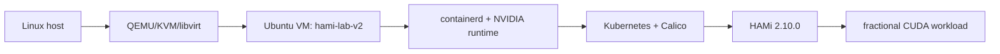
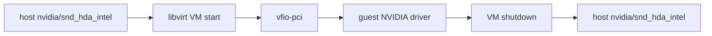
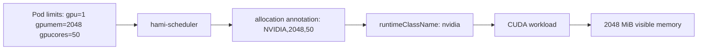

This lab builds the tested local HAMi GPU passthrough environment from a Linux workstation, a QEMU/KVM/libvirt Ubuntu VM, and one NVIDIA GPU assigned to that VM. The Kubernetes, container runtime, Calico, Helm, and HAMi layers all live inside the guest. The host keeps its desktop on another display path and gets the NVIDIA device back when the VM shuts down.

The lab is phase-gated. Validate each layer before adding the next one: host feasibility, CPU-only VM, qcow2 rollback, managed PCI passthrough, guest NVIDIA driver, container runtime GPU access, kubeadm, Calico, plain CUDA, HAMi, fractional workload, and host recovery.

:::note

This is a reproducible local lab path for one tested workstation and GPU. It is not a universal VFIO/libvirt troubleshooting guide for every laptop, workstation, firmware, or IOMMU topology.

:::

## Purpose and Tested Environment

Use this lab when you want a local, resettable place to test HAMi fractional GPU allocation against a real NVIDIA GPU without installing Kubernetes or HAMi on the host operating system.

| Component           | Tested value                        |
| ------------------- | ----------------------------------- |
| Host VM stack       | QEMU/KVM, system libvirt, OVMF/UEFI |
| VM/domain name      | `hami-lab-v2`                       |
| Guest OS            | Ubuntu 24.04.5 LTS                  |
| Guest kernel        | `6.8.0-142-generic`                 |
| GPU                 | NVIDIA GeForce RTX 3050 Laptop GPU  |
| GPU memory          | 4096 MiB                            |
| Guest NVIDIA driver | 595.91.07                           |
| containerd          | 2.2.1                               |
| NVIDIA Toolkit      | 1.20.1                              |
| Kubernetes          | v1.36.5                             |
| Calico              | v3.32.2                             |
| Helm                | v3.22.0                             |
| HAMi chart/app      | 2.10.0                              |
| RuntimeClass        | `nvidia`                            |
| GPU node label      | `gpu=on`                            |

The VM/GPU boundary matters because it keeps host state recoverable. The host runs libvirt and owns the base qcow2 files. The Ubuntu guest owns the NVIDIA driver, container runtime, Kubernetes, Calico, and HAMi stack. If a guest-layer experiment goes wrong, the active qcow2 overlay can be discarded without rewriting the preserved base disk.


```mermaid
flowchart LR
  Host["Linux host"] --> Libvirt["QEMU/KVM/libvirt"]
  Libvirt --> VM["Ubuntu VM: hami-lab-v2"]
  VM --> Runtime["containerd + NVIDIA runtime"]
  Runtime --> K8s["Kubernetes + Calico"]
  K8s --> Hami["HAMi 2.10.0"]
  Hami --> Workload["fractional CUDA workload"]
```

## Set Local Variables

Set these values once on the host and reuse them through the lab. The commands below use variables so they are easier to copy, while the output blocks show the values from the tested environment.

```bash
export DOMAIN=hami-lab-v2
export GUEST_USER=ubuntu # replace with your VM user
export GUEST_IP=192.168.122.242 # replace with your VM IP
export ISO="$HOME/Downloads/ubuntu-24.04.5-live-server-amd64.iso"
export BASE=/var/lib/libvirt/images/hami-lab-v2-base.qcow2
export WORK=/var/lib/libvirt/images/hami-lab-v2-work.qcow2
```

## Host Feasibility Checks

Start with read-only host checks. Do not detach the GPU yet.

Run on the host:

```bash
lscpu | grep -E 'Virtualization|Model name'
test -e /dev/kvm && echo "/dev/kvm present"
virsh -c qemu:///system dominfo "$DOMAIN" >/dev/null 2>&1 || \
  echo "$DOMAIN domain name is free"
```

Output from the tested host:

```text
CPU virtualization: AMD-V
/dev/kvm present
hami-lab-v2 domain name is free
```

Check the VM tooling and install media:

```bash
qemu-system-x86_64 --version
qemu-img --version
virt-install --version
ls /usr/share/edk2/x64/OVMF_CODE.4m.fd
test -f "$ISO" && echo "Ubuntu ISO is present"
```

Output from the tested host:

```text
QEMU emulator version 11.1.1
qemu-img version 11.1.1
virt-install version 5.1.0
/usr/share/edk2/x64/OVMF_CODE.4m.fd
Ubuntu ISO is present
```

Identify the GPU, its audio function, and their IOMMU group:

```bash
lspci -nnk -s 01:00.0
lspci -nnk -s 01:00.1
readlink /sys/bus/pci/devices/0000:01:00.0/iommu_group
readlink /sys/bus/pci/devices/0000:01:00.1/iommu_group
```

Output from the tested host:

```text
01:00.0 NVIDIA GA107M GeForce RTX 3050 Mobile [10de:25a2]
  Kernel driver in use: nvidia
01:00.1 NVIDIA GA107 High Definition Audio Controller [10de:2291]
  Kernel driver in use: snd_hda_intel
0000:01:00.0 -> group 11
0000:01:00.1 -> group 11
```

Verify that the host display does not depend on the NVIDIA GPU:

```bash
echo "$XDG_SESSION_TYPE"
echo "$XDG_CURRENT_DESKTOP"
for node in /sys/class/drm/card*-*; do
  printf '%s ' "$(basename "$node")"
  cat "$node/status"
done
glxinfo -B | grep -E 'OpenGL vendor|OpenGL renderer'
```

Output from the tested host:

```text
wayland
niri
card0-HDMI-A-1 disconnected
card2-DP-1 disconnected
card2-eDP-1 connected
OpenGL vendor: AMD
OpenGL renderer: AMD Radeon Graphics
```

Gate: continue only if the NVIDIA VGA and HDA functions can move together and the host has a separate working display path.

## Fresh VM Creation and qcow2 Rollback Boundary

Create the VM without the GPU first. This proves the guest can boot, accept SSH, and shut down before passthrough adds complexity.

Create a fresh base disk:

```bash
sudo qemu-img create -f qcow2 \
  "$BASE" \
  50G
```

Output:

```text
Formatting '/var/lib/libvirt/images/hami-lab-v2-base.qcow2', fmt=qcow2 cluster_size=65536 extended_l2=off compression_type=zlib size=53687091200 lazy_refcounts=off refcount_bits=16
```

Create the CPU-only Ubuntu VM:

```bash
sudo virt-install \
  --connect qemu:///system \
  --name "$DOMAIN" \
  --memory 8192 \
  --vcpus 4 \
  --cpu host-passthrough \
  --machine q35 \
  --boot uefi \
  --disk path="$BASE",format=qcow2,bus=virtio \
  --cdrom "$ISO" \
  --os-variant ubuntu24.04 \
  --network network=default,model=virtio \
  --graphics spice \
  --video virtio \
  --console pty,target_type=serial \
  --autoconsole spice
```

Complete the Ubuntu Server 24.04.5 LTS installer in the SPICE console that opens, including OpenSSH. Then validate the guest:

```bash
ssh "${GUEST_USER}@${GUEST_IP}" \
  'hostnamectl --static; lsb_release -ds; uname -r; systemctl is-active ssh'
```

Output:

```text
hami-lab-v2
Ubuntu 24.04.5 LTS
6.8.0-142-generic
active
```

Shut the VM down before changing its disk chain:

```bash
ssh "${GUEST_USER}@${GUEST_IP}" 'sudo poweroff'
virsh -c qemu:///system domstate "$DOMAIN"
```

Output:

```text
shut off
```

Create a disposable work overlay from the installed base disk:

```bash
sudo qemu-img create -f qcow2 -F qcow2 -b "$BASE" "$WORK"
qemu-img info --backing-chain "$WORK"
```

Output:

```text
Formatting '/var/lib/libvirt/images/hami-lab-v2-work.qcow2', fmt=qcow2 cluster_size=65536 extended_l2=off compression_type=zlib size=53687091200 backing_file=/var/lib/libvirt/images/hami-lab-v2-base.qcow2 backing_fmt=qcow2 lazy_refcounts=off refcount_bits=16
backing file: /var/lib/libvirt/images/hami-lab-v2-base.qcow2
backing file format: qcow2
corrupt: false
```

Switch the shut-off domain from the base disk to the overlay:

```bash
virsh -c qemu:///system domstate "$DOMAIN"
virsh -c qemu:///system dumpxml "$DOMAIN" > hami-lab-v2-before-overlay.xml
virsh -c qemu:///system detach-disk "$DOMAIN" vda --config
virsh -c qemu:///system attach-disk "$DOMAIN" "$WORK" vda \
  --config \
  --type disk \
  --driver qemu \
  --subdriver qcow2 \
  --targetbus virtio
virsh -c qemu:///system domblklist "$DOMAIN"
```

Output:

```text
shut off
Device detached successfully
Device attached successfully
Target   Source
vda      /var/lib/libvirt/images/hami-lab-v2-work.qcow2
sda      -
```

Boot from the active overlay:

```bash
virsh -c qemu:///system start "$DOMAIN"
virsh -c qemu:///system domstate "$DOMAIN"
virsh -c qemu:///system domblklist "$DOMAIN"
```

Output:

```text
Domain 'hami-lab-v2' started
running
vda      /var/lib/libvirt/images/hami-lab-v2-work.qcow2
sda      -
```

Create a marker inside the overlay-backed guest:

```bash
ssh "${GUEST_USER}@${GUEST_IP}" \
  'cat > ~/v2-rollback-marker.txt <<EOF
V2 rollback marker
created_utc=2026-09-30T11:35:18Z
hostname=hami-lab-v2
disk_expected=hami-lab-v2-work.qcow2
EOF
cat ~/v2-rollback-marker.txt'
```

Output:

```text
V2 rollback marker
created_utc=2026-09-30T11:35:18Z
hostname=hami-lab-v2
disk_expected=hami-lab-v2-work.qcow2
```

Shut the VM down and wait until libvirt reports `shut off` before touching the overlay:

```bash
ssh "${GUEST_USER}@${GUEST_IP}" 'sudo poweroff'
until [ "$(virsh -c qemu:///system domstate "$DOMAIN")" = "shut off" ]; do
  sleep 2
done
virsh -c qemu:///system domstate "$DOMAIN"
```

Output:

```text
shut off
```

Move the old overlay aside and recreate a clean one at the same active path:

```bash
sudo mv "$WORK" /var/lib/libvirt/images/hami-lab-v2-work-with-marker.qcow2
sudo qemu-img create -f qcow2 -F qcow2 -b "$BASE" "$WORK"
qemu-img info --backing-chain "$WORK"
virsh -c qemu:///system domblklist "$DOMAIN"
```

Output:

```text
Formatting '/var/lib/libvirt/images/hami-lab-v2-work.qcow2', fmt=qcow2 cluster_size=65536 extended_l2=off compression_type=zlib size=53687091200 backing_file=/var/lib/libvirt/images/hami-lab-v2-base.qcow2 backing_fmt=qcow2 lazy_refcounts=off refcount_bits=16
backing file: /var/lib/libvirt/images/hami-lab-v2-base.qcow2
vda      /var/lib/libvirt/images/hami-lab-v2-work.qcow2
```

Boot the clean overlay and prove the marker is gone:

```bash
virsh -c qemu:///system start "$DOMAIN"
ssh "${GUEST_USER}@${GUEST_IP}" \
  'test ! -e ~/v2-rollback-marker.txt && echo "PASS: marker is absent after overlay reset"'
```

Output:

```text
Domain 'hami-lab-v2' started
PASS: marker is absent after overlay reset
```

Gate: continue only after rollback works. This boundary is what makes later Kubernetes and HAMi changes easy to discard.

## Managed RTX VGA/HDA Passthrough Using virsh

The tested passthrough pair is the RTX VGA function `0000:01:00.0` and its HDA audio function `0000:01:00.1`. They stay in the host drivers while the VM is shut off. With `managed='yes'`, libvirt moves them to `vfio-pci` when the VM starts and returns them to host drivers when the VM shuts down.


```mermaid
flowchart LR
  HostDriver["host nvidia/snd_hda_intel"] --> LibvirtStart["libvirt VM start"]
  LibvirtStart --> Vfio["vfio-pci"]
  Vfio --> Guest["guest NVIDIA driver"]
  Guest --> Shutdown["VM shutdown"]
  Shutdown --> HostRecovered["host nvidia/snd_hda_intel"]
```

Stop the observed host holders before starting the passthrough VM:

```bash
systemctl --user stop pipewire-pulse.service pipewire-pulse.socket pipewire.service pipewire.socket wireplumber.service
sudo systemctl stop nvidia-persistenced
sudo systemctl stop nbfc_service
```

Output:

```text
pipewire.socket inactive
pipewire.service inactive
pipewire-pulse.socket inactive
pipewire-pulse.service inactive
wireplumber.service inactive
nbfc_service inactive
nvidia-persistenced inactive
```

Attach the GPU and audio XML to the shut-off VM. The XML files are in [`examples/18-local-gpu-passthrough/libvirt/rtx-gpu.xml`](./examples/18-local-gpu-passthrough/libvirt/rtx-gpu.xml) and [`examples/18-local-gpu-passthrough/libvirt/rtx-audio.xml`](./examples/18-local-gpu-passthrough/libvirt/rtx-audio.xml).

```bash
virsh -c qemu:///system domstate "$DOMAIN"
virsh -c qemu:///system attach-device "$DOMAIN" \
  tutorials/labs/examples/18-local-gpu-passthrough/libvirt/rtx-gpu.xml \
  --config
virsh -c qemu:///system attach-device "$DOMAIN" \
  tutorials/labs/examples/18-local-gpu-passthrough/libvirt/rtx-audio.xml \
  --config
```

Output:

```text
shut off
Device attached successfully
Device attached successfully
```

Start the VM and inspect host ownership:

```bash
virsh -c qemu:///system start "$DOMAIN"
lspci -nnk -s 01:00.0 | grep 'Kernel driver in use'
lspci -nnk -s 01:00.1 | grep 'Kernel driver in use'
nvidia-smi
```

Output:

```text
Domain 'hami-lab-v2' started
Kernel driver in use: vfio-pci
Kernel driver in use: vfio-pci
Failed to initialize NVML: No supported GPUs were found
```

Inside the guest, confirm the PCI devices are visible:

```bash
ssh "${GUEST_USER}@${GUEST_IP}" \
  "lspci -nnk | grep -A3 -E '07:00.0|08:00.0'"
```

Output:

```text
07:00.0 VGA compatible controller [0300]: NVIDIA Corporation GA107M [GeForce RTX 3050 Mobile] [10de:25a2]
  Kernel driver in use: nouveau
08:00.0 Audio device [0403]: NVIDIA Corporation Device [10de:2291]
  Kernel driver in use: snd_hda_intel
```

Gate: the guest must see both NVIDIA PCI functions before installing the guest NVIDIA driver.

## Guest NVIDIA Driver Validation

Inside the guest, inspect the recommended driver and install it:

```bash
ubuntu-drivers devices | grep recommended
sudo apt-get update
sudo DEBIAN_FRONTEND=noninteractive apt-get install -y nvidia-driver-595-open
sudo reboot
```

Output:

```text
recommended: nvidia-driver-595-open
nvidia-driver-595-open 595.91.07-0ubuntu0.24.04.1 installed
```

After reboot, validate the guest driver:

```bash
nvidia-smi --query-gpu=name,driver_version,memory.total --format=csv,noheader
```

Output:

```text
NVIDIA GeForce RTX 3050 Laptop GPU, 595.91.07, 4096 MiB
```

Check the guest PCI binding:

```bash
lspci -nnk -s 07:00.0 | grep 'Kernel driver in use'
lsmod | grep -E '^nvidia|^nouveau' || true
```

Output:

```text
Kernel driver in use: nvidia
nvidia_uvm
nvidia_drm
nvidia_modeset
nvidia
```

Gate: `nvidia-smi` must work in the guest before container runtime work begins.

## containerd and NVIDIA Container Toolkit Validation

Install containerd, runc, and the NVIDIA Container Toolkit inside the guest. The tested package versions were containerd `2.2.1-0ubuntu1~24.04.3`, runc `1.3.4-0ubuntu1~24.04.1`, and NVIDIA Container Toolkit `1.20.1-1`.

Install the packages before configuring the runtime:

```bash
sudo apt-get update
sudo apt-get install -y ca-certificates curl gpg

curl -fsSL https://nvidia.github.io/libnvidia-container/gpgkey |
  sudo gpg --dearmor -o /usr/share/keyrings/nvidia-container-toolkit-keyring.gpg
curl -fsSL https://nvidia.github.io/libnvidia-container/stable/deb/nvidia-container-toolkit.list |
  sed 's#deb https://#deb [signed-by=/usr/share/keyrings/nvidia-container-toolkit-keyring.gpg] https://#g' |
  sudo tee /etc/apt/sources.list.d/nvidia-container-toolkit.list

sudo apt-get update
sudo apt-get install -y \
  containerd=2.2.1-0ubuntu1~24.04.3 \
  runc=1.3.4-0ubuntu1~24.04.1 \
  nvidia-container-toolkit=1.20.1-1
```

Configure containerd to import drop-in configs, enable systemd cgroups for both `runc` and the `nvidia` runtime handler, then configure the NVIDIA runtime:

```bash
sudo nvidia-ctk runtime configure --runtime=containerd
sudo systemctl restart containerd
containerd --version
runc --version
nvidia-ctk --version
systemctl is-active containerd
```

Output:

```text
containerd github.com/containerd/containerd/v2 2.2.1
runc version 1.3.4-0ubuntu1~24.04.1
NVIDIA Container Toolkit CLI version 1.20.1
active
```

Confirm the NVIDIA runtime drop-in:

```bash
grep -R 'BinaryName.*nvidia-container-runtime' /etc/containerd
```

Output:

```text
BinaryName = "/usr/bin/nvidia-container-runtime"
```

Run a plain container GPU smoke test before Kubernetes:

```bash
sudo ctr run --rm --gpus 0 \
  docker.io/nvidia/cuda:12.4.1-base-ubuntu22.04 \
  hami-v2-nvidia-smi \
  nvidia-smi
```

Output:

```text
NVIDIA-SMI 595.91.07
Driver Version: 595.91.07
CUDA Version: 13.2
GPU: NVIDIA GeForce RTX 3050 Laptop GPU
Bus-Id: 00000000:07:00.0
Memory: 4096 MiB
Processes: none
```

Gate: prove the guest container runtime can reach the GPU before kubeadm. If this layer fails, HAMi will not be able to fix it later.

## Manual kubeadm Bootstrap

Prepare the node for Kubernetes:

```bash
sudo swapoff -a
sudo sed -i.bak '/ swap /s/^/# kubeadm disabled: /' /etc/fstab
cat <<'EOF' | sudo tee /etc/modules-load.d/k8s.conf
overlay
br_netfilter
EOF
sudo modprobe overlay
sudo modprobe br_netfilter
cat <<'EOF' | sudo tee /etc/sysctl.d/k8s.conf
net.bridge.bridge-nf-call-iptables = 1
net.bridge.bridge-nf-call-ip6tables = 1
net.ipv4.ip_forward = 1
EOF
sudo sysctl --system
```

Output:

```text
net.bridge.bridge-nf-call-iptables = 1
net.bridge.bridge-nf-call-ip6tables = 1
net.ipv4.ip_forward = 1
```

Install Kubernetes packages from the v1.36 repository and hold them:

```bash
sudo apt-get update
sudo apt-get install -y ca-certificates curl gpg apt-transport-https
sudo mkdir -p /etc/apt/keyrings
curl -fsSL https://pkgs.k8s.io/core:/stable:/v1.36/deb/Release.key |
  sudo gpg --dearmor -o /etc/apt/keyrings/kubernetes-apt-keyring.gpg
echo 'deb [signed-by=/etc/apt/keyrings/kubernetes-apt-keyring.gpg] https://pkgs.k8s.io/core:/stable:/v1.36/deb/ /' |
  sudo tee /etc/apt/sources.list.d/kubernetes.list
sudo apt-get update
sudo apt-get install -y kubeadm=1.36.5-1.1 kubelet=1.36.5-1.1 kubectl=1.36.5-1.1 cri-tools=1.36.0-1.1
sudo apt-mark hold kubeadm kubelet kubectl
kubeadm version -o short
kubelet --version
kubectl version --client -o jsonpath='{.clientVersion.gitVersion}{"\n"}'
```

Output:

```text
kubeadm: v1.36.5
kubelet: Kubernetes v1.36.5
kubectl client gitVersion: v1.36.5
```

Point `crictl` at containerd:

```bash
cat <<'EOF' | sudo tee /etc/crictl.yaml
runtime-endpoint: unix:///run/containerd/containerd.sock
image-endpoint: unix:///run/containerd/containerd.sock
timeout: 10
debug: false
pull-image-on-create: false
EOF
sudo crictl info | grep -E 'RuntimeName|RuntimeVersion|RuntimeApiVersion'
```

Output:

```text
RuntimeName: containerd
RuntimeVersion: 2.2.1
RuntimeApiVersion: v1
```

Bootstrap the control plane:

```bash
sudo kubeadm init \
  --kubernetes-version v1.36.5 \
  --apiserver-advertise-address "${GUEST_IP}" \
  --pod-network-cidr 192.168.0.0/16 \
  --cri-socket unix:///run/containerd/containerd.sock
```

Output:

```text
Your Kubernetes control-plane has initialized successfully!
```

Configure kubectl for the guest user:

```bash
mkdir -p "$HOME/.kube"
sudo cp /etc/kubernetes/admin.conf "$HOME/.kube/config"
sudo chown "$(id -u):$(id -g)" "$HOME/.kube/config"
kubectl get nodes -o wide
```

Output:

```text
NAME          STATUS     ROLES           VERSION   INTERNAL-IP       OS-IMAGE
hami-lab-v2   NotReady   control-plane   v1.36.5   192.168.122.242   Ubuntu 24.04.5 LTS
```

Check why the node is not ready yet:

```bash
kubectl describe node hami-lab-v2 | grep -A2 'KubeletNotReady'
```

Output:

```text
KubeletNotReady: container runtime network not ready
NetworkPluginNotReady: cni plugin not initialized
```

Gate: this `NotReady` state is expected before CNI. Continue only if the control plane pods are running and `/livez` plus `/readyz` pass.

## Manual Calico Install

Download the pinned Calico manifest:

```bash
CALICO_MANIFEST="$HOME/calico-v3.32.2.yaml"
curl -L \
  https://raw.githubusercontent.com/projectcalico/calico/v3.32.2/manifests/calico.yaml \
  -o "$CALICO_MANIFEST"
(cd "$HOME" && sha256sum calico-v3.32.2.yaml)
```

Output:

```text
a8c828a06a87c629a282ebbc424895b77f3a030251993e41ea400a743675bb02  calico-v3.32.2.yaml
```

Dry-run the manifest before applying it:

```bash
kubectl apply --dry-run=server -f "$CALICO_MANIFEST"
```

Output:

```text
daemonset.apps/calico-node created (server dry run)
deployment.apps/calico-kube-controllers created (server dry run)
```

Apply Calico:

```bash
kubectl apply -f "$CALICO_MANIFEST"
kubectl -n kube-system rollout status daemonset/calico-node --timeout=5m
kubectl -n kube-system rollout status deployment/calico-kube-controllers --timeout=5m
kubectl wait node hami-lab-v2 --for=condition=Ready --timeout=5m
```

Output:

```text
daemonset/calico-node successfully rolled out
deployment/calico-kube-controllers successfully rolled out
node/hami-lab-v2 condition met
```

Inspect the cluster:

```bash
kubectl get nodes
kubectl -n kube-system get pods
```

Output:

```text
NAME          STATUS   ROLES           VERSION
hami-lab-v2   Ready    control-plane   v1.36.5

calico-kube-controllers   1/1 Running
calico-node               1/1 Running
coredns                   1/1 Running
etcd-hami-lab-v2          1/1 Running
kube-apiserver-hami-lab-v2 1/1 Running
kube-controller-manager   1/1 Running
kube-proxy                1/1 Running
kube-scheduler-hami-lab-v2 1/1 Running
```

Validate DNS from a temporary pod. The toleration is required because this is a single-node control-plane cluster:

```bash
kubectl run v2-calico-dns-smoke \
  --image=busybox:1.36.1 \
  --restart=Never \
  --overrides='{"spec":{"tolerations":[{"key":"node-role.kubernetes.io/control-plane","operator":"Exists","effect":"NoSchedule"}]}}' \
  -- nslookup kubernetes.default.svc.cluster.local
kubectl logs v2-calico-dns-smoke
kubectl delete pod v2-calico-dns-smoke
```

Output:

```text
Server: 10.96.0.10
Name: kubernetes.default.svc.cluster.local
Address: 10.96.0.1
pod "v2-calico-dns-smoke" deleted
```

Gate: node readiness, Calico, CoreDNS, API health, and guest GPU visibility must all pass before GPU workloads.

## Plain CUDA Kubernetes Workload Before HAMi

Create the `RuntimeClass` for the named NVIDIA runtime handler:

```bash
kubectl apply -f - <<'EOF'
apiVersion: node.k8s.io/v1
kind: RuntimeClass
metadata:
  name: nvidia
handler: nvidia
EOF
kubectl get runtimeclass nvidia -o custom-columns='NAME:.metadata.name,HANDLER:.handler'
```

Output:

```text
runtimeclass.node.k8s.io/nvidia created
NAME     HANDLER
nvidia   nvidia
```

Install the lab-adapted NVIDIA device plugin. It uses the stock `nvcr.io/nvidia/k8s-device-plugin:v0.20.1` image, adds `runtimeClassName: nvidia`, and tolerates the control-plane taint:

```bash
kubectl apply -f - <<'EOF'
apiVersion: apps/v1
kind: DaemonSet
metadata:
  name: nvidia-device-plugin-daemonset
  namespace: kube-system
spec:
  selector:
    matchLabels:
      name: nvidia-device-plugin-ds
  template:
    metadata:
      labels:
        name: nvidia-device-plugin-ds
    spec:
      runtimeClassName: nvidia
      tolerations:
        - key: nvidia.com/gpu
          operator: Exists
          effect: NoSchedule
        - key: node-role.kubernetes.io/control-plane
          operator: Exists
          effect: NoSchedule
      containers:
        - image: nvcr.io/nvidia/k8s-device-plugin:v0.20.1
          name: nvidia-device-plugin-ctr
          securityContext:
            allowPrivilegeEscalation: false
            capabilities:
              drop: ["ALL"]
          volumeMounts:
            - name: device-plugin
              mountPath: /var/lib/kubelet/device-plugins
      volumes:
        - name: device-plugin
          hostPath:
            path: /var/lib/kubelet/device-plugins
EOF
kubectl -n kube-system rollout status daemonset/nvidia-device-plugin-daemonset --timeout=5m
```

Output:

```text
runtimeclass.node.k8s.io/nvidia unchanged
daemonset.apps/nvidia-device-plugin-daemonset created
daemon set "nvidia-device-plugin-daemonset" successfully rolled out
```

Wait for the node to advertise one physical GPU:

```bash
kubectl get node hami-lab-v2 \
  -o jsonpath='capacity={.status.capacity.nvidia\.com/gpu} allocatable={.status.allocatable.nvidia\.com/gpu}{"\n"}'
```

Output:

```text
capacity=1 allocatable=1
```

Run a plain CUDA workload before HAMi:

```bash
kubectl apply -f - <<'EOF'
apiVersion: v1
kind: Pod
metadata:
  name: v2-plain-cuda-vectoradd
spec:
  restartPolicy: Never
  runtimeClassName: nvidia
  tolerations:
    - key: node-role.kubernetes.io/control-plane
      operator: Exists
      effect: NoSchedule
  containers:
    - name: vectoradd
      image: nvcr.io/nvidia/k8s/cuda-sample:vectoradd-cuda12.5.0
      resources:
        limits:
          nvidia.com/gpu: 1
EOF
kubectl wait pod/v2-plain-cuda-vectoradd --for=jsonpath='{.status.phase}'=Succeeded --timeout=10m
kubectl logs v2-plain-cuda-vectoradd
```

Output:

```text
pod/v2-plain-cuda-vectoradd created
pod/v2-plain-cuda-vectoradd condition met
[Vector addition of 50000 elements]
Copy input data from the host memory to the CUDA device
CUDA kernel launch with 196 blocks of 256 threads
Copy output data from the CUDA device to the host memory
Test PASSED
Done
```

This proves Kubernetes, the NVIDIA runtime handler, and the stock device plugin work before HAMi. It is not a HAMi result.

Remove the stock plugin before installing HAMi:

```bash
kubectl -n kube-system delete ds nvidia-device-plugin-daemonset --ignore-not-found
if kubectl -n kube-system get pod -l name=nvidia-device-plugin-ds --no-headers 2>/dev/null | grep -q .; then
  kubectl -n kube-system wait --for=delete pod \
    -l name=nvidia-device-plugin-ds --timeout=5m >/dev/null
fi
kubectl get runtimeclass nvidia
```

Output:

```text
daemonset.apps "nvidia-device-plugin-daemonset" deleted
NAME     HANDLER   AGE
nvidia   nvidia
```

## HAMi Helm Install with Inspected Values

HAMi needs the existing `RuntimeClass`, the `gpu=on` label, and tolerations for this single-node control-plane cluster.

Label the node:

```bash
kubectl label node hami-lab-v2 gpu=on
kubectl get node hami-lab-v2 -o jsonpath='gpu-label={.metadata.labels.gpu}{"\n"}'
```

Output:

```text
node/hami-lab-v2 labeled
gpu-label=on
```

Install Helm and add the HAMi repo:

```bash
sudo apt-get update
sudo apt-get install -y apt-transport-https ca-certificates curl gpg
HELM_BUILDKITE_APT_KEY_ID="DDF78C3E6EBB2D2CC223C95C62BA89D07698DBC6"
curl -fsSL https://packages.buildkite.com/helm-linux/helm-debian/gpgkey -o /tmp/helm.gpgkey
gpg --show-keys --with-colons /tmp/helm.gpgkey |
  awk -F: '$1 == "fpr" { print $10 }' |
  grep -Fx "$HELM_BUILDKITE_APT_KEY_ID"
gpg --dearmor /tmp/helm.gpgkey |
  sudo tee /usr/share/keyrings/helm.gpg >/dev/null
echo "deb [signed-by=/usr/share/keyrings/helm.gpg] https://packages.buildkite.com/helm-linux/helm-debian/any/ any main" |
  sudo tee /etc/apt/sources.list.d/helm-stable-debian.list
sudo apt-get update
sudo apt-get install -y helm
helm version --short
helm repo add hami https://project-hami.github.io/HAMi
helm repo update
helm search repo hami/hami --versions | grep 2.10.0
```

Output:

```text
v3.22.0
"hami" has been added to your repositories
Update Complete. Happy Helming!
hami/hami 2.10.0 2.10.0
```

Create `/tmp/hami-v2-values.yaml`. The same content is available in [`examples/18-local-gpu-passthrough/hami-values.yaml`](./examples/18-local-gpu-passthrough/hami-values.yaml).

```bash
cat >/tmp/hami-v2-values.yaml <<'EOF'
devicePlugin:
  runtimeClassName: nvidia
  createRuntimeClass: false
  nvidiaDriverRoot: /
  nvidiaNodeSelector:
    gpu: "on"
  tolerations:
    - key: node-role.kubernetes.io/control-plane
      operator: Exists
      effect: NoSchedule

scheduler:
  tolerations:
    - key: node-role.kubernetes.io/control-plane
      operator: Exists
      effect: NoSchedule
  patch:
    tolerations:
      - key: node-role.kubernetes.io/control-plane
        operator: Exists
        effect: NoSchedule
  kubeScheduler:
    image:
      tag: v1.36.5
EOF
```

Render the chart before installing it:

```bash
helm template hami hami/hami \
  --namespace kube-system \
  --version 2.10.0 \
  -f /tmp/hami-v2-values.yaml \
  | grep -E 'runtimeClassName: nvidia|gpu: "on"|tag: v1.36.5' \
  | sort -u
```

Output:

```text
gpu: "on"
runtimeClassName: nvidia
tag: v1.36.5
```

Install HAMi:

```bash
helm install hami hami/hami \
  --namespace kube-system \
  --version 2.10.0 \
  -f /tmp/hami-v2-values.yaml \
  --wait \
  --timeout 10m
```

Output:

```text
NAME: hami
NAMESPACE: kube-system
STATUS: deployed
REVISION: 1
Resource name: nvidia.com/gpu
```

Verify HAMi:

```bash
helm -n kube-system list --filter '^hami$'
kubectl -n kube-system get ds hami-device-plugin
kubectl -n kube-system get deploy hami-scheduler
kubectl get node hami-lab-v2 \
  -o jsonpath='capacity={.status.capacity.nvidia\.com/gpu} allocatable={.status.allocatable.nvidia\.com/gpu}{"\n"}'
```

Output:

```text
hami  kube-system  1  deployed  hami-2.10.0  2.10.0
hami-device-plugin  desired=1 current=1 ready=1 available=1
hami-scheduler      ready=1/1 available=1
capacity=10 allocatable=10
```

Inspect the HAMi node registration:

```bash
kubectl get node hami-lab-v2 \
  -o jsonpath='{.metadata.annotations.hami\.io/node-nvidia-register}{"\n"}'
```

Output:

```text
type=NVIDIA GeForce RTX 3050 Laptop GPU
count=10
devmem=4096
devcore=100
health=true
```

Gate: HAMi pods must be healthy and the node must advertise `nvidia.com/gpu` capacity and allocatable as `10`.

## Fractional HAMi Workload

Run a fractional CUDA sample through HAMi:

```bash
kubectl apply -f - <<'EOF'
apiVersion: v1
kind: Pod
metadata:
  name: v2-hami-fractional-vectoradd
spec:
  restartPolicy: Never
  runtimeClassName: nvidia
  tolerations:
    - key: node-role.kubernetes.io/control-plane
      operator: Exists
      effect: NoSchedule
  containers:
    - name: vectoradd
      image: nvcr.io/nvidia/k8s/cuda-sample:vectoradd-cuda12.5.0
      resources:
        limits:
          nvidia.com/gpu: 1
          nvidia.com/gpumem: 2048
          nvidia.com/gpucores: 50
EOF
kubectl wait pod/v2-hami-fractional-vectoradd --for=jsonpath='{.status.phase}'=Succeeded --timeout=10m
kubectl logs v2-hami-fractional-vectoradd
```

Output:

```text
pod/v2-hami-fractional-vectoradd created
pod/v2-hami-fractional-vectoradd condition met
[Vector addition of 50000 elements]
Copy input data from the host memory to the CUDA device
CUDA kernel launch with 196 blocks of 256 threads
Copy output data from the CUDA device to the host memory
Test PASSED
Done
```

Inspect how HAMi scheduled the pod:

```bash
kubectl get pod v2-hami-fractional-vectoradd \
  -o jsonpath='scheduler={.spec.schedulerName}{"\n"}runtimeClass={.spec.runtimeClassName}{"\n"}allocated={.metadata.annotations.hami\.io/vgpu-devices-allocated}{"\n"}node={.metadata.annotations.hami\.io/vgpu-node}{"\n"}'
```

Output:

```text
scheduler=hami-scheduler
runtimeClass=nvidia
allocated=GPU-55c8d7db-73a6-bf9a-e47f-05680f2e16f8,NVIDIA,2048,50:;
node=hami-lab-v2
```

This validates the HAMi workload path:


```mermaid
flowchart LR
  Pod["Pod limits: gpu=1 gpumem=2048 gpucores=50"] --> Scheduler["hami-scheduler"]
  Scheduler --> Annotation["allocation annotation: NVIDIA,2048,50"]
  Annotation --> RuntimeClass["runtimeClassName: nvidia"]
  RuntimeClass --> CUDA["CUDA workload"]
  CUDA --> Slice["2048 MiB visible memory"]
```

## Main-Process Memory-Slice Proof

Memory enforcement depends on the process path. Use the container main process as the primary proof, because it starts with the environment HAMi injects for the workload. Do not use a later login shell or ad hoc `kubectl exec` path as the main evidence.

Run `nvidia-smi` and `vectorAdd` from the container's main command:

```bash
kubectl apply -f - <<'EOF'
apiVersion: v1
kind: Pod
metadata:
  name: v2-hami-process-path-check
spec:
  restartPolicy: Never
  runtimeClassName: nvidia
  tolerations:
    - key: node-role.kubernetes.io/control-plane
      operator: Exists
      effect: NoSchedule
  containers:
    - name: check
      image: nvcr.io/nvidia/k8s/cuda-sample:vectoradd-cuda12.5.0
      command: ["/bin/sh", "-lc"]
      args:
        - |
          echo "===== CONTAINER NVIDIA-SMI ====="
          nvidia-smi --query-gpu=name,memory.total --format=csv,noheader
          echo
          echo "===== CONTAINER VECTORADD ====="
          /cuda-samples/vectorAdd
      resources:
        limits:
          nvidia.com/gpu: 1
          nvidia.com/gpumem: 2048
          nvidia.com/gpucores: 50
EOF
kubectl wait pod/v2-hami-process-path-check --for=jsonpath='{.status.phase}'=Succeeded --timeout=10m
kubectl logs v2-hami-process-path-check
```

Output:

```text
pod/v2-hami-process-path-check created
pod/v2-hami-process-path-check condition met
===== CONTAINER NVIDIA-SMI =====
NVIDIA GeForce RTX 3050 Laptop GPU, 2048 MiB

===== CONTAINER VECTORADD =====
[Vector addition of 50000 elements]
Copy input data from the host memory to the CUDA device
CUDA kernel launch with 196 blocks of 256 threads
Copy output data from the CUDA device to the host memory
Test PASSED
Done
```

Inspect annotations and events:

```bash
kubectl get pod v2-hami-process-path-check \
  -o jsonpath='phase={.status.phase}{"\n"}scheduler={.spec.schedulerName}{"\n"}allocated={.metadata.annotations.hami\.io/vgpu-devices-allocated}{"\n"}'
kubectl describe pod v2-hami-process-path-check | grep -E 'Scheduled|FilteringSucceed|BindingSucceed'
```

Output:

```text
phase=Succeeded
scheduler=hami-scheduler
allocated=GPU-55c8d7db-73a6-bf9a-e47f-05680f2e16f8,NVIDIA,2048,50:;
Scheduled by hami-scheduler
FilteringSucceed: find fit node(hami-lab-v2)
BindingSucceed: Successfully binding node [hami-lab-v2]
```

Gate: the public memory-slice proof is the main process reporting `2048 MiB` and then completing `vectorAdd`.

## Clean Shutdown and Full Host Recovery

Before shutting down the VM, confirm the expected ownership while it is running:

```bash
lspci -nnk -s 01:00.0 | grep 'Kernel driver in use'
lspci -nnk -s 01:00.1 | grep 'Kernel driver in use'
nvidia-smi
```

Output:

```text
Kernel driver in use: vfio-pci
Kernel driver in use: vfio-pci
Failed to initialize NVML: No supported GPUs were found
```

Shut the guest down cleanly and wait for libvirt:

```bash
ssh "${GUEST_USER}@${GUEST_IP}" 'sudo poweroff'
until [ "$(virsh -c qemu:///system domstate "$DOMAIN")" = "shut off" ]; do
  sleep 2
done
virsh -c qemu:///system domstate "$DOMAIN"
```

Output:

```text
shut off
```

Verify host PCI ownership:

```bash
lspci -nnk -s 01:00.0 | grep 'Kernel driver in use'
lspci -nnk -s 01:00.1 | grep 'Kernel driver in use'
```

Output:

```text
Kernel driver in use: nvidia
Kernel driver in use: snd_hda_intel
```

Restart the services that were stopped before passthrough:

```bash
sudo systemctl restart nvidia-persistenced nbfc_service || true
systemctl --user restart pipewire.socket pipewire.service pipewire-pulse.socket pipewire-pulse.service wireplumber.service
systemctl --user is-active pipewire.socket pipewire.service pipewire-pulse.socket pipewire-pulse.service wireplumber.service
```

Output:

```text
active
active
active
active
active
```

Confirm PulseAudio compatibility on PipeWire and the returned NVIDIA HDA device:

```bash
pactl info | grep -E 'Server Name|Default Sink'
pactl list short cards | grep -E '0000_01_00_1|0000_06_00'
```

Output:

```text
Server Name: PulseAudio (on PipeWire 1.6.8)
Default Sink: alsa_output.pci-0000_06_00.1.pro-output-3
alsa_card.pci-0000_01_00.1
alsa_card.pci-0000_06_00.1
alsa_card.pci-0000_06_00.6
```

Finally, verify the host GPU:

```bash
nvidia-smi
```

Output:

```text
NVIDIA-SMI 615.71.09
NVIDIA GeForce RTX 3050 Laptop GPU
Memory-Usage: 1MiB / 4096MiB
No running processes found
```

## Troubleshooting Notes

- If the VM will not start after hostdev attachment, recheck host holders with `fuser -v /dev/nvidia* /dev/snd/*` and confirm the host display is not using the NVIDIA GPU.
- If the node stays `NotReady` after kubeadm, do not continue to HAMi. Install and validate CNI first.
- If a workload stays `Pending` on this single-node control-plane lab, check for the `node-role.kubernetes.io/control-plane:NoSchedule` taint and add the toleration shown in the manifests above.
- If `nvidia-smi` works in the guest but not inside containers, fix the containerd NVIDIA runtime layer before installing Kubernetes.
- If the main-process memory proof reports the full `4096 MiB`, inspect the HAMi allocation annotation, `RuntimeClass`, and resource limits before drawing a conclusion about memory enforcement.
- Login shells and later process paths can behave differently from the container main process. Treat them as advanced debugging paths, not as the primary proof for this lab.
