import Tabs from '@theme/Tabs'; import TabItem from '@theme/TabItem';

This lab uses NVIDIA's **nvml-mock** library to simulate a high-end GPU node — 8 fake A100 GPUs — inside a local **kind** cluster. You will build HAMi directly from the `main` branch, then verify GPU scheduling features: sharing, memory/core limits, percentage-based memory requests, and multi-GPU allocation — all without physical hardware.

## What You'll Get

After completing this lab, you will have a local Kubernetes cluster with:

- **nvml-mock** making the node report 8 fake A100 GPUs (`nvidia.com/gpu: 80` after HAMi slices each physical GPU into 10 virtual slots)
- **HAMi** device-plugin and scheduler running from the current `main` branch image
- Pods verified for: single GPU, GPU sharing, memory/core limits, percentage-based memory, and multi-GPU allocation

:::note

No real CUDA runtime exists in this environment. Pods use `busybox` with `CUDA_DISABLE_CONTROL=true` to prevent HAMi's control library from attempting real device access. Runtime enforcement of memory and core limits still requires physical GPUs.

:::

## Installation Overview

The entire installation process consists of 10 steps:

```mermaid
%% title: Fake-GPU Scheduling Installation Overview
flowchart LR
    Step1["Step 1\nCreate kind Cluster"] --> Step2["Step 2\nBuild & Deploy nvml-mock"]
    Step2 --> Step3["Step 3\nBuild HAMi from main"]
    Step3 --> Step4["Step 4\nDeploy HAMi"]
    Step4 --> Step5["Step 5\nVerify GPU Resources"]
    Step5 --> Step6["Step 6\nBasic GPU Scheduling"]
    Step6 --> Step7["Step 7\nGPU Sharing"]
    Step7 --> Step8["Step 8\nMemory & Core Limits"]
    Step8 --> Step9["Step 9\nPercentage Memory"]
    Step9 --> Step10["Step 10\nMulti-GPU Allocation"]
```



| Step | Purpose | What It Solves |
| --- | --- | --- |
| Create kind Cluster | Bootstrap local Kubernetes | Provide test environment |
| Build & Deploy nvml-mock | Simulate 8 fake A100 GPUs | Enable GPU discovery without hardware |
| Build HAMi from main | Compile latest scheduler & device-plugin | Ensure MIG fix is included |
| Deploy HAMi | Install control plane components | Enable GPU partitioning and scheduling |
| Verify GPU Resources | Check `nvidia.com/gpu: 80` | Confirm virtual GPU slots registered |
| Basic GPU Scheduling | Single-GPU Pod allocation | Verify basic scheduler functionality |
| GPU Sharing | Time-slice 4 Pods on same GPU | Test concurrent GPU access |
| Memory & Core Limits | Enforce `gpumem` and `gpucores` | Validate resource constraints |
| Percentage Memory | Request 30% GPU memory | Test percentage-based allocation |
| Multi-GPU Allocation | Single Pod with 2 GPUs | Verify multi-GPU binding |

## Prerequisites

<Tabs groupId="os">
<TabItem value="macos" label="macOS" default>

- macOS, Intel or Apple Silicon
- [Docker Desktop](https://www.docker.com/products/docker-desktop/) or [OrbStack](https://orbstack.dev/) installed and running
- [Homebrew](https://brew.sh/) available

Install prerequisites:

```bash
brew install kind kubectl helm git go
```

Verify versions:

```bash
kind version                     # 0.20+
kubectl version --client --short # 1.31+
helm version                     # 3.x
go version                       # 1.21+
```

</TabItem>
<TabItem value="linux" label="Linux (Ubuntu)">

- Ubuntu 20.04 LTS or later, x86_64
- [Docker Engine](https://docs.docker.com/engine/install/ubuntu/) installed and running

Install prerequisites:

```bash
# kind
KIND_VERSION=v0.23.0
curl -Lo ./kind "https://kind.sigs.k8s.io/dl/${KIND_VERSION}/kind-linux-amd64"
chmod +x ./kind && sudo mv ./kind /usr/local/bin/kind

# kubectl
curl -LO "https://dl.k8s.io/release/$(curl -L -s https://dl.k8s.io/release/stable.txt)/bin/linux/amd64/kubectl"
sudo install -o root -g root -m 0755 kubectl /usr/local/bin/kubectl && rm kubectl

# Helm
curl https://raw.githubusercontent.com/helm/helm/main/scripts/get-helm-3 | bash

# Go
GO_VERSION=1.24.0
curl -LO "https://go.dev/dl/go${GO_VERSION}.linux-amd64.tar.gz"
sudo rm -rf /usr/local/go && sudo tar -C /usr/local -xzf go${GO_VERSION}.linux-amd64.tar.gz
echo 'export PATH=$PATH:/usr/local/go/bin' >> ~/.bashrc && source ~/.bashrc
```

Verify versions:

```bash
kind version                     # 0.20+
kubectl version --client --short # 1.31+
helm version                     # 3.x
go version                       # 1.21+
```

</TabItem>
</Tabs>

:::tip

Windows users Use [WSL2](https://learn.microsoft.com/en-us/windows/wsl/install) with Ubuntu and follow the Linux tab above.

:::

---

## Step 1: Create the kind Cluster

```bash
kind create cluster --name nvml-mock-test
```

Set the `NODE_NAME` variable once — all subsequent commands use it:

```bash
NODE_NAME=$(kubectl get nodes -o jsonpath='{.items[0].metadata.name}')
echo "NODE_NAME=${NODE_NAME}"
```

Example output:

```plaintext
NODE_NAME=nvml-mock-test-control-plane
```

---

## Step 2: Build and Deploy nvml-mock

nvml-mock provides a fake `libnvidia-ml.so`, virtual `/dev/nvidia*` device nodes, and PCI topology entries so HAMi's device-plugin sees 8 A100 GPUs on the node.

### 2.1 Clone and Build

```bash
git clone https://github.com/NVIDIA/k8s-test-infra.git
cd k8s-test-infra
docker build -t nvml-mock:local -f deployments/nvml-mock/Dockerfile .
```

:::note

The first build downloads base layers and may take 5–10 minutes. Subsequent builds use Docker layer cache.

:::

### 2.2 Load into kind

```bash
kind load docker-image nvml-mock:local --name nvml-mock-test
```

### 2.3 Install via Helm

```bash
helm install nvml-mock oci://ghcr.io/nvidia/k8s-test-infra/chart/nvml-mock \
  --set image.repository=nvml-mock \
  --set image.tag=local \
  --wait --timeout 120s
```

The chart configures an A100 profile by default: 8 GPUs per node, driver version `550.163.01`, fake driver root at `/var/lib/nvml-mock/driver`. This driver root path is passed to HAMi in Step 4.

### 2.4 Verify GPU Discovery

```bash
kubectl get node ${NODE_NAME} \
  -o custom-columns=NAME:.metadata.name,GPU_PRESENT:.metadata.labels.nvidia\\.com/gpu\\.present
```

Expected output:

```plaintext
NAME                             GPU_PRESENT
nvml-mock-test-control-plane     true
```

---

## Step 3: Build HAMi from the `main` Branch

The `main` branch contains a fix preventing `nvidia-mig-parted` from being called when MIG is not enabled. Building from source ensures the fix is present without waiting for a tagged release.

### 3.1 Clone and Initialize Submodules

```bash
cd ~
git clone https://github.com/Project-HAMi/HAMi.git
cd HAMi
git submodule update --init --recursive
```

### 3.2 Build the Docker Image

```bash
docker build -t hami:local -f docker/Dockerfile .
```

:::note

HAMi uses a three-stage Dockerfile: a Go build stage, a CUDA library build stage, and a final runtime stage. The first build takes several minutes as it pulls the CUDA base images; subsequent runs use the layer cache.

:::

### 3.3 Load into kind

```bash
kind load docker-image hami:local --name nvml-mock-test
```

Both the scheduler and device-plugin binaries are packaged into the single `hami:local` image.

---

## Step 4: Deploy HAMi

### 4.1 Install via Helm

```bash
helm install hami ./charts/hami \
  -n kube-system \
  --set devicePlugin.image.repository=hami \
  --set devicePlugin.image.tag=local \
  --set scheduler.image.repository=hami \
  --set scheduler.image.tag=local \
  --set devicePlugin.nvidiaDriverRoot=/var/lib/nvml-mock/driver \
  --set scheduler.kubeScheduler.imageTag=v1.35.0
```

`devicePlugin.nvidiaDriverRoot` points HAMi at the fake driver libraries installed by nvml-mock.

### 4.2 Label the Node

:::warning

Required before the device-plugin can start The HAMi device-plugin DaemonSet has `NODE SELECTOR: gpu=on`. Without this label, `DESIRED` stays at `0`, no Pod is scheduled, and no GPUs are registered.

:::

```bash
kubectl label node ${NODE_NAME} gpu=on
```

Confirm the DaemonSet now schedules a Pod:

```bash
kubectl -n kube-system get daemonset hami-device-plugin
```

Expected output:

```plaintext
NAME                 DESIRED   CURRENT   READY   UP-TO-DATE   AVAILABLE   NODE SELECTOR   AGE
hami-device-plugin   1         1         0       1            0           gpu=on          4m22s
```

### 4.3 Set the NVML Device Discovery Strategy

```bash
kubectl -n kube-system set env daemonset/hami-device-plugin \
  -c device-plugin \
  DEVICE_DISCOVERY_STRATEGY=nvml
```

This tells the device-plugin to enumerate GPUs via the NVML API rather than scanning `/dev`. Without this, the plugin defaults to a file-based strategy that cannot see nvml-mock's virtual devices.

### 4.4 Roll Out and Verify

```bash
kubectl -n kube-system rollout restart daemonset/hami-device-plugin
kubectl -n kube-system rollout status daemonset/hami-device-plugin --timeout=120s
```

Check for MIG errors — an empty response is the expected output:

```bash
kubectl -n kube-system logs daemonset/hami-device-plugin -c device-plugin | grep -i mig
```

Check overall Pod status:

```bash
kubectl -n kube-system get pods -l app.kubernetes.io/name=hami
```

Expected output:

```plaintext
NAME                              READY   STATUS             RESTARTS   AGE
hami-device-plugin-lbctx          1/2     CrashLoopBackOff   6          9m24s
hami-scheduler-7858c744cc-7pb79   2/2     Running            0          13m
```

:::note

The `vgpu-monitor` sidecar crashes because it requires real GPU monitoring infrastructure. The `device-plugin` container is running correctly — `1/2` is expected here and does not affect GPU scheduling.

:::

---

## Step 5: Verify GPU Resources

HAMi partitions each physical GPU into 10 virtual slots. With 8 physical GPUs the node should advertise **80** allocatable virtual GPUs.

```bash
kubectl describe node ${NODE_NAME} | grep nvidia.com/gpu
```

Expected output:

```plaintext
                    nvidia.com/gpu.present=true
  nvidia.com/gpu:     80
  nvidia.com/gpu:     80
  nvidia.com/gpu     0           0
```

Both `Capacity` and `Allocatable` showing `80` confirms the device-plugin registered all virtual GPU slots. The final line is the `Allocated resources` table — currently `0` because no Pods have claimed GPUs yet.

---

## Step 6: Test Basic GPU Scheduling

Deploy a minimal Pod requesting one GPU. `CUDA_DISABLE_CONTROL=true` prevents HAMi's injected CUDA shim from attempting real device access:

```bash
kubectl apply -f - <<'EOF'
apiVersion: v1
kind: Pod
metadata:
  name: gpu-test-1
spec:
  containers:
  - name: sleep
    image: busybox
    command: ["sleep", "3600"]
    env:
    - name: CUDA_DISABLE_CONTROL
      value: "true"
    resources:
      limits:
        nvidia.com/gpu: 1
EOF
```

Wait for the Pod to run:

```bash
kubectl get pod gpu-test-1 -w
```

Expected output:

```plaintext
NAME         READY   STATUS    RESTARTS   AGE
gpu-test-1   1/1     Running   0          9s
```

Verify the allocation annotation:

```bash
kubectl describe pod gpu-test-1 | grep vgpu-devices-allocated
```

Expected output:

```plaintext
hami.io/vgpu-devices-allocated: GPU-12345678-1234-1234-1234-123456780006,NVIDIA,40960,100:;
```

> The annotation format is `<UUID>,<vendor>,<memMiB>,<cores>`. A100 GPUs have 40960 MiB of VRAM — seeing this annotation confirms one virtual GPU was allocated and recorded by the scheduler.

---

## Step 7: Test GPU Sharing (Time-slicing)

Deploy three more Pods each requesting 1 GPU:

```bash
for i in 2 3 4; do
kubectl apply -f - <<EOF
apiVersion: v1
kind: Pod
metadata:
  name: gpu-test-$i
spec:
  containers:
  - name: sleep
    image: busybox
    command: ["sleep", "3600"]
    env:
    - name: CUDA_DISABLE_CONTROL
      value: "true"
    resources:
      limits:
        nvidia.com/gpu: 1
EOF
done
```

:::warning

Use `<<EOF`, not `<<'EOF'` inside the loop Single-quoting the delimiter suppresses shell expansion. `$i` would not be substituted and all three Pods would get the same name.

:::

Verify all Pods are running:

```bash
kubectl get pods | grep gpu-test
```

Expected output:

```plaintext
gpu-test-1   1/1     Running   0          3m19s
gpu-test-2   1/1     Running   0          10s
gpu-test-3   1/1     Running   0          10s
gpu-test-4   1/1     Running   0          9s
```

All four Pods run concurrently against the pool of 80 virtual GPU slots. The scheduler independently tracks each allocation via its own `vgpu-devices-allocated` annotation.

---

## Step 8: Test Memory and Core Limits

```bash
kubectl apply -f - <<'EOF'
apiVersion: v1
kind: Pod
metadata:
  name: gpu-limits
spec:
  containers:
  - name: sleep
    image: busybox
    command: ["sleep", "3600"]
    env:
    - name: CUDA_DISABLE_CONTROL
      value: "true"
    resources:
      limits:
        nvidia.com/gpu: 1
        nvidia.com/gpumem: "10"
        nvidia.com/gpucores: "30"
EOF
```

:::info

Resource Limits Format `nvidia.com/gpumem` takes an **absolute value in MiB** — `"10"` means 10 MiB. `nvidia.com/gpucores: "30"` requests 30 compute cores on the selected GPU.

:::

Verify the allocation:

```bash
kubectl describe pod gpu-limits | grep vgpu-devices-allocated
```

Expected output:

```plaintext
hami.io/vgpu-devices-allocated: GPU-12345678-1234-1234-1234-123456780002,NVIDIA,10,30:;
```

The annotation records `10` MiB and `30` cores — exactly the values requested.

---

## Step 9: Test Percentage-Based Memory Request

Instead of a fixed MiB value, `nvidia.com/gpumem-percentage` lets you request a fraction of the GPU's total memory. On an A100 (40960 MiB), requesting 30% allocates approximately 12288 MiB.

:::tip

Why Percentage-Based Allocation? This is useful when you want workloads to scale proportionally across different GPU models without hardcoding absolute sizes.

:::

Create the Pod:

```bash
kubectl apply -f - <<'EOF'
apiVersion: v1
kind: Pod
metadata:
  name: gpu-mem-30pct
spec:
  containers:
  - name: sleep
    image: busybox
    command: ["sleep", "3600"]
    env:
    - name: CUDA_DISABLE_CONTROL
      value: "true"
    resources:
      limits:
        nvidia.com/gpu: 1
        nvidia.com/gpumem-percentage: "30"
EOF
```

Wait for the Pod to reach `Running`:

```bash
kubectl get pod gpu-mem-30pct -w
```

Expected output:

```plaintext
NAME            READY   STATUS    RESTARTS   AGE
gpu-mem-30pct   1/1     Running   0          8s
```

Inspect the allocation annotation:

```bash
kubectl get pod gpu-mem-30pct \
  -o jsonpath='{.metadata.annotations.hami\.io/vgpu-devices-allocated}'
```

Expected output:

```plaintext
GPU-12345678-1234-1234-1234-123456780003,NVIDIA,12288,100:;
```

> The third field shows `12288` MiB — 30% of 40960 MiB — confirming the scheduler correctly translated the percentage into an absolute memory budget for the allocation.

---

## Step 10: Test Multi-GPU Allocation

```bash
kubectl apply -f - <<'EOF'
apiVersion: v1
kind: Pod
metadata:
  name: gpu-multi
spec:
  containers:
  - name: sleep
    image: busybox
    command: ["sleep", "3600"]
    env:
    - name: CUDA_DISABLE_CONTROL
      value: "true"
    resources:
      limits:
        nvidia.com/gpu: "2"
EOF
```

Verify the Pod is running:

```bash
kubectl get pod gpu-multi
```

Expected output:

```plaintext
NAME        READY   STATUS    RESTARTS   AGE
gpu-multi   1/1     Running   0          64s
```

Check the scheduler events:

```bash
kubectl describe pod gpu-multi | tail -20
```

Expected output:

```plaintext
Events:
  Type    Reason            Age   From            Message
  ----    ------            ----  ----            -------
  Normal  Scheduled         70s   hami-scheduler  Successfully assigned default/gpu-multi to nvml-mock-test-control-plane
  Normal  FilteringSucceed  70s   hami-scheduler  find fit node(nvml-mock-test-control-plane), 0 nodes not fit, 1 nodes fit(nvml-mock-test-control-plane:13.63)
  Normal  BindingSucceed    70s   hami-scheduler  Successfully binding node [nvml-mock-test-control-plane] to default/gpu-multi
  Normal  Pulling           69s   kubelet         spec.containers{sleep}: Pulling image "busybox"
  Normal  Pulled            67s   kubelet         Successfully pulled image "busybox" in 3.548s
  Normal  Created           67s   kubelet         Container created
  Normal  Started           67s   kubelet         Container started
```

The `hami-scheduler` events — `FilteringSucceed`, `Scheduled`, and `BindingSucceed` — confirm HAMi's scheduler handled this Pod and successfully bound it to the node with 2 GPU slots.

:::tip Viewing the full vgpu-devices-allocated annotation

```bash
kubectl get pod gpu-multi \
  -o jsonpath='{.metadata.annotations.hami\.io/vgpu-devices-allocated}'
```

You will see two semicolon-separated device entries, one per allocated vGPU slot.

:::

---

## Summary of Verified Features

| Feature | Test Pod | How It Is Verified |
| --- | --- | --- |
| Basic GPU scheduling | `gpu-test-1` | Annotation shows 1 vGPU UUID + 40960 MiB |
| GPU sharing (time-slicing) | `gpu-test-1` through `gpu-test-4` | All 4 Pods run concurrently |
| Memory limit (`gpumem`) | `gpu-limits` | Annotation shows `10` MiB |
| Core limit (`gpucores`) | `gpu-limits` | Annotation shows `30` cores |
| Percentage memory (`gpumem-percentage`) | `gpu-mem-30pct` | Annotation shows `12288` MiB (30% of A100) |
| Multi-GPU allocation | `gpu-multi` | hami-scheduler events show `BindingSucceed` |

:::warning Real GPU required for the following

- Actual CUDA program execution
- Runtime enforcement of `gpumem` and `gpucores` limits
- Real DCGM GPU metrics (temperature, utilisation)
- Memory overcommit and memory override features

:::

---

## Cleanup

Delete all test Pods:

```bash
kubectl delete pod gpu-test-1 gpu-test-2 gpu-test-3 gpu-test-4 \
  gpu-limits gpu-mem-30pct gpu-multi
```

Remove the GPU node label:

```bash
kubectl label node ${NODE_NAME} gpu-
```

Uninstall HAMi:

```bash
helm uninstall hami -n kube-system
```

Uninstall nvml-mock:

```bash
helm uninstall nvml-mock
```

Delete the kind cluster:

```bash
kind delete cluster --name nvml-mock-test
```

:::tip

Skip the cluster deletion step if you want to keep the environment for further experimentation.

:::

---

## Next Steps

- Move to a real GPU cluster (see [Lab 1: Online HAMi Installation](/tutorials/labs/online-install)) to test memory and core isolation with actual CUDA workloads.
- Add Prometheus and HAMi WebUI for visual resource tracking (see [Lab 2: Local Fake GPU Setup](/tutorials/labs/local-fake-gpu)).
