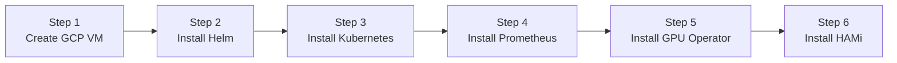
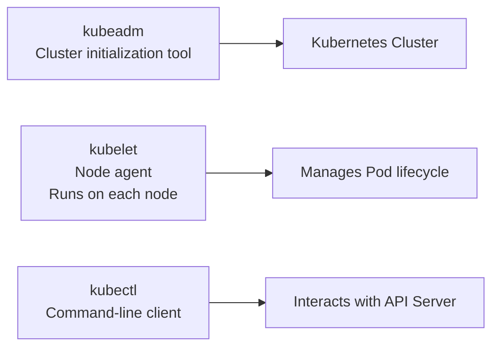

This lab walks you through building a Kubernetes cluster from scratch on a Google Cloud GPU virtual machine and installing HAMi online, resulting in a complete GPU virtualization runtime environment.

## What You'll Get

After completing this lab, you will have a fully functional GPU-virtualized Kubernetes cluster. For a detailed explanation of the cluster architecture and component responsibilities, see [HAMi Cluster Architecture](../concepts/hami-architecture.md).

## Installation Overview

The entire installation process is divided into 6 steps, each solving a specific problem:



| Step | Purpose | What Problem It Solves |
| ------ | ------ | ------------- |
| Create GCP VM | Provision a Linux server with a GPU | Kubernetes needs GPU hardware to schedule GPU workloads |
| Install Helm | Kubernetes package manager | All subsequent components are installed via Helm, similar to apt/yum |
| Install Kubernetes | Container orchestration platform | HAMi runs on top of Kubernetes; all GPU resources are managed by K8s |
| Install Prometheus | Monitoring system | HAMi and GPU Operator depend on Prometheus to collect and store metrics |
| Install GPU Operator | Automated NVIDIA GPU software stack management | Automatically installs GPU drivers, container toolkit, metrics collectors, and other components |
| Install HAMi | GPU virtualization and sharing | Allows multiple Pods to share the same GPU, enabling VRAM partitioning and compute allocation |

## Prerequisites

- Google Cloud account with Compute Engine API enabled
- `gcloud` CLI installed and authenticated (`gcloud auth login`)
- NVIDIA T4 GPU quota available in your GCP project

---

## Step 1: Create a GCP Virtual Machine

### Purpose

Create a virtual machine with a GPU to serve as the foundation for the entire lab. HAMi requires physical GPU hardware (or pass-through virtual GPU) to function, it does not emulate GPUs; instead, it partitions and shares real GPUs.

### Instructions

Set environment variables:

```bash
export PROJECT_ID=$(gcloud config get-value project)
export ZONE=us-central1-a
export VM_NAME=hami-workshop
export MACHINE_TYPE=n1-standard-4
export GPU_TYPE=nvidia-tesla-t4
export IMAGE_FAMILY=ubuntu-2204-lts
export IMAGE_PROJECT=ubuntu-os-cloud
export DISK_SIZE=100
```

Create the virtual machine:

```bash
gcloud compute instances create ${VM_NAME} \
    --project=${PROJECT_ID} \
    --zone=${ZONE} \
    --machine-type=${MACHINE_TYPE} \
    --accelerator=type=${GPU_TYPE},count=1 \
    --maintenance-policy=TERMINATE \
    --image-family=${IMAGE_FAMILY} \
    --image-project=${IMAGE_PROJECT} \
    --boot-disk-size=${DISK_SIZE}GB \
    --boot-disk-type=pd-ssd
```

> `--maintenance-policy=TERMINATE` is required, GPUs do not support live migration. If GCP needs to perform maintenance on the host, the VM will be terminated rather than migrated.

SSH into the VM:

```bash
gcloud compute ssh ${VM_NAME} --zone=${ZONE}
```

After logging in, switch to root:

```bash
sudo su -
```

## Step 2: Install Helm

### Purpose

Helm is the package manager for Kubernetes. All subsequent installations, Prometheus, GPU Operator, and HAMi, are done through Helm. You can think of it as the `apt` or `yum` of the Kubernetes world.

### Instructions

```bash
curl -fsSL -o get_helm.sh https://raw.githubusercontent.com/helm/helm/master/scripts/get-helm-3
chmod 700 get_helm.sh
./get_helm.sh
```

Verify:

```bash
helm version
```

## Step 3: Install Kubernetes

### Purpose

HAMi is a GPU scheduling enhancement layer for Kubernetes. It runs as Pods within a Kubernetes cluster. Without Kubernetes, HAMi has no runtime foundation.

This step uses kubeadm to set up a single-node cluster. On a single node, the node serves as both the Master (control plane) and the Worker (running workloads).

### Instructions

#### 3.1 Disable Swap

Kubernetes requires swap to be disabled because its resource scheduling assumes fixed memory. Swap can lead to unpredictable performance.

```bash
swapoff -a
sed -i '/ swap / s/^\(.*\)$/#\1/g' /etc/fstab
```

#### 3.2 Load Kernel Modules

Container networking requires the `overlay` and `br_netfilter` kernel modules. `overlay` is used for container filesystem layering, and `br_netfilter` enables iptables to correctly handle bridged traffic.

```bash
cat <<EOF | tee /etc/modules-load.d/k8s.conf
overlay
br_netfilter
EOF

modprobe overlay
modprobe br_netfilter
```

#### 3.3 Configure Kernel Network Parameters

These parameters ensure that network traffic between containers is properly routed and forwarded.

```bash
cat <<EOF | tee /etc/sysctl.d/k8s.conf
net.bridge.bridge-nf-call-iptables  = 1
net.bridge.bridge-nf-call-ip6tables = 1
net.ipv4.ip_forward                 = 1
EOF

sysctl --system
```

#### 3.4 Install containerd

containerd is the default container runtime for Kubernetes, responsible for actually creating and running containers. Docker is no longer the default runtime since Kubernetes 1.24.

```bash
apt-get update
apt-get install -y containerd

mkdir -p /etc/containerd
containerd config default | tee /etc/containerd/config.toml

# Enable systemd cgroup driver, Kubernetes requires the runtime and kubelet to use the same cgroup driver
sed -i 's/SystemdCgroup \= false/SystemdCgroup \= true/g' /etc/containerd/config.toml

systemctl restart containerd
systemctl enable containerd
```

#### 3.5 Install kubeadm, kubelet, and kubectl

The relationship between these three tools:



- **kubeadm**: A one-time tool used to initialize the cluster
- **kubelet**: A daemon process responsible for creating and destroying Pods on the local node
- **kubectl**: The command-line tool used for day-to-day operations

```bash
apt-get install -y apt-transport-https ca-certificates curl gpg

mkdir -p /etc/apt/keyrings

curl -fsSL https://pkgs.k8s.io/core:/stable:/v1.34/deb/Release.key | \
    gpg --dearmor -o /etc/apt/keyrings/kubernetes-apt-keyring.gpg

echo 'deb [signed-by=/etc/apt/keyrings/kubernetes-apt-keyring.gpg] https://pkgs.k8s.io/core:/stable:/v1.34/deb/ /' | \
    tee /etc/apt/sources.list.d/kubernetes.list

apt-get update
apt-get install -y kubelet kubeadm kubectl
apt-mark hold kubelet kubeadm kubectl
```

> `apt-mark hold` prevents these packages from being automatically upgraded. Kubernetes component versions need to be managed manually.

#### 3.6 Initialize the Cluster

```bash
kubeadm init --pod-network-cidr=10.244.0.0/16
```

After initialization completes, configure kubectl access:

```bash
mkdir -p $HOME/.kube
cp -i /etc/kubernetes/admin.conf $HOME/.kube/config
chown $(id -u):$(id -g) $HOME/.kube/config
```

#### 3.7 Install Network Plugin (Calico)

Pods need network connectivity to communicate with each other. Calico is a CNI (Container Network Interface) plugin responsible for assigning IP addresses to Pods and handling network routing. Without a CNI plugin, Pods cannot communicate with each other and the node stays `NotReady`.

```bash
kubectl create -f https://raw.githubusercontent.com/projectcalico/calico/v3.28.0/manifests/tigera-operator.yaml

curl -fsSL https://raw.githubusercontent.com/projectcalico/calico/v3.28.0/manifests/custom-resources.yaml | \
    sed 's|192.168.0.0/16|10.244.0.0/16|' | kubectl create -f -
```

> The first manifest installs the tigera-operator, which manages Calico's lifecycle. The second creates the `Installation` resource that tells the operator to deploy Calico itself. The `sed` replaces Calico's default IP pool (`192.168.0.0/16`) with the `--pod-network-cidr` range passed to `kubeadm init`. Without it, the tigera-operator reports `Degraded` with `IPPool 192.168.0.0/16 is not within the platform's configured pod network CIDR(s)` and the node never becomes Ready. The role of each Calico component is described in [HAMi Cluster Architecture](../concepts/hami-architecture.md).

Wait for the Calico Pods to be ready:

```bash
kubectl get pods -n calico-system
```

#### 3.8 Allow Master Node to Schedule Pods

In a single-node cluster, this node serves as both the control plane and the worker node. By default, Kubernetes does not schedule workloads on Master nodes. You need to manually remove this restriction:

```bash
kubectl taint nodes --all node-role.kubernetes.io/control-plane-
```

#### 3.9 Verify Cluster Status

```bash
kubectl get nodes
```

Expected output (STATUS of Ready indicates the cluster is ready):

```plaintext
NAME            STATUS   ROLES           AGE    VERSION
hami-workshop   Ready    control-plane   2m     v1.34.8
```

## Step 4: Install Prometheus

### Purpose

Prometheus is the cluster monitoring system, responsible for collecting and storing metrics from all components. Both HAMi and GPU Operator depend on Prometheus, HAMi's scheduler metrics, device plugin metrics, and GPU utilization metrics all require Prometheus for collection.

### Why Install Prometheus First

Because the GPU Operator and HAMi installed in subsequent steps will create ServiceMonitors (which tell Prometheus what metrics to collect). If Prometheus is not ready, these ServiceMonitors will have no consumer.

### Instructions

```bash
helm repo add prometheus-community https://prometheus-community.github.io/helm-charts
helm repo update

helm install prometheus prometheus-community/kube-prometheus-stack \
    -n monitoring --create-namespace \
    --set grafana.enabled=false \
    --set prometheus.prometheusSpec.serviceMonitorSelectorNilUsesHelmValues=false \
    --version=75.15.1
```

> `--set grafana.enabled=false` disables Grafana because the HAMi WebUI installed later will provide GPU visualization.
>
> `serviceMonitorSelectorNilUsesHelmValues=false` makes Prometheus pick up ServiceMonitors from all namespaces regardless of labels. Without it, Prometheus only selects ServiceMonitors labeled `release: prometheus`, silently ignores the one the GPU Operator creates for dcgm-exporter, and you end up with no GPU metrics at all.

Verify Prometheus component status:

```bash
kubectl get po -n monitoring
```

All Pods should have a status of `Running`:

```plaintext
NAME                                                   READY   STATUS    RESTARTS   AGE
prometheus-kube-prometheus-operator-xxxxxxxxxx-xxxxx   1/1     Running   0          2m
prometheus-kube-state-metrics-xxxxxxxxxx-xxxxx         1/1     Running   0          2m
prometheus-prometheus-kube-prometheus-prometheus-0     2/2     Running   0          2m
prometheus-prometheus-node-exporter-xxxxx              1/1     Running   0          2m
```

> If the installation fails, uninstall first before retrying: `helm uninstall -n monitoring prometheus`

---

## Step 5: Install GPU Operator

### Purpose

The NVIDIA GPU Operator automates the management of the GPU software stack (drivers, container toolkit, metrics collection, feature discovery). For a detailed explanation of each GPU Operator component, see [HAMi Cluster Architecture](../concepts/hami-architecture.md).

> **Important:** You must disable the GPU Operator's built-in device-plugin (`--set devicePlugin.enabled=false`) because HAMi provides its own enhanced device-plugin that supports VRAM partitioning and GPU sharing. The two cannot coexist.

### Instructions

```bash
helm repo add nvidia https://helm.ngc.nvidia.com/nvidia
helm repo update

helm install --wait --generate-name \
    -n gpu-operator --create-namespace \
    nvidia/gpu-operator \
    --set devicePlugin.enabled=false \
    --set dcgmExporter.serviceMonitor.enabled=true \
    --version=v25.3.0
```

> The `--wait` flag waits for all Pods to be ready before returning. The first installation may take a few minutes to download NVIDIA driver images.

Wait for all Pods to be ready:

```bash
kubectl get pods -n gpu-operator
```

Expected output (the driver compile takes the longest; the full stack reaches this state in about 10 minutes):

```plaintext
NAME                                                              READY   STATUS      RESTARTS   AGE
gpu-feature-discovery-4hjmc                                       1/1     Running     0          8m47s
gpu-operator-1780588875-node-feature-discovery-gc-585cccbdtvxgf   1/1     Running     0          9m34s
gpu-operator-1780588875-node-feature-discovery-master-d7cdrtkgv   1/1     Running     0          9m34s
gpu-operator-1780588875-node-feature-discovery-worker-2t5nw       1/1     Running     0          9m34s
gpu-operator-75ccfb6b7b-zmctx                                     1/1     Running     0          9m34s
nvidia-container-toolkit-daemonset-phf4g                          1/1     Running     0          8m47s
nvidia-cuda-validator-jdcsm                                       0/1     Completed   0          23s
nvidia-dcgm-exporter-f5tdt                                        1/1     Running     0          8m47s
nvidia-driver-daemonset-bccs7                                     1/1     Running     0          9m13s
nvidia-operator-validator-2jctf                                   1/1     Running     0          8m47s
```

> The `node-feature-discovery` Pods are a GPU Operator dependency that detects hardware features and labels the node, so gpu-feature-discovery and the scheduler know what hardware is present.

> The `nvidia-cuda-validator` status of `Completed` is normal, it is a one-time Job that exits after verifying CUDA availability.

### Verify GPU Driver

Enter the nvidia-driver-daemonset Pod to verify the GPU driver is loaded correctly (for details on the call chain behind nvidia-smi, see [Understanding GPU Drivers](../concepts/gpu-driver.md)):

```bash
kubectl -n gpu-operator exec -it $(kubectl get pods -n gpu-operator -l app=nvidia-driver-daemonset -o name | head -1) -- nvidia-smi
```

The expected output includes GPU information (driver version, CUDA version, GPU model):

```plaintext
+-----------------------------------------------------------------------------------------+
| NVIDIA-SMI 570.124.06             Driver Version: 570.124.06     CUDA Version: 12.8     |
|-----------------------------------------+------------------------+----------------------+
| GPU  Name                 Persistence-M | Bus-Id          Disp.A | Volatile Uncorr. ECC |
| Fan  Temp   Perf          Pwr:Usage/Cap |           Memory-Usage | GPU-Util  Compute M. |
|=========================================+========================+======================|
|   0  Tesla T4                       On  |   00000000:00:04.0 Off |                    0 |
| N/A   64C    P8             17W /   70W |       1MiB /  15360MiB |      0%      Default |
+-----------------------------------------------------------------------------------------+
```

---

## Step 6: Install HAMi

### Purpose

Install the HAMi GPU virtualization platform to allow multiple Pods to share the same GPU. For HAMi's architecture and component details, see [HAMi Cluster Architecture](../concepts/hami-architecture.md).

### Instructions

Install HAMi open-source edition via the Helm repository:

```bash
# Add the HAMi Helm repository
helm repo add hami-charts https://project-hami.github.io/HAMi/

# Install HAMi
helm install hami hami-charts/hami -n kube-system --version 2.9.0
```

> The HAMi open-source edition is installed in the `kube-system` namespace.

Verify:

```bash
kubectl get pods -n kube-system | grep -E 'hami-scheduler|hami-device'
```

Expected output:

```plaintext
hami-scheduler-6d659887fc-j5ngc   2/2     Running   0          1m
```

> At this point only the scheduler is running. The device plugin DaemonSet uses a `gpu=on` node selector, so it does not start until you label the node in the next step.

### Enable GPU Node

HAMi does not automatically take over all GPU nodes, you need to manually label which nodes should be managed by HAMi. This design allows HAMi and non-HAMi nodes to coexist within the same cluster.

```bash
# Get the node name
NODE_NAME=$(kubectl get nodes -o jsonpath='{.items[0].metadata.name}')

# Label the node to be managed by HAMi
kubectl label nodes ${NODE_NAME} gpu=on
```

The device plugin starts on the labeled node:

```bash
kubectl get pods -n kube-system | grep -E 'hami-scheduler|hami-device'
```

```plaintext
hami-device-plugin-bbrjj          2/2     Running   0          30s
hami-scheduler-6d659887fc-j5ngc   2/2     Running   0          95s
```

Verify GPU registration information:

```bash
kubectl get node ${NODE_NAME} -o jsonpath='{.metadata.annotations.hami\.io/node-nvidia-register}'
```

Expected output is one JSON object per GPU:

```json
[{"id":"GPU-859b872c-0ba2-97b0-10b4-8b7185c55039","count":10,"devmem":15360,"devcore":100,"type":"NVIDIA-Tesla T4","mode":"hami-core","health":true,"devicepairscore":{}}]
```

The fields of this annotation are:

| Field | Meaning |
| --- | --- |
| `id` | Device UUID |
| `count` | Number of vGPU partitions for this card |
| `devmem` | VRAM in MiB |
| `devcore` | Compute capacity in % |
| `type` | GPU model |
| `mode` | `hami-core` for software-level partitioning; `mig` on MIG-configured cards |
| `health` | Device health status |

Here, **count = 10** means this GPU is virtualized into 10 vGPUs, which can be shared by up to 10 Pods. The node's allocatable resources now show `nvidia.com/gpu: 10` instead of `1`. HAMi v2.9.0 writes this annotation as JSON; older releases used a comma-separated string.

### (Optional) Install HAMi WebUI

HAMi WebUI provides a visual management interface for GPU resources:

```bash
helm repo add hami-webui https://project-hami.github.io/HAMi-WebUI

helm install my-hami-webui hami-webui/hami-webui \
    --set externalPrometheus.enabled=true \
    --set externalPrometheus.address="http://prometheus-kube-prometheus-prometheus.monitoring.svc.cluster.local:9090" \
    --set dcgm-exporter.enabled=false \
    -n kube-system
```

> `--set dcgm-exporter.enabled=false` because the GPU Operator already installed dcgm-exporter, avoiding duplicate deployment.

Access the WebUI via port forwarding:

```bash
kubectl port-forward service/my-hami-webui 3000:3000 --namespace=kube-system
```

Visit `http://localhost:3000` to open the HAMi WebUI.
