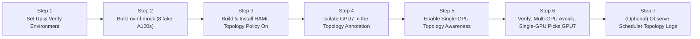

import Tabs from '@theme/Tabs'; import TabItem from '@theme/TabItem';

This lab walks you through simulating an asymmetric PCIe topology on a single-node local cluster using **nvml-mock** and **HAMi**. You'll enable HAMi's topology-aware scheduler, inject custom connectivity scores to isolate one GPU, and then verify that a multi-GPU request **avoids** the isolated GPU while a single-GPU request **picks** it. No physical GPUs are needed - everything runs inside a local Kubernetes cluster.

## What You'll Get

After completing this lab, you will have:

- A local cluster with **nvml-mock** simulating 8 A100 GPUs (80 virtual slots after HAMi slices each GPU into 10)
- HAMi built from a verified commit and installed with **topology-aware scheduling**
- A node annotation (`hami.io/node-nvidia-score`) that defines a custom topology where **GPU7** is poorly connected to all other GPUs
- Proof that the scheduler avoids GPU7 when allocating 2 GPUs to a single Pod (multi-GPU request), and picks GPU7 for a single-GPU request (when `--sgpu-topology-aware=true` is set)
- Visibility into the scheduler's topology decisions via its own logs

:::note

The fake GPU topology scores here are synthetic - nvml-mock reports symmetric connectivity by default, and we overwrite the node annotation ourselves to create an artificial "worst-connected" GPU. This lab validates the *scheduler's* logic against a known topology, not real PCIe/NVLink measurement.

**Score direction matters.** In HAMi's actual scheduling code (`pkg/device/nvidia/device.go`), a *higher* pairwise score means *better* connectivity (like NVLink), and a *lower* score means worse. Multi-GPU requests pick the combination with the **highest** total score; single-GPU requests under `--sgpu-topology-aware` pick the device with the **lowest** total score. To make GPU7 the worst-connected device, we set its scores **below** the 50 baseline, not above it.

:::

## Installation Overview

The entire lab consists of 7 steps:



| Step | Purpose | What It Solves |
| --- | --- | --- |
| Set Up & Verify Environment | Create/verify cluster, check tools | Ensure a Kubernetes cluster is available |
| Build nvml-mock | Simulate 8 A100 GPUs | Gives the device plugin an NVML topology to read |
| Build & Install HAMi | Deploy scheduler with `topology-aware` policy | Enables the scheduler to consider connectivity scores |
| Isolate GPU7 | Freeze the device plugin and overwrite the topology annotation | Creates a known-bad-connectivity GPU to test against |
| Enable Single-GPU Awareness | `--sgpu-topology-aware=true` patch + raise log verbosity | Extends scoring to single-GPU requests and reveals topology logs |
| Verify Scheduling Behavior | Multi-GPU Pod + single-GPU Pod | Confirms avoid/pick behavior matches the injected topology |
| Observe Per-Device Scores | Scheduler logs at `-v=6` | Shows the actual `best device combination` / `worst device` lines |

## Prerequisites

<Tabs groupId="os">
<TabItem value="macos" label="macOS (OrbStack)" default>

- macOS, Intel or Apple Silicon
- [OrbStack](https://orbstack.dev/) installed with built-in Kubernetes enabled
- `docker`, `go` (1.21+), `git`, `python3`
- Access to GitHub, GHCR, and the HAMi Helm repository
- At least 8 GB of free memory and 4 CPU cores available

:::tip[Why OrbStack?]

OrbStack comes with built-in Kubernetes (based on k3s), so there's no need to install kind or Docker Desktop separately. It uses fewer resources, starts faster, and is the preferred choice for local labs on macOS.

:::

Check Helm:

```bash
helm version
```

If Helm is not installed:

```bash
brew install helm
```

</TabItem>
<TabItem value="linux" label="Linux (Ubuntu + kind)">

- Ubuntu 20.04 LTS or later, x86_64 or ARM64
- [Docker Engine](https://docs.docker.com/engine/install/ubuntu/), [`kind`](https://kind.sigs.k8s.io/docs/user/quick-start/#installation) v0.20+, [`kubectl`](https://kubernetes.io/docs/tasks/tools/install-kubectl-linux/), Helm 3.x
- `go` (1.21+), `git`, `python3`
- Access to GitHub, GHCR, and the HAMi Helm repository
- At least 8 GB of free memory and 4 CPU cores available

:::tip[Why kind?]

kind (Kubernetes IN Docker) runs a full Kubernetes cluster inside Docker containers. It works on any Linux distribution that has Docker, requires no special OS integration, and is the standard tool for local Kubernetes development on Linux.

:::

If you need to install any prerequisites, run the following block:

```bash
# Docker Engine
curl -fsSL https://get.docker.com | sudo sh
sudo usermod -aG docker $USER
newgrp docker

# kind
KIND_VERSION=v0.23.0
curl -Lo ./kind "https://kind.sigs.k8s.io/dl/${KIND_VERSION}/kind-linux-amd64"
chmod +x ./kind && sudo mv ./kind /usr/local/bin/kind

# kubectl
curl -LO "https://dl.k8s.io/release/$(curl -L -s https://dl.k8s.io/release/stable.txt)/bin/linux/amd64/kubectl"
sudo install -o root -g root -m 0755 kubectl /usr/local/bin/kubectl && rm kubectl

# Helm
curl https://raw.githubusercontent.com/helm/helm/main/scripts/get-helm-3 | bash
```

</TabItem>
</Tabs>

## Step 1: Set Up and Verify Local Environment

*Why: We need a working Kubernetes cluster to deploy nvml-mock and HAMi.*

<Tabs groupId="os">
<TabItem value="macos" label="macOS" default>

OrbStack's Kubernetes starts automatically once enabled in the OrbStack UI. Verify the cluster is ready:

```bash
kubectl version
```

Example output:

```plaintext
Client Version: v1.33.9
Kustomize Version: v5.6.0
Server Version: v1.33.9+orb1
```

:::note

The `+orb1` suffix in `Server Version` identifies OrbStack's built-in Kubernetes distribution.

:::

</TabItem>
<TabItem value="linux" label="Linux">

Create a local Kubernetes cluster:

```bash
kind create cluster --name topo-lab
```

Example output:

```plaintext
Creating cluster "topo-lab" ...
 ✓ Ensuring node image (kindest/node:v1.32.2) 🖼
 ✓ Preparing nodes 📦
 ✓ Writing configuration 📜
 ✓ Starting control-plane 🕹️
 ✓ Installing CNI 🔌
 ✓ Installing StorageClass 💾
Set kubectl context to "kind-topo-lab"
```

:::note

The `--name topo-lab` flag names the cluster. The resulting node will be called `topo-lab-control-plane`. kind automatically sets your kubectl context to the new cluster.

:::

</TabItem>
</Tabs>

### Set the NODE_NAME Variable

The rest of this lab uses a `NODE_NAME` shell variable so commands don't hard-code the node name. Set it once here; all subsequent commands consume it automatically:

```bash
NODE_NAME=$(kubectl get nodes -o jsonpath='{.items[0].metadata.name}')
echo "NODE_NAME=${NODE_NAME}"
```

---

:::info[Steps 2–7 are identical on both platforms]

From here on, all commands work the same on macOS and Linux. The only difference you will notice is your node name in example outputs.

:::

## Step 2: Build and Deploy nvml-mock (8 Simulated A100 GPUs)

*Why: nvml-mock provides fake GPU devices and NVML topology data so HAMi can discover and score them.*

### 2.1 Clone the NVIDIA Test Infrastructure Repository

```bash
git clone https://github.com/NVIDIA/k8s-test-infra.git
cd k8s-test-infra
```

### 2.2 Build the Mock Docker Image

```bash
docker build -t nvml-mock:local -f deployments/nvml-mock/Dockerfile .
```

### 2.3 Load the Image into the Cluster and Install

```bash
kind load docker-image nvml-mock:local --name topo-lab   # skip on OrbStack

helm install nvml-mock oci://ghcr.io/nvidia/k8s-test-infra/chart/nvml-mock \
  --set image.repository=nvml-mock \
  --set image.tag=local \
  --wait --timeout 120s
```

### 2.4 Verify the GPU Label Is Present

```bash
kubectl get node ${NODE_NAME} -o custom-columns=NAME:.metadata.name,GPU:.metadata.labels.nvidia\\.com/gpu\\.present
```

```plaintext
NAME       GPU
<NODE_NAME>   true
```

> The `GPU` column shows `true`, meaning nvml-mock has registered simulated GPU devices on the node.

## Step 3: Build HAMi from Main and Install with Topology-Aware Scheduling

*Why: HAMi's scheduler replaces the default Kubernetes scheduler for GPU pods and can make topology-aware decisions when the `topology-aware` policy is enabled.*

### 3.1 Clone HAMi and Check Out the Verified Commit

The lab was tested against HAMi `main` branch as of **2026-07-14**. If your current `main` doesn't work as expected, use the exact commit `5dca58e`:

```bash
cd ~
git clone https://github.com/Project-HAMi/HAMi.git
cd HAMi
git log --until=2026-07-14 --oneline -1   # should output 5dca58e
git checkout 5dca58e   # or the commit hash you just got
git submodule update --init --recursive
docker build -t hami:local -f docker/Dockerfile .
kind load docker-image hami:local --name topo-lab   # skip on OrbStack
```

### 3.2 Install HAMi with the Topology-Aware Policy

```bash
helm install hami ./charts/hami \
  -n kube-system \
  --set devicePlugin.image.repository=hami \
  --set devicePlugin.image.tag=local \
  --set scheduler.image.repository=hami \
  --set scheduler.image.tag=local \
  --set devicePlugin.nvidiaDriverRoot=/var/lib/nvml-mock/driver \
  --set scheduler.kubeScheduler.imageTag=v1.35.0 \
  --set scheduler.defaultSchedulerPolicy.gpuSchedulerPolicy=topology-aware
```

> `gpuSchedulerPolicy=topology-aware` tells the scheduler to use pairwise connectivity scores from the node annotation when selecting GPUs.

### 3.3 Label the Node and Configure NVML Discovery

```bash
kubectl label node ${NODE_NAME} gpu=on --overwrite
kubectl -n kube-system set env daemonset/hami-device-plugin -c device-plugin DEVICE_DISCOVERY_STRATEGY=nvml
kubectl -n kube-system rollout restart daemonset/hami-device-plugin
kubectl -n kube-system rollout status daemonset/hami-device-plugin --timeout=120s
```

### 3.4 Check the Node's GPU Capacity

```bash
kubectl describe node ${NODE_NAME} | grep nvidia.com/gpu
```

```plaintext
nvidia.com/gpu: 80
```

> 80 comes from 8 fake GPUs sliced into 10 vGPU units each by HAMi.

## Step 4: Create a Custom Topology that Isolates GPU7

*Why: By default, all GPU pairs have the same connectivity score (50). We'll manually craft a topology where GPU7 has a very low score (5) with every other GPU, then freeze the device plugin to prevent it from overwriting our custom values. This makes GPU7 the "worst-connected" device.*

The device plugin periodically recomputes and patches the topology annotation. The gate is `ENABLE_TOPOLOGY_SCORE`. When set to `false`, the plugin stops including the score in its patch, leaving your manual annotation untouched.

### 4.1 Extract the Current Topology and Locate GPU7

```bash
kubectl get node ${NODE_NAME} -o jsonpath="{.metadata.annotations.hami\.io/node-nvidia-score}" > /tmp/orig-topo.json
```

:::warning[Match on the UUID suffix, not array position]

The array order is not sorted by device index. Always match on the UUID suffix (`...78000N` for device index N). Never assume `data[7]` is GPU7.

:::

```bash
GPU7_UUID=$(python3 -c "
import json
data = json.load(open('/tmp/orig-topo.json'))
for d in data:
    if d['uuid'].endswith('780007'):
        print(d['uuid'])
        break
")
echo "GPU7 UUID = $GPU7_UUID"
```

Make sure this prints a UUID ending in `780007`.

### 4.2 Generate a Modified Topology with GPU7 Isolated (Score = 5)

```bash
python3 -c "
import json
data = json.load(open('/tmp/orig-topo.json'))
gpu7 = '$GPU7_UUID'
for entry in data:
    if entry['uuid'] == gpu7:
        for other in data:
            if other['uuid'] != gpu7:
                entry['score'][other['uuid']] = 5
    else:
        entry['score'][gpu7] = 5
print(json.dumps(data))
" > /tmp/custom-topo.json
```

> Default scores are 50. **Higher = better connectivity.** Setting GPU7's pairs to 5 makes it the worst-connected: multi-GPU combos involving GPU7 have the lowest total score and are avoided; single-GPU picks the lowest total score, which will be GPU7.

### 4.3 Freeze the Device Plugin So It Can't Overwrite Your Custom Scores

```bash
kubectl -n kube-system set env daemonset/hami-device-plugin -c device-plugin ENABLE_TOPOLOGY_SCORE=false
kubectl -n kube-system rollout restart daemonset/hami-device-plugin
kubectl -n kube-system rollout status daemonset/hami-device-plugin --timeout=120s
```

### 4.4 Apply the Custom Annotation

```bash
kubectl annotate node ${NODE_NAME} hami.io/node-nvidia-score="$(cat /tmp/custom-topo.json)" --overwrite
```

### 4.5 Verify that GPU7 Now Has a Low Score with All Other GPUs

Wait past one registration cycle (30s) to confirm the freeze held:

```bash
sleep 40
kubectl get node ${NODE_NAME} -o jsonpath='{.metadata.annotations.hami\.io/node-nvidia-score}' | python3 -c "
import sys, json
data = json.load(sys.stdin)
for d in data:
    if d['uuid'].endswith('780007'):
        print(d['score'])
        break
"
```

Expected: a dictionary where every other GPU UUID maps to **5**, not 50.

### 4.6 Restart the Scheduler So It Picks Up the New Topology

```bash
kubectl -n kube-system rollout restart deployment hami-scheduler
kubectl -n kube-system rollout status deployment hami-scheduler --timeout=60s
kubectl delete pod multi-gpu single-gpu --ignore-not-found
```

## Step 5: Enable Single-GPU Topology-Aware Scheduling and Bump Verbosity

*Why: By default, topology scoring only applies to multi-GPU pods. Adding `--sgpu-topology-aware=true` extends it to single-GPU pods. Raising log verbosity to `-v=6` exposes the `best device combination` / `worst device` log lines that prove the scheduler used your custom scores.*

### 5.1 Enable Single-GPU Topology Awareness

```bash
kubectl -n kube-system patch deployment hami-scheduler --type=json --patch-file /dev/stdin <<'EOF'
[
  {
    "op": "add",
    "path": "/spec/template/spec/containers/1/command/-",
    "value": "--sgpu-topology-aware=true"
  }
]
EOF

kubectl -n kube-system rollout status deployment hami-scheduler --timeout=60s
```

Confirm the flag appears:

```bash
kubectl -n kube-system get deployment hami-scheduler -o yaml | grep sgpu-topology-aware
```

### 5.2 Raise Scheduler Log Verbosity to 6 (Non-Interactive)

```bash
kubectl -n kube-system get deployment hami-scheduler -o json > /tmp/hami-scheduler.json
python3 -c "
import json
d = json.load(open('/tmp/hami-scheduler.json'))
for c in d['spec']['template']['spec']['containers']:
    cmd = c.get('command') or []
    for i, a in enumerate(cmd):
        if a.startswith('-v='):
            cmd[i] = '-v=6'
json.dump(d, open('/tmp/hami-scheduler.json', 'w'))
"
kubectl apply -f /tmp/hami-scheduler.json
kubectl -n kube-system rollout status deployment hami-scheduler --timeout=60s
kubectl -n kube-system get deployment hami-scheduler -o yaml | grep -- '-v='
```

You should see `-v=6` for both the `kube-scheduler` and `vgpu-scheduler-extender` containers.

## Step 6: Verification Tests

*Why: We run a pod that requests 2 GPUs (should avoid GPU7) and another that requests 1 GPU (should pick GPU7). The scheduler's logs and pod annotations confirm the behavior.*

### 6.1 Multi-GPU Pod - Must Avoid GPU7

Review the Pod YAML before applying:

```yaml
apiVersion: v1
kind: Pod
metadata:
  name: multi-gpu
spec:
  containers:
  - name: sleep
    image: busybox
    command: ["sleep", "3600"]
    env:
    - name: CUDA_DISABLE_CONTROL
      value: "true"
    resources:
      limits:
        nvidia.com/gpu: "2"
```

Apply the Pod:

```bash
kubectl apply -f multi-gpu-pod.yaml
```

```plaintext
pod/multi-gpu created
```

Wait for it to run, then check which GPUs it landed on:

```bash
kubectl get pod multi-gpu -w   # wait for Running, then Ctrl+C
kubectl get pod multi-gpu -o jsonpath='{.metadata.annotations.hami\.io/vgpu-devices-allocated}'
```

**Expected output** (example): `GPU-...780002,GPU-...780003` - no `780007`.

Check the scheduler log:

```bash
kubectl -n kube-system logs deployment/hami-scheduler -c vgpu-scheduler-extender | grep "best device combination" | tail -1
```

Expected: `"best device combination":{"NVIDIA":[{"Idx":2,...},{"Idx":3,...}]}` (indices ≠ 7).

### 6.2 Single-GPU Pod - Should Pick GPU7

Review the Pod YAML before applying:

```yaml
apiVersion: v1
kind: Pod
metadata:
  name: single-gpu
spec:
  containers:
  - name: sleep
    image: busybox
    command: ["sleep", "3600"]
    env:
    - name: CUDA_DISABLE_CONTROL
      value: "true"
    resources:
      limits:
        nvidia.com/gpu: 1
```

Apply the Pod:

```bash
kubectl apply -f single-gpu-pod.yaml
```

```plaintext
pod/single-gpu created
```

Wait for it to run, then check which GPU it landed on:

```bash
kubectl get pod single-gpu -w
kubectl describe pod single-gpu | grep vgpu-devices-allocated
```

**Expected output**: `hami.io/vgpu-devices-allocated: GPU-...780007`.

Check the scheduler log:

```bash
kubectl -n kube-system logs deployment/hami-scheduler -c vgpu-scheduler-extender | grep "worst device" | tail -1
```

Expected: `"worst device":[{"Idx":7,...}]`.

## Step 7: (Optional) Observe the Scheduler's Topology Decisions

*Why: The `best device combination` / `worst device` log lines are the direct proof that the scheduler used your custom topology scores. The `computer score` log is unrelated (it's for resource utilization, not topology).*

If you haven't already increased verbosity to 6, do it now (see Step 5.2). Then run any test pod again and grep the logs:

```bash
kubectl -n kube-system logs deployment/hami-scheduler -c vgpu-scheduler-extender | grep -E "best device combination|worst device"
```

## Summary of Verified Features

| Feature | Test | Expected Behaviour | Proof |
| --- | --- | --- | --- |
| Topology-aware scheduling enabled | Helm install flag + scheduler logs | Scheduler uses `topology-aware` policy | Log: `--gpu-scheduler-policy=topology-aware` |
| Single-GPU topology flag | `--sgpu-topology-aware=true` patch | Single-GPU Pods respect scores | Log: `--sgpu-topology-aware=true` |
| Multi-GPU avoids isolated GPU | Pod requesting 2 GPUs | GPU7 not allocated | Annotation shows only GPUs from 0-6 |
| Single-GPU picks isolated GPU | Pod requesting 1 GPU | GPU7 allocated (when annotation persists) | Annotation shows GPU7 UUID |
| Scheduler evaluates topology scores | Verbose (`-v=6`) logs | Selection reflects your injected low score for GPU7 | Log: `best device combination` / `worst device` |

## Cleanup

Delete the test Pods:

```bash
kubectl delete pod multi-gpu single-gpu --ignore-not-found
```

Uninstall HAMi and nvml-mock:

```bash
helm uninstall hami -n kube-system
helm uninstall nvml-mock
```

<Tabs groupId="os">
<TabItem value="macos" label="macOS" default>

To stop the Kubernetes cluster, disable it from the OrbStack UI, or quit OrbStack entirely.

</TabItem>
<TabItem value="linux" label="Linux">

Delete the kind cluster:

```bash
kind delete cluster --name topo-lab
```

```plaintext
Deleting cluster "topo-lab" ...
Deleted nodes: ["topo-lab-control-plane"]
```

</TabItem>
</Tabs>

:::tip

If you want to keep the environment for further experimentation, skip the cleanup steps.

:::

## Next Steps

- Move to a real GPU cluster to test actual memory/compute isolation with topology awareness.
- Experiment with different topology matrices (e.g., 2 groups of 4 GPUs) and observe scheduling preferences.
- Integrate this lab into a CI pipeline for regression testing of HAMi's scheduler.