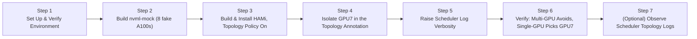

import Tabs from '@theme/Tabs'; import TabItem from '@theme/TabItem';

This lab walks you through simulating an asymmetric PCIe topology on a single-node local cluster using **nvml-mock** and **HAMi**. You'll enable HAMi's topology-aware scheduler, inject custom connectivity scores to isolate one GPU, and then verify that a multi-GPU request **avoids** the isolated GPU while a single-GPU request **picks** it. No physical GPUs are needed - everything runs inside a local Kubernetes cluster.

## What You'll Get

After completing this lab, you will have:

- A local cluster with **nvml-mock** simulating 8 A100 GPUs (80 virtual slots after HAMi slices each GPU into 10)
- HAMi built from a verified commit and installed with **topology-aware scheduling** (`gpuSchedulerPolicy=topology-aware`)
- A node annotation (`hami.io/node-nvidia-score`) that defines a custom topology where **GPU7** is poorly connected to all other GPUs
- Proof that the scheduler avoids GPU7 when allocating 2 GPUs to a single Pod (multi-GPU request), and picks GPU7 for a single-GPU request - both behaviors come from the same `topology-aware` policy, with no extra flag required
- Visibility into the scheduler's topology decisions via its own logs

:::note

The fake GPU topology scores here are synthetic - nvml-mock reports symmetric connectivity by default, and we overwrite the node annotation ourselves to create an artificial "worst-connected" GPU. This lab validates the _scheduler's_ logic against a known topology, not real PCIe/NVLink measurement.

**Score direction matters.** In HAMi's actual scheduling code (`pkg/device/nvidia/device.go`), a _higher_ pairwise score means _better_ connectivity (like NVLink), and a _lower_ score means worse. Multi-GPU requests pick the combination with the **highest** total score (via `computeBestCombination`); single-GPU requests pick the device with the **lowest** score (via `computeWorstSignleCard`) - both paths are gated by the same `needTopology` check in `Fit()`, driven entirely by `gpuSchedulerPolicy=topology-aware`. There is no separate flag to enable single-GPU scoring; it's on by default the moment the policy is set. To make GPU7 the worst-connected device, we set its scores **below** the 50 baseline, not above it.

:::

## Installation Overview

The entire lab consists of 7 steps:



| Step | Purpose | What It Solves |
| --- | --- | --- |
| Set Up & Verify Environment | Create/verify cluster, check tools | Ensure a Kubernetes cluster is available |
| Build nvml-mock | Simulate 8 A100 GPUs | Gives the device plugin an NVML topology to read |
| Build & Install HAMi | Deploy scheduler with `topology-aware` policy | Enables the scheduler to consider connectivity scores for both single- and multi-GPU requests |
| Isolate GPU7 | Freeze the device plugin and overwrite the topology annotation | Creates a known-bad-connectivity GPU to test against |
| Raise Scheduler Log Verbosity | Bump `-v=6` on the scheduler | Reveals the `best device combination` / `worst device` topology log lines |
| Verify Scheduling Behavior | Multi-GPU Pod + single-GPU Pod | Confirms avoid/pick behavior matches the injected topology |
| Observe Per-Device Scores | Scheduler logs at `-v=6` | Shows the actual `best device combination` / `worst device` lines |

## Prerequisites

<Tabs groupId="os">
<TabItem value="macos" label="macOS (OrbStack)" default>

- macOS, Intel or Apple Silicon
- [OrbStack](https://orbstack.dev/) installed with built-in Kubernetes enabled
- `docker`, `go` (1.21+), `git`, `python3`
- Access to GitHub, GHCR, and the HAMi Helm repository
- At least 8 GB of free memory and 4 CPU cores available

:::tip[Why OrbStack?]

OrbStack comes with built-in Kubernetes (based on k3s), so there's no need to install kind or Docker Desktop separately. It uses fewer resources, starts faster, and is the preferred choice for local labs on macOS.

:::

Check Helm:

```bash
helm version
```

If Helm is not installed:

```bash
brew install helm
```

</TabItem>
<TabItem value="linux" label="Linux (Ubuntu + kind)">

- Ubuntu 20.04 LTS or later, x86_64 or ARM64
- [Docker Engine](https://docs.docker.com/engine/install/ubuntu/), [`kind`](https://kind.sigs.k8s.io/docs/user/quick-start/#installation) v0.20+, [`kubectl`](https://kubernetes.io/docs/tasks/tools/install-kubectl-linux/), Helm 3.x
- `go` (1.21+), `git`, `python3`
- Access to GitHub, GHCR, and the HAMi Helm repository
- At least 8 GB of free memory and 4 CPU cores available

:::tip[Why kind?]

kind (Kubernetes IN Docker) runs a full Kubernetes cluster inside Docker containers. It works on any Linux distribution that has Docker, requires no special OS integration, and is the standard tool for local Kubernetes development on Linux.

:::

If you need to install any prerequisites, run the following block:

```bash
# Docker Engine
curl -fsSL https://get.docker.com | sudo sh
sudo usermod -aG docker $USER
newgrp docker

# kind
KIND_VERSION=v0.23.0
curl -Lo ./kind "https://kind.sigs.k8s.io/dl/${KIND_VERSION}/kind-linux-amd64"
chmod +x ./kind && sudo mv ./kind /usr/local/bin/kind

# kubectl
curl -LO "https://dl.k8s.io/release/$(curl -L -s https://dl.k8s.io/release/stable.txt)/bin/linux/amd64/kubectl"
sudo install -o root -g root -m 0755 kubectl /usr/local/bin/kubectl && rm kubectl

# Helm
curl https://raw.githubusercontent.com/helm/helm/main/scripts/get-helm-3 | bash
```

</TabItem>
</Tabs>

## Step 1: Set Up and Verify Local Environment

_Why: We need a working Kubernetes cluster to deploy nvml-mock and HAMi._

<Tabs groupId="os">
<TabItem value="macos" label="macOS" default>

OrbStack's Kubernetes starts automatically once enabled in the OrbStack UI. Verify the cluster is ready:

```bash
kubectl version
```

Example output:

```plaintext
Client Version: v1.33.9
Kustomize Version: v5.6.0
Server Version: v1.33.9+orb1
```

:::note

The `+orb1` suffix in `Server Version` identifies OrbStack's built-in Kubernetes distribution.

:::

</TabItem>
<TabItem value="linux" label="Linux">

Create a local Kubernetes cluster:

```bash
kind create cluster --name topo-lab
```

Example output:

```plaintext
Creating cluster "topo-lab" ...
 ✓ Ensuring node image (kindest/node:v1.35.0) 🖼
 ✓ Preparing nodes 📦
 ✓ Writing configuration 📜
 ✓ Starting control-plane 🕹️
 ✓ Installing CNI 🔌
 ✓ Installing StorageClass 💾
Set kubectl context to "kind-topo-lab"
```

:::note

The `--name topo-lab` flag names the cluster. The resulting node will be called `topo-lab-control-plane`. kind automatically sets your kubectl context to the new cluster.

:::

</TabItem>
</Tabs>

### Set the NODE_NAME Variable

The rest of this lab uses a `NODE_NAME` shell variable so commands don't hard-code the node name. **Set it at the beginning of each new terminal session** because the variable is lost when you close the shell.

```bash
NODE_NAME=$(kubectl get nodes -o jsonpath='{.items[0].metadata.name}')
echo "NODE_NAME=${NODE_NAME}"
```

---

:::info[Steps 2–7 are identical on both platforms]

From here on, all commands work the same on macOS and Linux. The only difference you will notice is your node name in example outputs.

:::

## Step 2: Build and Deploy nvml-mock (8 Simulated A100 GPUs)

_Why: nvml-mock provides fake GPU devices and NVML topology data so HAMi can discover and score them._

### 2.1 Clone the NVIDIA Test Infrastructure Repository

```bash
git clone https://github.com/NVIDIA/k8s-test-infra.git
cd k8s-test-infra
```

### 2.2 Build the Mock Docker Image

```bash
docker build -t nvml-mock:local -f deployments/nvml-mock/Dockerfile .
```

### 2.3 Load the Image into the Cluster and Install

<Tabs groupId="os">
<TabItem value="macos" label="macOS" default>

On macOS with OrbStack, the local Docker image is directly accessible to the cluster — no `kind load` is needed.

```bash
helm install nvml-mock oci://ghcr.io/nvidia/k8s-test-infra/chart/nvml-mock \
  --set image.repository=nvml-mock \
  --set image.tag=local \
  --wait --timeout 120s
```

</TabItem>
<TabItem value="linux" label="Linux">

On Linux with kind, you **must load the image into the cluster before installing the chart**. If you skip `kind load`, the GPU label will appear as `<none>`.

```bash
kind load docker-image nvml-mock:local --name topo-lab

helm install nvml-mock oci://ghcr.io/nvidia/k8s-test-infra/chart/nvml-mock \
  --set image.repository=nvml-mock \
  --set image.tag=local \
  --wait --timeout 120s
```

</TabItem>
</Tabs>

### 2.4 Verify the GPU Label Is Present

```bash
kubectl get node ${NODE_NAME} -o custom-columns=NAME:.metadata.name,GPU:.metadata.labels.nvidia\\.com/gpu\\.present
```

```plaintext
NAME                     GPU
topo-lab-control-plane   true
```

> The `GPU` column shows `true`, meaning nvml-mock has registered simulated GPU devices on the node.

## Step 3: Build HAMi from Main and Install with Topology-Aware Scheduling

_Why: HAMi's scheduler replaces the default Kubernetes scheduler for GPU pods and can make topology-aware decisions when the `topology-aware` policy is enabled._

### 3.1 Clone HAMi and Check Out the Verified Commit

The lab was tested against HAMi `main` branch as of **2026-07-14**. If your current `main` doesn't work as expected, use the exact commit `5dca58e`:

```bash
cd ~
git clone https://github.com/Project-HAMi/HAMi.git
cd HAMi
git log --until=2026-07-14 --oneline -1   # should output 5dca58e
git checkout 5dca58e   # or the commit hash you just got
git submodule update --init --recursive
docker build -t hami:local -f docker/Dockerfile .
```

<Tabs groupId="os">
<TabItem value="macos" label="macOS" default>

```bash
# Image is already available locally, no need to load
```

</TabItem>
<TabItem value="linux" label="Linux">

```bash
kind load docker-image hami:local --name topo-lab
```

</TabItem>
</Tabs>

### 3.2 Install HAMi with the Topology-Aware Policy

```bash
helm install hami ./charts/hami \
  -n kube-system \
  --set devicePlugin.image.repository=hami \
  --set devicePlugin.image.tag=local \
  --set scheduler.image.repository=hami \
  --set scheduler.image.tag=local \
  --set devicePlugin.nvidiaDriverRoot=/var/lib/nvml-mock/driver \
  --set scheduler.kubeScheduler.imageTag=v1.35.0 \
  --set scheduler.defaultSchedulerPolicy.gpuSchedulerPolicy=topology-aware
```

> `gpuSchedulerPolicy=topology-aware` tells the scheduler to use pairwise connectivity scores from the node annotation when selecting GPUs. This single setting covers **both** multi-GPU and single-GPU requests - HAMi's `Fit()` function (`pkg/device/nvidia/device.go`) checks this policy once, then branches internally: multi-GPU requests go through `computeBestCombination()`, single-GPU requests go through `computeWorstSignleCard()`. There's no separate flag to turn on for single-GPU scoring.

### 3.3 Label the Node and Configure NVML Discovery

:::danger[Confirm NODE_NAME is set before running this]

If you opened a new terminal since Step 1, or `NODE_NAME` otherwise ended up empty, the label command below silently degrades instead of clearly failing on the _node_ — but the label itself is what breaks:

```bash
kubectl label node ${NODE_NAME} gpu=on --overwrite
error: resource(s) were provided, but no name was specified
```

That error means `${NODE_NAME}` expanded to nothing, so the command became `kubectl label node gpu=on --overwrite` with no node name at all. **The node never gets the `gpu=on` label**, and everything downstream fails quietly:

- If `hami-device-plugin`'s DaemonSet has a `nodeSelector` requiring `gpu=on`, it now matches **zero** nodes.
- `kubectl rollout restart` / `rollout status` on a DaemonSet with zero desired pods reports **"successfully rolled out"** — there's nothing to roll out, so this gives no indication anything is wrong.
- `kubectl get pods | grep hami-device-plugin` returns **nothing at all** (not `Pending`, not `CrashLoopBackOff` — no pod exists anywhere).
- Every step after this that depends on the device plugin running (topology annotation, GPU capacity, actual pod scheduling) will fail later with confusing, disconnected errors.

Before running the block below, confirm `NODE_NAME` is non-empty:

```bash
echo "NODE_NAME=${NODE_NAME}"
NODE_NAME=$(kubectl get nodes -o jsonpath='{.items[0].metadata.name}')
```

:::

```bash
kubectl label node ${NODE_NAME} gpu=on --overwrite
kubectl -n kube-system set env daemonset/hami-device-plugin -c device-plugin DEVICE_DISCOVERY_STRATEGY=nvml
kubectl -n kube-system rollout restart daemonset/hami-device-plugin
kubectl -n kube-system rollout status daemonset/hami-device-plugin --timeout=120s
```

Confirm the pod actually exists before moving on — a clean `rollout status` is not proof by itself:

```bash
kubectl -n kube-system get pods -o wide | grep hami-device-plugin
```

If this returns **no output**, stop and go back to the `NODE_NAME` / label check above rather than continuing to Step 3.4 — there is no pod to become `Running`, so waiting longer won't help.

:::danger[Stop here if this times out]

If you see `error: timed out waiting for the condition`, the device plugin may take longer than 120 seconds to start. **Do not continue** until the pod is `Running` and `1/1 Ready`.

You can check the pod status with:

```bash
kubectl -n kube-system get pods -o wide | grep hami-device-plugin
kubectl -n kube-system describe pod <hami-device-plugin-pod-name>
kubectl -n kube-system logs <hami-device-plugin-pod-name> -c device-plugin --tail=200
```

Common issues:

1. **Pod stuck `Pending`** – check for nodeSelector/affinity/taint mismatches. Ensure the node has the labels `nvidia.com/gpu.present=true` (set by nvml-mock) and `gpu=on` (set above).
2. **`device-plugin` container `CrashLoopBackOff`** – the device plugin can't find the NVML mock library. Verify the path used in `devicePlugin.nvidiaDriverRoot` matches the actual path nvml-mock installs `libnvidia-ml.so.*` to (usually `/var/lib/nvml-mock/driver`). See the nvml-mock pod logs or NOTES output for the correct path.
3. **No pod at all (not even `Pending`)** – this is the `NODE_NAME` failure mode above, not a timeout. Check that the node actually carries the `gpu=on` label with `kubectl get node ${NODE_NAME} --show-labels | grep gpu=on`.
4. **`vgpu-monitor` container restarting, pod shows `1/2`** – this is expected and harmless in this lab, not a real failure. `vgpu-monitor` watches real container runtimes (`/run/docker`, `/run/containerd`) for actual GPU-using workloads to report on; since nvml-mock has no real GPU workloads for it to monitor, it exits cleanly (`Exit Code: 0`, `Reason: Completed`) and kubelet restarts it, which can trigger a `BackOff` warning purely from restarting quickly. **What actually matters for this lab is the `device-plugin` container specifically** — check its readiness on its own:

   ```bash
   kubectl -n kube-system get pod <hami-device-plugin-pod-name> -o jsonpath='{range .status.containerStatuses[*]}{.name}{": ready="}{.ready}{"\n"}{end}'
   ```

   If `device-plugin: ready=true`, you're fine to proceed even if `vgpu-monitor` shows restarts and the pod's overall `READY` column reads `1/2`. This same non-critical timeout can resurface at the `rollout status` in Step 4.4 — same cause, same fix: check `device-plugin` specifically, not the whole pod's ready count.

Once `device-plugin` is ready, you can re-run the rollout status command or simply proceed to the next step.

:::

### 3.4 Check the Node's GPU Capacity

```bash
kubectl describe node ${NODE_NAME} | grep nvidia.com/gpu
```

```plaintext
nvidia.com/gpu: 80
```

> 80 comes from 8 fake GPUs sliced into 10 vGPU units each by HAMi.

## Step 4: Create a Custom Topology that Isolates GPU7

_Why: By default, all GPU pairs have the same connectivity score (50). We'll manually craft a topology where GPU7 has a very low score (5) with every other GPU, then freeze the device plugin to prevent it from overwriting our custom values. This makes GPU7 the "worst-connected" device._

:::danger[This step is required - it's easy to end up with an empty annotation without it]

Setting `gpuSchedulerPolicy=topology-aware` at Helm install time (Step 3.2) only turns on the **scheduler**'s side of topology awareness. It does **not** make the **device plugin** compute or publish topology scores. That's a separate switch: the `ENABLE_TOPOLOGY_SCORE` environment variable on the `hami-device-plugin` DaemonSet, and it defaults to `false`/off when unset. If you skip 4.1 below, `hami.io/node-nvidia-score` will be an **empty string** — and the Python scripts in this step will fail with `JSONDecodeError`. Capacity registration and topology-score publishing are different code paths; one working doesn't imply the other is on.

:::

### 4.1 Enable Topology Scoring on the Device Plugin

```bash
kubectl -n kube-system set env daemonset/hami-device-plugin -c device-plugin ENABLE_TOPOLOGY_SCORE=true
kubectl -n kube-system rollout restart daemonset/hami-device-plugin
kubectl -n kube-system rollout status daemonset/hami-device-plugin --timeout=120s
```

Wait past one registration cycle (the device plugin patches the annotation every 30 seconds), then check if the annotation is populated:

```bash
sleep 40
kubectl get node ${NODE_NAME} -o jsonpath='{.metadata.annotations.hami\.io/node-nvidia-score}'
```

This should print a JSON array of 8 objects (one per fake GPU), each with a `uuid` and a `score` map.

- **If you see a JSON array:** the annotation is present. Proceed to 4.2.
- **If it prints nothing or fails with an error:** the annotation is empty. In that case, we'll manually create a default topology file using the known UUIDs. Follow the fallback instructions inside 4.2.

> If the device-plugin pod from Step 3.3 never actually started (check with `kubectl -n kube-system get pods | grep hami-device-plugin`), an empty annotation here is expected — there's nothing running to populate it. Go back and fix Step 3.3 first rather than proceeding straight to the manual fallback; the fallback works either way, but it's worth knowing which case you're in.

### 4.2 Obtain the Current Topology (or Create a Default)

First, try to pull the annotation from the node:

```bash
kubectl get node ${NODE_NAME} -o jsonpath="{.metadata.annotations.hami\.io/node-nvidia-score}" > /tmp/orig-topo.json
```

Now test if the file contains valid JSON:

```bash
python3 -c "import json; d=json.load(open('/tmp/orig-topo.json')); print(f'Devices: {len(d)}')"
```

**If the command succeeds and prints `Devices: 8`**, you can skip the fallback below and continue with the GPU7 UUID extraction.

**If the command fails** (e.g., `JSONDecodeError: Expecting value`), the file is empty. Use the following manual fallback to create a default topology.

:::danger[Don't re-run the pull command after this]

Once you've written the fallback file below, **do not re-run** the `kubectl get node ... > /tmp/orig-topo.json` command from earlier on this page. If the real annotation is still empty (e.g. the device plugin still isn't running), that command will silently truncate `/tmp/orig-topo.json` back to 0 bytes, overwriting the good fallback data you're about to create. This is exactly what produces `JSONDecodeError: Expecting value: line 1 column 1 (char 0)` on every subsequent step, including a blank `GPU7_UUID`.

If you need to check whether the real annotation has since appeared, redirect to a **different** file first (e.g. `/tmp/check-topo.json`) and inspect that, rather than overwriting `/tmp/orig-topo.json` directly:

```bash
kubectl get node ${NODE_NAME} -o jsonpath="{.metadata.annotations.hami\.io/node-nvidia-score}" > /tmp/check-topo.json
python3 -c "import json; d=json.load(open('/tmp/check-topo.json')); print(f'Devices: {len(d)}')"
# only if this succeeds, copy it over: cp /tmp/check-topo.json /tmp/orig-topo.json
```

:::

#### Fallback: Create Default Topology Manually

The nvml-mock `a100` profile generates GPUs with UUIDs starting with `GPU-12345678-1234-1234-1234-12345678` and ending with the device index (0–7). We'll use these to build the topology file.

```bash
cat > /tmp/orig-topo.json <<'ENDJSON'
[
  {"uuid":"GPU-12345678-1234-1234-1234-123456780000","score":{"GPU-12345678-1234-1234-1234-123456780001":50,"GPU-12345678-1234-1234-1234-123456780002":50,"GPU-12345678-1234-1234-1234-123456780003":50,"GPU-12345678-1234-1234-1234-123456780004":50,"GPU-12345678-1234-1234-1234-123456780005":50,"GPU-12345678-1234-1234-1234-123456780006":50,"GPU-12345678-1234-1234-1234-123456780007":50}},
  {"uuid":"GPU-12345678-1234-1234-1234-123456780001","score":{"GPU-12345678-1234-1234-1234-123456780000":50,"GPU-12345678-1234-1234-1234-123456780002":50,"GPU-12345678-1234-1234-1234-123456780003":50,"GPU-12345678-1234-1234-1234-123456780004":50,"GPU-12345678-1234-1234-1234-123456780005":50,"GPU-12345678-1234-1234-1234-123456780006":50,"GPU-12345678-1234-1234-1234-123456780007":50}},
  {"uuid":"GPU-12345678-1234-1234-1234-123456780002","score":{"GPU-12345678-1234-1234-1234-123456780000":50,"GPU-12345678-1234-1234-1234-123456780001":50,"GPU-12345678-1234-1234-1234-123456780003":50,"GPU-12345678-1234-1234-1234-123456780004":50,"GPU-12345678-1234-1234-1234-123456780005":50,"GPU-12345678-1234-1234-1234-123456780006":50,"GPU-12345678-1234-1234-1234-123456780007":50}},
  {"uuid":"GPU-12345678-1234-1234-1234-123456780003","score":{"GPU-12345678-1234-1234-1234-123456780000":50,"GPU-12345678-1234-1234-1234-123456780001":50,"GPU-12345678-1234-1234-1234-123456780002":50,"GPU-12345678-1234-1234-1234-123456780004":50,"GPU-12345678-1234-1234-1234-123456780005":50,"GPU-12345678-1234-1234-1234-123456780006":50,"GPU-12345678-1234-1234-1234-123456780007":50}},
  {"uuid":"GPU-12345678-1234-1234-1234-123456780004","score":{"GPU-12345678-1234-1234-1234-123456780000":50,"GPU-12345678-1234-1234-1234-123456780001":50,"GPU-12345678-1234-1234-1234-123456780002":50,"GPU-12345678-1234-1234-1234-123456780003":50,"GPU-12345678-1234-1234-1234-123456780005":50,"GPU-12345678-1234-1234-1234-123456780006":50,"GPU-12345678-1234-1234-1234-123456780007":50}},
  {"uuid":"GPU-12345678-1234-1234-1234-123456780005","score":{"GPU-12345678-1234-1234-1234-123456780000":50,"GPU-12345678-1234-1234-1234-123456780001":50,"GPU-12345678-1234-1234-1234-123456780002":50,"GPU-12345678-1234-1234-1234-123456780003":50,"GPU-12345678-1234-1234-1234-123456780004":50,"GPU-12345678-1234-1234-1234-123456780006":50,"GPU-12345678-1234-1234-1234-123456780007":50}},
  {"uuid":"GPU-12345678-1234-1234-1234-123456780006","score":{"GPU-12345678-1234-1234-1234-123456780000":50,"GPU-12345678-1234-1234-1234-123456780001":50,"GPU-12345678-1234-1234-1234-123456780002":50,"GPU-12345678-1234-1234-1234-123456780003":50,"GPU-12345678-1234-1234-1234-123456780004":50,"GPU-12345678-1234-1234-1234-123456780005":50,"GPU-12345678-1234-1234-1234-123456780007":50}},
  {"uuid":"GPU-12345678-1234-1234-1234-123456780007","score":{"GPU-12345678-1234-1234-1234-123456780000":50,"GPU-12345678-1234-1234-1234-123456780001":50,"GPU-12345678-1234-1234-1234-123456780002":50,"GPU-12345678-1234-1234-1234-123456780003":50,"GPU-12345678-1234-1234-1234-123456780004":50,"GPU-12345678-1234-1234-1234-123456780005":50,"GPU-12345678-1234-1234-1234-123456780006":50}}
]
ENDJSON
```

Verify the file is valid:

```bash
python3 -c "import json; d=json.load(open('/tmp/orig-topo.json')); print(f'Devices: {len(d)}'); print('GPU7 UUID:', [x['uuid'] for x in d if x['uuid'].endswith('780007')][0])"
```

Expected output:

```
Devices: 8
GPU7 UUID: GPU-12345678-1234-1234-1234-123456780007
```

### Locate GPU7 UUID

Now extract the UUID of GPU7 (whether from the real annotation or the manually‑created file):

```bash
GPU7_UUID=$(python3 -c "
import json
data = json.load(open('/tmp/orig-topo.json'))
for d in data:
    if d['uuid'].endswith('780007'):
        print(d['uuid'])
        break
")
echo "GPU7 UUID = $GPU7_UUID"
```

:::danger[Stop if this is empty — do not proceed to 4.3]

If `GPU7_UUID` prints as empty (`GPU7 UUID =` with nothing after the equals sign), **do not continue to Step 4.3**. This most commonly happens when `$GPU7_UUID` was set in a previous shell session and this is a fresh terminal — the variable simply doesn't exist yet here, `$GPU7_UUID` silently expands to an empty string in the next command, and Python happily accepts `gpu7 = ''` without raising any error.

The consequence is severe and easy to miss: the score-generation script in 4.3 will run to completion, produce a `custom-topo.json` that _looks_ plausible, apply cleanly, and pass every syntax check — but it will never actually touch any real GPU's scores. Instead it silently adds a bogus `''` key to every device's score map. The annotation check in 4.6 will look almost right (every real device still shows the old baseline of 50) except for one stray extra key: `'': 5`. If you see that stray empty-string key anywhere in your topology JSON, this is what happened — go back and re-run the extraction command above in the **current** shell.

Add this hard stop before moving on:

```bash
if [ -z "$GPU7_UUID" ]; then
  echo "ERROR: GPU7_UUID is empty. Re-run the extraction command above in this shell before continuing." >&2
else
  echo "OK: GPU7_UUID is set to $GPU7_UUID"
fi
```

:::

:::warning[Match on the UUID suffix, not array position]

The array order is not sorted by device index. Always match on the UUID suffix (`...78000N` for device index N). Never assume `data[7]` is GPU7.

:::

### 4.3 Generate a Modified Topology with GPU7 Isolated (Score = 5)

```bash
python3 -c "
import json
data = json.load(open('/tmp/orig-topo.json'))
gpu7 = '$GPU7_UUID'
for entry in data:
    if entry['uuid'] == gpu7:
        for other in data:
            if other['uuid'] != gpu7:
                entry['score'][other['uuid']] = 5
    else:
        entry['score'][gpu7] = 5
print(json.dumps(data))
" > /tmp/custom-topo.json
```

> Default scores are 50. **Higher = better connectivity.** Setting GPU7's pairs to 5 makes it the worst-connected: multi-GPU combos involving GPU7 have the lowest total score and are avoided; single-GPU picks the lowest total score, which will be GPU7.

### 4.4 Freeze the Device Plugin So It Can't Overwrite Your Custom Scores

Now flip the same env var back to `false` — this stops the device plugin from recomputing and overwriting the manual scores:

```bash
kubectl -n kube-system set env daemonset/hami-device-plugin -c device-plugin ENABLE_TOPOLOGY_SCORE=false
kubectl -n kube-system rollout restart daemonset/hami-device-plugin
kubectl -n kube-system rollout status daemonset/hami-device-plugin --timeout=120s
```

:::note[Timeout is non‑critical]

If this `rollout status` times out, it's almost always the same harmless `vgpu-monitor` container restart cycle described in Step 3.3, not a real problem — `vgpu-monitor` has nothing to monitor in this fake-GPU lab, so it exits cleanly and restarts, which can keep the pod's overall `READY` count below the daemonset's expected total. What matters is that `device-plugin` itself is ready and the env var took effect:

```bash
kubectl -n kube-system get pods -o wide | grep hami-device-plugin
kubectl -n kube-system get pod <hami-device-plugin-pod-name> -o jsonpath='{range .status.containerStatuses[*]}{.name}{": ready="}{.ready}{"\n"}{end}'
```

If `device-plugin: ready=true`, the freeze is effective and you can continue with Step 4.5 regardless of what `vgpu-monitor` is doing.

:::

### 4.5 Apply the Custom Annotation

**Important:** The `NODE_NAME` variable must still be set. If you've opened a new terminal, re-run:

```bash
NODE_NAME=$(kubectl get nodes -o jsonpath='{.items[0].metadata.name}')
```

Then apply the annotation:

```bash
kubectl annotate node ${NODE_NAME} hami.io/node-nvidia-score="$(cat /tmp/custom-topo.json)" --overwrite
```

Expected output: `node/<NODE_NAME> annotated`.

### 4.6 Verify that GPU7 Now Has a Low Score with All Other GPUs

Wait past one registration cycle (30s) to confirm the freeze held:

```bash
sleep 40
kubectl get node ${NODE_NAME} -o jsonpath='{.metadata.annotations.hami\.io/node-nvidia-score}' | python3 -c "
import sys, json
data = json.load(sys.stdin)
for d in data:
    if d['uuid'].endswith('780007'):
        print(d['score'])
        break
"
```

Expected: a dictionary where every other GPU UUID maps to **5**, not 50. Example:

```
{'GPU-12345678-...-780000': 5, 'GPU-12345678-...-780001': 5, ...}
```

### 4.7 Restart the Scheduler So It Picks Up the New Topology

```bash
kubectl -n kube-system rollout restart deployment hami-scheduler
kubectl -n kube-system rollout status deployment hami-scheduler --timeout=60s
kubectl delete pod multi-gpu single-gpu --ignore-not-found
```

## Step 5: Raise Scheduler Log Verbosity

_Why: Single-GPU topology scoring needs no extra flag to switch on - it's already active as soon as `gpuSchedulerPolicy=topology-aware` was set back in Step 3.2. Raising verbosity to `-v=6` exposes the `best device combination` / `worst device` log lines that prove the scheduler used your custom scores._

### 5.1 Raise Scheduler Log Verbosity to 6

```bash
kubectl -n kube-system get deployment hami-scheduler -o json > /tmp/hami-scheduler.json
python3 -c "
import json
d = json.load(open('/tmp/hami-scheduler.json'))
for c in d['spec']['template']['spec']['containers']:
    cmd = c.get('command') or []
    for i, a in enumerate(cmd):
        if a.startswith('-v='):
            cmd[i] = '-v=6'
json.dump(d, open('/tmp/hami-scheduler.json', 'w'))
"
kubectl apply -f /tmp/hami-scheduler.json
kubectl -n kube-system rollout status deployment hami-scheduler --timeout=60s
kubectl -n kube-system get deployment hami-scheduler -o yaml | grep -- '-v='
```

You should see `-v=6` for both the `kube-scheduler` and `vgpu-scheduler-extender` containers.

## Step 6: Verification Tests

_Why: We run a pod that requests 2 GPUs (should avoid GPU7) and another that requests 1 GPU (should pick GPU7). The scheduler's logs and pod annotations confirm the behavior._

### 6.1 Multi-GPU Pod - Must Avoid GPU7

Write the Pod manifest:

```bash
cat > multi-gpu-pod.yaml <<'EOF'
apiVersion: v1
kind: Pod
metadata:
  name: multi-gpu
spec:
  containers:
    - name: sleep
      image: busybox
      command: ["sleep", "3600"]
      env:
        - name: CUDA_DISABLE_CONTROL
          value: "true"
      resources:
        limits:
          nvidia.com/gpu: "2"
EOF
```

> We use `busybox` rather than a CUDA image because nvml-mock and HAMi are only simulating GPU _scheduling and accounting_ here. `CUDA_DISABLE_CONTROL: "true"` keeps HAMi's in-container control layer from trying to intercept a real driver that doesn't exist.

Review and apply:

```bash
kubectl apply -f multi-gpu-pod.yaml
```

Wait for it to run, then check which GPUs it landed on:

```bash
kubectl get pod multi-gpu -w   # wait for Running, then Ctrl+C
kubectl get pod multi-gpu -o jsonpath='{.metadata.annotations.hami\.io/vgpu-devices-allocated}'
```

**Expected output**: Should list two GPUs with UUIDs that do **not** end in `780007`. Example: `GPU-...780001,GPU-...780000`.

Check the scheduler log:

```bash
kubectl -n kube-system logs deployment/hami-scheduler -c vgpu-scheduler-extender | grep "best device combination" | tail -1
```

Expected output (indices ≠ 7):

```plaintext
I0717 01:51:55.073459       1 device.go:859] "device allocate success" pod="default/multi-gpu" best device combination={"NVIDIA":[{"Idx":1,"UUID":"GPU-12345678-...-780001",...},{"Idx":0,"UUID":"GPU-12345678-...-780000",...}]}
```

### 6.2 Single-GPU Pod - Should Pick GPU7

Write the Pod manifest:

```bash
cat > single-gpu-pod.yaml <<'EOF'
apiVersion: v1
kind: Pod
metadata:
  name: single-gpu
spec:
  containers:
    - name: sleep
      image: busybox
      command: ["sleep", "3600"]
      env:
        - name: CUDA_DISABLE_CONTROL
          value: "true"
      resources:
        limits:
          nvidia.com/gpu: 1
EOF
```

Review and apply:

```bash
kubectl apply -f single-gpu-pod.yaml
```

Wait for it to run, then check the allocated GPU:

```bash
kubectl get pod single-gpu -w
kubectl describe pod single-gpu | grep vgpu-devices-allocated
```

**Expected output**: `hami.io/vgpu-devices-allocated: GPU-...780007`.

Check the scheduler log:

```bash
kubectl -n kube-system logs deployment/hami-scheduler -c vgpu-scheduler-extender | grep "worst device" | tail -1
```

Expected output (Idx=7):

```plaintext
I0717 01:52:XX.XXXXXX       1 device.go:853] "device allocate success" pod="default/single-gpu" worst device=[{"Idx":7,"UUID":"GPU-12345678-...-780007",...}]
```

## Step 7: (Optional) Observe the Scheduler's Topology Decisions

_Why: The `best device combination` / `worst device` log lines are the direct proof that the scheduler used your custom topology scores._

Grep both lines at once:

```bash
kubectl -n kube-system logs deployment/hami-scheduler -c vgpu-scheduler-extender | grep -E "best device combination|worst device"
```

You should see one line for the multi-GPU pod (best combination) and one for the single-GPU pod (worst device), with GPU7 avoided and chosen respectively.

## Summary of Verified Features

| Feature | Test | Expected Behaviour | Proof |
| --- | --- | --- | --- |
| Topology-aware scheduling enabled | Helm install flag + scheduler logs | Scheduler uses `topology-aware` policy | Log: `--gpu-scheduler-policy=topology-aware` |
| Single-GPU topology scoring | No extra flag - same `topology-aware` policy from Step 3 | Single-GPU Pods respect scores automatically | Pod annotation shows GPU7 UUID |
| Multi-GPU avoids isolated GPU | Pod requesting 2 GPUs | GPU7 not allocated | Annotation shows only GPUs from 0-6 |
| Single-GPU picks isolated GPU | Pod requesting 1 GPU | GPU7 allocated (when annotation persists) | Annotation shows GPU7 UUID |
| Scheduler evaluates topology scores | Verbose (`-v=6`) logs | Selection reflects your injected low score for GPU7 | Log: `best device combination` / `worst device` |

## Cleanup

Delete the test Pods:

```bash
kubectl delete pod multi-gpu single-gpu --ignore-not-found
```

Uninstall HAMi and nvml-mock:

```bash
helm uninstall hami -n kube-system
helm uninstall nvml-mock
```

<Tabs groupId="os">
<TabItem value="macos" label="macOS" default>

To stop the Kubernetes cluster, disable it from the OrbStack UI, or quit OrbStack entirely.

</TabItem>
<TabItem value="linux" label="Linux">

Delete the kind cluster:

```bash
kind delete cluster --name topo-lab
```

```plaintext
Deleting cluster "topo-lab" ...
Deleted nodes: ["topo-lab-control-plane"]
```

</TabItem>
</Tabs>

:::tip

If you want to keep the environment for further experimentation, skip the cleanup steps.

:::

## Next Steps

- Move to a real GPU cluster to test actual memory/compute isolation with topology awareness.
- Experiment with different topology matrices (e.g., 2 groups of 4 GPUs) and observe scheduling preferences.
- Integrate this lab into a CI pipeline for regression testing of HAMi's scheduler.
