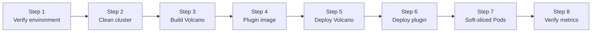

This lab starts from a clean Kubernetes cluster on an Ascend 310P3 aarch64 server and ends with two Pods sharing one physical NPU through `hami-vnpu-core` soft slicing, each locked to its own 8192 MiB memory window and both visible to Prometheus metrics.

Because soft slicing requires [Volcano](https://github.com/volcano-sh/volcano) ≥ 1.16, and no stable 1.16 existed at verification time (latest stable: v1.15.1; only a `1.16.0-alpha.1` chart existed), this lab builds Volcano master from source and deploys the plugin from its official `v1.4.0` image. If a stable Volcano 1.16 chart is published by the time you run this, you can substitute the chart install for Steps 3 and 5 and keep everything else.

:::note About the output blocks

The outputs below were captured from the verified run on 2026-08-14. Node names, IPs, Pod suffixes, and UUIDs are environment-specific; compare the component names, readiness, placement, and measured values.

:::

## What You'll Learn

- compile Volcano on the host and package the binaries into images for containerd;
- pull the plugin image and verify its `libvnpu.so` asset matches your NPU driver;
- configure Volcano's `deviceshare` plugin for HAMi-mode vNPU scheduling with `binpack`;
- switch the plugin to `hamiVnpuCore` globally and `hami-vnpu-core` per node;
- prove in-container memory isolation with `npu-smi`;
- prove binpack sharing by landing two Pods on the same physical card; and
- read per-container vNPU metrics from the plugin's `:9395` endpoint.

## Lab Overview



## Prerequisites

- An aarch64 server with Ascend 310P (or 310P3) NPUs, driver/npu-smi **≥ 25.5**, and [ascend-docker-runtime](https://gitcode.com/Ascend/mind-cluster/tree/master/component/ascend-docker-runtime) installed (soft slicing is ARM-only).
- A Kubernetes ≥ 1.20 cluster on that server using containerd. The verified cluster was a single-node kubeadm cluster (node `aio-node74-arm`, both control-plane and worker) on Kylin Linux Advanced Server V10, Kubernetes v1.28.15, containerd 1.7.1.
- On the host: Go 1.26 (the verified host used `go1.26.2 linux/arm64`), Docker 24 with Buildx (used only to package images; its image store is separate from containerd's), Helm 3, and `ctr` (ships with containerd).
- The files under [`tutorials/labs/examples/13-volcano-ascend-vnpu/`](https://github.com/Project-HAMi/website/tree/master/tutorials/labs/examples/13-volcano-ascend-vnpu). All `tutorials/labs/examples/...` paths in the commands below are relative to the website repository checkout, so run them from its root (Steps 3 and 4 `cd` into the Volcano and plugin sources; come back before applying manifests).

The verified host inventory, for reference:

| Item               | Value                                                               |
| :----------------- | :------------------------------------------------------------------ |
| OS                 | Kylin Linux Advanced Server V10 Lance (aarch64), kernel 4.19.90     |
| NPU                | 2× Ascend 310P3, 21525 MB each (Bus-Id 0000:81:00.0 / 0000:85:00.0) |
| Driver / npu-smi   | 25.5.1                                                              |
| Kubernetes         | v1.28.15 single node, Flannel, containerd 1.7.1                     |
| Go / Docker / Helm | go1.26.2, Docker 24.0.4 + Buildx v0.27.0, Helm v3.9.0               |
| Test image         | `quay.io/ascend/vllm-ascend:v0.18.0-310p`                           |

## Step 1: Verify the Environment

Confirm the driver sees healthy NPUs:

```bash
npu-smi info
```

```text
+--------------------------------------------------------------------------------------------------------+
| npu-smi 25.5.1                                   Version: 25.5.1                                       |
+-------------------------------+-----------------+------------------------------------------------------+
| NPU     Name                  | Health          | Power(W)     Temp(C)           Hugepages-Usage(page) |
| Chip    Device                | Bus-Id          | AICore(%)    Memory-Usage(MB)                        |
+===============================+=================+======================================================+
| 4       310P3                 | OK              | NA           37                0     / 0             |
| 0       0                     | 0000:81:00.0    | 0            1848 / 21525                            |
+===============================+=================+======================================================+
| 5       310P3                 | OK              | NA           40                0     / 0             |
| 0       1                     | 0000:85:00.0    | 0            1849 / 21525                            |
+===============================+----------------=+======================================================+
```

HAMi-core mode requires the node to carry `ascend=on` (the plugin's DaemonSet selects on it). Check the node and its labels, replacing the node name with yours:

```bash
kubectl get nodes -o wide
kubectl get node aio-node74-arm -o jsonpath-as-json='{.metadata.labels}' \
  | python3 -m json.tool | grep -iE "ascend|accelerator|servertype"
```

```text
NAME             STATUS   ROLES                  AGE    VERSION    INTERNAL-IP   OS-IMAGE                                  KERNEL-VERSION                     CONTAINER-RUNTIME
aio-node74-arm   Ready    control-plane,worker   358d   v1.28.15   172.26.1.74   Kylin Linux Advanced Server V10 (Lance)   4.19.90-52.48.v2207.ky10.aarch64   containerd://1.7.1

    "accelerator": "huawei-Ascend310P",
    "ascend": "on",
    "servertype": "Ascend310P-8",
```

If `ascend=on` is missing, add it:

```bash
kubectl label node aio-node74-arm ascend=on --overwrite
```

Finally, confirm containerd has the Ascend runtime handler. Workload Pods will declare `runtimeClassName: ascend`, which routes through it:

```bash
grep -A3 'runtimes.ascend' /etc/containerd/config.toml
```

```text
[plugins."io.containerd.grpc.v1.cri".containerd.runtimes.ascend]
  runtime_type = "io.containerd.runc.v2"
  [plugins."io.containerd.grpc.v1.cri".containerd.runtimes.ascend.options]
    BinaryName = "/usr/local/Ascend/Ascend-Docker-Runtime/ascend-docker-runtime"
```

This configuration is installed with the Ascend driver/container-runtime suite. If it is absent, install ascend-docker-runtime and restart containerd before continuing.

## Step 2: Clean Up Any Existing Deployment

If Volcano or a HAMi Ascend plugin is already installed, remove it so the lab starts from a known state:

```bash
helm uninstall volcano -n volcano-system

kubectl -n kube-system delete ds hami-ascend-device-plugin
kubectl -n kube-system delete cm hami-scheduler-device hami-device-node-config
kubectl delete clusterrole,clusterrolebinding hami-ascend
kubectl -n kube-system delete sa hami-ascend
kubectl delete runtimeclass ascend

rm -rf /usr/local/hami-vnpu-core/containers/*
rm -rf /usr/local/hami-shared-region/*
```

If `volcano-system` sticks in `Terminating` after the uninstall (a known behavior once the admission webhooks are gone), trigger the deletion and clear the finalizer:

```bash
kubectl delete ns volcano-system --wait=false
kubectl get ns volcano-system -o json | python3 -c "
import json,sys
ns = json.load(sys.stdin)
ns['spec']['finalizers'] = []
json.dump(ns, sys.stdout)
" | kubectl replace --raw "/api/v1/namespaces/volcano-system/finalize" -f -
```

Verify nothing remains:

```bash
kubectl get clusterrole,clusterrolebinding,validatingwebhookconfiguration,mutatingwebhookconfiguration,crd 2>&1 \
  | grep -iE "volcano|hami" || echo CLEAN
```

```text
CLEAN
```

## Step 3: Build the Volcano Images from Source

Clone Volcano and check out the verified commit (master at verification time):

```bash
git clone https://github.com/volcano-sh/volcano.git /root/temp/volcano
cd /root/temp/volcano
git checkout 7d9504320533a9f4e9bfbb59f79ec5c53a68f3e8
```

Volcano's official `make images` runs `go mod download` inside a builder container, which is unreliable on restricted networks (timeouts against `proxy.golang.org`, resets even via `goproxy.cn`). This lab instead **compiles on the host**, where the Go module cache is warm, and uses Docker only to package the static binaries:

```bash
make vc-scheduler vc-controller-manager vc-webhook-manager
```

```text
$ ls -lh _output/bin/
total 157M
-rwxr-xr-x 1 root root 51M  vc-controller-manager
-rwxr-xr-x 1 root root 60M  vc-scheduler
-rwxr-xr-x 1 root root 48M  vc-webhook-manager
```

Volcano builds with `CGO_ENABLED=0`, so any base image works. The scheduler and controller-manager need only Alpine plus the binary; the webhook-manager also needs kubectl (its admission-init job generates certificates) and the repo's `gen-admission-secret.sh`:

```bash
cat <<'EOF' | docker buildx build -t volcanosh/vc-scheduler:latest -f - . --load
FROM alpine:3.24.1
COPY _output/bin/vc-scheduler /vc-scheduler
ENTRYPOINT ["/vc-scheduler"]
EOF

cat <<'EOF' | docker buildx build -t volcanosh/vc-controller-manager:latest -f - . --load
FROM alpine:3.24.1
COPY _output/bin/vc-controller-manager /vc-controller-manager
ENTRYPOINT ["/vc-controller-manager"]
EOF

cat <<'EOF' | docker buildx build -t volcanosh/vc-webhook-manager:latest -f - . --load
FROM alpine:3.24.1
RUN apk add --update ca-certificates && \
    apk add --update openssl && \
    apk add --update -t deps curl && \
    curl -L https://dl.k8s.io/release/v1.28.15/bin/linux/arm64/kubectl -o /usr/local/bin/kubectl && \
    chmod +x /usr/local/bin/kubectl && \
    apk del --purge deps && \
    rm /var/cache/apk/*
COPY _output/bin/vc-webhook-manager /vc-webhook-manager
ADD ./installer/dockerfile/webhook-manager/gen-admission-secret.sh /gen-admission-secret.sh
ENTRYPOINT ["/vc-webhook-manager"]
EOF
```

```text
$ docker images --format "{{.Repository}}:{{.Tag}}  {{.Size}}" | grep "volcanosh/vc-.*:latest"
volcanosh/vc-webhook-manager:latest  114MB
volcanosh/vc-controller-manager:latest  61.7MB
volcanosh/vc-scheduler:latest  70.8MB
```

The cluster runs containerd, and Docker's image store is invisible to kubelet, so import all three images into containerd's `k8s.io` namespace:

```bash
for img in vc-scheduler vc-controller-manager vc-webhook-manager; do
  docker save volcanosh/$img:latest | ctr -n k8s.io images import -
done
```

```text
unpacking docker.io/volcanosh/vc-scheduler:latest (sha256:63e40eb5...)...done
unpacking docker.io/volcanosh/vc-controller-manager:latest (sha256:1de7438d...)...done
unpacking docker.io/volcanosh/vc-webhook-manager:latest (sha256:afe553d5...)...done
```

Sanity-check one image (the version is the commit SHA, injected via ldflags):

```bash
docker run --rm volcanosh/vc-scheduler:latest --version
```

```text
API Version: v1alpha1
Version: 7d9504320533a9f4e9bfbb59f79ec5c53a68f3e8
Git SHA: 7d9504320533a9f4e9bfbb59f79ec5c53a68f3e8
Built At: 2026-08-14 15:25:14
Go Version: go1.26.2
```

## Step 4: Get the ascend-device-plugin Image

Pull the official image from [Project-HAMi/ascend-device-plugin](https://github.com/Project-HAMi/ascend-device-plugin) (multi-arch, including arm64) and import it into containerd:

```bash
docker pull projecthami/ascend-device-plugin:v1.4.0
docker save projecthami/ascend-device-plugin:v1.4.0 | ctr -n k8s.io images import -
```

The image bundles the `libvnpu.so` interception library from [Project-HAMi/hami-vnpu-core](https://github.com/Project-HAMi/hami-vnpu-core), built by the plugin's CI in a CANN environment: the plugin copies it onto the host at `/usr/local/hami-vnpu-core/`, and the Ascend runtime injects it into workload containers via `ld.so.preload`. **The library version must match the NPU driver.** A mismatch does not fail loudly; in-container `npu-smi` just hangs forever at `Initialize SchedulerClient...`. During verification, a two-month-old cached `libvnpu` asset produced exactly that failure. If you hit the hang, compare the asset in your image against the image release that matches your driver:

```bash
docker run --rm --entrypoint md5sum projecthami/ascend-device-plugin:v1.4.0 \
  /usr/local/hami-vnpu-core-assets/libvnpu.so
```

## Step 5: Deploy Volcano and Enable HAMi-mode deviceshare

Install Volcano from the local chart. Note the image pull policy key: it is `basic.image_pull_policy` (underscore). Using `scheduler.imagePullPolicy` silently does nothing, and nodes then try to pull images that exist only locally:

```bash
helm install volcano /root/temp/volcano/installer/helm/chart/volcano \
  --namespace volcano-system --create-namespace \
  --set basic.image_pull_policy=IfNotPresent \
  --timeout 300s
```

```text
NAME: volcano
NAMESPACE: volcano-system
STATUS: deployed
REVISION: 1
```

All three components came up on the locally built images:

```bash
kubectl -n volcano-system get pods -o wide
```

```text
NAME                                   READY   STATUS      RESTARTS   AGE   IP            NODE
volcano-admission-5bc7fb6d67-btbfp     1/1     Running     0          20s   10.244.0.86   aio-node74-arm
volcano-admission-init-kgcqb           0/1     Completed   0          25s   10.244.0.84   aio-node74-arm
volcano-controllers-557bd8d995-tz4st   1/1     Running     0          20s   10.244.0.85   aio-node74-arm
volcano-scheduler-ff5d85ffb-k7slw      1/1     Running     0          20s   10.244.0.87   aio-node74-arm
```

Now point the scheduler's `deviceshare` plugin at the HAMi vNPU geometries. Run the manifest commands from the website repository root (the example paths are relative to it):

```bash
kubectl apply -f tutorials/labs/examples/13-volcano-ascend-vnpu/01-volcano-scheduler-configmap.yaml
kubectl -n volcano-system rollout restart deploy volcano-scheduler
```

The applied `volcano-scheduler.conf` keeps Volcano's standard plugin tiers and adds the HAMi-mode arguments to `deviceshare`:

```yaml
actions: "enqueue, allocate, backfill"
tiers:
  - plugins:
      - name: priority
      - name: gang
        enablePreemptable: false
      - name: conformance
  - plugins:
      - name: overcommit
      - name: drf
        enablePreemptable: false
      - name: predicates
      - name: deviceshare
        arguments:
          deviceshare.AscendHAMiVNPUEnable: "true"
          deviceshare.SchedulePolicy: binpack
          deviceshare.KnownGeometriesCMNamespace: kube-system
          deviceshare.KnownGeometriesCMName: hami-scheduler-device
      - name: proportion
      - name: nodeorder
      - name: binpack
```

Verify the scheduler loaded the new configuration:

```bash
kubectl -n volcano-system logs deploy/volcano-scheduler | grep -A4 "name: deviceshare"
```

```text
I0814 07:40:47.668217     1 scheduler.go:160]       - name: deviceshare
I0814 07:40:47.668222     1 scheduler.go:160]           deviceshare.AscendHAMiVNPUEnable: "true"
I0814 07:40:47.668225     1 scheduler.go:160]           deviceshare.SchedulePolicy: binpack
I0814 07:40:47.668230     1 scheduler.go:160]           deviceshare.KnownGeometriesCMNamespace: kube-system
```

If you also run Volcano vGPU (NVIDIA) in the same cluster, merge both geometry ConfigMaps into one and point `KnownGeometriesCMName` at the merged ConfigMap, because volcano-vgpu uses its own.

## Step 6: Deploy the Plugin in hami-core Mode

Apply the RuntimeClass from the plugin repository, then the device config with `hamiVnpuCore` switched on (the template ships with `false`):

```bash
kubectl apply -f https://raw.githubusercontent.com/Project-HAMi/ascend-device-plugin/v1.4.0/ascend-runtimeclass.yaml

curl -s https://raw.githubusercontent.com/Project-HAMi/ascend-device-plugin/v1.4.0/ascend-device-configmap.yaml \
  | sed 's/hamiVnpuCore: false/hamiVnpuCore: true/' | kubectl apply -f -
```

```text
runtimeclass.node.k8s.io/ascend created
configmap/hami-scheduler-device created
```

The 310P3 entry of the ConfigMap is what matches your Pod resources to the hardware (each card: `memoryAllocatable: 21527` MB, 8 AI cores; the smallest template `vir01` reserves 3072 MB):

```yaml
vnpus:
  hamiVnpuCore: true
  configs:
    - chipName: 310P3
      commonWord: Ascend310P
      resourceName: huawei.com/Ascend310P
      resourceMemoryName: huawei.com/Ascend310P-memory
      memoryAllocatable: 21527
      memoryCapacity: 24576
      aiCore: 8
      aiCPU: 7
```

Next, the per-node override. `vDeviceCount` caps the vNPU count per physical card, and the plugin honors it directly (support landed in [ascend-device-plugin PR #100](https://github.com/Project-HAMi/ascend-device-plugin/pull/100)); `7` matches the capacity verified below:

```bash
kubectl apply -f tutorials/labs/examples/13-volcano-ascend-vnpu/02-hami-device-node-config.yaml
```

```yaml
apiVersion: v1
kind: ConfigMap
metadata:
  labels:
    app.kubernetes.io/component: hami-scheduler
    app.kubernetes.io/name: hami
    app.kubernetes.io/instance: hami
  name: hami-device-node-config
  namespace: kube-system
data:
  node-config.yaml: |-
    nodes:
      - name: "aio-node74-arm"
        hami-vnpu-core: true
        vDeviceCount: 7
        filterDevices:
          index: []
          uuid: []
```

Replace `aio-node74-arm` with your node name. Finally, apply the RBAC and DaemonSet (the manifest uses `projecthami/ascend-device-plugin:v1.4.0` with `imagePullPolicy: IfNotPresent`, so it runs the image imported in Step 4):

```bash
kubectl apply -f https://raw.githubusercontent.com/Project-HAMi/ascend-device-plugin/v1.4.0/ascend-device-plugin.yaml
```

```text
clusterrole.rbac.authorization.k8s.io/hami-ascend created
clusterrolebinding.rbac.authorization.k8s.io/hami-ascend created
serviceaccount/hami-ascend created
daemonset.apps/hami-ascend-device-plugin created
```

:::important Apply the full manifest file

Apply the complete `ascend-device-plugin.yaml` in one shot. Truncating the manifest (for example, copying only the DaemonSet portion) breaks selector/label matching and produces confusing apply errors.

:::

Wait for the plugin, then check its logs for the three markers of a healthy HAMi-core start: the node config matched, the metrics server started, and the host assets written:

```bash
kubectl -n kube-system get pods -o wide | grep ascend
kubectl -n kube-system logs ds/hami-ascend-device-plugin | grep -iE "matched|libvnpu|metrics|config file"
```

```text
hami-ascend-device-plugin-lnd4c   1/1   Running   0   20s   10.244.0.89   aio-node74-arm

I0814 07:47:39.795228       1 main.go:124] using config file: /device-config.yaml
I0814 07:47:40.290044       1 manager.go:72] Successfully matched node config for aio-node74-arm: {Name:aio-node74-arm HamiVnpuCore:true VDeviceCount:7}
I0814 07:47:40.391244       1 metrics.go:27] vNPU monitor metrics server starting on :9395
I0814 07:47:40.396783       1 server.go:192] ✓ Copied /usr/local/hami-vnpu-core-assets/libvnpu.so -> /usr/local/hami-vnpu-core/libvnpu.so
I0814 07:47:40.396900       1 server.go:180] ✓ /usr/local/hami-vnpu-core/ld.so.preload already up-to-date, skipping
```

The node should now advertise the Ascend extended resources: 2 cards × 7 vNPUs = 14, and 2 × 21527 MiB:

```bash
kubectl describe node aio-node74-arm | grep huawei.com/Ascend310P
```

```text
  huawei.com/Ascend310P:         14
  huawei.com/Ascend310P-memory:  43054
```

The registered memory follows the chip config's `memoryAllocatable` of 21527 MB per card, 2 MiB per card above the 21525 MB `npu-smi` displays in Step 1, hence 43054 rather than 43050.

## Step 7: Run Soft-Sliced Pods and Verify

Deploy the first test Pod, which requests one vNPU with an 8192 MiB memory slice:

```bash
kubectl apply -f tutorials/labs/examples/13-volcano-ascend-vnpu/03-ascend-vnpu-check.yaml
kubectl wait --for=condition=Ready pod/ascend-vnpu-check --timeout=5m
kubectl get pod ascend-vnpu-check -o wide
```

The manifest's four essential switches:

```yaml
apiVersion: v1
kind: Pod
metadata:
  name: ascend-vnpu-check
  annotations:
    huawei.com/vnpu-mode: hami-core
spec:
  schedulerName: volcano
  runtimeClassName: ascend
  containers:
    - name: npu
      image: quay.io/ascend/vllm-ascend:v0.18.0-310p
      command: ["sleep", "infinity"]
      resources:
        limits:
          huawei.com/Ascend310P: "1"
          huawei.com/Ascend310P-memory: "8192"
```

`schedulerName: volcano` routes scheduling through `deviceshare`, `runtimeClassName: ascend` routes device injection through the Ascend runtime, the `huawei.com/vnpu-mode: hami-core` annotation selects soft slicing (without it, the Pod uses the template path and can stay Pending), and the two limits define the slice size.

```text
NAME                READY   STATUS    RESTARTS   AGE   IP            NODE
ascend-vnpu-check   1/1     Running   0          30s   10.244.0.90   aio-node74-arm
```

The scheduling annotations record what Volcano allocated:

```bash
kubectl get pod ascend-vnpu-check -o jsonpath-as-json='{.metadata.annotations}' \
  | python3 -m json.tool | grep -iE "ascend|vnpu|bind"
```

```text
"hami.io/Ascend310P-devices-allocated": "68496E64-20E05477-92C31323-6E78030A-BD003019,Ascend310P,8192,0:;",
"hami.io/bind-phase": "success",
"huawei.com/Ascend310P": "[{\"UUID\":\"68496E64-...\",\"memory\":8192}]",
"huawei.com/vnpu-mode": "hami-core",
```

### The container sees only its slice

Run `npu-smi` inside the Pod and compare with the host view from Step 1 (`1848 / 21525` on the same card):

```bash
kubectl exec ascend-vnpu-check -- npu-smi info
```

```text
[INFO limiter::supervisor] [Supervisor PID:10] won manager election
[INFO limiter::manager] [Manager] Registered as Global Manager #0 (PID: 10). Compute limit: 1, Memory limit: 8192, FixedShare: false
open global registry path is "/hami-shared-region/0_global_registry"
[Global] Global Registry not exist, now creating...
connect to global registry
+--------------------------------------------------------------------------------------------------------+
| npu-smi 25.5.1                                   Version: 25.5.1                                       |
+-------------------------------+-----------------+------------------------------------------------------+
| NPU     Name                  | Health          | Power(W)     Temp(C)           Hugepages-Usage(page) |
| Chip    Device                | Bus-Id          | AICore(%)    Memory-Usage(MB)                        |
+===============================+=================+======================================================+
| 32768   310P3                 | OK              | NA           38                0     / 0             |
| 0       0                     | 0000:81:00.0    | 0            0    / 8192                             |
+===============================+=================+======================================================+
```

The container sees `0 / 8192` MB: this is the memory window `libvnpu.so` enforces, not the physical card's 21525 MB. The injected environment variables confirm the wiring (`crictl ps` to find the container ID first):

```bash
crictl exec <CID> env | grep -E "NPU_|ASCEND_VIS"
```

```text
ASCEND_VISIBLE_DEVICES=0
NPU_LOCAL_SHM_PATH=/hami-vnpu-shmem/vnpu_local_shmem
NPU_GLOBAL_SHM_PATH=/hami-shared-region/0_global_registry
NPU_MEM_QUOTA=8192
```

### binpack shares one card between Pods

Launch a second Pod with an identical spec (`04-ascend-vnpu-check-2.yaml`):

```bash
kubectl apply -f tutorials/labs/examples/13-volcano-ascend-vnpu/04-ascend-vnpu-check-2.yaml
kubectl wait --for=condition=Ready pod/ascend-vnpu-check-2 --timeout=5m
kubectl exec ascend-vnpu-check-2 -- npu-smi info | grep -E "Memory limit|0000"
```

```text
[INFO limiter::manager] [Manager] Registered as Global Manager #1 (PID: 10). Compute limit: 1, Memory limit: 8192, FixedShare: false
| 0       0                     | 0000:81:00.0    | 0            0    / 8192                             |
```

Both Pods report Bus-Id `0000:81:00.0` (the **same physical card**), each with an independent 8192 MiB window. The `Global Manager #0` / `#1` lines show both containers registered into one shared registry, so HAMi-core coordinates their compute scheduling across the card. Check the node's accounting:

```bash
kubectl describe node aio-node74-arm | grep huawei.com/Ascend310P
```

```text
  huawei.com/Ascend310P:         14
  huawei.com/Ascend310P-memory:  43054
  huawei.com/Ascend310P          2            2
  huawei.com/Ascend310P-memory   16384        16384
```

Two vNPUs and 2 × 8192 = 16384 MiB allocated. A third Pod of the same size still fits on the card (3 × 8192 < 21527); scale the count until the total would exceed `memoryAllocatable`, and the extra Pods stay Pending until capacity frees, because binpack tries to fill one card before touching the second.

## Step 8: Verify the vNPU Metrics

The metrics endpoint lives on the **device-plugin Pod** (port 9395), not on workload Pods. Query it by label:

```bash
PLUGIN_IP=$(kubectl -n kube-system get pod \
  -l app.kubernetes.io/component=hami-ascend-device-plugin \
  -o jsonpath='{.items[0].status.podIP}')
curl -s "$PLUGIN_IP":9395/metrics | grep -E "^hami"
```

```text
hami_container_device_utilization_ratio{container="npu",device_uuid="68496E64-...",namespace="default",pod="ascend-vnpu-check",vdevice_index="0"} 0
hami_container_device_utilization_ratio{container="npu",device_uuid="68496E64-...",namespace="default",pod="ascend-vnpu-check-2",vdevice_index="0"} 0
hami_host_gpu_memory_used_bytes{device_index="0",device_type="Ascend-Atlas 300I Pro",device_uuid="68496E64-..."} 1.937768448e+09
hami_host_gpu_memory_used_bytes{device_index="1",device_type="Ascend-Atlas 300I Pro",device_uuid="D8496E64-..."} 1.938817024e+09
hami_vgpu_memory_limit_bytes{container="npu",...,pod="ascend-vnpu-check",vdevice_index="0"} 8.589934592e+09
hami_vgpu_memory_limit_bytes{container="npu",...,pod="ascend-vnpu-check-2",vdevice_index="0"} 8.589934592e+09
```

Read the numbers:

- `hami_vgpu_memory_limit_bytes = 8.589934592e+09` bytes = exactly 8192 MiB, matching both Pods' requests;
- both vdevice series share the UUID of physical card 0, confirming the binpack placement from Step 7;
- `hami_host_gpu_memory_used_bytes` reports per-card host usage (~1.9 GB of driver overhead on each idle card);
- utilization gauges are `0` because the Pods only `sleep`.

The endpoint also exports `hami_vgpu_memory_used_bytes` plus the buffer/context/module breakdowns, and `hami_host_gpu_utilization_ratio`. Alternatively, port-forward instead of addressing the Pod IP directly:

```bash
PLUGIN_POD=$(kubectl -n kube-system get pod \
  -l app.kubernetes.io/component=hami-ascend-device-plugin \
  -o jsonpath='{.items[0].metadata.name}')
kubectl -n kube-system port-forward "pod/$PLUGIN_POD" 9395:9395 &
curl -s http://localhost:9395/metrics
```

## Troubleshooting

| Symptom | Cause in the verified environment | Action |
| :-- | :-- | :-- |
| In-container `npu-smi info` hangs at `Initialize SchedulerClient...` | `libvnpu.so` version does not match the NPU driver (stale asset source image) | Use an image whose `libvnpu.so` asset comes from the release matching your driver (verify the md5); restart the plugin so the host copy refreshes |
| Pod fails with `ErrImageNeverPull` | Docker and containerd image stores are separate | `docker save  \| ctr -n k8s.io images import -` |
| Node still tries to pull local-only images | Wrong Helm key for pull policy | Use `basic.image_pull_policy` (underscore) |
| `volcano-system` stuck `Terminating` after uninstall | Namespace finalizer not released once webhooks are gone | Clear the finalizer via the `finalize` subresource (Step 2) |
| `kubectl apply` of a hand-copied DaemonSet fails on selectors | Manifest was truncated when copied | Apply the complete repo manifest; use `sed` only for the image tag |
| `curl :9395` from the workload Pod returns nothing | Metrics are served by the plugin DaemonSet, not workloads | Select the plugin Pod by label (Step 8) |
| `go mod download` fails inside `make images` | Container-side downloads time out on restricted networks | Compile on the host; let Docker only package binaries |
| Pod allocation fails with `cannot patch resource "pods"` | ClusterRole lost `pods` `patch`/`update` permission | Keep the repo's RBAC verbatim; the plugin must erase allocation annotations on the Pod |

:::note Three facts that prevent confusion

- **`-core` is not registered.** v1.4.0 does not report `huawei.com/Ascend310P-core` as a node resource; the `resourceCoreName` entry in the config is not uploaded. Pod specs need only the card count and memory MiB.
- **`libvnpu.so`, not `libvgpu.so`.** HAMi's NVIDIA interception library is `libvgpu.so`; the Ascend HAMi-core library is `libvnpu.so`, injected through `/etc/ld.so.preload` with host assets under `/usr/local/hami-vnpu-core/`.
- **Resource names come from `commonWord`.** The chip is `310P3`, but the Kubernetes resource is `huawei.com/Ascend310P`; request `huawei.com/Ascend310P3` or `huawei.com/Ascend` and the Pod stays Pending.

:::

## Cleanup

Remove the test Pods:

```bash
kubectl delete pod ascend-vnpu-check ascend-vnpu-check-2
```

Remove the plugin and its resources:

```bash
kubectl -n kube-system delete ds hami-ascend-device-plugin
kubectl -n kube-system delete cm hami-scheduler-device hami-device-node-config
kubectl delete clusterrole,clusterrolebinding hami-ascend
kubectl -n kube-system delete sa hami-ascend
kubectl delete runtimeclass ascend
rm -rf /usr/local/hami-vnpu-core/containers/* /usr/local/hami-shared-region/*
```

Uninstall Volcano (clear the namespace finalizer if it hangs, as in Step 2):

```bash
helm uninstall volcano -n volcano-system
```

The Volcano images remain in Docker and containerd; remove them if you no longer need them, together with the plugin image:

```bash
for img in vc-scheduler vc-controller-manager vc-webhook-manager; do
  docker rmi volcanosh/$img:latest
  ctr -n k8s.io images remove docker.io/volcanosh/$img:latest
done
docker rmi projecthami/ascend-device-plugin:v1.4.0
ctr -n k8s.io images remove docker.io/projecthami/ascend-device-plugin:v1.4.0
```

## What This Lab Proved

| Claim | Evidence |
| :-- | :-- |
| Volcano schedules vNPUs in HAMi mode from source-built images | 3 components Running; scheduler log shows `AscendHAMiVNPUEnable: "true"` |
| The plugin advertises soft-sliced capacity | Node reports `Ascend310P: 14`, `Ascend310P-memory: 43054` |
| The container's memory view is capped, not just scheduled | In-container `npu-smi` shows `0 / 8192`; host shows `1848 / 21525` |
| Each container receives its own quota | `NPU_MEM_QUOTA=8192` injected; both Pods report `Memory limit: 8192` |
| binpack packs multiple vNPUs onto one card | Both Pods on Bus-Id `0000:81:00.0`; node allocates 2 vNPU / 16384 MiB |
| Slices coordinate through one registry | `Global Manager #0` and `#1` in `/hami-shared-region/0_global_registry` |
| The stack is observable | `:9395` exports per-container limits of exactly 8192 MiB |

One honest limit: the test Pods only `sleep`, so this lab proves that the quota is delivered, applied per container, and visible inside the container. It does not exercise an over-quota allocation. To prove that an allocation beyond the slice fails, run a real memory-allocating workload (for example vLLM with a memory setting above 8192 MiB) as an extension; [Lab 12](./kai-scheduler-hami-gke.md) shows the equivalent proof on GPUs with an over-quota `cudaMalloc`.

## Next Steps

- Read [Soft-Slicing Ascend vNPU with Volcano and HAMi-core](/blog/volcano-ascend-vnpu-soft-slicing) for the architecture background and the two Volcano vNPU modes.
- Compare with [Lab 8: Volcano vGPU with Gang Scheduling and Queues](./volcano-vgpu-gang-queue.md), the same scheduler on NVIDIA GPUs.
- Wrap the test Pod into a Volcano `VCJob` (`tasks[].template`) to add gang scheduling and queues on top of soft slicing.
- Consult the [Ascend-in-Volcano user guide](/docs/installation/how-to-use-volcano-ascend) and the upstream [ascend-device-plugin Volcano guide](https://github.com/Project-HAMi/ascend-device-plugin/blob/main/docs/volcano.md).
