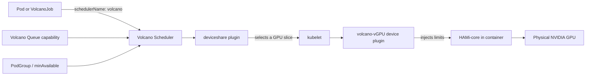

This lab combines two capabilities that commonly appear together in AI infrastructure:

- Volcano vGPU and HAMi-core share one physical NVIDIA GPU and expose per-container memory and compute limits.
- Volcano Scheduler adds batch scheduling semantics, including Gang scheduling and queue-level resource limits.

You will first verify a single vGPU Pod, then run a two-worker VolcanoJob, deliberately create a Gang scheduling failure, and finally prove that a Queue can cap vGPU resources even when the node itself still has enough capacity.

The captured outputs in this lab come from a single-node cluster with one NVIDIA GeForce RTX 3070 Ti (8 GiB), NVIDIA driver 580.159.03, Volcano Scheduler, and the Volcano vGPU device plugin in HAMi-core mode. Resource values on other GPUs will differ.

:::important

This lab uses the **Volcano vGPU path**, not a standard HAMi Helm installation. Do not install the standard HAMi device plugin on the same GPU node. One GPU node should be managed by one device-plugin path at a time.

:::

## What You'll Learn

After completing this lab, you will be able to:

- distinguish standard HAMi resources from Volcano vGPU resources;
- enable Volcano's `deviceshare` plugin for vGPU scheduling;
- register `volcano.sh/vgpu-*` resources on a GPU node;
- verify that HAMi-core injects a memory and compute limit into a container;
- use `minAvailable` to give a VolcanoJob Gang scheduling semantics;
- recognize the expected `Inqueue` state when a Gang cannot fit;
- set a Queue `capability` for vGPU number, memory, and cores; and
- separate a queue-limit failure from a node-capacity failure.

## Standard HAMi vs. Volcano vGPU

Both paths use HAMi-core for userspace GPU isolation, but they use different schedulers, device plugins, and resource names.

| Path | Scheduler and device plugin | Pod resources |
| --- | --- | --- |
| Standard HAMi | HAMi scheduler, webhook, and HAMi device plugin | `nvidia.com/gpu`, `nvidia.com/gpumem`, `nvidia.com/gpucores` |
| Volcano vGPU | Volcano Scheduler, `deviceshare`, and `volcano-vgpu-device-plugin` | `volcano.sh/vgpu-number`, `volcano.sh/vgpu-memory`, `volcano.sh/vgpu-cores` |

In this lab every Pod and VolcanoJob sets:

```yaml
schedulerName: volcano
```

and requests only `volcano.sh/vgpu-*` resources. Do not mix the two resource models in one workload.

## Architecture



Volcano Scheduler decides whether and where the workload can run. The device plugin registers vGPU resources and performs allocation. HAMi-core enforces the container-visible GPU memory and compute settings. Queue and Gang constraints are evaluated by the scheduler; they do not replace the per-container `resources.limits` block.

## Lab Overview

| Step | Goal | Success evidence |
| --- | --- | --- |
| 1. Record the baseline | Confirm the cluster, GPU runtime, and Volcano are healthy | Node `Ready`, host `nvidia-smi` works, Volcano Pods run |
| 2. Enable vGPU scheduling | Configure the `deviceshare` scheduler plugin | Scheduler rollout succeeds |
| 3. Install the device plugin | Register Volcano vGPU extended resources | Node shows `volcano.sh/vgpu-*` capacity |
| 4. Test one Pod | Verify allocation and HAMi-core injection | Environment has 2000 MiB/30% limits; `nvidia-smi` shows 2000 MiB |
| 5. Test a Gang | Start two workers as one group | VolcanoJob and PodGroup are `Running`; both workers run |
| 6. Exhaust the GPU | Request more than one card can provide to the full Gang | PodGroup remains `Inqueue` with `NotEnoughResources` |
| 7. Limit a Queue | Compare a Job below and above Queue capability | Fit Job runs; over-cap Job stays `Pending` while the node has capacity |

## Prerequisites

- Kubernetes 1.16 or later with a healthy NVIDIA GPU node.
- NVIDIA driver newer than 440; `nvidia-smi` must work on the host.
- NVIDIA container runtime configured as the default runtime.
- Volcano 1.9 through 1.15 installed. The pinned vGPU plugin used here is v1.11.0; the project's compatibility matrix lists v1.12.0 and earlier with Volcano 1.15.0 and earlier.
- `kubectl` access with permission to edit the Volcano scheduler ConfigMap, create cluster-scoped Queue resources, and install a DaemonSet in `kube-system`.
- The manifests from [`tutorials/labs/examples/08-volcano-vgpu/`](https://github.com/Project-HAMi/website/tree/master/tutorials/labs/examples/08-volcano-vgpu/).

:::warning Device-plugin exclusivity

Do not continue if another component already owns the same GPU node, for example the NVIDIA device plugin, the standard HAMi device plugin, or a second Volcano vGPU device plugin. Multiple plugins can register conflicting resources and make the results impossible to interpret.

:::

The resource values below are chosen for an 8 GiB card:

- the successful Gang requests `2 × 2000 MiB = 4000 MiB`;
- the insufficient Gang requests `2 × 6000 MiB = 12000 MiB`;
- the Queue cap is 4000 MiB; and
- the Queue-negative Job requests 6000 MiB, which is above the Queue cap but below the empty node's roughly 8192 MiB capacity.

If your GPU has a different memory size, preserve those relationships when adjusting the manifests.

## Step 1: Record the Baseline

Set the node name once:

```bash
export NODE_NAME=$(kubectl get nodes -o jsonpath='{.items[0].metadata.name}')
echo "NODE_NAME=${NODE_NAME}"
```

Check Kubernetes and the node:

```bash
kubectl version
kubectl get node "${NODE_NAME}" -o wide
```

Confirm the host driver is healthy:

```bash
nvidia-smi
```

Confirm Volcano's control plane and default Queue:

```bash
kubectl get pods -n volcano-system
kubectl get queue
```

You should see the Volcano admission controller, controllers, scheduler, and a `default` Queue. Volcano automatically assigns Jobs without an explicit Queue to `default`, but this lab always writes the Queue name so the scheduling path is obvious.

Record the exact component versions for reproducibility:

```bash
kubectl -n volcano-system get deploy volcano-scheduler \
  -o jsonpath='{.spec.template.spec.containers[*].image}'; echo

kubectl -n kube-system get daemonset \
  -o custom-columns=NAME:.metadata.name,IMAGES:.spec.template.spec.containers[*].image
```

Inspect existing GPU device plugins:

```bash
kubectl -n kube-system get daemonset | grep -Ei 'nvidia|hami|volcano' || true
```

If an NVIDIA or standard HAMi device plugin is already managing this node, use a fresh cluster or remove that plugin according to its own uninstall procedure before continuing.

Create the lab namespace:

```bash
kubectl create namespace volcano-demo
```

## Step 2: Enable Volcano vGPU Scheduling

Back up the current scheduler configuration before editing it:

```bash
kubectl get configmap volcano-scheduler-configmap -n volcano-system -o yaml \
  > /tmp/volcano-scheduler-configmap.before-vgpu.yaml
```

Open the ConfigMap:

```bash
kubectl edit configmap volcano-scheduler-configmap -n volcano-system
```

Ensure that the second scheduler tier includes `deviceshare` with vGPU enabled:

```yaml
data:
  volcano-scheduler.conf: |
    actions: "enqueue, allocate, backfill"
    tiers:
    - plugins:
      - name: priority
      - name: gang
      - name: conformance
    - plugins:
      - name: drf
      - name: deviceshare
        arguments:
          deviceshare.VGPUEnable: true
          deviceshare.SchedulePolicy: binpack
      - name: predicates
      - name: proportion
      - name: nodeorder
      - name: binpack
```

`deviceshare.VGPUEnable` activates Volcano vGPU scheduling. `binpack` prefers to consolidate slices; on this single-GPU node the placement result is deterministic either way.

Restart and verify the scheduler:

```bash
kubectl rollout restart deployment/volcano-scheduler -n volcano-system
kubectl rollout status deployment/volcano-scheduler -n volcano-system --timeout=120s
kubectl get pods -n volcano-system
```

Do not continue until the scheduler is `Running` and the rollout succeeds.

## Step 3: Install the Volcano vGPU Device Plugin

Install the pinned v1.11.0 manifest:

```bash
kubectl apply -f \
  https://raw.githubusercontent.com/Project-HAMi/volcano-vgpu-device-plugin/v1.11.0/volcano-vgpu-device-plugin.yml
```

The unversioned URL used by older tutorials is no longer present on `main`; pinning the released manifest prevents a future repository layout change from breaking the lab.

Wait for the DaemonSet:

```bash
kubectl rollout status daemonset/volcano-device-plugin \
  -n kube-system --timeout=180s

kubectl get daemonset -n kube-system | grep volcano
kubectl get pods -n kube-system -o wide | grep volcano-device-plugin
```

Verify the image is the expected version:

```bash
kubectl get daemonset volcano-device-plugin -n kube-system \
  -o jsonpath='{.spec.template.spec.containers[*].image}'; echo
```

Now inspect the resources registered on the node:

```bash
kubectl get node "${NODE_NAME}" \
  -o custom-columns='NAME:.metadata.name,NUMBER:.status.allocatable.volcano\.sh/vgpu-number,MEMORY:.status.allocatable.volcano\.sh/vgpu-memory,CORES:.status.allocatable.volcano\.sh/vgpu-cores'
```

Captured output on the 8 GiB RTX 3070 Ti was equivalent to:

```text
NAME        NUMBER   MEMORY   CORES
master-01   10       8192     100
```

Interpret the values carefully:

- `vgpu-number: 10` does not mean ten physical GPUs. It is the number of schedulable vGPU shares exposed for the card.
- `vgpu-memory` is in MiB and reflects the card memory registered by the plugin.
- `vgpu-cores` is the compute capacity available for allocation.

Use the values registered by your own node when sizing the later negative tests.

## Step 4: Verify a Single vGPU Pod

Review the key fields in `01-single-pod.yaml`:

```yaml
spec:
  schedulerName: volcano
  containers:
    - name: cuda
      resources:
        limits:
          volcano.sh/vgpu-number: 1
          volcano.sh/vgpu-memory: 2000
          volcano.sh/vgpu-cores: 30
```

Create the Pod and wait for it to become ready:

```bash
kubectl apply -f tutorials/labs/examples/08-volcano-vgpu/01-single-pod.yaml
kubectl wait -n volcano-demo --for=condition=Ready \
  pod/volcano-vgpu-single --timeout=180s
```

Inspect the injected environment:

```bash
kubectl exec -n volcano-demo volcano-vgpu-single -- \
  env | grep -E 'CUDA_DEVICE|NVIDIA_VISIBLE_DEVICES|VGPU|VOLCANO'
```

Captured output:

```text
CUDA_DEVICE_MEMORY_LIMIT_0=2000m
CUDA_DEVICE_SM_LIMIT=30
CUDA_DEVICE_MEMORY_SHARED_CACHE=/tmp/vgpu/6446d246-5917-419d-bdc3-1a119044f857.cache
```

The first two values match the requested 2000 MiB memory and 30% compute limits.

Inspect the GPU view inside the container:

```bash
kubectl exec -n volcano-demo volcano-vgpu-single -- nvidia-smi
```

Relevant captured output:

```text
[HAMI-core Msg(...:libvgpu.c:870)]: Initializing.....
|   0  NVIDIA GeForce RTX 3070 Ti ... |       0MiB /   2000MiB |      0%      Default |
```

The HAMi-core initialization message and the 2000 MiB total show that the vGPU settings reached the container and changed its GPU view.

:::note Scope of this proof

This step proves allocation and limit injection. It does not run a CUDA allocator past the limit, so it does not independently prove the OOM enforcement boundary. See Lab 3 or Lab 7 for that stronger isolation test.

:::

Delete the Pod before the Gang tests so it does not consume part of the memory baseline:

```bash
kubectl delete pod volcano-vgpu-single -n volcano-demo
```

## Step 5: Run a Two-Worker Gang

The successful VolcanoJob creates two workers. Each requests one vGPU share, 2000 MiB, and 30% cores. The complete Gang therefore needs 4000 MiB and 60% cores.

The two fields that create the Gang contract are:

```yaml
spec:
  schedulerName: volcano
  queue: default
  minAvailable: 2
  tasks:
    - name: vgpu-worker
      replicas: 2
```

Create the Job:

```bash
kubectl apply -f tutorials/labs/examples/08-volcano-vgpu/02-gang-job.yaml
```

Inspect the Job, generated PodGroup, and Pods:

```bash
kubectl get vcjob,podgroup,pod -n volcano-demo
```

Captured output:

```text
NAME                                      STATUS    MINAVAILABLE   RUNNINGS
job.batch.volcano.sh/vcjob-vgpu-gang     Running   2              2

NAME                                                        STATUS    MINMEMBER   RUNNINGS
podgroup.scheduling.volcano.sh/vcjob-vgpu-gang-...          Running   2           2

NAME                                    READY   STATUS
pod/vcjob-vgpu-gang-vgpu-worker-0       1/1     Running
pod/vcjob-vgpu-gang-vgpu-worker-1       1/1     Running
```

`MINAVAILABLE=2`, `RUNNINGS=2`, and both workers in `Running` show that the complete Gang fit and was admitted.

Check one worker's GPU view:

```bash
kubectl exec -n volcano-demo vcjob-vgpu-gang-vgpu-worker-0 -- nvidia-smi
```

The captured worker output again reported a 2000 MiB GPU slice and HAMi-core initialization.

Delete the successful Job before creating the insufficient case:

```bash
kubectl delete vcjob vcjob-vgpu-gang -n volcano-demo
kubectl wait -n volcano-demo --for=delete pod \
  -l volcano.sh/job-name=vcjob-vgpu-gang --timeout=120s || true
```

## Step 6: Prove Gang Scheduling Blocks a Partial Start

The next Job still needs two workers, but each asks for 6000 MiB. On an empty 8 GiB node, one worker can fit and two workers cannot:

```text
one worker:   6000 MiB <= 8192 MiB
full Gang:   12000 MiB > 8192 MiB
```

Create it:

```bash
kubectl apply -f tutorials/labs/examples/08-volcano-vgpu/03-gang-insufficient.yaml
sleep 15
kubectl get vcjob,podgroup,pod -n volcano-demo
```

The generated PodGroup should remain `Inqueue` and both Pods should remain `Pending`.

Get the PodGroup name and inspect its conditions:

```bash
export PG_NAME=$(kubectl get podgroup -n volcano-demo \
  -o jsonpath='{.items[0].metadata.name}')

kubectl describe podgroup "${PG_NAME}" -n volcano-demo
```

Relevant captured condition:

```text
Message: 1/2 tasks in gang unschedulable: pod group is not ready,
         2 Pending, 2 minAvailable; Pending: 1 Schedulable, 1 Unschedulable
Reason:  NotEnoughResources
Type:    Unschedulable
Phase:   Inqueue
```

The key evidence is `1 Schedulable, 1 Unschedulable` together with `minAvailable: 2`: Volcano could place one worker in isolation, but it did not partially start the Job because the whole two-member Gang could not fit.

Delete the negative case before testing Queue capability:

```bash
kubectl delete vcjob vcjob-vgpu-gang-insufficient -n volcano-demo
```

Confirm that no lab Pod is still holding vGPU resources:

```bash
kubectl get pods -n volcano-demo
```

## Step 7: Enforce a Queue-Level vGPU Limit

This step deliberately separates Queue capacity from node capacity. The node must be empty before you begin.

Create a Queue capped at two vGPU shares, 4000 MiB, and 60% cores:

```bash
kubectl apply -f tutorials/labs/examples/08-volcano-vgpu/04-queue.yaml
kubectl get queue gpu-small-queue -o yaml
```

The relevant capability is:

```yaml
capability:
  volcano.sh/vgpu-number: "2"
  volcano.sh/vgpu-memory: "4000"
  volcano.sh/vgpu-cores: "60"
```

Queue `capability` is a hard upper bound for total resource use by Jobs in the Queue. It does not allocate a GPU by itself; each worker still needs its own `resources.limits`.

### A Job Within the Queue Capability

The fit Job requests two workers at 1000 MiB and 30% cores each, for a total of 2000 MiB and 60% cores:

```bash
kubectl apply -f tutorials/labs/examples/08-volcano-vgpu/05-queue-fit-job.yaml
kubectl get vcjob,podgroup,pod -n volcano-demo
```

Both workers should reach `Running` because the total request does not exceed the Queue capability.

Delete the fit Job and wait for its resources to be released:

```bash
kubectl delete vcjob vcjob-vgpu-queue-fit -n volcano-demo
kubectl wait -n volcano-demo --for=delete pod \
  -l volcano.sh/job-name=vcjob-vgpu-queue-fit --timeout=120s || true
```

### A Job Above the Queue Capability

The over-cap Job requests two workers at 3000 MiB each:

```text
Job total:       6000 MiB
Queue cap:       4000 MiB
Empty node:   about 8192 MiB
```

The Job is small enough for the empty node, but too large for `gpu-small-queue`.

Create it:

```bash
kubectl apply -f tutorials/labs/examples/08-volcano-vgpu/06-queue-exceeds-job.yaml
sleep 15
kubectl get vcjob,podgroup,pod -n volcano-demo
```

Captured result:

```text
NAME                                             READY   STATUS
vcjob-vgpu-queue-exceeds-vgpu-worker-0           0/1     Pending
vcjob-vgpu-queue-exceeds-vgpu-worker-1           0/1     Pending

NAME                                             STATUS    MINMEMBER
vcjob-vgpu-queue-exceeds-...                     Inqueue   2
```

Inspect the PodGroup and Queue:

```bash
export PG_NAME=$(kubectl get podgroup -n volcano-demo \
  -o jsonpath='{.items[0].metadata.name}')

kubectl describe podgroup "${PG_NAME}" -n volcano-demo
kubectl describe queue gpu-small-queue
```

The PodGroup identifies `gpu-small-queue`, stays `Inqueue`, and reports `NotEnoughResources`. Because all earlier vGPU workloads were deleted and the 6000 MiB Job fits within the node's roughly 8192 MiB capacity, the remaining limiting boundary is the Queue's 4000 MiB capability.

:::tip Adapting this proof to another GPU

Choose values that satisfy `Queue cap < Job total <= currently free node capacity`. If `Job total` is also larger than the free node, the result does not isolate the Queue constraint.

:::

## Troubleshooting

### The node has no `volcano.sh/vgpu-*` resources

Check the plugin Pod, logs, and runtime:

```bash
kubectl get pods -n kube-system -o wide | grep volcano-device-plugin
kubectl logs -n kube-system daemonset/volcano-device-plugin --all-containers --tail=200
kubectl get node "${NODE_NAME}" -o yaml | grep 'volcano.sh/'
```

Verify that the NVIDIA driver works and that the NVIDIA runtime is the default. Also check that no second GPU device plugin owns the node.

### The Pod is handled by the default scheduler

Confirm the manifest contains:

```yaml
schedulerName: volcano
```

Then inspect Pod events:

```bash
kubectl describe pod -n volcano-demo <pod-name> | sed -n '/Events:/,$p'
```

### A Gang stays `Inqueue`

`Inqueue` with `NotEnoughResources` is expected in the negative test. Check `minAvailable`, each worker request, current node allocations, and the assigned Queue before treating it as an installation failure.

### The Queue test fails for the wrong reason

Delete all earlier lab Jobs and Pods, then verify the node has enough free vGPU memory for the over-cap Job. The Job must exceed the Queue capability while still fitting the node.

### The container sees the full GPU memory

If `CUDA_DEVICE_MEMORY_LIMIT_0` is missing and `nvidia-smi` shows the full card, HAMi-core was not injected. Check the device-plugin logs and confirm the NVIDIA runtime is the default runtime.

### The resource names do not match

Never infer the names from another tutorial. Read the actual node registration:

```bash
kubectl get node "${NODE_NAME}" -o yaml | grep 'volcano.sh/'
```

This lab expects `volcano.sh/vgpu-number`, `volcano.sh/vgpu-memory`, and `volcano.sh/vgpu-cores`.

## Cleanup

Delete the lab workloads, Queue, and namespace:

```bash
kubectl delete vcjob --all -n volcano-demo --ignore-not-found
kubectl delete pod --all -n volcano-demo --ignore-not-found
kubectl delete queue gpu-small-queue --ignore-not-found
kubectl delete namespace volcano-demo
```

If this was a dedicated lab cluster, remove the vGPU plugin:

```bash
kubectl delete -f \
  https://raw.githubusercontent.com/Project-HAMi/volcano-vgpu-device-plugin/v1.11.0/volcano-vgpu-device-plugin.yml
```

Restore the scheduler ConfigMap only if the backup belongs to this lab and no other user depends on the vGPU configuration:

```bash
kubectl apply -f /tmp/volcano-scheduler-configmap.before-vgpu.yaml
kubectl rollout restart deployment/volcano-scheduler -n volcano-system
kubectl rollout status deployment/volcano-scheduler -n volcano-system --timeout=120s
```

## What This Lab Proved

| Claim | Evidence |
| --- | --- |
| Volcano registered shareable GPU resources | Node allocatable contained `volcano.sh/vgpu-number`, `vgpu-memory`, and `vgpu-cores` |
| HAMi-core settings reached the container | Environment contained `CUDA_DEVICE_MEMORY_LIMIT_0=2000m` and `CUDA_DEVICE_SM_LIMIT=30` |
| The container saw its requested slice | In-container `nvidia-smi` reported 2000 MiB total instead of the full 8 GiB card |
| A complete two-worker Gang could run | VolcanoJob and PodGroup were `Running`; both workers were `Running` |
| Volcano avoided a partial Gang start | The 2 × 6000 MiB Job remained `Inqueue`; condition showed `1 Schedulable, 1 Unschedulable` with `minAvailable: 2` |
| A Queue accepted a Job within its limit | The 2 × 1000 MiB, 60-core Job ran in `gpu-small-queue` |
| A Queue blocked a Job above its limit | The 6000 MiB Job remained `Pending`/`Inqueue` with an empty 8 GiB node and a 4000 MiB Queue cap |

## Next Steps

- Run [Lab 3: GPU Partitioning](/tutorials/labs/gpu-partitioning) or [Lab 7: k3s Isolation](/tutorials/labs/hami-isolation-k3s) to prove the memory ceiling with an actual CUDA OOM test.
- Read the [Volcano Gang plugin documentation](https://volcano.sh/docs/scheduler/plugins/gang/) for scheduling semantics beyond a two-worker Job.
- Read the [Volcano Queue resource management documentation](https://volcano.sh/docs/keyfeatures/queueresourcemanagement/) for `deserved`, `guarantee`, reclaim, and hierarchical Queues.
- Review the [Volcano vGPU device plugin repository](https://github.com/Project-HAMi/volcano-vgpu-device-plugin) before upgrading; keep the plugin and Volcano versions within the published compatibility matrix.
