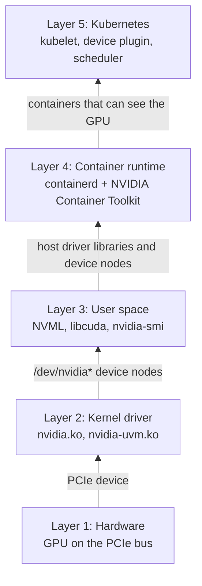

## Scenario

A small AI team is about to deploy its first model on Kubernetes, on a node with a single NVIDIA T4. Before deploying anything, they need to make sure the GPU environment on this node works, from the hardware and driver up to the container runtime and Kubernetes.

In this chapter you check the node one layer at a time, starting from the hardware.

## What You'll Understand

- The 5 layers a GPU passes through on its way from hardware to a Kubernetes Pod
- Why each layer is checked only through the interface the layer below exposes
- Why a container cannot use the GPU without the NVIDIA Container Toolkit, even when `nvidia-smi` works on the host
- Why the node has no `nvidia.com/gpu` capacity at the end of this chapter

## Starting State

This workshop does not build a cluster from scratch. It starts from a node in the following state:

| Layer | Expected state |
| --- | --- |
| Hardware | One node with an NVIDIA GPU. The workshop uses a T4. Any non-MIG NVIDIA GPU works. |
| Kernel driver and user space | The NVIDIA driver is installed on the host, and `nvidia-smi` works on the host. |
| Container runtime | containerd, with the NVIDIA Container Toolkit installed and `nvidia` set as the default runtime. |
| Kubernetes | A working cluster, the GPU node `Ready` and schedulable. |
| Device plugin | **None.** No NVIDIA device plugin and no HAMi on the GPU node. |

Chapter 2 installs the native NVIDIA device plugin to show what Kubernetes does without HAMi, and Chapter 4 replaces it with HAMi. Only one device plugin may register `nvidia.com/gpu` on a node, so the GPU node runs no device plugin when the workshop starts.

If you don't have such a node yet, prepare one by following [Prepare NVIDIA GPU nodes: Install the driver and Toolkit on the host](/docs/installation/prerequisites#install-the-driver-and-toolkit-on-the-host). The workshop was verified on this setup.

## Environment Baseline

This chapter was verified with the versions below. Later chapters build on this node.

| Component                | Version                                                           |
| ------------------------ | ----------------------------------------------------------------- |
| Node                     | Tencent Cloud `GN7.2XLARGE32` (8 vCPU, 32 GiB) with one NVIDIA T4 |
| Operating system         | Ubuntu 24.04.4 LTS                                                |
| Kernel                   | 6.8.0-138-generic                                                 |
| NVIDIA driver            | 580.126.20 (open kernel module)                                   |
| CUDA (driver-supported)  | 13.0                                                              |
| containerd               | 2.2.1                                                             |
| NVIDIA Container Toolkit | 1.20.1                                                            |
| Kubernetes               | v1.36.5                                                           |
| HAMi                     | not installed yet (Chapter 4)                                     |

All commands below run as root on the GPU node, except the `kubectl` commands, which can run anywhere with access to the cluster.

## See the Problem First

Run `nvidia-smi` on the host:

```bash
nvidia-smi -L
```

```plaintext
GPU 0: Tesla T4 (UUID: GPU-caf9bd30-b03c-04d8-9d4f-8a02f984cc23)
```

The host sees the GPU. Next, run the same command inside a CUDA container. First pull the image:

```bash
ctr image pull docker.io/nvidia/cuda:12.4.1-base-ubuntu22.04
```

Then start the container directly through containerd, with the plain `runc` runtime:

```bash
ctr run --rm docker.io/nvidia/cuda:12.4.1-base-ubuntu22.04 gpu-test nvidia-smi -L
```

```plaintext
ctr: failed to create shim task: OCI runtime create failed: runc create failed: unable to start container process: error during container init: exec: "nvidia-smi": executable file not found in $PATH
```

`nvidia-smi` is not found in the container. The image contains the CUDA runtime, but the driver's user-space libraries, `nvidia-smi`, and the `/dev/nvidia*` device nodes are missing. They are installed on the host with the driver and must match the kernel module loaded there, which is why images do not include them. A container started with plain `runc` cannot see them.

For a container to use the GPU, a component has to bring these files from the host into the container. The next section shows where that component sits in the GPU stack.

## The Principle: Five Layers, Checked Bottom Up

A GPU reaches a Pod through 5 layers. Each layer only sees what the layer below exposes:



The problem above sits between Layer 3 and Layer 4: the driver files are on the host but did not reach the container. The checks in this chapter follow two rules:

- **Check from the bottom up.** A failure at a lower layer also breaks every layer above it. A Pod that cannot see its GPU may have a driver problem, a runtime problem, or a scheduling problem. Start with Layer 1, and when a layer fails, stop there and fix it.
- **Use a check that depends only on the layer below.** `lspci` uses only the PCIe bus, `lsmod` only the kernel, and `nvidia-smi` only the driver, so each failed check points to one layer.

The layers are described in more detail in [GPU Software Stack Overview](/docs/core-concepts/gpu-stack).

## Step 1: Layer 1, Hardware

Is there an NVIDIA GPU on the PCIe bus?

```bash
lspci | grep -i nvidia
```

```plaintext
00:08.0 3D controller: NVIDIA Corporation TU104GL [Tesla T4] (rev a1)
```

`lspci` reads the PCIe bus directly and does not depend on the NVIDIA driver. It works even before the driver is installed.

## Step 2: Layer 2, Kernel Driver

The kernel driver manages the GPU hardware. Check that its modules are loaded:

```bash
lsmod | grep nvidia
```

```plaintext
nvidia_uvm           2166784  4
nvidia_drm            139264  0
nvidia_modeset       1814528  1 nvidia_drm
nvidia              14409728  15 nvidia_uvm,nvidia_modeset
video                  77824  1 nvidia_modeset
ecc                    45056  1 nvidia
```

`nvidia` is the core module, and `nvidia_uvm` provides the unified memory that CUDA needs. The modules and their dependencies are explained in [Understanding GPU Drivers](/docs/core-concepts/gpu-driver).

The driver exposes the GPU to user space as device files. Check that they exist:

```bash
ls -l /dev/nvidia*
```

```plaintext
crw-rw-rw- 1 root root 195,   0 Oct  6 23:36 /dev/nvidia0
crw-rw-rw- 1 root root 195, 255 Oct  6 23:36 /dev/nvidiactl
crw-rw-rw- 1 root root 195, 254 Oct  6 23:36 /dev/nvidia-modeset
crw-rw-rw- 1 root root 237,   0 Oct  6 23:37 /dev/nvidia-uvm
crw-rw-rw- 1 root root 237,   1 Oct  6 23:37 /dev/nvidia-uvm-tools

/dev/nvidia-caps:
total 0
cr-------- 1 root root 240, 1 Oct  6 23:37 nvidia-cap1
cr--r--r-- 1 root root 240, 2 Oct  6 23:37 nvidia-cap2
```

`/dev/nvidiactl` is the control device, `/dev/nvidia0` is the first GPU, and `/dev/nvidia-uvm` belongs to the unified memory module. Programs above the kernel reach the GPU through these files. Step 4 checks that they also appear inside a container.

Check the version of the loaded kernel module:

```bash
cat /proc/driver/nvidia/version
```

```plaintext
NVRM version: NVIDIA UNIX Open Kernel Module for x86_64  580.126.20  Release Build  (dvs-builder@U22-I3-AF03-29-4)  Wed Feb 18 05:37:09 UTC 2026
GCC version:  gcc version 13.3.0 (Ubuntu 13.3.0-6ubuntu2~24.04.1)
```

## Step 3: Layer 3, User-Space Libraries and Tools

User-space programs reach the kernel module through libraries such as NVML (`libnvidia-ml.so`) and the CUDA driver library (`libcuda.so`). `nvidia-smi` is a thin command-line front end for NVML, so it can be used to check this layer:

```bash
nvidia-smi
```

```plaintext
Tue Oct  6 23:52:23 2026
+-----------------------------------------------------------------------------------------+
| NVIDIA-SMI 580.126.20             Driver Version: 580.126.20     CUDA Version: 13.0     |
+-----------------------------------------+------------------------+----------------------+
| GPU  Name                 Persistence-M | Bus-Id          Disp.A | Volatile Uncorr. ECC |
| Fan  Temp   Perf          Pwr:Usage/Cap |           Memory-Usage | GPU-Util  Compute M. |
|                                         |                        |               MIG M. |
|=========================================+========================+======================|
|   0  Tesla T4                       On  |   00000000:00:08.0 Off |                  Off |
| N/A   33C    P8             15W /   70W |       0MiB /  16384MiB |      0%      Default |
|                                         |                        |                  N/A |
+-----------------------------------------+------------------------+----------------------+

+-----------------------------------------------------------------------------------------+
| Processes:                                                                              |
|  GPU   GI   CI              PID   Type   Process name                        GPU Memory |
|        ID   ID                                                               Usage      |
|=========================================================================================|
|  No running processes found                                                             |
+-----------------------------------------------------------------------------------------+
```

Read three things from this output:

- **Driver Version**: must match the version in `/proc/driver/nvidia/version` from Step 2.
- **CUDA Version**: the highest CUDA version this driver supports. It does not mean a CUDA toolkit is installed on the host. Containers bring their own CUDA runtime, and the driver only has to be new enough for it. The image used in this chapter ships CUDA 12.4, which is lower than 13.0 and runs on this driver.
- **Memory-Usage**: this T4 has 16384 MiB in total. Note the number. In Chapter 4, a container sees less memory than this.

Then check where the libraries live:

```bash
ldconfig -p | grep -E 'libnvidia-ml.so|libcuda.so'
```

```plaintext
        libnvidia-ml.so.1 (libc6,x86-64) => /lib/x86_64-linux-gnu/libnvidia-ml.so.1
        libnvidia-ml.so (libc6,x86-64) => /lib/x86_64-linux-gnu/libnvidia-ml.so
        libcuda.so.1 (libc6,x86-64) => /lib/x86_64-linux-gnu/libcuda.so.1
        libcuda.so (libc6,x86-64) => /lib/x86_64-linux-gnu/libcuda.so
```

In Step 4, the container runtime brings these libraries into the container.

## Step 4: Layer 4, Container Runtime

The kubelet starts containers through the Container Runtime Interface (CRI), and containerd is the runtime here. The NVIDIA Container Toolkit plugs into that runtime: it installs `nvidia-container-runtime`, a thin wrapper around `runc`. When a container asks for GPUs, through the `NVIDIA_VISIBLE_DEVICES` environment variable, `nvidia-container-runtime` injects the host's device nodes from Step 2 and libraries from Step 3 into the container before it starts.

### 4.1 Check the containerd runtime configuration

```bash
containerd config dump | grep -E 'default_runtime_name|BinaryName'
```

```plaintext
      default_runtime_name = 'nvidia'
            BinaryName = '/usr/bin/nvidia-container-runtime'
            BinaryName = ''
```

Look for two things:

- `default_runtime_name = 'nvidia'`: every container the kubelet creates goes through the NVIDIA wrapper. If a container does not set `NVIDIA_VISIBLE_DEVICES`, the wrapper just calls `runc` and injects no GPU. The device plugins in Chapter 2 and Chapter 4 rely on this.
- `BinaryName = '/usr/bin/nvidia-container-runtime'`: the `nvidia` runtime points at the wrapper. The second, empty `BinaryName` belongs to the default `runc` runtime.

> NVIDIA's CUDA images, including the `nvidia/cuda` and `pytorch/pytorch` images used in this workshop, set `NVIDIA_VISIBLE_DEVICES=all` themselves. With `nvidia` as the default runtime, a Pod using such an image can see every GPU on the node without requesting one, which bypasses scheduling. The [NVIDIA device plugin configuration options](https://github.com/NVIDIA/k8s-device-plugin#configuration-option-details) describe passing the device list through volume mounts or CDI instead of this environment variable.

### 4.2 Run the container again, through the NVIDIA runtime

Repeat the experiment from the beginning of the chapter. `ctr` talks to containerd directly and does not use the CRI default runtime, so point it at the NVIDIA wrapper explicitly and ask for all GPUs:

```bash
ctr run --rm \
    --runc-binary=/usr/bin/nvidia-container-runtime \
    --env NVIDIA_VISIBLE_DEVICES=all \
    docker.io/nvidia/cuda:12.4.1-base-ubuntu22.04 gpu-test nvidia-smi -L
```

```plaintext
GPU 0: Tesla T4 (UUID: GPU-caf9bd30-b03c-04d8-9d4f-8a02f984cc23)
```

The same image now lists the T4. To see what the runtime added, list the device nodes and libraries inside the container:

```bash
ctr run --rm \
    --runc-binary=/usr/bin/nvidia-container-runtime \
    --env NVIDIA_VISIBLE_DEVICES=all \
    docker.io/nvidia/cuda:12.4.1-base-ubuntu22.04 gpu-test \
    sh -c 'ls -l /dev/nvidia*; ldconfig -p | grep -E "libnvidia-ml.so|libcuda.so"'
```

```plaintext
crw-rw-rw- 1 root root 195, 254 Oct  6 15:52 /dev/nvidia-modeset
crw-rw-rw- 1 root root 237,   0 Oct  6 15:52 /dev/nvidia-uvm
crw-rw-rw- 1 root root 237,   1 Oct  6 15:52 /dev/nvidia-uvm-tools
crw-rw-rw- 1 root root 195,   0 Oct  6 15:52 /dev/nvidia0
crw-rw-rw- 1 root root 195, 255 Oct  6 15:52 /dev/nvidiactl
        libnvidia-ml.so.1 (libc6,x86-64) => /lib/x86_64-linux-gnu/libnvidia-ml.so.1
        libnvidia-ml.so (libc6,x86-64) => /lib/x86_64-linux-gnu/libnvidia-ml.so
        libcuda.so.1 (libc6,x86-64) => /lib/x86_64-linux-gnu/libcuda.so.1
        libcuda.so (libc6,x86-64) => /lib/x86_64-linux-gnu/libcuda.so
```

The device nodes from Step 2 and the libraries from Step 3 are now inside the container.

Clean up the test image:

```bash
ctr image rm docker.io/nvidia/cuda:12.4.1-base-ubuntu22.04
```

## Step 5: Layer 5, Kubernetes

### 5.1 Check that the node is Ready

```bash
kubectl get nodes -o wide
```

```plaintext
NAME            STATUS   ROLES           AGE    VERSION   INTERNAL-IP   EXTERNAL-IP   OS-IMAGE             KERNEL-VERSION              CONTAINER-RUNTIME
vm-0-4-ubuntu   Ready    control-plane   119s   v1.36.5   10.203.0.4    <none>        Ubuntu 24.04.4 LTS   6.8.0-138-generic (amd64)   containerd://2.2.1
```

The `CONTAINER-RUNTIME` column should show `containerd`, the runtime you checked in Step 4.

### 5.2 Look at the GPU from Kubernetes' point of view

```bash
kubectl get node <gpu-node-name> -o jsonpath='{.status.capacity}' ; echo
```

```plaintext
{"cpu":"8","ephemeral-storage":"206296376Ki","hugepages-1Gi":"0","hugepages-2Mi":"0","memory":"32472900Ki","pods":"110"}
```

The capacity lists CPU, memory, and Pods, but no `nvidia.com/gpu`. Layers 1 to 4 pass their checks, but the kubelet only reports resources it knows about, and no component has registered the GPU with it. Kubernetes cannot schedule a Pod onto a GPU it does not know about. Chapter 2 adds a device plugin to register it.

## Verify

| Claim | Evidence |
| --- | --- |
| The GPU is attached to the node | Step 1: `lspci` lists an NVIDIA device |
| The kernel driver owns the GPU | Step 2: `nvidia` modules loaded, `/dev/nvidia*` present |
| User space can reach the GPU through the driver | Step 3: `nvidia-smi` shows the T4, and its driver version matches the kernel module |
| A plain container cannot see the GPU | See the Problem First: `nvidia-smi` not found with plain `runc` |
| The NVIDIA runtime makes the GPU visible to containers | Step 4: the same image sees the T4, with device nodes and libraries injected |
| Kubernetes is healthy but GPU-unaware | Step 5: node `Ready`, no `nvidia.com/gpu` in capacity |

## Common Pitfalls

The pitfalls below are grouped by layer.

**Layer 2: `lsmod` shows no `nvidia` module.** The driver is not loaded. Check `dmesg | grep -i nvidia`. Common causes are a missing reboot after installing the driver, Secure Boot rejecting the unsigned module, the inbox `nouveau` driver holding the GPU, or a kernel upgrade the driver was not rebuilt for.

**Layer 3: `nvidia-smi` reports `Driver/library version mismatch`.** The user-space libraries were upgraded but the old kernel module is still loaded. Compare Step 2's `/proc/driver/nvidia/version` with the libraries, then reboot the machine or reload the driver modules so the new version takes effect.

**Layer 4: containers still cannot see the GPU.** containerd was not restarted after `nvidia-ctk runtime configure`, or `nvidia` is not the default runtime. Check `default_runtime_name` in Step 4.1.

**Layer 5: the node already has `nvidia.com/gpu`.** A device plugin is already running. Find it with `kubectl get daemonsets -A` and remove or disable it.

## Checkpoint

<details>
<summary>1. `nvidia-smi` works on the host, but not inside a plain container. Which layer is missing, and what fills it?</summary>

Layer 4. A plain container does not get the host's driver libraries or `/dev/nvidia*` device nodes. The NVIDIA Container Toolkit's runtime wrapper injects them when a container asks for GPUs.

</details>

<details>
<summary>2. `nvidia-smi` shows `CUDA Version: 13.0`. Does that mean CUDA 13.0 is installed on the host?</summary>

No. It is the highest CUDA version the installed driver supports. The CUDA runtime comes with each container image, and it must be no newer than what the driver supports.

</details>

<details>
<summary>3. Why start the checks at the hardware layer?</summary>

A failure at a low layer also breaks every layer above it. Starting at the bottom, the first failed check shows which layer to fix.

</details>

<details>
<summary>4. At the end of this chapter, can a Pod request `nvidia.com/gpu: 1`? Why?</summary>

No. No component has registered the GPU with the kubelet, so the node's capacity has no `nvidia.com/gpu` and such a Pod stays `Pending`. Advertising the GPU to Kubernetes is the job of a device plugin, which Chapter 2 introduces.

</details>

## Hand-off

Chapter 2 continues on this node. It expects:

- The GPU node passes every check in Steps 1 to 5
- `nvidia` is containerd's default runtime
- No device plugin is installed, so the node has no `nvidia.com/gpu` capacity

## Further Reading

- [GPU Software Stack Overview](/docs/core-concepts/gpu-stack): the 5 layers in detail
- [Understanding GPU Drivers](/docs/core-concepts/gpu-driver): kernel modules, NVML, and bottom-up troubleshooting
- [Prerequisites](/docs/installation/prerequisites): how to prepare NVIDIA GPU nodes for HAMi
