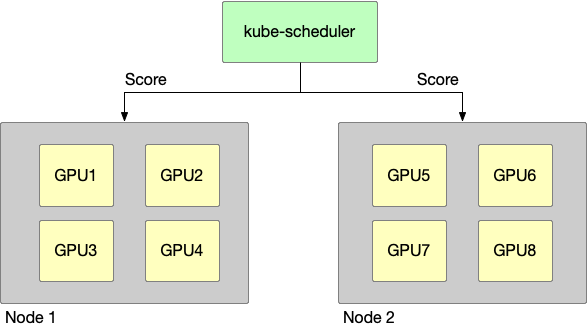
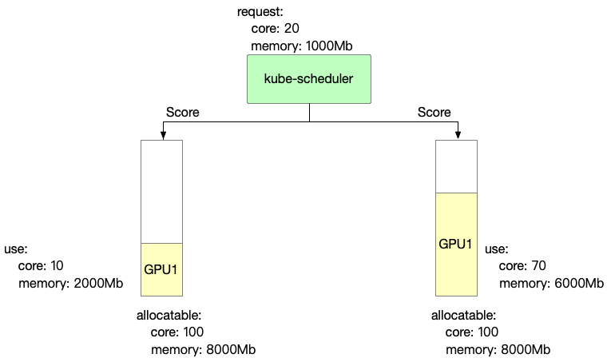

## Summary

Current in a cluster with many GPU nodes, nodes are not `binpack` or `spread` when making scheduling decisions, nor are GPU cards `binpack` or `spread` when using vGPU.

## Proposal

We add a `node-scheduler-policy` and `gpu-scheduler-policy` to config, then scheduler to use this policy can impl node `binpack` or `spread` or GPU `binpack` or `spread`. and
use can set Pod annotation to change this default policy, use `hami.io/node-scheduler-policy` and `hami.io/gpu-scheduler-policy` to overlay scheduler config.

### User Stories

This is a GPU cluster, having two node, the following story takes this cluster as a prerequisite.



#### Story 1

node binpack, use one node’s GPU card whenever possible, egs:
- cluster resources:
  - node1: GPU having 4 GPU device
  - node2: GPU having 4 GPU device

- request:
  - pod1: User 1 GPU
  - pod2: User 1 GPU

- scheduler result:
  - pod1: scheduler to node1
  - pod2: scheduler to node1

#### Story 2

node spread, use GPU cards from different nodes as much as possible, egs:

- cluster resources:
    - node1: GPU having 4 GPU device
    - node2: GPU having 4 GPU device

- request:
    - pod1: User 1 GPU
    - pod2: User 1 GPU

- scheduler result:
    - pod1: scheduler to node1
    - pod2: scheduler to node2

#### Story 3

GPU binpack, use the same GPU card as much as possible, egs:

- cluster resources:
    - node1: GPU having 4 GPU device, they are GPU1,GPU2,GPU3,GPU4

- request:
    - pod1: User 1 GPU, gpucore is 20%, gpumem-percentage is 20% 
    - pod2: User 1 GPU, gpucore is 20%, gpumem-percentage is 20%

- scheduler result:
    - pod1: scheduler to node1, select GPU1 this device
    - pod2: scheduler to node1, select GPU1 this device

#### Story 4

GPU spread, use different GPU cards when possible, egs:

- cluster resources:
    - node1: GPU having 4 GPU device, they are GPU1,GPU2,GPU3,GPU4

- request:
    - pod1: User 1 GPU, gpucore is 20%, gpumem-percentage is 20%
    - pod2: User 1 GPU, gpucore is 20%, gpumem-percentage is 20%

- scheduler result:
    - pod1: scheduler to node1, select GPU1 this device
    - pod2: scheduler to node1, select GPU2 this device

## Design Details

### Node-scheduler-policy


#### Binpack

Binpack mainly considers node resource usage. The more full the usage, the higher the score.

```
score: ((request + used) / allocatable) * 10 
```

1. Binpack scoring information for Node 1 is as follows

```
Node1 score: ((1+3)/4) * 10= 10
```

2. Binpack scoring information for Node 2 is as follows

```
Node2 score: ((1+2)/4) * 10= 7.5
```

So, in `Binpack` policy we can select `Node1`.

#### Spread

Spread mainly considers node resource usage. The less it is used, the higher the score.

```
score: ((request + used) / allocatable) * 10 
```

1. Spread scoring information for Node 1 is as follows
```
Node1 score: ((1+3)/4) * 10= 10
```

2. Spread scoring information for Node 2 is as follows
```
Node2 score: ((1+2)/4) * 10= 7.5
```

So, in `Spread` policy we can select `Node2`.

### GPU-scheduler-policy



#### Binpack

Binpack mainly focuses on the computing power and video memory usage of each card. The more it is used, the higher the score.
```
score: ((request.core + used.core) / allocatable.core + (request.mem + used.mem) / allocatable.mem)) * 10
```

1. Binpack scoring information for GPU 1 is as follows
```
GPU1 Score: ((20+10)/100 + (1000+2000)/8000)) * 10 = 6.75
```

2. Binpack scoring information for GPU 2 is as follows
```
GPU2 Score: ((20+70)/100 + (1000+6000)/8000)) * 10 = 17.75
```

So, in `Binpack` policy we can select `GPU2`.

#### Spread

Spread mainly focuses on the computing power and video memory usage of each card. The less it is used, the higher the score.
```
score: ((request.core + used.core) / allocatable.core + (request.mem + used.mem) / allocatable.mem)) * 10
```

1. Spread scoring information for GPU 1 is as follows
```
GPU1 Score: ((20+10)/100 + (1000+2000)/8000)) * 10 = 6.75
```

2. Spread scoring information for GPU 2 is as follows
```
GPU2 Score: ((20+70)/100 + (1000+6000)/8000)) * 10 = 17.75
```

So, in `Spread` policy we can select `GPU1`.